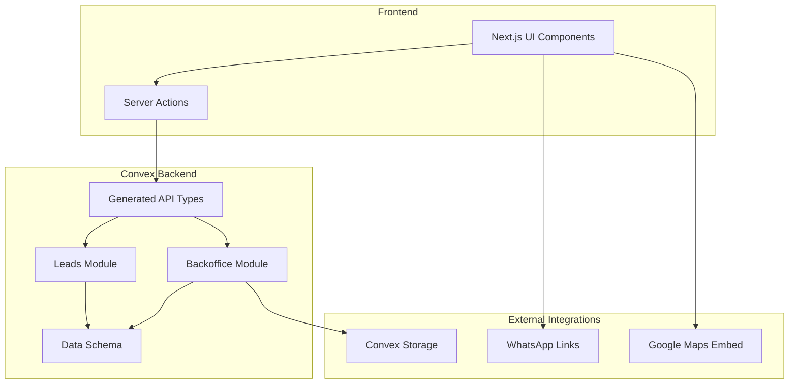
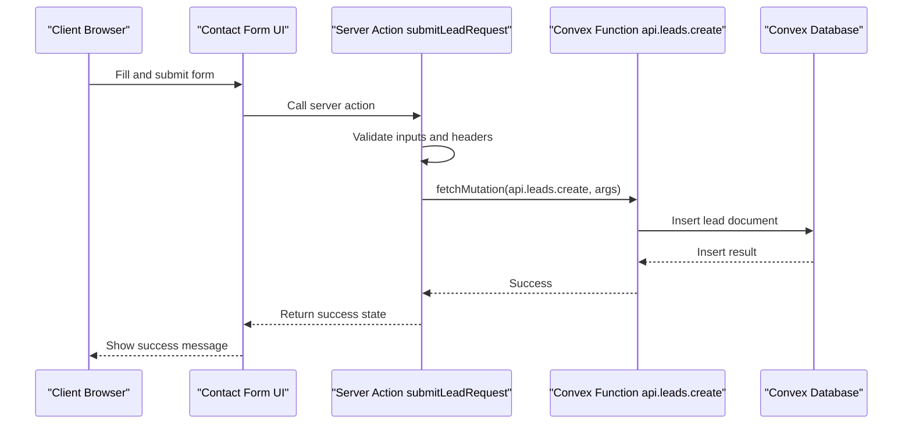
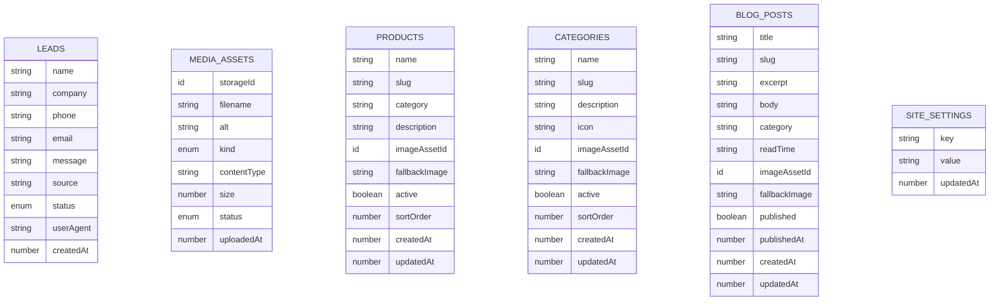
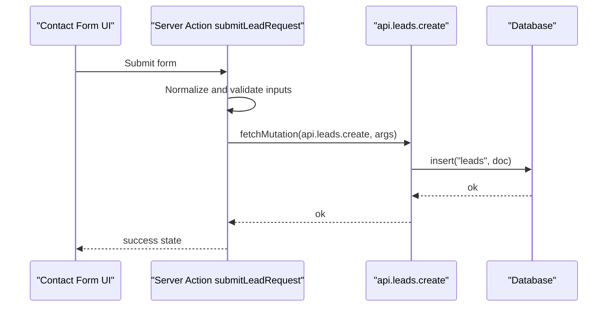
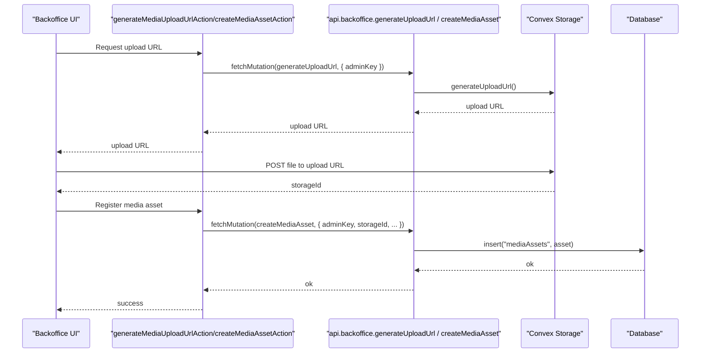
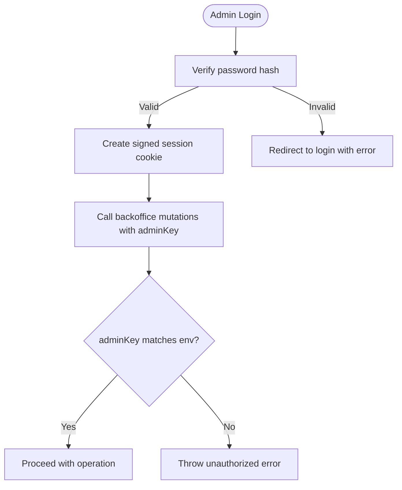
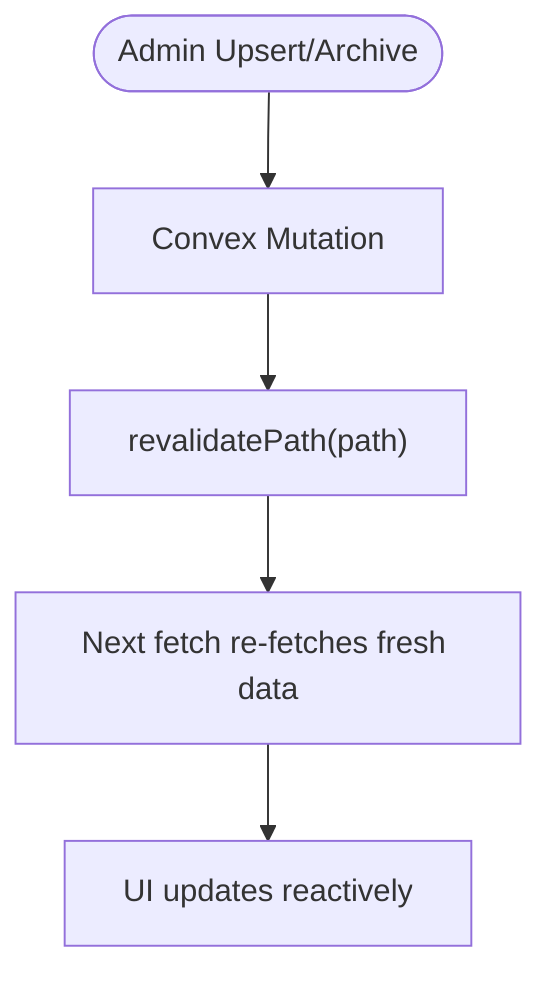
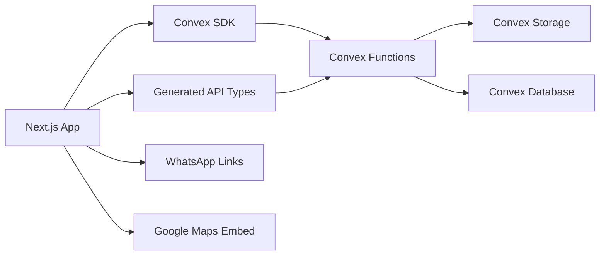

# API Integration & Services

<cite>
**Referenced Files in This Document**
- [schema.ts](file://convex/schema.ts)
- [leads.ts](file://convex/leads.ts)
- [backoffice.ts](file://convex/backoffice.ts)
- [api.d.ts](file://convex/_generated/api.d.ts)
- [server.d.ts](file://convex/_generated/server.d.ts)
- [lead-actions.ts](file://app/actions/lead-actions.ts)
- [backoffice-auth.ts](file://lib/backoffice-auth.ts)
- [backoffice-data.ts](file://lib/backoffice-data.ts)
- [actions.ts](file://app/backoffice/actions.ts)
- [media-upload-form.tsx](file://components/backoffice/media-upload-form.tsx)
- [next.config.ts](file://next.config.ts)
- [CONVEX.md](file://docs/CONVEX.md)
- [package.json](file://package.json)
</cite>

## Table of Contents
1. [Introduction](#introduction)
2. [Project Structure](#project-structure)
3. [Core Components](#core-components)
4. [Architecture Overview](#architecture-overview)
5. [Detailed Component Analysis](#detailed-component-analysis)
6. [Dependency Analysis](#dependency-analysis)
7. [Performance Considerations](#performance-considerations)
8. [Troubleshooting Guide](#troubleshooting-guide)
9. [Conclusion](#conclusion)
10. [Appendices](#appendices)

## Introduction
This document provides comprehensive API integration documentation for the Convex backend services and external integrations. It covers:
- Convex API endpoints (queries and mutations) with parameter schemas and response characteristics
- Server action implementation patterns for secure data processing and form handling
- Real-time data synchronization and revalidation patterns
- External service integrations (WhatsApp links, Google Maps embedding)
- Authentication mechanisms and security considerations
- Media asset management via Convex Storage
- Webhook/event-driven architecture notes
- Error handling, retry strategies, and monitoring approaches
- Versioning and backward compatibility considerations
- Integration examples and troubleshooting guidance

## Project Structure
The project follows a layered structure:
- Frontend Next.js application with server actions and client components
- Convex backend modules defining typed APIs, queries, and mutations
- Utility libraries for authentication and data fetching
- Generated Convex API bindings for type-safe client calls

**Diagram sources**
- [schema.ts:1-87](file://convex/schema.ts#L1-L87)
- [leads.ts:1-32](file://convex/leads.ts#L1-L32)
- [backoffice.ts:1-385](file://convex/backoffice.ts#L1-L385)
- [api.d.ts:1-52](file://convex/_generated/api.d.ts#L1-L52)
- [server.d.ts:1-144](file://convex/_generated/server.d.ts#L1-L144)

**Section sources**
- [schema.ts:1-87](file://convex/schema.ts#L1-L87)
- [api.d.ts:1-52](file://convex/_generated/api.d.ts#L1-L52)
- [server.d.ts:1-144](file://convex/_generated/server.d.ts#L1-L144)

## Core Components
- Convex schema defines tables and indexes for leads, media assets, products, categories, blog posts, and site settings.
- Leads module exposes a mutation to create lead entries and a query to fetch recent leads.
- Backoffice module exposes admin-only queries and mutations for content management, media asset lifecycle, and settings.
- Generated API types provide strongly-typed references to public Convex functions.
- Server actions encapsulate form submission and admin operations with validation and revalidation.

**Section sources**
- [schema.ts:1-87](file://convex/schema.ts#L1-L87)
- [leads.ts:1-32](file://convex/leads.ts#L1-L32)
- [backoffice.ts:1-385](file://convex/backoffice.ts#L1-L385)
- [api.d.ts:1-52](file://convex/_generated/api.d.ts#L1-L52)
- [server.d.ts:1-144](file://convex/_generated/server.d.ts#L1-L144)
- [lead-actions.ts:1-96](file://app/actions/lead-actions.ts#L1-L96)
- [actions.ts:1-215](file://app/backoffice/actions.ts#L1-L215)

## Architecture Overview
The system integrates a Next.js frontend with Convex backend functions. Server actions orchestrate client-server interactions, while Convex functions handle data persistence and retrieval. Media assets are stored via Convex Storage and exposed through signed or public URLs depending on visibility rules.

**Diagram sources**
- [lead-actions.ts:32-95](file://app/actions/lead-actions.ts#L32-L95)
- [leads.ts:7-24](file://convex/leads.ts#L7-L24)

**Section sources**
- [lead-actions.ts:1-96](file://app/actions/lead-actions.ts#L1-L96)
- [leads.ts:1-32](file://convex/leads.ts#L1-L32)

## Detailed Component Analysis

### Convex Schema and Data Model
The schema defines:
- Leads table with indexing on status and creation time
- Media assets with kind and status indexing
- Products and categories with active/sort ordering indexes
- Blog posts with published ordering and slug uniqueness
- Site settings keyed by key

**Diagram sources**
- [schema.ts:4-86](file://convex/schema.ts#L4-L86)

**Section sources**
- [schema.ts:1-87](file://convex/schema.ts#L1-L87)

### Leads API
- Endpoint: api.leads.create (mutation)
  - Purpose: Persist a new lead with normalized fields and metadata
  - Parameters:
    - name: string
    - company: optional string
    - phone: string
    - email: optional string
    - message: string
    - source: string
    - userAgent: optional string
  - Behavior: Inserts a new lead with status "new" and current timestamp
  - Response: Insert result identifier
- Endpoint: api.leads.recent (query)
  - Purpose: Retrieve most recent leads
  - Parameters: none
  - Behavior: Queries leads ordered by createdAt descending with a cap
  - Response: Array of lead documents

**Diagram sources**
- [leads.ts:7-31](file://convex/leads.ts#L7-L31)
- [lead-actions.ts:74-83](file://app/actions/lead-actions.ts#L74-L83)

**Section sources**
- [leads.ts:1-32](file://convex/leads.ts#L1-L32)
- [lead-actions.ts:1-96](file://app/actions/lead-actions.ts#L1-L96)

### Backoffice API
Admin-only endpoints for content management and media operations:
- Media upload and registration
  - api.backoffice.generateUploadUrl (mutation): Returns a pre-signed upload URL for Convex Storage
  - api.backoffice.createMediaAsset (mutation): Registers a media asset after upload
  - api.backoffice.archiveMediaAsset (mutation): Archives an asset by status
  - api.backoffice.mediaList (query): Lists recent media assets with resolved URLs
- Content management
  - api.backoffice.dashboard (query): Aggregated counts and recent items
  - api.backoffice.leadList (query): Recent leads
  - api.backoffice.updateLeadStatus (mutation): Updates lead status
  - api.backoffice.contentLists (query): Aggregated lists for media, products, categories, blog posts, and settings
  - Upsert operations: api.backoffice.upsertProduct, api.backoffice.upsertCategory, api.backoffice.upsertBlogPost
  - Settings: api.backoffice.upsertSetting
- Public content exposure
  - api.backoffice.publicContent (query): Returns curated public content with resolved image URLs

**Diagram sources**
- [backoffice.ts:68-118](file://convex/backoffice.ts#L68-L118)
- [actions.ts:79-108](file://app/backoffice/actions.ts#L79-L108)
- [media-upload-form.tsx:47-77](file://components/backoffice/media-upload-form.tsx#L47-L77)

**Section sources**
- [backoffice.ts:1-385](file://convex/backoffice.ts#L1-L385)
- [actions.ts:1-215](file://app/backoffice/actions.ts#L1-L215)
- [media-upload-form.tsx:1-114](file://components/backoffice/media-upload-form.tsx#L1-L114)

### Authentication and Authorization
- Backoffice session management:
  - HttpOnly, SameSite lax, secure in production cookies
  - HMAC signature verification for integrity
  - Expiration-based validation
- Admin key enforcement:
  - All backoffice mutations require BACKOFFICE_API_KEY
- Frontend environment:
  - NEXT_PUBLIC_CONVEX_URL must be configured for client-side Convex calls
- External integrations:
  - WhatsApp links and Google Maps embeds are configured in CSP

**Diagram sources**
- [backoffice-auth.ts:60-128](file://lib/backoffice-auth.ts#L60-L128)
- [backoffice.ts:25-31](file://convex/backoffice.ts#L25-L31)
- [actions.ts:63-77](file://app/backoffice/actions.ts#L63-L77)

**Section sources**
- [backoffice-auth.ts:1-129](file://lib/backoffice-auth.ts#L1-L129)
- [backoffice.ts:1-385](file://convex/backoffice.ts#L1-L385)
- [actions.ts:1-215](file://app/backoffice/actions.ts#L1-L215)

### Real-Time Data Synchronization and Revalidation
- Next.js revalidation:
  - After content updates, server actions trigger revalidatePath for affected routes
  - Ensures client-side cache refresh without manual polling
- Reactive pattern:
  - Queries return deterministic snapshots; revalidation drives updates

**Diagram sources**
- [actions.ts:130-151](file://app/backoffice/actions.ts#L130-L151)
- [actions.ts:153-174](file://app/backoffice/actions.ts#L153-L174)
- [actions.ts:176-199](file://app/backoffice/actions.ts#L176-L199)
- [actions.ts:201-214](file://app/backoffice/actions.ts#L201-L214)

**Section sources**
- [actions.ts:1-215](file://app/backoffice/actions.ts#L1-L215)

### External Service Integrations
- WhatsApp integration:
  - Links constructed with wa.me using configured site phone number
  - Embedded in UI and footers
- Google Maps integration:
  - Embedded iframe in footer for address
  - CSP allows maps domains
- Media assets:
  - Convex Storage used for uploads; URLs resolved per asset status and visibility rules

**Section sources**
- [media-upload-form.tsx:1-114](file://components/backoffice/media-upload-form.tsx#L1-L114)
- [next.config.ts:8-25](file://next.config.ts#L8-L25)

### API Error Handling, Retry, and Monitoring
- Client-side error handling:
  - Form actions return structured state with status and messages
  - Fallback messaging for transient failures
- Backend error handling:
  - Validation throws early on malformed inputs
  - Unauthorized errors on missing or mismatched admin keys
- Retry strategies:
  - Not implemented in code; recommend exponential backoff at client level for transient network/storage errors
- Monitoring:
  - No dedicated telemetry; suggest adding logging around mutations and actions for auditability

**Section sources**
- [lead-actions.ts:32-95](file://app/actions/lead-actions.ts#L32-L95)
- [backoffice.ts:25-31](file://convex/backoffice.ts#L25-L31)
- [CONVEX.md:50-59](file://docs/CONVEX.md#L50-L59)

### API Versioning and Backward Compatibility
- Current state:
  - No explicit versioning scheme detected
  - Generated API types indicate a single module surface
- Recommendations:
  - Introduce a version prefix in function names or a separate module namespace
  - Maintain backward-compatible schemas and soft-deprecate fields
  - Keep generated types stable and avoid breaking changes to public signatures

**Section sources**
- [api.d.ts:20-51](file://convex/_generated/api.d.ts#L20-L51)
- [package.json:14-13](file://package.json#L14-L13)

## Dependency Analysis
- Frontend depends on:
  - Convex client SDK for Next.js
  - Generated API types for type-safe calls
  - Environment variables for Convex endpoint and admin secrets
- Backend depends on:
  - Convex server builders for typed functions
  - Storage service for media uploads
  - Database for CRUD operations
- External dependencies:
  - WhatsApp and Google Maps via CSP and static links

**Diagram sources**
- [api.d.ts:1-52](file://convex/_generated/api.d.ts#L1-L52)
- [server.d.ts:1-144](file://convex/_generated/server.d.ts#L1-L144)
- [next.config.ts:8-25](file://next.config.ts#L8-L25)

**Section sources**
- [api.d.ts:1-52](file://convex/_generated/api.d.ts#L1-L52)
- [server.d.ts:1-144](file://convex/_generated/server.d.ts#L1-L144)
- [next.config.ts:1-25](file://next.config.ts#L1-L25)

## Performance Considerations
- Index usage:
  - Leads indexed by createdAt for efficient recent queries
  - Media assets indexed by status and upload time for pagination
  - Products/categories indexed by active and sort order for listings
- Batch operations:
  - Backoffice dashboard uses Promise.all to parallelize multiple reads
- Storage:
  - Pre-signed uploads minimize server bandwidth
- Client caching:
  - Revalidation ensures freshness without excessive polling

**Section sources**
- [schema.ts:16-17](file://convex/schema.ts#L16-L17)
- [schema.ts:35-36](file://convex/schema.ts#L35-L36)
- [schema.ts:49](file://convex/schema.ts#L49)
- [schema.ts:63](file://convex/schema.ts#L63)
- [backoffice.ts:125-131](file://convex/backoffice.ts#L125-L131)

## Troubleshooting Guide
- Convex not configured:
  - Symptom: Form action reports missing NEXT_PUBLIC_CONVEX_URL
  - Resolution: Set environment variable and redeploy
- Unauthorized backoffice request:
  - Symptom: Error thrown when adminKey does not match
  - Resolution: Verify BACKOFFICE_API_KEY and session cookie integrity
- Upload failures:
  - Symptom: Upload URL generation or media registration fails
  - Resolution: Check file type, size limits, and storage permissions
- Missing image URLs:
  - Symptom: Images do not render in public content
  - Resolution: Ensure asset status is active and storage URL is resolvable

**Section sources**
- [lead-actions.ts:44-49](file://app/actions/lead-actions.ts#L44-L49)
- [backoffice.ts:25-31](file://convex/backoffice.ts#L25-L31)
- [media-upload-form.tsx:11-42](file://components/backoffice/media-upload-form.tsx#L11-L42)
- [backoffice.ts:33-45](file://convex/backoffice.ts#L33-L45)

## Conclusion
This project integrates a robust, typed Convex backend with a Next.js frontend using server actions for secure, validated data processing. Media assets are managed via Convex Storage, and content is exposed to the public selectively. Authentication relies on signed sessions and admin keys, while revalidation ensures responsive UI updates. External integrations leverage WhatsApp links and embedded Google Maps. Future enhancements should focus on API versioning, retry strategies, and observability.

## Appendices

### API Reference Summary
- Leads
  - api.leads.create (mutation): Creates a lead with normalized inputs
  - api.leads.recent (query): Returns recent leads
- Backoffice
  - api.backoffice.generateUploadUrl (mutation): Generates pre-signed upload URL
  - api.backoffice.createMediaAsset (mutation): Registers uploaded asset
  - api.backoffice.archiveMediaAsset (mutation): Archives an asset
  - api.backoffice.mediaList (query): Lists recent media assets with URLs
  - api.backoffice.dashboard (query): Aggregated stats and items
  - api.backoffice.leadList (query): Recent leads
  - api.backoffice.updateLeadStatus (mutation): Updates lead status
  - api.backoffice.contentLists (query): Aggregated content lists
  - api.backoffice.upsertProduct (mutation): Upserts product
  - api.backoffice.upsertCategory (mutation): Upserts category
  - api.backoffice.upsertBlogPost (mutation): Upserts blog post
  - api.backoffice.upsertSetting (mutation): Upserts site setting
  - api.backoffice.publicContent (query): Publicly exposed content

**Section sources**
- [leads.ts:1-32](file://convex/leads.ts#L1-L32)
- [backoffice.ts:1-385](file://convex/backoffice.ts#L1-L385)
- [api.d.ts:20-51](file://convex/_generated/api.d.ts#L20-L51)