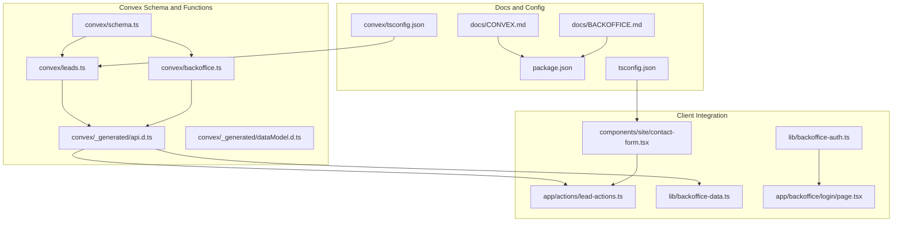
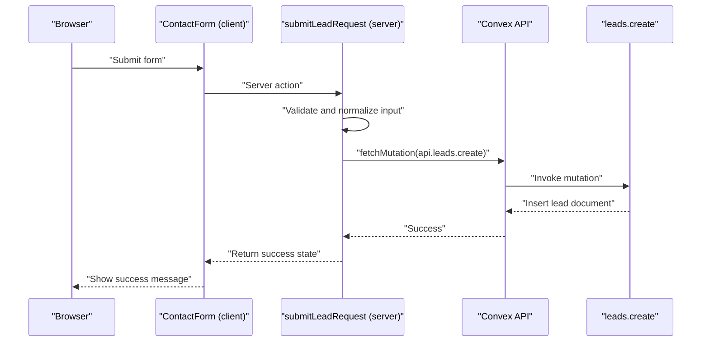
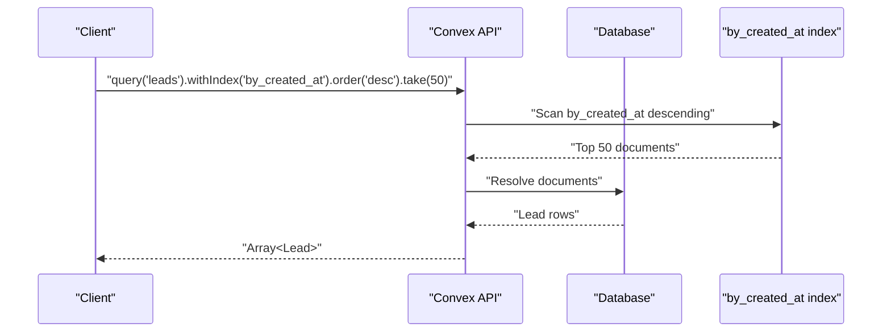
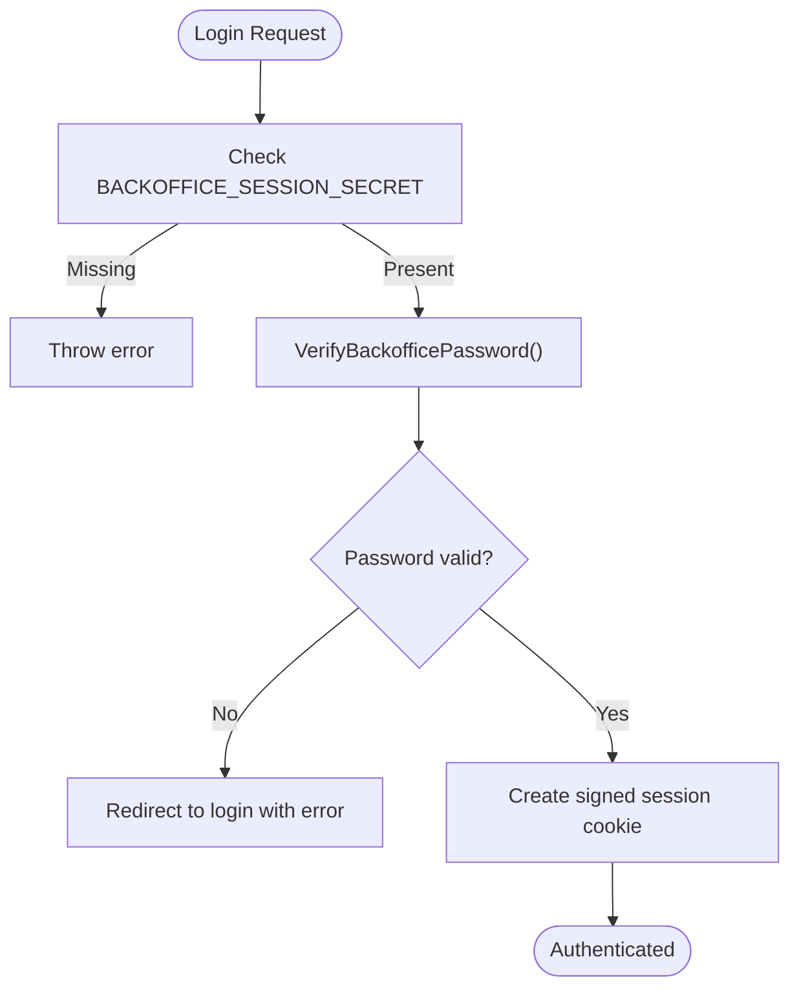
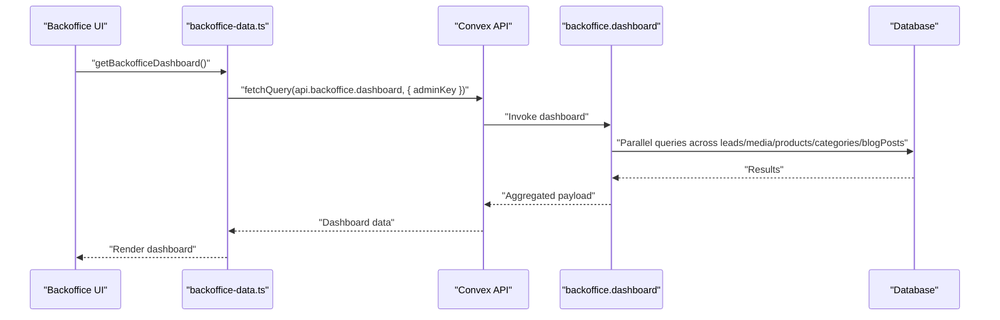
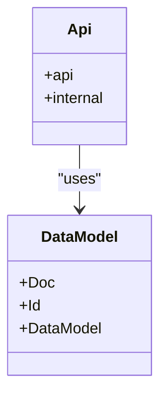
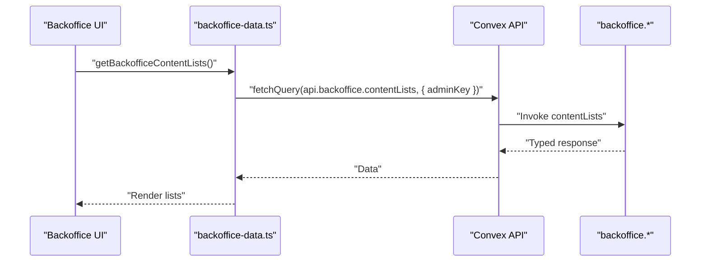
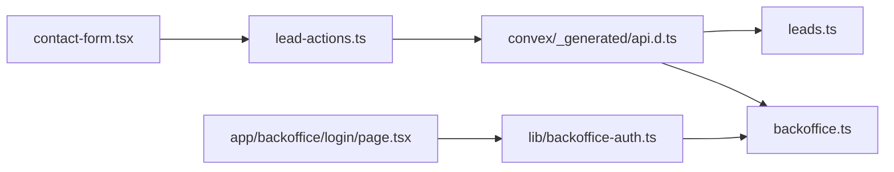

# Convex Backend API

<cite>
**Referenced Files in This Document**
- [schema.ts](file://convex/schema.ts)
- [leads.ts](file://convex/leads.ts)
- [backoffice.ts](file://convex/backoffice.ts)
- [api.d.ts](file://convex/_generated/api.d.ts)
- [dataModel.d.ts](file://convex/_generated/dataModel.d.ts)
- [CONVEX.md](file://docs/CONVEX.md)
- [BACKOFFICE.md](file://docs/BACKOFFICE.md)
- [lead-actions.ts](file://app/actions/lead-actions.ts)
- [contact-form.tsx](file://components/site/contact-form.tsx)
- [backoffice-auth.ts](file://lib/backoffice-auth.ts)
- [backoffice-data.ts](file://lib/backoffice-data.ts)
- [page.tsx](file://app/backoffice/login/page.tsx)
- [package.json](file://package.json)
- [tsconfig.json](file://tsconfig.json)
- [convex/tsconfig.json](file://convex/tsconfig.json)
</cite>

## Table of Contents
1. [Introduction](#introduction)
2. [Project Structure](#project-structure)
3. [Core Components](#core-components)
4. [Architecture Overview](#architecture-overview)
5. [Detailed Component Analysis](#detailed-component-analysis)
6. [Dependency Analysis](#dependency-analysis)
7. [Performance Considerations](#performance-considerations)
8. [Troubleshooting Guide](#troubleshooting-guide)
9. [Conclusion](#conclusion)
10. [Appendices](#appendices)

## Introduction
This document provides comprehensive API documentation for the Convex backend services powering the leads management and backoffice administrative workflows. It covers:
- Convex function architecture and generated API types
- Leads creation and retrieval APIs
- Backoffice authentication and administrative functions
- Real-time database integration patterns and reactive data synchronization
- Deployment configuration and environment setup
- Client-side integration patterns for Next.js App Router
- Performance considerations, query optimization, and indexing strategies

## Project Structure
The backend is organized around Convex schema definitions and function modules, with generated TypeScript types and client-side integration utilities.

**Diagram sources**
- [schema.ts:1-87](file://convex/schema.ts#L1-L87)
- [leads.ts:1-32](file://convex/leads.ts#L1-L32)
- [backoffice.ts:1-385](file://convex/backoffice.ts#L1-L385)
- [api.d.ts:1-52](file://convex/_generated/api.d.ts#L1-L52)
- [dataModel.d.ts:1-61](file://convex/_generated/dataModel.d.ts#L1-L61)
- [contact-form.tsx:1-92](file://components/site/contact-form.tsx#L1-L92)
- [lead-actions.ts:1-96](file://app/actions/lead-actions.ts#L1-L96)
- [backoffice-auth.ts:1-129](file://lib/backoffice-auth.ts#L1-L129)
- [backoffice-data.ts:1-21](file://lib/backoffice-data.ts#L1-L21)
- [page.tsx:1-69](file://app/backoffice/login/page.tsx#L1-L69)
- [CONVEX.md:1-59](file://docs/CONVEX.md#L1-L59)
- [BACKOFFICE.md:1-37](file://docs/BACKOFFICE.md#L1-L37)
- [tsconfig.json:1-29](file://tsconfig.json#L1-L29)
- [convex/tsconfig.json:1-26](file://convex/tsconfig.json#L1-L26)

**Section sources**
- [CONVEX.md:1-59](file://docs/CONVEX.md#L1-L59)
- [BACKOFFICE.md:1-37](file://docs/BACKOFFICE.md#L1-L37)
- [tsconfig.json:1-29](file://tsconfig.json#L1-L29)
- [convex/tsconfig.json:1-26](file://convex/tsconfig.json#L1-L26)

## Core Components
- Convex schema defines tables and indexes for leads, media assets, products, categories, blog posts, and site settings.
- Leads module exposes a mutation to create new leads and a query to fetch recent entries.
- Backoffice module exposes protected mutations and queries for media, content, and settings management, plus a public read-only content aggregation query.
- Generated API types enable strongly-typed client integration.
- Client-side actions and hooks orchestrate server-side Convex calls with validation and error handling.

**Section sources**
- [schema.ts:1-87](file://convex/schema.ts#L1-L87)
- [leads.ts:1-32](file://convex/leads.ts#L1-L32)
- [backoffice.ts:1-385](file://convex/backoffice.ts#L1-L385)
- [api.d.ts:1-52](file://convex/_generated/api.d.ts#L1-L52)
- [dataModel.d.ts:1-61](file://convex/_generated/dataModel.d.ts#L1-L61)

## Architecture Overview
The system integrates Next.js App Router with Convex for server-side data operations and real-time synchronization. Authentication ensures only authorized clients can access administrative functions.

**Diagram sources**
- [contact-form.tsx:1-92](file://components/site/contact-form.tsx#L1-L92)
- [lead-actions.ts:1-96](file://app/actions/lead-actions.ts#L1-L96)
- [leads.ts:1-32](file://convex/leads.ts#L1-L32)
- [api.d.ts:1-52](file://convex/_generated/api.d.ts#L1-L52)

## Detailed Component Analysis

### Leads Management API
- Module: convex/leads.ts
- Exposed functions:
  - leads.create (mutation): Creates a new lead record.
  - leads.recent (query): Retrieves the most recent leads using an index.

**Diagram sources**
- [leads.ts:26-31](file://convex/leads.ts#L26-L31)
- [schema.ts:16-17](file://convex/schema.ts#L16-L17)

**Section sources**
- [leads.ts:1-32](file://convex/leads.ts#L1-L32)
- [schema.ts:5-17](file://convex/schema.ts#L5-L17)

#### Function: leads.create (mutation)
- Purpose: Insert a new lead with computed defaults and timestamps.
- Arguments:
  - name: string
  - company: optional string
  - phone: string
  - email: optional string
  - message: string
  - source: string
  - userAgent: optional string
- Returns: Document ID of the inserted lead.
- Behavior:
  - Sets initial status to "new".
  - Adds createdAt timestamp.
  - Stores optional fields conditionally.
- Validation pattern:
  - Client-side normalization trims and limits lengths.
  - Email validation performed before mutation.
  - Hidden honeypot field mitigates spam.

**Section sources**
- [leads.ts:7-24](file://convex/leads.ts#L7-L24)
- [lead-actions.ts:32-96](file://app/actions/lead-actions.ts#L32-L96)

#### Function: leads.recent (query)
- Purpose: Fetch the latest leads for administrative dashboards.
- Arguments: none
- Returns: Array of lead documents, limited to a constant cap.
- Index usage:
  - Uses "by_created_at" index with descending order.
- Performance:
  - Indexed scan with take limit prevents large result sets.

**Section sources**
- [leads.ts:26-31](file://convex/leads.ts#L26-L31)
- [schema.ts:16-17](file://convex/schema.ts#L16-L17)

### Backoffice Authentication API
- Module: lib/backoffice-auth.ts
- Responsibilities:
  - Password hashing and verification using scrypt.
  - Session cookie management with HMAC signature.
  - API key retrieval for protected Convex functions.
- Session lifecycle:
  - Create session cookie with expiration.
  - Verify signature and expiry on each request.
  - Redirect unauthenticated users to login.

**Diagram sources**
- [backoffice-auth.ts:41-58](file://lib/backoffice-auth.ts#L41-L58)
- [backoffice-auth.ts:60-118](file://lib/backoffice-auth.ts#L60-L118)

**Section sources**
- [backoffice-auth.ts:1-129](file://lib/backoffice-auth.ts#L1-L129)
- [page.tsx:1-69](file://app/backoffice/login/page.tsx#L1-L69)

### Administrative Functions API
- Module: convex/backoffice.ts
- Protected functions require:
  - adminKey argument validated against BACKOFFICE_API_KEY.
  - HttpOnly session cookie for web UI access.
- Key functions:
  - generateUploadUrl (mutation): Returns a pre-signed upload URL for Convex Storage.
  - createMediaAsset (mutation): Inserts media asset metadata.
  - archiveMediaAsset (mutation): Archives an asset by updating status.
  - mediaList (query): Lists assets using a composite index.
  - dashboard (query): Aggregates counts and recent items across multiple tables.
  - leadList (query): Lists leads ordered by creation time.
  - updateLeadStatus (mutation): Updates lead status.
  - contentLists (query): Returns lists for media, products, categories, blog posts, and site settings.
  - upsertProduct (mutation): Upserts product with timestamps.
  - upsertCategory (mutation): Upserts category with timestamps.
  - upsertBlogPost (mutation): Upserts blog post with timestamps.
  - upsertSetting (mutation): Upserts site setting by key.
  - publicContent (query): Public read-only aggregation of active content and images.

**Diagram sources**
- [backoffice-data.ts:6-20](file://lib/backoffice-data.ts#L6-L20)
- [backoffice.ts:120-145](file://convex/backoffice.ts#L120-L145)
- [api.d.ts:20-49](file://convex/_generated/api.d.ts#L20-L49)

**Section sources**
- [backoffice.ts:1-385](file://convex/backoffice.ts#L1-L385)
- [backoffice-data.ts:1-21](file://lib/backoffice-data.ts#L1-L21)

### Real-Time Database Integration and Reactive Synchronization
- Indexes:
  - Leads: by_status, by_created_at
  - Media Assets: by_kind_and_status, by_status_and_uploaded_at
  - Products: by_active_and_sort_order, by_slug
  - Categories: by_active_and_sort_order, by_slug
  - Blog Posts: by_published_and_published_at, by_slug
  - Site Settings: by_key
- Patterns:
  - Queries use withIndex and order/take to leverage indexes efficiently.
  - Parallel queries reduce round-trips for dashboard views.
  - Public content query filters by active/published flags and attaches storage URLs.

**Section sources**
- [schema.ts:1-87](file://convex/schema.ts#L1-L87)
- [backoffice.ts:120-145](file://convex/backoffice.ts#L120-L145)
- [backoffice.ts:319-384](file://convex/backoffice.ts#L319-L384)

### Generated API Types and TypeScript Interfaces
- Generated API:
  - api: Public function references filtered by visibility.
  - internal: Internal function references filtered by visibility.
- Data model:
  - Doc<TableName>: Typed document for a given table.
  - Id<TableName>: Strongly-typed document ID.
  - DataModel: Describes tables, documents, and indexes.

**Diagram sources**
- [api.d.ts:20-52](file://convex/_generated/api.d.ts#L20-L52)
- [dataModel.d.ts:20-61](file://convex/_generated/dataModel.d.ts#L20-L61)

**Section sources**
- [api.d.ts:1-52](file://convex/_generated/api.d.ts#L1-L52)
- [dataModel.d.ts:1-61](file://convex/_generated/dataModel.d.ts#L1-L61)

### Client-Side API Consumption and Integration Patterns
- Leads submission:
  - Client renders a form and triggers a server action.
  - Server action normalizes input, validates, and calls Convex mutation.
- Backoffice data fetching:
  - Client-side hooks call Convex queries with adminKey.
  - Authentication enforced via session cookie and API key.

**Diagram sources**
- [backoffice-data.ts:10-12](file://lib/backoffice-data.ts#L10-L12)
- [backoffice.ts:163-184](file://convex/backoffice.ts#L163-L184)
- [api.d.ts:20-49](file://convex/_generated/api.d.ts#L20-L49)

**Section sources**
- [contact-form.tsx:1-92](file://components/site/contact-form.tsx#L1-L92)
- [lead-actions.ts:1-96](file://app/actions/lead-actions.ts#L1-L96)
- [backoffice-data.ts:1-21](file://lib/backoffice-data.ts#L1-L21)

## Dependency Analysis
- Client-to-Server:
  - Frontend components trigger server actions.
  - Server actions call Convex functions via generated API.
- Server-to-Convex:
  - Mutations write to tables; queries read with indexes.
- Authentication:
  - Web UI relies on signed session cookies.
  - Convex functions require adminKey.

**Diagram sources**
- [contact-form.tsx:1-92](file://components/site/contact-form.tsx#L1-L92)
- [lead-actions.ts:1-96](file://app/actions/lead-actions.ts#L1-L96)
- [api.d.ts:1-52](file://convex/_generated/api.d.ts#L1-L52)
- [leads.ts:1-32](file://convex/leads.ts#L1-L32)
- [backoffice.ts:1-385](file://convex/backoffice.ts#L1-L385)
- [page.tsx:1-69](file://app/backoffice/login/page.tsx#L1-L69)
- [backoffice-auth.ts:1-129](file://lib/backoffice-auth.ts#L1-L129)

**Section sources**
- [api.d.ts:1-52](file://convex/_generated/api.d.ts#L1-L52)
- [leads.ts:1-32](file://convex/leads.ts#L1-L32)
- [backoffice.ts:1-385](file://convex/backoffice.ts#L1-L385)

## Performance Considerations
- Index usage:
  - Leads recent query leverages by_created_at index with order/desc and take limit.
  - Composite indexes (e.g., by_status_and_uploaded_at) optimize multi-dimensional filtering.
- Query optimization:
  - Parallel queries in dashboard reduce latency.
  - Take limits cap result sizes for scalability.
- Storage:
  - Media URLs are resolved on-demand via Convex Storage to avoid storing large binary blobs.
- Type safety:
  - Generated types prevent runtime errors and improve maintainability.

**Section sources**
- [schema.ts:1-87](file://convex/schema.ts#L1-L87)
- [leads.ts:26-31](file://convex/leads.ts#L26-L31)
- [backoffice.ts:120-145](file://convex/backoffice.ts#L120-L145)
- [backoffice.ts:319-384](file://convex/backoffice.ts#L319-L384)

## Troubleshooting Guide
- Convex not configured:
  - Symptom: Server action reports missing NEXT_PUBLIC_CONVEX_URL.
  - Resolution: Set environment variable and redeploy.
- Unauthorized backoffice request:
  - Symptom: Protected function throws unauthorized error.
  - Resolution: Ensure BACKOFFICE_API_KEY is set in both environment and Convex.
- Missing session secret or password hash:
  - Symptom: Authentication helpers throw configuration errors.
  - Resolution: Set BACKOFFICE_SESSION_SECRET and BACKOFFICE_PASSWORD_HASH.
- Upload failures:
  - Symptom: generateUploadUrl fails or media metadata not saved.
  - Resolution: Confirm adminKey and storage permissions.

**Section sources**
- [lead-actions.ts:44-49](file://app/actions/lead-actions.ts#L44-L49)
- [backoffice.ts:25-31](file://convex/backoffice.ts#L25-L31)
- [backoffice-auth.ts:19-25](file://lib/backoffice-auth.ts#L19-L25)
- [backoffice-auth.ts:42-46](file://lib/backoffice-auth.ts#L42-L46)
- [CONVEX.md:16-32](file://docs/CONVEX.md#L16-L32)

## Conclusion
The Convex backend provides a robust, type-safe foundation for leads management and backoffice administration. With indexed queries, parallelized reads, and strict authentication, it balances performance and security. Generated API types streamline client integration, while environment-driven configuration supports local and production deployments.

## Appendices

### Deployment Configuration and Environment Setup
- Required environment variables:
  - NEXT_PUBLIC_CONVEX_URL: Convex deployment URL.
  - BACKOFFICE_API_KEY: Secret key for protected functions.
  - BACKOFFICE_PASSWORD_HASH: Scrypt-derived password hash.
  - BACKOFFICE_SESSION_SECRET: Secret for signing session cookies.
- Setup steps:
  - Run local development to configure deployment and regenerate types.
  - Deploy functions to production and set environment variables.

**Section sources**
- [CONVEX.md:16-59](file://docs/CONVEX.md#L16-L59)
- [package.json:5-12](file://package.json#L5-L12)

### Client Integration Examples
- Leads:
  - Trigger server action from a form component.
  - On success, reset form and show feedback.
- Backoffice:
  - Use typed queries to fetch dashboard and content lists.
  - Enforce authentication with session checks and redirects.

**Section sources**
- [contact-form.tsx:1-92](file://components/site/contact-form.tsx#L1-L92)
- [lead-actions.ts:1-96](file://app/actions/lead-actions.ts#L1-L96)
- [backoffice-data.ts:1-21](file://lib/backoffice-data.ts#L1-L21)
- [page.tsx:1-69](file://app/backoffice/login/page.tsx#L1-L69)