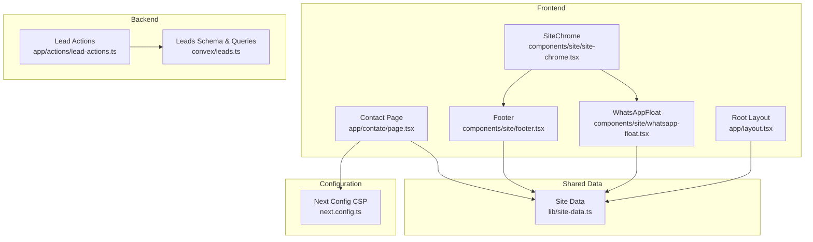
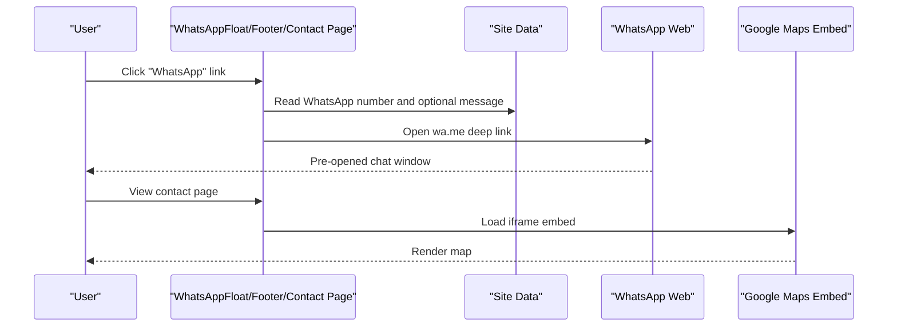
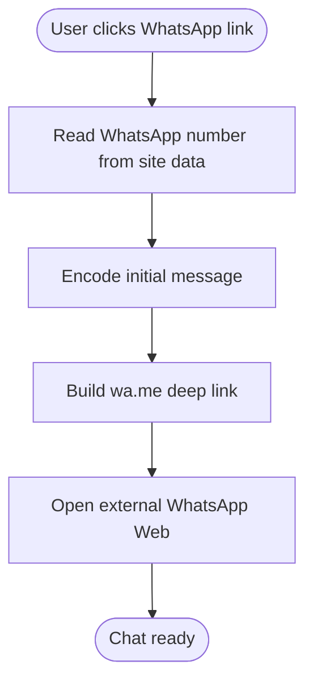
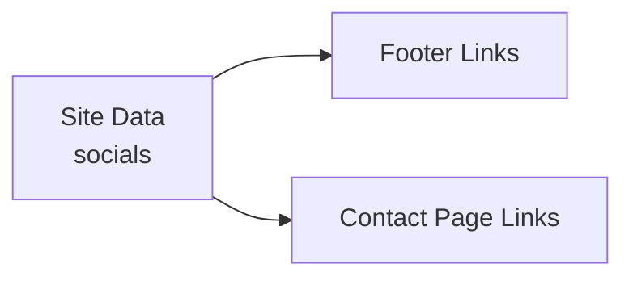
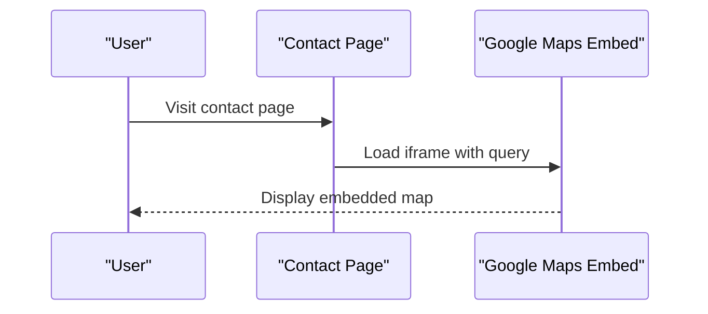
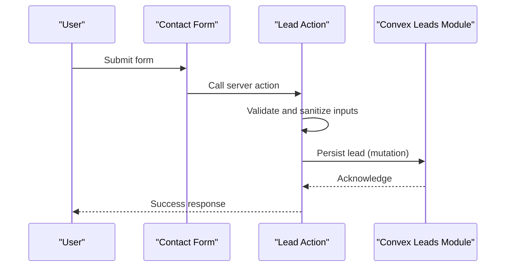
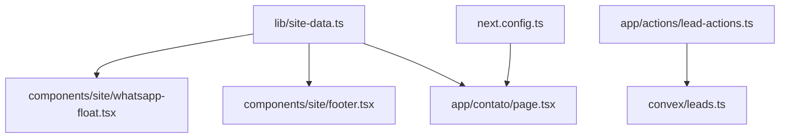

# External Service Integrations

<cite>
**Referenced Files in This Document**
- [whatsapp-float.tsx](file://components/site/whatsapp-float.tsx)
- [site-data.ts](file://lib/site-data.ts)
- [page.tsx](file://app/contato/page.tsx)
- [layout.tsx](file://app/layout.tsx)
- [footer.tsx](file://components/site/footer.tsx)
- [site-chrome.tsx](file://components/site/site-chrome.tsx)
- [next.config.ts](file://next.config.ts)
- [lead-actions.ts](file://app/actions/lead-actions.ts)
- [leads.ts](file://convex/leads.ts)
- [sitemap.ts](file://app/sitemap.ts)
- [CONVEX.md](file://docs/CONVEX.md)
</cite>

## Table of Contents
1. [Introduction](#introduction)
2. [Project Structure](#project-structure)
3. [Core Components](#core-components)
4. [Architecture Overview](#architecture-overview)
5. [Detailed Component Analysis](#detailed-component-analysis)
6. [Dependency Analysis](#dependency-analysis)
7. [Performance Considerations](#performance-considerations)
8. [Troubleshooting Guide](#troubleshooting-guide)
9. [Conclusion](#conclusion)
10. [Appendices](#appendices)

## Introduction
This document explains external service integrations and third-party API connections implemented in the project. It focuses on:
- WhatsApp integration for customer communication via deep links
- Social media connectivity and sharing links
- Google Maps integration for location services and business information display
- Integration patterns for external APIs, including authentication, request/response handling, error management, and fallback strategies
- Configuration requirements and environment variable setup
- Monitoring and logging approaches for external service interactions
- Troubleshooting guidance for common integration issues and service availability problems
- Rate limiting, API quotas, and performance considerations

## Project Structure
The external integrations are primarily implemented in the frontend and configuration layers:
- WhatsApp floating action and links are rendered in reusable UI components and page layouts
- Social media links are centralized in shared site data
- Google Maps is embedded via iframe in the contact page
- Content Security Policy allows controlled external connections
- Lead submission integrates with Convex backend for persistence and protection

**Diagram sources**
- [site-chrome.tsx:10-25](file://components/site/site-chrome.tsx#L10-L25)
- [whatsapp-float.tsx:5-16](file://components/site/whatsapp-float.tsx#L5-L16)
- [footer.tsx:26-34](file://components/site/footer.tsx#L26-L34)
- [page.tsx:55-71](file://app/contato/page.tsx#L55-L71)
- [layout.tsx:72-89](file://app/layout.tsx#L72-L89)
- [site-data.ts:25-41](file://lib/site-data.ts#L25-L41)
- [next.config.ts:8-25](file://next.config.ts#L8-L25)
- [lead-actions.ts:32-49](file://app/actions/lead-actions.ts#L32-L49)
- [leads.ts:7-31](file://convex/leads.ts#L7-L31)

**Section sources**
- [site-chrome.tsx:10-25](file://components/site/site-chrome.tsx#L10-L25)
- [whatsapp-float.tsx:5-16](file://components/site/whatsapp-float.tsx#L5-L16)
- [footer.tsx:26-34](file://components/site/footer.tsx#L26-L34)
- [page.tsx:55-71](file://app/contato/page.tsx#L55-L71)
- [layout.tsx:72-89](file://app/layout.tsx#L72-L89)
- [site-data.ts:25-41](file://lib/site-data.ts#L25-L41)
- [next.config.ts:8-25](file://next.config.ts#L8-L25)
- [lead-actions.ts:32-49](file://app/actions/lead-actions.ts#L32-L49)
- [leads.ts:7-31](file://convex/leads.ts#L7-L31)

## Core Components
- WhatsApp integration
  - Floating action and links use a deep link to initiate a chat via WhatsApp Web
  - The phone number and initial message are sourced from shared site data
- Social media connectivity
  - Links to Facebook, Instagram, and LinkedIn are centralized in site data and reused across pages
- Google Maps integration
  - An iframe embed displays a location map on the contact page
- Backend lead submission
  - Frontend form posts to a server action that validates and persists data via Convex

**Section sources**
- [whatsapp-float.tsx:5-16](file://components/site/whatsapp-float.tsx#L5-L16)
- [site-data.ts:33-40](file://lib/site-data.ts#L33-L40)
- [page.tsx:92-98](file://app/contato/page.tsx#L92-L98)
- [lead-actions.ts:32-49](file://app/actions/lead-actions.ts#L32-L49)
- [leads.ts:7-31](file://convex/leads.ts#L7-L31)

## Architecture Overview
The external integrations follow a straightforward pattern:
- UI components render links or embeds pointing to external services
- Shared site data provides configuration values (phone, WhatsApp number, social URLs, address)
- Content Security Policy explicitly permits external domains for specific contexts
- Lead submissions are handled server-side with backend persistence

**Diagram sources**
- [whatsapp-float.tsx:7-12](file://components/site/whatsapp-float.tsx#L7-L12)
- [footer.tsx:86-89](file://components/site/footer.tsx#L86-L89)
- [page.tsx:92-98](file://app/contato/page.tsx#L92-L98)
- [site-data.ts:33-35](file://lib/site-data.ts#L33-L35)

## Detailed Component Analysis

### WhatsApp Integration
- Implementation pattern
  - Deep link generation uses the configured WhatsApp number and an initial message
  - Links are present in multiple places: floating action, footer, and contact page
- Message formatting
  - The initial message is URL-encoded and included in the deep link
- User flow integration
  - Clicking the link opens WhatsApp Web or the native app with a prefilled message
- Configuration
  - The WhatsApp number is defined centrally and referenced by multiple UI components

**Diagram sources**
- [whatsapp-float.tsx:7-12](file://components/site/whatsapp-float.tsx#L7-L12)
- [footer.tsx:86-89](file://components/site/footer.tsx#L86-L89)
- [site-data.ts:33-35](file://lib/site-data.ts#L33-L35)

**Section sources**
- [whatsapp-float.tsx:5-16](file://components/site/whatsapp-float.tsx#L5-L16)
- [footer.tsx:26-34](file://components/site/footer.tsx#L26-L34)
- [site-data.ts:33-35](file://lib/site-data.ts#L33-L35)

### Social Media Connectivity
- Pattern
  - Social media URLs are defined in shared site data and rendered as external links in the footer and contact page
- Sharing functionality
  - The current implementation provides outbound links; no client-side sharing API is integrated
- Configuration
  - Centralized social URLs enable easy updates without changing UI components

**Diagram sources**
- [site-data.ts:36-40](file://lib/site-data.ts#L36-L40)
- [page.tsx:55-71](file://app/contato/page.tsx#L55-L71)
- [footer.tsx:26-34](file://components/site/footer.tsx#L26-L34)

**Section sources**
- [site-data.ts:36-40](file://lib/site-data.ts#L36-L40)
- [page.tsx:55-71](file://app/contato/page.tsx#L55-L71)
- [footer.tsx:26-34](file://components/site/footer.tsx#L26-L34)

### Google Maps Integration
- Implementation
  - The contact page embeds a Google Maps iframe with a predefined query
  - The iframe is marked for lazy loading and includes a referrer policy
- Business information display
  - The address is shown above the map for clarity
- Configuration
  - The base embed URL is defined in the contact page; the address is sourced from site data

**Diagram sources**
- [page.tsx:92-98](file://app/contato/page.tsx#L92-L98)
- [site-data.ts:35](file://lib/site-data.ts#L35)

**Section sources**
- [page.tsx:80-101](file://app/contato/page.tsx#L80-L101)
- [site-data.ts:35](file://lib/site-data.ts#L35)

### Lead Submission and Backend Persistence
- Frontend form submission
  - The server action validates input, applies sanitization and limits, and checks for a honeypot field
- Backend persistence
  - Data is persisted via Convex mutations and queries
- Security and configuration
  - The action checks for the presence of the Convex URL environment variable
  - Convex functions require an API key for protected operations

**Diagram sources**
- [lead-actions.ts:32-49](file://app/actions/lead-actions.ts#L32-L49)
- [leads.ts:7-31](file://convex/leads.ts#L7-L31)

**Section sources**
- [lead-actions.ts:32-49](file://app/actions/lead-actions.ts#L32-L49)
- [leads.ts:7-31](file://convex/leads.ts#L7-L31)
- [CONVEX.md:50-58](file://docs/CONVEX.md#L50-L58)

## Dependency Analysis
- UI components depend on shared site data for configuration
- External services are accessed via links and iframe embeds
- Content Security Policy controls allowed origins for frames and forms
- Backend depends on Convex for data operations

**Diagram sources**
- [site-data.ts:25-41](file://lib/site-data.ts#L25-L41)
- [whatsapp-float.tsx:5-16](file://components/site/whatsapp-float.tsx#L5-L16)
- [footer.tsx:26-34](file://components/site/footer.tsx#L26-L34)
- [page.tsx:92-98](file://app/contato/page.tsx#L92-L98)
- [next.config.ts:8-25](file://next.config.ts#L8-L25)
- [lead-actions.ts:32-49](file://app/actions/lead-actions.ts#L32-L49)
- [leads.ts:7-31](file://convex/leads.ts#L7-L31)

**Section sources**
- [site-data.ts:25-41](file://lib/site-data.ts#L25-L41)
- [next.config.ts:8-25](file://next.config.ts#L8-L25)
- [lead-actions.ts:32-49](file://app/actions/lead-actions.ts#L32-L49)
- [leads.ts:7-31](file://convex/leads.ts#L7-L31)

## Performance Considerations
- Lazy loading and referrer policy
  - The Google Maps iframe uses lazy loading and a restricted referrer policy to minimize overhead and improve privacy
- Minimizing external requests
  - Deep links and static embeds avoid repeated network calls during runtime
- Backend throughput
  - Convex mutations and queries are designed to handle bounded loads; ensure appropriate indexing and limits are maintained

**Section sources**
- [page.tsx:96-98](file://app/contato/page.tsx#L96-L98)
- [leads.ts:5](file://convex/leads.ts#L5)

## Troubleshooting Guide
- WhatsApp links not working
  - Verify the configured WhatsApp number exists and is formatted correctly
  - Confirm the initial message encoding is applied consistently
- External links blocked by CSP
  - Review the Content Security Policy frame-src and form-action directives to ensure allowed origins
- Google Maps embed issues
  - Check the iframe source URL and query parameters
  - Ensure the page is served over HTTPS for embed compatibility
- Lead submission errors
  - Confirm the Convex URL environment variable is set
  - Validate that the backend API key is configured for protected operations
- Social media links not updating
  - Ensure the social URLs in shared site data are correct and accessible

**Section sources**
- [site-data.ts:33-40](file://lib/site-data.ts#L33-L40)
- [next.config.ts:17-21](file://next.config.ts#L17-L21)
- [page.tsx:92-98](file://app/contato/page.tsx#L92-L98)
- [lead-actions.ts:44-49](file://app/actions/lead-actions.ts#L44-L49)
- [CONVEX.md:50-58](file://docs/CONVEX.md#L50-L58)

## Conclusion
The project integrates external services with minimal overhead:
- WhatsApp deep links streamline customer communication
- Social media links are centralized for maintainability
- Google Maps embed provides clear location information
- Lead submissions leverage a secure backend with validation and persistence
Future enhancements could include client-side sharing APIs, analytics for external link clicks, and rate-limiting strategies for backend operations.

## Appendices

### Configuration Requirements and Environment Variables
- Convex URL
  - Required for lead submission server action
- Backend API key
  - Required for protected Convex operations

**Section sources**
- [lead-actions.ts:44-49](file://app/actions/lead-actions.ts#L44-L49)
- [leads.ts:25-31](file://convex/leads.ts#L25-L31)

### Monitoring and Logging Approaches
- Frontend
  - Track external link clicks using analytics or event logging
  - Monitor iframe load performance and errors
- Backend
  - Log lead creation events and validation outcomes
  - Observe Convex function latency and error rates

[No sources needed since this section provides general guidance]

### Fallback Strategies and Graceful Degradation
- WhatsApp
  - Provide alternative contact channels if the deep link fails
- Google Maps
  - Display static address and directions link as a fallback
- Social media
  - Ensure links remain functional even if profiles are temporarily inaccessible
- Backend
  - Return user-friendly messages when environment variables are missing
  - Implement retry and timeout handling for backend operations

**Section sources**
- [lead-actions.ts:44-49](file://app/actions/lead-actions.ts#L44-L49)
- [page.tsx:92-98](file://app/contato/page.tsx#L92-L98)

### Rate Limiting, API Quotas, and Performance
- External services
  - Respect platform policies for deep links and embed usage
- Backend
  - Apply reasonable limits on lead submissions and enforce validation
  - Use indexing and pagination for queries to manage performance

**Section sources**
- [leads.ts:5](file://convex/leads.ts#L5)
- [leads.ts:26-31](file://convex/leads.ts#L26-L31)