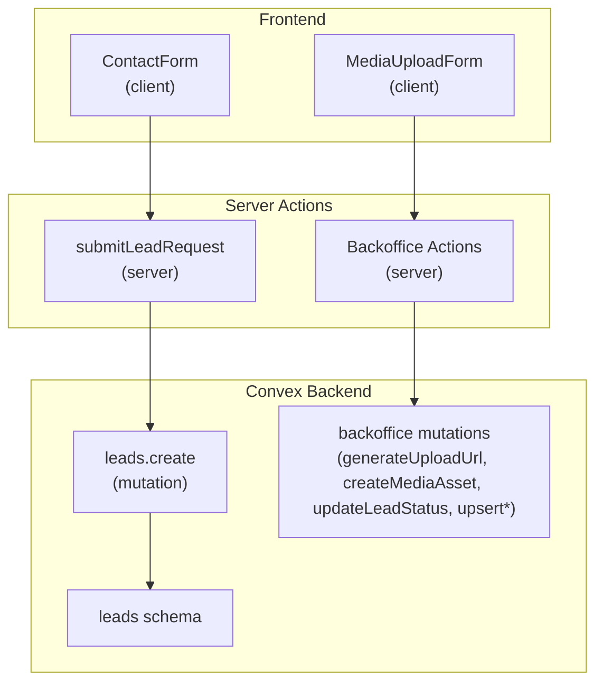
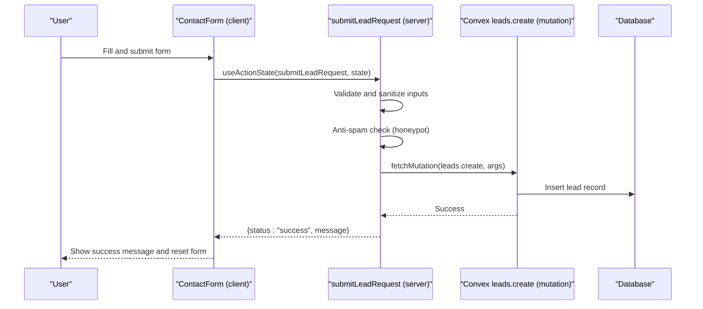
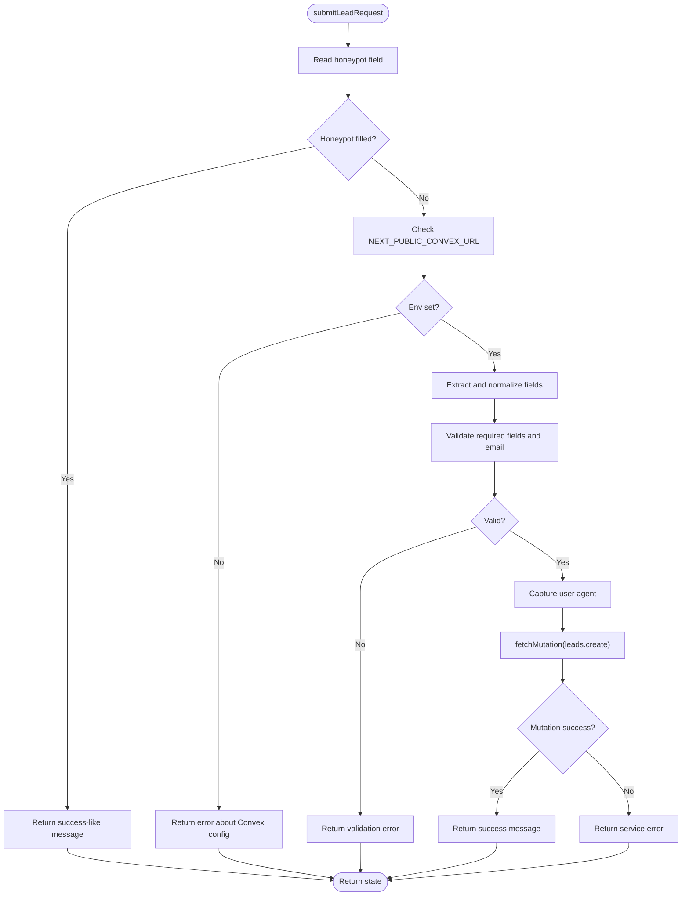
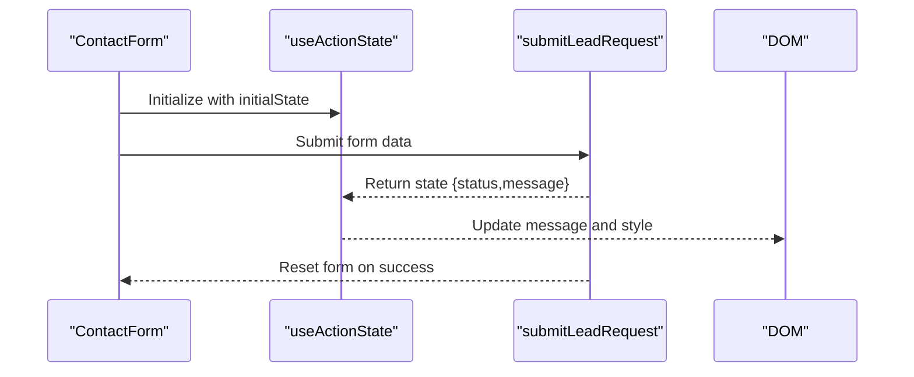
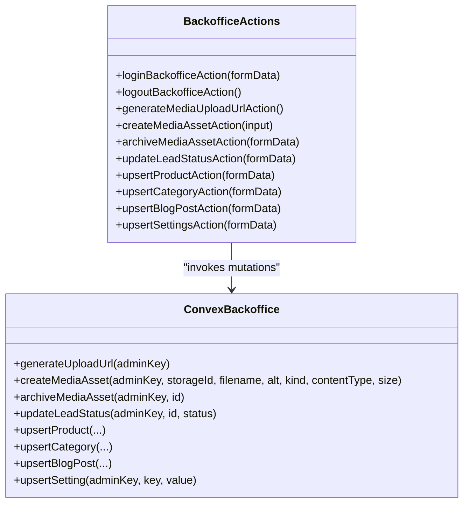
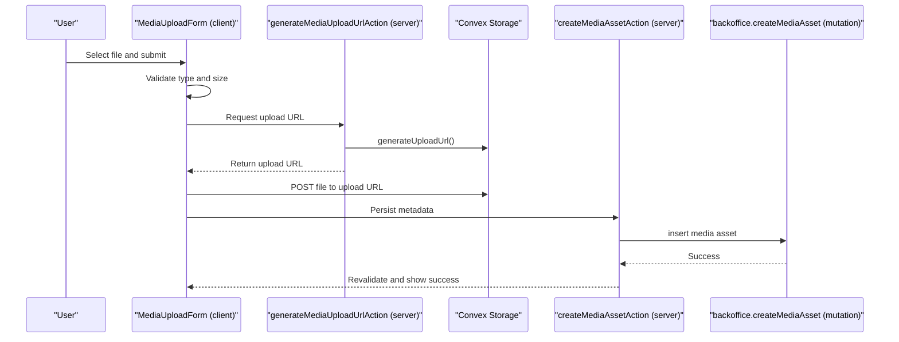
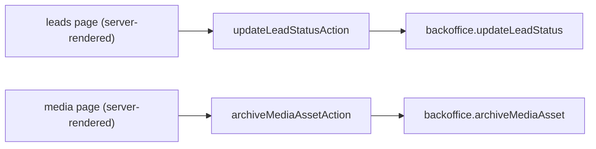
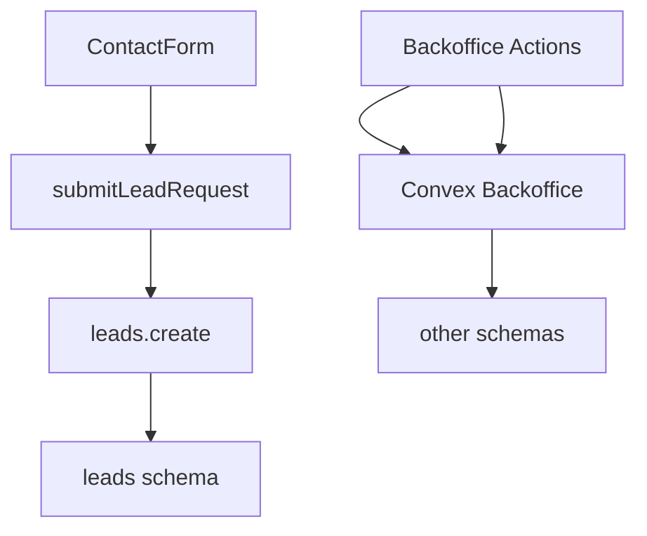

# Server Actions & Form Processing

<cite>
**Referenced Files in This Document**
- [lead-actions.ts](file://app/actions/lead-actions.ts)
- [contact-form.tsx](file://components/site/contact-form.tsx)
- [leads.ts](file://convex/leads.ts)
- [schema.ts](file://convex/schema.ts)
- [backoffice-auth.ts](file://lib/backoffice-auth.ts)
- [actions.ts](file://app/backoffice/actions.ts)
- [media-upload-form.tsx](file://components/backoffice/media-upload-form.tsx)
- [backoffice.ts](file://convex/backoffice.ts)
- [SECURITY.md](file://docs/SECURITY.md)
- [CONVEX.md](file://docs/CONVEX.md)
- [layout.tsx](file://app/backoffice/(admin)/layout.tsx)
- [leads-page.tsx](file://app/backoffice/(admin)/leads/page.tsx)
- [media-page.tsx](file://app/backoffice/(admin)/media/page.tsx)
- [backoffice-data.ts](file://lib/backoffice-data.ts)
</cite>

## Table of Contents
1. [Introduction](#introduction)
2. [Project Structure](#project-structure)
3. [Core Components](#core-components)
4. [Architecture Overview](#architecture-overview)
5. [Detailed Component Analysis](#detailed-component-analysis)
6. [Dependency Analysis](#dependency-analysis)
7. [Performance Considerations](#performance-considerations)
8. [Troubleshooting Guide](#troubleshooting-guide)
9. [Conclusion](#conclusion)
10. [Appendices](#appendices)

## Introduction
This document explains the Next.js server actions and form processing implementation used to securely handle lead submissions and administrative operations. It covers the server action pattern for secure form handling, including validation, sanitization, and error management. It documents the lead submission server action with parameter validation, database insertion, and response handling. It also explains the integration between frontend forms and server actions, including client-side error display and success feedback. Security measures such as input validation, CSRF protection, and session-based access control are detailed. Finally, it provides examples of server action implementations for different form types, performance optimization techniques, error handling strategies, and troubleshooting guidance.

## Project Structure
The form processing implementation spans three layers:
- Frontend forms and UI components (client-side)
- Server actions (server-side)
- Convex backend (mutations and queries)

**Diagram sources**
- [contact-form.tsx:17-91](file://components/site/contact-form.tsx#L17-L91)
- [lead-actions.ts:32-95](file://app/actions/lead-actions.ts#L32-L95)
- [leads.ts:7-24](file://convex/leads.ts#L7-L24)
- [schema.ts:4-17](file://convex/schema.ts#L4-L17)
- [actions.ts:79-214](file://app/backoffice/actions.ts#L79-L214)
- [backoffice.ts:68-161](file://convex/backoffice.ts#L68-L161)

**Section sources**
- [contact-form.tsx:17-91](file://components/site/contact-form.tsx#L17-L91)
- [lead-actions.ts:32-95](file://app/actions/lead-actions.ts#L32-L95)
- [leads.ts:7-24](file://convex/leads.ts#L7-L24)
- [schema.ts:4-17](file://convex/schema.ts#L4-L17)
- [actions.ts:79-214](file://app/backoffice/actions.ts#L79-L214)
- [backoffice.ts:68-161](file://convex/backoffice.ts#L68-L161)

## Core Components
- Lead submission server action: Validates and sanitizes form data, prevents spam via a honeypot, persists to Convex, and returns a structured state for UI feedback.
- Frontend contact form: Uses Next’s useActionState to bind server action state, displays live feedback, and resets on success.
- Convex lead mutation: Inserts validated data into the leads table with derived fields and timestamps.
- Backoffice server actions: Provide CRUD-like mutations for media, content, and settings with session and API key checks.
- Authentication and authorization: HttpOnly session cookie with HMAC signature and admin API key enforcement in Convex.

**Section sources**
- [lead-actions.ts:8-11](file://app/actions/lead-actions.ts#L8-L11)
- [lead-actions.ts:32-95](file://app/actions/lead-actions.ts#L32-L95)
- [contact-form.tsx:17-91](file://components/site/contact-form.tsx#L17-L91)
- [leads.ts:7-24](file://convex/leads.ts#L7-L24)
- [actions.ts:79-214](file://app/backoffice/actions.ts#L79-L214)
- [backoffice-auth.ts:60-118](file://lib/backoffice-auth.ts#L60-L118)

## Architecture Overview
The system follows a strict server action pattern:
- Client submits a form to a server action.
- The server action validates and normalizes inputs, optionally performs anti-spam checks, and invokes a Convex mutation.
- Convex mutations enforce schema and write to the database.
- The server action returns a state object indicating success or error, which the client renders immediately.

**Diagram sources**
- [contact-form.tsx:17-91](file://components/site/contact-form.tsx#L17-L91)
- [lead-actions.ts:32-95](file://app/actions/lead-actions.ts#L32-L95)
- [leads.ts:7-24](file://convex/leads.ts#L7-L24)

## Detailed Component Analysis

### Lead Submission Server Action
The lead submission action encapsulates:
- Type definition for form state with status and message.
- Helper functions to extract and normalize form values.
- Anti-spam protection via a hidden honeypot field.
- Validation rules for required fields and email format.
- Environment guard for Convex URL.
- Mutation invocation to persist the lead with optional fields and user agent capture.
- Structured error/success responses.

**Diagram sources**
- [lead-actions.ts:32-95](file://app/actions/lead-actions.ts#L32-L95)

**Section sources**
- [lead-actions.ts:8-11](file://app/actions/lead-actions.ts#L8-L11)
- [lead-actions.ts:15-26](file://app/actions/lead-actions.ts#L15-L26)
- [lead-actions.ts:32-95](file://app/actions/lead-actions.ts#L32-L95)
- [leads.ts:7-24](file://convex/leads.ts#L7-L24)
- [schema.ts:4-17](file://convex/schema.ts#L4-L17)

### Frontend Integration and Client-State Management
The contact form integrates with the server action using useActionState:
- Initializes state with idle status and empty message.
- Submits the form to the server action.
- Resets the form after successful submission.
- Displays live feedback with different styles for success and error.
- Includes a hidden honeypot input to deter bots.

**Diagram sources**
- [contact-form.tsx:17-91](file://components/site/contact-form.tsx#L17-L91)
- [lead-actions.ts:32-95](file://app/actions/lead-actions.ts#L32-L95)

**Section sources**
- [contact-form.tsx:12-15](file://components/site/contact-form.tsx#L12-L15)
- [contact-form.tsx:17-25](file://components/site/contact-form.tsx#L17-L25)
- [contact-form.tsx:27-88](file://components/site/contact-form.tsx#L27-L88)

### Backoffice Server Actions and Data Management
Backoffice actions demonstrate robust server action patterns:
- Session enforcement via requireBackofficeSession.
- API key verification in Convex mutations.
- Robust input parsing helpers for strings, numbers, booleans, and timestamps.
- Slug generation for SEO-friendly identifiers.
- Revalidation of cached routes after mutations.
- Dedicated forms for media uploads and content updates.

**Diagram sources**
- [actions.ts:63-214](file://app/backoffice/actions.ts#L63-L214)
- [backoffice.ts:68-317](file://convex/backoffice.ts#L68-L317)

**Section sources**
- [actions.ts:16-61](file://app/backoffice/actions.ts#L16-L61)
- [actions.ts:119-151](file://app/backoffice/actions.ts#L119-L151)
- [actions.ts:176-199](file://app/backoffice/actions.ts#L176-L199)
- [backoffice.ts:68-161](file://convex/backoffice.ts#L68-L161)
- [backoffice-auth.ts:60-118](file://lib/backoffice-auth.ts#L60-L118)

### Media Upload Flow (Client + Server + Convex)
The media upload form demonstrates a hybrid client-server flow:
- Client validates file type and size locally.
- Generates an upload URL via a server action.
- Uploads the file directly to Convex Storage.
- Persists metadata via another server action.
- Revalidates affected routes.

**Diagram sources**
- [media-upload-form.tsx:19-77](file://components/backoffice/media-upload-form.tsx#L19-L77)
- [actions.ts:79-108](file://app/backoffice/actions.ts#L79-L108)
- [backoffice.ts:68-100](file://convex/backoffice.ts#L68-L100)

**Section sources**
- [media-upload-form.tsx:11-12](file://components/backoffice/media-upload-form.tsx#L11-L12)
- [media-upload-form.tsx:19-77](file://components/backoffice/media-upload-form.tsx#L19-L77)
- [actions.ts:79-108](file://app/backoffice/actions.ts#L79-L108)
- [backoffice.ts:68-100](file://convex/backoffice.ts#L68-L100)

### Admin UI Integration Examples
- Leads page: Displays leads and allows updating status via a server action with revalidation.
- Media page: Renders saved assets and provides archiving via a server action.

**Diagram sources**
- [leads-page.tsx](file://app/backoffice/(admin)/leads/page.tsx#L1-L73)
- [media-page.tsx](file://app/backoffice/(admin)/media/page.tsx#L1-L83)
- [actions.ts:119-128](file://app/backoffice/actions.ts#L119-L128)
- [actions.ts:110-117](file://app/backoffice/actions.ts#L110-L117)
- [backoffice.ts:155-161](file://convex/backoffice.ts#L155-L161)
- [backoffice.ts:102-108](file://convex/backoffice.ts#L102-L108)

**Section sources**
- [leads-page.tsx](file://app/backoffice/(admin)/leads/page.tsx#L40-L59)
- [media-page.tsx](file://app/backoffice/(admin)/media/page.tsx#L61-L67)
- [actions.ts:119-128](file://app/backoffice/actions.ts#L119-L128)
- [actions.ts:110-117](file://app/backoffice/actions.ts#L110-L117)

## Dependency Analysis
- Client components depend on server actions for state transitions and persistence.
- Server actions depend on Convex for data operations and on environment variables for secrets.
- Convex mutations depend on schema definitions and enforce data integrity.
- Backoffice actions depend on session management and API keys.

**Diagram sources**
- [contact-form.tsx:17-91](file://components/site/contact-form.tsx#L17-L91)
- [lead-actions.ts:32-95](file://app/actions/lead-actions.ts#L32-L95)
- [leads.ts:7-24](file://convex/leads.ts#L7-L24)
- [schema.ts:4-17](file://convex/schema.ts#L4-L17)
- [actions.ts:79-214](file://app/backoffice/actions.ts#L79-L214)
- [backoffice.ts:68-317](file://convex/backoffice.ts#L68-L317)

**Section sources**
- [contact-form.tsx:17-91](file://components/site/contact-form.tsx#L17-L91)
- [lead-actions.ts:32-95](file://app/actions/lead-actions.ts#L32-L95)
- [leads.ts:7-24](file://convex/leads.ts#L7-L24)
- [schema.ts:4-17](file://convex/schema.ts#L4-L17)
- [actions.ts:79-214](file://app/backoffice/actions.ts#L79-L214)
- [backoffice.ts:68-317](file://convex/backoffice.ts#L68-L317)

## Performance Considerations
- Minimize payload size: Normalize and truncate inputs early to reduce storage overhead and network usage.
- Batch settings updates: The settings action iterates over keys and performs multiple mutations; consider consolidating into a single mutation if needed.
- Revalidation scope: Revalidate only affected paths after mutations to avoid unnecessary cache invalidation.
- Client-side validation: Pre-validate files and inputs to fail fast and reduce server load.
- Rate limiting: While not implemented here, consider adding rate limits at the server action boundary for lead submissions.

[No sources needed since this section provides general guidance]

## Troubleshooting Guide
Common issues and debugging approaches:
- Convex URL not configured: The lead action checks for the environment variable and returns a descriptive error. Verify the environment variable is set in the deployment platform.
- Unexpected validation errors: Review minimum lengths and email format checks in the lead action. Confirm frontend field constraints match server-side expectations.
- Hidden field spam protection: If submissions are blocked despite being legitimate, verify the honeypot field remains hidden and unmodified by client-side scripts.
- Authentication failures: For backoffice actions, ensure the session cookie exists, is signed correctly, and not expired. Confirm the API key is configured and matches the server action’s expectation.
- Upload failures: Validate file type and size constraints in the client form, confirm the upload URL is generated successfully, and check the response from Convex Storage.
- Cache freshness: After mutations, ensure revalidation is triggered for the intended paths.

**Section sources**
- [lead-actions.ts:44-49](file://app/actions/lead-actions.ts#L44-L49)
- [lead-actions.ts:58-70](file://app/actions/lead-actions.ts#L58-L70)
- [contact-form.tsx:33-37](file://components/site/contact-form.tsx#L33-L37)
- [backoffice-auth.ts:60-118](file://lib/backoffice-auth.ts#L60-L118)
- [actions.ts:79-108](file://app/backoffice/actions.ts#L79-L108)
- [media-upload-form.tsx:32-42](file://components/backoffice/media-upload-form.tsx#L32-L42)

## Conclusion
The implementation demonstrates a robust, secure, and user-friendly approach to form processing using Next.js server actions:
- Strong server-side validation and sanitization prevent malformed or malicious data from entering the database.
- Anti-spam measures and environment guards improve reliability and security.
- Clear separation between client UI and server actions enables maintainable, testable code.
- Convex mutations and schema enforcement guarantee data integrity.
- Session-based access control and API key checks protect administrative operations.

[No sources needed since this section summarizes without analyzing specific files]

## Appendices

### Security Measures Implemented
- Input validation and normalization in server actions.
- Email validation and length limits.
- Hidden honeypot field to deter bots.
- HttpOnly session cookie with HMAC signature and expiration.
- Admin API key enforced in Convex mutations.
- CSP and other hardening described in project documentation.

**Section sources**
- [lead-actions.ts:28-30](file://app/actions/lead-actions.ts#L28-L30)
- [lead-actions.ts:51-56](file://app/actions/lead-actions.ts#L51-L56)
- [contact-form.tsx:33-37](file://components/site/contact-form.tsx#L33-L37)
- [backoffice-auth.ts:60-118](file://lib/backoffice-auth.ts#L60-L118)
- [backoffice.ts:25-31](file://convex/backoffice.ts#L25-L31)
- [SECURITY.md:1-29](file://docs/SECURITY.md#L1-L29)
- [CONVEX.md:50-57](file://docs/CONVEX.md#L50-L57)

### Example Scenarios and Patterns
- Lead submission: Use the lead action with required fields and optional email.
- Media upload: Use the media upload form to validate file constraints, generate an upload URL, upload to Convex Storage, and persist metadata.
- Content updates: Use upsert actions for products, categories, and blog posts with slug generation and sorting support.
- Settings updates: Use the settings action to update multiple keys atomically.

**Section sources**
- [lead-actions.ts:32-95](file://app/actions/lead-actions.ts#L32-L95)
- [media-upload-form.tsx:19-77](file://components/backoffice/media-upload-form.tsx#L19-L77)
- [actions.ts:130-151](file://app/backoffice/actions.ts#L130-L151)
- [actions.ts:153-174](file://app/backoffice/actions.ts#L153-L174)
- [actions.ts:176-199](file://app/backoffice/actions.ts#L176-L199)
- [actions.ts:201-214](file://app/backoffice/actions.ts#L201-L214)