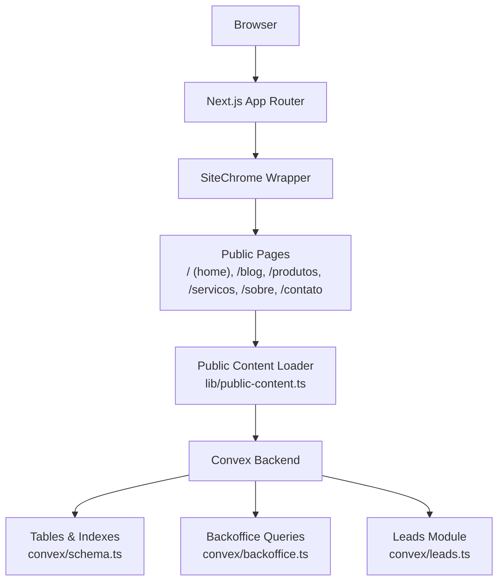
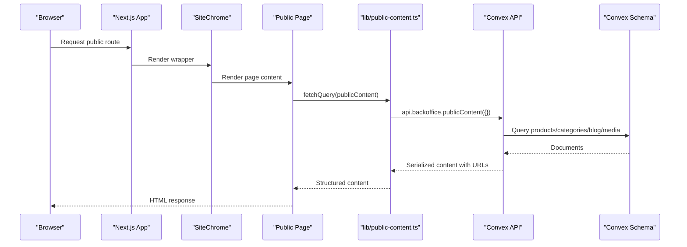
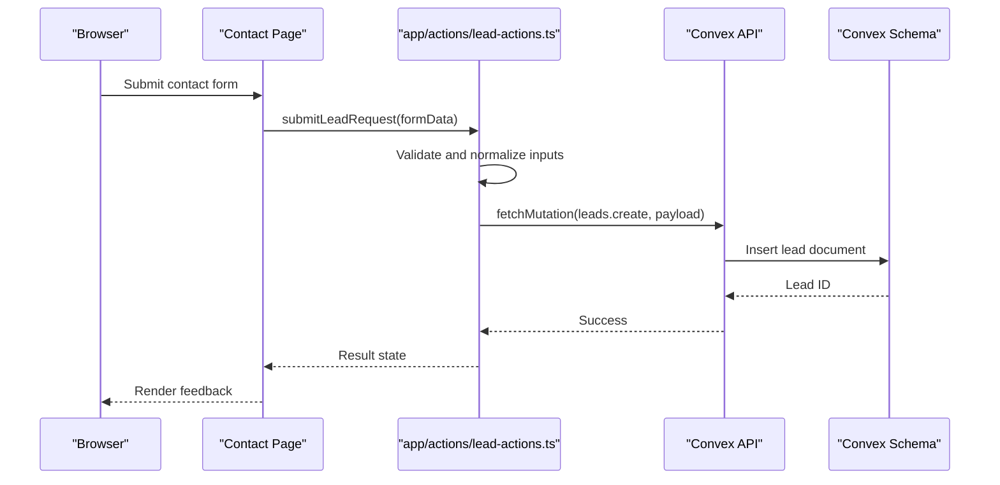
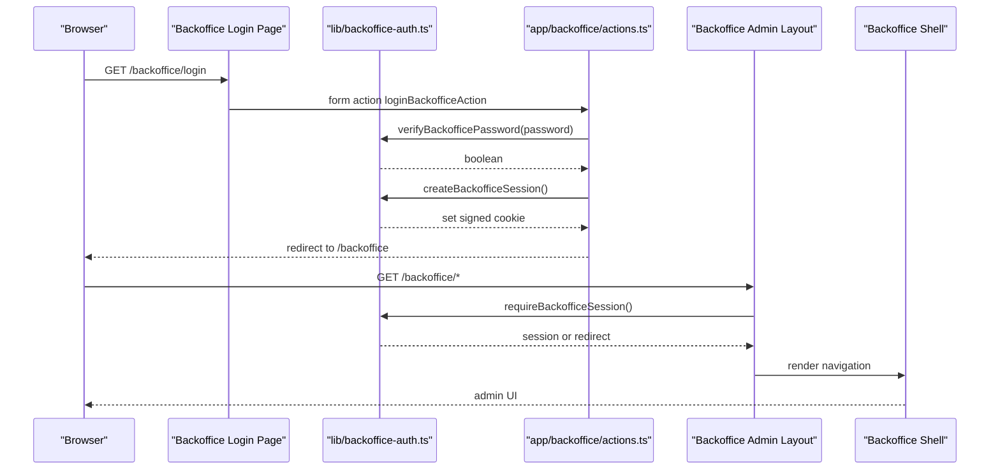
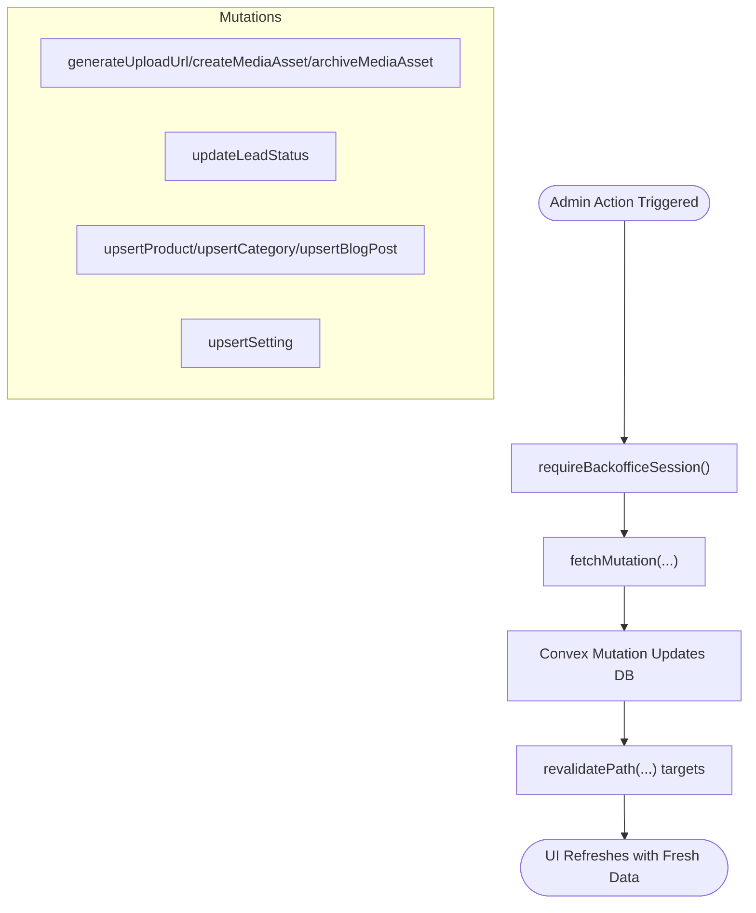
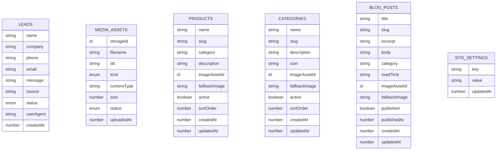
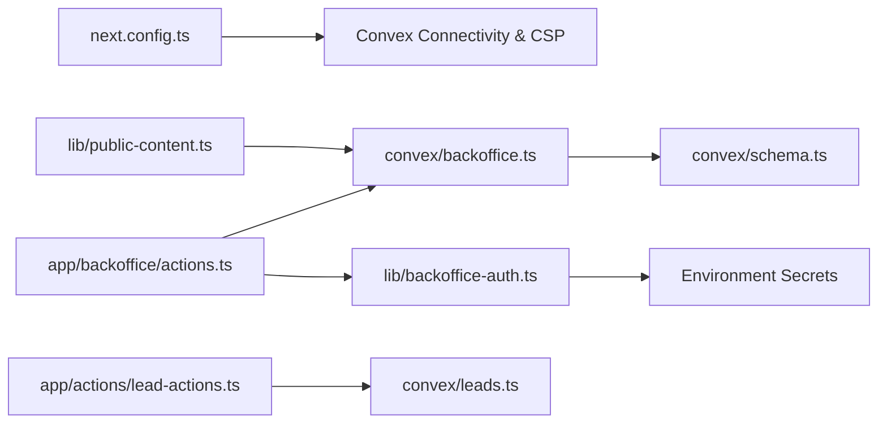

# Architecture Overview

<cite>
**Referenced Files in This Document**
- [package.json](file://package.json)
- [next.config.ts](file://next.config.ts)
- [convex/schema.ts](file://convex/schema.ts)
- [convex/backoffice.ts](file://convex/backoffice.ts)
- [convex/leads.ts](file://convex/leads.ts)
- [lib/backoffice-auth.ts](file://lib/backoffice-auth.ts)
- [lib/public-content.ts](file://lib/public-content.ts)
- [lib/site-data.ts](file://lib/site-data.ts)
- [app/layout.tsx](file://app/layout.tsx)
- [app/backoffice/(admin)/layout.tsx](file://app/backoffice/(admin)/layout.tsx)
- [app/backoffice/login/page.tsx](file://app/backoffice/login/page.tsx)
- [app/backoffice/actions.ts](file://app/backoffice/actions.ts)
- [app/actions/lead-actions.ts](file://app/actions/lead-actions.ts)
- [components/backoffice/backoffice-shell.tsx](file://components/backoffice/backoffice-shell.tsx)
- [components/backoffice/admin-ui.tsx](file://components/backoffice/admin-ui.tsx)
- [components/site/site-chrome.tsx](file://components/site/site-chrome.tsx)
- [docs/BACKOFFICE.md](file://docs/BACKOFFICE.md)
</cite>

## Table of Contents
1. [Introduction](#introduction)
2. [Project Structure](#project-structure)
3. [Core Components](#core-components)
4. [Architecture Overview](#architecture-overview)
5. [Detailed Component Analysis](#detailed-component-analysis)
6. [Dependency Analysis](#dependency-analysis)
7. [Performance Considerations](#performance-considerations)
8. [Troubleshooting Guide](#troubleshooting-guide)
9. [Conclusion](#conclusion)
10. [Appendices](#appendices)

## Introduction
This document describes the system architecture of the ADIKI ALVANIR Angola website. It explains the separation between the public-facing website and the backoffice administration, the component interaction patterns between Next.js application layers and Convex backend services, and the data flow from database queries through server actions to frontend rendering. It also documents the session-based authentication model for backoffice access, system boundaries, Convex integration points, real-time-friendly design characteristics, and deployment topology considerations.

## Project Structure
The project follows a Next.js App Router structure with two primary areas:
- Public website: pages under app/blog, app/produtos, app/servicos, app/sobre, app/contato, and the root page, rendered inside a shared site chrome.
- Backoffice administration: protected routes under app/backoffice, including login, dashboard, media, products, categories, blog, and settings.

Technology stack highlights:
- Frontend framework: Next.js 16 with App Router and React 19.
- Backend data platform: Convex (database, storage, serverless functions).
- Authentication: session-based cookies for backoffice access.
- Styling and UI: Tailwind CSS and Radix UI primitives.
- Real-time readiness: Convex’s reactive data model and Next.js incremental static regeneration/revalidation support.

```mermaid
graph TB
subgraph "Public Website"
P_Home["app/page.tsx"]
P_Blog["app/blog/page.tsx"]
P_Produtos["app/produtos/page.tsx"]
P_Servicos["app/servicos/page.tsx"]
P_Sobre["app/sobre/page.tsx"]
P_Contato["app/contato/page.tsx"]
P_Layout["app/layout.tsx"]
P_Chrome["components/site/site-chrome.tsx"]
end
subgraph "Backoffice"
BO_Login["app/backoffice/login/page.tsx"]
BO_AdminLayout["app/backoffice/(admin)/layout.tsx"]
BO_Shell["components/backoffice/backoffice-shell.tsx"]
BO_Dashboard["app/backoffice/(admin)/page.tsx"]
BO_Media["app/backoffice/(admin)/media/page.tsx"]
BO_Products["app/backoffice/(admin)/produtos/page.tsx"]
BO_Categories["app/backoffice/(admin)/categorias/page.tsx"]
BO_Blog["app/backoffice/(admin)/blog/page.tsx"]
BO_Settings["app/backoffice/(admin)/settings/page.tsx"]
end
subgraph "Convex Backend"
C_Schema["convex/schema.ts"]
C_Backoffice["convex/backoffice.ts"]
C_Leads["convex/leads.ts"]
end
subgraph "Libraries"
L_PublicContent["lib/public-content.ts"]
L_BackofficeAuth["lib/backoffice-auth.ts"]
L_SiteData["lib/site-data.ts"]
end
P_Layout --> P_Chrome
P_Chrome --> P_Home
P_Chrome --> P_Blog
P_Chrome --> P_Produtos
P_Chrome --> P_Servicos
P_Chrome --> P_Sobre
P_Chrome --> P_Contato
BO_AdminLayout --> BO_Shell
BO_Shell --> BO_Dashboard
BO_Shell --> BO_Media
BO_Shell --> BO_Products
BO_Shell --> BO_Categories
BO_Shell --> BO_Blog
BO_Shell --> BO_Settings
P_Home --> L_PublicContent
L_PublicContent --> C_Backoffice
C_Backoffice --> C_Schema
BO_Login --> L_BackofficeAuth
BO_AdminLayout --> L_BackofficeAuth
BO_Dashboard --> L_BackofficeAuth
BO_Media --> L_BackofficeAuth
BO_Products --> L_BackofficeAuth
BO_Categories --> L_BackofficeAuth
BO_Blog --> L_BackofficeAuth
BO_Settings --> L_BackofficeAuth
BO_Dashboard --> C_Backoffice
BO_Media --> C_Backoffice
BO_Products --> C_Backoffice
BO_Categories --> C_Backoffice
BO_Blog --> C_Backoffice
BO_Settings --> C_Backoffice
P_Contato --> L_PublicContent
L_PublicContent --> C_Backoffice
C_Backoffice --> C_Schema
C_Leads --> C_Schema
```

**Diagram sources**
- [app/layout.tsx:1-104](file://app/layout.tsx#L1-L104)
- [components/site/site-chrome.tsx:1-27](file://components/site/site-chrome.tsx#L1-L27)
- [app/backoffice/(admin)/layout.tsx:1-22](file://app/backoffice/(admin)/layout.tsx#L1-L22)
- [components/backoffice/backoffice-shell.tsx:1-78](file://components/backoffice/backoffice-shell.tsx#L1-L78)
- [lib/public-content.ts:1-107](file://lib/public-content.ts#L1-L107)
- [lib/backoffice-auth.ts:1-129](file://lib/backoffice-auth.ts#L1-L129)
- [convex/schema.ts:1-87](file://convex/schema.ts#L1-L87)
- [convex/backoffice.ts:1-385](file://convex/backoffice.ts#L1-L385)
- [convex/leads.ts:1-32](file://convex/leads.ts#L1-L32)

**Section sources**
- [package.json:1-51](file://package.json#L1-L51)
- [next.config.ts:1-91](file://next.config.ts#L1-L91)
- [app/layout.tsx:1-104](file://app/layout.tsx#L1-L104)
- [components/site/site-chrome.tsx:1-27](file://components/site/site-chrome.tsx#L1-L27)
- [app/backoffice/(admin)/layout.tsx:1-22](file://app/backoffice/(admin)/layout.tsx#L1-L22)
- [components/backoffice/backoffice-shell.tsx:1-78](file://components/backoffice/backoffice-shell.tsx#L1-L78)
- [lib/public-content.ts:1-107](file://lib/public-content.ts#L1-L107)
- [lib/backoffice-auth.ts:1-129](file://lib/backoffice-auth.ts#L1-L129)
- [convex/schema.ts:1-87](file://convex/schema.ts#L1-L87)
- [convex/backoffice.ts:1-385](file://convex/backoffice.ts#L1-L385)
- [convex/leads.ts:1-32](file://convex/leads.ts#L1-L32)

## Core Components
- Public website rendering pipeline:
  - Root layout configures metadata and schema markup.
  - SiteChrome wraps pages to inject navigation, footer, and floating CTA for non-backoffice routes.
  - Public content loader fetches product, category, blog, and image data from Convex via typed queries.
- Backoffice administration:
  - Protected admin layout enforces session checks.
  - Login page validates credentials and establishes a signed session cookie.
  - Actions encapsulate mutations and revalidation triggers for media, leads, products, categories, blog posts, and settings.
- Convex backend:
  - Schema defines tables for leads, mediaAssets, products, categories, blogPosts, and siteSettings with appropriate secondary indexes.
  - Backoffice module exposes typed queries and mutations for dashboard, content lists, media management, and CRUD operations.
  - Leads module exposes creation and listing of lead requests.
- Authentication:
  - Session cookie with HMAC signature, expiration, and secure flags.
  - Password verification using scrypt-derived hashes.
  - API key enforcement for privileged backoffice mutations.

**Section sources**
- [app/layout.tsx:1-104](file://app/layout.tsx#L1-L104)
- [components/site/site-chrome.tsx:1-27](file://components/site/site-chrome.tsx#L1-L27)
- [lib/public-content.ts:1-107](file://lib/public-content.ts#L1-L107)
- [app/backoffice/(admin)/layout.tsx:1-22](file://app/backoffice/(admin)/layout.tsx#L1-L22)
- [app/backoffice/login/page.tsx:1-69](file://app/backoffice/login/page.tsx#L1-L69)
- [app/backoffice/actions.ts:1-215](file://app/backoffice/actions.ts#L1-L215)
- [lib/backoffice-auth.ts:1-129](file://lib/backoffice-auth.ts#L1-L129)
- [convex/schema.ts:1-87](file://convex/schema.ts#L1-L87)
- [convex/backoffice.ts:1-385](file://convex/backoffice.ts#L1-L385)
- [convex/leads.ts:1-32](file://convex/leads.ts#L1-L32)

## Architecture Overview
High-level separation:
- Public website: renders content from Convex using typed queries; contact forms submit leads via server actions.
- Backoffice: protected by session-based authentication; performs mutations against Convex and triggers selective revalidation.

System boundaries:
- Public boundary: routes under app/blog, app/produtos, app/servicos, app/sobre, app/contato, and root page.
- Administrative boundary: routes under app/backoffice, enforced by session middleware and protected mutations.

**Diagram sources**
- [app/layout.tsx:1-104](file://app/layout.tsx#L1-L104)
- [components/site/site-chrome.tsx:1-27](file://components/site/site-chrome.tsx#L1-L27)
- [lib/public-content.ts:1-107](file://lib/public-content.ts#L1-L107)
- [convex/schema.ts:1-87](file://convex/schema.ts#L1-L87)
- [convex/backoffice.ts:1-385](file://convex/backoffice.ts#L1-L385)
- [convex/leads.ts:1-32](file://convex/leads.ts#L1-L32)

## Detailed Component Analysis

### Public Website Rendering Pipeline
The public pages render within a shared chrome that injects navigation, footer, and a floating WhatsApp CTA for non-backoffice routes. Content is loaded via a typed query to Convex that aggregates products, categories, blog posts, and media assets, resolving signed URLs for images from Convex storage.

**Diagram sources**
- [components/site/site-chrome.tsx:1-27](file://components/site/site-chrome.tsx#L1-L27)
- [lib/public-content.ts:1-107](file://lib/public-content.ts#L1-L107)
- [convex/backoffice.ts:319-384](file://convex/backoffice.ts#L319-L384)
- [convex/schema.ts:1-87](file://convex/schema.ts#L1-L87)

**Section sources**
- [components/site/site-chrome.tsx:1-27](file://components/site/site-chrome.tsx#L1-L27)
- [lib/public-content.ts:1-107](file://lib/public-content.ts#L1-L107)
- [convex/backoffice.ts:319-384](file://convex/backoffice.ts#L319-L384)
- [convex/schema.ts:1-87](file://convex/schema.ts#L1-L87)

### Contact Form Submission Flow
The contact form uses a server action to validate and normalize input, then invokes a Convex mutation to persist a lead. The action reads the user agent and handles environment configuration for Convex.

**Diagram sources**
- [app/actions/lead-actions.ts:1-96](file://app/actions/lead-actions.ts#L1-L96)
- [convex/leads.ts:7-31](file://convex/leads.ts#L7-L31)
- [convex/schema.ts:1-87](file://convex/schema.ts#L1-L87)

**Section sources**
- [app/actions/lead-actions.ts:1-96](file://app/actions/lead-actions.ts#L1-L96)
- [convex/leads.ts:1-32](file://convex/leads.ts#L1-L32)
- [convex/schema.ts:1-87](file://convex/schema.ts#L1-L87)

### Backoffice Authentication and Navigation
Backoffice access is protected by a session cookie validated server-side. The login page verifies the password hash and sets a signed session cookie. The admin layout enforces session presence for all protected routes. Navigation is handled by a shell component with links to dashboard, media, products, categories, blog, and settings.

**Diagram sources**
- [app/backoffice/login/page.tsx:1-69](file://app/backoffice/login/page.tsx#L1-L69)
- [lib/backoffice-auth.ts:1-129](file://lib/backoffice-auth.ts#L1-L129)
- [app/backoffice/actions.ts:1-215](file://app/backoffice/actions.ts#L1-L215)
- [app/backoffice/(admin)/layout.tsx:1-22](file://app/backoffice/(admin)/layout.tsx#L1-L22)
- [components/backoffice/backoffice-shell.tsx:1-78](file://components/backoffice/backoffice-shell.tsx#L1-L78)

**Section sources**
- [app/backoffice/login/page.tsx:1-69](file://app/backoffice/login/page.tsx#L1-L69)
- [lib/backoffice-auth.ts:1-129](file://lib/backoffice-auth.ts#L1-L129)
- [app/backoffice/actions.ts:1-215](file://app/backoffice/actions.ts#L1-L215)
- [app/backoffice/(admin)/layout.tsx:1-22](file://app/backoffice/(admin)/layout.tsx#L1-L22)
- [components/backoffice/backoffice-shell.tsx:1-78](file://components/backoffice/backoffice-shell.tsx#L1-L78)

### Backoffice Data Management Workflows
Backoffice actions orchestrate mutations for media uploads, lead status updates, and content CRUD. They enforce session requirements, call Convex mutations, and trigger targeted revalidation to keep cached content fresh.

**Diagram sources**
- [app/backoffice/actions.ts:1-215](file://app/backoffice/actions.ts#L1-L215)
- [convex/backoffice.ts:68-108](file://convex/backoffice.ts#L68-L108)
- [convex/backoffice.ts:155-161](file://convex/backoffice.ts#L155-L161)
- [convex/backoffice.ts:186-221](file://convex/backoffice.ts#L186-L221)
- [convex/backoffice.ts:223-258](file://convex/backoffice.ts#L223-L258)
- [convex/backoffice.ts:260-299](file://convex/backoffice.ts#L260-L299)
- [convex/backoffice.ts:301-317](file://convex/backoffice.ts#L301-L317)

**Section sources**
- [app/backoffice/actions.ts:1-215](file://app/backoffice/actions.ts#L1-L215)
- [convex/backoffice.ts:68-108](file://convex/backoffice.ts#L68-L108)
- [convex/backoffice.ts:155-161](file://convex/backoffice.ts#L155-L161)
- [convex/backoffice.ts:186-221](file://convex/backoffice.ts#L186-L221)
- [convex/backoffice.ts:223-258](file://convex/backoffice.ts#L223-L258)
- [convex/backoffice.ts:260-299](file://convex/backoffice.ts#L260-L299)
- [convex/backoffice.ts:301-317](file://convex/backoffice.ts#L301-L317)

### Convex Data Model and Indexes
The schema defines tables for leads, mediaAssets, products, categories, blogPosts, and siteSettings, with secondary indexes optimized for common queries (e.g., by status, sort order, published date).

**Diagram sources**
- [convex/schema.ts:1-87](file://convex/schema.ts#L1-L87)

**Section sources**
- [convex/schema.ts:1-87](file://convex/schema.ts#L1-L87)

## Dependency Analysis
- Next.js configuration enforces strict CSP and security headers, allowing connections to Convex domains and enabling development WebSocket connections locally.
- Public content loading depends on typed Convex queries and storage URL resolution.
- Backoffice actions depend on session utilities and Convex mutations, with revalidation ensuring cache coherence.
- Authentication utilities depend on environment variables for secrets and password hashing.

**Diagram sources**
- [next.config.ts:1-91](file://next.config.ts#L1-L91)
- [lib/public-content.ts:1-107](file://lib/public-content.ts#L1-L107)
- [convex/backoffice.ts:1-385](file://convex/backoffice.ts#L1-L385)
- [app/backoffice/actions.ts:1-215](file://app/backoffice/actions.ts#L1-L215)
- [lib/backoffice-auth.ts:1-129](file://lib/backoffice-auth.ts#L1-L129)
- [convex/schema.ts:1-87](file://convex/schema.ts#L1-L87)
- [app/actions/lead-actions.ts:1-96](file://app/actions/lead-actions.ts#L1-L96)
- [convex/leads.ts:1-32](file://convex/leads.ts#L1-L32)

**Section sources**
- [next.config.ts:1-91](file://next.config.ts#L1-L91)
- [lib/public-content.ts:1-107](file://lib/public-content.ts#L1-L107)
- [app/backoffice/actions.ts:1-215](file://app/backoffice/actions.ts#L1-L215)
- [lib/backoffice-auth.ts:1-129](file://lib/backoffice-auth.ts#L1-L129)
- [convex/schema.ts:1-87](file://convex/schema.ts#L1-L87)
- [app/actions/lead-actions.ts:1-96](file://app/actions/lead-actions.ts#L1-L96)
- [convex/leads.ts:1-32](file://convex/leads.ts#L1-L32)

## Performance Considerations
- Use Convex’s indexes to minimize query cost on frequently filtered fields (e.g., status, sort order, published date).
- Batch reads for dashboard views using concurrent queries to reduce latency.
- Limit returned item counts per endpoint to maintain responsiveness.
- Leverage Next.js revalidation to keep cached content fresh without full rebuilds.
- Keep media assets compressed and served via Convex storage URLs for efficient delivery.

## Troubleshooting Guide
Common issues and resolutions:
- Convex not configured in environment: Ensure NEXT_PUBLIC_CONVEX_URL is set in Vercel production and that the backoffice actions check for this variable before invoking mutations.
- Backoffice session errors: Verify BACKOFFICE_SESSION_SECRET and BACKOFFICE_API_KEY are set in production. Confirm cookie security flags align with environment (secure flag in production).
- Password validation failures: Regenerate the password hash using the provided utilities and update BACKOFFICE_PASSWORD_HASH.
- Upload URL generation failures: Confirm BACKOFFICE_API_KEY matches the server-side assertion and that Convex storage is reachable.

**Section sources**
- [app/actions/lead-actions.ts:44-49](file://app/actions/lead-actions.ts#L44-L49)
- [docs/BACKOFFICE.md:13-37](file://docs/BACKOFFICE.md#L13-L37)
- [lib/backoffice-auth.ts:120-128](file://lib/backoffice-auth.ts#L120-L128)

## Conclusion
The system separates public content delivery from administrative operations, leveraging Next.js for rendering and Convex for data and storage. Session-based authentication secures the backoffice, while typed queries and mutations provide a robust, type-safe integration. The architecture supports scalability through Convex’s managed infrastructure, efficient indexing, and Next.js revalidation strategies.

## Appendices
- Deployment topology:
  - Frontend hosted on Vercel with environment variables for Convex URL and backoffice secrets.
  - Convex deployed and configured with production API key and storage.
  - Security posture enforced via CSP and strict transport/security headers.

- Technology integration points:
  - Convex database integration via typed queries and mutations.
  - Convex storage integration for media uploads and URL resolution.
  - Component-based UI built with reusable site and backoffice components.

**Section sources**
- [docs/BACKOFFICE.md:31-37](file://docs/BACKOFFICE.md#L31-L37)
- [next.config.ts:8-61](file://next.config.ts#L8-L61)
- [package.json:8-12](file://package.json#L8-L12)