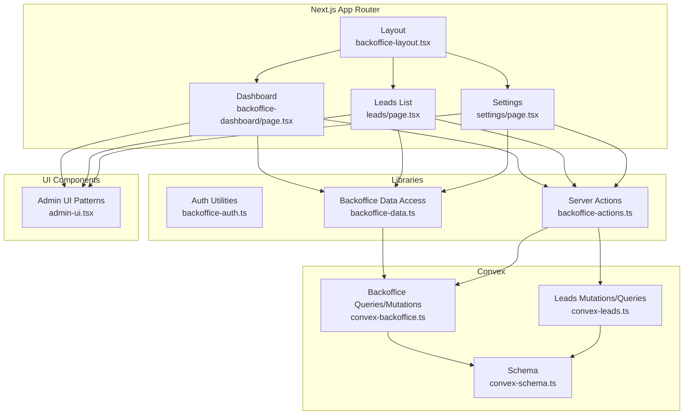
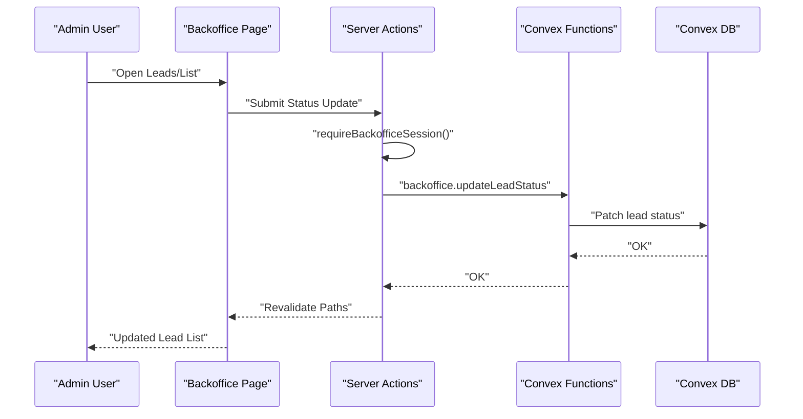
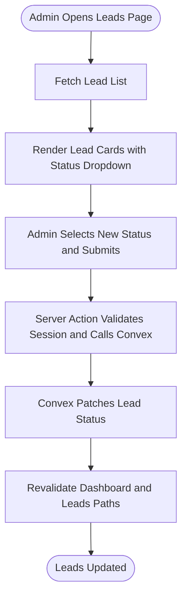
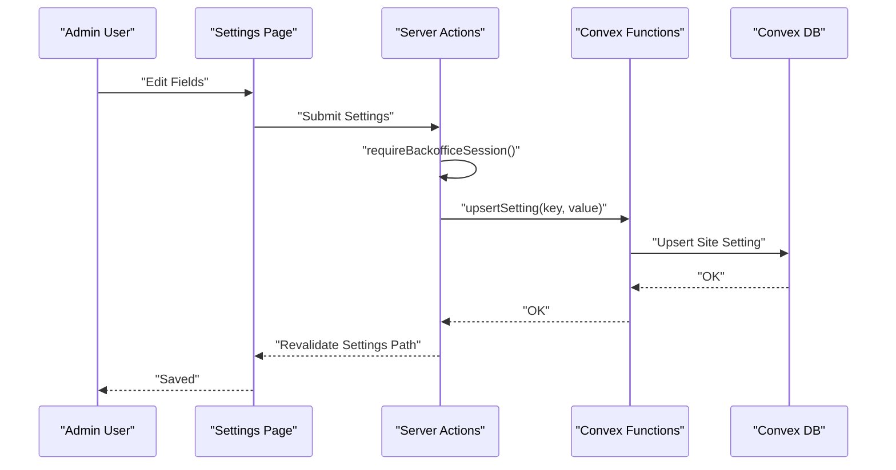
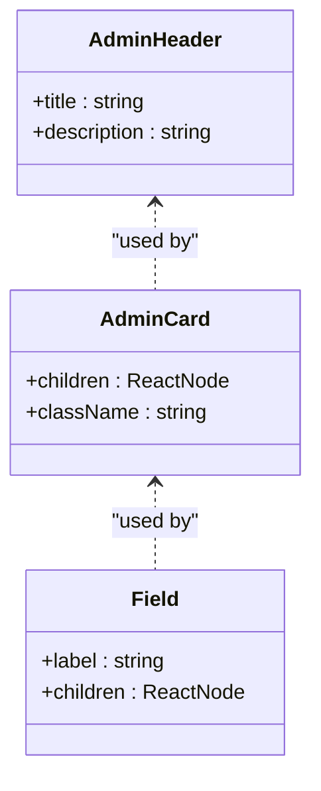
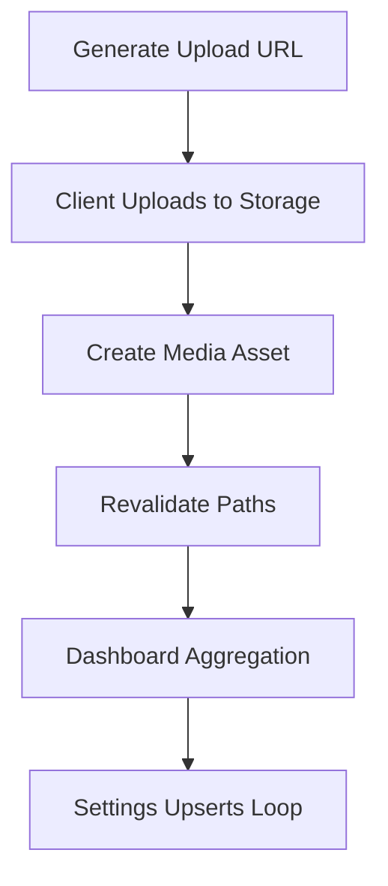
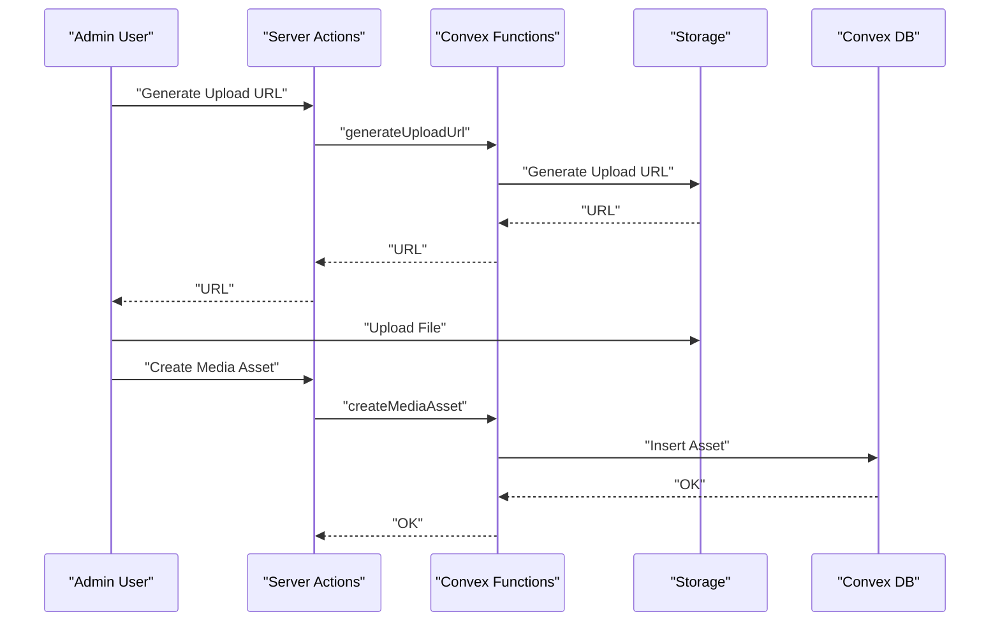
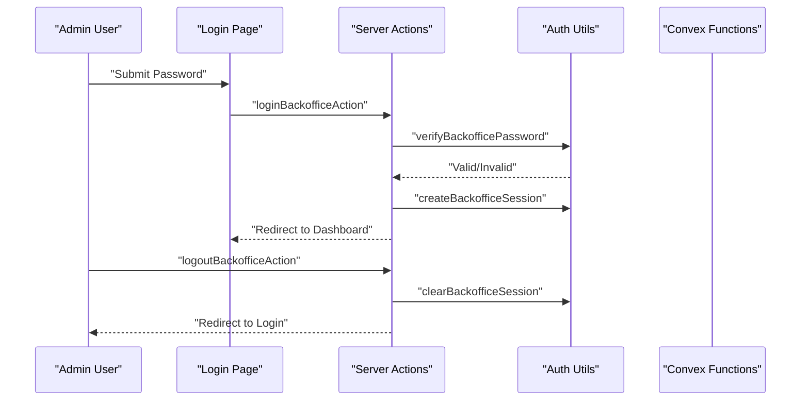
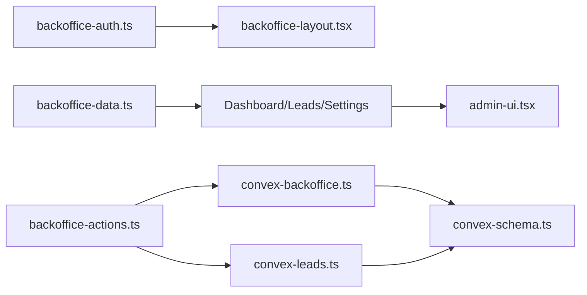
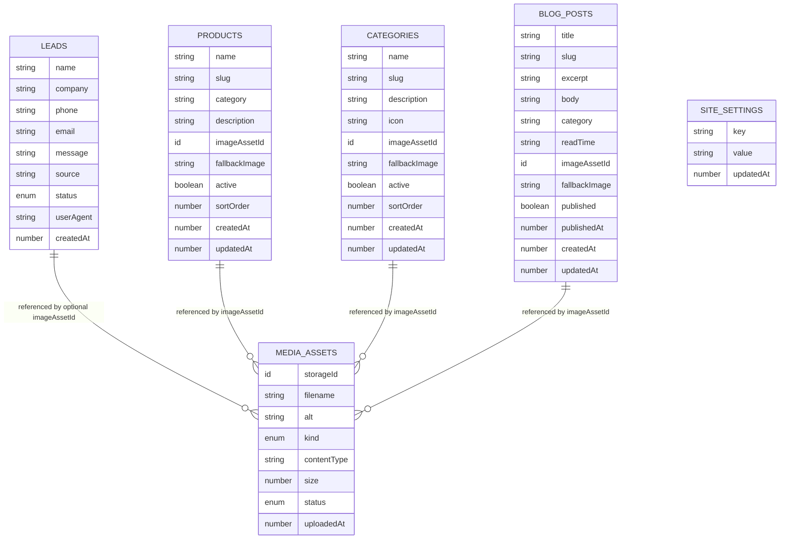

# Administrative Workflows

<cite>
**Referenced Files in This Document**
- [lead-actions.ts](file://app/actions/lead-actions.ts)
- [backoffice-auth.ts](file://lib/backoffice-auth.ts)
- [backoffice-data.ts](file://lib/backoffice-data.ts)
- [leads/page.tsx](file://app/backoffice/(admin)/leads/page.tsx)
- [settings/page.tsx](file://app/backoffice/(admin)/settings/page.tsx)
- [backoffice-dashboard/page.tsx](file://app/backoffice/(admin)/page.tsx)
- [backoffice-layout.tsx](file://app/backoffice/(admin)/layout.tsx)
- [admin-ui.tsx](file://components/backoffice/admin-ui.tsx)
- [backoffice-actions.ts](file://app/backoffice/actions.ts)
- [convex-schema.ts](file://convex/schema.ts)
- [convex-backoffice.ts](file://convex/backoffice.ts)
- [convex-leads.ts](file://convex/leads.ts)
</cite>

## Table of Contents
1. [Introduction](#introduction)
2. [Project Structure](#project-structure)
3. [Core Components](#core-components)
4. [Architecture Overview](#architecture-overview)
5. [Detailed Component Analysis](#detailed-component-analysis)
6. [Dependency Analysis](#dependency-analysis)
7. [Performance Considerations](#performance-considerations)
8. [Troubleshooting Guide](#troubleshooting-guide)
9. [Conclusion](#conclusion)
10. [Appendices](#appendices)

## Introduction
This document describes administrative workflows and operational procedures for managing leads, content, media, and settings within the backoffice. It covers lead management (viewing, status updates, assignment, follow-up tracking), system settings management, administrative UI patterns and component reuse, batch processing capabilities, export/import via Convex storage, audit and logging mechanisms, notifications, workflow automation, reporting, user management, integration points, and operational efficiency guidance.

## Project Structure
The administrative surface is organized under the Next.js app router with route groups for the backoffice admin area. Key areas include:
- Authentication and session management for administrators
- Dashboard and navigation shell
- Lead management pages
- Settings management page
- Data access utilities for backoffice queries
- Convex schema and server-side functions for CRUD and batch operations
- Reusable administrative UI components

**Diagram sources**
- [backoffice-layout.tsx:17-21](file://app/backoffice/(admin)/layout.tsx#L17-L21)
- [backoffice-dashboard/page.tsx:25-122](file://app/backoffice/(admin)/page.tsx#L25-L122)
- [leads/page.tsx:8-72](file://app/backoffice/(admin)/leads/page.tsx#L8-L72)
- [settings/page.tsx:18-44](file://app/backoffice/(admin)/settings/page.tsx#L18-L44)
- [backoffice-data.ts:6-21](file://lib/backoffice-data.ts#L6-L21)
- [backoffice-actions.ts:119-128](file://app/backoffice/actions.ts#L119-L128)
- [convex-backoffice.ts:120-184](file://convex/backoffice.ts#L120-L184)
- [convex-leads.ts:7-31](file://convex/leads.ts#L7-L31)
- [convex-schema.ts:4-86](file://convex/schema.ts#L4-L86)
- [admin-ui.tsx:3-24](file://components/backoffice/admin-ui.tsx#L3-L24)

**Section sources**
- [backoffice-layout.tsx:17-21](file://app/backoffice/(admin)/layout.tsx#L17-L21)
- [backoffice-dashboard/page.tsx:25-122](file://app/backoffice/(admin)/page.tsx#L25-L122)
- [leads/page.tsx:8-72](file://app/backoffice/(admin)/leads/page.tsx#L8-L72)
- [settings/page.tsx:18-44](file://app/backoffice/(admin)/settings/page.tsx#L18-L44)
- [backoffice-data.ts:6-21](file://lib/backoffice-data.ts#L6-L21)
- [backoffice-actions.ts:119-128](file://app/backoffice/actions.ts#L119-L128)
- [convex-backoffice.ts:120-184](file://convex/backoffice.ts#L120-L184)
- [convex-leads.ts:7-31](file://convex/leads.ts#L7-L31)
- [convex-schema.ts:4-86](file://convex/schema.ts#L4-L86)
- [admin-ui.tsx:3-24](file://components/backoffice/admin-ui.tsx#L3-L24)

## Core Components
- Authentication and session management for administrators, including password verification, session creation, and session enforcement.
- Backoffice data access helpers that wrap Convex queries with an API key guard.
- Server actions orchestrating mutations and cache revalidation for backoffice operations.
- Convex schema defining lead, media, product, category, blog, and site settings tables with indexes.
- Convex backoffice module implementing dashboard aggregation, lead listing, media upload URL generation, media asset lifecycle, and settings upsert.
- Convex leads module for creating leads and fetching recent entries.
- Administrative UI patterns for headers, cards, and form fields.

**Section sources**
- [backoffice-auth.ts:60-118](file://lib/backoffice-auth.ts#L60-L118)
- [backoffice-data.ts:6-21](file://lib/backoffice-data.ts#L6-L21)
- [backoffice-actions.ts:119-214](file://app/backoffice/actions.ts#L119-L214)
- [convex-schema.ts:4-86](file://convex/schema.ts#L4-L86)
- [convex-backoffice.ts:120-317](file://convex/backoffice.ts#L120-L317)
- [convex-leads.ts:7-31](file://convex/leads.ts#L7-L31)
- [admin-ui.tsx:3-24](file://components/backoffice/admin-ui.tsx#L3-L24)

## Architecture Overview
The backoffice follows a layered pattern:
- UI pages render lists and forms, invoking server actions.
- Server actions validate sessions, enforce admin key checks, and call Convex mutations.
- Convex mutations operate on typed documents and indexes, returning stable IDs.
- Data access utilities encapsulate query execution with admin key validation.
- Authentication middleware enforces session presence on protected routes.

**Diagram sources**
- [leads/page.tsx:40-59](file://app/backoffice/(admin)/leads/page.tsx#L40-L59)
- [backoffice-actions.ts:119-128](file://app/backoffice/actions.ts#L119-L128)
- [convex-backoffice.ts:155-161](file://convex/backoffice.ts#L155-L161)

**Section sources**
- [leads/page.tsx:40-59](file://app/backoffice/(admin)/leads/page.tsx#L40-L59)
- [backoffice-actions.ts:119-128](file://app/backoffice/actions.ts#L119-L128)
- [convex-backoffice.ts:155-161](file://convex/backoffice.ts#L155-L161)

## Detailed Component Analysis

### Lead Management Workflow
- Viewing leads: The dashboard and dedicated leads page fetch lead lists via backoffice data access utilities.
- Status updates: Each lead row includes a form posting to a server action that invokes a Convex mutation to patch the lead’s status.
- Assignment and follow-up tracking: The current schema defines a status field with predefined values. Assignment is not modeled in the schema; however, the status update mechanism supports tracking follow-ups and transitions.
- Lead submission pipeline: Public lead submissions are handled by a server action that validates input and calls a Convex mutation to insert a new lead record.

**Diagram sources**
- [leads/page.tsx:8-72](file://app/backoffice/(admin)/leads/page.tsx#L8-L72)
- [backoffice-actions.ts:119-128](file://app/backoffice/actions.ts#L119-L128)
- [convex-backoffice.ts:147-161](file://convex/backoffice.ts#L147-L161)

**Section sources**
- [leads/page.tsx:8-72](file://app/backoffice/(admin)/leads/page.tsx#L8-L72)
- [backoffice-actions.ts:119-128](file://app/backoffice/actions.ts#L119-L128)
- [convex-backoffice.ts:147-161](file://convex/backoffice.ts#L147-L161)
- [lead-actions.ts:32-95](file://app/actions/lead-actions.ts#L32-L95)
- [convex-leads.ts:7-31](file://convex/leads.ts#L7-L31)

### System Settings Management
- Settings page renders a form pre-populated from stored settings.
- Batch upsert: The settings action iterates over a fixed set of keys and issues individual upsert mutations per key.
- Revalidation ensures cached views reflect the latest settings.

**Diagram sources**
- [settings/page.tsx:18-44](file://app/backoffice/(admin)/settings/page.tsx#L18-L44)
- [backoffice-actions.ts:201-214](file://app/backoffice/actions.ts#L201-L214)
- [convex-backoffice.ts:301-317](file://convex/backoffice.ts#L301-L317)

**Section sources**
- [settings/page.tsx:18-44](file://app/backoffice/(admin)/settings/page.tsx#L18-L44)
- [backoffice-actions.ts:201-214](file://app/backoffice/actions.ts#L201-L214)
- [convex-backoffice.ts:301-317](file://convex/backoffice.ts#L301-L317)

### Administrative UI Patterns and Component Reusability
- AdminHeader: Provides consistent branding and description blocks across pages.
- AdminCard: Standardized card container with shared styles.
- Field: Wraps form inputs with labels for consistent layouts.
- These components are reused across dashboard, leads, and settings pages to maintain UI uniformity and reduce duplication.

**Diagram sources**
- [admin-ui.tsx:3-24](file://components/backoffice/admin-ui.tsx#L3-L24)

**Section sources**
- [admin-ui.tsx:3-24](file://components/backoffice/admin-ui.tsx#L3-L24)
- [backoffice-dashboard/page.tsx:13-16](file://app/backoffice/(admin)/page.tsx#L13-L16)
- [leads/page.tsx:13-16](file://app/backoffice/(admin)/leads/page.tsx#L13-L16)
- [settings/page.tsx:24-27](file://app/backoffice/(admin)/settings/page.tsx#L24-L27)

### Batch Processing Capabilities
- Media upload URL generation: A single mutation generates a short-lived upload URL for direct storage uploads.
- Media asset creation: A single mutation inserts a media asset with metadata.
- Content lists aggregation: One query fetches media, products, categories, blog posts, and settings concurrently for the dashboard.
- Settings upsert: A loop performs multiple upserts for a fixed set of keys in a single request.

**Diagram sources**
- [convex-backoffice.ts:68-108](file://convex/backoffice.ts#L68-L108)
- [convex-backoffice.ts:120-144](file://convex/backoffice.ts#L120-L144)
- [backoffice-actions.ts:201-214](file://app/backoffice/actions.ts#L201-L214)

**Section sources**
- [convex-backoffice.ts:68-108](file://convex/backoffice.ts#L68-L108)
- [convex-backoffice.ts:120-144](file://convex/backoffice.ts#L120-L144)
- [backoffice-actions.ts:201-214](file://app/backoffice/actions.ts#L201-L214)

### Export and Import Functionalities
- Import: Media assets are ingested via a generated upload URL and inserted into the mediaAssets table with metadata.
- Export: There is no explicit export endpoint in the provided code. Data can be retrieved via queries exposed to the backoffice and public content modules. For structured exports, integrate with Convex’s query APIs and storage URLs.

**Diagram sources**
- [convex-backoffice.ts:68-100](file://convex/backoffice.ts#L68-L100)
- [backoffice-actions.ts:79-108](file://app/backoffice/actions.ts#L79-L108)

**Section sources**
- [convex-backoffice.ts:68-100](file://convex/backoffice.ts#L68-L100)
- [backoffice-actions.ts:79-108](file://app/backoffice/actions.ts#L79-L108)

### Audit Trail and Logging Systems
- No explicit audit log model or logging service is present in the schema or backoffice module. Administrators can track changes indirectly by reviewing status updates and timestamps on leads and settings. For compliance, consider extending the schema with an audit log table and adding mutation hooks to record changes.

**Section sources**
- [convex-schema.ts:4-86](file://convex/schema.ts#L4-L86)
- [convex-backoffice.ts:120-184](file://convex/backoffice.ts#L120-L184)

### Notification Systems
- No built-in notification system exists in the codebase. Administrators can rely on status updates and dashboard summaries. To implement alerts, integrate with external services (e.g., email/SMS providers) from server actions or scheduled jobs.

**Section sources**
- [leads/page.tsx:40-59](file://app/backoffice/(admin)/leads/page.tsx#L40-L59)
- [backoffice-dashboard/page.tsx:57-78](file://app/backoffice/(admin)/page.tsx#L57-L78)

### Workflow Automation and Integration Points
- External integrations can be added by invoking third-party APIs from server actions or scheduled tasks. Current integration points include:
  - Media storage via Convex storage URLs
  - Settings persistence for contact channels
  - Lead ingestion via public form action

**Section sources**
- [backoffice-actions.ts:79-108](file://app/backoffice/actions.ts#L79-L108)
- [lead-actions.ts:32-95](file://app/actions/lead-actions.ts#L32-L95)
- [convex-backoffice.ts:301-317](file://convex/backoffice.ts#L301-L317)

### Administrative Reporting Features
- Dashboard aggregates counts and recent items for quick insights.
- No custom report builder is implemented. For advanced reporting, add queries that filter and aggregate data by date ranges, categories, or statuses.

**Section sources**
- [backoffice-dashboard/page.tsx:25-122](file://app/backoffice/(admin)/page.tsx#L25-L122)
- [convex-backoffice.ts:120-144](file://convex/backoffice.ts#L120-L144)

### User Management Workflows
- Authentication flow:
  - Login verifies the password hash and creates a signed session cookie.
  - Session validation redirects unauthenticated requests to the login page.
  - Logout clears the session cookie.
- Password hashing uses scrypt with a server-side secret. API key guards all backoffice mutations.

**Diagram sources**
- [backoffice-actions.ts:63-77](file://app/backoffice/actions.ts#L63-L77)
- [backoffice-auth.ts:41-58](file://lib/backoffice-auth.ts#L41-L58)
- [backoffice-auth.ts:60-81](file://lib/backoffice-auth.ts#L60-L81)
- [backoffice-layout.tsx:17-21](file://app/backoffice/(admin)/layout.tsx#L17-L21)

**Section sources**
- [backoffice-actions.ts:63-77](file://app/backoffice/actions.ts#L63-L77)
- [backoffice-auth.ts:41-58](file://lib/backoffice-auth.ts#L41-L58)
- [backoffice-auth.ts:60-81](file://lib/backoffice-auth.ts#L60-L81)
- [backoffice-layout.tsx:17-21](file://app/backoffice/(admin)/layout.tsx#L17-L21)

### Integration Between Administrative Workflows and Business Processes
- Leads feed into commercial follow-up via status transitions.
- Media assets support product and blog content.
- Settings centralize contact and social channels for consistent public presentation.
- Content lists aggregation enables synchronized dashboards.

**Section sources**
- [leads/page.tsx:18-69](file://app/backoffice/(admin)/leads/page.tsx#L18-L69)
- [backoffice-dashboard/page.tsx:49-119](file://app/backoffice/(admin)/page.tsx#L49-L119)
- [settings/page.tsx:18-44](file://app/backoffice/(admin)/settings/page.tsx#L18-L44)
- [convex-backoffice.ts:163-184](file://convex/backoffice.ts#L163-L184)

### Workflow Optimization and Administrative Efficiency Improvements
- Minimize round-trips by batching settings updates and leveraging concurrent queries in dashboard rendering.
- Use cache revalidation strategically to keep views fresh without unnecessary refreshes.
- Keep status vocabulary consistent to simplify automation rules.
- Consider adding bulk actions for leads (e.g., batch status updates) and media (e.g., bulk archive) to reduce repetitive clicks.

**Section sources**
- [backoffice-actions.ts:201-214](file://app/backoffice/actions.ts#L201-L214)
- [convex-backoffice.ts:120-144](file://convex/backoffice.ts#L120-L144)

## Dependency Analysis

**Diagram sources**
- [backoffice-auth.ts:60-118](file://lib/backoffice-auth.ts#L60-L118)
- [backoffice-layout.tsx:17-21](file://app/backoffice/(admin)/layout.tsx#L17-L21)
- [backoffice-data.ts:6-21](file://lib/backoffice-data.ts#L6-L21)
- [backoffice-actions.ts:119-214](file://app/backoffice/actions.ts#L119-L214)
- [convex-backoffice.ts:120-317](file://convex/backoffice.ts#L120-L317)
- [convex-leads.ts:7-31](file://convex/leads.ts#L7-L31)
- [admin-ui.tsx:3-24](file://components/backoffice/admin-ui.tsx#L3-L24)
- [convex-schema.ts:4-86](file://convex/schema.ts#L4-L86)

**Section sources**
- [backoffice-auth.ts:60-118](file://lib/backoffice-auth.ts#L60-L118)
- [backoffice-layout.tsx:17-21](file://app/backoffice/(admin)/layout.tsx#L17-L21)
- [backoffice-data.ts:6-21](file://lib/backoffice-data.ts#L6-L21)
- [backoffice-actions.ts:119-214](file://app/backoffice/actions.ts#L119-L214)
- [convex-backoffice.ts:120-317](file://convex/backoffice.ts#L120-L317)
- [convex-leads.ts:7-31](file://convex/leads.ts#L7-L31)
- [admin-ui.tsx:3-24](file://components/backoffice/admin-ui.tsx#L3-L24)
- [convex-schema.ts:4-86](file://convex/schema.ts#L4-L86)

## Performance Considerations
- Index usage: The schema defines indexes on status and timestamps to optimize queries for leads and media assets.
- Concurrency: Dashboard queries use concurrent fetches to minimize latency.
- Pagination limit: A constant caps returned items to prevent oversized responses.

**Section sources**
- [convex-schema.ts:16-17](file://convex/schema.ts#L16-L17)
- [convex-schema.ts:35-36](file://convex/schema.ts#L35-L36)
- [convex-backoffice.ts:125-131](file://convex/backoffice.ts#L125-L131)
- [convex-backoffice.ts:7](file://convex/backoffice.ts#L7)

## Troubleshooting Guide
- Authentication failures:
  - Verify the session secret and API key environment variables are set.
  - Ensure the login action receives the correct password and that the hashed password matches expectations.
- Unauthorized requests:
  - Confirm the admin key passed to backoffice functions equals the server environment variable.
- Lead status update errors:
  - Check that the lead ID exists and the status value is one of the allowed literals.
- Settings save issues:
  - Ensure all keys are present in the form and that the upsert mutation succeeds for each key.
- Media upload problems:
  - Validate the generated upload URL and confirm the client upload completes successfully before asset creation.

**Section sources**
- [backoffice-auth.ts:18-26](file://lib/backoffice-auth.ts#L18-L26)
- [backoffice-auth.ts:41-58](file://lib/backoffice-auth.ts#L41-L58)
- [convex-backoffice.ts:25-31](file://convex/backoffice.ts#L25-L31)
- [convex-backoffice.ts:155-161](file://convex/backoffice.ts#L155-L161)
- [backoffice-actions.ts:201-214](file://app/backoffice/actions.ts#L201-L214)
- [backoffice-actions.ts:79-108](file://app/backoffice/actions.ts#L79-L108)

## Conclusion
The backoffice provides a focused set of administrative capabilities centered on lead management, content and media administration, and settings maintenance. Its architecture leverages Convex for data modeling and server-side functions, with reusable UI components and robust session-based authentication. Extending the system with audit logging, notifications, and custom reporting would further enhance administrative oversight and efficiency.

## Appendices
- Data model overview for leads, media assets, products, categories, blog posts, and site settings.

**Diagram sources**
- [convex-schema.ts:4-86](file://convex/schema.ts#L4-L86)