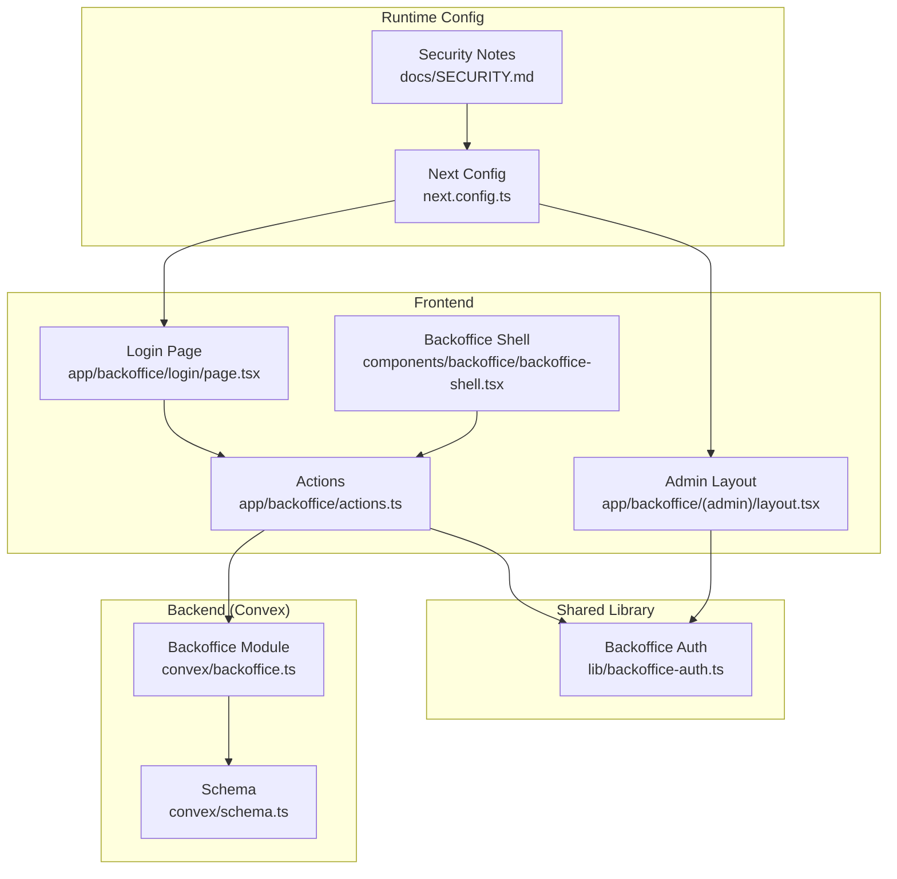
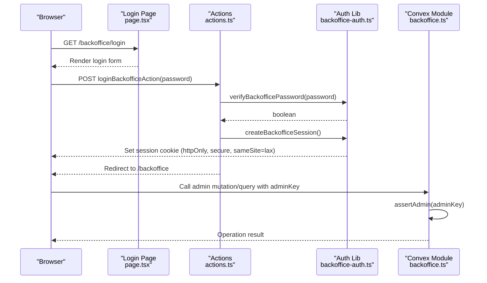
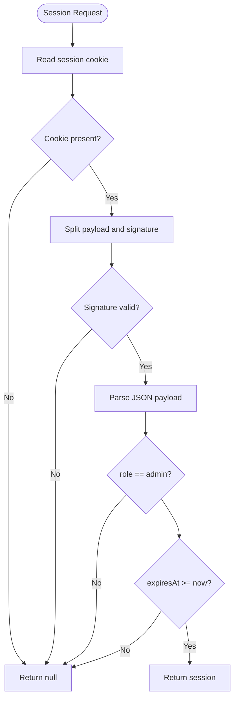
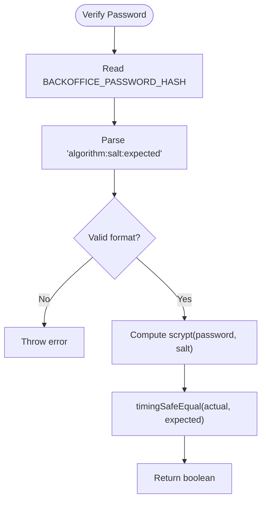
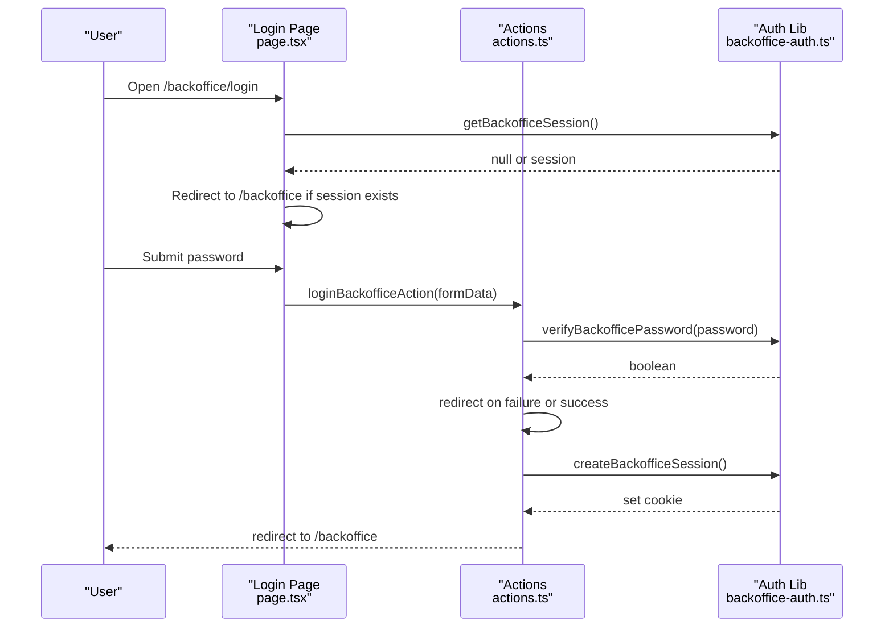
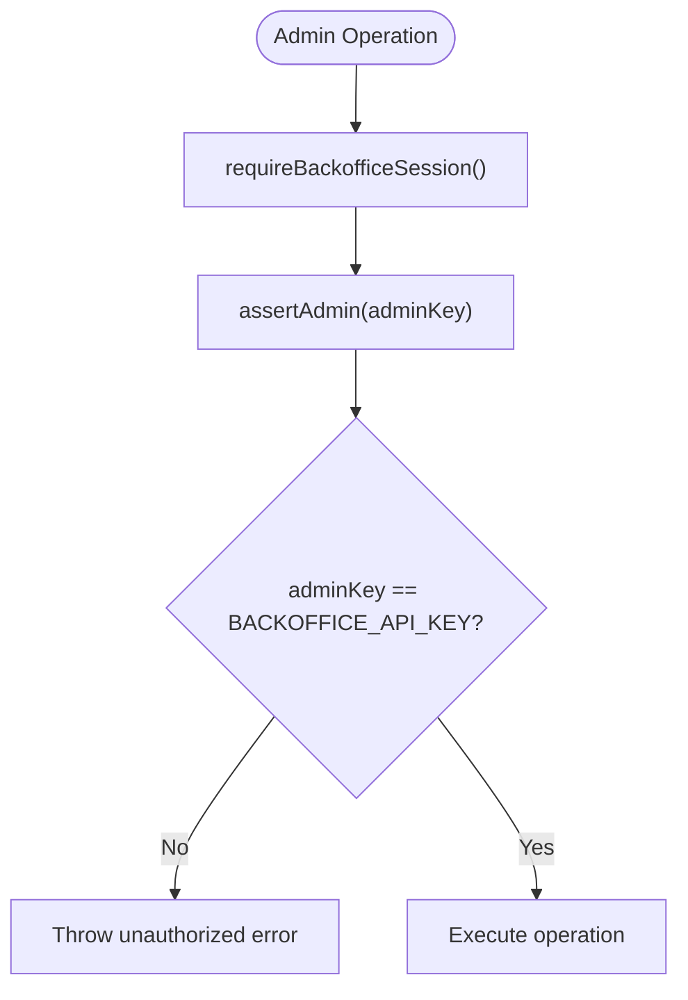
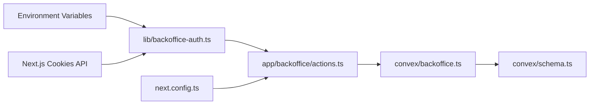

# Authentication & Security

<cite>
**Referenced Files in This Document**
- [backoffice-auth.ts](file://lib/backoffice-auth.ts)
- [actions.ts](file://app/backoffice/actions.ts)
- [page.tsx](file://app/backsice/login/page.tsx)
- [layout.tsx](file://app/backoffice/(admin)/layout.tsx)
- [backoffice-shell.tsx](file://components/backoffice/backoffice-shell.tsx)
- [backoffice.ts](file://convex/backoffice.ts)
- [schema.ts](file://convex/schema.ts)
- [next.config.ts](file://next.config.ts)
- [SECURITY.md](file://docs/SECURITY.md)
</cite>

## Table of Contents
1. [Introduction](#introduction)
2. [Project Structure](#project-structure)
3. [Core Components](#core-components)
4. [Architecture Overview](#architecture-overview)
5. [Detailed Component Analysis](#detailed-component-analysis)
6. [Dependency Analysis](#dependency-analysis)
7. [Performance Considerations](#performance-considerations)
8. [Troubleshooting Guide](#troubleshooting-guide)
9. [Conclusion](#conclusion)
10. [Appendices](#appendices)

## Introduction
This document explains the authentication and security model for the backoffice system. It covers session-based authentication, password hashing and verification, session payload structure and signing, cookie management, CSRF protection posture, secure cookie attributes, HTTPS enforcement, role-based access control, and operational best practices. It also documents environment variable requirements and provides troubleshooting guidance for common authentication and session issues.

## Project Structure
The authentication and security logic spans several layers:
- Frontend pages and actions handle login/logout and session checks.
- A shared library encapsulates session creation, verification, and password hashing.
- Convex backend enforces admin-only access via an API key guard.
- Next.js configuration hardens the application with security headers and CSP.

**Diagram sources**
- [page.tsx:17-68](file://app/backoffice/login/page.tsx#L17-L68)
- [actions.ts:63-77](file://app/backoffice/actions.ts#L63-L77)
- [backoffice-shell.tsx:17-77](file://components/backoffice/backoffice-shell.tsx#L17-L77)
- [layout.tsx](file://app/backoffice/(admin)/layout.tsx#L17-L21)
- [backoffice-auth.ts:60-108](file://lib/backoffice-auth.ts#L60-L108)
- [backoffice.ts:25-31](file://convex/backoffice.ts#L25-L31)
- [schema.ts:1-87](file://convex/schema.ts#L1-L87)
- [next.config.ts:27-61](file://next.config.ts#L27-L61)
- [SECURITY.md:1-29](file://docs/SECURITY.md#L1-L29)

**Section sources**
- [page.tsx:17-68](file://app/backoffice/login/page.tsx#L17-L68)
- [actions.ts:63-77](file://app/backoffice/actions.ts#L63-L77)
- [backoffice-shell.tsx:17-77](file://components/backoffice/backoffice-shell.tsx#L17-L77)
- [layout.tsx](file://app/backoffice/(admin)/layout.tsx#L17-L21)
- [backoffice-auth.ts:60-108](file://lib/backoffice-auth.ts#L60-L108)
- [backoffice.ts:25-31](file://convex/backoffice.ts#L25-L31)
- [schema.ts:1-87](file://convex/schema.ts#L1-L87)
- [next.config.ts:27-61](file://next.config.ts#L27-L61)
- [SECURITY.md:1-29](file://docs/SECURITY.md#L1-L29)

## Core Components
- Session management and cookie handling:
  - Cookie name, expiration, and secure attributes are defined and applied during session creation.
  - Session retrieval validates signature and expiry.
  - Session enforcement redirects unauthenticated users to the login page.
- Password hashing and verification:
  - Password hashing uses scrypt with a random salt and encodes the result with algorithm, salt, and hash parts.
  - Verification parses stored hash, recomputes scrypt with the provided password, and performs a timing-safe comparison.
- Role-based access control:
  - Sessions carry a fixed role ("admin").
  - Backend mutations and queries enforce admin-only access via an API key assertion.
- Login and logout:
  - Login action verifies credentials and creates a session.
  - Logout action clears the session cookie and redirects to the login page.
- Environment variables:
  - BACKOFFICE_SESSION_SECRET: HMAC signing key for session payloads.
  - BACKOFFICE_PASSWORD_HASH: Stored password hash in scrypt format.
  - BACKOFFICE_API_KEY: Secret key required for all admin operations.

**Section sources**
- [backoffice-auth.ts:6-12](file://lib/backoffice-auth.ts#L6-L12)
- [backoffice-auth.ts:60-108](file://lib/backoffice-auth.ts#L60-L108)
- [backoffice-auth.ts:35-58](file://lib/backoffice-auth.ts#L35-L58)
- [actions.ts:63-77](file://app/backoffice/actions.ts#L63-L77)
- [actions.ts:74-77](file://app/backoffice/actions.ts#L74-L77)
- [backoffice.ts:25-31](file://convex/backoffice.ts#L25-L31)

## Architecture Overview
The authentication flow integrates frontend session management with backend authorization:

**Diagram sources**
- [page.tsx:41-48](file://app/backoffice/login/page.tsx#L41-L48)
- [actions.ts:63-77](file://app/backoffice/actions.ts#L63-L77)
- [backoffice-auth.ts:60-108](file://lib/backoffice-auth.ts#L60-L108)
- [backoffice.ts:68-74](file://convex/backoffice.ts#L68-L74)

## Detailed Component Analysis

### Session Management and Cookie Handling
- Session payload structure:
  - Contains role and expiresAt.
- Signing and verification:
  - Payload is base64url-encoded and signed with HMAC-SHA256 using BACKOFFICE_SESSION_SECRET.
  - Signature is validated before parsing the payload.
- Cookie attributes:
  - httpOnly: true to mitigate XSS risks.
  - secure: enabled in production to ensure transport over HTTPS.
  - sameSite: lax to balance CSRF protection with usability.
  - path: "/" and maxAge aligned with session duration.
- Session lifecycle:
  - Creation sets the cookie with current expiration.
  - Retrieval validates presence, signature, role, and expiry.
  - Enforcement redirects to login if missing or invalid.

**Diagram sources**
- [backoffice-auth.ts:83-108](file://lib/backoffice-auth.ts#L83-L108)

**Section sources**
- [backoffice-auth.ts:6-12](file://lib/backoffice-auth.ts#L6-L12)
- [backoffice-auth.ts:60-108](file://lib/backoffice-auth.ts#L60-L108)

### Password Hashing and Secure Verification
- Hash generation:
  - Uses scrypt with a cryptographically random salt and derived key length matching the stored hash.
  - Encodes as "scrypt:<base64url-salt>:<base64url-hash>".
- Verification:
  - Parses stored hash into algorithm, salt, and expected hash.
  - Recomputes scrypt with provided password and stored salt.
  - Performs timing-safe comparison to prevent timing attacks.

**Diagram sources**
- [backoffice-auth.ts:35-58](file://lib/backoffice-auth.ts#L35-L58)

**Section sources**
- [backoffice-auth.ts:35-58](file://lib/backoffice-auth.ts#L35-L58)

### Login Page Implementation, Form Validation, and Error Handling
- Page behavior:
  - Checks for an existing session; if present, redirects to the backoffice dashboard.
  - Renders a password field with client-side required attribute and autocomplete hints.
  - Displays an error message when redirected with an error query parameter.
- Action:
  - Extracts password from FormData, trims whitespace.
  - Verifies against stored hash; on failure, redirects to login with an error flag.
  - On success, creates a session and redirects to the dashboard.

**Diagram sources**
- [page.tsx:17-68](file://app/backoffice/login/page.tsx#L17-L68)
- [actions.ts:63-77](file://app/backoffice/actions.ts#L63-L77)
- [backoffice-auth.ts:60-108](file://lib/backoffice-auth.ts#L60-L108)

**Section sources**
- [page.tsx:17-68](file://app/backoffice/login/page.tsx#L17-L68)
- [actions.ts:63-77](file://app/backoffice/actions.ts#L63-L77)

### Role-Based Access Control and Permission Validation
- Role:
  - Sessions carry role "admin".
- Backend enforcement:
  - All admin-facing mutations and queries call an assertion that compares the provided adminKey with the BACKOFFICE_API_KEY environment variable.
  - Unauthorized requests are rejected with an error.

**Diagram sources**
- [layout.tsx](file://app/backoffice/(admin)/layout.tsx#L17-L21)
- [backoffice-auth.ts:110-118](file://lib/backoffice-auth.ts#L110-L118)
- [backoffice.ts:25-31](file://convex/backoffice.ts#L25-L31)

**Section sources**
- [layout.tsx](file://app/backoffice/(admin)/layout.tsx#L17-L21)
- [backoffice-auth.ts:110-118](file://lib/backoffice-auth.ts#L110-L118)
- [backoffice.ts:25-31](file://convex/backoffice.ts#L25-L31)

### Environment Variables and Configuration
- BACKOFFICE_SESSION_SECRET:
  - Required for signing session payloads.
- BACKOFFICE_PASSWORD_HASH:
  - Required and must be in "scrypt:<base64url-salt>:<base64url-hash>" format.
- BACKOFFICE_API_KEY:
  - Required for all admin operations on the backend.

**Section sources**
- [backoffice-auth.ts:18-25](file://lib/backoffice-auth.ts#L18-L25)
- [backoffice-auth.ts:41-52](file://lib/backoffice-auth.ts#L41-L52)
- [backoffice-auth.ts:120-128](file://lib/backoffice-auth.ts#L120-L128)
- [backoffice.ts:25-31](file://convex/backoffice.ts#L25-L31)

### Security Measures and Hardening
- Secure cookie attributes:
  - httpOnly, sameSite=lax, secure in production, path "/", maxAge aligned with session duration.
- CSRF protection posture:
  - No CSRF tokens are implemented in the current flow. The combination of httpOnly and sameSite=lax reduces risk, but CSRF tokens are recommended for stronger protection.
- HTTPS enforcement:
  - Strict-Transport-Security header is set in production.
- Additional hardening:
  - Content-Security-Policy, X-Frame-Options, X-Content-Type-Options, Referrer-Policy, Permissions-Policy, Cross-Origin headers are configured.

**Section sources**
- [backoffice-auth.ts:69-75](file://lib/backoffice-auth.ts#L69-L75)
- [next.config.ts:27-61](file://next.config.ts#L27-L61)
- [SECURITY.md:5-14](file://docs/SECURITY.md#L5-L14)

## Dependency Analysis
The authentication and security logic depends on:
- Environment variables for secrets and hashes.
- Next.js cookies API for session persistence.
- Convex backend for admin-only operations.

**Diagram sources**
- [backoffice-auth.ts:18-25](file://lib/backoffice-auth.ts#L18-L25)
- [actions.ts:8-14](file://app/backoffice/actions.ts#L8-L14)
- [backoffice.ts:25-31](file://convex/backoffice.ts#L25-L31)
- [schema.ts:1-87](file://convex/schema.ts#L1-L87)
- [next.config.ts:79-87](file://next.config.ts#L79-L87)

**Section sources**
- [backoffice-auth.ts:18-25](file://lib/backoffice-auth.ts#L18-L25)
- [actions.ts:8-14](file://app/backoffice/actions.ts#L8-L14)
- [backoffice.ts:25-31](file://convex/backoffice.ts#L25-L31)
- [schema.ts:1-87](file://convex/schema.ts#L1-L87)
- [next.config.ts:79-87](file://next.config.ts#L79-L87)

## Performance Considerations
- Session verification is O(1) per request after cookie retrieval.
- Password verification uses scrypt; cost parameters are fixed in code. Consider tuning for deployment latency vs. security trade-offs if needed.
- Backend admin operations rely on Convex; ensure API key checks remain lightweight and avoid unnecessary work inside assertions.

[No sources needed since this section provides general guidance]

## Troubleshooting Guide
- Authentication failures:
  - Symptom: Redirected to login with an error message.
  - Causes: Incorrect password, missing or expired session, invalid signature, or misconfigured BACKOFFICE_PASSWORD_HASH.
  - Resolution: Verify BACKOFFICE_PASSWORD_HASH format and correctness; ensure BACKOFFICE_SESSION_SECRET is set; confirm browser accepts cookies.
- Session issues:
  - Symptom: Logged out unexpectedly or unable to access admin routes.
  - Causes: Expired session, wrong secure flag in development vs. production, or browser privacy settings blocking cookies.
  - Resolution: Confirm NODE_ENV affects secure cookie behavior; check SameSite and domain/path; clear browser cookies for the site.
- CSRF-related problems:
  - Symptom: Login appears successful but admin routes reject access.
  - Causes: Missing CSRF protection; cross-site requests failing due to cookie policies.
  - Resolution: Add CSRF tokens to forms and validate them server-side; ensure sameSite and CORS policies align.
- Backend authorization errors:
  - Symptom: "Unauthorized backoffice request" errors.
  - Causes: Missing or incorrect BACKOFFICE_API_KEY.
  - Resolution: Set BACKOFFICE_API_KEY consistently across environments and ensure it matches the value passed to admin operations.

**Section sources**
- [page.tsx:50-54](file://app/backoffice/login/page.tsx#L50-L54)
- [backoffice-auth.ts:41-52](file://lib/backoffice-auth.ts#L41-L52)
- [backoffice-auth.ts:93-95](file://lib/backoffice-auth.ts#L93-L95)
- [backoffice.ts:25-31](file://convex/backoffice.ts#L25-L31)

## Conclusion
The backoffice authentication system uses a robust session-based approach with secure cookie attributes, HMAC-signed payloads, and scrypt-based password verification. Role-based access control is enforced on the backend using an API key. While CSRF protection is not currently implemented, the existing cookie flags reduce risk. Production deployments should enforce HTTPS, manage secrets securely, and consider adding CSRF tokens for stronger protection.

[No sources needed since this section summarizes without analyzing specific files]

## Appendices

### Appendix A: Session Lifecycle Details
- Creation:
  - Build payload with role and expiresAt.
  - Sign payload and set cookie with httpOnly, secure, sameSite, path, and maxAge.
- Retrieval:
  - Validate presence, split payload/signature, verify signature, parse JSON, check role and expiry.
- Enforcement:
  - Redirect to login if session is missing or invalid.

**Section sources**
- [backoffice-auth.ts:60-108](file://lib/backoffice-auth.ts#L60-L108)

### Appendix B: Password Hash Format
- Format: scrypt:<base64url-salt>:<base64url-hash>
- Validation: Algorithm must be "scrypt"; salt and expected hash must be present.

**Section sources**
- [backoffice-auth.ts:48-52](file://lib/backoffice-auth.ts#L48-L52)

### Appendix C: Security Headers and CSP
- Security headers include CSP, HSTS, XFO, XTO, Referrer-Policy, Permissions-Policy, COOP, and CORP.
- CSP restricts script, connect, frame, and other resources; adjust as needed for integrations.

**Section sources**
- [next.config.ts:27-61](file://next.config.ts#L27-L61)
- [SECURITY.md:5-14](file://docs/SECURITY.md#L5-L14)