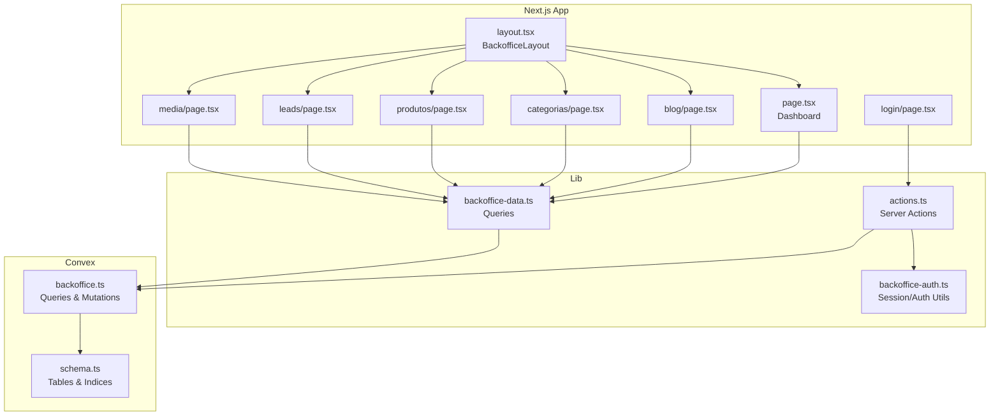
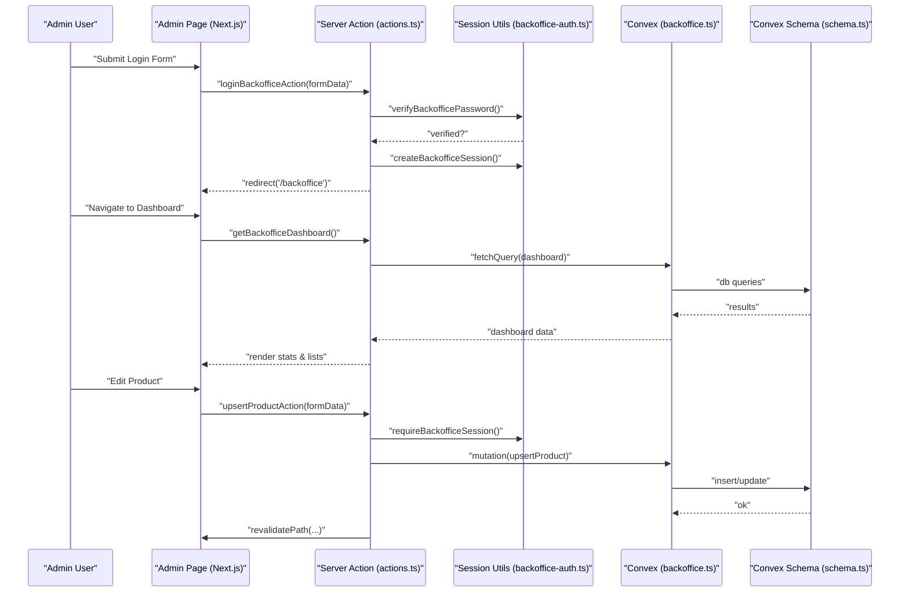
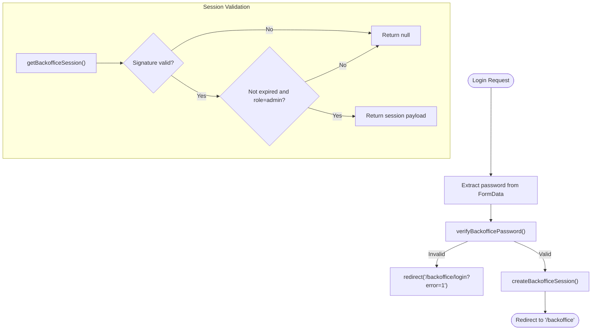
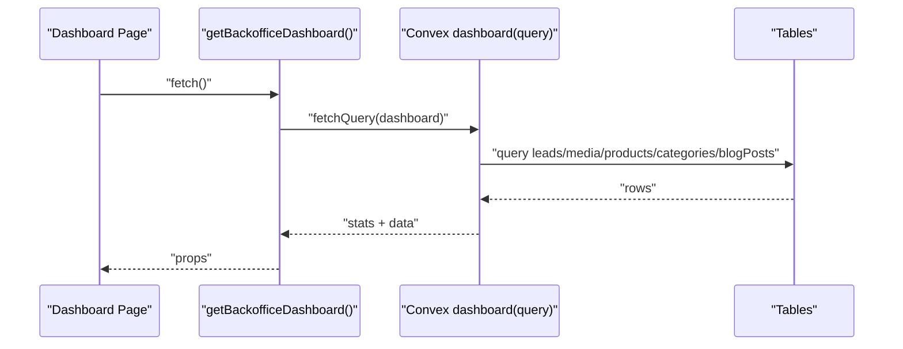
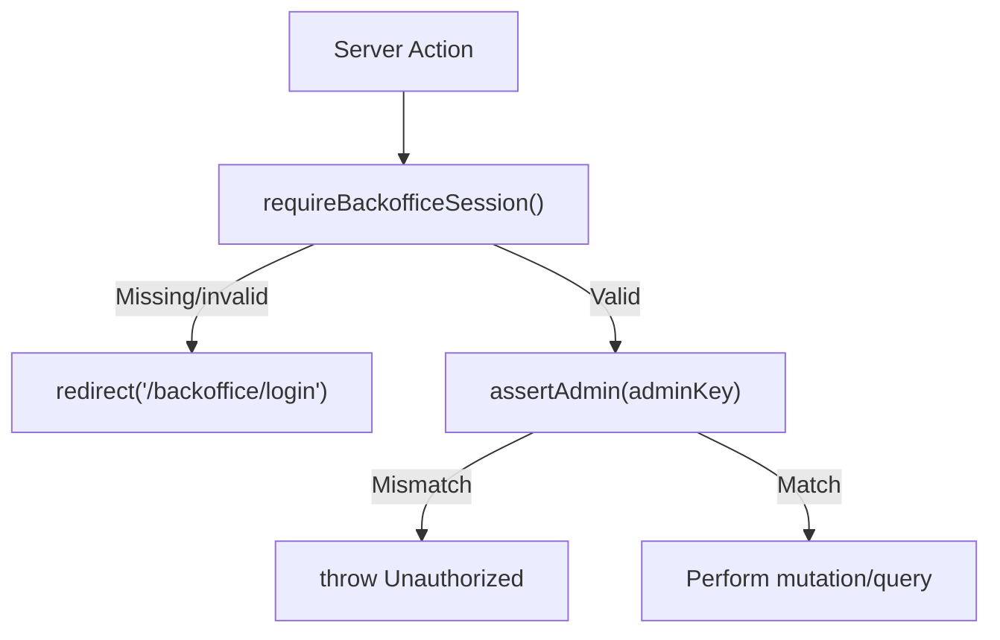
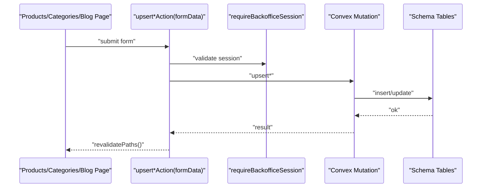
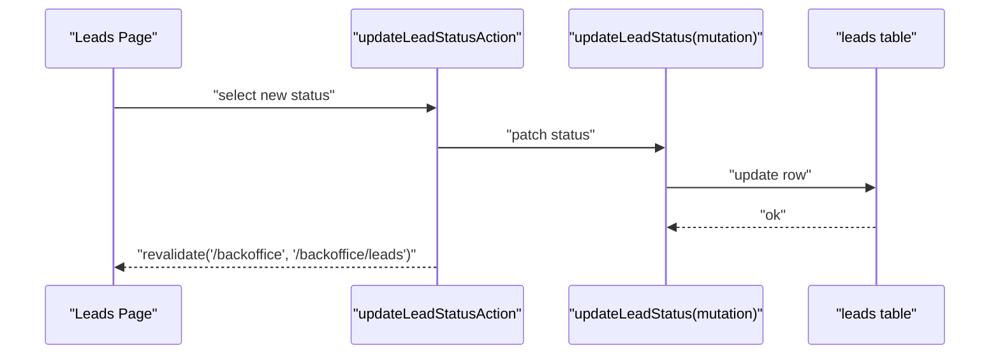
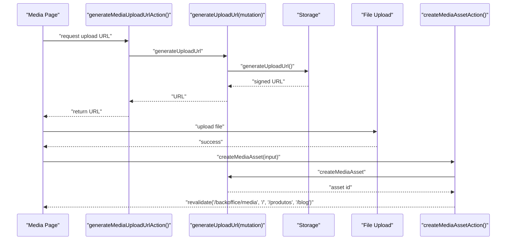
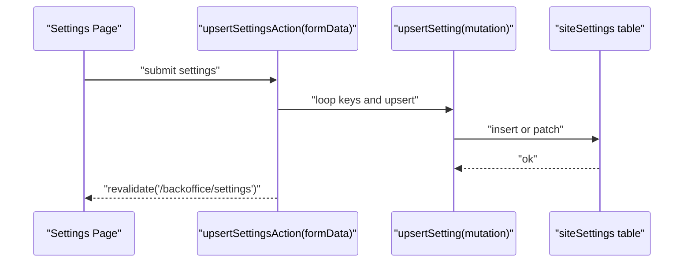
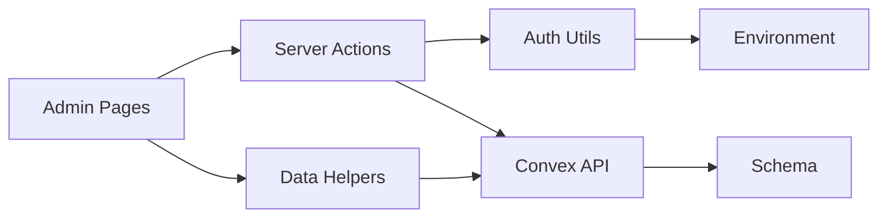

# Backoffice Administration

<cite>
**Referenced Files in This Document**
- [backoffice-auth.ts](file://lib/backoffice-auth.ts)
- [actions.ts](file://app/backoffice/actions.ts)
- [backoffice-data.ts](file://lib/backoffice-data.ts)
- [backoffice.ts](file://convex/backoffice.ts)
- [schema.ts](file://convex/schema.ts)
- [layout.tsx](file://app/backoffice/(admin)/layout.tsx)
- [page.tsx](file://app/backoffice/(admin)/page.tsx)
- [login-page.tsx](file://app/backoffice/login/page.tsx)
- [blog-page.tsx](file://app/backoffice/(admin)/blog/page.tsx)
- [categorias-page.tsx](file://app/backoffice/(admin)/categorias/page.tsx)
- [leads-page.tsx](file://app/backoffice/(admin)/leads/page.tsx)
- [media-page.tsx](file://app/backoffice/(admin)/media/page.tsx)
- [produtos-page.tsx](file://app/backoffice/(admin)/produtos/page.tsx)
</cite>

## Table of Contents
1. [Introduction](#introduction)
2. [Project Structure](#project-structure)
3. [Core Components](#core-components)
4. [Architecture Overview](#architecture-overview)
5. [Detailed Component Analysis](#detailed-component-analysis)
6. [Dependency Analysis](#dependency-analysis)
7. [Performance Considerations](#performance-considerations)
8. [Troubleshooting Guide](#troubleshooting-guide)
9. [Conclusion](#conclusion)
10. [Appendices](#appendices)

## Introduction
This document describes the protected administrative backoffice interface, covering session-based authentication, administrative dashboards, role-based access control, content workflows, media asset management, reporting and analytics, Convex backend integration, security measures, and user experience patterns. It targets administrators and developers who maintain and operate the system.

## Project Structure
The backoffice is organized as a Next.js app under app/backoffice with:
- Authentication utilities in lib/backoffice-auth.ts
- Server actions in app/backoffice/actions.ts
- Data fetching helpers in lib/backoffice-data.ts
- Convex backend definitions in convex/backoffice.ts and schema.ts
- Admin UI pages under app/backoffice/(admin)/* and login page under app/backoffice/login

**Diagram sources**
- [layout.tsx](file://app/backoffice/(admin)/layout.tsx#L17-L21)
- [page.tsx](file://app/backoffice/(admin)/page.tsx#L25-L122)
- [blog-page.tsx](file://app/backoffice/(admin)/blog/page.tsx#L98-L148)
- [categorias-page.tsx](file://app/backoffice/(admin)/categorias/page.tsx#L89-L139)
- [produtos-page.tsx](file://app/backoffice/(admin)/produtos/page.tsx#L82-L132)
- [leads-page.tsx](file://app/backoffice/(admin)/leads/page.tsx#L8-L72)
- [media-page.tsx](file://app/backoffice/(admin)/media/page.tsx#L17-L82)
- [login-page.tsx:17-68](file://app/backoffice/login/page.tsx#L17-L68)
- [actions.ts:1-215](file://app/backoffice/actions.ts#L1-L215)
- [backoffice-auth.ts:1-129](file://lib/backoffice-auth.ts#L1-L129)
- [backoffice-data.ts:1-21](file://lib/backoffice-data.ts#L1-L21)
- [backoffice.ts:1-385](file://convex/backoffice.ts#L1-L385)
- [schema.ts:1-87](file://convex/schema.ts#L1-L87)

**Section sources**
- [layout.tsx](file://app/backoffice/(admin)/layout.tsx#L17-L21)
- [actions.ts:1-215](file://app/backoffice/actions.ts#L1-L215)
- [backoffice-auth.ts:1-129](file://lib/backoffice-auth.ts#L1-L129)
- [backoffice-data.ts:1-21](file://lib/backoffice-data.ts#L1-L21)
- [backoffice.ts:1-385](file://convex/backoffice.ts#L1-L385)
- [schema.ts:1-87](file://convex/schema.ts#L1-L87)

## Core Components
- Session-based authentication with signed cookies, expiration, and admin role enforcement
- Server actions orchestrating CRUD operations and revalidation
- Convex queries/mutations for dashboard, content lists, media, and settings
- Strong typing via Convex schema and runtime validators

Key responsibilities:
- Authentication: verifyBackofficePassword, createBackofficeSession, getBackofficeSession, requireBackofficeSession
- Authorization: BACKOFFICE_API_KEY enforced in Convex mutations
- Data access: getBackofficeDashboard, getBackofficeContentLists, getBackofficeLeads, getBackofficeMedia
- Content workflows: upsertProduct, upsertCategory, upsertBlogPost, updateLeadStatus, upsertSetting
- Media workflows: generateUploadUrl, createMediaAsset, archiveMediaAsset

**Section sources**
- [backoffice-auth.ts:41-118](file://lib/backoffice-auth.ts#L41-L118)
- [actions.ts:63-214](file://app/backoffice/actions.ts#L63-L214)
- [backoffice-data.ts:6-20](file://lib/backoffice-data.ts#L6-L20)
- [backoffice.ts:25-31](file://convex/backoffice.ts#L25-L31)

## Architecture Overview
The backoffice enforces admin-only access via a server-side session cookie. Server actions validate sessions and forward requests to Convex, which enforces API key-based authorization and performs database/storage operations. UI pages render dashboards and forms, invoking server actions for persistence and cache revalidation.

**Diagram sources**
- [login-page.tsx:41-48](file://app/backoffice/login/page.tsx#L41-L48)
- [actions.ts:63-72](file://app/backoffice/actions.ts#L63-L72)
- [backoffice-auth.ts:41-76](file://lib/backoffice-auth.ts#L41-L76)
- [page.tsx](file://app/backoffice/(admin)/page.tsx#L26-L26)
- [backoffice-data.ts:6-8](file://lib/backoffice-data.ts#L6-L8)
- [backoffice.ts:120-144](file://convex/backoffice.ts#L120-L144)
- [schema.ts:37-48](file://convex/schema.ts#L37-L48)

## Detailed Component Analysis

### Session-Based Authentication
- Password verification uses scrypt with constant-time comparison
- Session cookie stores a signed payload with role=admin and expiry
- requireBackofficeSession enforces presence and validity, redirecting unauthenticated users to /backoffice/login
- API key validation occurs in Convex mutations to prevent unauthorized backend access

**Diagram sources**
- [actions.ts:63-72](file://app/backoffice/actions.ts#L63-L72)
- [backoffice-auth.ts:41-108](file://lib/backoffice-auth.ts#L41-L108)

**Section sources**
- [backoffice-auth.ts:41-118](file://lib/backoffice-auth.ts#L41-L118)
- [actions.ts:63-72](file://app/backoffice/actions.ts#L63-L72)
- [login-page.tsx:22-26](file://app/backoffice/login/page.tsx#L22-L26)

### Administrative Dashboard
- Renders lead counts, recent leads, and latest media assets
- Provides quick actions to mark lead status and manage media
- Uses getBackofficeDashboard to fetch aggregated stats and recent items

**Diagram sources**
- [page.tsx](file://app/backoffice/(admin)/page.tsx#L26-L26)
- [backoffice-data.ts:6-8](file://lib/backoffice-data.ts#L6-L8)
- [backoffice.ts:120-144](file://convex/backoffice.ts#L120-L144)

**Section sources**
- [page.tsx](file://app/backoffice/(admin)/page.tsx#L25-L122)
- [backoffice-data.ts:6-8](file://lib/backoffice-data.ts#L6-L8)
- [backoffice.ts:120-144](file://convex/backoffice.ts#L120-L144)

### Role-Based Access Control and Permission Management
- Admin role is embedded in the session payload and enforced by requireBackofficeSession
- Convex mutations enforce authorization via BACKOFFICE_API_KEY, ensuring only trusted callers can mutate data
- No separate roles beyond admin; permissions are implicit in admin key possession

**Diagram sources**
- [backoffice-auth.ts:110-118](file://lib/backoffice-auth.ts#L110-L118)
- [backoffice.ts:25-31](file://convex/backoffice.ts#L25-L31)
- [actions.ts:80-82](file://app/backoffice/actions.ts#L80-L82)

**Section sources**
- [backoffice-auth.ts:110-118](file://lib/backoffice-auth.ts#L110-L118)
- [backoffice.ts:25-31](file://convex/backoffice.ts#L25-L31)

### Content Workflows: Products, Categories, Blog
- Forms collect sanitized inputs and compute slugs when missing
- Server actions call Convex mutations to upsert documents and revalidate paths
- Media selection filters active assets and supports optional image assignment

**Diagram sources**
- [produtos-page.tsx](file://app/backoffice/(admin)/produtos/page.tsx#L82-L132)
- [categorias-page.tsx](file://app/backoffice/(admin)/categorias/page.tsx#L89-L139)
- [blog-page.tsx](file://app/backoffice/(admin)/blog/page.tsx#L98-L148)
- [actions.ts:130-199](file://app/backoffice/actions.ts#L130-L199)
- [backoffice.ts:186-299](file://convex/backoffice.ts#L186-L299)

**Section sources**
- [produtos-page.tsx](file://app/backoffice/(admin)/produtos/page.tsx#L30-L80)
- [categorias-page.tsx](file://app/backoffice/(admin)/categorias/page.tsx#L32-L87)
- [blog-page.tsx](file://app/backoffice/(admin)/blog/page.tsx#L36-L96)
- [actions.ts:130-199](file://app/backoffice/actions.ts#L130-L199)
- [backoffice.ts:186-299](file://convex/backoffice.ts#L186-L299)

### Lead Management Workflow
- Lists recent leads with status badges
- Updates lead status via a server action that invokes Convex mutation
- Revalidates dashboard and leads list after updates

**Diagram sources**
- [leads-page.tsx](file://app/backoffice/(admin)/leads/page.tsx#L8-L72)
- [actions.ts:119-128](file://app/backoffice/actions.ts#L119-L128)
- [backoffice.ts:155-161](file://convex/backoffice.ts#L155-L161)

**Section sources**
- [leads-page.tsx](file://app/backoffice/(admin)/leads/page.tsx#L8-L72)
- [actions.ts:119-128](file://app/backoffice/actions.ts#L119-L128)
- [backoffice.ts:147-161](file://convex/backoffice.ts#L147-L161)

### Media Asset Management
- Generates pre-signed upload URLs via Convex storage
- Creates media assets with metadata and attaches URLs for rendering
- Archives assets to hide them without deleting
- Displays thumbnails, filenames, kinds, sizes, and alt text

**Diagram sources**
- [media-page.tsx](file://app/backoffice/(admin)/media/page.tsx#L17-L82)
- [actions.ts:79-108](file://app/backoffice/actions.ts#L79-L108)
- [backoffice.ts:68-108](file://convex/backoffice.ts#L68-L108)

**Section sources**
- [media-page.tsx](file://app/backoffice/(admin)/media/page.tsx#L17-L82)
- [actions.ts:79-108](file://app/backoffice/actions.ts#L79-L108)
- [backoffice.ts:68-108](file://convex/backoffice.ts#L68-L108)

### Settings Management
- Upserts site settings in bulk from a single form submission
- Revalidates settings page after updates

**Diagram sources**
- [actions.ts:201-214](file://app/backoffice/actions.ts#L201-L214)
- [backoffice.ts:301-317](file://convex/backoffice.ts#L301-L317)

**Section sources**
- [actions.ts:201-214](file://app/backoffice/actions.ts#L201-L214)
- [backoffice.ts:301-317](file://convex/backoffice.ts#L301-L317)

### Reporting and Analytics
- Dashboard aggregates counts for leads, media, products, categories, and blog posts
- Lead list and media list queries support overview pages
- No dedicated analytics module; metrics are derived from existing queries

**Section sources**
- [backoffice.ts:120-144](file://convex/backoffice.ts#L120-L144)
- [backoffice.ts:147-153](file://convex/backoffice.ts#L147-L153)
- [backoffice.ts:110-118](file://convex/backoffice.ts#L110-L118)

### Security Measures
- Password hashing with scrypt and constant-time comparison
- Signed session cookies with httpOnly, sameSite=lax, and secure flags in production
- Admin-only routes enforced by requireBackofficeSession
- Convex mutations guarded by BACKOFFICE_API_KEY
- Input sanitization and length limits in server actions
- No CSRF middleware observed; session cookie usage mitigates risk

**Section sources**
- [backoffice-auth.ts:35-58](file://lib/backoffice-auth.ts#L35-L58)
- [backoffice-auth.ts:60-81](file://lib/backoffice-auth.ts#L60-L81)
- [backoffice-auth.ts:110-118](file://lib/backoffice-auth.ts#L110-L118)
- [backoffice.ts:25-31](file://convex/backoffice.ts#L25-L31)
- [actions.ts:94-102](file://app/backoffice/actions.ts#L94-L102)

### Administrative User Experience
- Navigation: Protected layout ensures only authenticated admins see admin pages
- Forms: Consistent Field wrappers, validation, and submit buttons
- Feedback: Error messages on login failure; empty-state messaging for lists
- Revalidation: Automatic cache refresh after mutations to keep views consistent

**Section sources**
- [layout.tsx](file://app/backoffice/(admin)/layout.tsx#L17-L21)
- [login-page.tsx:50-54](file://app/backoffice/login/page.tsx#L50-L54)
- [produtos-page.tsx](file://app/backoffice/(admin)/produtos/page.tsx#L122-L126)
- [categorias-page.tsx](file://app/backoffice/(admin)/categorias/page.tsx#L129-L133)
- [blog-page.tsx](file://app/backoffice/(admin)/blog/page.tsx#L138-L142)
- [media-page.tsx](file://app/backoffice/(admin)/media/page.tsx#L73-L76)

## Dependency Analysis
- UI pages depend on server actions for persistence and on data helpers for queries
- Server actions depend on session utilities and Convex API
- Convex mutations depend on schema-defined tables and indices
- Authentication and authorization are centralized in backoffice-auth.ts and enforced in Convex

**Diagram sources**
- [actions.ts:1-14](file://app/backoffice/actions.ts#L1-L14)
- [backoffice-auth.ts:1-12](file://lib/backoffice-auth.ts#L1-L12)
- [backoffice-data.ts:1-4](file://lib/backoffice-data.ts#L1-L4)
- [backoffice.ts:1-6](file://convex/backoffice.ts#L1-L6)
- [schema.ts:1-4](file://convex/schema.ts#L1-L4)

**Section sources**
- [actions.ts:1-14](file://app/backoffice/actions.ts#L1-L14)
- [backoffice-auth.ts:1-12](file://lib/backoffice-auth.ts#L1-L12)
- [backoffice-data.ts:1-4](file://lib/backoffice-data.ts#L1-L4)
- [backoffice.ts:1-6](file://convex/backoffice.ts#L1-L6)
- [schema.ts:1-4](file://convex/schema.ts#L1-L4)

## Performance Considerations
- Queries limit results to small batches (MAX_ITEMS) to avoid heavy loads
- Indexes on frequently queried fields (e.g., by_created_at, by_status_and_uploaded_at) improve performance
- Revalidation triggers only affected paths after mutations to minimize unnecessary work
- Consider adding pagination for large lists and optimizing image sizes for media previews

[No sources needed since this section provides general guidance]

## Troubleshooting Guide
Common issues and resolutions:
- Login fails or redirects to login page
  - Ensure BACKOFFICE_PASSWORD_HASH is set and correct
  - Confirm BACKOFFICE_SESSION_SECRET is configured
  - Clear browser cookies and retry
  - Check server logs for errors during password verification

- Session expires unexpectedly
  - Verify NODE_ENV and cookie secure flag behavior
  - Confirm client clock synchronization
  - Review session duration and renewal patterns

- Unauthorized mutation errors
  - Confirm BACKOFFICE_API_KEY matches Convex environment
  - Ensure server actions call requireBackofficeSession before Convex calls
  - Check mutation argument adminKey is passed correctly

- Media upload failures
  - Verify Convex storage permissions and generateUploadUrl response
  - Confirm file size and MIME type constraints
  - Check asset status remains active after creation

- Cache not updating after edits
  - Confirm revalidatePath calls occur after mutations
  - Validate route paths match those invalidated

**Section sources**
- [backoffice-auth.ts:21-23](file://lib/backoffice-auth.ts#L21-L23)
- [backoffice-auth.ts:120-128](file://lib/backoffice-auth.ts#L120-L128)
- [actions.ts:80-82](file://app/backoffice/actions.ts#L80-L82)
- [backoffice.ts:68-74](file://convex/backoffice.ts#L68-L74)

## Conclusion
The backoffice provides a secure, session-protected administrative interface with robust server actions and Convex-backed data operations. Admins can manage leads, content, and media assets efficiently, with clear workflows and consistent UX patterns. The design emphasizes simplicity, safety, and maintainability through centralized authentication, strict authorization, and predictable revalidation.

[No sources needed since this section summarizes without analyzing specific files]

## Appendices

### Environment Variables
- BACKOFFICE_SESSION_SECRET: Secret for signing session payloads
- BACKOFFICE_PASSWORD_HASH: Scrypt-encoded password hash
- BACKOFFICE_API_KEY: Admin key for Convex authorization

**Section sources**
- [backoffice-auth.ts:19-23](file://lib/backoffice-auth.ts#L19-L23)
- [backoffice-auth.ts:42-52](file://lib/backoffice-auth.ts#L42-L52)
- [backoffice-auth.ts:120-128](file://lib/backoffice-auth.ts#L120-L128)
- [backoffice.ts:25-31](file://convex/backoffice.ts#L25-L31)