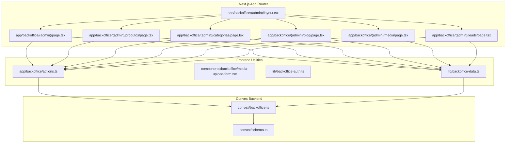
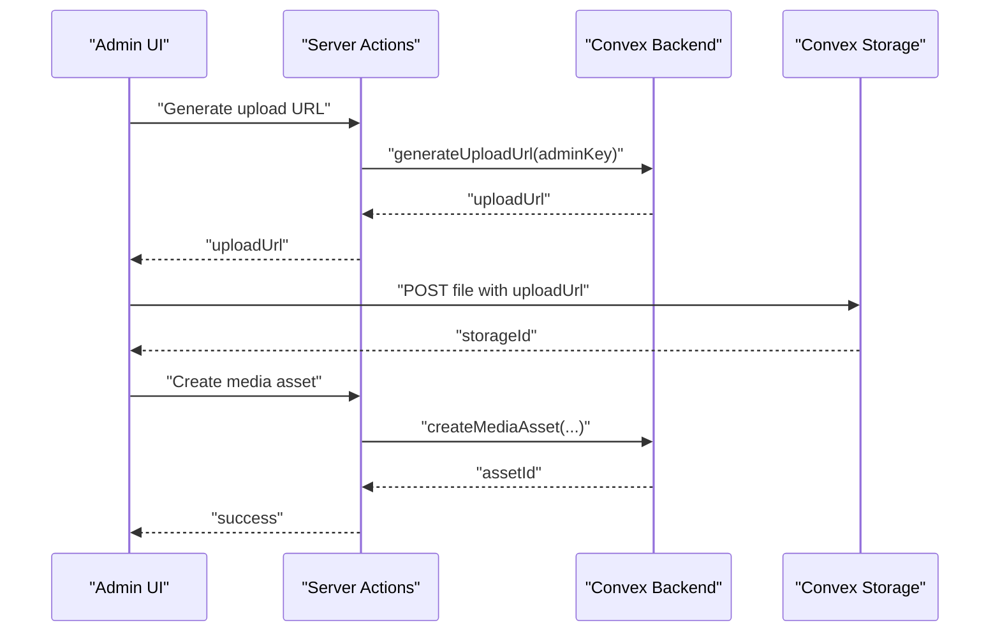
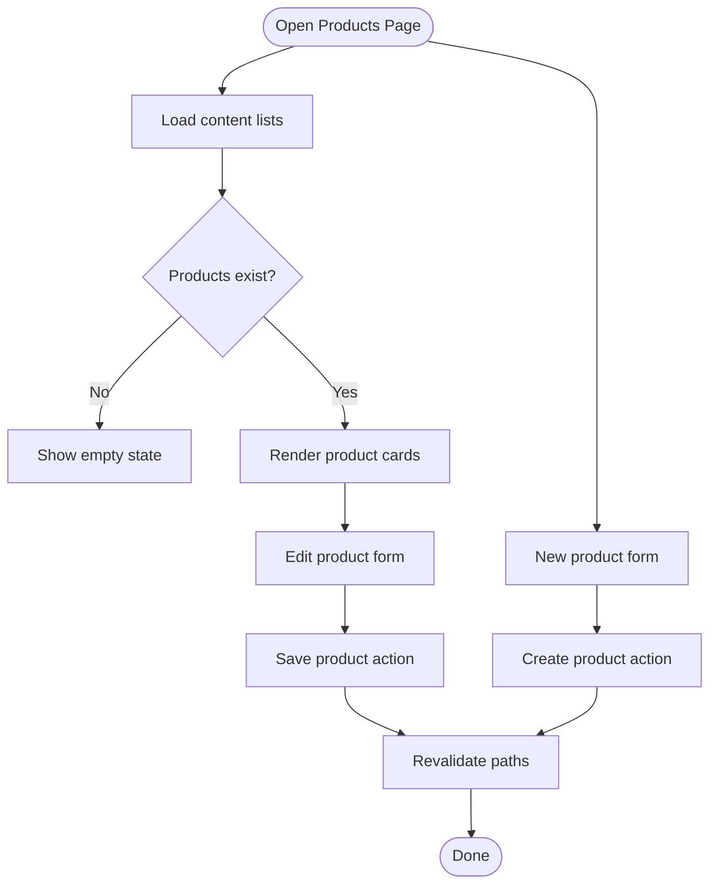
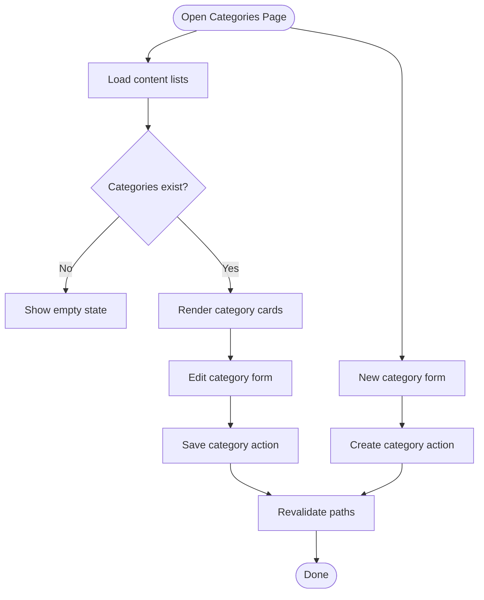
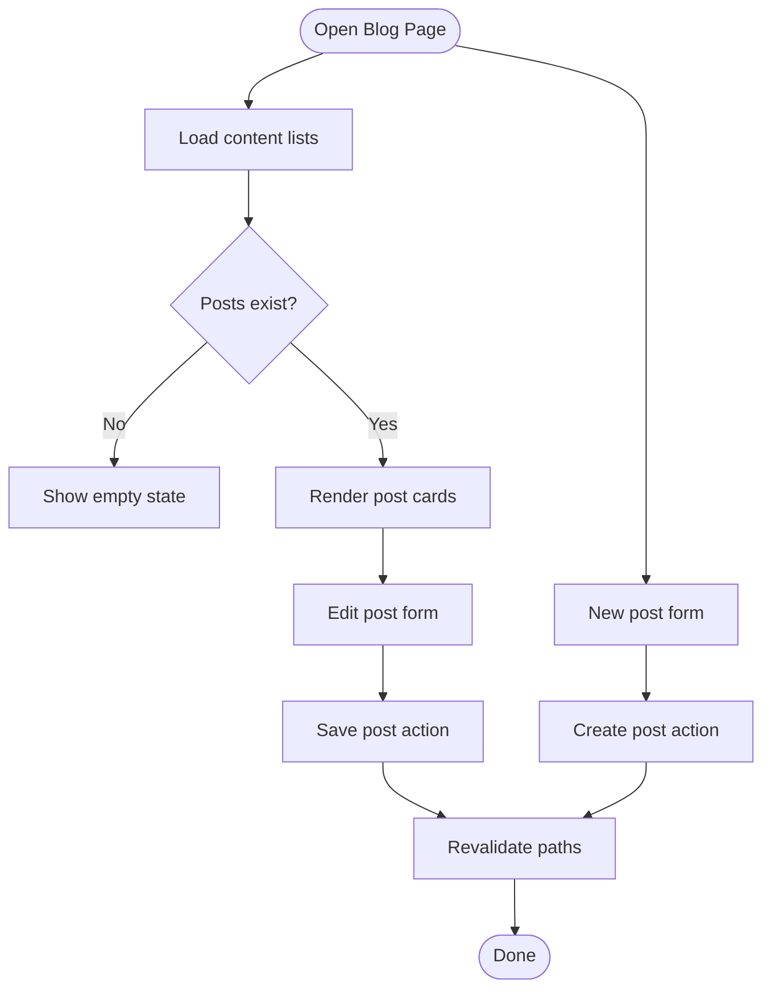
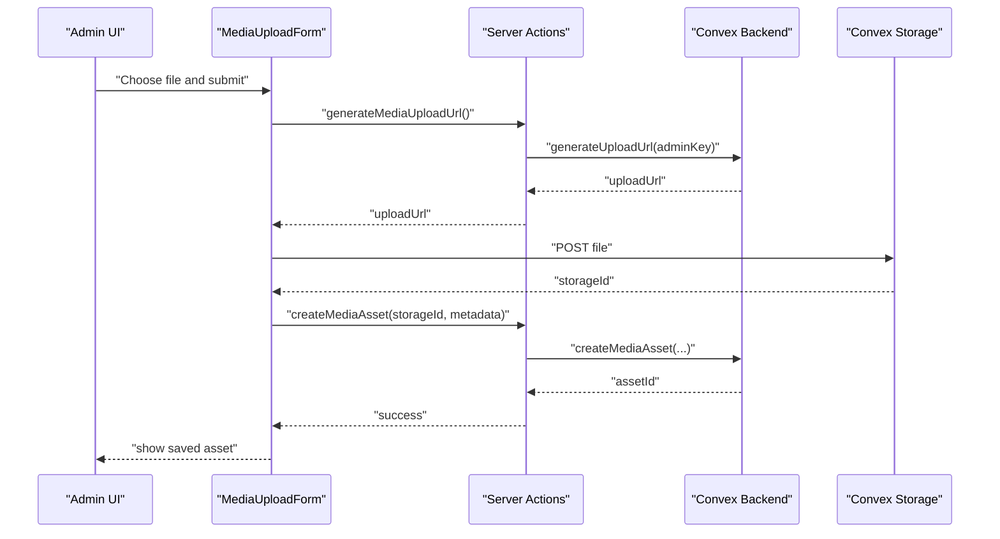
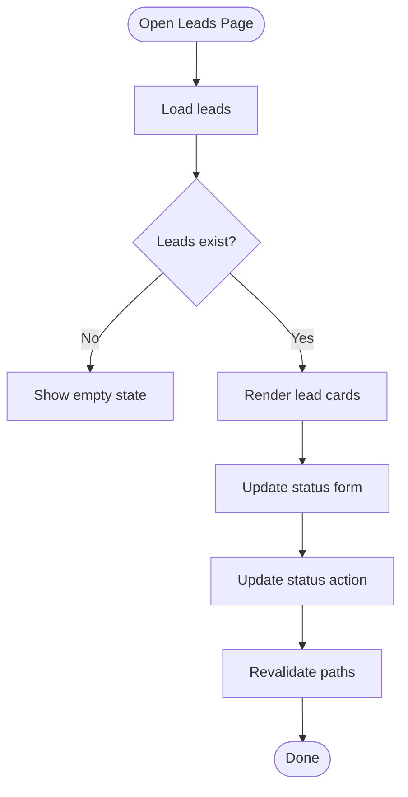
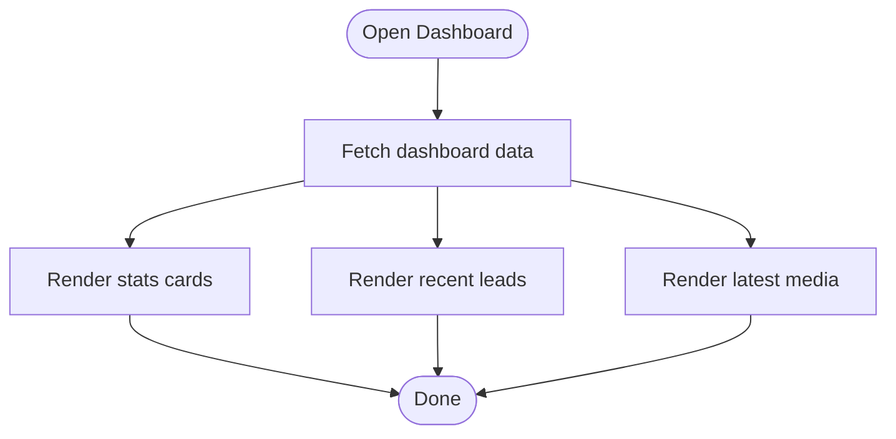
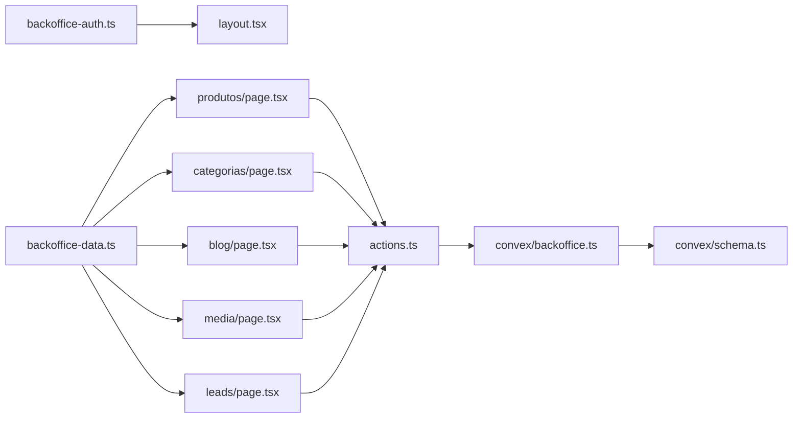

# Content Management Interfaces

<cite>
**Referenced Files in This Document**
- [layout.tsx](file://app/backoffice/(admin)/layout.tsx)
- [page.tsx](file://app/backoffice/(admin)/page.tsx)
- [produtos/page.tsx](file://app/backoffice/(admin)/produtos/page.tsx)
- [categorias/page.tsx](file://app/backoffice/(admin)/categorias/page.tsx)
- [blog/page.tsx](file://app/backoffice/(admin)/blog/page.tsx)
- [media/page.tsx](file://app/backoffice/(admin)/media/page.tsx)
- [leads/page.tsx](file://app/backoffice/(admin)/leads/page.tsx)
- [actions.ts](file://app/backoffice/actions.ts)
- [media-upload-form.tsx](file://components/backoffice/media-upload-form.tsx)
- [backoffice-auth.ts](file://lib/backoffice-auth.ts)
- [backoffice-data.ts](file://lib/backoffice-data.ts)
- [backoffice.ts](file://convex/backoffice.ts)
- [schema.ts](file://convex/schema.ts)
</cite>

## Table of Contents
1. [Introduction](#introduction)
2. [Project Structure](#project-structure)
3. [Core Components](#core-components)
4. [Architecture Overview](#architecture-overview)
5. [Detailed Component Analysis](#detailed-component-analysis)
6. [Dependency Analysis](#dependency-analysis)
7. [Performance Considerations](#performance-considerations)
8. [Troubleshooting Guide](#troubleshooting-guide)
9. [Conclusion](#conclusion)
10. [Appendices](#appendices)

## Introduction
This document describes the backoffice content management interfaces for products, categories, blog posts, media assets, and leads. It explains CRUD workflows, preview and draft management, bulk operations, search and filtering, versioning and change history, Convex backend integration, permissions, and troubleshooting guidance. The system is built with Next.js App Router, Convex backend, and a dedicated admin shell with session-based access control.

## Project Structure
The backoffice is organized under the Next.js app router with route groups for admin-only pages. Each content type has its own page under the admin route group. Shared UI components and Convex integration live in dedicated modules. Authentication and data fetching utilities bridge the frontend to Convex.

**Diagram sources**
- [layout.tsx](file://app/backoffice/(admin)/layout.tsx#L1-L22)
- [page.tsx](file://app/backoffice/(admin)/page.tsx#L1-L123)
- [produtos/page.tsx](file://app/backoffice/(admin)/produtos/page.tsx#L1-L133)
- [categorias/page.tsx](file://app/backoffice/(admin)/categorias/page.tsx#L1-L140)
- [blog/page.tsx](file://app/backoffice/(admin)/blog/page.tsx#L1-L149)
- [media/page.tsx](file://app/backoffice/(admin)/media/page.tsx#L1-L83)
- [leads/page.tsx](file://app/backoffice/(admin)/leads/page.tsx#L1-L73)
- [actions.ts:1-215](file://app/backoffice/actions.ts#L1-L215)
- [media-upload-form.tsx:1-114](file://components/backoffice/media-upload-form.tsx#L1-L114)
- [backoffice-auth.ts:1-129](file://lib/backoffice-auth.ts#L1-L129)
- [backoffice-data.ts:1-21](file://lib/backoffice-data.ts#L1-L21)
- [backoffice.ts:1-385](file://convex/backoffice.ts#L1-L385)
- [schema.ts:1-87](file://convex/schema.ts#L1-L87)

**Section sources**
- [layout.tsx](file://app/backoffice/(admin)/layout.tsx#L1-L22)
- [page.tsx](file://app/backoffice/(admin)/page.tsx#L1-L123)
- [actions.ts:1-215](file://app/backoffice/actions.ts#L1-L215)
- [backoffice-data.ts:1-21](file://lib/backoffice-data.ts#L1-L21)
- [backoffice.ts:1-385](file://convex/backoffice.ts#L1-L385)
- [schema.ts:1-87](file://convex/schema.ts#L1-L87)

## Core Components
- Admin shell and session enforcement: The admin layout enforces session requirements and wraps pages in a shared shell.
- Content pages: Dedicated pages for products, categories, blog posts, media, and leads with forms and lists.
- Actions: Server actions encapsulate mutations and revalidation, ensuring admin access and path invalidation.
- Media upload form: Client-side component handles upload URL generation, file validation, and asset registration.
- Authentication: Session creation, verification, and API key checks for admin endpoints.
- Data utilities: Fetchers for dashboard, content lists, leads, and media via Convex queries.
- Convex backend: Queries and mutations for CRUD, indexing, and public content projection.

**Section sources**
- [layout.tsx](file://app/backoffice/(admin)/layout.tsx#L17-L21)
- [produtos/page.tsx](file://app/backoffice/(admin)/produtos/page.tsx#L30-L80)
- [categorias/page.tsx](file://app/backoffice/(admin)/categorias/page.tsx#L32-L87)
- [blog/page.tsx](file://app/backoffice/(admin)/blog/page.tsx#L36-L96)
- [media/page.tsx](file://app/backoffice/(admin)/media/page.tsx#L17-L82)
- [actions.ts:79-215](file://app/backoffice/actions.ts#L79-L215)
- [media-upload-form.tsx:14-114](file://components/backoffice/media-upload-form.tsx#L14-L114)
- [backoffice-auth.ts:60-129](file://lib/backoffice-auth.ts#L60-L129)
- [backoffice-data.ts:6-21](file://lib/backoffice-data.ts#L6-L21)
- [backoffice.ts:120-184](file://convex/backoffice.ts#L120-L184)

## Architecture Overview
The backoffice integrates Next.js server actions with Convex for data persistence and storage. Admin sessions protect endpoints, while Convex queries and mutations provide typed access to documents and storage URLs. The media pipeline uses Convex Storage signed upload URLs for secure uploads.

**Diagram sources**
- [actions.ts:79-108](file://app/backoffice/actions.ts#L79-L108)
- [backoffice.ts:68-100](file://convex/backoffice.ts#L68-L100)

**Section sources**
- [actions.ts:79-108](file://app/backoffice/actions.ts#L79-L108)
- [backoffice.ts:68-100](file://convex/backoffice.ts#L68-L100)

## Detailed Component Analysis

### Product Management
- Purpose: Create, edit, and delete products; manage visibility and ordering; link images from media library.
- Forms and validation:
  - Name, slug, category, sortOrder, description, checkbox for visibility.
  - Slug auto-generation from name when empty.
  - Image selection from active media assets.
- Workflows:
  - New product: Submit form to create.
  - Edit product: Prefill form with existing values; submit to update.
  - Deletion: Use the update action to toggle visibility or remove associations; rely on list filtering for removal.
- Preview and drafts: Products are filtered by active flag; inactive entries are hidden from public content.
- Bulk operations: Not exposed in UI; use batch updates via repeated submissions or future batch APIs.
- Search and filtering: Public content filters by active flag; admin lists show all.
- Versioning and change history: Updated timestamps maintained per record.
- Integration: Uses Convex queries/mutations for products and media resolution.

**Diagram sources**
- [produtos/page.tsx](file://app/backoffice/(admin)/produtos/page.tsx#L82-L133)
- [actions.ts:130-151](file://app/backoffice/actions.ts#L130-L151)
- [backoffice.ts:186-221](file://convex/backoffice.ts#L186-L221)

**Section sources**
- [produtos/page.tsx](file://app/backoffice/(admin)/produtos/page.tsx#L1-L133)
- [actions.ts:130-151](file://app/backoffice/actions.ts#L130-L151)
- [backoffice.ts:186-221](file://convex/backoffice.ts#L186-L221)

### Category Management
- Purpose: Organize products with hierarchical-like taxonomy via categories; manage icons and ordering.
- Forms and validation:
  - Name, slug, icon, sortOrder, description, checkbox for visibility.
  - Slug auto-generation from name when empty.
  - Image selection from active media assets.
- Workflows:
  - New category: Submit form to create.
  - Edit category: Prefill form; submit to update.
  - Deletion: Archive or toggle visibility; admin lists show all.
- Preview and drafts: Active flag controls visibility in public content.
- Bulk operations: Not exposed; use repeated actions.
- Search and filtering: Public content filters by active flag; admin lists show all.
- Versioning and change history: Updated timestamps maintained per record.
- Integration: Uses Convex queries/mutations for categories and media resolution.

**Diagram sources**
- [categorias/page.tsx](file://app/backoffice/(admin)/categorias/page.tsx#L89-L140)
- [actions.ts:153-174](file://app/backoffice/actions.ts#L153-L174)
- [backoffice.ts:223-258](file://convex/backoffice.ts#L223-L258)

**Section sources**
- [categorias/page.tsx](file://app/backoffice/(admin)/categorias/page.tsx#L1-L140)
- [actions.ts:153-174](file://app/backoffice/actions.ts#L153-L174)
- [backoffice.ts:223-258](file://convex/backoffice.ts#L223-L258)

### Blog Post Management
- Purpose: Create, edit, publish/unpublish posts; manage SEO metadata and publication scheduling.
- Forms and validation:
  - Title, slug, category, read time, publication datetime-local, excerpt, body, checkbox for published.
  - Slug auto-generation from title when empty.
  - Image selection from active media assets.
- Workflows:
  - New post: Submit form to create.
  - Edit post: Prefill form; submit to update.
  - Publish/unpublish: Toggle published flag; schedule publication via publishedAt.
- Preview and drafts: Posts are filtered by published flag; drafts are hidden from public content.
- Bulk operations: Not exposed; use repeated actions.
- Search and filtering: Public content filters by published flag; admin lists show all.
- Versioning and change history: Updated timestamps maintained per record.
- Integration: Uses Convex queries/mutations for blog posts and media resolution.

**Diagram sources**
- [blog/page.tsx](file://app/backoffice/(admin)/blog/page.tsx#L98-L149)
- [actions.ts:176-199](file://app/backoffice/actions.ts#L176-L199)
- [backoffice.ts:260-299](file://convex/backoffice.ts#L260-L299)

**Section sources**
- [blog/page.tsx](file://app/backoffice/(admin)/blog/page.tsx#L1-L149)
- [actions.ts:176-199](file://app/backoffice/actions.ts#L176-L199)
- [backoffice.ts:260-299](file://convex/backoffice.ts#L260-L299)

### Media Asset Management
- Purpose: Upload images to Convex Storage, organize by kind, manage metadata, and archive assets.
- Upload flow:
  - Client validates file type and size, generates upload URL via server action, uploads to Convex Storage, then registers asset with metadata.
- Asset listing:
  - Grid of thumbnails with filename, kind, size, alt text, and status.
  - Archive action toggles status to archived.
- Workflows:
  - Upload: Select file, optional alt text, choose kind, submit.
  - Manage: View assets, archive when unused.
- Preview and drafts: Assets are filtered by status; archived assets are excluded from public content.
- Bulk operations: Not exposed; use repeated actions.
- Search and filtering: By status and uploaded timestamp; UI shows active assets by default.
- Versioning and change history: Assets maintain uploadedAt and updatedAt; status changes tracked.
- Integration: Uses Convex Storage upload URL generation and asset registration.

**Diagram sources**
- [media-upload-form.tsx:19-77](file://components/backoffice/media-upload-form.tsx#L19-L77)
- [actions.ts:79-108](file://app/backoffice/actions.ts#L79-L108)
- [backoffice.ts:68-100](file://convex/backoffice.ts#L68-L100)

**Section sources**
- [media/page.tsx](file://app/backoffice/(admin)/media/page.tsx#L1-L83)
- [media-upload-form.tsx:1-114](file://components/backoffice/media-upload-form.tsx#L1-L114)
- [actions.ts:79-108](file://app/backoffice/actions.ts#L79-L108)
- [backoffice.ts:110-118](file://convex/backoffice.ts#L110-L118)

### Leads Management
- Purpose: Track incoming requests, update status, and manage follow-up.
- Features:
  - List recent leads with status badges.
  - Inline status update dropdown.
- Workflows:
  - Update status: Submit form to change lead status.
- Preview and drafts: Not applicable; leads are operational records.
- Bulk operations: Not exposed; use repeated actions.
- Search and filtering: By status and created timestamp; admin lists show all.
- Versioning and change history: Status changes tracked; created timestamps preserved.
- Integration: Uses Convex queries/mutations for leads.

**Diagram sources**
- [leads/page.tsx](file://app/backoffice/(admin)/leads/page.tsx#L8-L73)
- [actions.ts:119-128](file://app/backoffice/actions.ts#L119-L128)
- [backoffice.ts:147-161](file://convex/backoffice.ts#L147-L161)

**Section sources**
- [leads/page.tsx](file://app/backoffice/(admin)/leads/page.tsx#L1-L73)
- [actions.ts:119-128](file://app/backoffice/actions.ts#L119-L128)
- [backoffice.ts:147-161](file://convex/backoffice.ts#L147-L161)

### Dashboard Overview
- Purpose: Provide quick stats and recent items across content types.
- Features:
  - Stats cards for leads, media, products, categories, blog posts.
  - Recent leads list with inline status actions.
  - Latest media thumbnails with links to media management.
- Integration: Uses Convex dashboard query aggregating multiple collections.

**Diagram sources**
- [page.tsx](file://app/backoffice/(admin)/page.tsx#L25-L122)
- [backoffice.ts:120-145](file://convex/backoffice.ts#L120-L145)

**Section sources**
- [page.tsx](file://app/backoffice/(admin)/page.tsx#L1-L123)
- [backoffice.ts:120-145](file://convex/backoffice.ts#L120-L145)

## Dependency Analysis
- Access control: Admin session enforced at layout level; all server actions assert admin key.
- Data access: Frontend fetchers call Convex queries; server actions call Convex mutations.
- Media pipeline: Upload URL generation and asset creation are tightly coupled in actions and Convex.
- Public content: Separate projection query aggregates active/published content for the site.

**Diagram sources**
- [backoffice-auth.ts:83-118](file://lib/backoffice-auth.ts#L83-L118)
- [layout.tsx](file://app/backoffice/(admin)/layout.tsx#L17-L21)
- [backoffice-data.ts:6-21](file://lib/backoffice-data.ts#L6-L21)
- [produtos/page.tsx](file://app/backoffice/(admin)/produtos/page.tsx#L7-L8)
- [categorias/page.tsx](file://app/backoffice/(admin)/categorias/page.tsx#L7-L8)
- [blog/page.tsx](file://app/backoffice/(admin)/blog/page.tsx#L7-L8)
- [media/page.tsx](file://app/backoffice/(admin)/media/page.tsx#L7-L8)
- [leads/page.tsx](file://app/backoffice/(admin)/leads/page.tsx#L4-L5)
- [actions.ts:3-14](file://app/backoffice/actions.ts#L3-L14)
- [backoffice.ts:1-6](file://convex/backoffice.ts#L1-L6)
- [schema.ts:1-87](file://convex/schema.ts#L1-L87)

**Section sources**
- [backoffice-auth.ts:83-118](file://lib/backoffice-auth.ts#L83-L118)
- [layout.tsx](file://app/backoffice/(admin)/layout.tsx#L17-L21)
- [backoffice-data.ts:6-21](file://lib/backoffice-data.ts#L6-L21)
- [actions.ts:3-14](file://app/backoffice/actions.ts#L3-L14)
- [backoffice.ts:1-6](file://convex/backoffice.ts#L1-L6)
- [schema.ts:1-87](file://convex/schema.ts#L1-L87)

## Performance Considerations
- Pagination and limits: Queries limit returned items to a constant maximum to prevent large payloads.
- Index usage: Collections leverage indexes for sorting and filtering (e.g., by status, timestamps).
- Revalidation: After mutations, targeted paths are invalidated to keep views fresh without full reloads.
- Media resolution: Attachments resolve storage URLs lazily; archived assets are excluded from public content.

[No sources needed since this section provides general guidance]

## Troubleshooting Guide
- Authentication failures:
  - Verify admin session cookie and expiration; ensure session secret and API key are configured.
  - Check session enforcement in the admin layout.
- Upload errors:
  - Confirm allowed types and size limits; ensure upload URL generation succeeds and storage responds with a storage ID.
  - Validate asset creation after upload completes.
- Data not updating:
  - Confirm revalidation paths after mutations; check that the correct routes are invalidated.
- Visibility issues:
  - For products, categories, and blog posts, ensure active/published flags are set appropriately.
  - For media, ensure assets are active and not archived.
- Lead status not changing:
  - Verify the status update action is called with the correct admin key and IDs.

**Section sources**
- [backoffice-auth.ts:60-118](file://lib/backoffice-auth.ts#L60-L118)
- [media-upload-form.tsx:19-77](file://components/backoffice/media-upload-form.tsx#L19-L77)
- [actions.ts:79-108](file://app/backoffice/actions.ts#L79-L108)
- [backoffice.ts:120-145](file://convex/backoffice.ts#L120-L145)

## Conclusion
The backoffice provides a cohesive set of content management interfaces integrated with Convex for data and storage. Admin session enforcement, typed queries and mutations, and careful revalidation enable reliable CRUD workflows across products, categories, blog posts, media, and leads. While advanced bulk operations and hierarchical taxonomy are not currently exposed, the underlying architecture supports extension for future enhancements.

[No sources needed since this section summarizes without analyzing specific files]

## Appendices

### Administrative Permissions and Access Controls
- Role: Admin-only access enforced by session and API key checks.
- Session lifecycle: Creation, verification, and clearing of admin sessions.
- Endpoint protection: All server actions assert admin key prior to executing mutations.

**Section sources**
- [backoffice-auth.ts:60-129](file://lib/backoffice-auth.ts#L60-L129)
- [actions.ts:25-31](file://app/backoffice/actions.ts#L25-L31)
- [backoffice.ts:25-31](file://convex/backoffice.ts#L25-L31)

### Data Model Overview
- Collections: leads, mediaAssets, products, categories, blogPosts, siteSettings.
- Indexes: optimized for common queries (status, timestamps, slugs).
- Media URLs: resolved via Convex storage; archived assets excluded from public content.

**Section sources**
- [schema.ts:4-87](file://convex/schema.ts#L4-L87)
- [backoffice.ts:33-52](file://convex/backoffice.ts#L33-L52)
- [backoffice.ts:319-384](file://convex/backoffice.ts#L319-L384)