# Dashboard & Analytics

<cite>
**Referenced Files in This Document**
- [schema.ts](file://convex/schema.ts)
- [backoffice.ts](file://convex/backoffice.ts)
- [leads.ts](file://convex/leads.ts)
- [layout.tsx](file://app/backoffice/(admin)/layout.tsx)
- [page.tsx](file://app/backoffice/(admin)/page.tsx)
- [leads/page.tsx](file://app/backoffice/(admin)/leads/page.tsx)
- [produtos/page.tsx](file://app/backoffice/(admin)/produtos/page.tsx)
- [blog/page.tsx](file://app/backoffice/(admin)/blog/page.tsx)
- [backoffice-shell.tsx](file://components/backoffice/backoffice-shell.tsx)
- [admin-ui.tsx](file://components/backoffice/admin-ui.tsx)
- [backoffice-data.ts](file://lib/backoffice-data.ts)
- [actions.ts](file://app/backoffice/actions.ts)
- [backoffice-auth.ts](file://lib/backoffice-auth.ts)
</cite>

## Table of Contents
1. [Introduction](#introduction)
2. [Project Structure](#project-structure)
3. [Core Components](#core-components)
4. [Architecture Overview](#architecture-overview)
5. [Detailed Component Analysis](#detailed-component-analysis)
6. [Dependency Analysis](#dependency-analysis)
7. [Performance Considerations](#performance-considerations)
8. [Troubleshooting Guide](#troubleshooting-guide)
9. [Conclusion](#conroduction)
10. [Appendices](#appendices)

## Introduction
This document describes the backoffice dashboard and analytics system for managing leads, content, and media. It covers the administrative dashboard layout, widget organization, and data visualization components. It also explains lead statistics, content inventory management, real-time updates via Next.js revalidation, analytics-related data aggregation from Convex, responsive design, navigation patterns, and guidance for extending the dashboard with new widgets and analytics features.

## Project Structure
The backoffice is organized around:
- Convex schema and queries/mutations for data access
- Next.js app router pages under the backoffice route
- Shared UI components for admin shell and cards
- Authentication and data access utilities

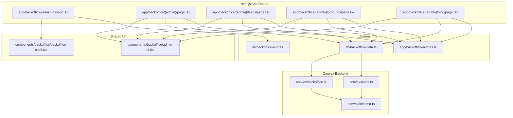

**Diagram sources**
- [layout.tsx](file://app/backoffice/(admin)/layout.tsx#L17-L21)
- [page.tsx](file://app/backoffice/(admin)/page.tsx#L25-L122)
- [leads/page.tsx](file://app/backoffice/(admin)/leads/page.tsx#L8-L72)
- [produtos/page.tsx](file://app/backoffice/(admin)/produtos/page.tsx#L82-L132)
- [blog/page.tsx](file://app/backoffice/(admin)/blog/page.tsx#L98-L148)
- [backoffice-shell.tsx:17-77](file://components/backoffice/backoffice-shell.tsx#L17-L77)
- [admin-ui.tsx:3-24](file://components/backoffice/admin-ui.tsx#L3-L24)
- [backoffice-data.ts:6-20](file://lib/backoffice-data.ts#L6-L20)
- [backoffice.ts:120-145](file://convex/backoffice.ts#L120-L145)
- [leads.ts:26-31](file://convex/leads.ts#L26-L31)
- [schema.ts:4-86](file://convex/schema.ts#L4-L86)
- [actions.ts:119-128](file://app/backoffice/actions.ts#L119-L128)
- [backoffice-auth.ts:110-118](file://lib/backoffice-auth.ts#L110-L118)

**Section sources**
- [layout.tsx](file://app/backoffice/(admin)/layout.tsx#L17-L21)
- [page.tsx](file://app/backoffice/(admin)/page.tsx#L25-L122)
- [backoffice-shell.tsx:17-77](file://components/backoffice/backoffice-shell.tsx#L17-L77)
- [backoffice-data.ts:6-20](file://lib/backoffice-data.ts#L6-L20)
- [backoffice.ts:120-145](file://convex/backoffice.ts#L120-L145)
- [schema.ts:4-86](file://convex/schema.ts#L4-L86)

## Core Components
- Dashboard page renders summary statistics and recent items.
- Lead list page manages lead statuses and displays full lists.
- Content management pages for products and blog posts.
- Admin shell provides navigation and responsive header.
- Convex queries/mutations aggregate and expose data.
- Utilities handle authentication and data fetching.

Key responsibilities:
- Dashboard: grid of stats, recent leads, recent media preview.
- Leads: status updates and listing.
- Content: CRUD for products and blog posts backed by Convex media assets.
- Shell: fixed sidebar on desktop, mobile-friendly header, logout.
- Data access: typed Convex queries via Next.js helpers.
- Auth: session-based admin access with API key enforcement.

**Section sources**
- [page.tsx](file://app/backoffice/(admin)/page.tsx#L25-L122)
- [leads/page.tsx](file://app/backoffice/(admin)/leads/page.tsx#L8-L72)
- [produtos/page.tsx](file://app/backoffice/(admin)/produtos/page.tsx#L82-L132)
- [blog/page.tsx](file://app/backoffice/(admin)/blog/page.tsx#L98-L148)
- [backoffice-shell.tsx:8-47](file://components/backoffice/backoffice-shell.tsx#L8-L47)
- [backoffice-data.ts:6-20](file://lib/backoffice-data.ts#L6-L20)
- [backoffice.ts:120-145](file://convex/backoffice.ts#L120-L145)

## Architecture Overview
The dashboard architecture follows a clean separation:
- UI pages orchestrate data fetching and rendering.
- Convex exposes typed queries and mutations.
- Utilities enforce admin sessions and API keys.
- Actions trigger mutations and invalidate caches.

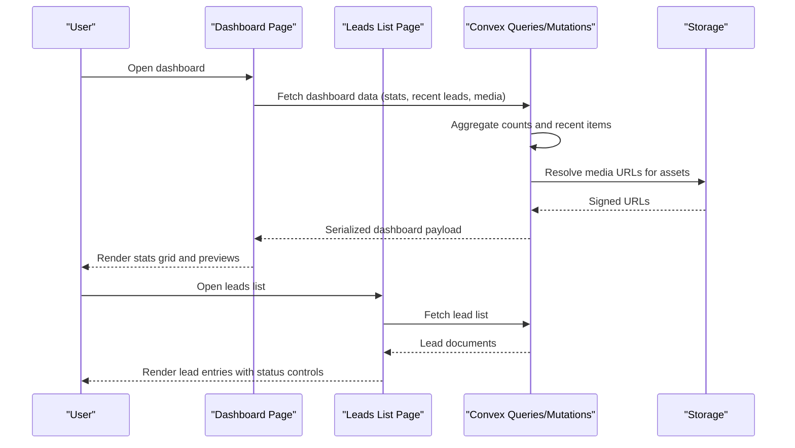

**Diagram sources**
- [page.tsx](file://app/backoffice/(admin)/page.tsx#L25-L122)
- [leads/page.tsx](file://app/backoffice/(admin)/leads/page.tsx#L8-L72)
- [backoffice.ts:120-145](file://convex/backoffice.ts#L120-L145)
- [backoffice.ts:110-118](file://convex/backoffice.ts#L110-L118)
- [backoffice.ts:33-52](file://convex/backoffice.ts#L33-L52)

## Detailed Component Analysis

### Dashboard Page
- Renders a stats grid with counts for leads, media assets, products, categories, and blog posts.
- Shows recent leads with quick status update actions.
- Displays recent media thumbnails with links to media management.

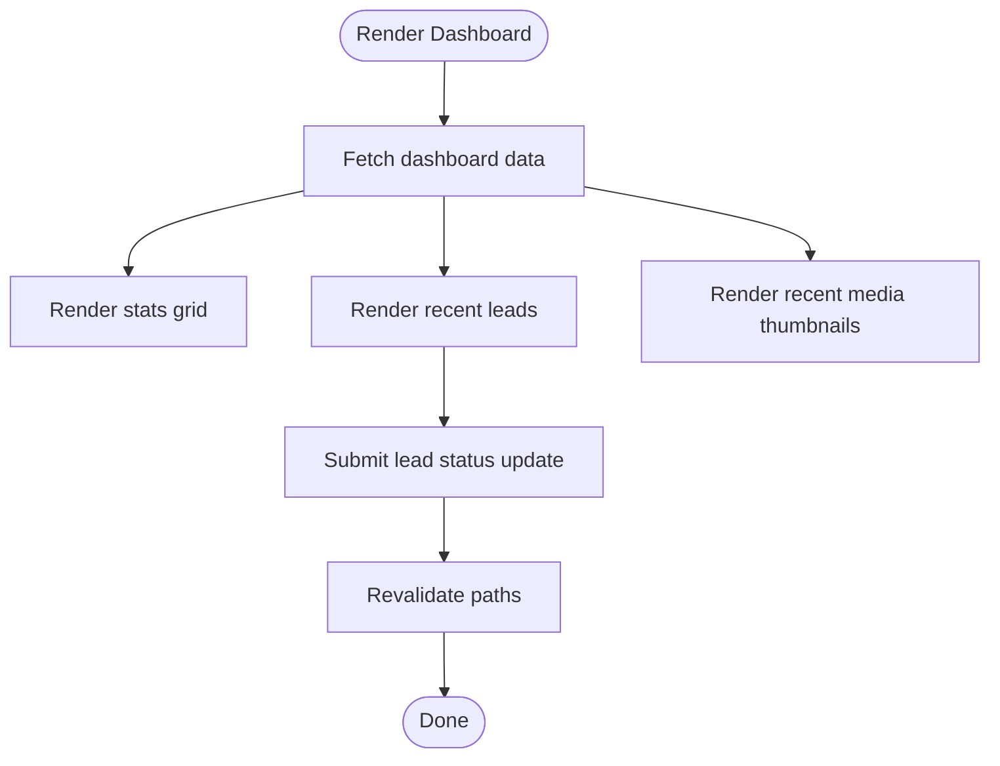

**Diagram sources**
- [page.tsx](file://app/backoffice/(admin)/page.tsx#L25-L122)
- [backoffice-data.ts:6-8](file://lib/backoffice-data.ts#L6-L8)
- [backoffice.ts:120-145](file://convex/backoffice.ts#L120-L145)
- [actions.ts:119-128](file://app/backoffice/actions.ts#L119-L128)

**Section sources**
- [page.tsx](file://app/backoffice/(admin)/page.tsx#L25-L122)
- [admin-ui.tsx:3-24](file://components/backoffice/admin-ui.tsx#L3-L24)

### Leads Management
- Lists all leads with creation timestamps, source, and message preview.
- Provides a form to update lead status with immediate cache revalidation.

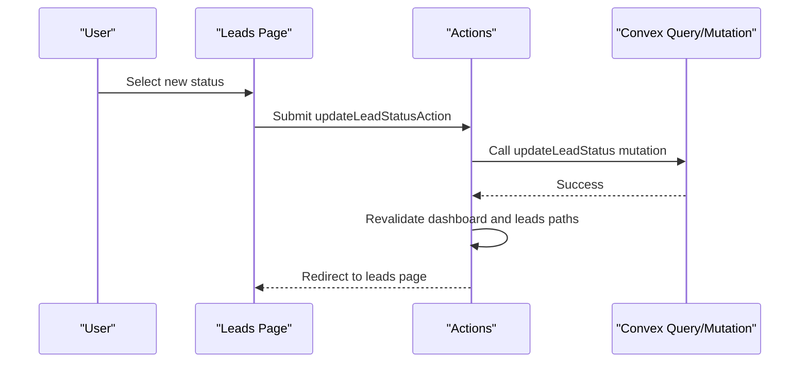

**Diagram sources**
- [leads/page.tsx](file://app/backoffice/(admin)/leads/page.tsx#L8-L72)
- [actions.ts:119-128](file://app/backoffice/actions.ts#L119-L128)
- [backoffice.ts:155-161](file://convex/backoffice.ts#L155-L161)

**Section sources**
- [leads/page.tsx](file://app/backoffice/(admin)/leads/page.tsx#L8-L72)
- [actions.ts:119-128](file://app/backoffice/actions.ts#L119-L128)
- [backoffice.ts:155-161](file://convex/backoffice.ts#L155-L161)

### Content Inventory Management
- Products page supports creating/updating products with optional Convex media selection.
- Blog page supports creating/updating posts with publication scheduling and media selection.

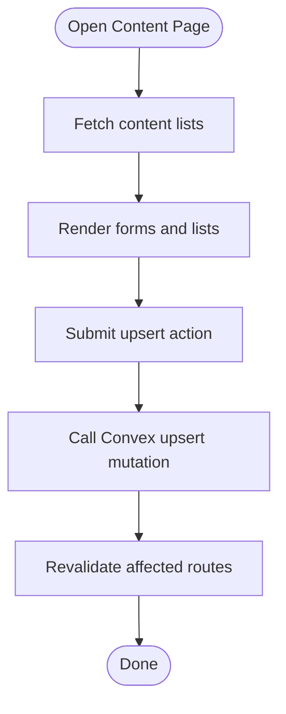

**Diagram sources**
- [produtos/page.tsx](file://app/backoffice/(admin)/produtos/page.tsx#L82-L132)
- [blog/page.tsx](file://app/backoffice/(admin)/blog/page.tsx#L98-L148)
- [backoffice-data.ts:10-12](file://lib/backoffice-data.ts#L10-L12)
- [backoffice.ts:186-221](file://convex/backoffice.ts#L186-L221)
- [backoffice.ts:260-299](file://convex/backoffice.ts#L260-L299)
- [actions.ts:130-151](file://app/backoffice/actions.ts#L130-L151)
- [actions.ts:176-199](file://app/backoffice/actions.ts#L176-L199)

**Section sources**
- [produtos/page.tsx](file://app/backoffice/(admin)/produtos/page.tsx#L82-L132)
- [blog/page.tsx](file://app/backoffice/(admin)/blog/page.tsx#L98-L148)
- [backoffice.ts:163-184](file://convex/backoffice.ts#L163-L184)

### Media Asset Management
- Generates upload URLs and creates media assets with metadata.
- Serializes media with signed URLs for client rendering.

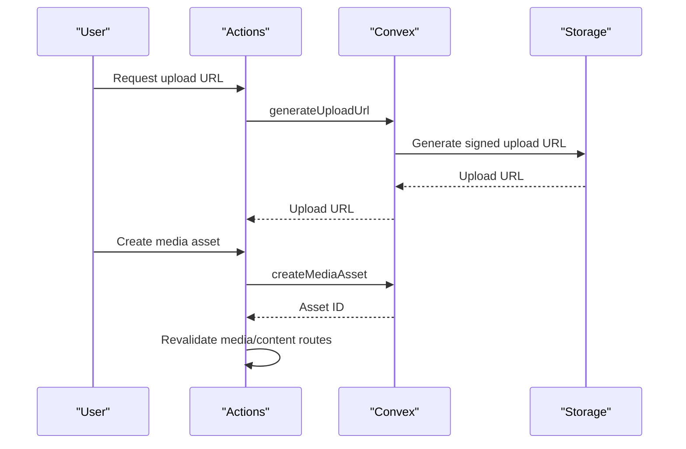

**Diagram sources**
- [actions.ts:79-108](file://app/backoffice/actions.ts#L79-L108)
- [backoffice.ts:68-100](file://convex/backoffice.ts#L68-L100)
- [backoffice.ts:33-52](file://convex/backoffice.ts#L33-L52)

**Section sources**
- [actions.ts:79-108](file://app/backoffice/actions.ts#L79-L108)
- [backoffice.ts:68-100](file://convex/backoffice.ts#L68-L100)
- [backoffice.ts:33-52](file://convex/backoffice.ts#L33-L52)

### Administrative Navigation and Quick Access
- Fixed sidebar on desktop with icons and labels.
- Mobile header collapses navigation into a horizontal scrollable bar.
- Logout action clears session and redirects to login.

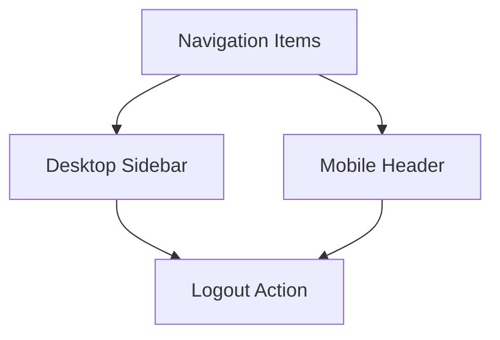

**Diagram sources**
- [backoffice-shell.tsx:8-47](file://components/backoffice/backoffice-shell.tsx#L8-L47)
- [backoffice-shell.tsx:50-71](file://components/backoffice/backoffice-shell.tsx#L50-L71)
- [actions.ts:74-77](file://app/backoffice/actions.ts#L74-L77)
- [backoffice-auth.ts:110-118](file://lib/backoffice-auth.ts#L110-L118)

**Section sources**
- [backoffice-shell.tsx:17-77](file://components/backoffice/backoffice-shell.tsx#L17-L77)
- [actions.ts:74-77](file://app/backoffice/actions.ts#L74-L77)
- [backoffice-auth.ts:110-118](file://lib/backoffice-auth.ts#L110-L118)

### Data Aggregation and Dashboard Payload
- The dashboard query aggregates counts and recent items across leads, media, products, categories, and blog posts.
- Media URLs are resolved via storage integration.

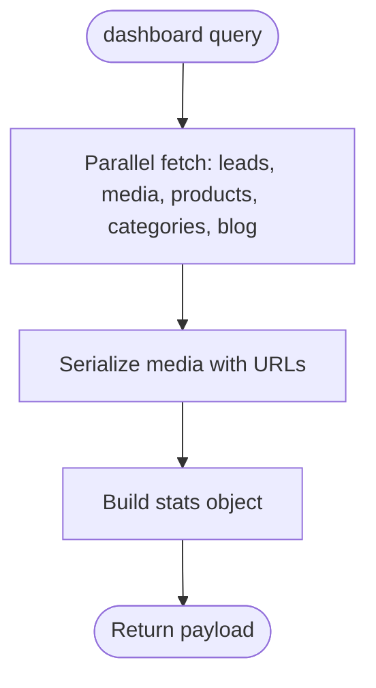

**Diagram sources**
- [backoffice.ts:120-145](file://convex/backoffice.ts#L120-L145)
- [backoffice.ts:110-118](file://convex/backoffice.ts#L110-L118)
- [backoffice.ts:33-52](file://convex/backoffice.ts#L33-L52)

**Section sources**
- [backoffice.ts:120-145](file://convex/backoffice.ts#L120-L145)
- [backoffice.ts:110-118](file://convex/backoffice.ts#L110-L118)

### Lead Statistics Display
- The dashboard shows counts for leads, media assets, products, categories, and blog posts.
- Recent leads are shown with status badges and quick actions.
- Status updates are handled via mutations with cache revalidation.

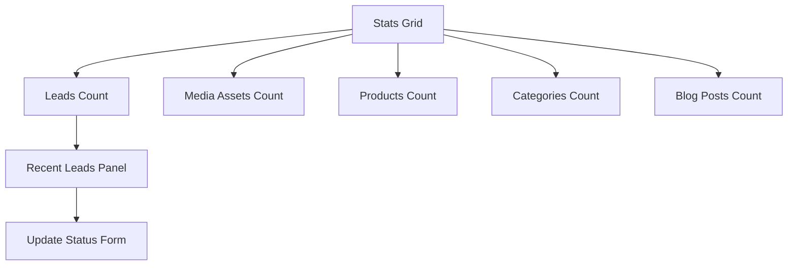

**Diagram sources**
- [page.tsx](file://app/backoffice/(admin)/page.tsx#L34-L47)
- [page.tsx](file://app/backoffice/(admin)/page.tsx#L57-L86)
- [backoffice.ts:120-145](file://convex/backoffice.ts#L120-L145)
- [actions.ts:119-128](file://app/backoffice/actions.ts#L119-L128)

**Section sources**
- [page.tsx](file://app/backoffice/(admin)/page.tsx#L34-L86)
- [backoffice.ts:120-145](file://convex/backoffice.ts#L120-L145)
- [actions.ts:119-128](file://app/backoffice/actions.ts#L119-L128)

### Content Inventory Management Details
- Products: name, slug, category, description, visibility, sort order, optional media.
- Blog posts: title, slug, excerpt, optional body, category, read time, publication date, visibility, optional media.
- Both support Upsert mutations and revalidate routes after changes.

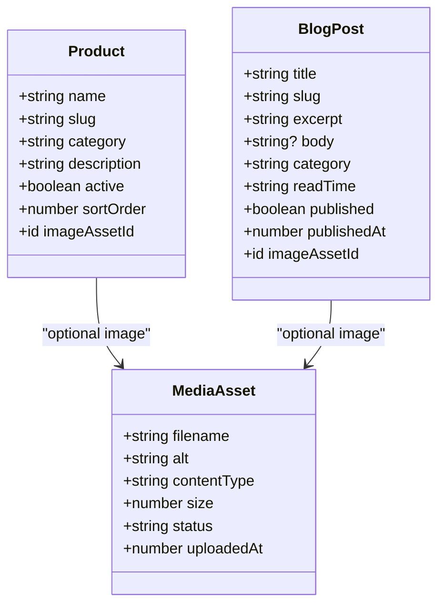

**Diagram sources**
- [schema.ts:37-48](file://convex/schema.ts#L37-L48)
- [schema.ts:65-78](file://convex/schema.ts#L65-L78)
- [schema.ts:18-36](file://convex/schema.ts#L18-L36)
- [backoffice.ts:186-221](file://convex/backoffice.ts#L186-L221)
- [backoffice.ts:260-299](file://convex/backoffice.ts#L260-L299)

**Section sources**
- [produtos/page.tsx](file://app/backoffice/(admin)/produtos/page.tsx#L82-L132)
- [blog/page.tsx](file://app/backoffice/(admin)/blog/page.tsx#L98-L148)
- [schema.ts:37-78](file://convex/schema.ts#L37-L78)

### Real-Time Updates and Refresh Mechanisms
- Mutations trigger Next.js cache revalidation for affected paths.
- Dashboard and leads pages reload fresh data after status or content changes.

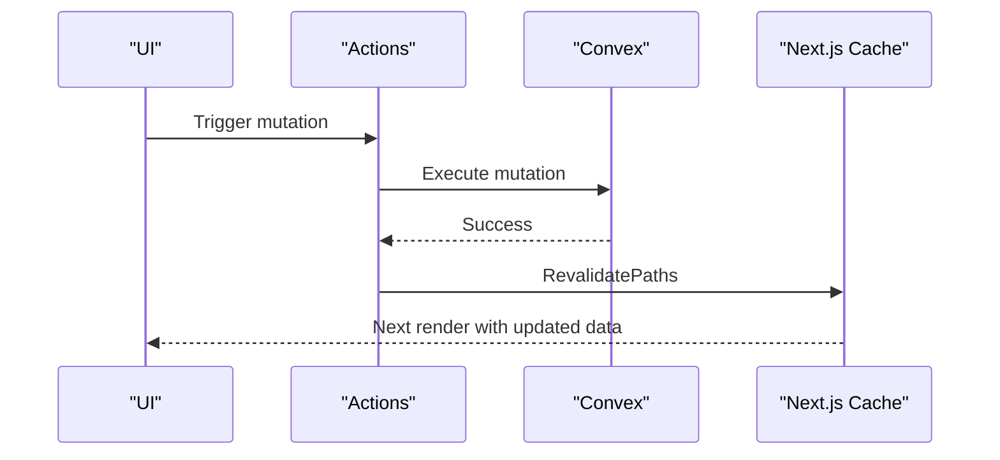

**Diagram sources**
- [actions.ts:119-128](file://app/backoffice/actions.ts#L119-L128)
- [actions.ts:130-151](file://app/backoffice/actions.ts#L130-L151)
- [actions.ts:176-199](file://app/backoffice/actions.ts#L176-L199)
- [actions.ts:201-214](file://app/backoffice/actions.ts#L201-L214)

**Section sources**
- [actions.ts:119-128](file://app/backoffice/actions.ts#L119-L128)
- [actions.ts:130-151](file://app/backoffice/actions.ts#L130-L151)
- [actions.ts:176-199](file://app/backoffice/actions.ts#L176-L199)
- [actions.ts:201-214](file://app/backoffice/actions.ts#L201-L214)

### Analytics Widgets and Data Visualization
- Current dashboard shows summary counts and recent items.
- No dedicated analytics widgets (traffic, engagement, performance) are present in the current codebase.
- To add analytics widgets, integrate Convex queries that compute time-series or aggregated metrics and render them with visualization libraries.

[No sources needed since this section provides conceptual guidance]

### Responsive Design Considerations
- Desktop: fixed sidebar with navigation items and logout.
- Mobile: collapsible header with horizontal navigation and logout button.
- Dashboard grid adapts from two columns on medium screens to five columns on extra-large screens.

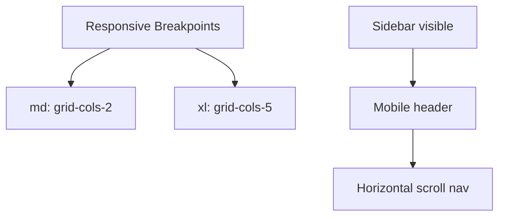

**Diagram sources**
- [page.tsx](file://app/backoffice/(admin)/page.tsx#L34-L47)
- [backoffice-shell.tsx:17-77](file://components/backoffice/backoffice-shell.tsx#L17-L77)

**Section sources**
- [page.tsx](file://app/backoffice/(admin)/page.tsx#L34-L47)
- [backoffice-shell.tsx:17-77](file://components/backoffice/backoffice-shell.tsx#L17-L77)

### Administrative Navigation Patterns and Quick Access
- Persistent navigation items for dashboard, media, products, categories, blog, and settings.
- Quick access to manage content and media directly from the dashboard.

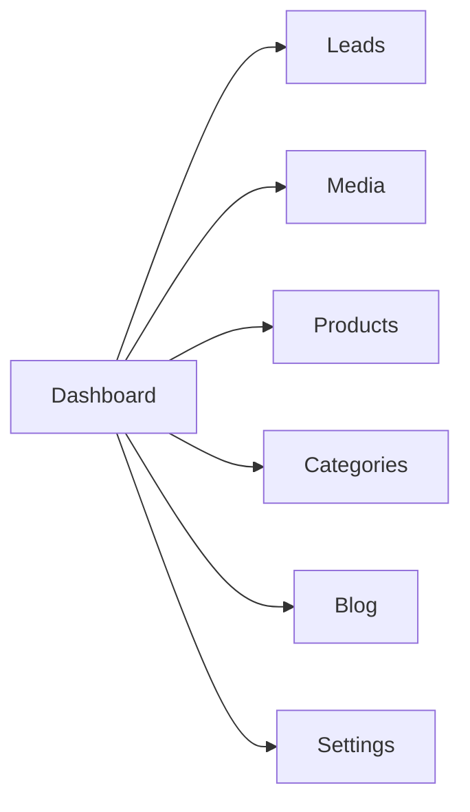

**Diagram sources**
- [backoffice-shell.tsx:8-15](file://components/backoffice/backoffice-shell.tsx#L8-L15)

**Section sources**
- [backoffice-shell.tsx:8-15](file://components/backoffice/backoffice-shell.tsx#L8-L15)

### Integration Between Dashboard Components and Administrative Workflows
- Dashboard triggers navigation to detailed views.
- Lead status updates integrate with lead management workflows.
- Content creation/update integrates with product and blog management.

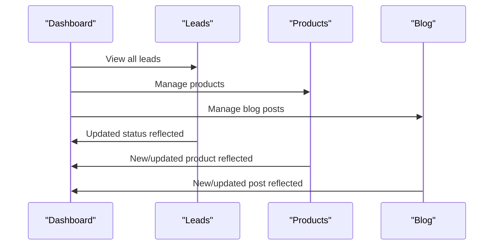

**Diagram sources**
- [page.tsx](file://app/backoffice/(admin)/page.tsx#L53-L55)
- [page.tsx](file://app/backoffice/(admin)/page.tsx#L91-L93)
- [leads/page.tsx](file://app/backoffice/(admin)/leads/page.tsx#L8-L72)
- [produtos/page.tsx](file://app/backoffice/(admin)/produtos/page.tsx#L82-L132)
- [blog/page.tsx](file://app/backoffice/(admin)/blog/page.tsx#L98-L148)

**Section sources**
- [page.tsx](file://app/backoffice/(admin)/page.tsx#L53-L55)
- [page.tsx](file://app/backoffice/(admin)/page.tsx#L91-L93)
- [leads/page.tsx](file://app/backoffice/(admin)/leads/page.tsx#L8-L72)
- [produtos/page.tsx](file://app/backoffice/(admin)/produtos/page.tsx#L82-L132)
- [blog/page.tsx](file://app/backoffice/(admin)/blog/page.tsx#L98-L148)

### Customizing Dashboard Widgets and Adding Analytics Features
- Extend Convex schema with analytics tables if needed.
- Add new queries/mutations to compute metrics and render them in new dashboard panels.
- Use the existing AdminCard and AdminHeader components for consistent UI.
- Ensure mutations call revalidatePath for updated routes.

[No sources needed since this section provides conceptual guidance]

## Dependency Analysis
- Pages depend on data access utilities and Convex queries.
- Actions encapsulate mutations and cache invalidation.
- Authentication enforces admin access and API key checks.
- Convex schema defines data models and indexes used by queries.

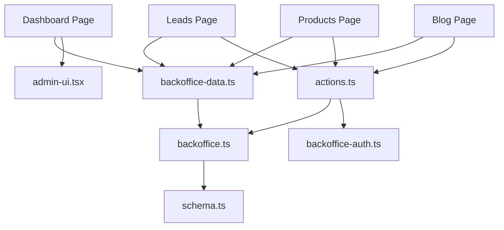

**Diagram sources**
- [page.tsx](file://app/backoffice/(admin)/page.tsx#L25-L122)
- [leads/page.tsx](file://app/backoffice/(admin)/leads/page.tsx#L8-L72)
- [produtos/page.tsx](file://app/backoffice/(admin)/produtos/page.tsx#L82-L132)
- [blog/page.tsx](file://app/backoffice/(admin)/blog/page.tsx#L98-L148)
- [backoffice-data.ts:6-20](file://lib/backoffice-data.ts#L6-L20)
- [backoffice.ts:120-145](file://convex/backoffice.ts#L120-L145)
- [schema.ts:4-86](file://convex/schema.ts#L4-L86)
- [actions.ts:119-128](file://app/backoffice/actions.ts#L119-L128)
- [backoffice-auth.ts:110-118](file://lib/backoffice-auth.ts#L110-L118)

**Section sources**
- [backoffice-data.ts:6-20](file://lib/backoffice-data.ts#L6-L20)
- [backoffice.ts:120-145](file://convex/backoffice.ts#L120-L145)
- [schema.ts:4-86](file://convex/schema.ts#L4-L86)
- [actions.ts:119-128](file://app/backoffice/actions.ts#L119-L128)
- [backoffice-auth.ts:110-118](file://lib/backoffice-auth.ts#L110-L118)

## Performance Considerations
- Use indexes defined in the schema for efficient queries (e.g., status and timestamp indexes).
- Limit returned item counts with take() to avoid large payloads.
- Serialize media assets with signed URLs to minimize client-side work.
- Revalidate only affected paths after mutations to reduce unnecessary re-fetching.

[No sources needed since this section provides general guidance]

## Troubleshooting Guide
- Unauthorized requests: ensure BACKOFFICE_API_KEY is set and correct.
- Session errors: verify BACKOFFICE_SESSION_SECRET and session cookie presence/expiry.
- Missing media URLs: confirm asset status is active and storageId is valid.
- Cache not updating: check revalidatePath calls after mutations.

**Section sources**
- [backoffice.ts:25-31](file://convex/backoffice.ts#L25-L31)
- [backoffice-auth.ts:120-128](file://lib/backoffice-auth.ts#L120-L128)
- [backoffice-auth.ts:83-118](file://lib/backoffice-auth.ts#L83-L118)
- [backoffice.ts:33-52](file://convex/backoffice.ts#L33-L52)
- [actions.ts:119-128](file://app/backoffice/actions.ts#L119-L128)

## Conclusion
The backoffice dashboard provides a concise overview of key content and lead activity, with integrated navigation and quick actions. Data is fetched via typed Convex queries and mutations, with cache revalidation ensuring timely updates. The system’s responsive shell and consistent UI components enable efficient administration across devices. Extending analytics and visualization requires adding new Convex queries and dashboard panels while preserving the established patterns for authentication, data access, and caching.

## Appendices
- Authentication constants and session lifecycle are managed centrally.
- Convex schema defines core entities and indexes used by dashboard queries.

**Section sources**
- [backoffice-auth.ts:60-118](file://lib/backoffice-auth.ts#L60-L118)
- [schema.ts:4-86](file://convex/schema.ts#L4-L86)