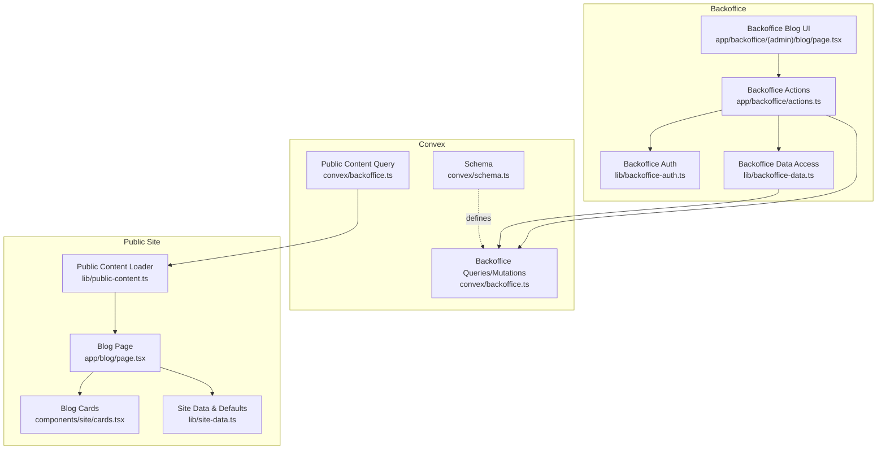
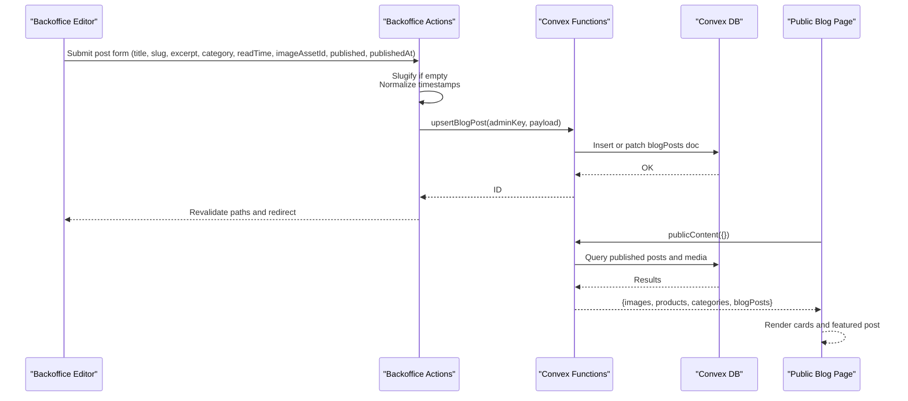
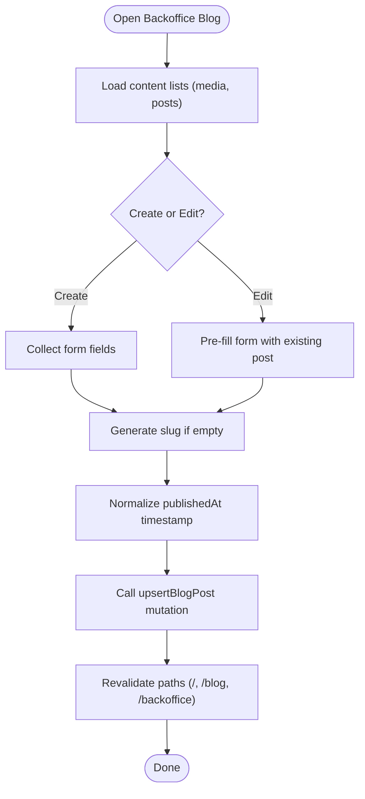
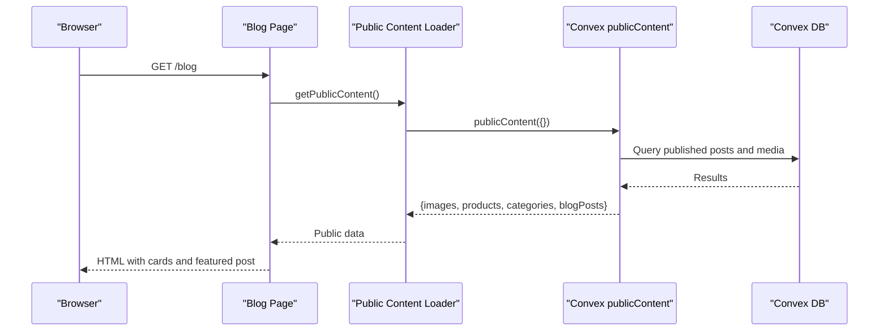
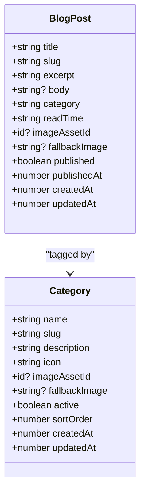
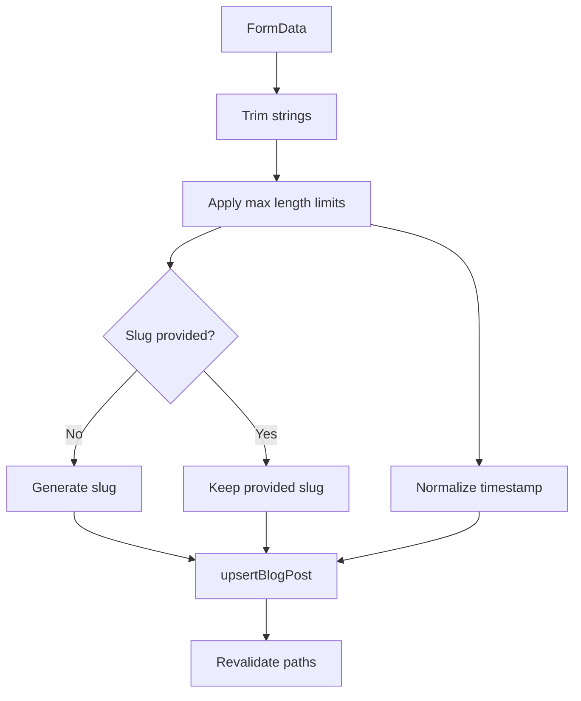
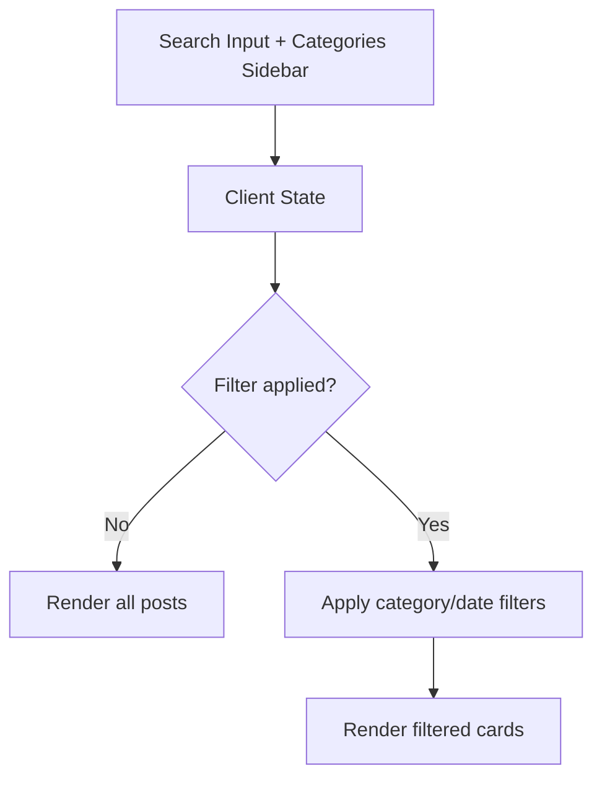
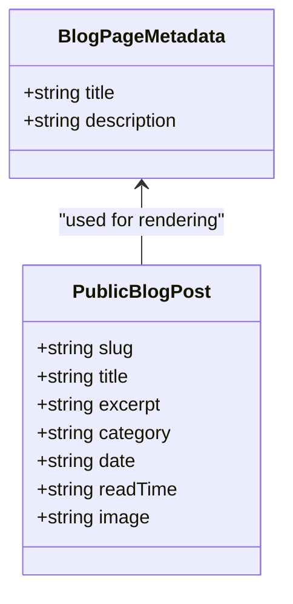
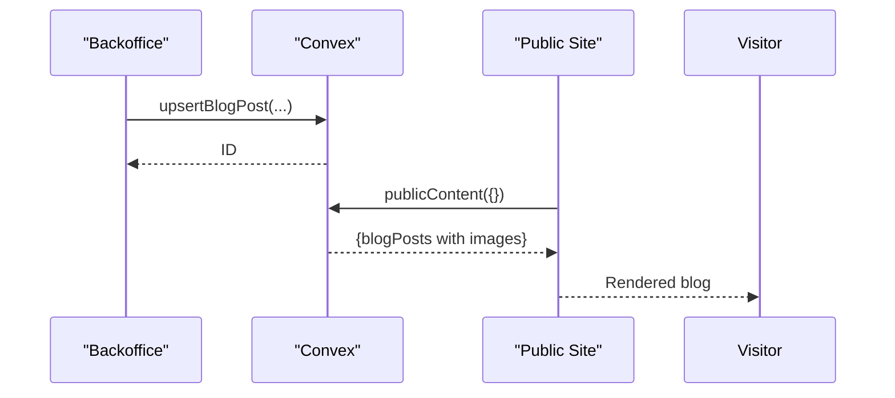
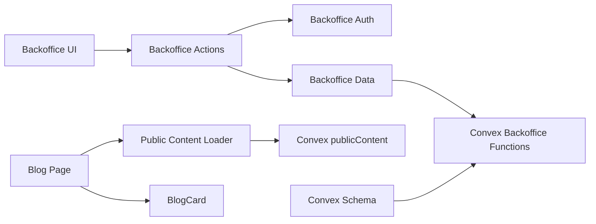

# Blog Content Management

<cite>
**Referenced Files in This Document**
- [app/blog/page.tsx](file://app/blog/page.tsx)
- [components/site/cards.tsx](file://components/site/cards.tsx)
- [lib/public-content.ts](file://lib/public-content.ts)
- [lib/site-data.ts](file://lib/site-data.ts)
- [convex/schema.ts](file://convex/schema.ts)
- [convex/backoffice.ts](file://convex/backoffice.ts)
- [app/backoffice/(admin)/blog/page.tsx](file://app/backoffice/(admin)/blog/page.tsx)
- [app/backoffice/actions.ts](file://app/backoffice/actions.ts)
- [lib/backoffice-data.ts](file://lib/backoffice-data.ts)
- [lib/backoffice-auth.ts](file://lib/backoffice-auth.ts)
- [docs/BACKOFFICE.md](file://docs/BACKOFFICE.md)
- [docs/CONVEX.md](file://docs/CONVEX.md)
- [docs/SECURITY.md](file://docs/SECURITY.md)
</cite>

## Table of Contents
1. [Introduction](#introduction)
2. [Project Structure](#project-structure)
3. [Core Components](#core-components)
4. [Architecture Overview](#architecture-overview)
5. [Detailed Component Analysis](#detailed-component-analysis)
6. [Dependency Analysis](#dependency-analysis)
7. [Performance Considerations](#performance-considerations)
8. [Troubleshooting Guide](#troubleshooting-guide)
9. [Conclusion](#conclusion)
10. [Appendices](#appendices)

## Introduction
This document explains the blog content management system for the institutional website. It covers the blog post data model, backoffice creation/editing/publishing workflows, rendering and display logic, categorization, validation and sanitization, search and filtering capabilities, metadata and SEO considerations, and the integration between the backoffice and the public content delivery pipeline.

## Project Structure
The blog system spans three layers:
- Backoffice UI and actions for managing posts and media
- Convex database schema and server functions for persistence and public content delivery
- Public website rendering that consumes public content

**Diagram sources**
- [app/backoffice/(admin)/blog/page.tsx:1-149](file://app/backoffice/(admin)/blog/page.tsx#L1-L149)
- [app/backoffice/actions.ts:1-215](file://app/backoffice/actions.ts#L1-L215)
- [lib/backoffice-auth.ts:1-129](file://lib/backoffice-auth.ts#L1-L129)
- [lib/backoffice-data.ts:1-21](file://lib/backoffice-data.ts#L1-L21)
- [convex/schema.ts:1-87](file://convex/schema.ts#L1-L87)
- [convex/backoffice.ts:1-385](file://convex/backoffice.ts#L1-L385)
- [lib/public-content.ts:1-107](file://lib/public-content.ts#L1-L107)
- [app/blog/page.tsx:1-136](file://app/blog/page.tsx#L1-L136)
- [components/site/cards.tsx:1-151](file://components/site/cards.tsx#L1-L151)
- [lib/site-data.ts:1-314](file://lib/site-data.ts#L1-L314)

**Section sources**
- [docs/BACKOFFICE.md:1-37](file://docs/BACKOFFICE.md#L1-L37)
- [docs/CONVEX.md:1-59](file://docs/CONVEX.md#L1-L59)

## Core Components
- Blog post data model: title, slug, excerpt, body, category, readTime, imageAssetId/fallbackImage, published flag, publishedAt timestamp, createdAt/updatedAt timestamps.
- Backoffice management UI for creating/updating posts, selecting media, and toggling publish state.
- Public content loader that queries published posts and attaches media URLs.
- Public blog page that renders a featured post and a grid of cards, plus search/filter UI.

**Section sources**
- [convex/schema.ts:65-80](file://convex/schema.ts#L65-L80)
- [app/backoffice/(admin)/blog/page.tsx:36-96](file://app/backoffice/(admin)/blog/page.tsx#L36-L96)
- [lib/public-content.ts:41-97](file://lib/public-content.ts#L41-L97)
- [app/blog/page.tsx:22-135](file://app/blog/page.tsx#L22-L135)

## Architecture Overview
The system separates concerns:
- Backoffice: authenticated CRUD for posts and media, slug generation, and publish scheduling.
- Convex: schema, protected admin functions, and a public read-only content query.
- Public site: SSR page that fetches public content and renders cards and excerpts.

**Diagram sources**
- [app/backoffice/actions.ts:176-199](file://app/backoffice/actions.ts#L176-L199)
- [convex/backoffice.ts:260-299](file://convex/backoffice.ts#L260-L299)
- [convex/backoffice.ts:319-384](file://convex/backoffice.ts#L319-L384)
- [lib/public-content.ts:65-106](file://lib/public-content.ts#L65-L106)
- [app/blog/page.tsx:22-135](file://app/blog/page.tsx#L22-L135)

## Detailed Component Analysis

### Blog Post Data Model
The blog post document schema defines the canonical fields used across the system:
- title: string
- slug: string
- excerpt: string
- body: optional string
- category: string
- readTime: string
- imageAssetId: optional media asset reference
- fallbackImage: optional URL
- published: boolean
- publishedAt: number (timestamp)
- createdAt/updatedAt: timestamps

These fields are exposed to the public content query and rendered on the blog page.

**Section sources**
- [convex/schema.ts:65-80](file://convex/schema.ts#L65-L80)
- [convex/backoffice.ts:367-381](file://convex/backoffice.ts#L367-L381)
- [lib/public-content.ts:41-49](file://lib/public-content.ts#L41-L49)

### Backoffice Creation and Editing Workflows
- Authentication: Login action verifies the password hash and creates a signed session cookie.
- Form fields: Title, slug (auto-generated if empty), category, read time, publication date/time, image selection, excerpt, body, and publish toggle.
- Slug generation: A deterministic slugify function normalizes and truncates text.
- Timestamp handling: Accepts numeric or parseable dates; defaults to current time when missing.
- Upsert mutation: Persists posts with createdAt/updatedAt timestamps and supports patching existing documents.
- Revalidation: Clears cache for relevant paths after updates.

**Diagram sources**
- [app/backoffice/(admin)/blog/page.tsx:36-96](file://app/backoffice/(admin)/blog/page.tsx#L36-L96)
- [app/backoffice/actions.ts:176-199](file://app/backoffice/actions.ts#L176-L199)
- [app/backoffice/actions.ts:53-61](file://app/backoffice/actions.ts#L53-L61)
- [app/backoffice/actions.ts:36-51](file://app/backoffice/actions.ts#L36-L51)

**Section sources**
- [app/backoffice/(admin)/blog/page.tsx:98-148](file://app/backoffice/(admin)/blog/page.tsx#L98-L148)
- [app/backoffice/actions.ts:63-77](file://app/backoffice/actions.ts#L63-L77)
- [lib/backoffice-auth.ts:41-58](file://lib/backoffice-auth.ts#L41-L58)
- [lib/backoffice-auth.ts:60-76](file://lib/backoffice-auth.ts#L60-L76)

### Public Rendering and Display
- Public content loader: Fetches publicContent and merges images, products, categories, and blogPosts. Falls back to local defaults if Convex is unavailable.
- Blog page: Renders a hero-style featured post and a responsive grid of cards using BlogCard.
- BlogCard: Displays category tag, date, read time, title, excerpt, and a link to the article anchor.

**Diagram sources**
- [app/blog/page.tsx:22-135](file://app/blog/page.tsx#L22-L135)
- [lib/public-content.ts:65-106](file://lib/public-content.ts#L65-L106)
- [convex/backoffice.ts:319-384](file://convex/backoffice.ts#L319-L384)

**Section sources**
- [app/blog/page.tsx:14-18](file://app/blog/page.tsx#L14-L18)
- [app/blog/page.tsx:22-135](file://app/blog/page.tsx#L22-L135)
- [components/site/cards.tsx:120-150](file://components/site/cards.tsx#L120-L150)
- [lib/public-content.ts:65-106](file://lib/public-content.ts#L65-L106)

### Categorization and Organization
- Categories are used to tag blog posts and influence navigation and grouping.
- The public content loader exposes categories and icons for rendering.
- The backoffice allows creating and updating categories with visibility and ordering controls.

**Diagram sources**
- [convex/schema.ts:65-80](file://convex/schema.ts#L65-L80)
- [convex/schema.ts:51-64](file://convex/schema.ts#L51-L64)
- [convex/backoffice.ts:359-366](file://convex/backoffice.ts#L359-L366)

**Section sources**
- [app/backoffice/(admin)/categorias/page.tsx:32-87](file://app/backoffice/(admin)/categorias/page.tsx#L32-L87)
- [lib/public-content.ts:34-49](file://lib/public-content.ts#L34-L49)

### Validation and Sanitization
- Server-side validation: Actions trim strings, enforce max lengths, and normalize timestamps.
- Slug generation: Deterministic normalization and truncation.
- Media selection: Only active Convex assets are selectable; URLs are attached via Convex Storage.
- Public exposure: Only approved public content is returned to visitors; media URLs are resolved securely.

**Diagram sources**
- [app/backoffice/actions.ts:16-51](file://app/backoffice/actions.ts#L16-L51)
- [app/backoffice/actions.ts:53-61](file://app/backoffice/actions.ts#L53-L61)
- [app/backoffice/actions.ts:176-199](file://app/backoffice/actions.ts#L176-L199)

**Section sources**
- [app/backoffice/actions.ts:16-51](file://app/backoffice/actions.ts#L16-L51)
- [app/backoffice/actions.ts:53-61](file://app/backoffice/actions.ts#L53-L61)
- [convex/backoffice.ts:33-52](file://convex/backoffice.ts#L33-L52)

### Search and Filtering
- The public blog page includes a search input and category list in the sidebar.
- Current implementation: The UI elements are present; the actual filtering logic is not implemented in the provided code.
- Recommendation: Implement client-side filtering by slug/title/excerpt and category, or wire the search input to a server action that queries Convex with filters.

**Diagram sources**
- [app/blog/page.tsx:92-116](file://app/blog/page.tsx#L92-L116)

**Section sources**
- [app/blog/page.tsx:92-116](file://app/blog/page.tsx#L92-L116)

### Metadata and SEO
- Page metadata: The blog page exports Next.js metadata with title and description.
- Per-post metadata: The public content query adds formatted date and readTime for rendering.
- Social sharing: Links open external channels (WhatsApp) but do not embed Open Graph or Twitter Card meta tags in the current code.

**Diagram sources**
- [app/blog/page.tsx:14-18](file://app/blog/page.tsx#L14-L18)
- [convex/backoffice.ts:373-377](file://convex/backoffice.ts#L373-L377)

**Section sources**
- [app/blog/page.tsx:14-18](file://app/blog/page.tsx#L14-L18)
- [convex/backoffice.ts:373-377](file://convex/backoffice.ts#L373-L377)

### Integration Between Backoffice and Public Delivery
- Backoffice writes posts to Convex; public site reads via a single publicContent query.
- Media resolution: Attach media URLs using Convex Storage; only approved assets are returned.
- Fallbacks: Local defaults are used if Convex is unreachable.

**Diagram sources**
- [app/backoffice/actions.ts:176-199](file://app/backoffice/actions.ts#L176-L199)
- [convex/backoffice.ts:260-299](file://convex/backoffice.ts#L260-L299)
- [convex/backoffice.ts:319-384](file://convex/backoffice.ts#L319-L384)
- [lib/public-content.ts:65-106](file://lib/public-content.ts#L65-L106)

**Section sources**
- [lib/public-content.ts:65-106](file://lib/public-content.ts#L65-L106)
- [convex/backoffice.ts:319-384](file://convex/backoffice.ts#L319-L384)

## Dependency Analysis
- Backoffice UI depends on actions for mutations and on backoffice-data for content lists.
- Actions depend on Convex API and backoffice-auth for session and API key checks.
- Public content loader depends on Convex publicContent and merges defaults from site-data.
- Blog page depends on public-content loader and BlogCard component.

**Diagram sources**
- [app/backoffice/(admin)/blog/page.tsx:1-149](file://app/backoffice/(admin)/blog/page.tsx#L1-L149)
- [app/backoffice/actions.ts:1-215](file://app/backoffice/actions.ts#L1-L215)
- [lib/backoffice-auth.ts:1-129](file://lib/backoffice-auth.ts#L1-L129)
- [lib/backoffice-data.ts:1-21](file://lib/backoffice-data.ts#L1-L21)
- [convex/backoffice.ts:1-385](file://convex/backoffice.ts#L1-L385)
- [lib/public-content.ts:1-107](file://lib/public-content.ts#L1-L107)
- [app/blog/page.tsx:1-136](file://app/blog/page.tsx#L1-L136)
- [components/site/cards.tsx:1-151](file://components/site/cards.tsx#L1-L151)
- [convex/schema.ts:1-87](file://convex/schema.ts#L1-L87)

**Section sources**
- [lib/backoffice-data.ts:6-20](file://lib/backoffice-data.ts#L6-L20)
- [lib/public-content.ts:13-14](file://lib/public-content.ts#L13-L14)

## Performance Considerations
- Revalidation: After edits, cache is cleared for relevant paths to ensure fresh content.
- Index usage: Convex schema defines indexes for published posts and slugs to optimize queries.
- Public query batching: The publicContent query fetches multiple collections concurrently.

Recommendations:
- Limit returned blogPosts count to reduce payload size.
- Consider pagination for large post catalogs.
- Lazy-load images and defer non-critical resources.

**Section sources**
- [app/backoffice/actions.ts:196-198](file://app/backoffice/actions.ts#L196-L198)
- [convex/schema.ts:78-80](file://convex/schema.ts#L78-L80)
- [convex/backoffice.ts:319-327](file://convex/backoffice.ts#L319-L327)

## Troubleshooting Guide
- Authentication failures: Verify BACKOFFICE_API_KEY, BACKOFFICE_PASSWORD_HASH, and BACKOFFICE_SESSION_SECRET are set and correct.
- Convex connectivity: Ensure NEXT_PUBLIC_CONVEX_URL is configured; the public content loader falls back to defaults if Convex is unreachable.
- Slug conflicts: If slug is not provided, slugify generates a normalized value; ensure uniqueness in category/content.
- Media not appearing: Confirm the selected mediaAssetId is active; URLs are resolved via Convex Storage.

**Section sources**
- [lib/backoffice-auth.ts:120-128](file://lib/backoffice-auth.ts#L120-L128)
- [lib/public-content.ts:67-69](file://lib/public-content.ts#L67-L69)
- [app/backoffice/actions.ts:53-61](file://app/backoffice/actions.ts#L53-L61)
- [convex/backoffice.ts:33-52](file://convex/backoffice.ts#L33-L52)

## Conclusion
The blog system combines a secure backoffice with a robust public delivery pipeline. Posts are modeled with essential fields, validated and normalized on the server, and surfaced to the public site through a single optimized query. While the current UI includes search and category widgets, the filtering logic is not yet implemented—extending it would improve discoverability. SEO and social sharing can be further enhanced by adding structured metadata and social tags.

## Appendices

### Example Data Structures
- PublicBlogPost: slug, title, excerpt, category, date, readTime, image
- BlogPost (Convex): title, slug, excerpt, body, category, readTime, imageAssetId, fallbackImage, published, publishedAt, createdAt, updatedAt

**Section sources**
- [lib/public-content.ts:41-49](file://lib/public-content.ts#L41-L49)
- [convex/schema.ts:65-80](file://convex/schema.ts#L65-L80)

### Component Usage Patterns
- Backoffice Blog UI composes a form with Field inputs, MediaSelect dropdown, and a submit Button.
- Public Blog Page renders a hero featured post and a grid of BlogCard components.
- BlogCard expects slug, title, excerpt, category, date, readTime, and image props.

**Section sources**
- [app/backoffice/(admin)/blog/page.tsx:36-96](file://app/backoffice/(admin)/blog/page.tsx#L36-L96)
- [app/blog/page.tsx:44-87](file://app/blog/page.tsx#L44-L87)
- [components/site/cards.tsx:120-150](file://components/site/cards.tsx#L120-L150)