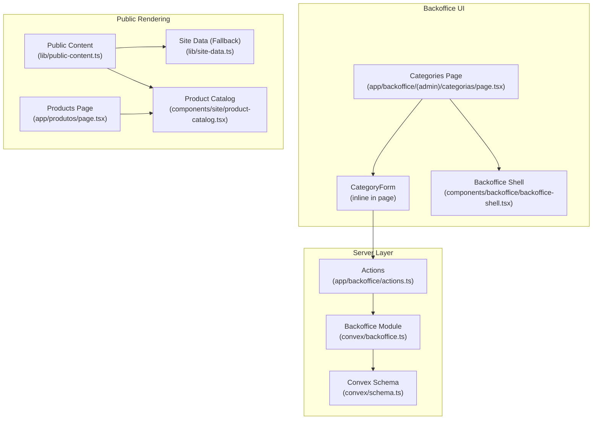
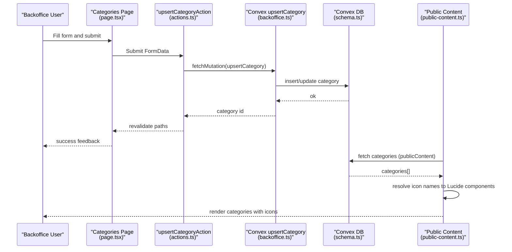
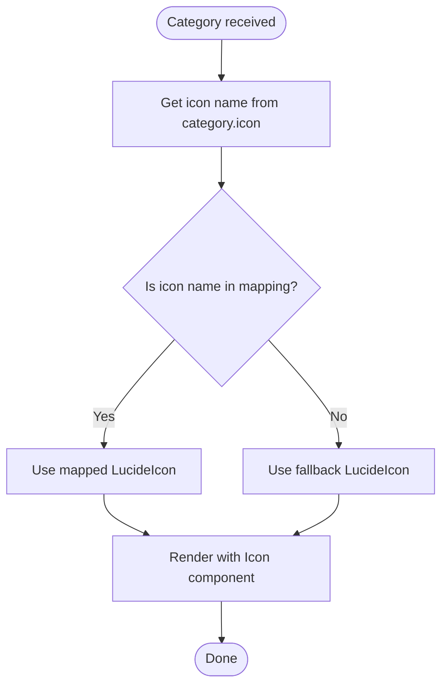
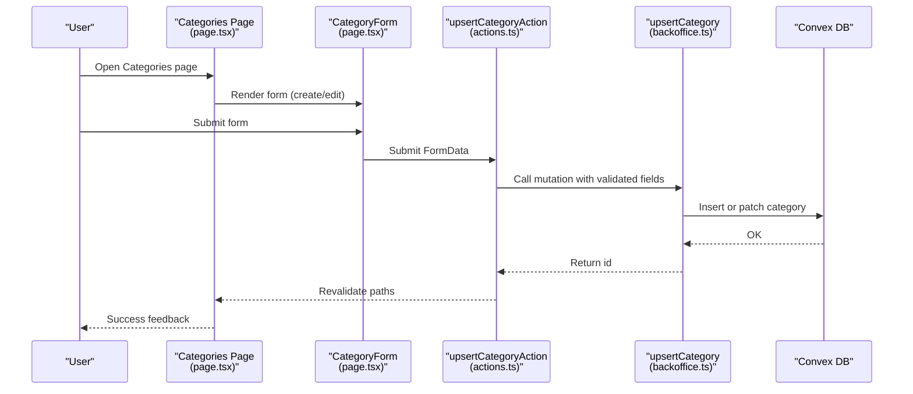
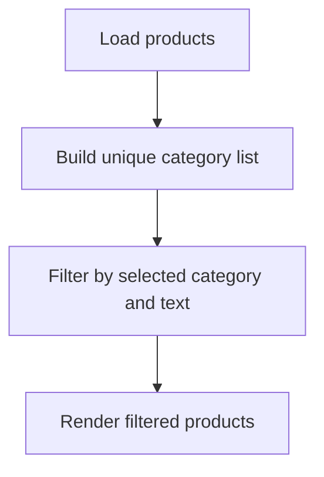
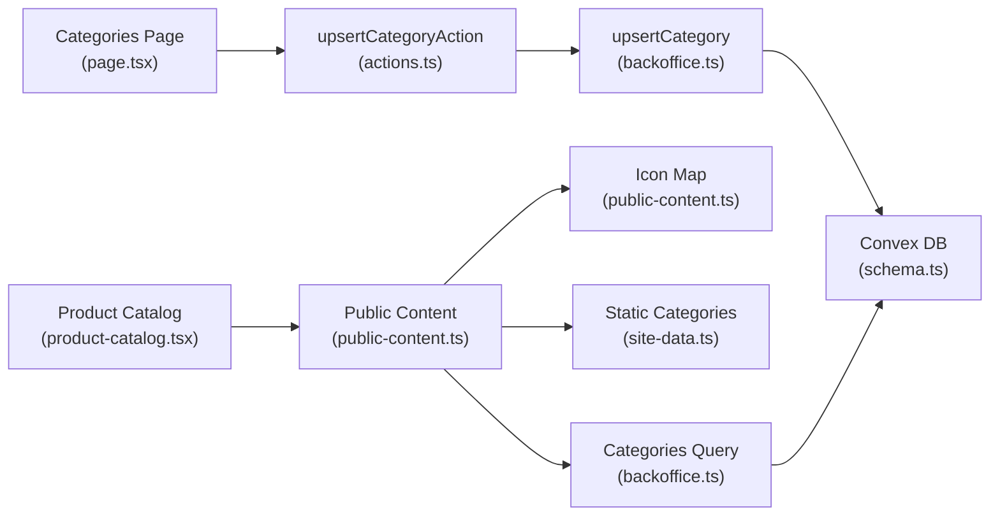

# Category Management System

<cite>
**Referenced Files in This Document**
- [schema.ts](file://convex/schema.ts)
- [backoffice.ts](file://convex/backoffice.ts)
- [actions.ts](file://app/backoffice/actions.ts)
- [page.tsx](file://app/backoffice/(admin)/categorias/page.tsx)
- [backoffice-shell.tsx](file://components/backoffice/backoffice-shell.tsx)
- [admin-ui.tsx](file://components/backoffice/admin-ui.tsx)
- [public-content.ts](file://lib/public-content.ts)
- [site-data.ts](file://lib/site-data.ts)
- [product-catalog.tsx](file://components/site/product-catalog.tsx)
- [page.tsx](file://app/produtos/page.tsx)
- [media-upload-form.tsx](file://components/backoffice/media-upload-form.tsx)
- [backoffice-data.ts](file://lib/backoffice-data.ts)
</cite>

## Table of Contents
1. [Introduction](#introduction)
2. [Project Structure](#project-structure)
3. [Core Components](#core-components)
4. [Architecture Overview](#architecture-overview)
5. [Detailed Component Analysis](#detailed-component-analysis)
6. [Dependency Analysis](#dependency-analysis)
7. [Performance Considerations](#performance-considerations)
8. [Troubleshooting Guide](#troubleshooting-guide)
9. [Conclusion](#conclusion)

## Introduction
This document describes the category management system used to organize product offerings and content. It covers the category data model, icon mapping with Lucide icons, the backoffice workflows for creating, editing, and deleting categories, the relationship between categories and products, category hierarchy and organization patterns, validation rules, fallback icon behavior, and how categories influence navigation and content organization. It also documents the integration with the product catalog and the public-facing category rendering pipeline.

## Project Structure
The category management system spans several layers:
- Convex schema and server-side mutations/queries define the category data model and CRUD operations.
- Backoffice UI pages and forms provide administrative controls for categories.
- Public-facing components render categories and integrate with the product catalog.
- Utilities manage icon mapping and public content composition.



**Diagram sources**
- [page.tsx](file://app/backoffice/(admin)/categorias/page.tsx#L1-L139)
- [backoffice-shell.tsx:1-78](file://components/backoffice/backoffice-shell.tsx#L1-L78)
- [actions.ts:153-174](file://app/backoffice/actions.ts#L153-L174)
- [backoffice.ts:223-258](file://convex/backoffice.ts#L223-L258)
- [schema.ts:51-64](file://convex/schema.ts#L51-L64)
- [public-content.ts:16-97](file://lib/public-content.ts#L16-L97)
- [site-data.ts:72-115](file://lib/site-data.ts#L72-L115)
- [product-catalog.tsx:1-79](file://components/site/product-catalog.tsx#L1-L79)
- [page.tsx:1-43](file://app/produtos/page.tsx#L1-L43)

**Section sources**
- [page.tsx](file://app/backoffice/(admin)/categorias/page.tsx#L1-L139)
- [backoffice-shell.tsx:1-78](file://components/backoffice/backoffice-shell.tsx#L1-L78)
- [actions.ts:153-174](file://app/backoffice/actions.ts#L153-L174)
- [backoffice.ts:223-258](file://convex/backoffice.ts#L223-L258)
- [schema.ts:51-64](file://convex/schema.ts#L51-L64)
- [public-content.ts:16-97](file://lib/public-content.ts#L16-L97)
- [site-data.ts:72-115](file://lib/site-data.ts#L72-L115)
- [product-catalog.tsx:1-79](file://components/site/product-catalog.tsx#L1-L79)
- [page.tsx:1-43](file://app/produtos/page.tsx#L1-L43)

## Core Components
- Category data model: name, slug, description, icon, optional media asset, optional fallback image, active flag, sort order, timestamps.
- Icon mapping: Lucide icon names stored in the database map to actual Lucide icon components via a lookup table.
- Backoffice form: Provides fields for name, slug, icon selection, sortOrder, media selection, description, visibility toggle, and submission.
- Public rendering: Categories are fetched from Convex when available; otherwise, a static fallback list is used. Icons are resolved to Lucide components.

**Section sources**
- [schema.ts:51-64](file://convex/schema.ts#L51-L64)
- [public-content.ts:16-24](file://lib/public-content.ts#L16-L24)
- [public-content.ts:82-89](file://lib/public-content.ts#L82-L89)
- [page.tsx](file://app/backoffice/(admin)/categorias/page.tsx#L32-L87)

## Architecture Overview
The category lifecycle involves the backoffice UI submitting changes, Convex mutations persisting data, and the public site consuming categories either from Convex or a static fallback.



**Diagram sources**
- [page.tsx](file://app/backoffice/(admin)/categorias/page.tsx#L32-L87)
- [actions.ts:153-174](file://app/backoffice/actions.ts#L153-L174)
- [backoffice.ts:223-258](file://convex/backoffice.ts#L223-L258)
- [schema.ts:51-64](file://convex/schema.ts#L51-L64)
- [public-content.ts:65-97](file://lib/public-content.ts#L65-L97)

## Detailed Component Analysis

### Category Data Model
- Fields:
  - name: string
  - slug: string
  - description: string
  - icon: string (Lucide icon name)
  - imageAssetId: optional media asset id
  - fallbackImage: optional URL string
  - active: boolean
  - sortOrder: number
  - createdAt/updatedAt: timestamps
- Indexes: by_active_and_sort_order, by_slug
- Relationship with media: categories can reference a media asset; otherwise, a fallback image URL is used.
- Relationship with products: products reference a category by name (string).

```mermaid
erDiagram
CATEGORIES {
string name
string slug
string description
string icon
id mediaAssets imageAssetId
string fallbackImage
boolean active
number sortOrder
number createdAt
number updatedAt
}
PRODUCTS {
string name
string slug
string category
string description
id mediaAssets imageAssetId
string fallbackImage
boolean active
number sortOrder
number createdAt
number updatedAt
}
MEDIAASSETS {
id _storage storageId
string filename
string alt
enum kind
string contentType
number size
enum status
number uploadedAt
}
CATEGORIES ||--o{ PRODUCTS : "referenced by name"
CATEGORIES }o--|| MEDIAASSETS : "optional image"
```

**Diagram sources**
- [schema.ts:37-50](file://convex/schema.ts#L37-L50)
- [schema.ts:51-64](file://convex/schema.ts#L51-L64)
- [schema.ts:18-36](file://convex/schema.ts#L18-L36)

**Section sources**
- [schema.ts:37-50](file://convex/schema.ts#L37-L50)
- [schema.ts:51-64](file://convex/schema.ts#L51-L64)

### Category Icon Mapping System
- The icon field stores a Lucide icon name (e.g., "Boxes").
- A mapping table converts icon names to Lucide React components.
- Fallback: If the stored icon name is not found, a default icon is used.



**Diagram sources**
- [public-content.ts:16-24](file://lib/public-content.ts#L16-L24)
- [public-content.ts:87-88](file://lib/public-content.ts#L87-L88)

**Section sources**
- [public-content.ts:16-24](file://lib/public-content.ts#L16-L24)
- [public-content.ts:82-89](file://lib/public-content.ts#L82-L89)

### Backoffice Category Workflows
- Navigation: The backoffice shell includes a "Categories" menu item.
- Listing and creation:
  - The categories page fetches content lists and renders a form to create a new category.
  - The form includes fields for name, slug, icon, sortOrder, media selection, description, and visibility.
- Editing:
  - Existing categories are rendered with a card containing a preview and edit form.
  - The edit form pre-populates fields and submits updates.
- Deletion:
  - No explicit delete endpoint is present in the backoffice module. Deletion would require adding a mutation and UI action.



**Diagram sources**
- [backoffice-shell.tsx:8-15](file://components/backoffice/backoffice-shell.tsx#L8-L15)
- [page.tsx](file://app/backoffice/(admin)/categorias/page.tsx#L32-L87)
- [actions.ts:153-174](file://app/backoffice/actions.ts#L153-L174)
- [backoffice.ts:223-258](file://convex/backoffice.ts#L223-L258)

**Section sources**
- [backoffice-shell.tsx:8-15](file://components/backoffice/backoffice-shell.tsx#L8-L15)
- [page.tsx](file://app/backoffice/(admin)/categorias/page.tsx#L32-L87)
- [actions.ts:153-174](file://app/backoffice/actions.ts#L153-L174)
- [backoffice.ts:223-258](file://convex/backoffice.ts#L223-L258)

### Category Validation Rules
- Slug generation: If empty, a slug is generated from the name.
- Icon default: If empty, defaults to a predefined icon name.
- Numeric fields: sortOrder is coerced to a number; invalid values fall back to zero.
- Media kind constraint: When uploading media, only specific kinds are accepted, including "category".
- Visibility: active is a boolean checkbox; defaults to checked.

**Section sources**
- [actions.ts:53-61](file://app/backoffice/actions.ts#L53-L61)
- [actions.ts:155-169](file://app/backoffice/actions.ts#L155-L169)
- [page.tsx](file://app/backoffice/(admin)/categorias/page.tsx#L54-L60)
- [media-upload-form.tsx:11-12](file://components/backoffice/media-upload-form.tsx#L11-L12)
- [media-upload-form.tsx:88-95](file://components/backoffice/media-upload-form.tsx#L88-L95)

### Fallback Icon System
- If a category’s icon name is not found in the mapping, a fallback icon is used.
- Static fallback categories are provided when Convex categories are unavailable.

**Section sources**
- [public-content.ts:87-88](file://lib/public-content.ts#L87-L88)
- [site-data.ts:72-115](file://lib/site-data.ts#L72-L115)

### Category Assignment and Filtering Mechanisms
- Product-to-category relationship:
  - Products reference a category by name (string).
  - The product catalog filters by category name and text search.
- Filtering UI:
  - The product catalog builds a category filter list from product data.
  - Users can select a category or search by name/description.



**Diagram sources**
- [product-catalog.tsx:15-26](file://components/site/product-catalog.tsx#L15-L26)

**Section sources**
- [schema.ts:37-50](file://convex/schema.ts#L37-L50)
- [product-catalog.tsx:12-26](file://components/site/product-catalog.tsx#L12-L26)

### Category Hierarchy and Organization Patterns
- Single-level hierarchy: Categories are flat; there is no parent-child relationship in the schema.
- Organization:
  - sortOrder controls ordering.
  - active toggles visibility.
  - slug ensures stable URLs and deduplication.

**Section sources**
- [schema.ts:51-64](file://convex/schema.ts#L51-L64)

### Integration with Product Catalog
- Public content composition:
  - Fetches categories from Convex; resolves icons and images.
  - Falls back to static categories if Convex is unavailable.
- Product catalog:
  - Uses category names to filter products.
  - Renders category tabs dynamically from product data.

**Section sources**
- [public-content.ts:65-97](file://lib/public-content.ts#L65-L97)
- [product-catalog.tsx:12-18](file://components/site/product-catalog.tsx#L12-L18)
- [page.tsx:17-38](file://app/produtos/page.tsx#L17-L38)

### Example Data Structures
- Category (stored):
  - name, slug, description, icon, imageAssetId?, fallbackImage?, active, sortOrder, timestamps
- Category (public rendering):
  - name, description, icon (Lucide component), image (URL or fallback)
- Product (category reference):
  - category (string name)

**Section sources**
- [schema.ts:51-64](file://convex/schema.ts#L51-L64)
- [public-content.ts:34-39](file://lib/public-content.ts#L34-L39)
- [schema.ts:37-50](file://convex/schema.ts#L37-L50)

### Component Usage Patterns
- Backoffice form pattern:
  - Hidden id for edits, required fields for creation, select for icon, numeric input for sortOrder, media dropdown, textarea for description, checkbox for visibility.
- Public rendering pattern:
  - Resolve icon names to Lucide components.
  - Prefer Convex media URLs; otherwise use fallback images.
  - Provide graceful degradation when Convex is down.

**Section sources**
- [page.tsx](file://app/backoffice/(admin)/categorias/page.tsx#L32-L87)
- [public-content.ts:82-89](file://lib/public-content.ts#L82-L89)
- [site-data.ts:72-115](file://lib/site-data.ts#L72-L115)

## Dependency Analysis
- Backoffice UI depends on:
  - Actions for mutations.
  - Convex module for persistence.
  - Admin UI helpers for consistent layout.
- Public rendering depends on:
  - Convex publicContent query.
  - Icon mapping and fallback data.
  - Product catalog for category-driven filtering.



**Diagram sources**
- [page.tsx](file://app/backoffice/(admin)/categorias/page.tsx#L1-L139)
- [actions.ts:153-174](file://app/backoffice/actions.ts#L153-L174)
- [backoffice.ts:223-258](file://convex/backoffice.ts#L223-L258)
- [schema.ts:51-64](file://convex/schema.ts#L51-L64)
- [public-content.ts:16-97](file://lib/public-content.ts#L16-L97)
- [site-data.ts:72-115](file://lib/site-data.ts#L72-L115)
- [product-catalog.tsx:1-79](file://components/site/product-catalog.tsx#L1-L79)

**Section sources**
- [page.tsx](file://app/backoffice/(admin)/categorias/page.tsx#L1-L139)
- [actions.ts:153-174](file://app/backoffice/actions.ts#L153-L174)
- [backoffice.ts:223-258](file://convex/backoffice.ts#L223-L258)
- [schema.ts:51-64](file://convex/schema.ts#L51-L64)
- [public-content.ts:16-97](file://lib/public-content.ts#L16-L97)
- [site-data.ts:72-115](file://lib/site-data.ts#L72-L115)
- [product-catalog.tsx:1-79](file://components/site/product-catalog.tsx#L1-L79)

## Performance Considerations
- Index usage:
  - categories.by_active_and_sort_order and categories.by_slug reduce query costs.
- Public content caching:
  - Next.js revalidation is triggered after category updates to refresh cached pages.
- Media resolution:
  - attachMediaUrl checks asset status and returns null if inactive, avoiding broken links.

**Section sources**
- [schema.ts:63-64](file://convex/schema.ts#L63-L64)
- [backoffice.ts:33-45](file://convex/backoffice.ts#L33-L45)
- [actions.ts:171-173](file://app/backoffice/actions.ts#L171-L173)

## Troubleshooting Guide
- Category icon not rendering:
  - Verify the icon name exists in the mapping table.
  - Confirm the category has a valid icon name; otherwise, the fallback icon is used.
- Empty category list in backoffice:
  - Check Convex connectivity and that categories exist with active=true.
  - The UI falls back to a message indicating no categories are present.
- Product filtering not working:
  - Ensure products’ category fields match category names.
  - Confirm the product catalog is initialized with current public content.
- Media not appearing:
  - Confirm the media asset status is active.
  - Verify the media kind includes "category" when uploading.

**Section sources**
- [public-content.ts:82-89](file://lib/public-content.ts#L82-L89)
- [page.tsx](file://app/backoffice/(admin)/categorias/page.tsx#L128-L134)
- [product-catalog.tsx:12-26](file://components/site/product-catalog.tsx#L12-L26)
- [backoffice.ts:33-45](file://convex/backoffice.ts#L33-L45)
- [media-upload-form.tsx:88-95](file://components/backoffice/media-upload-form.tsx#L88-L95)

## Conclusion
The category management system provides a robust, icon-rich way to organize products and content. Categories are persisted via Convex, rendered with Lucide icons, and integrated into the product catalog filtering. While the system supports single-level organization today, future enhancements could include hierarchical categories and explicit deletion workflows.