# Content Management System

<cite>
**Referenced Files in This Document**
- [schema.ts](file://convex/schema.ts)
- [backoffice.ts](file://convex/backoffice.ts)
- [public-content.ts](file://lib/public-content.ts)
- [backoffice-data.ts](file://lib/backoffice-data.ts)
- [backoffice-auth.ts](file://lib/backoffice-auth.ts)
- [actions.ts](file://app/backoffice/actions.ts)
- [layout.tsx](file://app/backoffice/(admin)/layout.tsx)
- [page.tsx](file://app/backoffice/(admin)/page.tsx)
- [admin-ui.tsx](file://components/backoffice/admin-ui.tsx)
- [media-upload-form.tsx](file://components/backoffice/media-upload-form.tsx)
- [site-data.ts](file://lib/site-data.ts)
- [product-catalog.tsx](file://components/site/product-catalog.tsx)
- [cards.tsx](file://components/site/cards.tsx)
</cite>

## Table of Contents
1. [Introduction](#introduction)
2. [Project Structure](#project-structure)
3. [Core Components](#core-components)
4. [Architecture Overview](#architecture-overview)
5. [Detailed Component Analysis](#detailed-component-analysis)
6. [Dependency Analysis](#dependency-analysis)
7. [Performance Considerations](#performance-considerations)
8. [Troubleshooting Guide](#troubleshooting-guide)
9. [Conclusion](#conclusion)
10. [Appendices](#appendices)

## Introduction
This document describes the content management system for the ADIKI ALVANIR Angola website. It explains how dynamic content is fetched from a Convex database using Next.js server actions and queries, how content types (products, categories, blog posts, media assets) are modeled and managed, and how the content rendering pipeline transforms database records into site presentations. It also documents validation and sanitization approaches, caching strategies, content workflows (creation, editing, approval, scheduling), and the integration between Convex backend services and frontend components. Finally, it covers content organization, search/filtering, and role-based permissions.

## Project Structure
The system is organized around:
- Convex schema and server-side APIs for content CRUD and public queries
- Frontend Next.js app with backoffice administration and public pages
- Utilities for public content hydration and backoffice data fetching
- Authentication and authorization for the backoffice
- UI components for content management and public rendering

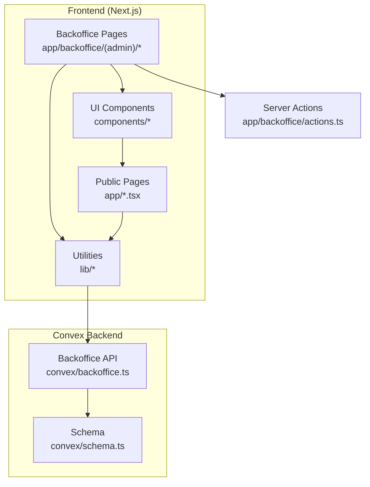

**Diagram sources**
- [layout.tsx](file://app/backoffice/(admin)/layout.tsx#L1-L22)
- [actions.ts:1-215](file://app/backoffice/actions.ts#L1-L215)
- [backoffice.ts:1-385](file://convex/backoffice.ts#L1-L385)
- [schema.ts:1-87](file://convex/schema.ts#L1-L87)
- [public-content.ts:1-107](file://lib/public-content.ts#L1-L107)
- [backoffice-data.ts:1-21](file://lib/backoffice-data.ts#L1-L21)

**Section sources**
- [layout.tsx](file://app/backoffice/(admin)/layout.tsx#L1-L22)
- [actions.ts:1-215](file://app/backoffice/actions.ts#L1-L215)
- [backoffice.ts:1-385](file://convex/backoffice.ts#L1-L385)
- [schema.ts:1-87](file://convex/schema.ts#L1-L87)
- [public-content.ts:1-107](file://lib/public-content.ts#L1-L107)
- [backoffice-data.ts:1-21](file://lib/backoffice-data.ts#L1-L21)

## Core Components
- Convex schema defines content collections and indexes for efficient querying.
- Convex backoffice module exposes typed mutations and queries for managing content and generating storage URLs.
- Utilities fetch public content and backoffice lists via Convex Next.js helpers.
- Backoffice actions encapsulate server-side mutations and revalidation triggers.
- Authentication enforces admin sessions and API key verification.
- UI components render content and provide management forms.

**Section sources**
- [schema.ts:1-87](file://convex/schema.ts#L1-L87)
- [backoffice.ts:1-385](file://convex/backoffice.ts#L1-L385)
- [public-content.ts:1-107](file://lib/public-content.ts#L1-L107)
- [backoffice-data.ts:1-21](file://lib/backoffice-data.ts#L1-L21)
- [actions.ts:1-215](file://app/backoffice/actions.ts#L1-L215)
- [backoffice-auth.ts:1-129](file://lib/backoffice-auth.ts#L1-L129)

## Architecture Overview
The CMS architecture separates concerns between:
- Data modeling and indexing (Convex schema)
- Backoffice management (mutations, queries, uploads)
- Public content hydration (queries for site rendering)
- Authentication and authorization (session and API key checks)
- Rendering pipeline (components compose public content)

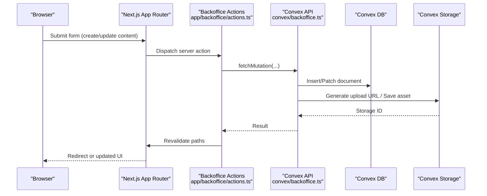

**Diagram sources**
- [actions.ts:1-215](file://app/backoffice/actions.ts#L1-L215)
- [backoffice.ts:68-108](file://convex/backoffice.ts#L68-L108)

**Section sources**
- [actions.ts:1-215](file://app/backoffice/actions.ts#L1-L215)
- [backoffice.ts:68-108](file://convex/backoffice.ts#L68-L108)

## Detailed Component Analysis

### Content Types and Schema
The Convex schema defines the following content types with indexes optimized for common queries:
- Leads: contact requests with status and timestamps
- Media assets: images/videos stored in Convex Storage with kinds and statuses
- Products: catalog items with category, sorting, and active flag
- Categories: product taxonomy with icons and ordering
- Blog posts: articles with publishing flags and timestamps
- Site settings: key-value pairs for branding and contact info

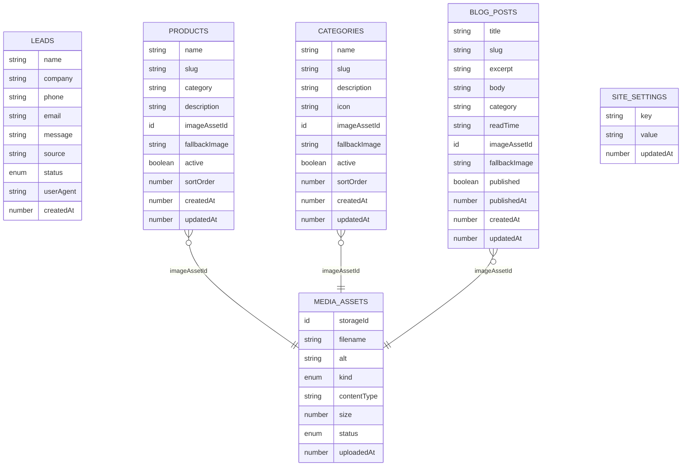

**Diagram sources**
- [schema.ts:4-87](file://convex/schema.ts#L4-L87)

**Section sources**
- [schema.ts:1-87](file://convex/schema.ts#L1-L87)

### Public Content Fetching Pipeline
Public content is assembled by a Convex query that:
- Loads active products and categories
- Loads published blog posts ordered by publish time
- Resolves media URLs from Convex Storage
- Merges fallback images and normalizes content for the frontend

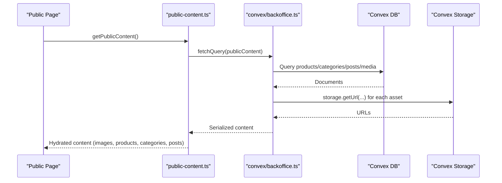

**Diagram sources**
- [public-content.ts:65-107](file://lib/public-content.ts#L65-L107)
- [backoffice.ts:319-384](file://convex/backoffice.ts#L319-L384)

**Section sources**
- [public-content.ts:65-107](file://lib/public-content.ts#L65-L107)
- [backoffice.ts:319-384](file://convex/backoffice.ts#L319-L384)

### Backoffice Management Interfaces
Backoffice pages and actions coordinate CRUD operations:
- Dashboard: aggregates counts and recent items
- Media upload: generates upload URLs and persists metadata
- Content CRUD: products, categories, blog posts, and settings
- Lead management: status updates

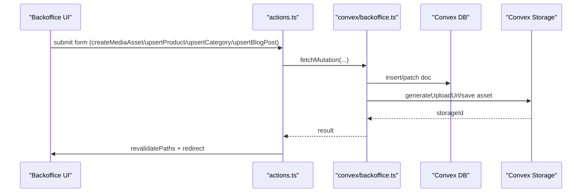

**Diagram sources**
- [actions.ts:84-215](file://app/backoffice/actions.ts#L84-L215)
- [backoffice.ts:186-317](file://convex/backoffice.ts#L186-L317)

**Section sources**
- [page.tsx](file://app/backoffice/(admin)/page.tsx#L25-L123)
- [actions.ts:84-215](file://app/backoffice/actions.ts#L84-L215)
- [backoffice.ts:186-317](file://convex/backoffice.ts#L186-L317)

### Media Asset Management
Media assets are validated and persisted with:
- Type constraints (JPEG, PNG, WebP)
- Size limits
- Kind tagging (hero, product, category, blog, logo, general)
- Status tracking (active/archived)
- URL resolution via Convex Storage

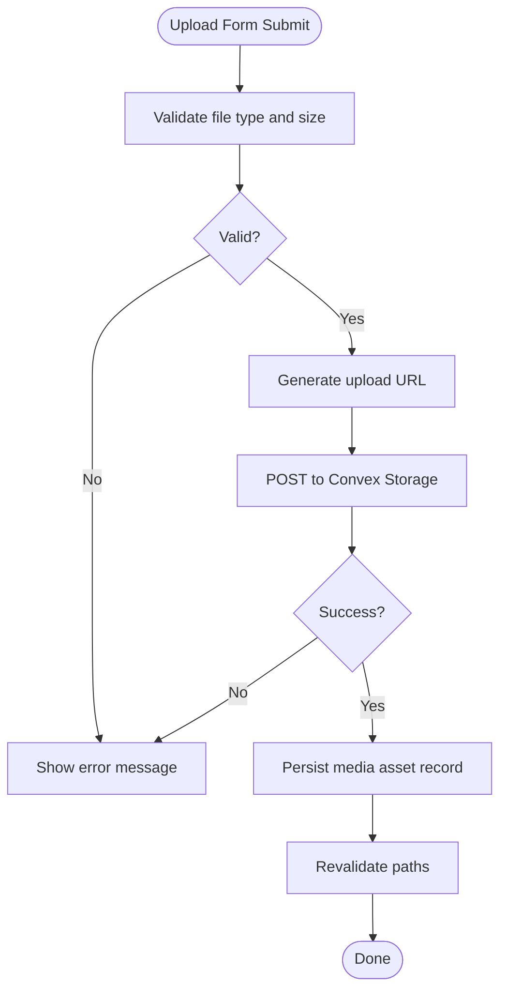

**Diagram sources**
- [media-upload-form.tsx:14-114](file://components/backoffice/media-upload-form.tsx#L14-L114)
- [actions.ts:79-108](file://app/backoffice/actions.ts#L79-L108)
- [backoffice.ts:68-108](file://convex/backoffice.ts#L68-L108)

**Section sources**
- [media-upload-form.tsx:14-114](file://components/backoffice/media-upload-form.tsx#L14-L114)
- [actions.ts:79-108](file://app/backoffice/actions.ts#L79-L108)
- [backoffice.ts:68-108](file://convex/backoffice.ts#L68-L108)

### Content Rendering Pipeline
Public pages consume hydrated content:
- Product catalog filters and renders products
- Cards present categories, products, and blog posts
- Site data provides defaults and navigation

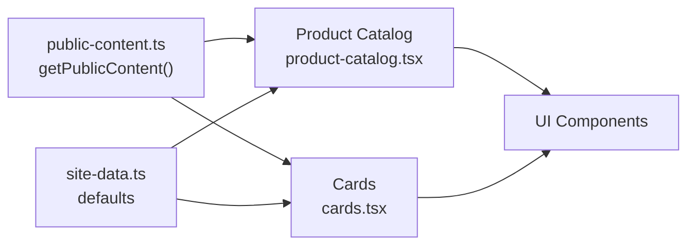

**Diagram sources**
- [public-content.ts:65-107](file://lib/public-content.ts#L65-L107)
- [product-catalog.tsx:12-79](file://components/site/product-catalog.tsx#L12-L79)
- [cards.tsx:17-151](file://components/site/cards.tsx#L17-L151)
- [site-data.ts:1-314](file://lib/site-data.ts#L1-L314)

**Section sources**
- [public-content.ts:65-107](file://lib/public-content.ts#L65-L107)
- [product-catalog.tsx:12-79](file://components/site/product-catalog.tsx#L12-L79)
- [cards.tsx:17-151](file://components/site/cards.tsx#L17-L151)
- [site-data.ts:1-314](file://lib/site-data.ts#L1-L314)

### Content Validation and Sanitization
- Server actions sanitize and normalize inputs:
  - Trim strings, enforce lengths, coerce numbers and timestamps
  - Slug generation uses normalization and hyphenation
- Media upload form validates MIME types and file size
- Convex mutations validate enums and IDs
- Public content assembly handles missing assets gracefully

Recommendations:
- Apply HTML sanitization for user-generated rich text (e.g., blog body) before persistence.
- Add rate limiting for upload endpoints.
- Consider Content Security Policy headers for embedded assets.

**Section sources**
- [actions.ts:16-61](file://app/backoffice/actions.ts#L16-L61)
- [media-upload-form.tsx:11-42](file://components/backoffice/media-upload-form.tsx#L11-L42)
- [backoffice.ts:9-23](file://convex/backoffice.ts#L9-L23)

### Caching Strategies and Delivery Optimization
- Automatic revalidation:
  - Server actions trigger revalidation for affected routes after mutations.
- Public content hydration:
  - Uses Convex Next.js helpers to fetch content on demand.
- Image optimization:
  - Next.js Image component is used across cards with responsive sizing.
- Recommendations:
  - Introduce CDN caching for static assets and generated image URLs.
  - Add server-side caching for frequently accessed public content with cache keys derived from updatedAt timestamps.
  - Use background revalidation for infrequent reads.

**Section sources**
- [actions.ts:148-151](file://app/backoffice/actions.ts#L148-L151)
- [actions.ts:171-174](file://app/backoffice/actions.ts#L171-L174)
- [actions.ts:196-199](file://app/backoffice/actions.ts#L196-L199)
- [cards.tsx:24-31](file://components/site/cards.tsx#L24-L31)
- [cards.tsx:63-70](file://components/site/cards.tsx#L63-L70)

### Content Workflow: Creation, Editing, Approval, Scheduling
- Creation:
  - Forms submit server actions that insert documents and persist media.
- Editing:
  - Upsert mutations patch existing documents and update timestamps.
- Approval:
  - Lead status transitions are controlled via mutations with predefined states.
- Publication scheduling:
  - Blog posts support a published flag and a scheduled timestamp; public query filters by published state and order by publish time.

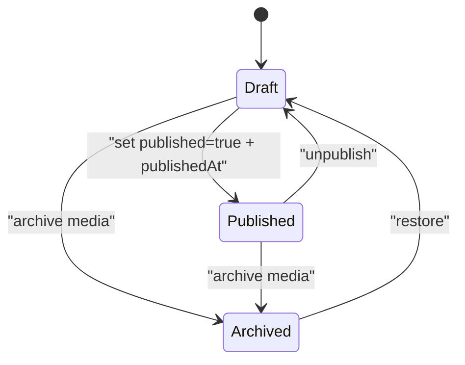

**Diagram sources**
- [backoffice.ts:260-299](file://convex/backoffice.ts#L260-L299)
- [backoffice.ts:102-108](file://convex/backoffice.ts#L102-L108)

**Section sources**
- [actions.ts:176-199](file://app/backoffice/actions.ts#L176-L199)
- [backoffice.ts:260-299](file://convex/backoffice.ts#L260-L299)
- [backoffice.ts:102-108](file://convex/backoffice.ts#L102-L108)

### Content Organization, Search, and Filtering
- Categories:
  - Products are grouped by category; UI exposes category filter.
- Search:
  - Product catalog filters by category and free-text query across name, category, and description.
- Defaults:
  - Static site data provides default categories, products, and blog posts when public content is unavailable.

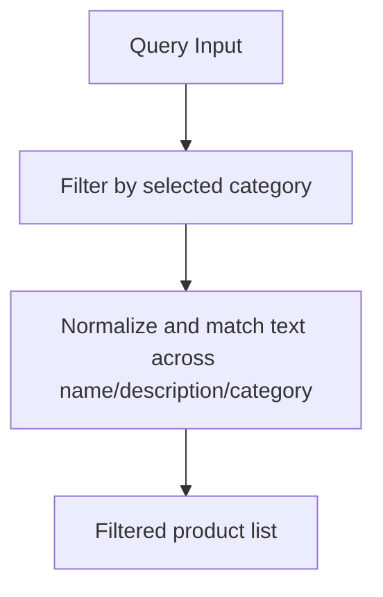

**Diagram sources**
- [product-catalog.tsx:20-26](file://components/site/product-catalog.tsx#L20-L26)

**Section sources**
- [product-catalog.tsx:12-79](file://components/site/product-catalog.tsx#L12-L79)
- [site-data.ts:72-174](file://lib/site-data.ts#L72-L174)

### Role-Based Permissions and Authentication
- Admin session:
  - Signed cookie with HMAC; expiration enforced.
- API key:
  - Backoffice mutations require a server-side API key for authorization.
- Route protection:
  - Backoffice layout enforces session requirement.

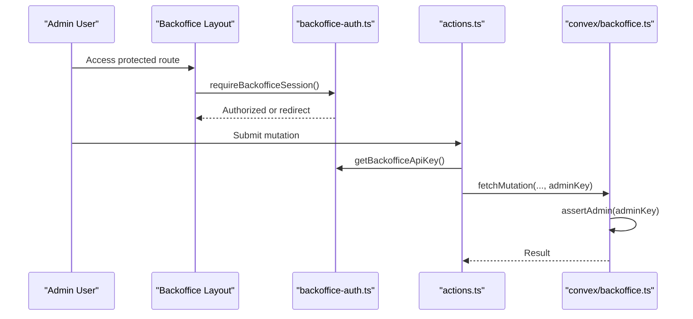

**Diagram sources**
- [layout.tsx](file://app/backoffice/(admin)/layout.tsx#L17-L21)
- [backoffice-auth.ts:110-129](file://lib/backoffice-auth.ts#L110-L129)
- [actions.ts:80-82](file://app/backoffice/actions.ts#L80-L82)
- [backoffice.ts:25-31](file://convex/backoffice.ts#L25-L31)

**Section sources**
- [backoffice-auth.ts:60-129](file://lib/backoffice-auth.ts#L60-L129)
- [layout.tsx](file://app/backoffice/(admin)/layout.tsx#L17-L21)
- [actions.ts:80-82](file://app/backoffice/actions.ts#L80-L82)
- [backoffice.ts:25-31](file://convex/backoffice.ts#L25-L31)

## Dependency Analysis
The system exhibits clear separation of concerns:
- Frontend depends on Convex APIs via typed helpers
- Mutations depend on schema-defined enums and indexes
- Rendering components depend on hydrated content and defaults

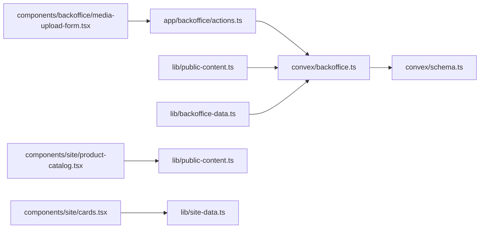

**Diagram sources**
- [actions.ts:1-215](file://app/backoffice/actions.ts#L1-L215)
- [backoffice.ts:1-385](file://convex/backoffice.ts#L1-L385)
- [schema.ts:1-87](file://convex/schema.ts#L1-L87)
- [public-content.ts:1-107](file://lib/public-content.ts#L1-L107)
- [backoffice-data.ts:1-21](file://lib/backoffice-data.ts#L1-L21)
- [media-upload-form.tsx:1-114](file://components/backoffice/media-upload-form.tsx#L1-L114)
- [product-catalog.tsx:1-79](file://components/site/product-catalog.tsx#L1-L79)
- [cards.tsx:1-151](file://components/site/cards.tsx#L1-L151)
- [site-data.ts:1-314](file://lib/site-data.ts#L1-L314)

**Section sources**
- [actions.ts:1-215](file://app/backoffice/actions.ts#L1-L215)
- [backoffice.ts:1-385](file://convex/backoffice.ts#L1-L385)
- [schema.ts:1-87](file://convex/schema.ts#L1-L87)
- [public-content.ts:1-107](file://lib/public-content.ts#L1-L107)
- [backoffice-data.ts:1-21](file://lib/backoffice-data.ts#L1-L21)
- [media-upload-form.tsx:1-114](file://components/backoffice/media-upload-form.tsx#L1-L114)
- [product-catalog.tsx:1-79](file://components/site/product-catalog.tsx#L1-L79)
- [cards.tsx:1-151](file://components/site/cards.tsx#L1-L151)
- [site-data.ts:1-314](file://lib/site-data.ts#L1-L314)

## Performance Considerations
- Use indexes defined in the schema to minimize scan costs for status and sort queries.
- Batch reads in dashboard and content lists using concurrent promises.
- Limit returned items per list with a cap constant to avoid oversized payloads.
- Offload heavy transformations to the server and cache serialized results.
- Optimize image delivery with responsive sizes and modern formats.

[No sources needed since this section provides general guidance]

## Troubleshooting Guide
Common issues and resolutions:
- Convex not configured:
  - Symptom: runtime error indicating missing public URL.
  - Resolution: ensure NEXT_PUBLIC_CONVEX_URL is set; fallback returns defaults.
- Unauthorized backoffice request:
  - Symptom: error thrown during mutations.
  - Resolution: verify BACKOFFICE_API_KEY and session validity.
- Upload failures:
  - Symptom: upload URL generation or POST failure.
  - Resolution: confirm storage permissions and file constraints (type, size).
- Missing images:
  - Symptom: empty or fallback images in rendered content.
  - Resolution: check media asset status and storage URL retrieval.

**Section sources**
- [public-content.ts:67-69](file://lib/public-content.ts#L67-L69)
- [backoffice.ts:25-31](file://convex/backoffice.ts#L25-L31)
- [media-upload-form.tsx:48-57](file://components/backoffice/media-upload-form.tsx#L48-L57)
- [backoffice.ts:33-45](file://convex/backoffice.ts#L33-L45)

## Conclusion
The CMS leverages Convex for robust, typed content management with a clean separation between backoffice operations and public rendering. The schema and indexes enable efficient queries, while server actions and mutations provide a secure, validated pathway for content updates. The rendering pipeline composes public content into reusable UI components, and the authentication layer protects administrative functions. With targeted caching and CDN strategies, the system can scale to serve a growing audience efficiently.

[No sources needed since this section summarizes without analyzing specific files]

## Appendices

### API Surface Summary
- Queries:
  - publicContent: hydrates images, products, categories, blog posts
  - dashboard: aggregates stats, recent leads, media
  - contentLists: returns media, products, categories, posts, settings
  - leadList: lists leads
  - mediaList: lists media assets
- Mutations:
  - generateUploadUrl, createMediaAsset, archiveMediaAsset
  - upsertProduct, upsertCategory, upsertBlogPost
  - upsertSetting
  - updateLeadStatus

**Section sources**
- [backoffice.ts:120-184](file://convex/backoffice.ts#L120-L184)
- [backoffice.ts:186-317](file://convex/backoffice.ts#L186-L317)