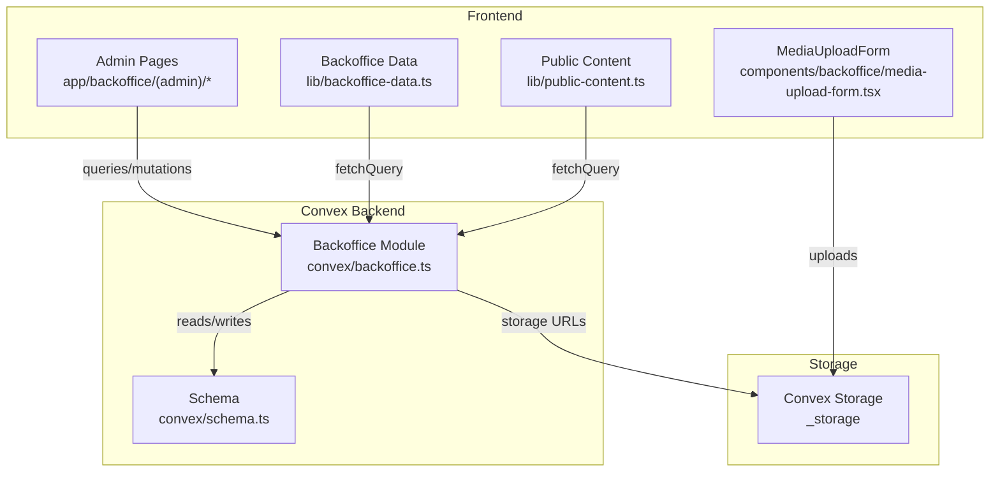
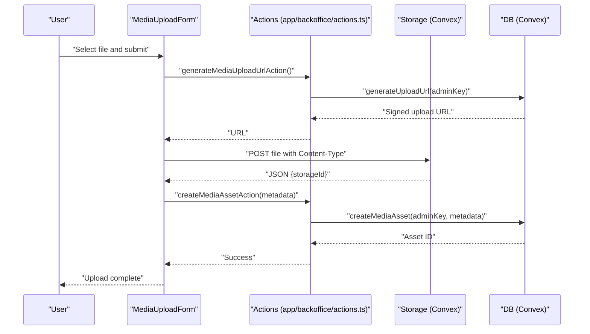
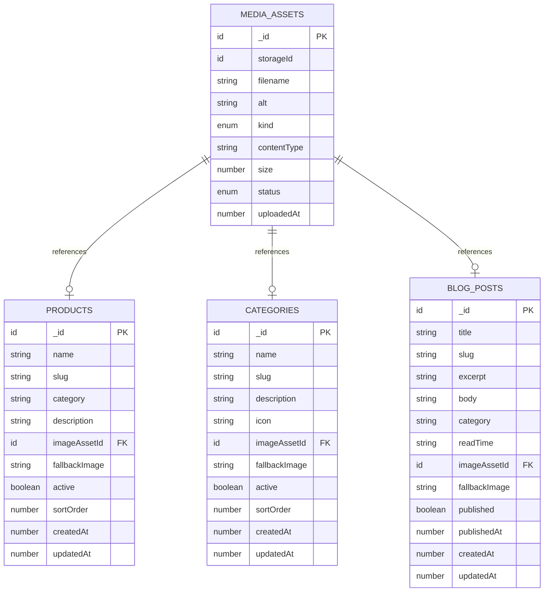
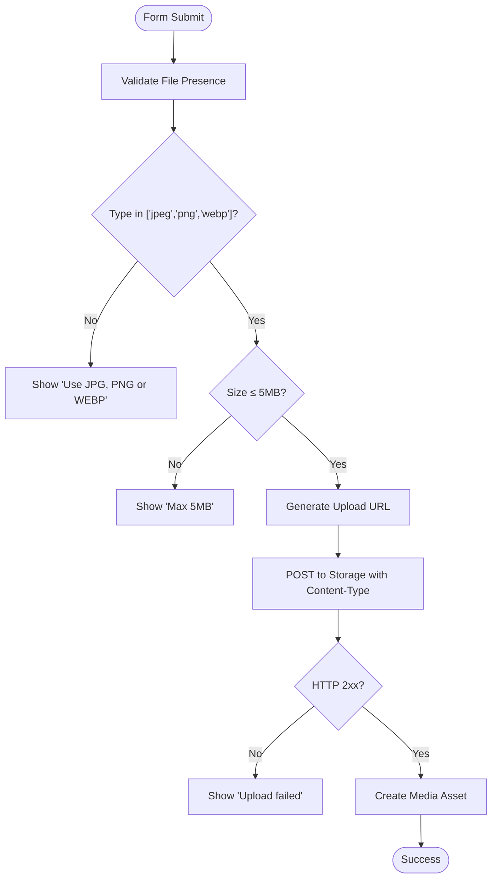
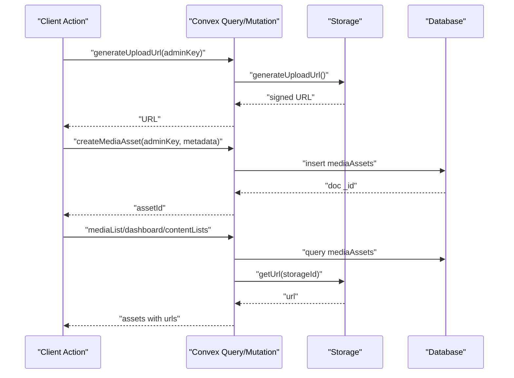
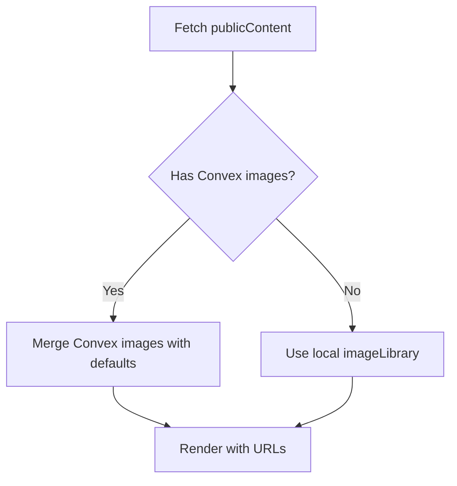
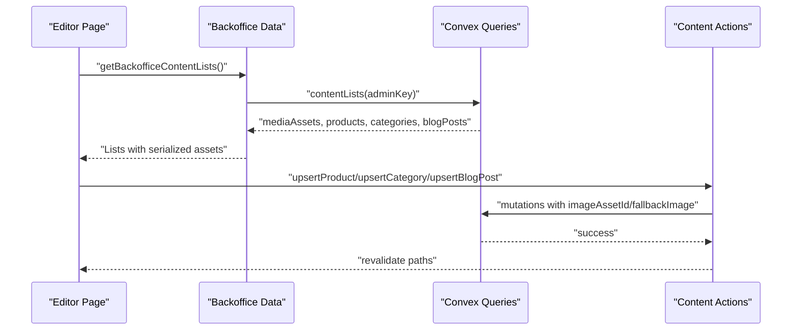
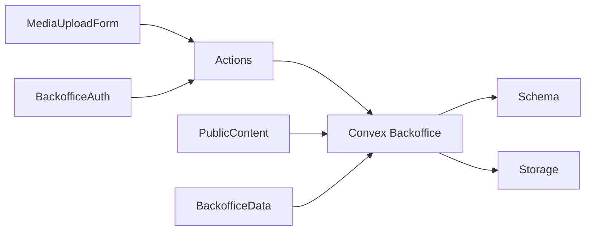

# Media Assets Management

<cite>
**Referenced Files in This Document**
- [schema.ts](file://convex/schema.ts)
- [backoffice.ts](file://convex/backoffice.ts)
- [media-upload-form.tsx](file://components/backoffice/media-upload-form.tsx)
- [actions.ts](file://app/backoffice/actions.ts)
- [media/page.tsx](file://app/backoffice/(admin)/media/page.tsx)
- [produtos/page.tsx](file://app/backoffice/(admin)/produtos/page.tsx)
- [categorias/page.tsx](file://app/backoffice/(admin)/categorias/page.tsx)
- [blog/page.tsx](file://app/backoffice/(admin)/blog/page.tsx)
- [backoffice-data.ts](file://lib/backoffice-data.ts)
- [backoffice-auth.ts](file://lib/backoffice-auth.ts)
- [public-content.ts](file://lib/public-content.ts)
- [site-data.ts](file://lib/site-data.ts)
</cite>

## Table of Contents
1. [Introduction](#introduction)
2. [Project Structure](#project-structure)
3. [Core Components](#core-components)
4. [Architecture Overview](#architecture-overview)
5. [Detailed Component Analysis](#detailed-component-analysis)
6. [Dependency Analysis](#dependency-analysis)
7. [Performance Considerations](#performance-considerations)
8. [Troubleshooting Guide](#troubleshooting-guide)
9. [Conclusion](#conclusion)

## Introduction
This document explains the media assets management system used in the backoffice. It covers the data model for media assets, the upload workflow via the media upload form and Convex storage integration, organization and categorization of assets, fallback mechanisms, validation rules, preview and thumbnail generation, cleanup procedures, and integration with content creation interfaces for products, categories, and blog posts.

## Project Structure
The media management system spans several layers:
- Convex schema defines the media assets and related content tables
- Convex mutations and queries implement CRUD and retrieval logic
- Next.js app routes expose admin pages for media, products, categories, and blog
- Client-side components handle uploads and selection
- Utility libraries manage authentication, data fetching, and public content composition

**Diagram sources**
- [media-upload-form.tsx:1-114](file://components/backoffice/media-upload-form.tsx#L1-L114)
- [actions.ts:79-108](file://app/backoffice/actions.ts#L79-L108)
- [backoffice.ts:68-100](file://convex/backoffice.ts#L68-L100)
- [schema.ts:18-36](file://convex/schema.ts#L18-L36)

**Section sources**
- [schema.ts:18-36](file://convex/schema.ts#L18-L36)
- [backoffice.ts:68-100](file://convex/backoffice.ts#L68-L100)
- [media-upload-form.tsx:14-77](file://components/backoffice/media-upload-form.tsx#L14-L77)
- [actions.ts:79-108](file://app/backoffice/actions.ts#L79-L108)

## Core Components
- Media assets data model: stores storage identifiers, filenames, alt text, kind, content type, size, status, and timestamps
- Upload form: validates file type and size, generates upload URLs, and persists metadata
- Convex mutations: create media assets, archive them, and generate signed upload URLs
- Admin pages: media library, product editor, category editor, and blog post editor
- Public content composition: merges Convex-managed images with local fallbacks

**Section sources**
- [schema.ts:18-36](file://convex/schema.ts#L18-L36)
- [media-upload-form.tsx:11-42](file://components/backoffice/media-upload-form.tsx#L11-L42)
- [backoffice.ts:68-100](file://convex/backoffice.ts#L68-L100)
- [public-content.ts:65-106](file://lib/public-content.ts#L65-L106)

## Architecture Overview
The system integrates client-side uploads with Convex storage and database. The upload flow is:
1. Client requests a signed upload URL from Convex
2. Client uploads the file directly to Convex Storage
3. Client submits metadata to create a media asset record
4. Convex returns the storage URL and persists the asset
5. Content editors select assets or fall back to local images

**Diagram sources**
- [media-upload-form.tsx:19-77](file://components/backoffice/media-upload-form.tsx#L19-L77)
- [actions.ts:79-108](file://app/backoffice/actions.ts#L79-L108)
- [backoffice.ts:68-100](file://convex/backoffice.ts#L68-L100)

## Detailed Component Analysis

### Media Assets Data Model
The media assets table captures:
- storageId: Convex storage identifier
- filename: original file name
- alt: accessible description
- kind: categorization (hero, product, category, blog, logo, general)
- contentType: MIME type
- size: bytes
- status: active/archived
- uploadedAt: timestamp

Related content tables reference assets via optional IDs and maintain fallback image URLs for public rendering.

**Diagram sources**
- [schema.ts:18-36](file://convex/schema.ts#L18-L36)
- [schema.ts:37-48](file://convex/schema.ts#L37-L48)
- [schema.ts:51-62](file://convex/schema.ts#L51-L62)
- [schema.ts:65-78](file://convex/schema.ts#L65-L78)

**Section sources**
- [schema.ts:18-36](file://convex/schema.ts#L18-L36)
- [schema.ts:37-48](file://convex/schema.ts#L37-L48)
- [schema.ts:51-62](file://convex/schema.ts#L51-L62)
- [schema.ts:65-78](file://convex/schema.ts#L65-L78)

### Media Upload Form and Validation
The upload form enforces:
- Allowed types: JPEG, PNG, WebP
- Max size: 5 MB
- Required fields: file, alt (defaults to filename), kind selection
- Client-side feedback and controlled states

On success, it requests a signed upload URL, uploads directly to Convex Storage, and then creates a media asset record with metadata.

**Diagram sources**
- [media-upload-form.tsx:19-77](file://components/backoffice/media-upload-form.tsx#L19-L77)

**Section sources**
- [media-upload-form.tsx:11-42](file://components/backoffice/media-upload-form.tsx#L11-L42)
- [media-upload-form.tsx:47-77](file://components/backoffice/media-upload-form.tsx#L47-L77)

### Convex Storage Integration and Metadata Persistence
Convex mutations:
- generateUploadUrl: returns a signed URL for direct client upload
- createMediaAsset: inserts a media asset with status active and timestamps
- archiveMediaAsset: toggles asset status to archived
- mediaList/dashboard/contentLists: fetch lists with serialized URLs

Serialization attaches storage URLs to assets for rendering.

**Diagram sources**
- [backoffice.ts:68-100](file://convex/backoffice.ts#L68-L100)
- [backoffice.ts:110-118](file://convex/backoffice.ts#L110-L118)
- [backoffice.ts:33-52](file://convex/backoffice.ts#L33-L52)

**Section sources**
- [backoffice.ts:68-100](file://convex/backoffice.ts#L68-L100)
- [backoffice.ts:110-118](file://convex/backoffice.ts#L110-L118)
- [backoffice.ts:33-52](file://convex/backoffice.ts#L33-L52)

### Organization and Categorization
Assets are categorized by kind:
- hero, product, category, blog, logo, general

Queries filter by kind/status combinations to support targeted listings and dashboards.

**Section sources**
- [schema.ts:22-29](file://convex/schema.ts#L22-L29)
- [backoffice.ts:115](file://convex/backoffice.ts#L115)

### Image Fallback Mechanisms and Default Assets
Public content composition merges Convex-managed images with local fallbacks:
- imageLibrary provides default image paths for various contexts
- Products, categories, and blog posts render either Convex URLs or local fallbacks
- Fallbacks are applied when Convex assets are missing or inactive

**Diagram sources**
- [public-content.ts:65-106](file://lib/public-content.ts#L65-L106)
- [site-data.ts:52-70](file://lib/site-data.ts#L52-L70)

**Section sources**
- [public-content.ts:65-106](file://lib/public-content.ts#L65-L106)
- [site-data.ts:52-70](file://lib/site-data.ts#L52-L70)

### Media Asset Validation Rules and File Type Restrictions
Validation enforced by the upload form:
- Content-Type restricted to JPEG, PNG, WebP
- Size capped at 5 MB
- Alt text sanitized and truncated to 180 chars
- Kind constrained to predefined set

**Section sources**
- [media-upload-form.tsx:11-42](file://components/backoffice/media-upload-form.tsx#L11-L42)
- [actions.ts:84-102](file://app/backoffice/actions.ts#L84-L102)

### Preview and Thumbnail Generation
- Assets are rendered in the media library with responsive image previews
- Public content uses Convex URLs for thumbnails and previews
- No explicit server-side thumbnail generation is implemented; client-side sizing and responsive attributes are used

**Section sources**
- [media/page.tsx:40-77](file://app/backoffice/(admin)/media/page.tsx#L40-L77)
- [backoffice.ts:33-52](file://convex/backoffice.ts#L33-L52)

### Cleanup and Orphaned File Management
- Archived assets are excluded from public content and filtered out of active lists
- The system relies on Convex Storage lifecycle policies; no explicit cleanup job is present in the codebase
- Revalidation ensures UI updates after archival

**Section sources**
- [backoffice.ts:102-108](file://convex/backoffice.ts#L102-L108)
- [actions.ts:110-117](file://app/backoffice/actions.ts#L110-L117)

### Integration with Content Creation Interfaces
- Products, categories, and blog posts support selecting Convex assets via dropdowns
- When an asset is selected, its URL is attached to the content record
- Fallback image URLs can be provided per content type for scenarios without Convex assets

**Diagram sources**
- [produtos/page.tsx:82-132](file://app/backoffice/(admin)/produtos/page.tsx#L82-L132)
- [categorias/page.tsx:89-139](file://app/backoffice/(admin)/categorias/page.tsx#L89-L139)
- [blog/page.tsx:98-148](file://app/backoffice/(admin)/blog/page.tsx#L98-L148)
- [backoffice-data.ts:6-20](file://lib/backoffice-data.ts#L6-L20)
- [actions.ts:130-199](file://app/backoffice/actions.ts#L130-L199)

**Section sources**
- [produtos/page.tsx:9-28](file://app/backoffice/(admin)/produtos/page.tsx#L9-L28)
- [categorias/page.tsx:11-30](file://app/backoffice/(admin)/categorias/page.tsx#L11-L30)
- [blog/page.tsx:15-34](file://app/backoffice/(admin)/blog/page.tsx#L15-L34)
- [actions.ts:130-199](file://app/backoffice/actions.ts#L130-L199)

## Dependency Analysis
The system exhibits clear separation of concerns:
- Frontend components depend on Convex actions and queries
- Convex module depends on schema definitions and storage APIs
- Authentication middleware protects admin endpoints
- Public content composition merges Convex and local data

**Diagram sources**
- [media-upload-form.tsx:7](file://components/backoffice/media-upload-form.tsx#L7)
- [actions.ts:3-14](file://app/backoffice/actions.ts#L3-L14)
- [backoffice.ts:1-6](file://convex/backoffice.ts#L1-L6)
- [schema.ts:1-2](file://convex/schema.ts#L1-L2)
- [public-content.ts:11-14](file://lib/public-content.ts#L11-L14)
- [backoffice-data.ts:3-4](file://lib/backoffice-data.ts#L3-L4)
- [backoffice-auth.ts:120-128](file://lib/backoffice-auth.ts#L120-L128)

**Section sources**
- [actions.ts:3-14](file://app/backoffice/actions.ts#L3-L14)
- [backoffice.ts:1-6](file://convex/backoffice.ts#L1-L6)
- [public-content.ts:11-14](file://lib/public-content.ts#L11-L14)
- [backoffice-data.ts:3-4](file://lib/backoffice-data.ts#L3-L4)
- [backoffice-auth.ts:120-128](file://lib/backoffice-auth.ts#L120-L128)

## Performance Considerations
- Direct-to-storage uploads reduce server bandwidth and latency
- Indexes on mediaAssets enable efficient filtering by kind/status and sorting by upload time
- Public content composition serializes assets with URLs in batches to minimize round trips
- Consider adding storage-level CDN caching for frequently accessed images

## Troubleshooting Guide
Common issues and resolutions:
- Unauthorized access: Verify BACKOFFICE_API_KEY and session cookie validity
- Upload failures: Confirm signed URL generation succeeded and file meets type/size constraints
- Missing images in public content: Check asset status is active and storage URL is accessible
- Revalidation not updating UI: Ensure revalidatePath is called after mutations

**Section sources**
- [backoffice-auth.ts:120-128](file://lib/backoffice-auth.ts#L120-L128)
- [actions.ts:79-108](file://app/backoffice/actions.ts#L79-L108)
- [backoffice.ts:33-52](file://convex/backoffice.ts#L33-L52)
- [actions.ts:104-107](file://app/backoffice/actions.ts#L104-L107)

## Conclusion
The media assets management system provides a robust, scalable solution for uploading, organizing, and serving images across products, categories, and blog posts. By leveraging Convex Storage and a typed schema, it ensures data integrity and efficient retrieval. The fallback mechanism guarantees resilience against missing assets, while the admin interfaces streamline content creation and maintenance.