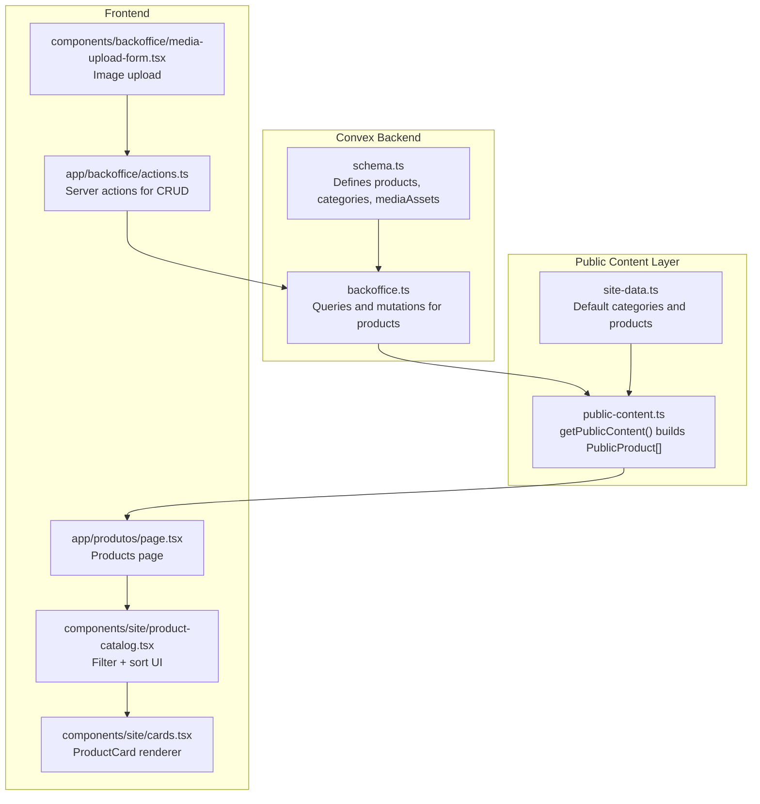
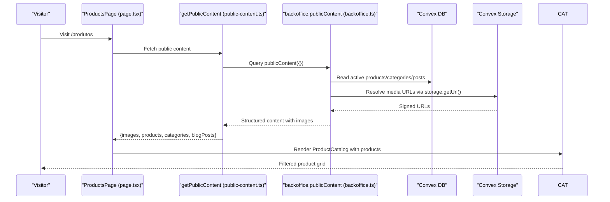
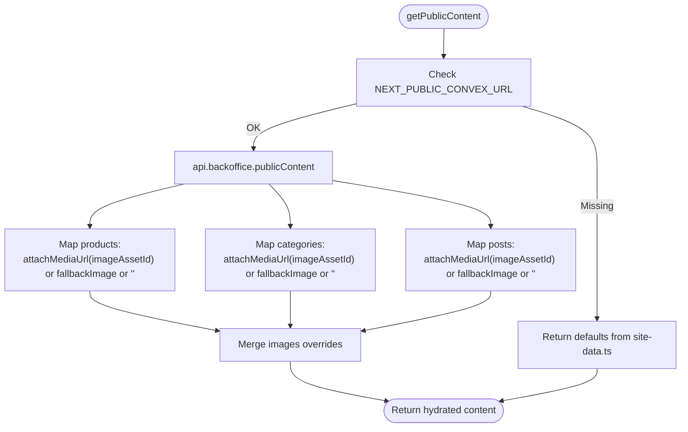
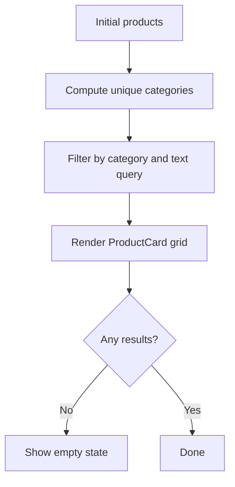
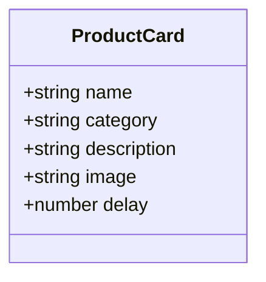
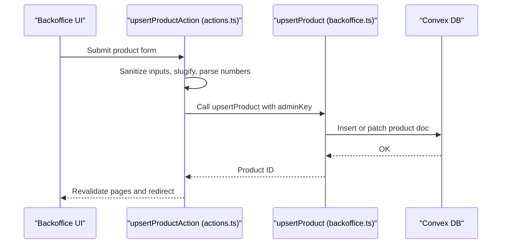
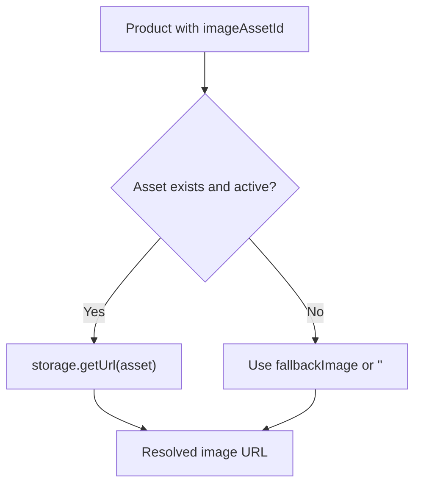
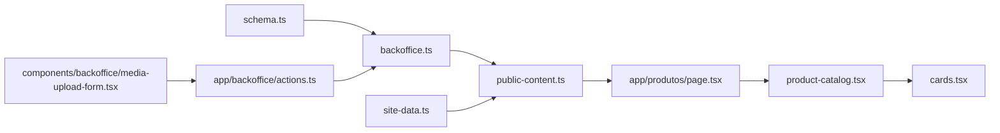

# Product Management System

<cite>
**Referenced Files in This Document**
- [schema.ts](file://convex/schema.ts)
- [backoffice.ts](file://convex/backoffice.ts)
- [public-content.ts](file://lib/public-content.ts)
- [site-data.ts](file://lib/site-data.ts)
- [product-catalog.tsx](file://components/site/product-catalog.tsx)
- [cards.tsx](file://components/site/cards.tsx)
- [actions.ts](file://app/backoffice/actions.ts)
- [media-upload-form.tsx](file://components/backoffice/media-upload-form.tsx)
- [page.tsx](file://app/produtos/page.tsx)
</cite>

## Table of Contents
1. [Introduction](#introduction)
2. [Project Structure](#project-structure)
3. [Core Components](#core-components)
4. [Architecture Overview](#architecture-overview)
5. [Detailed Component Analysis](#detailed-component-analysis)
6. [Dependency Analysis](#dependency-analysis)
7. [Performance Considerations](#performance-considerations)
8. [Troubleshooting Guide](#troubleshooting-guide)
9. [Conclusion](#conclusion)
10. [Appendices](#appendices)

## Introduction
This document describes the product management system for a B2B office supplies platform. It covers the product data model, the public product catalog UI with filtering and sorting, the backoffice workflows for creating, editing, and deleting products, the image association and fallback mechanism, category relationships, validation and sanitization, search and filtering, and the integration with the public content delivery pipeline.

## Project Structure
The product management system spans three layers:
- Data model and APIs: Convex schema and backoffice queries/mutations
- Public content delivery: Public-facing content hydration and image resolution
- Frontend UI: Product catalog rendering and product card presentation



**Diagram sources**
- [schema.ts:37-48](file://convex/schema.ts#L37-L48)
- [backoffice.ts:186-221](file://convex/backoffice.ts#L186-L221)
- [public-content.ts:65-106](file://lib/public-content.ts#L65-L106)
- [site-data.ts:72-174](file://lib/site-data.ts#L72-L174)
- [page.tsx:17-42](file://app/produtos/page.tsx#L17-L42)
- [product-catalog.tsx:12-78](file://components/site/product-catalog.tsx#L12-L78)
- [cards.tsx:57-88](file://components/site/cards.tsx#L57-L88)
- [media-upload-form.tsx:14-113](file://components/backoffice/media-upload-form.tsx#L14-L113)
- [actions.ts:130-151](file://app/backoffice/actions.ts#L130-L151)

**Section sources**
- [schema.ts:37-48](file://convex/schema.ts#L37-L48)
- [backoffice.ts:186-221](file://convex/backoffice.ts#L186-L221)
- [public-content.ts:65-106](file://lib/public-content.ts#L65-L106)
- [site-data.ts:72-174](file://lib/site-data.ts#L72-L174)
- [page.tsx:17-42](file://app/produtos/page.tsx#L17-L42)
- [product-catalog.tsx:12-78](file://components/site/product-catalog.tsx#L12-L78)
- [cards.tsx:57-88](file://components/site/cards.tsx#L57-L88)
- [media-upload-form.tsx:14-113](file://components/backoffice/media-upload-form.tsx#L14-L113)
- [actions.ts:130-151](file://app/backoffice/actions.ts#L130-L151)

## Core Components
- Product data model: name, slug, category, description, optional image asset, optional fallback image, active flag, sort order, timestamps
- Public product type: id, name, category, description, image URL
- Backoffice product mutation: upsertProduct with sanitization and slug generation
- Public content hydration: resolves media URLs and applies fallbacks
- Catalog UI: category filter and text search over name, category, description
- Product card: renders product image, category badge, and a “request quote” action

**Section sources**
- [schema.ts:37-48](file://convex/schema.ts#L37-L48)
- [public-content.ts:26-32](file://lib/public-content.ts#L26-L32)
- [backoffice.ts:186-221](file://convex/backoffice.ts#L186-L221)
- [public-content.ts:75-81](file://lib/public-content.ts#L75-L81)
- [product-catalog.tsx:20-26](file://components/site/product-catalog.tsx#L20-L26)
- [cards.tsx:57-88](file://components/site/cards.tsx#L57-L88)

## Architecture Overview
The system integrates a typed Convex schema with server-side queries and mutations, a public content resolver that merges database records with stored media URLs and fallbacks, and a Next.js page that renders a searchable, filterable catalog.



**Diagram sources**
- [page.tsx:17-42](file://app/produtos/page.tsx#L17-L42)
- [public-content.ts:65-106](file://lib/public-content.ts#L65-L106)
- [backoffice.ts:319-384](file://convex/backoffice.ts#L319-L384)

## Detailed Component Analysis

### Product Data Model
- Fields: name, slug, category, description, imageAssetId (optional), fallbackImage (optional), active, sortOrder, createdAt, updatedAt
- Indexes: by_active_and_sort_order, by_slug
- Validation: enforced by Convex schema types and mutation arguments

```mermaid
erDiagram
PRODUCTS {
string _id
string name
string slug
string category
string description
id mediaAssets imageAssetId
string fallbackImage
boolean active
number sortOrder
number createdAt
number updatedAt
}
MEDIAASSETS {
id _id
id _storage storageId
string filename
string alt
string contentType
number size
string status
number uploadedAt
}
PRODUCTS ||--|| MEDIAASSETS : "imageAssetId -> mediaAssets"
```

**Diagram sources**
- [schema.ts:37-48](file://convex/schema.ts#L37-L48)
- [schema.ts:18-36](file://convex/schema.ts#L18-L36)

**Section sources**
- [schema.ts:37-48](file://convex/schema.ts#L37-L48)

### Public Content Delivery and Image Resolution
- The public content resolver:
  - Queries active products, categories, published posts, and active media assets
  - Resolves signed URLs via Convex storage
  - Applies fallback images when media is missing or inactive
  - Normalizes product/category IDs to slugs for public exposure



**Diagram sources**
- [public-content.ts:65-106](file://lib/public-content.ts#L65-L106)
- [backoffice.ts:319-384](file://convex/backoffice.ts#L319-L384)
- [backoffice.ts:33-45](file://convex/backoffice.ts#L33-L45)

**Section sources**
- [public-content.ts:65-106](file://lib/public-content.ts#L65-L106)
- [backoffice.ts:319-384](file://convex/backoffice.ts#L319-L384)

### Product Catalog UI: Filtering and Sorting
- Filtering:
  - Category filter: “All” plus unique categories extracted from initialProducts
  - Text search: matches across name, category, and description
- Sorting:
  - Controlled by sortOrder and active flag (DB index by_active_and_sort_order)
- Rendering:
  - Grid of ProductCard components with lazy image loading and category badges



**Diagram sources**
- [product-catalog.tsx:12-78](file://components/site/product-catalog.tsx#L12-L78)

**Section sources**
- [product-catalog.tsx:12-78](file://components/site/product-catalog.tsx#L12-L78)

### Product Card Component
- Displays product image, category badge, name, description, and a “request quote” link
- Uses responsive image sizing and hover effects
- Opens a pre-filled WhatsApp message with product name



**Diagram sources**
- [cards.tsx:49-88](file://components/site/cards.tsx#L49-L88)

**Section sources**
- [cards.tsx:57-88](file://components/site/cards.tsx#L57-L88)

### Backoffice Workflows: Create, Edit, Delete Products
- Authentication:
  - Admin key verification in backoffice module and server actions
- Creation and updates:
  - upsertProduct mutation accepts sanitized inputs and optional IDs
  - slug generation via a slugify function
- Deletion:
  - Not exposed as a dedicated mutation; archive/delete would require adding a mutation in the backoffice module
- Server actions:
  - upsertProductAction validates and normalizes form data, triggers mutation, and revalidates routes



**Diagram sources**
- [actions.ts:130-151](file://app/backoffice/actions.ts#L130-L151)
- [backoffice.ts:186-221](file://convex/backoffice.ts#L186-L221)

**Section sources**
- [actions.ts:130-151](file://app/backoffice/actions.ts#L130-L151)
- [backoffice.ts:186-221](file://convex/backoffice.ts#L186-L221)

### Product-Image Association and Fallback Mechanisms
- Association:
  - Products reference mediaAssets via imageAssetId
  - attachMediaUrl resolves a signed URL if the asset exists and is active
- Fallback:
  - If no asset or URL resolution fails, the product’s fallbackImage is used
  - If both fail, the image field is an empty string
- Media upload:
  - MediaUploadForm enforces file type and size limits
  - Generates an upload URL and persists metadata via createMediaAssetAction



**Diagram sources**
- [backoffice.ts:33-45](file://convex/backoffice.ts#L33-L45)
- [public-content.ts:75-81](file://lib/public-content.ts#L75-L81)
- [media-upload-form.tsx:14-113](file://components/backoffice/media-upload-form.tsx#L14-L113)

**Section sources**
- [backoffice.ts:33-45](file://convex/backoffice.ts#L33-L45)
- [public-content.ts:75-81](file://lib/public-content.ts#L75-L81)
- [media-upload-form.tsx:14-113](file://components/backoffice/media-upload-form.tsx#L14-L113)

### Categories and Their Influence on Organization
- Categories are stored with name, slug, description, icon, optional image asset, fallback image, active flag, and sort order
- Products reference category by name; the catalog filters by category
- Default categories are provided for display when public content is unavailable

```mermaid
erDiagram
CATEGORIES {
string _id
string name
string slug
string description
string icon
id mediaAssets imageAssetId
string fallbackImage
boolean active
number sortOrder
number createdAt
number updatedAt
}
PRODUCTS }o--|| CATEGORIES : "category -> name"
```

**Diagram sources**
- [schema.ts:51-62](file://convex/schema.ts#L51-L62)
- [schema.ts:37-48](file://convex/schema.ts#L37-L48)

**Section sources**
- [schema.ts:51-62](file://convex/schema.ts#L51-L62)
- [schema.ts:37-48](file://convex/schema.ts#L37-L48)
- [site-data.ts:72-115](file://lib/site-data.ts#L72-L115)

### Validation and Sanitization Processes
- Inputs sanitized in server actions:
  - Strings trimmed and optionally limited in length
  - Numbers parsed with fallbacks; timestamps normalized
  - Boolean flags derived from form presence
- Slug generation:
  - Unicode normalization, lowercase, hyphen replacement, trimming, max length
- Media uploads:
  - Allowed types and size checked before upload
  - Filename and alt truncated to safe lengths

**Section sources**
- [actions.ts:16-51](file://app/backoffice/actions.ts#L16-L51)
- [actions.ts:53-61](file://app/backoffice/actions.ts#L53-L61)
- [media-upload-form.tsx:11-42](file://components/backoffice/media-upload-form.tsx#L11-L42)

### Product Search and Filtering Options
- Text search:
  - Case-insensitive substring match across name, category, and description
- Category filter:
  - Single-select toggle with “All” option
- Sorting:
  - Controlled by active flag and sortOrder index; public content returns sorted lists

**Section sources**
- [product-catalog.tsx:20-26](file://components/site/product-catalog.tsx#L20-L26)
- [backoffice.ts:322-327](file://convex/backoffice.ts#L322-L327)

### Example Data Structures and Usage Patterns
- PublicProduct:
  - Fields: id, name, category, description, image
  - Constructed from database product with resolved image URL or fallback
- Default product example:
  - id, name, category, description, image from site-data.ts
- Usage pattern:
  - ProductsPage hydrates content and passes products to ProductCatalog
  - ProductCatalog computes categories and filters products
  - ProductCard renders each product with a “request quote” action

**Section sources**
- [public-content.ts:26-32](file://lib/public-content.ts#L26-L32)
- [site-data.ts:117-174](file://lib/site-data.ts#L117-L174)
- [page.tsx:17-42](file://app/produtos/page.tsx#L17-L42)
- [product-catalog.tsx:12-78](file://components/site/product-catalog.tsx#L12-L78)
- [cards.tsx:57-88](file://components/site/cards.tsx#L57-L88)

## Dependency Analysis
- Convex schema defines the canonical product model and media assets
- Backoffice module exposes typed queries/mutations for CRUD and public content assembly
- Public content resolver depends on Convex storage for signed URLs
- Frontend pages depend on public content for rendering
- Backoffice actions depend on Convex mutations and session management



**Diagram sources**
- [schema.ts:37-48](file://convex/schema.ts#L37-L48)
- [backoffice.ts:186-221](file://convex/backoffice.ts#L186-L221)
- [public-content.ts:65-106](file://lib/public-content.ts#L65-L106)
- [site-data.ts:72-174](file://lib/site-data.ts#L72-L174)
- [page.tsx:17-42](file://app/produtos/page.tsx#L17-L42)
- [product-catalog.tsx:12-78](file://components/site/product-catalog.tsx#L12-L78)
- [cards.tsx:57-88](file://components/site/cards.tsx#L57-L88)
- [actions.ts:130-151](file://app/backoffice/actions.ts#L130-L151)
- [media-upload-form.tsx:14-113](file://components/backoffice/media-upload-form.tsx#L14-L113)

**Section sources**
- [schema.ts:37-48](file://convex/schema.ts#L37-L48)
- [backoffice.ts:186-221](file://convex/backoffice.ts#L186-L221)
- [public-content.ts:65-106](file://lib/public-content.ts#L65-L106)
- [site-data.ts:72-174](file://lib/site-data.ts#L72-L174)
- [page.tsx:17-42](file://app/produtos/page.tsx#L17-L42)
- [product-catalog.tsx:12-78](file://components/site/product-catalog.tsx#L12-L78)
- [cards.tsx:57-88](file://components/site/cards.tsx#L57-L88)
- [actions.ts:130-151](file://app/backoffice/actions.ts#L130-L151)
- [media-upload-form.tsx:14-113](file://components/backoffice/media-upload-form.tsx#L14-L113)

## Performance Considerations
- Index usage:
  - Products and categories indexed by active flag and sort order for efficient retrieval
- Pagination limit:
  - MAX_ITEMS cap prevents unbounded queries
- Image resolution:
  - Signed URLs are generated per asset; caching at CDN level recommended
- Hydration:
  - Public content is fetched per page load with revalidation window configured

[No sources needed since this section provides general guidance]

## Troubleshooting Guide
- Unauthorized requests:
  - Admin key mismatch triggers an unauthorized error in backoffice module
- Missing or inactive media:
  - attachMediaUrl returns null for missing/inactive assets; public content falls back to fallbackImage or empty string
- Upload failures:
  - MediaUploadForm validates file type and size; errors surface to the user
- Slug conflicts:
  - Ensure unique slugs; slugify normalizes input and truncates to safe length

**Section sources**
- [backoffice.ts:25-31](file://convex/backoffice.ts#L25-L31)
- [backoffice.ts:33-45](file://convex/backoffice.ts#L33-L45)
- [media-upload-form.tsx:26-42](file://components/backoffice/media-upload-form.tsx#L26-L42)
- [actions.ts:53-61](file://app/backoffice/actions.ts#L53-L61)

## Conclusion
The product management system combines a robust Convex schema with a flexible public content pipeline and a clean UI. Products are modeled with strong typing, validated in server actions, and rendered with resilient image fallbacks. The catalog supports intuitive filtering and search, while backoffice workflows enable safe creation and updates. Extending deletion or bulk operations would involve adding corresponding mutations and actions.

## Appendices
- Product creation/editing flow references:
  - [upsertProductAction:130-151](file://app/backoffice/actions.ts#L130-L151)
  - [upsertProduct mutation:186-221](file://convex/backoffice.ts#L186-L221)
- Public content hydration references:
  - [getPublicContent:65-106](file://lib/public-content.ts#L65-L106)
  - [publicContent query:319-384](file://convex/backoffice.ts#L319-L384)
- Catalog rendering references:
  - [ProductCatalog:12-78](file://components/site/product-catalog.tsx#L12-L78)
  - [ProductCard:57-88](file://components/site/cards.tsx#L57-88)
- Media upload references:
  - [MediaUploadForm:14-113](file://components/backoffice/media-upload-form.tsx#L14-113)