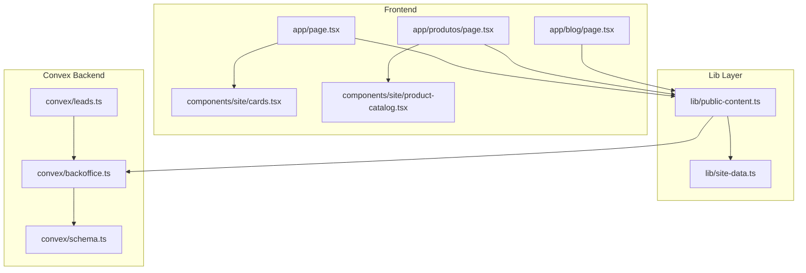
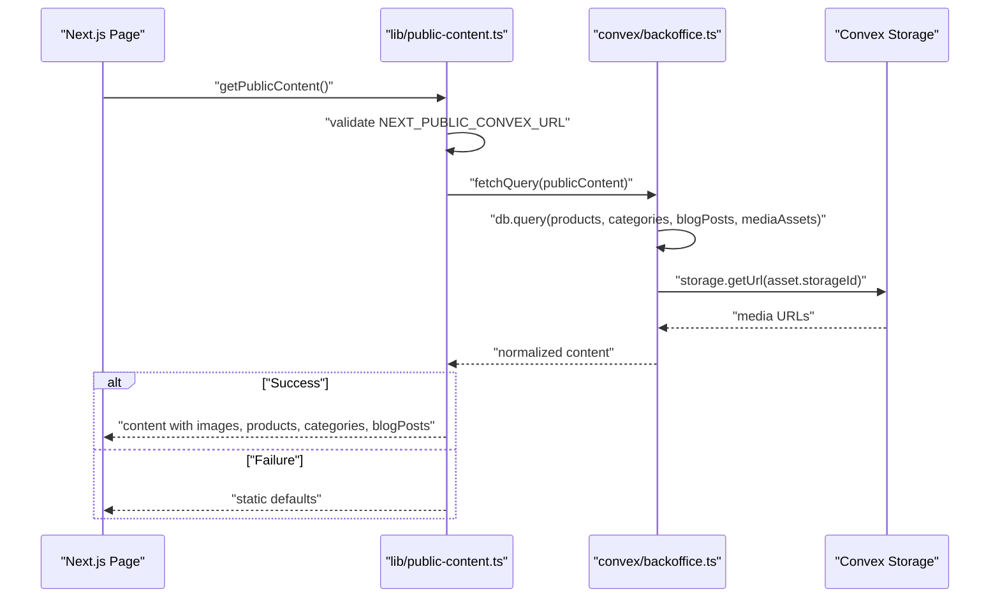
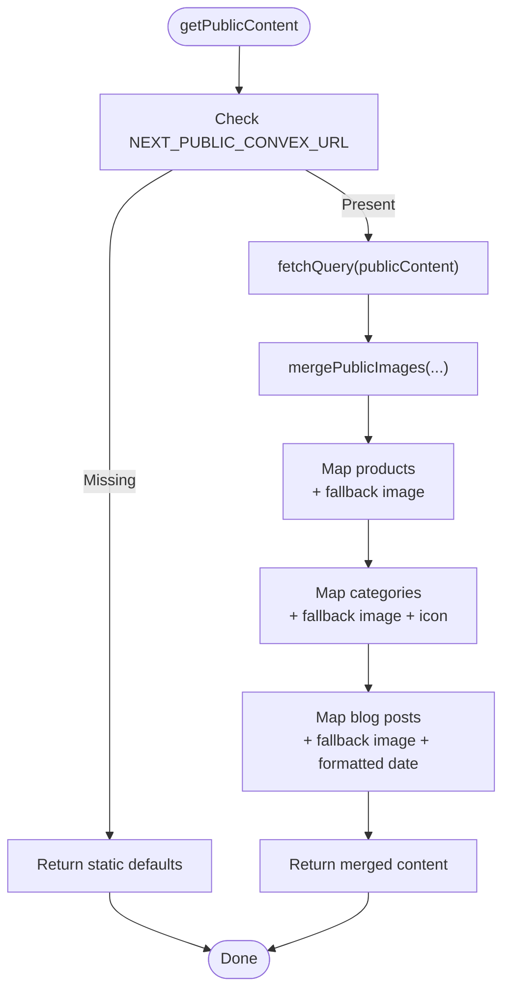
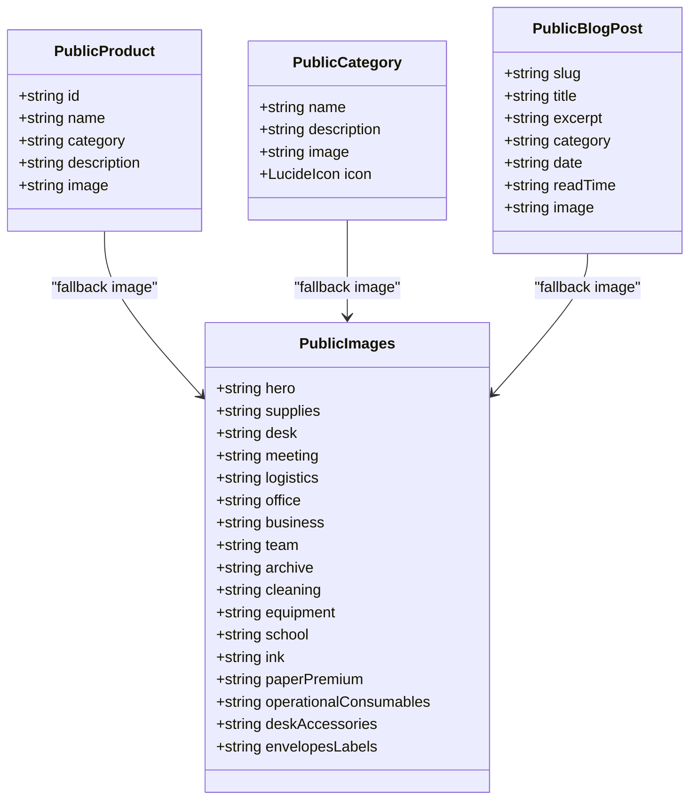
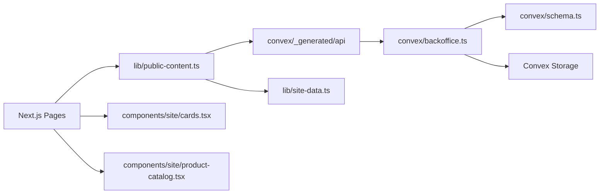

# Public Content Delivery

<cite>
**Referenced Files in This Document**
- [public-content.ts](file://lib/public-content.ts)
- [site-data.ts](file://lib/site-data.ts)
- [schema.ts](file://convex/schema.ts)
- [backoffice.ts](file://convex/backoffice.ts)
- [page.tsx](file://app/page.tsx)
- [cards.tsx](file://components/site/cards.tsx)
- [product-catalog.tsx](file://components/site/product-catalog.tsx)
- [page.tsx](file://app/produtos/page.tsx)
- [page.tsx](file://app/blog/page.tsx)
- [CONVEX.md](file://docs/CONVEX.md)
- [BACKOFFICE.md](file://docs/BACKOFFICE.md)
- [backoffice-data.ts](file://lib/backoffice-data.ts)
- [backoffice-auth.ts](file://lib/backoffice-auth.ts)
- [leads.ts](file://convex/leads.ts)
- [package.json](file://package.json)
</cite>

## Table of Contents
1. [Introduction](#introduction)
2. [Project Structure](#project-structure)
3. [Core Components](#core-components)
4. [Architecture Overview](#architecture-overview)
5. [Detailed Component Analysis](#detailed-component-analysis)
6. [Dependency Analysis](#dependency-analysis)
7. [Performance Considerations](#performance-considerations)
8. [Troubleshooting Guide](#troubleshooting-guide)
9. [Conclusion](#conclusion)
10. [Appendices](#appendices)

## Introduction
This document explains the public content delivery system that powers the marketing-facing pages of the website. It focuses on how dynamic content is fetched from the Convex database using the fetchQuery function, how content models are shaped for the frontend, and how fallbacks are applied when the backend is unavailable. It also documents the content merging process for images, the icon mapping system for categories, error handling strategies, content validation, caching considerations, and the integration between Convex backend services and Next.js frontend components.

## Project Structure
The content delivery pipeline spans three layers:
- Frontend pages and components render public content.
- A library module orchestrates content retrieval and transforms it into a stable shape for the UI.
- Convex defines the data model and exposes a public read-only query that aggregates content and attaches media URLs.

**Diagram sources**
- [page.tsx](file://app/page.tsx)
- [page.tsx](file://app/produtos/page.tsx)
- [page.tsx](file://app/blog/page.tsx)
- [cards.tsx](file://components/site/cards.tsx)
- [product-catalog.tsx](file://components/site/product-catalog.tsx)
- [public-content.ts](file://lib/public-content.ts)
- [site-data.ts](file://lib/site-data.ts)
- [schema.ts](file://convex/schema.ts)
- [backoffice.ts](file://convex/backoffice.ts)
- [leads.ts](file://convex/leads.ts)

**Section sources**
- [public-content.ts](file://lib/public-content.ts)
- [site-data.ts](file://lib/site-data.ts)
- [schema.ts](file://convex/schema.ts)
- [backoffice.ts](file://convex/backoffice.ts)
- [page.tsx](file://app/page.tsx)
- [page.tsx](file://app/produtos/page.tsx)
- [page.tsx](file://app/blog/page.tsx)
- [cards.tsx](file://components/site/cards.tsx)
- [product-catalog.tsx](file://components/site/product-catalog.tsx)
- [leads.ts](file://convex/leads.ts)

## Core Components
- Public content retrieval and transformation:
  - Orchestrated by a single async function that calls a Convex query and merges results with static defaults.
  - Applies fallbacks for images, icons, and empty lists.
- Static content library:
  - Provides default categories, products, blog posts, and image placeholders.
- Convex schema and public query:
  - Defines tables for products, categories, blog posts, media assets, and leads.
  - Exposes a public read-only query that returns merged, transformed content and attached media URLs.

Key responsibilities:
- Fetch dynamic content from Convex.
- Merge with static defaults when backend is down or returns empty arrays.
- Attach media URLs from Convex Storage and compute derived fields (e.g., formatted dates).
- Provide stable TypeScript types for frontend components.

**Section sources**
- [public-content.ts](file://lib/public-content.ts)
- [site-data.ts](file://lib/site-data.ts)
- [schema.ts](file://convex/schema.ts)
- [backoffice.ts](file://convex/backoffice.ts)

## Architecture Overview
The public content delivery follows a predictable flow: pages call a library function to fetch content, which in turn queries Convex. Convex resolves media URLs from storage and returns a normalized dataset. On failure, the library falls back to static defaults.

**Diagram sources**
- [public-content.ts](file://lib/public-content.ts)
- [backoffice.ts](file://convex/backoffice.ts)

**Section sources**
- [public-content.ts](file://lib/public-content.ts)
- [backoffice.ts](file://convex/backoffice.ts)

## Detailed Component Analysis

### Public Content Retrieval and Transformation
- Purpose: Centralized function to fetch and transform public content for the marketing site.
- Key behaviors:
  - Validates environment configuration for Convex.
  - Calls the public Convex query to retrieve active products, categories, published blog posts, and active media assets.
  - Merges images using a static library and a per-key override mechanism.
  - Applies fallbacks for missing images and icons.
  - Returns stable types consumed by pages and components.

**Diagram sources**
- [public-content.ts](file://lib/public-content.ts)

**Section sources**
- [public-content.ts](file://lib/public-content.ts)

### Data Models and Transformations
- Products:
  - Dynamic fields: name, slug, category, description, image.
  - Fallback: If no dynamic image, use the first static product’s image.
- Categories:
  - Dynamic fields: name, description, icon, image.
  - Fallback: If no dynamic image, use the static image library for the category key.
  - Icon mapping: The dynamic icon string is resolved to a Lucide icon component via a mapping table.
- Blog posts:
  - Dynamic fields: slug, title, excerpt, category, date, readTime, image.
  - Fallback: If no dynamic image, use the first static blog post’s image.
  - Date formatting: Published timestamps are formatted to a locale-specific string.
- Images:
  - A static image library provides default paths.
  - The public query maps specific filenames to active media URLs; overrides are merged into the final image set.

**Diagram sources**
- [public-content.ts](file://lib/public-content.ts)
- [site-data.ts](file://lib/site-data.ts)

**Section sources**
- [public-content.ts](file://lib/public-content.ts)
- [site-data.ts](file://lib/site-data.ts)

### Icon Mapping System for Categories
- The dynamic category icon is a string stored in Convex.
- The mapping converts the string to a Lucide icon component.
- If the mapping does not resolve, a default icon is used.

Implementation highlights:
- A record maps icon identifiers to Lucide components.
- During transformation, the dynamic icon is resolved or defaulted.

**Section sources**
- [public-content.ts](file://lib/public-content.ts)

### Content Merging for Images
- The public query returns a keyed object of image URLs mapped from active media assets.
- The library merges these with the static image library, overriding only keys present in the dynamic result.
- This ensures that only explicitly managed images are overridden while others remain static.

**Section sources**
- [public-content.ts](file://lib/public-content.ts)

### Fallback Mechanisms and Static Backup
- If Convex is unavailable or misconfigured, the function returns static defaults:
  - Images from the static library.
  - Static categories, products, and blog posts.
- This guarantees the site remains functional even during backend outages.

**Section sources**
- [public-content.ts](file://lib/public-content.ts)
- [site-data.ts](file://lib/site-data.ts)

### Error Handling Strategies
- Environment validation:
  - The retrieval function checks for the presence of the Convex URL environment variable.
- Try/catch around the fetch:
  - On any error, the function returns static defaults.
- Convex-side protections:
  - Media assets are filtered by status and attached only when active.
  - Queries enforce pagination limits to avoid heavy loads.

**Section sources**
- [public-content.ts](file://lib/public-content.ts)
- [backoffice.ts](file://convex/backoffice.ts)

### Content Validation Processes
- Convex schema enforces data types and indices for robust queries.
- Media kinds and lead statuses are constrained to predefined sets.
- Public content query filters only active/published items and orders them deterministically.

**Section sources**
- [schema.ts](file://convex/schema.ts)
- [backoffice.ts](file://convex/backoffice.ts)

### Practical Examples of Content Retrieval Patterns
- Home page:
  - Retrieves images, categories, products, and blog posts.
  - Renders hero imagery, category cards, product highlights, and blog previews.
- Products page:
  - Uses the same content but renders a searchable catalog with client-side filtering.
- Blog page:
  - Displays a featured post and a grid of posts, leveraging the normalized fields.

**Section sources**
- [page.tsx](file://app/page.tsx)
- [page.tsx](file://app/produtos/page.tsx)
- [page.tsx](file://app/blog/page.tsx)
- [cards.tsx](file://components/site/cards.tsx)
- [product-catalog.tsx](file://components/site/product-catalog.tsx)

### Caching Considerations
- Pages opt into incremental static regeneration via a revalidation interval.
- This allows content to refresh periodically without sacrificing performance.
- For high-traffic scenarios, consider CDN caching and edge caching strategies aligned with the revalidation cadence.

**Section sources**
- [page.tsx](file://app/page.tsx)
- [page.tsx](file://app/produtos/page.tsx)
- [page.tsx](file://app/blog/page.tsx)

### Integration Between Convex Backend Services and Frontend Components
- Convex functions:
  - Public read-only query aggregates content and attaches media URLs.
  - Admin functions manage media, products, categories, and blog posts.
- Frontend:
  - Pages call the public content function and pass normalized props to components.
  - Components render images, links, and interactive elements using the provided data.

**Section sources**
- [backoffice.ts](file://convex/backoffice.ts)
- [page.tsx](file://app/page.tsx)
- [page.tsx](file://app/produtos/page.tsx)
- [page.tsx](file://app/blog/page.tsx)
- [cards.tsx](file://components/site/cards.tsx)
- [product-catalog.tsx](file://components/site/product-catalog.tsx)

## Dependency Analysis
- Runtime dependencies:
  - Next.js for SSR/SSG and routing.
  - Convex SDK for server-side queries.
  - Tailwind CSS and UI primitives for rendering.
- Internal dependencies:
  - Public content library depends on Convex-generated API types and the static data library.
  - Pages depend on the public content library and UI components.

**Diagram sources**
- [public-content.ts](file://lib/public-content.ts)
- [site-data.ts](file://lib/site-data.ts)
- [backoffice.ts](file://convex/backoffice.ts)
- [schema.ts](file://convex/schema.ts)
- [page.tsx](file://app/page.tsx)
- [cards.tsx](file://components/site/cards.tsx)
- [product-catalog.tsx](file://components/site/product-catalog.tsx)

**Section sources**
- [package.json](file://package.json)
- [public-content.ts](file://lib/public-content.ts)
- [backoffice.ts](file://convex/backoffice.ts)
- [schema.ts](file://convex/schema.ts)
- [page.tsx](file://app/page.tsx)

## Performance Considerations
- Use the built-in revalidation intervals to balance freshness and performance.
- Keep media assets optimized and leverage Convex Storage URLs for efficient delivery.
- Limit returned item counts in queries to prevent heavy payloads.
- Consider client-side filtering only on small datasets to avoid heavy computations on the server.

[No sources needed since this section provides general guidance]

## Troubleshooting Guide
Common issues and remedies:
- Convex URL not configured:
  - Symptom: Fallback to static content.
  - Action: Set the environment variable and redeploy.
- Missing or inactive media:
  - Symptom: Empty or placeholder images.
  - Action: Verify media status and filenames; ensure assets are active.
- Icon not rendering:
  - Symptom: Default icon shown instead of category icon.
  - Action: Confirm the icon identifier matches the mapping.
- Content not updating:
  - Symptom: Stale content despite backend updates.
  - Action: Adjust revalidation interval or trigger regeneration.

Operational references:
- Convex integration and environment setup.
- Backoffice management and image upload flow.

**Section sources**
- [CONVEX.md](file://docs/CONVEX.md)
- [BACKOFFICE.md](file://docs/BACKOFFICE.md)
- [public-content.ts](file://lib/public-content.ts)
- [backoffice.ts](file://convex/backoffice.ts)

## Conclusion
The public content delivery system combines a centralized retrieval function, a robust Convex schema, and a static fallback library to provide reliable, fast, and maintainable marketing content. By normalizing data, attaching media URLs, and applying deterministic fallbacks, the system remains resilient and easy to evolve. Pages and components consume stable types, ensuring predictable rendering and straightforward testing.

[No sources needed since this section summarizes without analyzing specific files]

## Appendices

### Appendix A: Convex Schema Highlights
- Tables: leads, mediaAssets, products, categories, blogPosts, siteSettings.
- Indices: optimize queries by status, sort order, and timestamps.
- Constraints: media kinds and lead statuses are enumerated.

**Section sources**
- [schema.ts](file://convex/schema.ts)

### Appendix B: Backoffice Integration
- Admin functions require a signed session and API key.
- Public content query is exposed for read-only access to marketing pages.
- Leads are handled separately for contact submissions.

**Section sources**
- [backoffice-auth.ts](file://lib/backoffice-auth.ts)
- [backoffice-data.ts](file://lib/backoffice-data.ts)
- [backoffice.ts](file://convex/backoffice.ts)
- [leads.ts](file://convex/leads.ts)