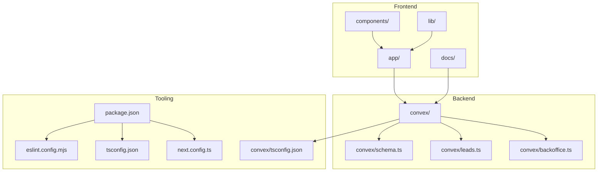
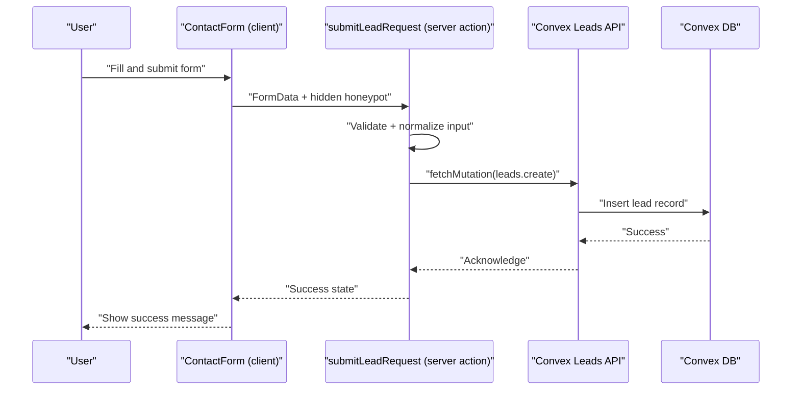

# Contributing Guidelines

<cite>
**Referenced Files in This Document**
- [package.json](file://package.json)
- [eslint.config.mjs](file://eslint.config.mjs)
- [tsconfig.json](file://tsconfig.json)
- [next.config.ts](file://next.config.ts)
- [convex/tsconfig.json](file://convex/tsconfig.json)
- [convex/schema.ts](file://convex/schema.ts)
- [convex/leads.ts](file://convex/leads.ts)
- [convex/backoffice.ts](file://convex/backoffice.ts)
- [docs/BACKOFFICE.md](file://docs/BACKOFFICE.md)
- [docs/CONVEX.md](file://docs/CONVEX.md)
- [app/actions/lead-actions.ts](file://app/actions/lead-actions.ts)
- [components/site/contact-form.tsx](file://components/site/contact-form.tsx)
- [lib/utils.ts](file://lib/utils.ts)
- [lib/public-content.ts](file://lib/public-content.ts)
- [lib/site-data.ts](file://lib/site-data.ts)
</cite>

## Table of Contents
1. [Introduction](#introduction)
2. [Project Structure](#project-structure)
3. [Core Components](#core-components)
4. [Architecture Overview](#architecture-overview)
5. [Development Workflow](#development-workflow)
6. [Code Style and Quality Standards](#code-style-and-quality-standards)
7. [Review Process and Approval Workflows](#review-process-and-approval-workflows)
8. [Documentation Requirements](#documentation-requirements)
9. [Testing and Regression Procedures](#testing-and-regression-procedures)
10. [Environment Setup and Dependency Management](#environment-setup-and-dependency-management)
11. [Communication and Collaboration Practices](#communication-and-collaboration-practices)
12. [Issue Reporting and Bug Fix Workflow](#issue-reporting-and-bug-fix-workflow)
13. [Release Management and Versioning](#release-management-and-versioning)
14. [Onboarding New Contributors](#onboarding-new-contributors)
15. [Troubleshooting Guide](#troubleshooting-guide)
16. [Conclusion](#conclusion)

## Introduction
This document provides comprehensive contributing guidelines for the ADIKI ALVANIR Angola website project. It covers development workflow, branch management, commit messages, pull requests, code style, review processes, documentation, testing, environment setup, collaboration, issue reporting, releases, onboarding, and troubleshooting. The project is a Next.js application integrated with Convex for backend data and storage, with strict TypeScript configuration and linting enforced via ESLint.

## Project Structure
The repository follows a feature-based structure with clear separation of concerns:
- Frontend: Next.js application under the app directory, with pages, components, and shared UI primitives.
- Backend: Convex schema and functions for data modeling and serverless logic.
- Utilities: Shared helpers for class merging and public content composition.
- Docs: Operational and integration guides for backoffice and Convex.

**Diagram sources**
- [package.json:1-51](file://package.json#L1-L51)
- [next.config.ts:1-91](file://next.config.ts#L1-L91)
- [convex/schema.ts:1-87](file://convex/schema.ts#L1-L87)
- [convex/leads.ts:1-32](file://convex/leads.ts#L1-L32)
- [convex/backoffice.ts:1-385](file://convex/backoffice.ts#L1-L385)

**Section sources**
- [package.json:1-51](file://package.json#L1-L51)
- [next.config.ts:1-91](file://next.config.ts#L1-L91)
- [convex/schema.ts:1-87](file://convex/schema.ts#L1-L87)
- [convex/leads.ts:1-32](file://convex/leads.ts#L1-L32)
- [convex/backoffice.ts:1-385](file://convex/backoffice.ts#L1-L385)

## Core Components
- Frontend actions and forms: Server actions handle lead submissions with validation and Convex integration.
- Convex schema: Defines data models for leads, media assets, products, categories, blog posts, and site settings.
- Convex functions: Expose mutations and queries for CRUD operations and public content retrieval.
- Utilities: Class merging and public content composition for responsive UI and dynamic content loading.
- Security headers: Next.js configuration enforces strong CSP and security headers.

**Section sources**
- [app/actions/lead-actions.ts:1-96](file://app/actions/lead-actions.ts#L1-L96)
- [components/site/contact-form.tsx:1-92](file://components/site/contact-form.tsx#L1-L92)
- [convex/schema.ts:1-87](file://convex/schema.ts#L1-L87)
- [convex/leads.ts:1-32](file://convex/leads.ts#L1-L32)
- [convex/backoffice.ts:1-385](file://convex/backoffice.ts#L1-L385)
- [lib/utils.ts:1-7](file://lib/utils.ts#L1-L7)
- [lib/public-content.ts:1-107](file://lib/public-content.ts#L1-L107)
- [next.config.ts:1-91](file://next.config.ts#L1-L91)

## Architecture Overview
The system integrates a React/Next.js frontend with Convex for data persistence and secure admin operations. The contact form posts to a server action that validates input and writes to Convex. The backoffice requires admin credentials and API keys to manage content and media.

**Diagram sources**
- [components/site/contact-form.tsx:17-91](file://components/site/contact-form.tsx#L17-L91)
- [app/actions/lead-actions.ts:32-95](file://app/actions/lead-actions.ts#L32-L95)
- [convex/leads.ts:7-24](file://convex/leads.ts#L7-L24)

**Section sources**
- [components/site/contact-form.tsx:1-92](file://components/site/contact-form.tsx#L1-L92)
- [app/actions/lead-actions.ts:1-96](file://app/actions/lead-actions.ts#L1-L96)
- [convex/leads.ts:1-32](file://convex/leads.ts#L1-L32)

## Development Workflow
- Branching model:
  - main: Stable production branch.
  - develop: Integration branch for features.
  - feature/<issue>: Feature branches prefixed with feature/.
  - hotfix/<issue>: Hotfix branches prefixed with hotfix/.
- Commit message standards:
  - Use imperative mood: "Add feature", "Fix bug".
  - Prefix with type and scope: feat(backoffice): Add media upload.
  - Keep subject under 50 characters; wrap body at 72 characters.
- Pull request procedure:
  - Open PR against develop.
  - Include related issue number and summary.
  - Ensure CI passes and at least one review approval.
  - Squash and merge after approval.

[No sources needed since this section provides general guidance]

## Code Style and Quality Standards
- ESLint configuration:
  - Extends Next.js core web vitals and TypeScript configs.
  - Ignores generated Convex code.
- TypeScript best practices:
  - Strict mode enabled; no emit for type checks.
  - Path aliases (@/*) configured for clean imports.
  - Convex functions use ESNext target and isolated modules.
- Frontend utilities:
  - Use cn for conditional class merging.
  - Normalize form inputs and enforce max lengths.
- Security headers:
  - Content-Security-Policy, HSTS, X-Content-Type-Options, X-Frame-Options, Referrer-Policy, Permissions-Policy, COOP, CORP applied globally.

**Section sources**
- [eslint.config.mjs:1-7](file://eslint.config.mjs#L1-L7)
- [tsconfig.json:1-29](file://tsconfig.json#L1-L29)
- [convex/tsconfig.json:1-26](file://convex/tsconfig.json#L1-L26)
- [lib/utils.ts:4-6](file://lib/utils.ts#L4-L6)
- [next.config.ts:8-61](file://next.config.ts#L8-L61)

## Review Process and Approval Workflows
- Code review checklist:
  - Correctness: Does the change meet requirements?
  - Tests: Are new tests included or updated?
  - Security: Are inputs validated and outputs escaped?
  - Performance: Are unnecessary computations avoided?
  - Accessibility: Are ARIA attributes and semantics correct?
  - Documentation: Are docstrings and inline comments updated?
  - Linting: Does it pass lint and type checks?
- Quality standards:
  - All PRs must pass CI checks.
  - No console logs in production code.
  - Prefer declarative UI and reusable components.
- Approval workflows:
  - At least one maintainer approval required.
  - Critical changes (security, schema) require two approvals.

[No sources needed since this section provides general guidance]

## Documentation Requirements
- New features:
  - Update inline comments and component docstrings.
  - Add usage examples in relevant pages/components.
- API changes:
  - Document Convex mutations/queries in schema and function files.
  - Update docs/CONVEX.md if deployment or environment changes are required.
- Architectural decisions:
  - Record rationale in docs/CONVEX.md and docs/BACKOFFICE.md.
  - Reference decisions in commit messages and PR descriptions.

**Section sources**
- [docs/CONVEX.md:1-59](file://docs/CONVEX.md#L1-L59)
- [docs/BACKOFFICE.md:1-37](file://docs/BACKOFFICE.md#L1-L37)
- [convex/schema.ts:1-87](file://convex/schema.ts#L1-L87)
- [convex/backoffice.ts:1-385](file://convex/backoffice.ts#L1-L385)

## Testing and Regression Procedures
- Local verification:
  - Run lint and typecheck scripts before committing.
  - Test form submission and server action behavior.
- Regression testing:
  - Validate contact form submission and lead creation.
  - Verify public content rendering and image fallbacks.
  - Confirm backoffice admin flows with environment variables configured.
- Convex-specific checks:
  - Ensure NEXT_PUBLIC_CONVEX_URL is set.
  - Validate media upload and metadata persistence.

**Section sources**
- [package.json:11-12](file://package.json#L11-L12)
- [app/actions/lead-actions.ts:32-95](file://app/actions/lead-actions.ts#L32-L95)
- [lib/public-content.ts:65-106](file://lib/public-content.ts#L65-L106)
- [docs/CONVEX.md:16-25](file://docs/CONVEX.md#L16-L25)

## Environment Setup and Dependency Management
- Prerequisites:
  - Node.js LTS and npm.
- Install dependencies:
  - Run npm install.
- Local development:
  - Start Next.js dev server with npm run dev.
  - Start Convex dev with npm run convex:dev.
- Environment variables:
  - Configure NEXT_PUBLIC_CONVEX_URL, BACKOFFICE_* variables as per docs/CONVEX.md and docs/BACKOFFICE.md.
- Generated files:
  - Convex generates API types; keep convex/_generated updated.

**Section sources**
- [package.json:5-12](file://package.json#L5-L12)
- [docs/CONVEX.md:16-42](file://docs/CONVEX.md#L16-L42)
- [docs/BACKOFFICE.md:13-24](file://docs/BACKOFFICE.md#L13-L24)

## Communication and Collaboration Practices
- Team coordination:
  - Use GitHub Discussions for design proposals.
  - Slack/Teams channel for daily sync-ups.
- Code ownership:
  - Feature owners review PRs in their domain.
  - Pair programming for complex schema or security changes.
- Transparency:
  - Keep PR descriptions concise and link issues.
  - Use labels for triage and progress tracking.

[No sources needed since this section provides general guidance]

## Issue Reporting and Bug Fix Workflow
- Reporting:
  - Use GitHub Issues with templates for bug reports and feature requests.
  - Include steps to reproduce, expected vs actual behavior, and environment details.
- Bug fix workflow:
  - Create hotfix/<issue> branch for urgent fixes.
  - Link PR to issue; add screenshots or recordings if applicable.
  - Add regression test if missing.

[No sources needed since this section provides general guidance]

## Release Management and Versioning
- Versioning:
  - Semantic versioning: patch for fixes, minor for backward-compatible features, major for breaking changes.
- Release process:
  - Merge develop into main via pull request.
  - Tag release on main; publish artifacts.
  - Deploy Convex functions and update NEXT_PUBLIC_CONVEX_URL in production.
- Production checklist:
  - Set BACKOFFICE_* variables in Vercel and Convex.
  - Verify CSP and security headers in production.

**Section sources**
- [docs/BACKOFFICE.md:31-37](file://docs/BACKOFFICE.md#L31-L37)
- [docs/CONVEX.md:44-48](file://docs/CONVEX.md#L44-L48)
- [next.config.ts:8-61](file://next.config.ts#L8-L61)

## Onboarding New Contributors
- Getting started:
  - Fork and clone the repository.
  - Install dependencies and run local dev server.
  - Review docs/CONVEX.md and docs/BACKOFFICE.md.
- First contribution:
  - Pick a good first issue labeled "good first issue".
  - Open feature/<issue> branch and submit PR.
- Mentorship:
  - Assign a buddy for initial weeks.
  - Schedule weekly 1:1s to review PRs and answer questions.

[No sources needed since this section provides general guidance]

## Troubleshooting Guide
- Convex not configured:
  - Ensure NEXT_PUBLIC_CONVEX_URL is set; otherwise server action returns configuration error.
- Form submission fails:
  - Check input normalization and validation; confirm honeypot is empty.
- Backoffice unauthorized:
  - Verify BACKOFFICE_API_KEY and session secret; regenerate password hash if needed.
- Security headers blocking assets:
  - Confirm CSP connect-src and img-src allow Convex domains.

**Section sources**
- [app/actions/lead-actions.ts:44-49](file://app/actions/lead-actions.ts#L44-L49)
- [app/actions/lead-actions.ts:58-70](file://app/actions/lead-actions.ts#L58-L70)
- [docs/BACKOFFICE.md:13-24](file://docs/BACKOFFICE.md#L13-L24)
- [next.config.ts:8-25](file://next.config.ts#L8-L25)

## Conclusion
These guidelines ensure consistent, secure, and maintainable contributions to the ADIKI ALVANIR Angola website. By following the workflow, style, review, documentation, testing, environment, collaboration, issue, and release practices outlined here, contributors can collaborate effectively and deliver high-quality features and fixes.