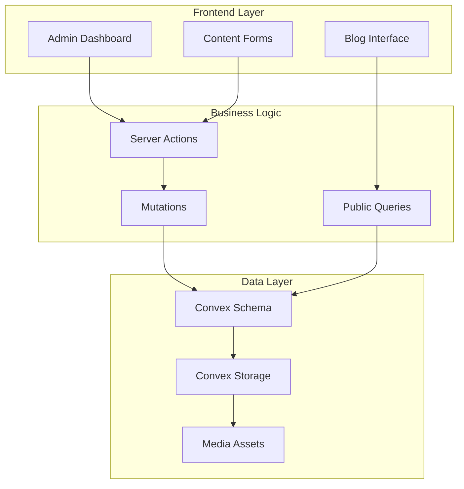
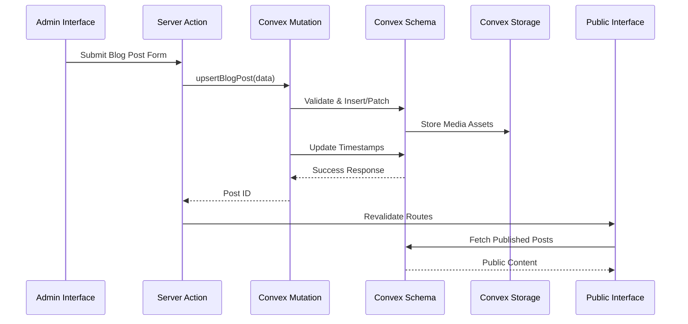
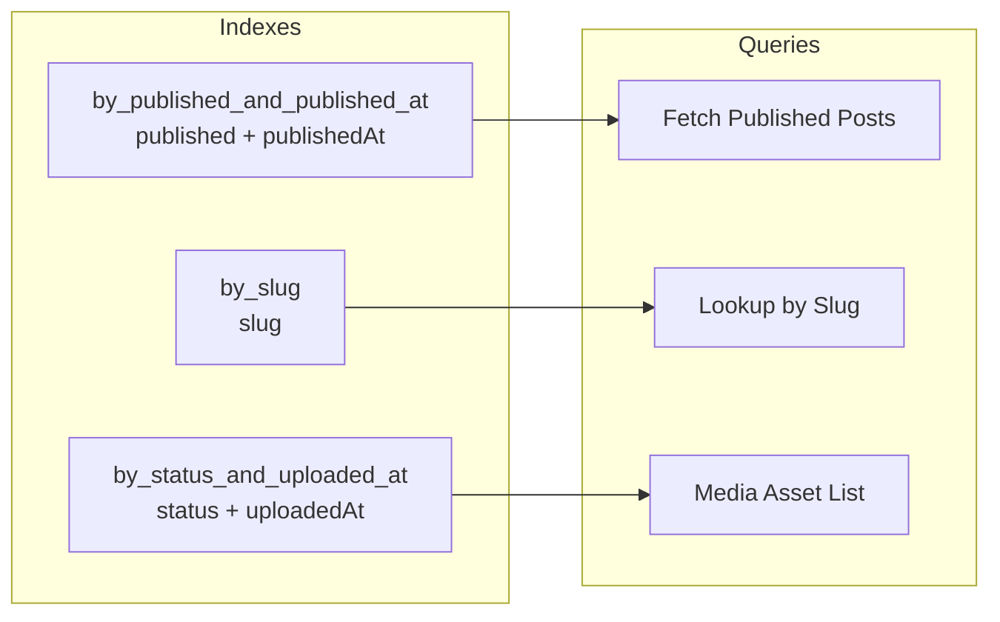
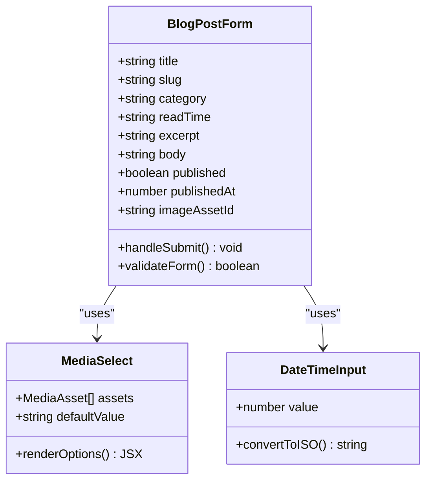
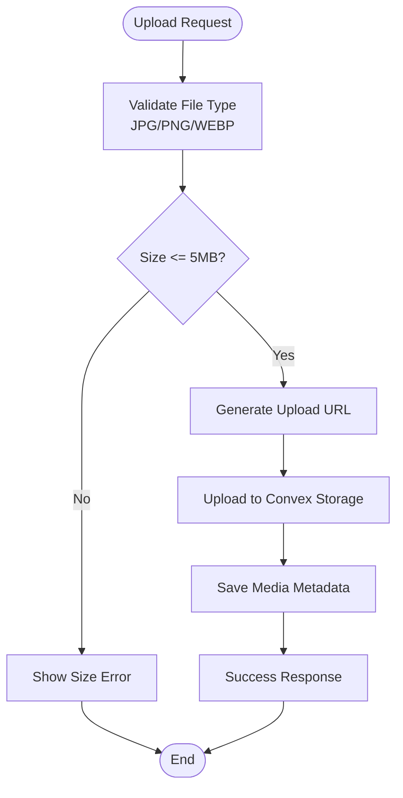
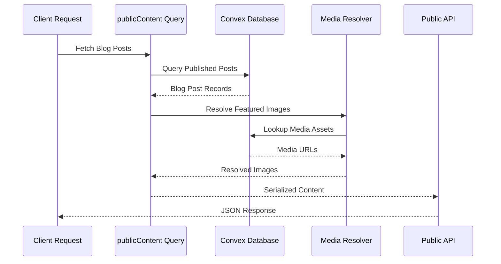
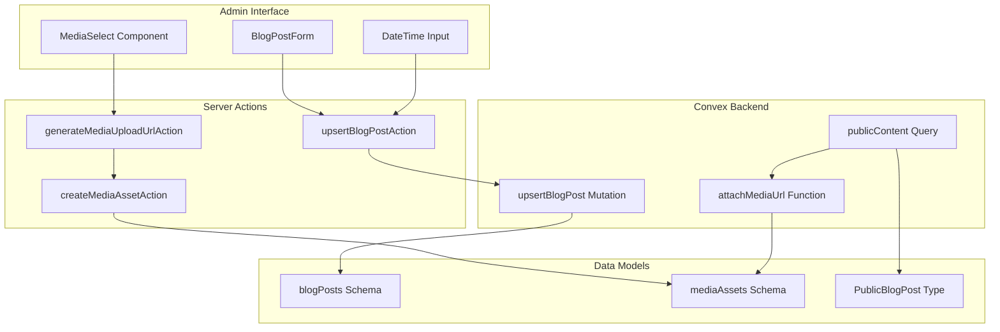

# Blog Post Data Model

<cite>
**Referenced Files in This Document**
- [schema.ts](file://convex/schema.ts)
- [backoffice.ts](file://convex/backoffice.ts)
- [actions.ts](file://app/backoffice/actions.ts)
- [blog/page.tsx](file://app/backoffice/(admin)/blog/page.tsx)
- [public-content.ts](file://lib/public-content.ts)
- [site-data.ts](file://lib/site-data.ts)
- [media-upload-form.tsx](file://components/backoffice/media-upload-form.tsx)
</cite>

## Table of Contents
1. [Introduction](#introduction)
2. [Project Structure](#project-structure)
3. [Core Components](#core-components)
4. [Architecture Overview](#architecture-overview)
5. [Detailed Component Analysis](#detailed-component-analysis)
6. [Dependency Analysis](#dependency-analysis)
7. [Performance Considerations](#performance-considerations)
8. [Troubleshooting Guide](#troubleshooting-guide)
9. [Conclusion](#conclusion)

## Introduction
This document provides comprehensive documentation for the Blog Post data model used in the content management system. The blog post structure includes essential fields for content creation, media asset relationships, publication workflows, and SEO optimization. The implementation leverages Convex for data persistence and Next.js for frontend rendering, with a complete admin interface for content management.

## Project Structure
The blog post functionality spans multiple layers of the application architecture:



**Diagram sources**
- [schema.ts:65-80](file://convex/schema.ts#L65-L80)
- [backoffice.ts:260-299](file://convex/backoffice.ts#L260-L299)
- [actions.ts:176-199](file://app/backoffice/actions.ts#L176-L199)

**Section sources**
- [schema.ts:1-87](file://convex/schema.ts#L1-L87)
- [backoffice.ts:1-385](file://convex/backoffice.ts#L1-L385)

## Core Components

### Blog Post Data Model
The blog post data model is defined in the Convex schema with comprehensive field definitions:

```mermaid
erDiagram
BLOG_POSTS {
string title
string slug
string excerpt
string body
string category
string readTime
id mediaAssets imageAssetId
string fallbackImage
boolean published
number publishedAt
number createdAt
number updatedAt
}
MEDIA_ASSETS {
id _storage storageId
string filename
string alt
enum kind
string contentType
number size
enum status
number uploadedAt
}
BLOG_POSTS ||--|| MEDIA_ASSETS : "featured_image"
```

**Diagram sources**
- [schema.ts:65-80](file://convex/schema.ts#L65-L80)
- [schema.ts:18-36](file://convex/schema.ts#L18-L36)

### Key Fields and Their Purposes

#### Content Fields
- **title**: Primary headline (max 140 characters)
- **slug**: URL-friendly identifier (max 100 characters)
- **excerpt**: SEO summary (max 280 characters)
- **body**: Complete article content (optional)
- **category**: Content classification
- **readTime**: Estimated reading duration

#### Media Asset Relationship
- **imageAssetId**: Foreign key to mediaAssets table
- **fallbackImage**: Static fallback URL

#### Publication Management
- **published**: Boolean status flag
- **publishedAt**: Timestamp for publication scheduling

#### Timestamp Management
- **createdAt**: Record creation timestamp
- **updatedAt**: Last modification timestamp

**Section sources**
- [schema.ts:65-80](file://convex/schema.ts#L65-L80)

## Architecture Overview

### Data Flow Architecture



**Diagram sources**
- [actions.ts:176-199](file://app/backoffice/actions.ts#L176-L199)
- [backoffice.ts:260-299](file://convex/backoffice.ts#L260-L299)
- [backoffice.ts:319-384](file://convex/backoffice.ts#L319-L384)

### Indexing Strategy



**Diagram sources**
- [schema.ts:78-80](file://convex/schema.ts#L78-L80)
- [schema.ts:35](file://convex/schema.ts#L35)

**Section sources**
- [schema.ts:78-80](file://convex/schema.ts#L78-L80)
- [backoffice.ts:130](file://convex/backoffice.ts#L130)

## Detailed Component Analysis

### Admin Interface Components

#### Blog Post Form Component
The admin interface provides a comprehensive form for managing blog posts:



**Diagram sources**
- [blog/page.tsx:36-96](file://app/backoffice/(admin)/blog/page.tsx#L36-L96)
- [blog/page.tsx:15-34](file://app/backoffice/(admin)/blog/page.tsx#L15-L34)

#### Media Asset Management
The media upload system handles image storage and association:



**Diagram sources**
- [media-upload-form.tsx:19-77](file://components/backoffice/media-upload-form.tsx#L19-L77)
- [backoffice.ts:68-108](file://convex/backoffice.ts#L68-L108)

**Section sources**
- [blog/page.tsx:36-96](file://app/backoffice/(admin)/blog/page.tsx#L36-L96)
- [media-upload-form.tsx:19-77](file://components/backoffice/media-upload-form.tsx#L19-L77)

### Public Content Integration

#### Content Serialization Pipeline
The public content system transforms database records into frontend-ready data:



**Diagram sources**
- [backoffice.ts:319-384](file://convex/backoffice.ts#L319-L384)
- [public-content.ts:65-106](file://lib/public-content.ts#L65-L106)

**Section sources**
- [backoffice.ts:319-384](file://convex/backoffice.ts#L319-L384)
- [public-content.ts:65-106](file://lib/public-content.ts#L65-L106)

### Validation Rules and Content Formatting

#### Server-Side Validation
The system implements comprehensive validation at multiple levels:

| Field | Type | Validation | Max Length |
|-------|------|------------|------------|
| title | string | required, trimmed | 140 chars |
| slug | string | auto-generated if empty | 100 chars |
| excerpt | string | required, trimmed | 280 chars |
| body | string | optional | unlimited |
| category | string | required | unlimited |
| readTime | string | optional | 20 chars |
| imageAssetId | id | foreign key | N/A |
| fallbackImage | string | optional | unlimited |

#### Client-Side Validation
The admin interface provides immediate feedback and constraints:

- Real-time character limits
- Required field validation
- Slug auto-generation
- File type restrictions (JPG, PNG, WEBP)
- Size limitations (≤ 5MB)

**Section sources**
- [actions.ts:176-199](file://app/backoffice/actions.ts#L176-L199)
- [media-upload-form.tsx:11-12](file://components/backoffice/media-upload-form.tsx#L11-L12)

## Dependency Analysis

### Component Dependencies



**Diagram sources**
- [actions.ts:176-199](file://app/backoffice/actions.ts#L176-L199)
- [backoffice.ts:260-299](file://convex/backoffice.ts#L260-L299)
- [backoffice.ts:319-384](file://convex/backoffice.ts#L319-L384)

### Data Flow Dependencies

The system maintains loose coupling through well-defined interfaces:

1. **Admin Interface** depends on **Server Actions** for mutations
2. **Server Actions** depend on **Convex API** for database operations
3. **Public Interface** depends on **Public Query** for content retrieval
4. **Media Resolution** depends on **Storage URLs** for asset delivery

**Section sources**
- [actions.ts:176-199](file://app/backoffice/actions.ts#L176-L199)
- [backoffice.ts:260-299](file://convex/backoffice.ts#L260-L299)

## Performance Considerations

### Query Optimization
The schema includes strategic indexes for optimal query performance:

- **Published Posts Query**: Uses composite index on `published` and `publishedAt`
- **Slug Lookups**: Single-field index on `slug` for fast URL routing
- **Media Asset Lists**: Composite index on `status` and `uploadedAt` for sorting

### Caching Strategy
The public content endpoint implements intelligent caching:

- **Revalidation Interval**: 60 seconds for dynamic content updates
- **Selective Revalidation**: Updates only affected routes after mutations
- **Fallback Mechanism**: Local static content when database is unavailable

### Scalability Patterns
- **Pagination Limits**: Maximum 100 items per query
- **Lazy Loading**: Media URLs resolved on-demand
- **Batch Operations**: Parallel queries for dashboard statistics

**Section sources**
- [schema.ts:78-80](file://convex/schema.ts#L78-L80)
- [blog/page.tsx:20](file://app/blog/page.tsx#L20)
- [backoffice.ts:7](file://convex/backoffice.ts#L7)

## Troubleshooting Guide

### Common Issues and Solutions

#### Media Asset Resolution Failures
**Problem**: Featured images not displaying in admin interface
**Causes**:
- Archived media assets
- Missing storage URLs
- Invalid foreign key references

**Solutions**:
1. Verify media asset status is "active"
2. Check storage permissions and availability
3. Confirm foreign key integrity

#### Slug Generation Conflicts
**Problem**: Duplicate slugs causing conflicts
**Solutions**:
1. Use auto-generated slugs when leaving blank
2. Manually adjust conflicting slugs
3. Implement slug uniqueness validation

#### Publication Timing Issues
**Problem**: Posts not appearing at scheduled time
**Solutions**:
1. Verify `published` flag is set to true
2. Check `publishedAt` timestamp format
3. Ensure timezone conversion accuracy

#### Content Fallback Handling
**Problem**: Missing fallback images in production
**Solutions**:
1. Configure fallbackImage field in admin
2. Verify static image library availability
3. Test fallback resolution logic

**Section sources**
- [backoffice.ts:33-45](file://convex/backoffice.ts#L33-L45)
- [public-content.ts:98-106](file://lib/public-content.ts#L98-L106)

## Conclusion

The Blog Post data model provides a robust foundation for content management with comprehensive features for publication workflows, media asset handling, and SEO optimization. The implementation demonstrates best practices in data modeling, validation, and performance optimization while maintaining flexibility for future enhancements.

Key strengths of the implementation include:
- Clear separation of concerns between admin and public interfaces
- Comprehensive validation at multiple layers
- Efficient indexing strategy for optimal query performance
- Flexible media asset management with fallback handling
- Seamless integration with Next.js static generation and revalidation

The architecture supports scalable content management while maintaining excellent developer experience through well-defined APIs and intuitive admin interfaces.