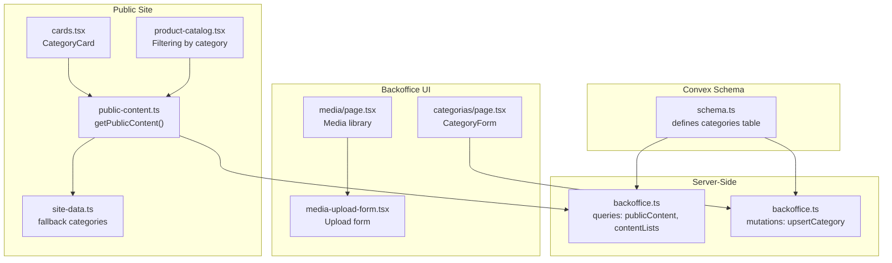
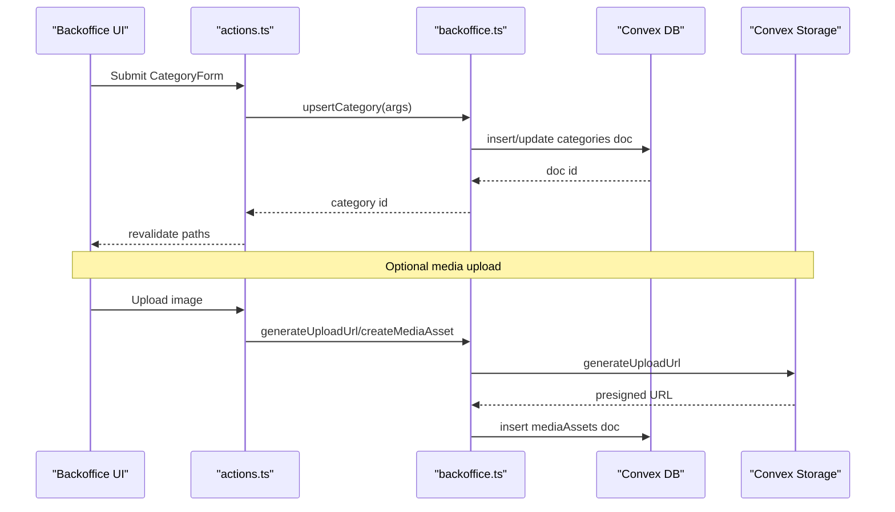
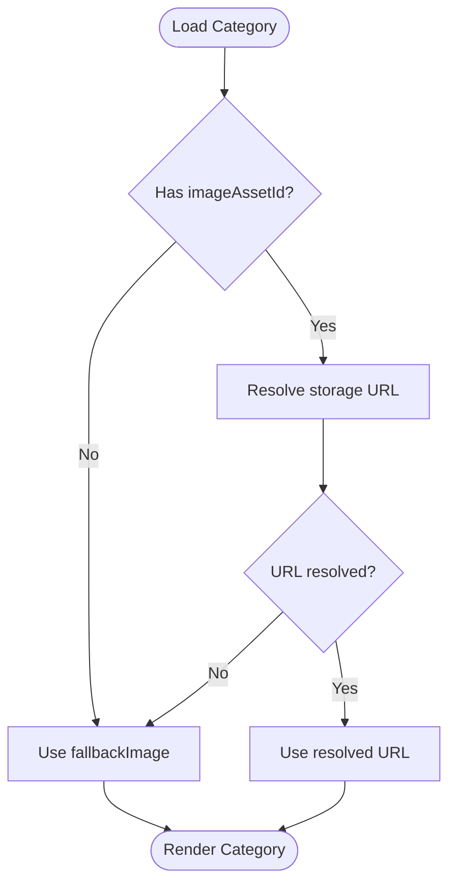
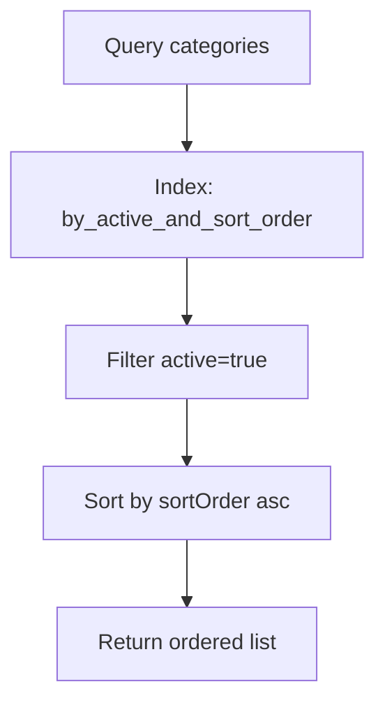
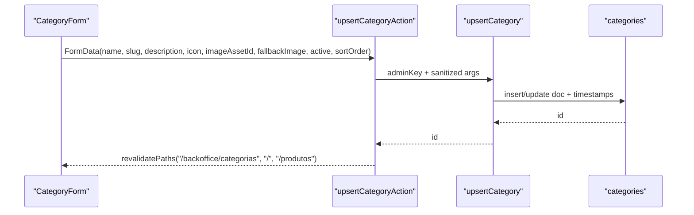
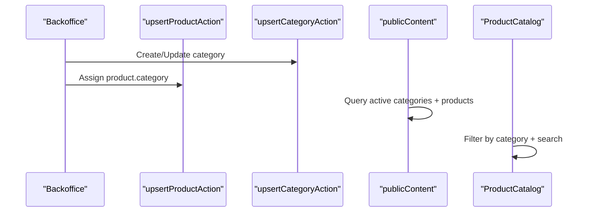
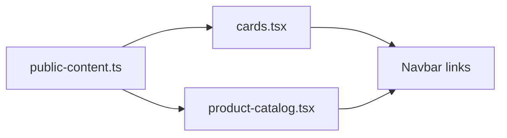
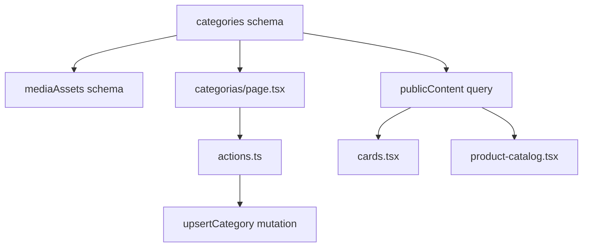

# Category Data Model

<cite>
**Referenced Files in This Document**
- [schema.ts](file://convex/schema.ts)
- [backoffice.ts](file://convex/backoffice.ts)
- [actions.ts](file://app/backoffice/actions.ts)
- [categorias/page.tsx](file://app/backoffice/(admin)/categorias/page.tsx)
- [media/page.tsx](file://app/backoffice/(admin)/media/page.tsx)
- [media-upload-form.tsx](file://components/backoffice/media-upload-form.tsx)
- [public-content.ts](file://lib/public-content.ts)
- [site-data.ts](file://lib/site-data.ts)
- [product-catalog.tsx](file://components/site/product-catalog.tsx)
- [cards.tsx](file://components/site/cards.tsx)
- [navbar.tsx](file://components/site/navbar.tsx)
</cite>

## Table of Contents
1. [Introduction](#introduction)
2. [Project Structure](#project-structure)
3. [Core Components](#core-components)
4. [Architecture Overview](#architecture-overview)
5. [Detailed Component Analysis](#detailed-component-analysis)
6. [Dependency Analysis](#dependency-analysis)
7. [Performance Considerations](#performance-considerations)
8. [Troubleshooting Guide](#troubleshooting-guide)
9. [Conclusion](#conclusion)

## Introduction
This document describes the Category data model used for product classification. It covers the schema definition, media asset relationship and fallback handling, active status and sort order for hierarchical organization, timestamps for content management, indexing strategy for performance, validation rules, and practical workflows for CRUD operations, product categorization, and navigation.

## Project Structure
The Category model is defined in the Convex schema and surfaced through server-side mutations and queries. The backoffice UI allows administrators to manage categories, while the public site consumes category data for rendering.



**Diagram sources**
- [schema.ts:51-64](file://convex/schema.ts#L51-L64)
- [backoffice.ts:163-184](file://convex/backoffice.ts#L163-L184)
- [backoffice.ts:223-258](file://convex/backoffice.ts#L223-L258)
- [categorias/page.tsx:32-87](file://app/backoffice/(admin)/categorias/page.tsx#L32-L87)
- [media/page.tsx:17-82](file://app/backoffice/(admin)/media/page.tsx#L17-L82)
- [media-upload-form.tsx:14-42](file://components/backoffice/media-upload-form.tsx#L14-L42)
- [public-content.ts:65-107](file://lib/public-content.ts#L65-L107)
- [site-data.ts:72-115](file://lib/site-data.ts#L72-L115)
- [cards.tsx:17-41](file://components/site/cards.tsx#L17-L41)
- [product-catalog.tsx:12-79](file://components/site/product-catalog.tsx#L12-L79)

**Section sources**
- [schema.ts:51-64](file://convex/schema.ts#L51-L64)
- [backoffice.ts:163-184](file://convex/backoffice.ts#L163-L184)
- [backoffice.ts:223-258](file://convex/backoffice.ts#L223-L258)
- [categorias/page.tsx:32-87](file://app/backoffice/(admin)/categorias/page.tsx#L32-L87)
- [media/page.tsx:17-82](file://app/backoffice/(admin)/media/page.tsx#L17-L82)
- [media-upload-form.tsx:14-42](file://components/backoffice/media-upload-form.tsx#L14-L42)
- [public-content.ts:65-107](file://lib/public-content.ts#L65-L107)
- [site-data.ts:72-115](file://lib/site-data.ts#L72-L115)
- [cards.tsx:17-41](file://components/site/cards.tsx#L17-L41)
- [product-catalog.tsx:12-79](file://components/site/product-catalog.tsx#L12-L79)

## Core Components
- Categories table fields:
  - name: string
  - slug: string
  - description: string
  - icon: string
  - imageAssetId: optional mediaAssets id
  - fallbackImage: optional string URL
  - active: boolean
  - sortOrder: number
  - createdAt: number (timestamp)
  - updatedAt: number (timestamp)
- Indexes:
  - by_active_and_sort_order: active, sortOrder
  - by_slug: slug

These fields and indexes enable efficient retrieval of visible categories ordered by a configurable priority and fast slug-based lookups.

**Section sources**
- [schema.ts:51-64](file://convex/schema.ts#L51-L64)

## Architecture Overview
The Category model integrates with media assets and the public content pipeline. Administrators upload images to Convex Storage, associate them with categories, and publish changes. The public site fetches category data and falls back to local defaults when no remote categories are present.



**Diagram sources**
- [actions.ts:153-174](file://app/backoffice/actions.ts#L153-L174)
- [backoffice.ts:223-258](file://convex/backoffice.ts#L223-L258)
- [media-upload-form.tsx:19-42](file://components/backoffice/media-upload-form.tsx#L19-L42)

## Detailed Component Analysis

### Category Data Model Definition
The categories table defines the canonical structure for product classification, including metadata, media association, visibility, ordering, and timestamps.

```mermaid
erDiagram
CATEGORIES {
string name
string slug
string description
string icon
id mediaAssets imageAssetId
string fallbackImage
boolean active
number sortOrder
number createdAt
number updatedAt
}
MEDIAASSETS {
id _storage storageId
string filename
string alt
enum kind
string contentType
number size
enum status
number uploadedAt
}
CATEGORIES ||--o| MEDIAASSETS : "optional image"
```

**Diagram sources**
- [schema.ts:51-64](file://convex/schema.ts#L51-L64)
- [schema.ts:18-36](file://convex/schema.ts#L18-L36)

**Section sources**
- [schema.ts:51-64](file://convex/schema.ts#L51-L64)
- [schema.ts:18-36](file://convex/schema.ts#L18-L36)

### Media Asset Relationship and Fallback Handling
- imageAssetId references mediaAssets; when present, the system resolves a public URL via storage and attaches it to the category payload.
- fallbackImage provides a URL string used when no media asset is selected or when the asset is archived.
- The public content pipeline prioritizes attached media over fallback images.



**Diagram sources**
- [backoffice.ts:33-45](file://convex/backoffice.ts#L33-L45)
- [backoffice.ts:359-366](file://convex/backoffice.ts#L359-L366)
- [public-content.ts:82-89](file://lib/public-content.ts#L82-L89)

**Section sources**
- [backoffice.ts:33-45](file://convex/backoffice.ts#L33-L45)
- [backoffice.ts:359-366](file://convex/backoffice.ts#L359-L366)
- [public-content.ts:82-89](file://lib/public-content.ts#L82-L89)

### Active Status Flag and Sort Order
- active filters categories for public consumption.
- sortOrder controls presentation order; the schema enforces composite indexing on (active, sortOrder) for efficient retrieval.



**Diagram sources**
- [schema.ts:63](file://convex/schema.ts#L63)
- [backoffice.ts:129](file://convex/backoffice.ts#L129)
- [public-content.ts:322-326](file://convex/publicContent.ts#L322-L326)

**Section sources**
- [schema.ts:63](file://convex/schema.ts#L63)
- [backoffice.ts:129](file://convex/backoffice.ts#L129)
- [public-content.ts:322-326](file://convex/public-content.ts#L322-L326)

### Timestamp Fields and Content Management
- createdAt and updatedAt timestamps are managed by the server-side upsertCategory mutation.
- These timestamps support audit trails and content freshness.

**Section sources**
- [backoffice.ts:236-257](file://convex/backoffice.ts#L236-L257)

### Indexing Strategy
- by_active_and_sort_order: supports fast retrieval of visible categories ordered by priority.
- by_slug: enables slug-based lookups for routing and SEO-friendly URLs.

**Section sources**
- [schema.ts:63](file://convex/schema.ts#L63)

### Validation Rules and Organizational Patterns
- Slug generation:
  - If slug is empty, the backend derives it from the name.
  - The frontend also provides a slugify helper for consistency.
- Required fields in the UI:
  - name, slug, description are required in the CategoryForm.
  - icon defaults to a predefined value if omitted.
- Media selection:
  - imageAssetId is optional; when provided, it must reference an active media asset.
- Ordering:
  - sortOrder defaults to a sensible value if omitted.
- Visibility:
  - active defaults to true if omitted.

**Section sources**
- [actions.ts:155-169](file://app/backoffice/actions.ts#L155-L169)
- [categorias/page.tsx:45-81](file://app/backoffice/(admin)/categorias/page.tsx#L45-L81)
- [backoffice.ts:236-257](file://convex/backoffice.ts#L236-L257)

### CRUD Operations: Category Management
- Upsert category:
  - Frontend posts form data to upsertCategoryAction.
  - Backend validates admin credentials and persists category with timestamps.
  - Revalidates public routes to reflect changes immediately.



**Diagram sources**
- [actions.ts:153-174](file://app/backoffice/actions.ts#L153-L174)
- [backoffice.ts:223-258](file://convex/backoffice.ts#L223-L258)

**Section sources**
- [actions.ts:153-174](file://app/backoffice/actions.ts#L153-L174)
- [backoffice.ts:223-258](file://convex/backoffice.ts#L223-L258)

### Product Categorization Workflow
- Products are associated with categories via a category field (string).
- The public content pipeline surfaces products grouped by category for filtering and discovery.
- The product catalog UI filters by category and free-text search.



**Diagram sources**
- [actions.ts:130-151](file://app/backoffice/actions.ts#L130-L151)
- [backoffice.ts:186-221](file://convex/backoffice.ts#L186-L221)
- [public-content.ts:65-107](file://lib/public-content.ts#L65-L107)
- [product-catalog.tsx:12-79](file://components/site/product-catalog.tsx#L12-L79)

**Section sources**
- [actions.ts:130-151](file://app/backoffice/actions.ts#L130-L151)
- [backoffice.ts:186-221](file://convex/backoffice.ts#L186-L221)
- [public-content.ts:65-107](file://lib/public-content.ts#L65-L107)
- [product-catalog.tsx:12-79](file://components/site/product-catalog.tsx#L12-L79)

### Integration with Product Catalog and Navigation
- Public site renders CategoryCards powered by category data (including icon mapping).
- The product catalog filters by category and text search.
- Navigation items are static; category pages can be linked from CategoryCards.



**Diagram sources**
- [public-content.ts:82-89](file://lib/public-content.ts#L82-L89)
- [cards.tsx:17-41](file://components/site/cards.tsx#L17-L41)
- [navbar.tsx:35-53](file://components/site/navbar.tsx#L35-L53)
- [product-catalog.tsx:12-79](file://components/site/product-catalog.tsx#L12-L79)

**Section sources**
- [public-content.ts:82-89](file://lib/public-content.ts#L82-L89)
- [cards.tsx:17-41](file://components/site/cards.tsx#L17-L41)
- [navbar.tsx:35-53](file://components/site/navbar.tsx#L35-L53)
- [product-catalog.tsx:12-79](file://components/site/product-catalog.tsx#L12-L79)

## Dependency Analysis
- Category model depends on mediaAssets for optional image resolution.
- Public content depends on category indexes for efficient retrieval.
- Backoffice UI depends on actions.ts to sanitize and submit category data.
- Frontend components depend on public-content.ts for category rendering.



**Diagram sources**
- [schema.ts:51-64](file://convex/schema.ts#L51-L64)
- [schema.ts:18-36](file://convex/schema.ts#L18-L36)
- [backoffice.ts:163-184](file://convex/backoffice.ts#L163-L184)
- [categorias/page.tsx:32-87](file://app/backoffice/(admin)/categorias/page.tsx#L32-L87)
- [actions.ts:153-174](file://app/backoffice/actions.ts#L153-L174)
- [backoffice.ts:223-258](file://convex/backoffice.ts#L223-L258)
- [public-content.ts:65-107](file://lib/public-content.ts#L65-L107)
- [cards.tsx:17-41](file://components/site/cards.tsx#L17-L41)
- [product-catalog.tsx:12-79](file://components/site/product-catalog.tsx#L12-L79)

**Section sources**
- [schema.ts:51-64](file://convex/schema.ts#L51-L64)
- [schema.ts:18-36](file://convex/schema.ts#L18-L36)
- [backoffice.ts:163-184](file://convex/backoffice.ts#L163-L184)
- [categorias/page.tsx:32-87](file://app/backoffice/(admin)/categorias/page.tsx#L32-L87)
- [actions.ts:153-174](file://app/backoffice/actions.ts#L153-L174)
- [backoffice.ts:223-258](file://convex/backoffice.ts#L223-L258)
- [public-content.ts:65-107](file://lib/public-content.ts#L65-L107)
- [cards.tsx:17-41](file://components/site/cards.tsx#L17-L41)
- [product-catalog.tsx:12-79](file://components/site/product-catalog.tsx#L12-L79)

## Performance Considerations
- Use by_active_and_sort_order index to avoid scanning all categories; filter by active and sort efficiently.
- Keep sortOrder small integers for compact indexing and fast sorting.
- Prefer slug-based routing to minimize joins and leverage the by_slug index.
- Attach media URLs only when needed; defer to fallbackImage for absent assets to reduce latency.

[No sources needed since this section provides general guidance]

## Troubleshooting Guide
- Category not appearing on the front page:
  - Verify active flag is true and sortOrder is reasonable.
  - Confirm by_active_and_sort_order index is used in queries.
- Missing category image:
  - Ensure imageAssetId references an active media asset; otherwise, fallbackImage is used.
  - Check media upload form constraints and storage permissions.
- Slug conflicts:
  - If slug is empty, it is auto-generated; otherwise ensure uniqueness and correctness.

**Section sources**
- [schema.ts:63](file://convex/schema.ts#L63)
- [backoffice.ts:33-45](file://convex/backoffice.ts#L33-L45)
- [media-upload-form.tsx:11-12](file://components/backoffice/media-upload-form.tsx#L11-L12)
- [actions.ts:155-169](file://app/backoffice/actions.ts#L155-L169)

## Conclusion
The Category data model provides a robust foundation for product classification with strong indexing, media integration, and fallback handling. Administrators can efficiently manage categories, products, and media assets, while the public site benefits from optimized queries and graceful fallbacks.