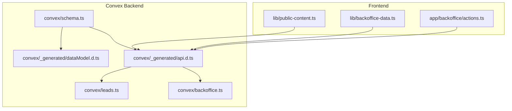
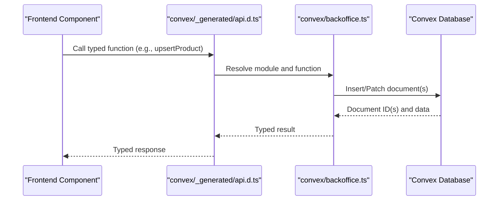
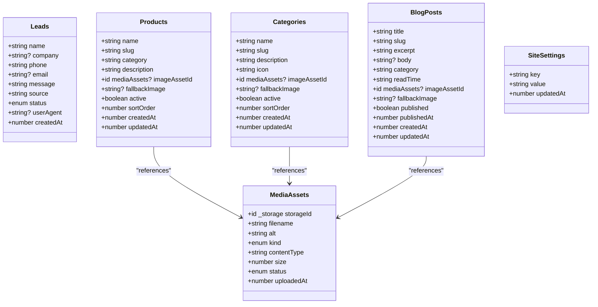
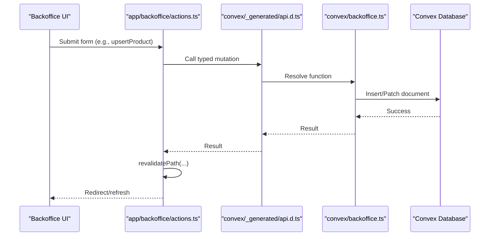
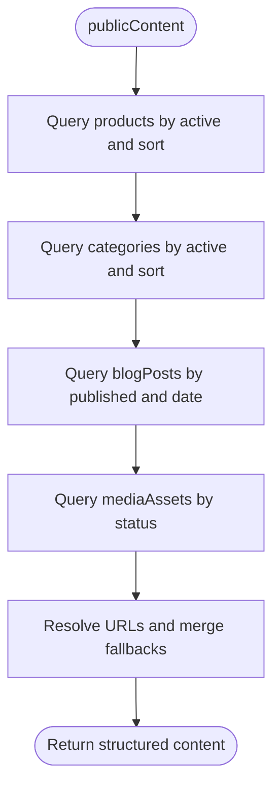
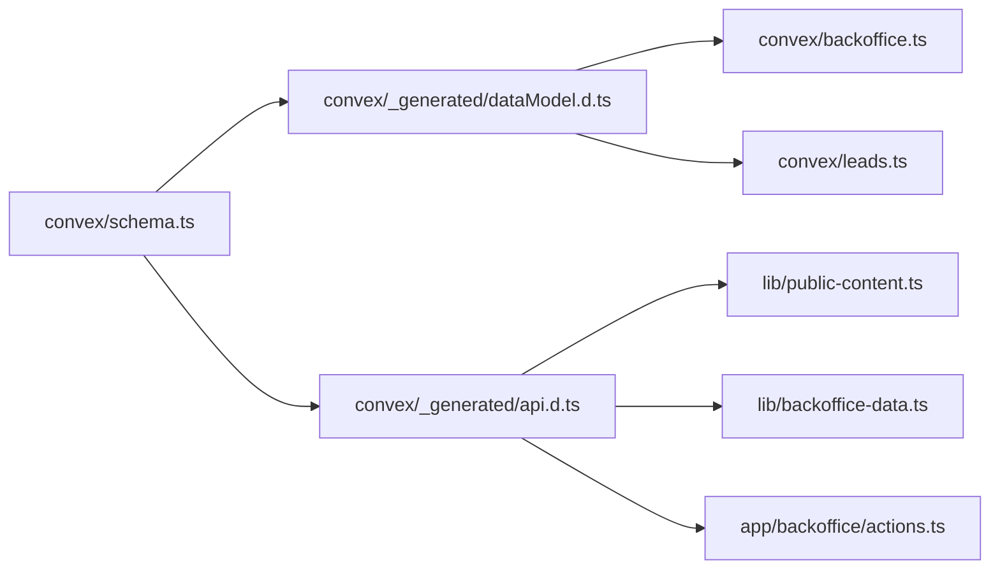

# Convex Database Schema

<cite>
**Referenced Files in This Document**
- [schema.ts](file://convex/schema.ts)
- [dataModel.d.ts](file://convex/_generated/dataModel.d.ts)
- [api.d.ts](file://convex/_generated/api.d.ts)
- [leads.ts](file://convex/leads.ts)
- [backoffice.ts](file://convex/backoffice.ts)
- [public-content.ts](file://lib/public-content.ts)
- [actions.ts](file://app/backoffice/actions.ts)
- [backoffice-data.ts](file://lib/backoffice-data.ts)
- [package.json](file://package.json)
</cite>

## Table of Contents
1. [Introduction](#introduction)
2. [Project Structure](#project-structure)
3. [Core Components](#core-components)
4. [Architecture Overview](#architecture-overview)
5. [Detailed Component Analysis](#detailed-component-analysis)
6. [Dependency Analysis](#dependency-analysis)
7. [Performance Considerations](#performance-considerations)
8. [Troubleshooting Guide](#troubleshooting-guide)
9. [Conclusion](#conclusion)
10. [Appendices](#appendices)

## Introduction
This document provides comprehensive documentation for the Convex database schema used by the project. It details the schema structure across the five main collections (leads, mediaAssets, products, categories, blogPosts), the siteSettings collection for configuration, and the schema validation system powered by convex/values. It also explains index definitions for performance, referential integrity patterns, and how the schema integrates with the frontend via Convex’s Next.js integration for real-time-like updates and automatic synchronization.

## Project Structure
The schema is defined centrally and consumed by generated types and server-side functions. The frontend interacts with the backend through typed Convex functions exposed via the generated API.

**Diagram sources**
- [schema.ts:1-87](file://convex/schema.ts#L1-L87)
- [dataModel.d.ts:1-61](file://convex/_generated/dataModel.d.ts#L1-L61)
- [api.d.ts:1-52](file://convex/_generated/api.d.ts#L1-L52)
- [leads.ts:1-32](file://convex/leads.ts#L1-L32)
- [backoffice.ts:1-385](file://convex/backoffice.ts#L1-L385)
- [public-content.ts:1-107](file://lib/public-content.ts#L1-L107)
- [backoffice-data.ts:1-21](file://lib/backoffice-data.ts#L1-L21)
- [actions.ts:1-215](file://app/backoffice/actions.ts#L1-L215)

**Section sources**
- [schema.ts:1-87](file://convex/schema.ts#L1-L87)
- [dataModel.d.ts:1-61](file://convex/_generated/dataModel.d.ts#L1-L61)
- [api.d.ts:1-52](file://convex/_generated/api.d.ts#L1-L52)

## Core Components
This section outlines the five main collections and the siteSettings collection, their fields, and how they are validated using convex/values.

- leads
  - Purpose: Capture inbound inquiries with status tracking.
  - Key fields: name, company (optional), phone, email (optional), message, source, status (union of literals), userAgent (optional), createdAt (number).
  - Indexes: by_status, by_created_at.
  - Validation: Uses v.union, v.string, v.optional, v.number.

- mediaAssets
  - Purpose: Store media metadata and linkage to Convex Storage.
  - Key fields: storageId (id for "_storage"), filename, alt, kind (union of literals), contentType, size, status (active/archived), uploadedAt (number).
  - Indexes: by_kind_and_status, by_status_and_uploaded_at.
  - Validation: Uses v.union, v.string, v.id, v.number.

- products
  - Purpose: Product catalog entries with optional image linkage.
  - Key fields: name, slug, category, description, imageAssetId (optional id to mediaAssets), fallbackImage (optional), active (boolean), sortOrder (number), createdAt, updatedAt.
  - Indexes: by_active_and_sort_order, by_slug.
  - Validation: Uses v.string, v.boolean, v.number, v.optional.

- categories
  - Purpose: Category taxonomy for products.
  - Key fields: name, slug, description, icon, imageAssetId (optional id to mediaAssets), fallbackImage (optional), active (boolean), sortOrder (number), createdAt, updatedAt.
  - Indexes: by_active_and_sort_order, by_slug.
  - Validation: Same as products.

- blogPosts
  - Purpose: Blog content with publication controls.
  - Key fields: title, slug, excerpt, body (optional), category, readTime, imageAssetId (optional id to mediaAssets), fallbackImage (optional), published (boolean), publishedAt (number), createdAt, updatedAt.
  - Indexes: by_published_and_published_at, by_slug.
  - Validation: Uses v.boolean, v.string, v.optional, v.number.

- siteSettings
  - Purpose: Global configuration key-value pairs.
  - Key fields: key, value, updatedAt.
  - Index: by_key.
  - Validation: Uses v.string.

Validation system summary:
- The schema uses convex/values validators (v.*) to enforce field types and constraints at write time.
- Union types constrain enumerated fields (e.g., status, kind, published).
- Optional fields are explicitly marked optional to allow null-like values.

**Section sources**
- [schema.ts:4-86](file://convex/schema.ts#L4-L86)

## Architecture Overview
The schema drives a typed data model consumed by server functions. Frontend components call typed Convex queries/mutations, which read/write the database and return strongly-typed results. The generated types ensure compile-time safety across the stack.

**Diagram sources**
- [api.d.ts:20-36](file://convex/_generated/api.d.ts#L20-L36)
- [backoffice.ts:186-221](file://convex/backoffice.ts#L186-L221)

## Detailed Component Analysis

### Schema Definition and Validation
- defineSchema and defineTable usage:
  - defineSchema exports a single schema object that defines all tables.
  - defineTable declares per-table shapes and validations.
- Validation patterns:
  - v.union for enumerated fields (status, kind, published).
  - v.literal for strict enum values.
  - v.string/v.boolean/v.number for primitives.
  - v.optional for nullable fields.
  - v.id("<table>") for cross-table references (e.g., mediaAssets).
- Generated types:
  - dataModel.d.ts exposes Doc<TableName> and Id<TableName> types derived from the schema.

**Diagram sources**
- [schema.ts:4-86](file://convex/schema.ts#L4-L86)

**Section sources**
- [schema.ts:1-87](file://convex/schema.ts#L1-L87)
- [dataModel.d.ts:30-60](file://convex/_generated/dataModel.d.ts#L30-L60)

### Index Definitions and Performance
Indexes are defined per table to optimize frequent queries:

- leads
  - by_status: supports filtering by status.
  - by_created_at: supports chronological ordering and recent queries.

- mediaAssets
  - by_kind_and_status: filters assets by kind and status.
  - by_status_and_uploaded_at: sorts by upload time with status filter.

- products
  - by_active_and_sort_order: filters active items and sorts by sort order.
  - by_slug: fast lookup by slug.

- categories
  - by_active_and_sort_order: filters active categories and sorts by sort order.
  - by_slug: fast lookup by slug.

- blogPosts
  - by_published_and_published_at: filters published posts and orders by publish time.
  - by_slug: fast lookup by slug.

- siteSettings
  - by_key: fast lookup by setting key.

These indexes are used in server functions to efficiently serve public and admin views.

**Section sources**
- [schema.ts:16-17](file://convex/schema.ts#L16-L17)
- [schema.ts:35-36](file://convex/schema.ts#L35-L36)
- [schema.ts:49-50](file://convex/schema.ts#L49-L50)
- [schema.ts:63-64](file://convex/schema.ts#L63-L64)
- [schema.ts:79-80](file://convex/schema.ts#L79-L80)
- [schema.ts:85-85](file://convex/schema.ts#L85-L85)

### Referential Integrity Patterns
- Foreign key relationships:
  - products.imageAssetId references mediaAssets.
  - categories.imageAssetId references mediaAssets.
  - blogPosts.imageAssetId references mediaAssets.
- Enforcement pattern:
  - References are declared using v.id("mediaAssets").
  - At read time, backoffice functions conditionally resolve URLs only for active assets, ensuring referential integrity at application level.

**Section sources**
- [schema.ts:42-42](file://convex/schema.ts#L42-L42)
- [schema.ts:56-56](file://convex/schema.ts#L56-L56)
- [schema.ts:72-72](file://convex/schema.ts#L72-L72)
- [backoffice.ts:33-45](file://convex/backoffice.ts#L33-L45)

### Real-Time Database Capabilities and Automatic Synchronization
- Frontend integration:
  - Frontend uses Convex’s Next.js integration to call typed queries and mutations.
  - Mutations trigger revalidation of cached routes, enabling near real-time UI updates after data changes.
- Example flows:
  - Backoffice actions call typed mutations and then revalidate paths to refresh pages.
  - Public content queries fetch aggregated data across collections and media resolution.

**Diagram sources**
- [actions.ts:130-151](file://app/backoffice/actions.ts#L130-L151)
- [backoffice.ts:186-221](file://convex/backoffice.ts#L186-L221)
- [api.d.ts:20-36](file://convex/_generated/api.d.ts#L20-L36)

**Section sources**
- [actions.ts:1-215](file://app/backoffice/actions.ts#L1-L215)
- [public-content.ts:65-106](file://lib/public-content.ts#L65-L106)
- [backoffice-data.ts:1-21](file://lib/backoffice-data.ts#L1-L21)

### Public Content Aggregation
- The publicContent query aggregates:
  - Active products and categories (filtered by active flag).
  - Published blog posts (filtered by published flag).
  - Active media assets (filtered by status).
- It resolves media URLs via storage and merges fallbacks.

**Diagram sources**
- [backoffice.ts:319-384](file://convex/backoffice.ts#L319-L384)

**Section sources**
- [backoffice.ts:319-384](file://convex/backoffice.ts#L319-L384)

## Dependency Analysis
- Schema-to-types:
  - schema.ts feeds dataModel.d.ts, which exposes Doc and Id types.
- Functions-to-schema:
  - backoffice.ts and leads.ts use Doc and Id types and reference tables defined in schema.ts.
- Frontend-to-backend:
  - public-content.ts and backoffice-data.ts call typed Convex functions from api.d.ts.

**Diagram sources**
- [schema.ts:1-87](file://convex/schema.ts#L1-L87)
- [dataModel.d.ts:1-61](file://convex/_generated/dataModel.d.ts#L1-L61)
- [api.d.ts:1-52](file://convex/_generated/api.d.ts#L1-L52)
- [backoffice.ts:1-385](file://convex/backoffice.ts#L1-L385)
- [leads.ts:1-32](file://convex/leads.ts#L1-L32)
- [public-content.ts:1-107](file://lib/public-content.ts#L1-L107)
- [backoffice-data.ts:1-21](file://lib/backoffice-data.ts#L1-L21)
- [actions.ts:1-215](file://app/backoffice/actions.ts#L1-L215)

**Section sources**
- [dataModel.d.ts:1-61](file://convex/_generated/dataModel.d.ts#L1-L61)
- [api.d.ts:1-52](file://convex/_generated/api.d.ts#L1-L52)

## Performance Considerations
- Index selection:
  - Use by_status and by_kind_and_status to filter enums efficiently.
  - Use compound indexes (e.g., by_active_and_sort_order, by_published_and_published_at) to avoid scanning.
- Query patterns:
  - Prefer withIndex(...) and order(...) to leverage indexes.
  - Limit result sets with take(...) to reduce payload sizes.
- Storage URLs:
  - Resolve URLs only for active assets to minimize unnecessary storage calls.

[No sources needed since this section provides general guidance]

## Troubleshooting Guide
- Unauthorized requests:
  - Backoffice functions validate an admin key; failures throw errors. Ensure the correct key is provided.
- Missing or inactive media:
  - Media resolution returns null for missing or archived assets; fallbacks are used when available.
- Type mismatches:
  - If mutations fail, verify argument types match v.* definitions (e.g., union literals, ids, numbers).
- Revalidation not triggering:
  - Ensure revalidatePath(...) is called after mutations in actions.ts to refresh pages.

**Section sources**
- [backoffice.ts:25-31](file://convex/backoffice.ts#L25-L31)
- [backoffice.ts:33-45](file://convex/backoffice.ts#L33-L45)
- [actions.ts:79-108](file://app/backoffice/actions.ts#L79-L108)

## Conclusion
The schema establishes a clear, typed foundation for leads, media, products, categories, blog posts, and site settings. Enumerated fields and indexes enable efficient queries and predictable behavior. The typed API and Next.js integration deliver a responsive developer experience with automatic synchronization after mutations.

[No sources needed since this section summarizes without analyzing specific files]

## Appendices

### A. Schema Evolution and Migration Strategies
- Add new fields:
  - Extend defineTable with new v.* fields; existing documents retain defaults for new optional fields.
- Change enumerations:
  - Update v.union literals carefully; ensure migrations handle old values or introduce compatibility layers.
- Introduce new indexes:
  - Add .index(...) declarations; Convex will rebuild indexes asynchronously.
- Rename or remove fields:
  - Prefer adding new fields and deprecating old ones; provide migration scripts to backfill data.
- Reference changes:
  - When changing foreign keys, update v.id("<table>") references and adjust read-time logic accordingly.

[No sources needed since this section provides general guidance]

### B. Frontend Integration Notes
- Use api.* for type-safe calls.
- Use revalidatePath(...) after mutations to keep UI synchronized.
- Leverage Doc and Id types for safer client-side typing.

**Section sources**
- [api.d.ts:20-36](file://convex/_generated/api.d.ts#L20-L36)
- [actions.ts:1-215](file://app/backoffice/actions.ts#L1-L215)
- [package.json:8-9](file://package.json#L8-L9)