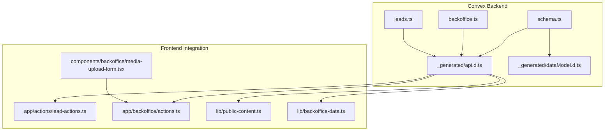
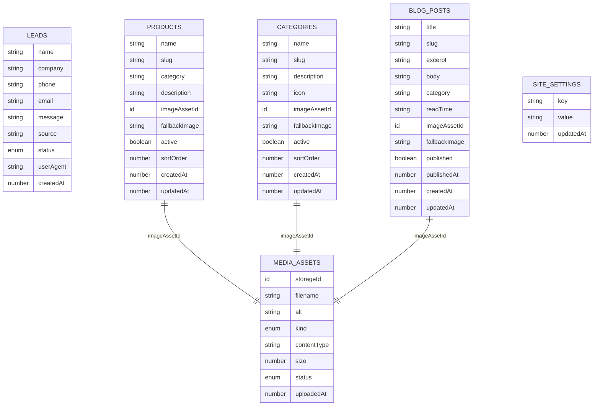
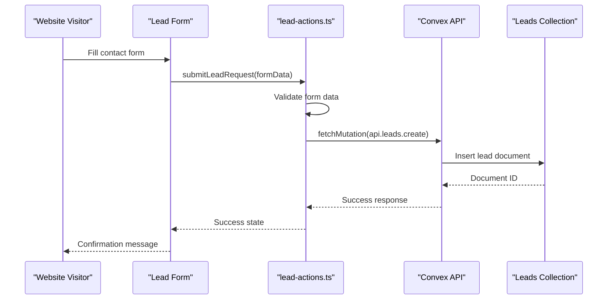
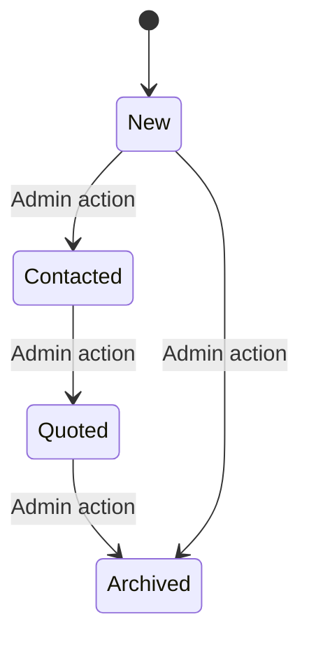
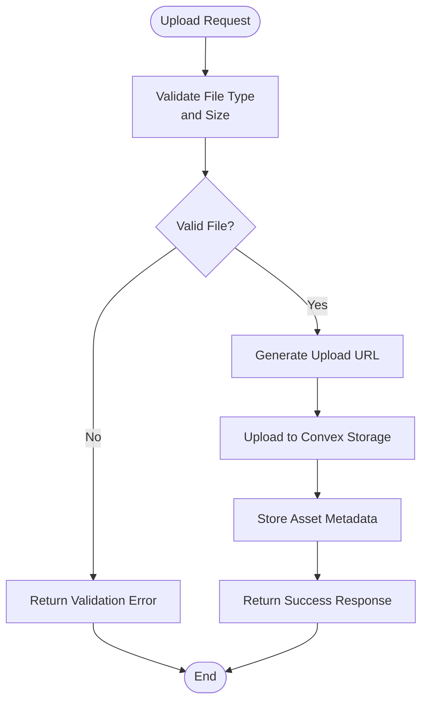
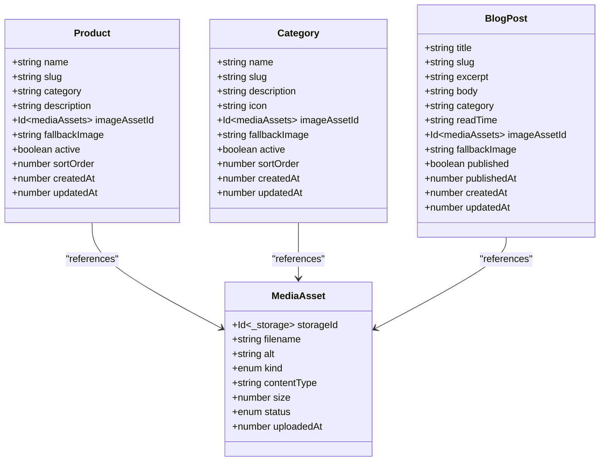
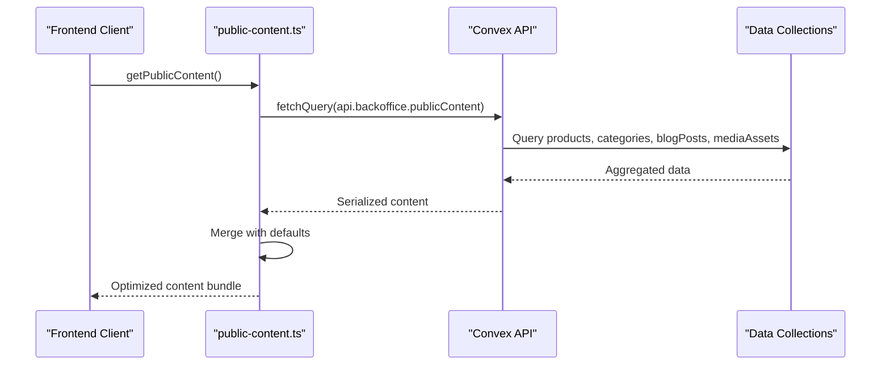
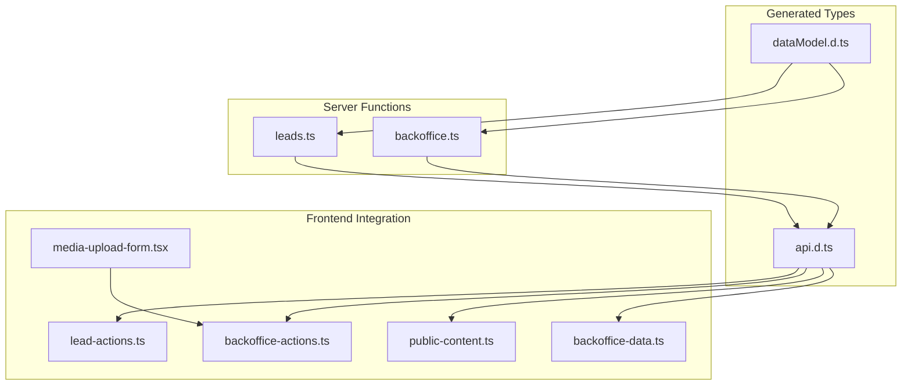

# Database Schema & Data Models

<cite>
**Referenced Files in This Document**
- [schema.ts](file://convex/schema.ts)
- [backoffice.ts](file://convex/backoffice.ts)
- [leads.ts](file://convex/leads.ts)
- [api.d.ts](file://convex/_generated/api.d.ts)
- [dataModel.d.ts](file://convex/_generated/dataModel.d.ts)
- [lead-actions.ts](file://app/actions/lead-actions.ts)
- [actions.ts](file://app/backoffice/actions.ts)
- [media-upload-form.tsx](file://components/backoffice/media-upload-form.tsx)
- [backoffice-data.ts](file://lib/backoffice-data.ts)
- [public-content.ts](file://lib/public-content.ts)
</cite>

## Table of Contents
1. [Introduction](#introduction)
2. [Project Structure](#project-structure)
3. [Core Components](#core-components)
4. [Architecture Overview](#architecture-overview)
5. [Detailed Component Analysis](#detailed-component-analysis)
6. [Dependency Analysis](#dependency-analysis)
7. [Performance Considerations](#performance-considerations)
8. [Troubleshooting Guide](#troubleshooting-guide)
9. [Conclusion](#conclusion)

## Introduction
This document provides comprehensive data model documentation for the Convex database schema used in the ADIKI ALVANIR Angola website. It details the complete schema definition including all collections, entities, and their relationships. The focus areas include:

- Lead collection for customer inquiries with status tracking and timestamps
- Product collection with categorization, pricing, and inventory management fields
- Category collection for product classification and organization
- BlogPost collection for content management with publishing workflows
- MediaAsset collection for image and file management with metadata and storage integration
- Field definitions, data types, validation rules, and indexing strategies
- Collection relationships and referential integrity constraints
- Data access patterns, query optimization strategies, and performance considerations
- Data lifecycle management, retention policies, and archival procedures
- Examples of common data operations and integration patterns with frontend components

## Project Structure
The database schema is defined in the Convex backend with generated TypeScript types and Next.js integration for frontend consumption. The key files include:

**Diagram sources**
- [schema.ts:1-87](file://convex/schema.ts#L1-L87)
- [backoffice.ts:1-385](file://convex/backoffice.ts#L1-L385)
- [leads.ts:1-32](file://convex/leads.ts#L1-L32)
- [api.d.ts:1-52](file://convex/_generated/api.d.ts#L1-L52)
- [dataModel.d.ts:1-61](file://convex/_generated/dataModel.d.ts#L1-L61)

**Section sources**
- [schema.ts:1-87](file://convex/schema.ts#L1-L87)
- [api.d.ts:1-52](file://convex/_generated/api.d.ts#L1-L52)
- [dataModel.d.ts:1-61](file://convex/_generated/dataModel.d.ts#L1-L61)

## Core Components

### Database Schema Definition
The Convex schema defines five primary collections with their field definitions and indexing strategies:

#### Leads Collection
The leads collection captures customer inquiry data with comprehensive tracking capabilities:

| Field | Type | Description | Validation |
|-------|------|-------------|------------|
| name | string | Customer's full name | Required, min length 2 |
| company | string | Company name (optional) | Max length 140 |
| phone | string | Contact phone number | Required, min length 6 |
| email | string | Email address (optional) | Valid email format |
| message | string | Inquiry details | Required, min length 10 |
| source | string | Origin of inquiry | Required, max length 80 |
| status | enum | Lead lifecycle status | new, contacted, quoted, archived |
| userAgent | string | Browser information (optional) | Max length 240 |
| createdAt | number | Timestamp of creation | Unix timestamp |

Indexing Strategy:
- `by_status`: Single-field index for status filtering
- `by_created_at`: Single-field index for chronological ordering

#### MediaAssets Collection
The mediaAssets collection manages image and file storage with metadata:

| Field | Type | Description | Validation |
|-------|------|-------------|------------|
| storageId | id(_storage) | Convex storage reference | Required |
| filename | string | Original file name | Required, max length 180 |
| alt | string | Alternative text for accessibility | Required, max length 180 |
| kind | enum | Asset classification | hero, product, category, blog, logo, general |
| contentType | string | MIME type | Required, max length 80 |
| size | number | File size in bytes | Required |
| status | enum | Asset lifecycle | active, archived |
| uploadedAt | number | Upload timestamp | Unix timestamp |

Indexing Strategy:
- `by_kind_and_status`: Composite index for kind and status filtering
- `by_status_and_uploaded_at`: Composite index for status and time ordering

#### Products Collection
The products collection handles product catalog management:

| Field | Type | Description | Validation |
|-------|------|-------------|------------|
| name | string | Product name | Required |
| slug | string | URL-friendly identifier | Required, max length 80 |
| category | string | Product category | Required |
| description | string | Product details | Required |
| imageAssetId | id(mediaAssets) | Associated media asset (optional) | References mediaAssets |
| fallbackImage | string | Backup image URL (optional) | Max length 2000 |
| active | boolean | Availability status | Required |
| sortOrder | number | Display priority | Required |
| createdAt | number | Creation timestamp | Unix timestamp |
| updatedAt | number | Last modification timestamp | Unix timestamp |

Indexing Strategy:
- `by_active_and_sort_order`: Composite index for active products and sorting
- `by_slug`: Single-field index for URL-based lookup

#### Categories Collection
The categories collection manages product classification:

| Field | Type | Description | Validation |
|-------|------|-------------|------------|
| name | string | Category name | Required |
| slug | string | URL-friendly identifier | Required, max length 80 |
| description | string | Category details | Required |
| icon | string | Icon identifier | Required |
| imageAssetId | id(mediaAssets) | Associated media asset (optional) | References mediaAssets |
| fallbackImage | string | Backup image URL (optional) | Max length 2000 |
| active | boolean | Availability status | Required |
| sortOrder | number | Display priority | Required |
| createdAt | number | Creation timestamp | Unix timestamp |
| updatedAt | number | Last modification timestamp | Unix timestamp |

Indexing Strategy:
- `by_active_and_sort_order`: Composite index for active categories and sorting
- `by_slug`: Single-field index for URL-based lookup

#### BlogPosts Collection
The blogPosts collection manages content publishing workflows:

| Field | Type | Description | Validation |
|-------|------|-------------|------------|
| title | string | Post title | Required |
| slug | string | URL-friendly identifier | Required, max length 80 |
| excerpt | string | Preview text | Required |
| body | string | Full content (optional) | Max length 20000 |
| category | string | Content category | Required |
| readTime | string | Estimated reading time | Required |
| imageAssetId | id(mediaAssets) | Associated media asset (optional) | References mediaAssets |
| fallbackImage | string | Backup image URL (optional) | Max length 2000 |
| published | boolean | Publication status | Required |
| publishedAt | number | Publication timestamp | Unix timestamp |
| createdAt | number | Creation timestamp | Unix timestamp |
| updatedAt | number | Last modification timestamp | Unix timestamp |

Indexing Strategy:
- `by_published_and_published_at`: Composite index for published posts and time ordering
- `by_slug`: Single-field index for URL-based lookup

#### SiteSettings Collection
The siteSettings collection manages global configuration:

| Field | Type | Description | Validation |
|-------|------|-------------|------------|
| key | string | Setting identifier | Required |
| value | string | Setting value | Required |
| updatedAt | number | Last modification timestamp | Unix timestamp |

Indexing Strategy:
- `by_key`: Single-field index for key-based lookup

**Section sources**
- [schema.ts:4-86](file://convex/schema.ts#L4-L86)

## Architecture Overview

**Diagram sources**
- [schema.ts:4-86](file://convex/schema.ts#L4-L86)

## Detailed Component Analysis

### Lead Management System

The lead management system provides comprehensive customer inquiry tracking with status management and analytics capabilities.

**Diagram sources**
- [lead-actions.ts:32-95](file://app/actions/lead-actions.ts#L32-L95)
- [leads.ts:7-24](file://convex/leads.ts#L7-L24)

#### Lead Status Workflow
The lead status follows a defined lifecycle with specific transitions:

**Diagram sources**
- [schema.ts:12](file://convex/schema.ts#L12)
- [backoffice.ts:18-23](file://convex/backoffice.ts#L18-L23)

#### Lead Data Operations
Common lead operations include creation, status updates, and bulk retrieval:

**Section sources**
- [leads.ts:7-31](file://convex/leads.ts#L7-L31)
- [backoffice.ts:147-161](file://convex/backoffice.ts#L147-L161)
- [backoffice-data.ts:6-20](file://lib/backoffice-data.ts#L6-L20)

### Media Asset Management

The media asset system integrates with Convex Storage for efficient image and file management.

**Diagram sources**
- [media-upload-form.tsx:19-77](file://components/backoffice/media-upload-form.tsx#L19-L77)
- [backoffice.ts:68-108](file://convex/backoffice.ts#L68-L108)

#### Media Asset Classification
Assets are categorized for different use cases within the application:

| Kind | Purpose | Example Usage |
|------|---------|---------------|
| hero | Hero banner images | Homepage hero section |
| product | Product photography | Product catalog images |
| category | Category thumbnails | Navigation and browsing |
| blog | Blog content images | Article illustrations |
| logo | Brand logos | Header and footer branding |
| general | Miscellaneous assets | Icons and decorative elements |

#### Media Access Patterns
The system provides optimized access patterns for different scenarios:

**Section sources**
- [backoffice.ts:33-52](file://convex/backoffice.ts#L33-L52)
- [backoffice.ts:319-384](file://convex/backoffice.ts#L319-L384)
- [media-upload-form.tsx:11-12](file://components/backoffice/media-upload-form.tsx#L11-L12)

### Content Management System

The content management system provides comprehensive product, category, and blog post management capabilities.

**Diagram sources**
- [schema.ts:37-85](file://convex/schema.ts#L37-L85)

#### Content Publishing Workflow
Blog posts follow a structured publishing workflow with approval and scheduling capabilities.

**Section sources**
- [backoffice.ts:260-299](file://convex/backoffice.ts#L260-L299)
- [schema.ts:65-85](file://convex/schema.ts#L65-L85)

### Public Content Delivery

The public content system aggregates and optimizes data for frontend consumption.

**Diagram sources**
- [public-content.ts:65-106](file://lib/public-content.ts#L65-L106)
- [backoffice.ts:319-384](file://convex/backoffice.ts#L319-L384)

**Section sources**
- [public-content.ts:65-106](file://lib/public-content.ts#L65-L106)
- [backoffice.ts:319-384](file://convex/backoffice.ts#L319-L384)

## Dependency Analysis

**Diagram sources**
- [api.d.ts:20-36](file://convex/_generated/api.d.ts#L20-L36)
- [dataModel.d.ts:30-60](file://convex/_generated/dataModel.d.ts#L30-L60)
- [leads.ts:1-32](file://convex/leads.ts#L1-L32)
- [backoffice.ts:1-385](file://convex/backoffice.ts#L1-L385)

### Relationship Dependencies
The schema establishes clear referential relationships between collections:

- Products reference MediaAssets through imageAssetId
- Categories reference MediaAssets through imageAssetId  
- BlogPosts reference MediaAssets through imageAssetId
- All collections use Unix timestamps for temporal tracking

**Section sources**
- [schema.ts:42](file://convex/schema.ts#L42)
- [schema.ts:56](file://convex/schema.ts#L56)
- [schema.ts:72](file://convex/schema.ts#L72)

## Performance Considerations

### Indexing Strategy Analysis
The schema employs strategic indexing for optimal query performance:

#### Single-Field Indexes
- `by_status`: Efficient filtering for lead status queries
- `by_created_at`: Fast chronological ordering for recent items
- `by_slug`: Direct URL-based lookups for products, categories, and blog posts
- `by_key`: Quick configuration lookups

#### Composite Indexes
- `by_kind_and_status`: Multi-dimensional filtering for media asset queries
- `by_status_and_uploaded_at`: Combined status and time-based queries
- `by_active_and_sort_order`: Priority-based content retrieval
- `by_published_and_published_at`: Published content ordering

### Query Optimization Patterns
Recommended query patterns leverage the defined indexes:

1. **Recent Items**: Use `withIndex("by_created_at").order("desc")` for chronological lists
2. **Active Content**: Apply equality filters on boolean fields before ordering
3. **Category Filtering**: Combine category filters with sort order for product catalogs
4. **Published Posts**: Filter by published status before applying date ordering

### Data Access Patterns
The frontend integration demonstrates efficient data access patterns:

- **Bulk Operations**: Parallel queries using Promise.all for dashboard views
- **Pagination Limits**: MAX_ITEMS constant prevents excessive data transfer
- **Selective Loading**: Only load required fields for list views
- **Caching Strategy**: Revalidation paths ensure data freshness

**Section sources**
- [backoffice.ts:7](file://convex/backoffice.ts#L7)
- [backoffice.ts:125-131](file://convex/backoffice.ts#L125-L131)
- [backoffice.ts:322-327](file://convex/backoffice.ts#L322-L327)

## Troubleshooting Guide

### Common Issues and Solutions

#### Data Validation Errors
- **Lead Form Validation**: Ensure minimum field lengths are met before submission
- **Media Upload Validation**: Verify file type restrictions and size limits
- **Slug Generation**: Confirm unique slugs for URL-based routing

#### Query Performance Issues
- **Missing Indexes**: Add appropriate indexes for frequently queried fields
- **Large Result Sets**: Implement pagination using take() with MAX_ITEMS limit
- **N+1 Queries**: Use Promise.all for concurrent data fetching

#### Storage Integration Problems
- **Upload URL Generation**: Verify admin key authentication before upload
- **Asset Status**: Ensure assets are marked as "active" for public access
- **URL Resolution**: Check storageId validity and asset existence

#### Frontend Integration Issues
- **API Configuration**: Confirm NEXT_PUBLIC_CONVEX_URL environment variable
- **Type Safety**: Use generated types for compile-time validation
- **Revalidation**: Trigger cache revalidation after data mutations

**Section sources**
- [lead-actions.ts:58-70](file://app/actions/lead-actions.ts#L58-L70)
- [media-upload-form.tsx:32-42](file://components/backoffice/media-upload-form.tsx#L32-L42)
- [backoffice.ts:25-31](file://convex/backoffice.ts#L25-L31)

## Conclusion

The Convex database schema provides a robust foundation for the ADIKI ALVANIR Angola website with comprehensive support for customer lead management, product catalog operations, content publishing, and media asset handling. The schema design emphasizes:

- **Type Safety**: Generated TypeScript types ensure compile-time validation
- **Performance**: Strategic indexing enables efficient query execution
- **Scalability**: Modular design supports future feature expansion
- **Maintainability**: Clear separation of concerns across collections

The integration patterns demonstrate best practices for frontend-backend communication, including proper validation, caching strategies, and error handling. The schema provides a solid foundation for business growth while maintaining optimal performance characteristics.