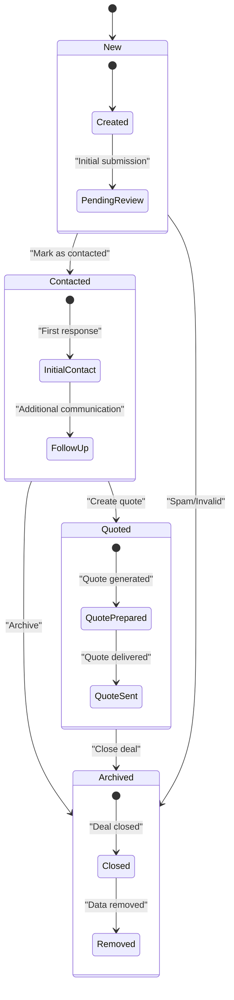
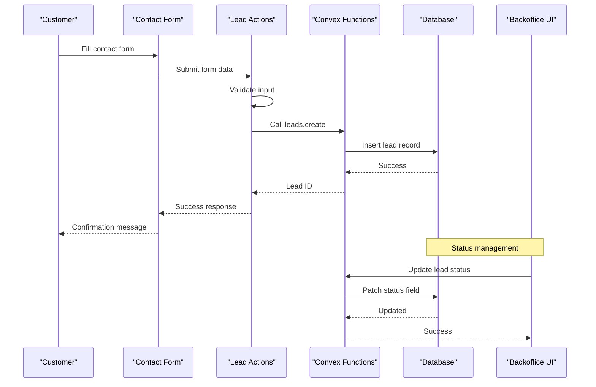
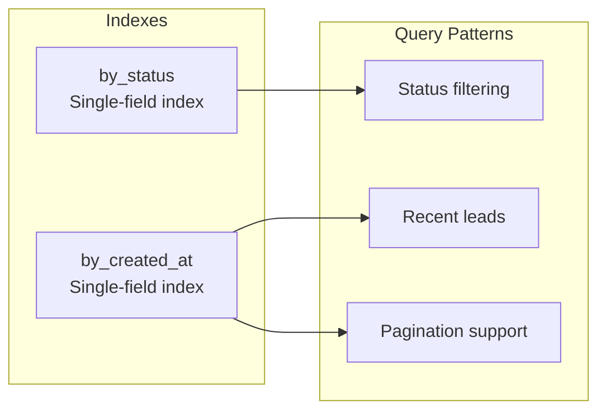
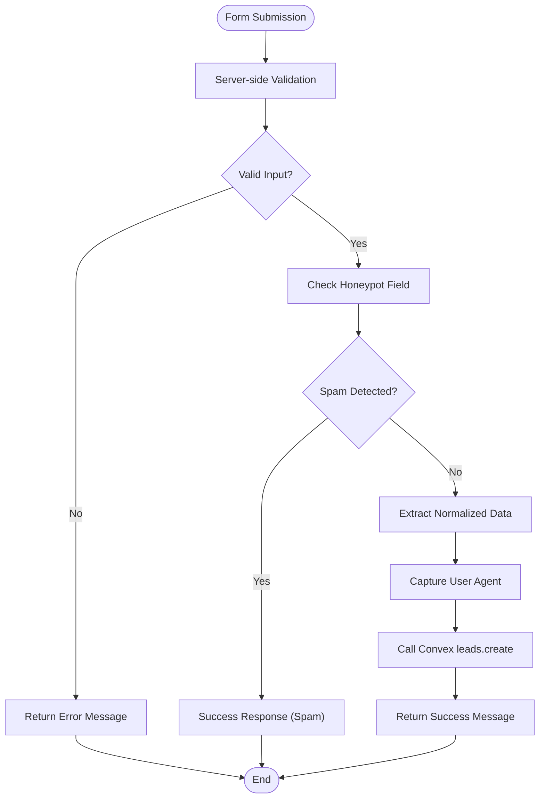
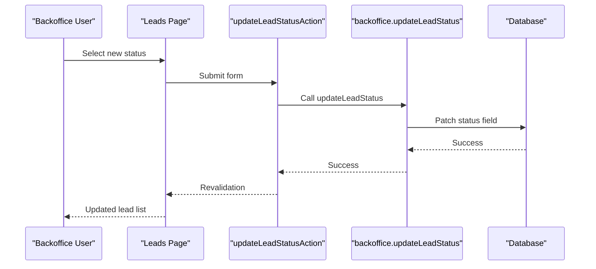
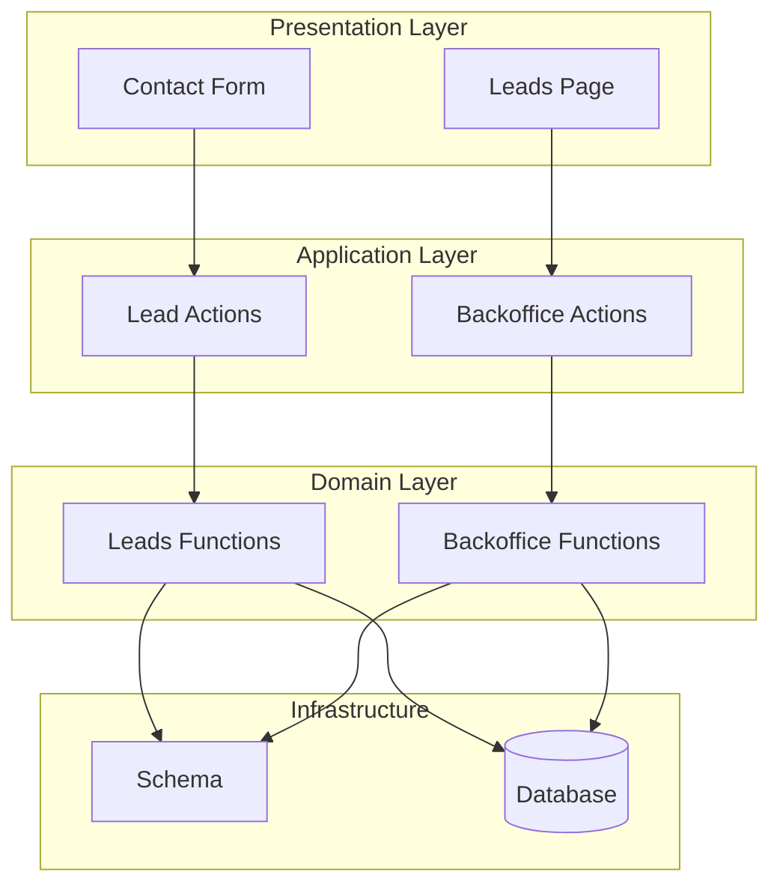

# Lead Data Model

<cite>
**Referenced Files in This Document**
- [schema.ts](file://convex/schema.ts)
- [leads.ts](file://convex/leads.ts)
- [backoffice.ts](file://convex/backoffice.ts)
- [lead-actions.ts](file://app/actions/lead-actions.ts)
- [contact-form.tsx](file://components/site/contact-form.tsx)
- [leads-page.tsx](file://app/backoffice/(admin)/leads/page.tsx)
- [backoffice-data.ts](file://lib/backoffice-data.ts)
- [CONVEX.md](file://docs/CONVEX.md)
</cite>

## Table of Contents
1. [Introduction](#introduction)
2. [Project Structure](#project-structure)
3. [Core Components](#core-components)
4. [Architecture Overview](#architecture-overview)
5. [Detailed Component Analysis](#detailed-component-analysis)
6. [Dependency Analysis](#dependency-analysis)
7. [Performance Considerations](#performance-considerations)
8. [Troubleshooting Guide](#troubleshooting-guide)
9. [Conclusion](#conclusion)

## Introduction
This document provides comprehensive documentation for the Lead data model used in customer inquiry management. It covers the complete lead structure, status lifecycle, validation rules, indexing strategy, and integration patterns with the contact form and backoffice management interface. The Lead model is implemented using Convex for data persistence and Next.js for the frontend, enabling a streamlined customer inquiry workflow from submission to status management.

## Project Structure
The Lead data model spans several key areas of the application:
- Convex schema and functions define the data structure and operations
- Frontend contact form handles user submissions
- Server actions validate and process form data
- Backoffice interface manages lead status updates

```mermaid
graph TB
subgraph "Frontend"
CF[Contact Form<br/>components/site/contact-form.tsx]
LA[Lead Actions<br/>app/actions/lead-actions.ts]
BO[Backoffice Leads Page<br/>app/backoffice/(admin)/leads/page.tsx]
end
subgraph "Convex Backend"
SC[Schema<br/>convex/schema.ts]
LF[Leads Functions<br/>convex/leads.ts]
BF[Backoffice Functions<br/>convex/backoffice.ts]
end
subgraph "Data Layer"
DB[(Convex Database)]
ST[(Convex Storage)]
end
CF --> LA
LA --> LF
BO --> BF
LF --> DB
BF --> DB
LF --> ST
BF --> ST
```

**Diagram sources**
- [contact-form.tsx:1-92](file://components/site/contact-form.tsx#L1-L92)
- [lead-actions.ts:1-96](file://app/actions/lead-actions.ts#L1-L96)
- [leads.ts:1-32](file://convex/leads.ts#L1-L32)
- [backoffice.ts:1-385](file://convex/backoffice.ts#L1-L385)

**Section sources**
- [CONVEX.md:1-59](file://docs/CONVEX.md#L1-L59)

## Core Components
The Lead data model consists of the following core components:

### Data Schema Definition
The lead schema defines the complete structure with strict typing and validation:

```mermaid
erDiagram
LEADS {
string name
string company
string phone
string email
string message
string source
enum status
string userAgent
number createdAt
}
STATUS_ENUM {
"new" "contacted" "quoted" "archived"
}
LEADS ||--|| STATUS_ENUM : "has one"
```

**Diagram sources**
- [schema.ts:5-17](file://convex/schema.ts#L5-L17)

### Status Lifecycle Management
The lead status follows a defined progression controlled by the backoffice interface:



**Diagram sources**
- [backoffice.ts:155-161](file://convex/backoffice.ts#L155-L161)

**Section sources**
- [schema.ts:4-17](file://convex/schema.ts#L4-L17)
- [backoffice.ts:18-23](file://convex/backoffice.ts#L18-L23)

## Architecture Overview
The Lead system follows a client-server architecture with Convex as the backend-as-a-service:



**Diagram sources**
- [contact-form.tsx:17-91](file://components/site/contact-form.tsx#L17-L91)
- [lead-actions.ts:32-95](file://app/actions/lead-actions.ts#L32-L95)
- [leads.ts:7-24](file://convex/leads.ts#L7-L24)
- [backoffice.ts:155-161](file://convex/backoffice.ts#L155-L161)

## Detailed Component Analysis

### Lead Data Model Structure
The Lead entity contains the following fields with their validation characteristics:

| Field | Type | Required | Validation | Description |
|-------|------|----------|------------|-------------|
| name | string | Yes | min 2 chars, max 120 | Customer's full name |
| company | string | No | max 140 | Company name (optional) |
| phone | string | Yes | min 6 chars, max 40 | Contact phone number |
| email | string | No | email format, max 160 | Email address (optional) |
| message | string | Yes | min 10 chars, max 1200 | Inquiry details |
| source | string | Yes | max 80 | Origin of inquiry |
| status | enum | Yes | new/contacted/quoted/archived | Business workflow state |
| userAgent | string | No | max 240 | Browser/device information |
| createdAt | number | Yes | timestamp | Creation timestamp |

**Section sources**
- [schema.ts:6-14](file://convex/schema.ts#L6-L14)
- [lead-actions.ts:51-56](file://app/actions/lead-actions.ts#L51-L56)

### Status Enum Values and Business Meaning
The status field controls the lead lifecycle with four distinct states:

1. **new**: Initial submission requiring review
   - Automatically assigned during creation
   - Indicates fresh inquiry awaiting initial response

2. **contacted**: Initial contact established
   - Manual status change after first communication
   - Marks lead as acknowledged and in progress

3. **quoted**: Quotation prepared/sent
   - Used when commercial proposal is created
   - Indicates active sales process

4. **archived**: Final state for closure
   - Can be set manually or automatically
   - Used for deal closure or invalid entries

**Section sources**
- [schema.ts:12](file://convex/schema.ts#L12)
- [backoffice.ts:18-23](file://convex/backoffice.ts#L18-L23)

### Timestamp Fields and Tracking
The system maintains temporal information for lead management:

- **createdAt**: Automatic timestamp during creation
  - Stored as Unix milliseconds
  - Enables chronological sorting and reporting
  - Supports analytics and historical tracking

- **updatedAt**: Not present in schema
  - Current implementation focuses on creation tracking
  - Future enhancements could include update timestamps

**Section sources**
- [schema.ts:14](file://convex/schema.ts#L14)
- [leads.ts:20-22](file://convex/leads.ts#L20-L22)

### User Agent Tracking
The system captures browser and device information for analytics:

- **userAgent**: Optional field capturing client details
- Maximum length: 240 characters
- Purpose: Browser detection, device analytics, and support troubleshooting
- Stored as-is without parsing for privacy compliance

**Section sources**
- [schema.ts:13](file://convex/schema.ts#L13)
- [lead-actions.ts:82](file://app/actions/lead-actions.ts#L82)

### Indexing Strategy for Efficient Querying
The schema implements strategic indexing for optimal performance:



**Diagram sources**
- [schema.ts:16-17](file://convex/schema.ts#L16-L17)

**Index Details:**
- `by_status`: Optimizes filtering by lead state
- `by_created_at`: Enables chronological queries and pagination

**Section sources**
- [schema.ts:16-17](file://convex/schema.ts#L16-L17)
- [leads.ts:29](file://convex/leads.ts#L29)

### Validation Rules and Optional Field Handling
The system implements comprehensive validation at multiple levels:

#### Frontend Validation
- HTML5 constraints enforced by form elements
- Real-time feedback for required fields
- Length limits for all text inputs

#### Server-Side Validation
- Input sanitization and normalization
- Email format verification
- Spam protection via honeypot field
- Environment configuration checks

#### Database-Level Validation
- Convex schema validation
- Type enforcement and constraints
- Optional field handling

**Section sources**
- [contact-form.tsx:41-64](file://components/site/contact-form.tsx#L41-L64)
- [lead-actions.ts:58-70](file://app/actions/lead-actions.ts#L58-L70)
- [schema.ts:6-14](file://convex/schema.ts#L6-L14)

### Lead Creation Workflows
The lead creation process follows a structured workflow:



**Diagram sources**
- [lead-actions.ts:32-95](file://app/actions/lead-actions.ts#L32-L95)

**Section sources**
- [lead-actions.ts:32-95](file://app/actions/lead-actions.ts#L32-L95)
- [leads.ts:7-24](file://convex/leads.ts#L7-L24)

### Status Transition Management
The backoffice interface provides controlled status management:



**Diagram sources**
- [leads-page.tsx:40-59](file://app/backoffice/(admin)/leads/page.tsx#L40-L59)
- [backoffice.ts:155-161](file://convex/backoffice.ts#L155-L161)

**Section sources**
- [leads-page.tsx:40-59](file://app/backoffice/(admin)/leads/page.tsx#L40-L59)
- [backoffice.ts:155-161](file://convex/backoffice.ts#L155-L161)

### Common Query Patterns
The system supports several query patterns optimized by indexing:

#### Recent Leads Query
- Retrieves latest leads using `by_created_at` index
- Limits results to prevent performance issues
- Supports pagination through take() operation

#### Status-Based Filtering
- Filters leads by current status
- Enables workflow dashboards and reporting
- Supports real-time lead management views

**Section sources**
- [leads.ts:26-31](file://convex/leads.ts#L26-L31)
- [backoffice.ts:147-153](file://convex/backoffice.ts#L147-L153)

### Integration Patterns
The Lead system integrates with multiple components:

#### Contact Form Integration
- Client-side form with server action submission
- Real-time validation and feedback
- Hidden honeypot field for spam protection

#### Backoffice Integration
- Protected admin interface with session authentication
- Direct status update capabilities
- Comprehensive lead management dashboard

**Section sources**
- [contact-form.tsx:17-91](file://components/site/contact-form.tsx#L17-L91)
- [leads-page.tsx:8-72](file://app/backoffice/(admin)/leads/page.tsx#L8-L72)

## Dependency Analysis
The Lead system exhibits clean separation of concerns with minimal coupling:



**Diagram sources**
- [contact-form.tsx:6](file://components/site/contact-form.tsx#L6)
- [lead-actions.ts:6](file://app/actions/lead-actions.ts#L6)
- [leads-page.tsx:1](file://app/backoffice/(admin)/leads/page.tsx#L1)
- [backoffice.ts:3](file://convex/backoffice.ts#L3)

**Section sources**
- [backoffice-data.ts:14-16](file://lib/backoffice-data.ts#L14-L16)

## Performance Considerations
The Lead system is designed for optimal performance through several mechanisms:

### Indexing Strategy
- Single-field indexes on frequently queried fields
- Optimized for common query patterns
- Minimal index overhead for write operations

### Query Limiting
- Maximum result limits prevent memory issues
- Pagination support for large datasets
- Efficient cursor-based navigation

### Data Size Optimization
- Character limits reduce storage requirements
- Optional fields minimize unnecessary data
- Compact timestamp representation

## Troubleshooting Guide

### Common Issues and Solutions

#### Form Submission Failures
**Symptoms**: Users receive error messages when submitting the contact form
**Causes**:
- Missing NEXT_PUBLIC_CONVEX_URL environment variable
- Invalid email format
- Required field validation failures
- Spam bot detection via honeypot

**Solutions**:
- Verify Convex deployment URL configuration
- Check email format validation
- Ensure required fields meet minimum length requirements
- Confirm honeypot field remains hidden

#### Lead Status Update Problems
**Symptoms**: Backoffice status changes not persisting
**Causes**:
- Authentication failures
- Invalid status values
- Database connectivity issues

**Solutions**:
- Verify BACKOFFICE_API_KEY configuration
- Check admin session validity
- Review database connection status

#### Performance Issues
**Symptoms**: Slow lead loading or status updates
**Causes**:
- Excessive lead volume
- Missing indexes
- Network latency

**Solutions**:
- Implement pagination for large datasets
- Verify index usage with Convex monitoring
- Optimize network configuration

**Section sources**
- [lead-actions.ts:44-49](file://app/actions/lead-actions.ts#L44-L49)
- [lead-actions.ts:65-70](file://app/actions/lead-actions.ts#L65-L70)
- [CONVEX.md:50-59](file://docs/CONVEX.md#L50-L59)

## Conclusion
The Lead data model provides a robust foundation for customer inquiry management with clear business semantics, comprehensive validation, and efficient querying capabilities. The implementation balances simplicity with functionality, supporting essential workflows while maintaining performance and security standards. The modular architecture enables easy extension for future requirements such as additional status states, enhanced analytics, or integration with external systems.

The system successfully addresses the core requirements of customer inquiry management through:
- Clear status lifecycle definition
- Comprehensive input validation
- Efficient indexing strategy
- Secure backoffice management
- Real-time user feedback
- Scalable performance characteristics

Future enhancements could include extended status tracking, automated workflows, or integration with CRM systems, all while maintaining the current architectural principles.