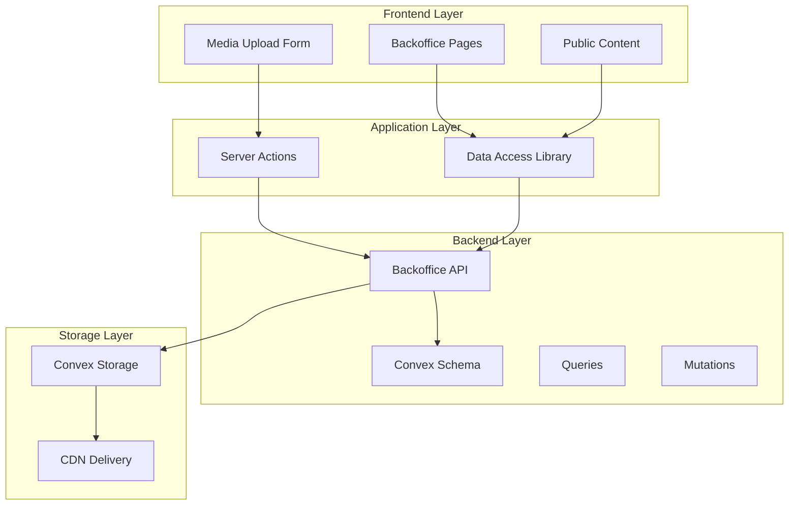
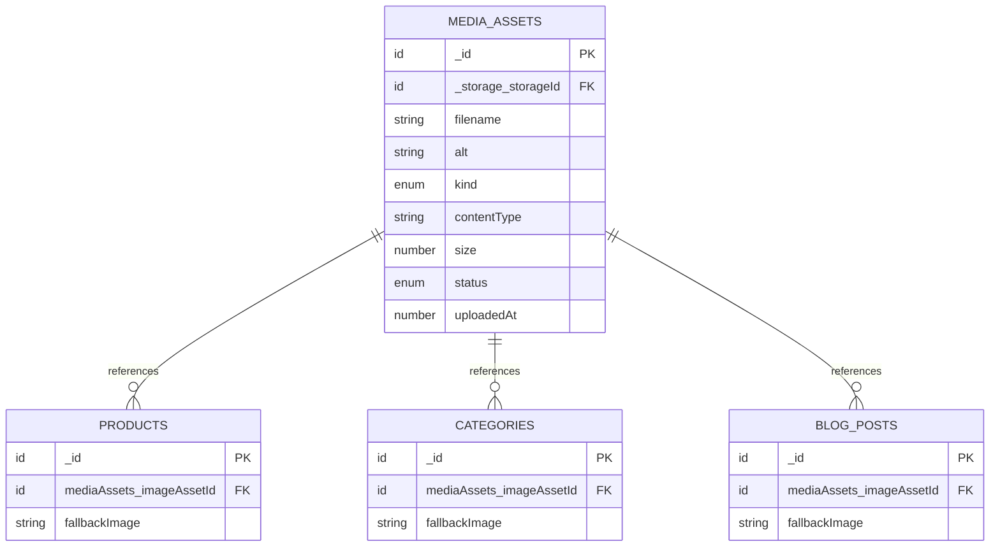
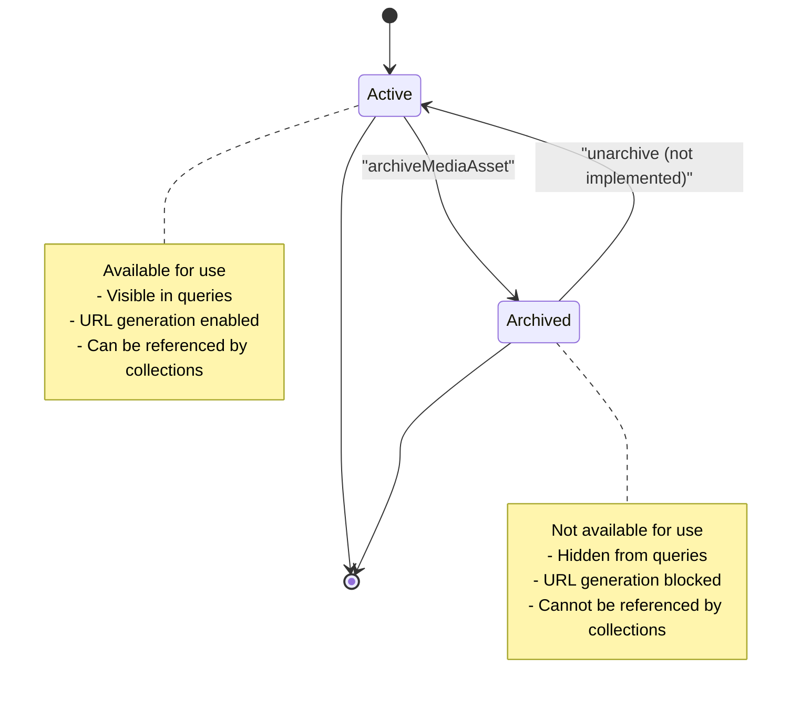
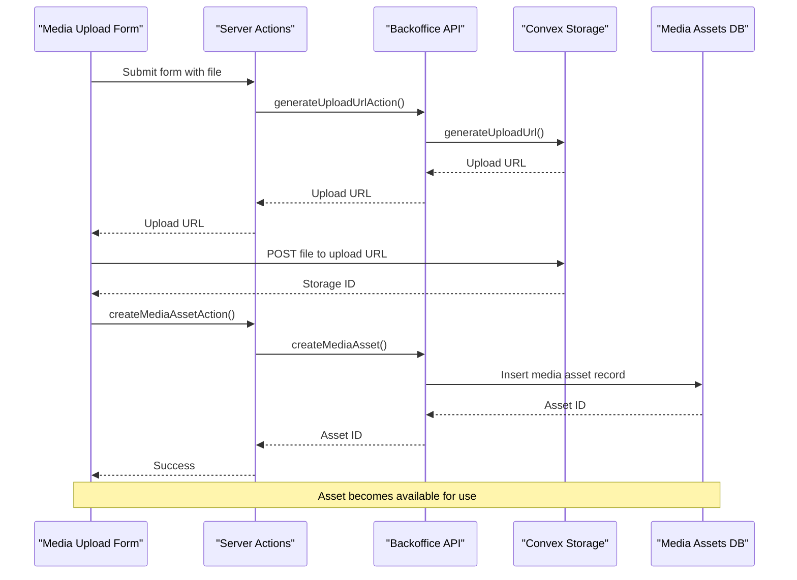
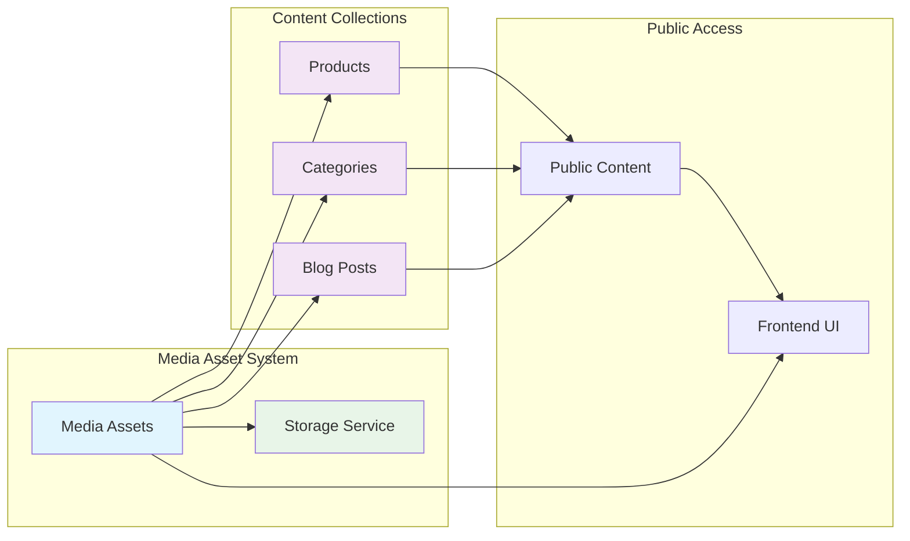
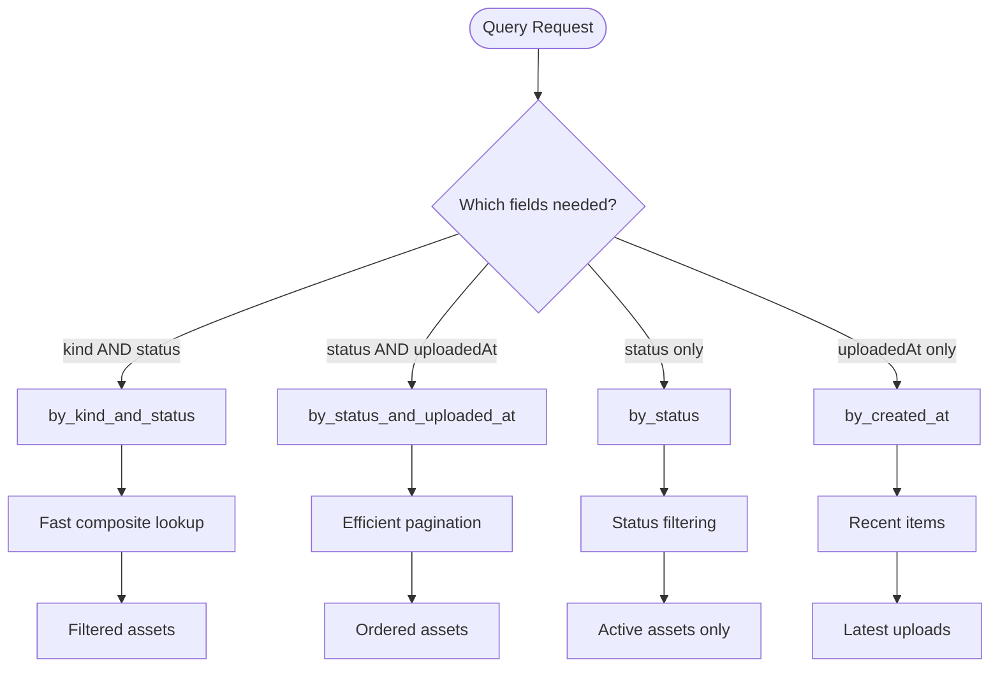
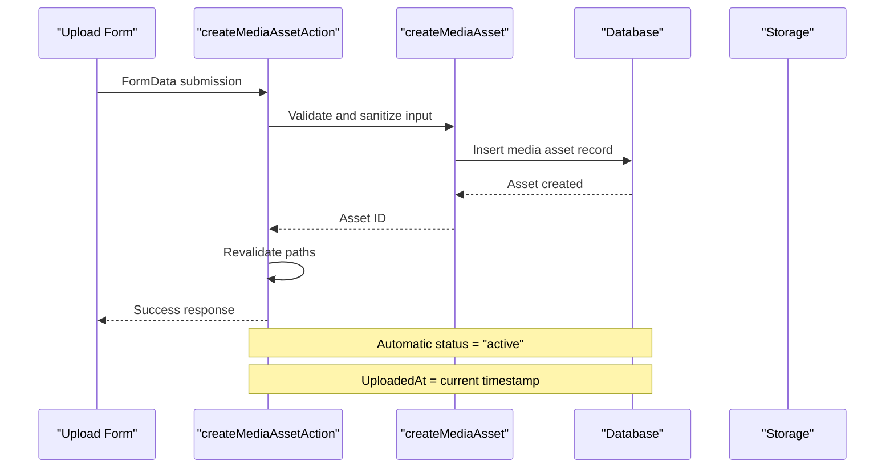
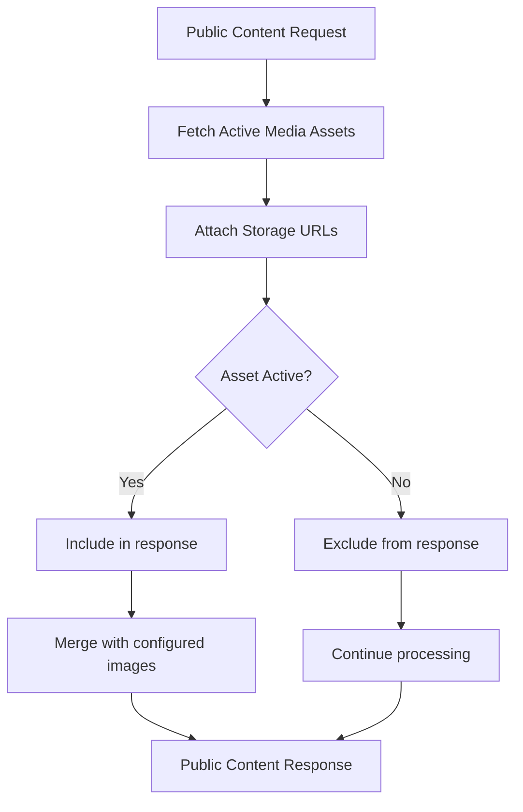
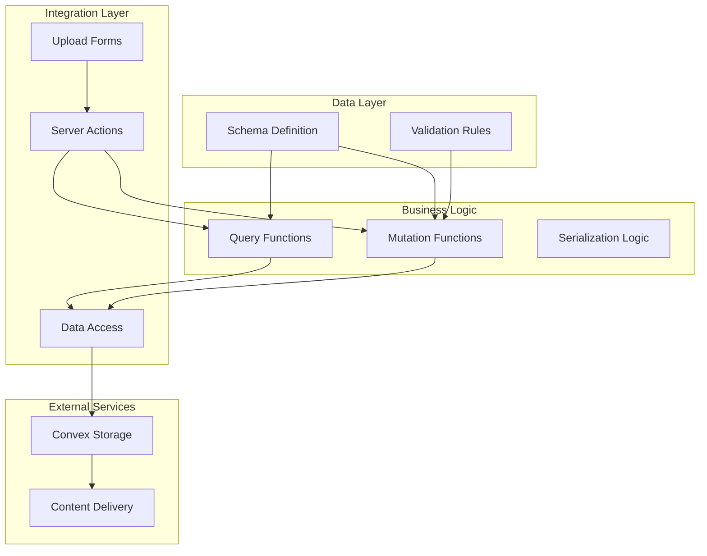

# Media Asset Data Model

<cite>
**Referenced Files in This Document**
- [schema.ts](file://convex/schema.ts)
- [backoffice.ts](file://convex/backoffice.ts)
- [media-upload-form.tsx](file://components/backoffice/media-upload-form.tsx)
- [actions.ts](file://app/backoffice/actions.ts)
- [page.tsx](file://app/backoffice/(admin)/media/page.tsx)
- [backoffice-data.ts](file://lib/backoffice-data.ts)
- [public-content.ts](file://lib/public-content.ts)
</cite>

## Table of Contents
1. [Introduction](#introduction)
2. [Project Structure](#project-structure)
3. [Core Components](#core-components)
4. [Architecture Overview](#architecture-overview)
5. [Detailed Component Analysis](#detailed-component-analysis)
6. [Dependency Analysis](#dependency-analysis)
7. [Performance Considerations](#performance-considerations)
8. [Troubleshooting Guide](#troubleshooting-guide)
9. [Conclusion](#conclusion)

## Introduction
This document provides comprehensive documentation for the Media Asset data model used for image and file management in the application. The media asset system is built on Convex database with dedicated storage integration, supporting structured metadata management, classification through kind enums, and efficient indexing for common query patterns.

The system manages image uploads, metadata validation, status management, and seamless integration with product, category, and blog post collections. It provides robust storage integration with automatic URL generation and access control.

## Project Structure
The media asset system spans multiple layers of the application architecture:



**Diagram sources**
- [schema.ts:18-36](file://convex/schema.ts#L18-L36)
- [backoffice.ts:68-108](file://convex/backoffice.ts#L68-L108)
- [media-upload-form.tsx:14-77](file://components/backoffice/media-upload-form.tsx#L14-L77)

**Section sources**
- [schema.ts:1-87](file://convex/schema.ts#L1-L87)
- [backoffice.ts:1-385](file://convex/backoffice.ts#L1-L385)

## Core Components

### Media Assets Collection Definition
The media assets collection defines the complete data structure for image and file management:



**Diagram sources**
- [schema.ts:18-36](file://convex/schema.ts#L18-L36)
- [schema.ts:42-42](file://convex/schema.ts#L42-L42)
- [schema.ts:56-56](file://convex/schema.ts#L56-L56)
- [schema.ts:72-72](file://convex/schema.ts#L72-L72)

### Kind Enum Classification System
The kind enum provides structured categorization for different types of media assets:

| Kind Value | Usage Context | Typical File Names |
|------------|---------------|-------------------|
| `hero` | Homepage hero banner images | "Acessórios de mesa.png", "Acessorios de mesa.png" |
| `product` | Individual product images | Product-specific imagery |
| `category` | Category listing and navigation | Category-specific icons and banners |
| `blog` | Blog post featured images | Article header and thumbnail images |
| `logo` | Brand identity and corporate images | Company logos and branding elements |
| `general` | Miscellaneous and fallback images | Default images and placeholder content |

**Section sources**
- [schema.ts:22-29](file://convex/schema.ts#L22-L29)
- [backoffice.ts:9-16](file://convex/backoffice.ts#L9-L16)
- [backoffice.ts:331-348](file://convex/backoffice.ts#L331-L348)

### Status Management System
The status field controls asset availability and lifecycle:



**Diagram sources**
- [schema.ts:32-32](file://convex/schema.ts#L32-L32)
- [backoffice.ts:102-108](file://convex/backoffice.ts#L102-L108)

**Section sources**
- [schema.ts:32-32](file://convex/schema.ts#L32-L32)
- [backoffice.ts:102-108](file://convex/backoffice.ts#L102-L108)

## Architecture Overview

### Upload Workflow Architecture
The media asset upload process follows a secure, two-step workflow:



**Diagram sources**
- [media-upload-form.tsx:47-77](file://components/backoffice/media-upload-form.tsx#L47-L77)
- [actions.ts:79-108](file://app/backoffice/actions.ts#L79-L108)
- [backoffice.ts:68-100](file://convex/backoffice.ts#L68-L100)

### Integration Architecture
Media assets integrate seamlessly with other collections through foreign key relationships:



**Diagram sources**
- [schema.ts:42-42](file://convex/schema.ts#L42-L42)
- [schema.ts:56-56](file://convex/schema.ts#L56-L56)
- [schema.ts:72-72](file://convex/schema.ts#L72-L72)
- [backoffice.ts:319-384](file://convex/backoffice.ts#L319-L384)

**Section sources**
- [schema.ts:18-36](file://convex/schema.ts#L18-L36)
- [backoffice.ts:319-384](file://convex/backoffice.ts#L319-L384)

## Detailed Component Analysis

### Data Model Implementation

#### Schema Definition Analysis
The media assets schema defines strict validation rules and indexing strategies:

| Field | Type | Validation | Purpose |
|-------|------|------------|---------|
| `storageId` | `_storage` ID | Required | Convex Storage reference |
| `filename` | String | Max 180 chars | Original file name |
| `alt` | String | Max 180 chars | Accessibility text |
| `kind` | Enum | Fixed set | Asset classification |
| `contentType` | String | Max 80 chars | MIME type |
| `size` | Number | Positive integer | File size in bytes |
| `status` | Enum | `"active"` or `"archived"` | Availability status |
| `uploadedAt` | Number | Timestamp | Creation time |

**Section sources**
- [schema.ts:18-36](file://convex/schema.ts#L18-L36)
- [actions.ts:97-102](file://app/backoffice/actions.ts#L97-L102)

#### Indexing Strategy
The system implements strategic indexing for optimal query performance:



**Diagram sources**
- [schema.ts:35-36](file://convex/schema.ts#L35-L36)
- [backoffice.ts:110-118](file://convex/backoffice.ts#L110-L118)

**Section sources**
- [schema.ts:35-36](file://convex/schema.ts#L35-L36)
- [backoffice.ts:110-118](file://convex/backoffice.ts#L110-L118)

### Upload Workflow Implementation

#### Frontend Upload Form
The media upload form provides comprehensive validation and user feedback:

```mermaid
flowchart TD
FormLoad[Form Load] --> ValidateFile{File Selected?}
ValidateFile --> |No| Error1[Show "Select image" error]
ValidateFile --> |Yes| CheckType{Valid Type?}
CheckType --> |No| Error2[Show "Use JPG, PNG or WEBP" error]
CheckType --> |Yes| CheckSize{Within Size Limit?}
CheckSize --> |No| Error3[Show "Max 5MB" error]
CheckSize --> |Yes| UploadFile[Generate Upload URL]
UploadFile --> SendToStorage[Send to Convex Storage]
SendToStorage --> StorageSuccess{Upload Success?}
StorageSuccess --> |No| Error4[Show upload failure]
StorageSuccess --> |Yes| CreateAsset[Create Media Asset]
CreateAsset --> Success[Show success message]
Error1 --> FormLoad
Error2 --> FormLoad
Error3 --> FormLoad
Error4 --> FormLoad
```

**Diagram sources**
- [media-upload-form.tsx:19-77](file://components/backoffice/media-upload-form.tsx#L19-L77)

**Section sources**
- [media-upload-form.tsx:11-12](file://components/backoffice/media-upload-form.tsx#L11-L12)
- [media-upload-form.tsx:19-77](file://components/backoffice/media-upload-form.tsx#L19-L77)

#### Backend Processing Pipeline
The server-side processing ensures data integrity and security:



**Diagram sources**
- [actions.ts:84-108](file://app/backoffice/actions.ts#L84-L108)
- [backoffice.ts:76-100](file://convex/backoffice.ts#L76-L100)

**Section sources**
- [actions.ts:84-108](file://app/backoffice/actions.ts#L84-L108)
- [backoffice.ts:76-100](file://convex/backoffice.ts#L76-L100)

### Integration Patterns

#### Collection Reference Patterns
Media assets integrate with content collections through optional foreign key relationships:

| Collection | Reference Field | Fallback Behavior |
|------------|----------------|-------------------|
| Products | `imageAssetId` | Uses `fallbackImage` if null |
| Categories | `imageAssetId` | Uses `fallbackImage` if null |
| Blog Posts | `imageAssetId` | Uses `fallbackImage` if null |

**Section sources**
- [schema.ts:42-42](file://convex/schema.ts#L42-L42)
- [schema.ts:56-56](file://convex/schema.ts#L56-L56)
- [schema.ts:72-72](file://convex/schema.ts#L72-L72)

#### Public Content Integration
The public content system automatically resolves media URLs for frontend consumption:



**Diagram sources**
- [backoffice.ts:319-384](file://convex/backoffice.ts#L319-L384)
- [public-content.ts:65-106](file://lib/public-content.ts#L65-L106)

**Section sources**
- [backoffice.ts:319-384](file://convex/backoffice.ts#L319-L384)
- [public-content.ts:65-106](file://lib/public-content.ts#L65-L106)

## Dependency Analysis

### Component Dependencies
The media asset system exhibits clean separation of concerns with minimal coupling:



**Diagram sources**
- [schema.ts:1-87](file://convex/schema.ts#L1-L87)
- [backoffice.ts:1-385](file://convex/backoffice.ts#L1-L385)
- [actions.ts:1-215](file://app/backoffice/actions.ts#L1-L215)

### Validation Rules Analysis
The system implements comprehensive validation at multiple layers:

| Validation Point | Rules | Purpose |
|------------------|-------|---------|
| Frontend Form | Type check, size limit, required fields | User experience and basic validation |
| Server Actions | Input sanitization, length limits | Data integrity and security |
| Convex Schema | Type enforcement, enum validation | Database consistency |
| Storage Integration | Content-type verification | Storage optimization |

**Section sources**
- [media-upload-form.tsx:26-42](file://components/backoffice/media-upload-form.tsx#L26-L42)
- [actions.ts:97-102](file://app/backoffice/actions.ts#L97-L102)
- [schema.ts:19-33](file://convex/schema.ts#L19-L33)

## Performance Considerations

### Storage Optimization
The media asset system implements several optimization strategies:

- **Compression**: WebP format preferred for reduced file sizes
- **CDN Integration**: Automatic delivery through Convex Storage CDN
- **Lazy Loading**: Images loaded only when needed
- **Fallback Strategy**: Graceful degradation when assets are unavailable

### Query Performance
Indexing strategy ensures optimal query performance:

- **Composite Index**: `by_kind_and_status` for filtered lookups
- **Pagination Index**: `by_status_and_uploaded_at` for ordered lists
- **Limit Scanning**: Maximum 100 items per query to prevent overload

### Memory Management
The system handles large volumes efficiently:

- **Streaming Uploads**: Large files processed without memory overflow
- **Batch Operations**: Multiple assets processed in parallel
- **Cleanup Procedures**: Archived assets excluded from queries

## Troubleshooting Guide

### Common Issues and Solutions

#### Upload Failures
**Symptoms**: "Could not save image" error messages
**Causes**: 
- Invalid file type (not JPG/PNG/WEBP)
- File too large (>5MB)
- Network connectivity issues
- Storage service unavailability

**Solutions**:
- Verify file format and size limits
- Check network connection
- Retry upload operation
- Monitor storage service status

#### Asset Not Displaying
**Symptoms**: Images show as placeholders or broken links
**Causes**:
- Asset archived status
- Missing fallback image
- Storage URL generation failure

**Solutions**:
- Verify asset status is "active"
- Ensure fallback image configured
- Check storage service health
- Clear browser cache

#### Performance Issues
**Symptoms**: Slow loading times or timeouts
**Causes**:
- Large file sizes
- Network latency
- Database query timeouts

**Solutions**:
- Optimize image sizes and formats
- Enable CDN caching
- Implement pagination
- Monitor query performance

**Section sources**
- [media-upload-form.tsx:26-42](file://components/backoffice/media-upload-form.tsx#L26-L42)
- [page.tsx:56-68](file://app/backoffice/(admin)/media/page.tsx#L56-L68)
- [backoffice.ts:33-45](file://convex/backoffice.ts#L33-L45)

### Cleanup Procedures
For archived assets and storage management:

1. **Archive Process**: Set status to "archived" to remove from active queries
2. **Storage Cleanup**: Convex Storage automatically manages file lifecycle
3. **Database Cleanup**: Archived records remain for audit trails
4. **Monitoring**: Regular checks for orphaned storage references

**Section sources**
- [backoffice.ts:102-108](file://convex/backoffice.ts#L102-L108)
- [backoffice.ts:319-384](file://convex/backoffice.ts#L319-L384)

## Conclusion

The Media Asset data model provides a robust foundation for image and file management with comprehensive validation, efficient indexing, and seamless integration patterns. The system balances flexibility with security through structured validation rules, controlled access patterns, and automated storage integration.

Key strengths include:
- **Structured Classification**: Kind enum provides clear categorization
- **Efficient Querying**: Strategic indexing enables fast lookups
- **Secure Access**: Controlled URL generation and status-based visibility
- **Flexible Integration**: Clean foreign key relationships with content collections
- **Performance Optimization**: CDN integration and lazy loading patterns

The system supports scalable growth while maintaining data integrity and user experience quality. Future enhancements could include automated image optimization, bulk upload capabilities, and advanced metadata extraction features.