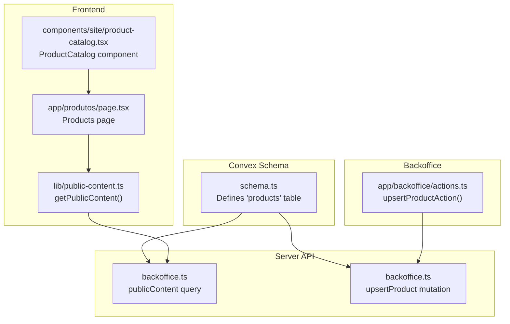
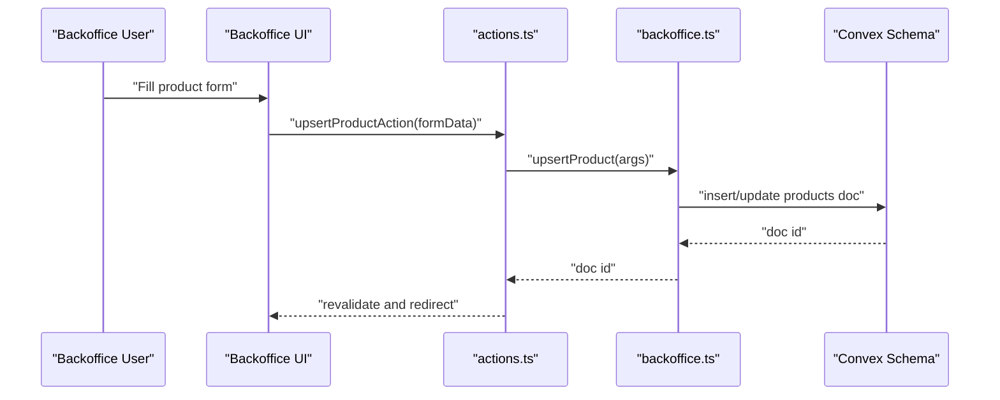
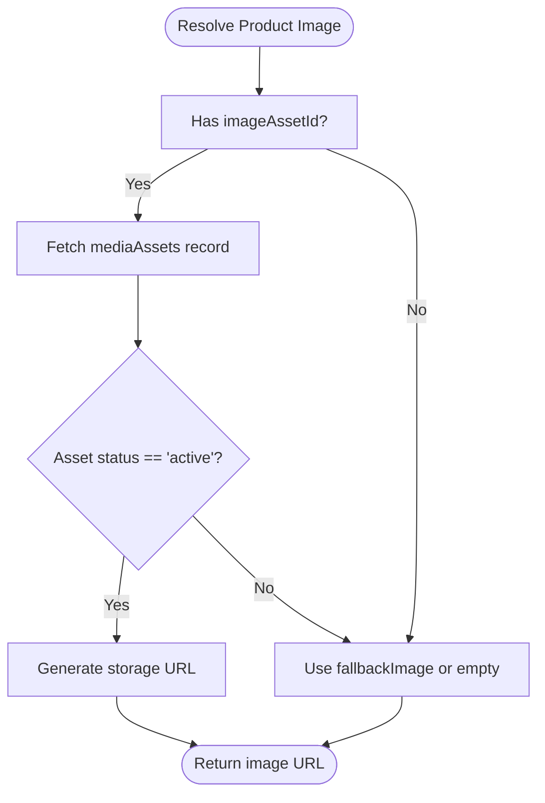
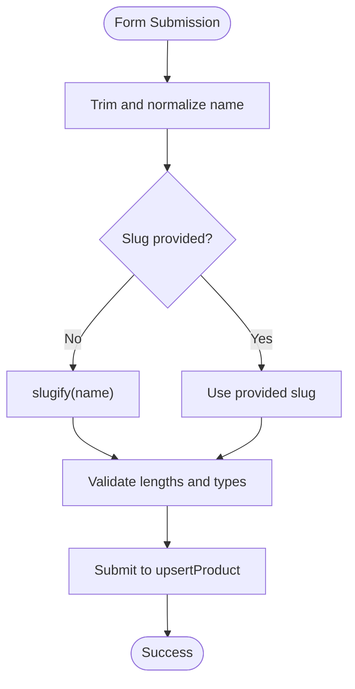
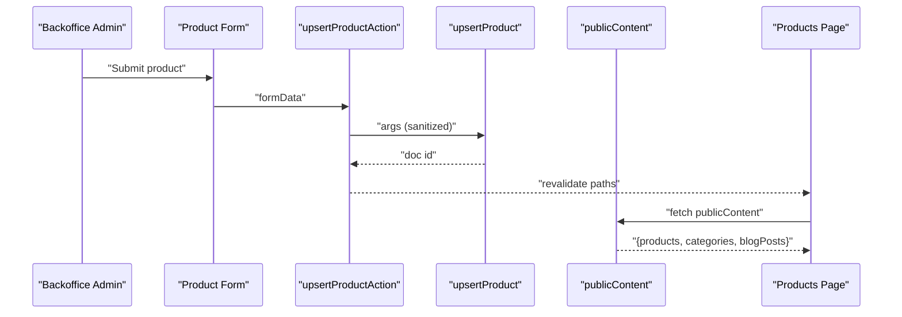
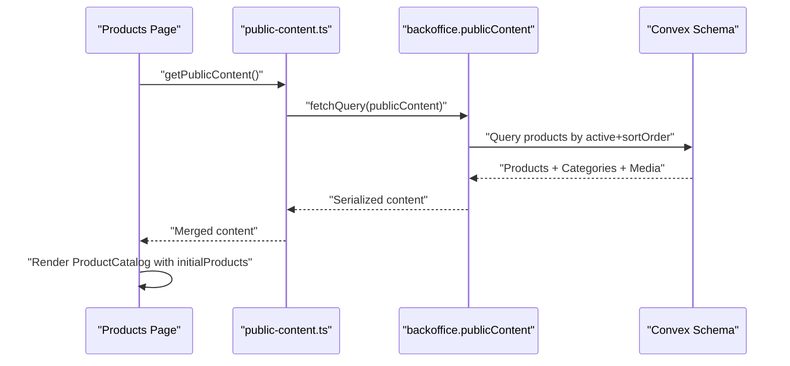
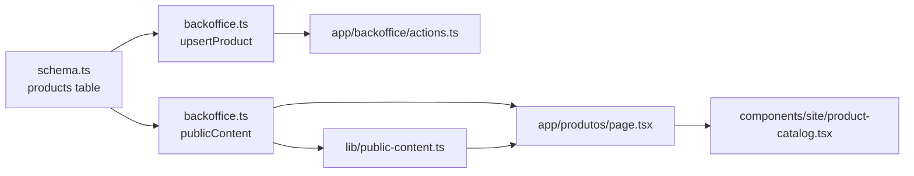

# Product Data Model

<cite>
**Referenced Files in This Document**
- [schema.ts](file://convex/schema.ts)
- [backoffice.ts](file://convex/backoffice.ts)
- [product-catalog.tsx](file://components/site/product-catalog.tsx)
- [public-content.ts](file://lib/public-content.ts)
- [site-data.ts](file://lib/site-data.ts)
- [page.tsx](file://app/produtos/page.tsx)
- [actions.ts](file://app/backoffice/actions.ts)
</cite>

## Table of Contents
1. [Introduction](#introduction)
2. [Project Structure](#project-structure)
3. [Core Components](#core-components)
4. [Architecture Overview](#architecture-overview)
5. [Detailed Component Analysis](#detailed-component-analysis)
6. [Dependency Analysis](#dependency-analysis)
7. [Performance Considerations](#performance-considerations)
8. [Troubleshooting Guide](#troubleshooting-guide)
9. [Conclusion](#conclusion)

## Introduction
This document describes the Product data model used in the office supply catalog. It covers the complete product structure, media asset relationships, active status and sorting controls, timestamps, indexing strategy, validation rules, and practical usage patterns for CRUD operations, catalog queries, and integration with the product catalog component. It also explains product lifecycle management and categorization patterns.

## Project Structure
The product model is defined in the Convex schema and exposed via server-side queries and mutations. Frontend pages consume public content to render the product catalog, while the backoffice provides administrative forms to manage products and media assets.



**Diagram sources**
- [schema.ts:37-50](file://convex/schema.ts#L37-L50)
- [backoffice.ts:319-384](file://convex/backoffice.ts#L319-L384)
- [backoffice.ts:186-221](file://convex/backoffice.ts#L186-L221)
- [page.tsx:17-42](file://app/produtos/page.tsx#L17-L42)
- [public-content.ts:65-106](file://lib/public-content.ts#L65-L106)
- [product-catalog.tsx:12-78](file://components/site/product-catalog.tsx#L12-L78)
- [actions.ts:130-151](file://app/backoffice/actions.ts#L130-L151)

**Section sources**
- [schema.ts:37-50](file://convex/schema.ts#L37-L50)
- [backoffice.ts:319-384](file://convex/backoffice.ts#L319-L384)
- [page.tsx:17-42](file://app/produtos/page.tsx#L17-L42)
- [public-content.ts:65-106](file://lib/public-content.ts#L65-L106)
- [product-catalog.tsx:12-78](file://components/site/product-catalog.tsx#L12-L78)
- [actions.ts:130-151](file://app/backoffice/actions.ts#L130-L151)

## Core Components
- Product table definition with fields: name, slug, category, description, imageAssetId, fallbackImage, active, sortOrder, createdAt, updatedAt.
- Indexes: by_active_and_sort_order, by_slug.
- Server query: publicContent returns transformed product records with computed image URLs.
- Server mutation: upsertProduct handles creation and updates, setting timestamps.
- Frontend integration: Products page fetches public content and renders ProductCatalog.
- Backoffice integration: upsertProductAction posts sanitized form data to upsertProduct.

**Section sources**
- [schema.ts:37-50](file://convex/schema.ts#L37-L50)
- [backoffice.ts:319-384](file://convex/backoffice.ts#L319-L384)
- [backoffice.ts:186-221](file://convex/backoffice.ts#L186-L221)
- [page.tsx:17-42](file://app/produtos/page.tsx#L17-L42)
- [public-content.ts:65-106](file://lib/public-content.ts#L65-L106)
- [product-catalog.tsx:12-78](file://components/site/product-catalog.tsx#L12-L78)
- [actions.ts:130-151](file://app/backoffice/actions.ts#L130-L151)

## Architecture Overview
The product data lifecycle spans schema definition, server-side transformations, and frontend rendering.



**Diagram sources**
- [actions.ts:130-151](file://app/backoffice/actions.ts#L130-L151)
- [backoffice.ts:186-221](file://convex/backoffice.ts#L186-L221)
- [schema.ts:37-50](file://convex/schema.ts#L37-L50)

## Detailed Component Analysis

### Product Data Model Definition
The Product table defines the canonical structure for catalog entries.

```mermaid
erDiagram
PRODUCTS {
string name
string slug
string category
string description
id mediaAssets imageAssetId
string fallbackImage
boolean active
number sortOrder
number createdAt
number updatedAt
}
```

- Fields:
  - name: Required string for display and search.
  - slug: Unique identifier used for lookups and routing.
  - category: String reference to a category grouping.
  - description: Textual summary of the product.
  - imageAssetId: Optional foreign key to mediaAssets.
  - fallbackImage: Optional direct URL string for image resolution.
  - active: Boolean flag controlling visibility in public content.
  - sortOrder: Numeric ordering field for display sequences.
  - createdAt, updatedAt: Timestamps for content management.

- Indexes:
  - by_active_and_sort_order: Efficient retrieval of visible products ordered by sortOrder.
  - by_slug: Fast lookup by slug for single-product queries.

**Diagram sources**
- [schema.ts:37-50](file://convex/schema.ts#L37-L50)

**Section sources**
- [schema.ts:37-50](file://convex/schema.ts#L37-L50)

### Media Asset Relationship and Fallback Resolution
Products can reference a media asset for their primary image. The publicContent query resolves the final image URL using either an attached media asset or a fallback image.



- Resolution logic:
  - If imageAssetId exists and the asset is active, compute a storage URL.
  - Otherwise, use fallbackImage if provided; otherwise an empty string.
- This pattern ensures robustness when media assets are missing or archived.

**Diagram sources**
- [backoffice.ts:33-45](file://convex/backoffice.ts#L33-L45)
- [backoffice.ts:350-358](file://convex/backoffice.ts#L350-L358)

**Section sources**
- [backoffice.ts:33-45](file://convex/backoffice.ts#L33-L45)
- [backoffice.ts:350-358](file://convex/backoffice.ts#L350-L358)

### Active Status and Sort Order Management
- active: Controls whether a product appears in publicContent queries.
- sortOrder: Determines presentation order among active products.
- The by_active_and_sort_order index enables efficient retrieval of visible products sorted by sortOrder.

**Section sources**
- [schema.ts:49](file://convex/schema.ts#L49)
- [backoffice.ts:322-323](file://convex/backoffice.ts#L322-L323)

### Timestamps and Content Management
- createdAt: Set during insert.
- updatedAt: Updated on every upsert operation.
- These timestamps support audit trails and content freshness.

**Section sources**
- [backoffice.ts:200-220](file://convex/backoffice.ts#L200-L220)

### Indexing Strategy
- by_active_and_sort_order: Supports fast filtering of active products and deterministic ordering.
- by_slug: Enables quick lookup by slug for single-product retrieval.

**Section sources**
- [schema.ts:49](file://convex/schema.ts#L49)

### Validation Rules and Normalization
- Slug generation: If not provided, slugify(name) produces a normalized URL-friendly string.
- Field sanitization: Actions trim strings, coerce numbers, and handle optional IDs and timestamps.
- Category relationship: The category field is a string reference; ensure consistency with category definitions.



**Diagram sources**
- [actions.ts:53-61](file://app/backoffice/actions.ts#L53-L61)
- [actions.ts:130-151](file://app/backoffice/actions.ts#L130-L151)
- [backoffice.ts:186-221](file://convex/backoffice.ts#L186-L221)

**Section sources**
- [actions.ts:53-61](file://app/backoffice/actions.ts#L53-L61)
- [actions.ts:130-151](file://app/backoffice/actions.ts#L130-L151)
- [backoffice.ts:186-221](file://convex/backoffice.ts#L186-L221)

### Product CRUD Operations
- Create/Update:
  - Backend: upsertProduct mutation accepts all product fields and sets timestamps.
  - Frontend: upsertProductAction posts sanitized form data and triggers revalidation.
- Read:
  - Backend: publicContent query returns transformed product records with resolved images.
  - Frontend: Products page fetches public content and passes products to ProductCatalog.
- Delete:
  - Not exposed in the current schema; deletion would require a dedicated mutation.



**Diagram sources**
- [actions.ts:130-151](file://app/backoffice/actions.ts#L130-L151)
- [backoffice.ts:186-221](file://convex/backoffice.ts#L186-L221)
- [backoffice.ts:319-384](file://convex/backoffice.ts#L319-L384)
- [page.tsx:17-42](file://app/produtos/page.tsx#L17-L42)

**Section sources**
- [backoffice.ts:186-221](file://convex/backoffice.ts#L186-L221)
- [actions.ts:130-151](file://app/backoffice/actions.ts#L130-L151)
- [backoffice.ts:319-384](file://convex/backoffice.ts#L319-L384)
- [page.tsx:17-42](file://app/produtos/page.tsx#L17-L42)

### Catalog Queries and Integration
- publicContent query:
  - Retrieves active products and categories, serializes media assets, and computes image URLs.
  - Returns a products array with id, name, category, description, and image.
- ProductCatalog component:
  - Accepts initialProducts and filters by category and free-text search.
  - Uses memoized computations to minimize re-renders.



**Diagram sources**
- [page.tsx:17-42](file://app/produtos/page.tsx#L17-L42)
- [public-content.ts:65-106](file://lib/public-content.ts#L65-L106)
- [backoffice.ts:319-384](file://convex/backoffice.ts#L319-L384)
- [schema.ts:37-50](file://convex/schema.ts#L37-L50)

**Section sources**
- [public-content.ts:65-106](file://lib/public-content.ts#L65-L106)
- [backoffice.ts:319-384](file://convex/backoffice.ts#L319-L384)
- [product-catalog.tsx:12-78](file://components/site/product-catalog.tsx#L12-L78)

### Product Lifecycle Management and Categorization Patterns
- Lifecycle:
  - Draft: inactive product not shown in public content.
  - Live: active product with sortOrder controlling position.
  - Archive: deactivate product by setting active=false.
- Categorization:
  - Products reference categories by name (string).
  - Ensure category names are consistent with category definitions to maintain coherent filtering and display.
- Display management:
  - sortOrder controls ordering among active products.
  - The by_active_and_sort_order index supports efficient retrieval and consistent ordering.

**Section sources**
- [schema.ts:49](file://convex/schema.ts#L49)
- [backoffice.ts:322-323](file://convex/backoffice.ts#L322-L323)

## Dependency Analysis
The product model depends on the media asset system for image resolution and on category definitions for grouping. The public content pipeline transforms raw documents into a presentation-ready structure.



**Diagram sources**
- [schema.ts:37-50](file://convex/schema.ts#L37-L50)
- [backoffice.ts:319-384](file://convex/backoffice.ts#L319-L384)
- [backoffice.ts:186-221](file://convex/backoffice.ts#L186-L221)
- [page.tsx:17-42](file://app/produtos/page.tsx#L17-L42)
- [product-catalog.tsx:12-78](file://components/site/product-catalog.tsx#L12-L78)
- [public-content.ts:65-106](file://lib/public-content.ts#L65-L106)
- [actions.ts:130-151](file://app/backoffice/actions.ts#L130-L151)

**Section sources**
- [schema.ts:37-50](file://convex/schema.ts#L37-L50)
- [backoffice.ts:319-384](file://convex/backoffice.ts#L319-L384)
- [backoffice.ts:186-221](file://convex/backoffice.ts#L186-L221)
- [page.tsx:17-42](file://app/produtos/page.tsx#L17-L42)
- [product-catalog.tsx:12-78](file://components/site/product-catalog.tsx#L12-L78)
- [public-content.ts:65-106](file://lib/public-content.ts#L65-L106)
- [actions.ts:130-151](file://app/backoffice/actions.ts#L130-L151)

## Performance Considerations
- Use the by_active_and_sort_order index for retrieving visible products efficiently.
- Prefer slug-based lookups with the by_slug index for single-product retrieval.
- Minimize payload size by returning only required fields in publicContent.
- Revalidate cached routes after product updates to keep the catalog fresh.

## Troubleshooting Guide
- Missing images:
  - If imageAssetId is not set or the asset is archived, the system falls back to fallbackImage or an empty string. Verify media asset status and slug.
- Incorrect ordering:
  - Ensure sortOrder is set consistently for active products; the index enforces ordering by active and sortOrder.
- Slug conflicts:
  - Slugs must be unique. If duplicates occur, adjust the slug or regenerate it using the provided normalization logic.
- Visibility issues:
  - Products with active=false will not appear in publicContent. Toggle active to control visibility.

**Section sources**
- [backoffice.ts:33-45](file://convex/backoffice.ts#L33-L45)
- [backoffice.ts:322-323](file://convex/backoffice.ts#L322-L323)
- [actions.ts:53-61](file://app/backoffice/actions.ts#L53-L61)

## Conclusion
The Product data model integrates tightly with media assets and public content delivery. Its schema, indexes, and server-side transformations enable efficient catalog management, robust image resolution, and flexible presentation controls. Administrative forms streamline CRUD operations, while the front-end catalog provides a responsive filtering experience.