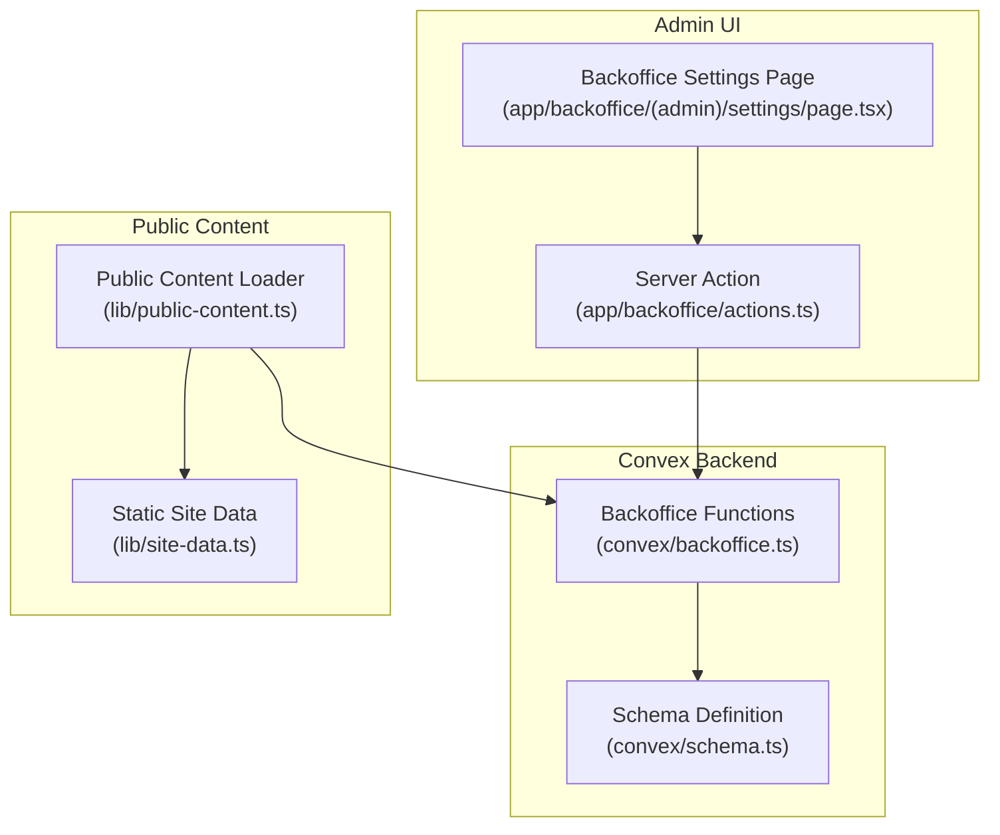
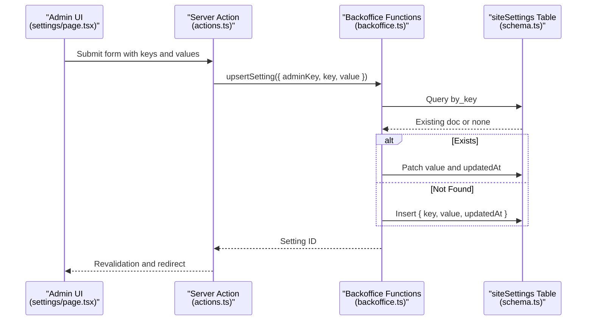
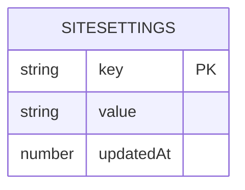
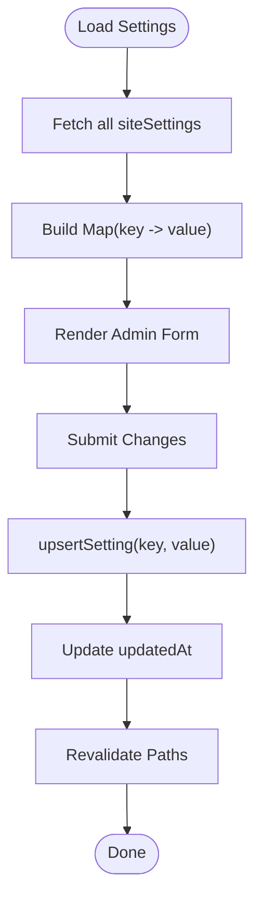
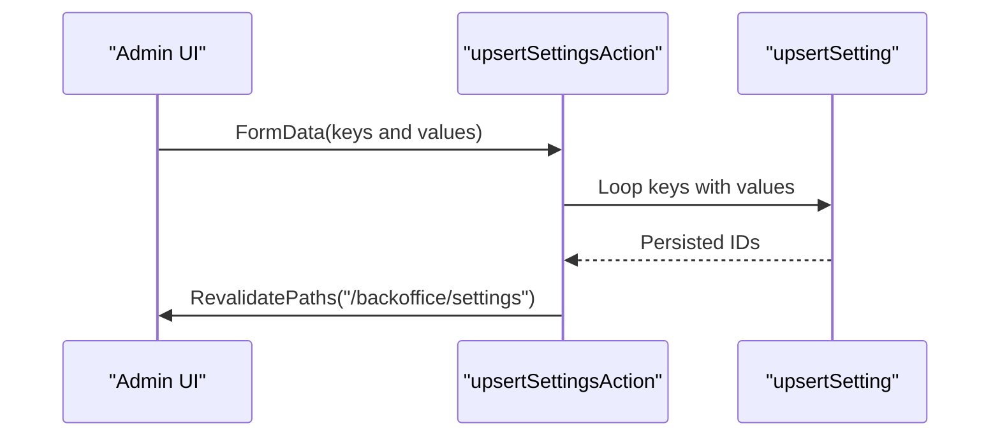
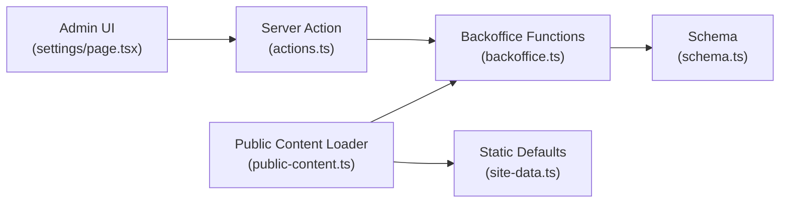

# Site Settings Data Model

<cite>
**Referenced Files in This Document**
- [schema.ts](file://convex/schema.ts)
- [backoffice.ts](file://convex/backoffice.ts)
- [page.tsx](file://app/backoffice/(admin)/settings/page.tsx)
- [actions.ts](file://app/backoffice/actions.ts)
- [public-content.ts](file://lib/public-content.ts)
- [site-data.ts](file://lib/site-data.ts)
- [BACKOFFICE.md](file://docs/BACKOFFICE.md)
- [CONVEX.md](file://docs/CONVEX.md)
</cite>

## Table of Contents
1. [Introduction](#introduction)
2. [Project Structure](#project-structure)
3. [Core Components](#core-components)
4. [Architecture Overview](#architecture-overview)
5. [Detailed Component Analysis](#detailed-component-analysis)
6. [Dependency Analysis](#dependency-analysis)
7. [Performance Considerations](#performance-considerations)
8. [Troubleshooting Guide](#troubleshooting-guide)
9. [Conclusion](#conclusion)
10. [Appendices](#appendices)

## Introduction
This document describes the Site Settings data model used for configuration management in the project. It covers the schema definition, indexing strategy, validation rules, update timestamp tracking, and integration with the public content system. It also provides patterns for settings retrieval, caching strategies, dynamic updates, versioning considerations, backup procedures, and practical configuration scenarios.

## Project Structure
The Site Settings model is defined in the Convex schema and exposed via server-side functions. The administrative UI allows editing settings, while the public content pipeline reads them to render storefront pages.

**Diagram sources**
- [page.tsx](file://app/backoffice/(admin)/settings/page.tsx#L1-L45)
- [actions.ts:200-215](file://app/backoffice/actions.ts#L200-L215)
- [backoffice.ts:301-317](file://convex/backoffice.ts#L301-L317)
- [schema.ts:81-86](file://convex/schema.ts#L81-L86)
- [public-content.ts:65-107](file://lib/public-content.ts#L65-L107)
- [site-data.ts:25-41](file://lib/site-data.ts#L25-L41)

**Section sources**
- [schema.ts:81-86](file://convex/schema.ts#L81-L86)
- [backoffice.ts:301-317](file://convex/backoffice.ts#L301-L317)
- [page.tsx](file://app/backoffice/(admin)/settings/page.tsx#L1-L45)
- [actions.ts:200-215](file://app/backoffice/actions.ts#L200-L215)
- [public-content.ts:65-107](file://lib/public-content.ts#L65-L107)
- [site-data.ts:25-41](file://lib/site-data.ts#L25-L41)

## Core Components
- Data model: A simple key-value store with an update timestamp.
- Indexing: A single-field index on the key column for fast lookups.
- Validation: Keys and values are strings; mutations enforce non-empty keys and values.
- Update semantics: Upsert behavior with timestamp updates on change.
- Retrieval: Admin lists and public content queries both access settings.

**Section sources**
- [schema.ts:81-86](file://convex/schema.ts#L81-L86)
- [backoffice.ts:301-317](file://convex/backoffice.ts#L301-L317)
- [backoffice.ts:168-184](file://convex/backoffice.ts#L168-L184)
- [backoffice.ts:319-384](file://convex/backoffice.ts#L319-L384)

## Architecture Overview
The Site Settings model supports two primary flows:
- Admin settings management: The admin page renders current values, submits updates via a server action, and persists them using a mutation.
- Public content rendering: The public content loader fetches settings alongside other content to assemble the storefront.

**Diagram sources**
- [page.tsx](file://app/backoffice/(admin)/settings/page.tsx#L18-L44)
- [actions.ts:200-215](file://app/backoffice/actions.ts#L200-L215)
- [backoffice.ts:301-317](file://convex/backoffice.ts#L301-L317)
- [schema.ts:81-86](file://convex/schema.ts#L81-L86)

## Detailed Component Analysis

### Data Model Definition
- Fields:
  - key: string (indexed)
  - value: string
  - updatedAt: number (Unix timestamp)
- Index: by_key on key for O(1) lookup by key.
- Constraints: Schema enforces string types; mutations trim and validate inputs.

**Diagram sources**
- [schema.ts:81-86](file://convex/schema.ts#L81-L86)

**Section sources**
- [schema.ts:81-86](file://convex/schema.ts#L81-L86)

### Indexing Strategy
- Single-field index by_key enables efficient point lookups by key.
- Admin lists collect all settings for rendering the form.
- Public content query does not directly depend on settings; it merges static defaults with database-backed content.

**Section sources**
- [schema.ts:85-86](file://convex/schema.ts#L85-L86)
- [backoffice.ts:168-184](file://convex/backoffice.ts#L168-L184)
- [backoffice.ts:319-384](file://convex/backoffice.ts#L319-L384)

### Validation Rules
- Keys and values are strings; mutation trims whitespace.
- Upsert mutation requires a valid admin key.
- No explicit regex or length limits are enforced at the schema level for keys or values.

Practical validation behavior:
- Trimming: Leading/trailing spaces removed from submitted values.
- Empty handling: Empty strings are stored as-is; consider treating empty as “unconfigured” in consumers.
- Key enumeration: Admin UI currently supports a fixed set of keys; extending requires updating both UI and mutation.

**Section sources**
- [backoffice.ts:301-317](file://convex/backoffice.ts#L301-L317)
- [actions.ts:16-24](file://app/backoffice/actions.ts#L16-L24)
- [page.tsx](file://app/backoffice/(admin)/settings/page.tsx#L8-L16)

### Update Timestamp Tracking
- Each upsert operation updates updatedAt to the current Unix timestamp.
- This enables clients to detect changes and implement cache invalidation.

**Section sources**
- [backoffice.ts:301-317](file://convex/backoffice.ts#L301-L317)

### Settings Retrieval Patterns
- Admin page: Loads all settings into a Map keyed by setting.key for quick lookup and fallback to static defaults.
- Public content: Does not read settings directly; merges database content with static defaults.

**Diagram sources**
- [page.tsx](file://app/backoffice/(admin)/settings/page.tsx#L18-L44)
- [backoffice.ts:301-317](file://convex/backoffice.ts#L301-L317)

**Section sources**
- [page.tsx](file://app/backoffice/(admin)/settings/page.tsx#L18-L44)
- [backoffice.ts:168-184](file://convex/backoffice.ts#L168-L184)

### Dynamic Configuration Updates
- Admin action iterates over a predefined list of keys and issues separate upsertSetting calls.
- After updates, Next.js revalidation triggers cache refresh for the admin route.

**Diagram sources**
- [actions.ts:200-215](file://app/backoffice/actions.ts#L200-L215)
- [backoffice.ts:301-317](file://convex/backoffice.ts#L301-L317)

**Section sources**
- [actions.ts:200-215](file://app/backoffice/actions.ts#L200-L215)
- [backoffice.ts:301-317](file://convex/backoffice.ts#L301-L317)

### Integration with Public Content System
- Public content loader does not read siteSettings directly.
- Static defaults from site-data.ts are used as fallbacks when database content is unavailable.
- This separation keeps public rendering decoupled from settings, improving reliability.

**Section sources**
- [public-content.ts:65-107](file://lib/public-content.ts#L65-L107)
- [site-data.ts:25-41](file://lib/site-data.ts#L25-L41)

### Common Configuration Scenarios
- Contact information: phone, whatsapp, email, address.
- Social media links: facebook, instagram, linkedin.
- Operational settings: additional keys can be added by extending the admin UI and mutation.

Implementation pattern:
- Add key to the admin fields list.
- Extend the upsert loop to include the new key.
- Consumers can read the key via the settings Map in the admin UI or via a dedicated query if needed.

**Section sources**
- [page.tsx](file://app/backoffice/(admin)/settings/page.tsx#L8-L16)
- [actions.ts:200-215](file://app/backoffice/actions.ts#L200-L215)

## Dependency Analysis
- Admin UI depends on:
  - Server action for mutations.
  - Backoffice functions for data access.
  - Static defaults for fallback rendering.
- Backoffice functions depend on:
  - Convex schema for table and index definitions.
  - Authentication middleware for admin access.
- Public content loader depends on:
  - Backoffice functions for content assembly.
  - Static defaults for fallbacks.

**Diagram sources**
- [page.tsx](file://app/backoffice/(admin)/settings/page.tsx#L1-L45)
- [actions.ts:200-215](file://app/backoffice/actions.ts#L200-L215)
- [backoffice.ts:301-317](file://convex/backoffice.ts#L301-L317)
- [schema.ts:81-86](file://convex/schema.ts#L81-L86)
- [public-content.ts:65-107](file://lib/public-content.ts#L65-L107)
- [site-data.ts:25-41](file://lib/site-data.ts#L25-L41)

**Section sources**
- [page.tsx](file://app/backoffice/(admin)/settings/page.tsx#L1-L45)
- [actions.ts:200-215](file://app/backoffice/actions.ts#L200-L215)
- [backoffice.ts:301-317](file://convex/backoffice.ts#L301-L317)
- [schema.ts:81-86](file://convex/schema.ts#L81-L86)
- [public-content.ts:65-107](file://lib/public-content.ts#L65-L107)
- [site-data.ts:25-41](file://lib/site-data.ts#L25-L41)

## Performance Considerations
- Index usage: Queries by key leverage the by_key index, minimizing scan overhead.
- Batch writes: The admin action sends multiple upsertSetting calls; consider batching if many keys are updated together.
- Cache invalidation: Revalidation is triggered after updates; ensure consumers invalidate caches when reading settings.
- Data volume: With a small, fixed set of settings, performance is dominated by network latency rather than query cost.

[No sources needed since this section provides general guidance]

## Troubleshooting Guide
- Unauthorized access: Ensure BACKOFFICE_API_KEY is configured and matches the server environment.
- Missing NEXT_PUBLIC_CONVEX_URL: Public content loader throws if the environment variable is missing.
- Empty or unexpected values: Verify trimming behavior and consider treating empty strings as unconfigured.
- Revalidation not taking effect: Confirm revalidatePath calls occur after mutations.

**Section sources**
- [CONVEX.md:16-32](file://docs/CONVEX.md#L16-L32)
- [public-content.ts:67-69](file://lib/public-content.ts#L67-L69)
- [actions.ts:213-214](file://app/backoffice/actions.ts#L213-L214)

## Conclusion
The Site Settings model provides a lightweight, indexed key-value store suitable for operational configuration. Its design emphasizes simplicity, admin-controlled updates, and straightforward integration with the public content system. Extending the model involves adding keys to the admin UI and mutation, with careful consideration for validation and consumer behavior.

[No sources needed since this section summarizes without analyzing specific files]

## Appendices

### Settings Versioning and Backup Procedures
- Versioning: No explicit version field exists; use updatedAt timestamps to track last modification.
- Backup: Export the siteSettings table periodically for disaster recovery. Consider snapshotting the entire Convex deployment.
- Rollback: To revert, re-run upsertSetting for affected keys with previous values.

[No sources needed since this section provides general guidance]

### Integration Notes
- Admin-only: All mutations require admin authentication and the BACKOFFICE_API_KEY.
- Public consumption: Public content loader does not read settings; keep public rendering independent of settings for reliability.

**Section sources**
- [backoffice.ts:25-31](file://convex/backoffice.ts#L25-L31)
- [CONVEX.md:50-59](file://docs/CONVEX.md#L50-L59)