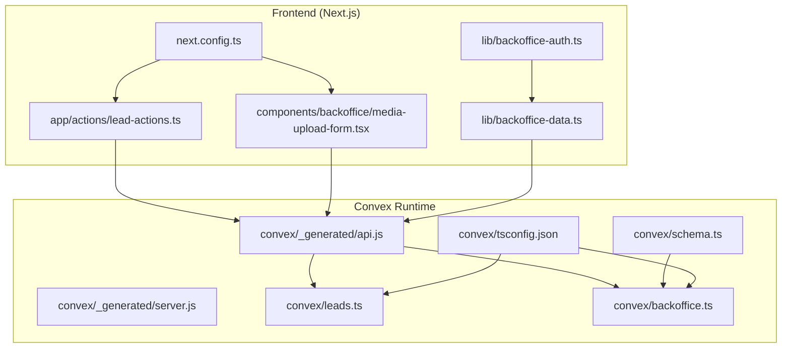
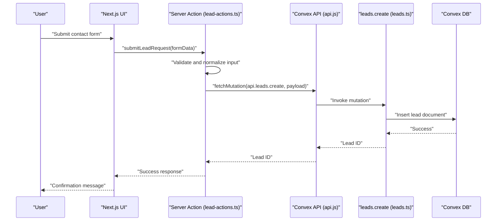
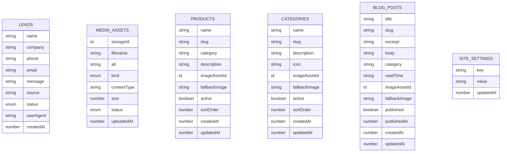
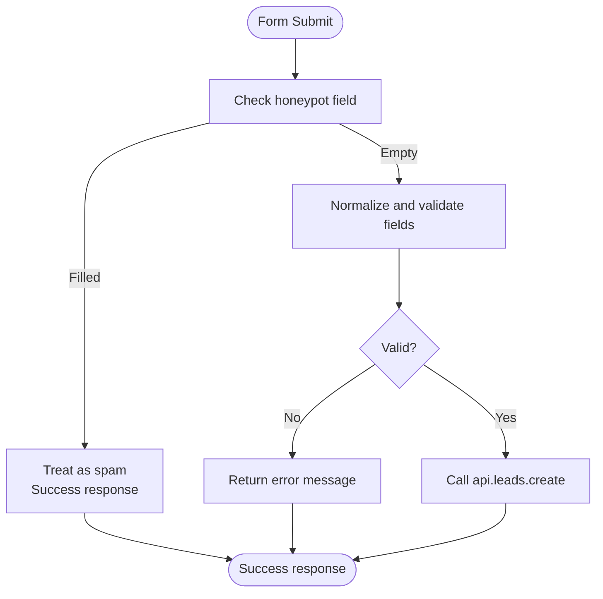
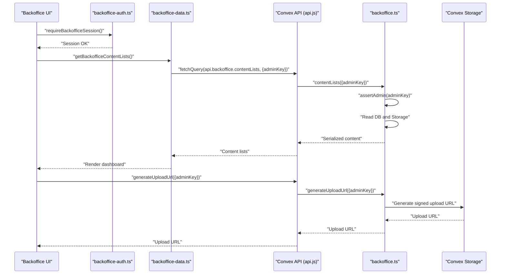
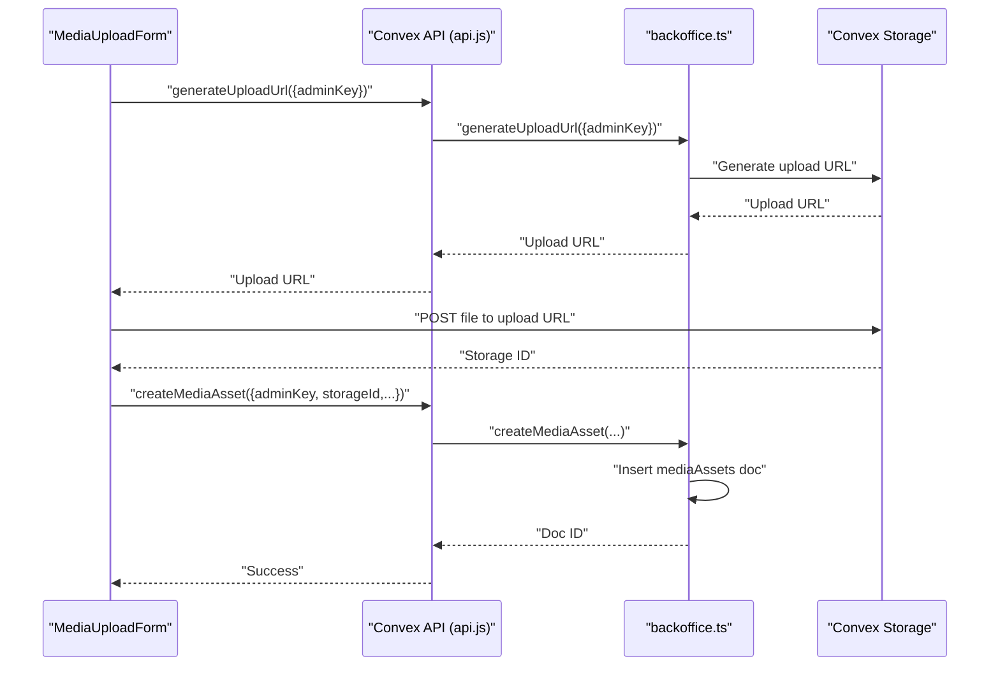
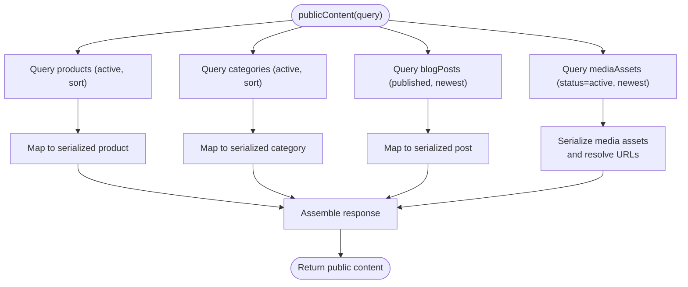
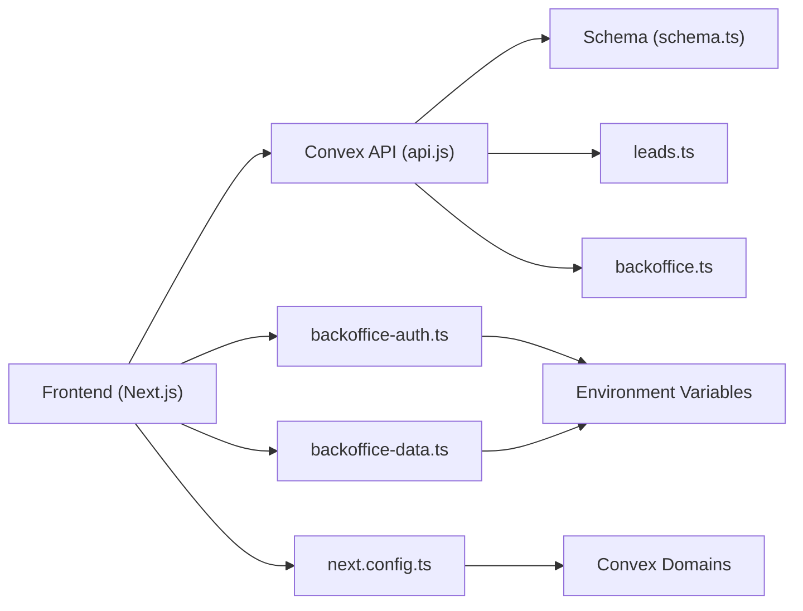

# Convex Backend Deployment

<cite>
**Referenced Files in This Document**
- [schema.ts](file://convex/schema.ts)
- [backoffice.ts](file://convex/backoffice.ts)
- [leads.ts](file://convex/leads.ts)
- [api.js](file://convex/_generated/api.js)
- [server.js](file://convex/_generated/server.js)
- [tsconfig.json](file://convex/tsconfig.json)
- [CONVEX.md](file://docs/CONVEX.md)
- [SECURITY.md](file://docs/SECURITY.md)
- [package.json](file://package.json)
- [next.config.ts](file://next.config.ts)
- [lead-actions.ts](file://app/actions/lead-actions.ts)
- [media-upload-form.tsx](file://components/backoffice/media-upload-form.tsx)
- [backoffice-auth.ts](file://lib/backoffice-auth.ts)
- [backoffice-data.ts](file://lib/backoffice-data.ts)
</cite>

## Table of Contents
1. [Introduction](#introduction)
2. [Project Structure](#project-structure)
3. [Core Components](#core-components)
4. [Architecture Overview](#architecture-overview)
5. [Detailed Component Analysis](#detailed-component-analysis)
6. [Dependency Analysis](#dependency-analysis)
7. [Performance Considerations](#performance-considerations)
8. [Troubleshooting Guide](#troubleshooting-guide)
9. [Conclusion](#conclusion)
10. [Appendices](#appendices)

## Introduction
This document provides end-to-end guidance for deploying and operating the Convex backend used by this project. It covers:
- Backend infrastructure setup and management
- Convex CLI deployment (database initialization, schema migration, function deployment)
- Dashboard configuration, team collaboration, and monitoring
- Database deployment (collections, indexes, data seeding)
- Function deployment (serverless functions, environment variables, security)
- Convex Storage for media assets and file management
- Production environment setup (scaling, backups, disaster recovery)
- Authentication, RBAC, and security best practices
- Monitoring and logging configuration
- Troubleshooting and performance optimization

## Project Structure
The backend is organized around Convex modules and Next.js integration:
- Convex schema and serverless functions live under the convex/ directory
- Frontend integration uses Convex’s generated API bindings and Next.js actions
- Security and environment configuration are managed via environment variables and Next.js headers

**Diagram sources**
- [lead-actions.ts:1-96](file://app/actions/lead-actions.ts#L1-L96)
- [media-upload-form.tsx:1-114](file://components/backoffice/media-upload-form.tsx#L1-L114)
- [backoffice-auth.ts:1-129](file://lib/backoffice-auth.ts#L1-L129)
- [backoffice-data.ts:1-21](file://lib/backoffice-data.ts#L1-L21)
- [next.config.ts:1-91](file://next.config.ts#L1-L91)
- [api.js:1-24](file://convex/_generated/api.js#L1-L24)
- [server.js:1-94](file://convex/_generated/server.js#L1-L94)
- [schema.ts:1-87](file://convex/schema.ts#L1-L87)
- [leads.ts:1-32](file://convex/leads.ts#L1-L32)
- [backoffice.ts:1-385](file://convex/backoffice.ts#L1-L385)
- [tsconfig.json:1-26](file://convex/tsconfig.json#L1-L26)

**Section sources**
- [CONVEX.md:1-59](file://docs/CONVEX.md#L1-L59)
- [package.json:1-51](file://package.json#L1-L51)
- [next.config.ts:1-91](file://next.config.ts#L1-L91)

## Core Components
- Schema: Defines collections, fields, and secondary indexes for leads, mediaAssets, products, categories, blogPosts, and siteSettings.
- Functions:
  - Public: leads.create and leads.recent for lead ingestion and listing
  - Protected admin: backoffice dashboard, media, content CRUD, and settings
  - Public read-only: backoffice.publicContent for site content
- Frontend integrations:
  - Server action for lead submission
  - Media upload form using Convex Storage
  - Backoffice authentication and data fetching utilities

**Section sources**
- [schema.ts:1-87](file://convex/schema.ts#L1-L87)
- [leads.ts:1-32](file://convex/leads.ts#L1-L32)
- [backoffice.ts:1-385](file://convex/backoffice.ts#L1-L385)
- [api.js:1-24](file://convex/_generated/api.js#L1-L24)
- [server.js:1-94](file://convex/_generated/server.js#L1-L94)
- [lead-actions.ts:1-96](file://app/actions/lead-actions.ts#L1-L96)
- [media-upload-form.tsx:1-114](file://components/backoffice/media-upload-form.tsx#L1-L114)
- [backoffice-auth.ts:1-129](file://lib/backoffice-auth.ts#L1-L129)
- [backoffice-data.ts:1-21](file://lib/backoffice-data.ts#L1-L21)

## Architecture Overview
The system integrates Next.js frontend with Convex backend via generated API bindings. Lead submissions are validated server-side and persisted to Convex. Backoffice operations require both a signed session cookie and an API key. Media uploads leverage Convex Storage with signed URLs.

**Diagram sources**
- [lead-actions.ts:32-83](file://app/actions/lead-actions.ts#L32-L83)
- [api.js:21-23](file://convex/_generated/api.js#L21-L23)
- [leads.ts:7-24](file://convex/leads.ts#L7-L24)

**Section sources**
- [CONVEX.md:8-14](file://docs/CONVEX.md#L8-L14)
- [lead-actions.ts:1-96](file://app/actions/lead-actions.ts#L1-L96)
- [next.config.ts:14-16](file://next.config.ts#L14-L16)

## Detailed Component Analysis

### Database Schema and Indexes
- Collections:
  - leads: indexed by status and createdAt
  - mediaAssets: composite indexes by (kind, status) and (status, uploadedAt)
  - products: composite indexes by (active, sortOrder) and slug
  - categories: composite indexes by (active, sortOrder) and slug
  - blogPosts: composite indexes by (published, publishedAt) and slug
  - siteSettings: index by key
- Purpose:
  - Optimize admin dashboards and public content queries
  - Support filtering and sorting for backoffice listings

**Diagram sources**
- [schema.ts:5-17](file://convex/schema.ts#L5-L17)
- [schema.ts:18-36](file://convex/schema.ts#L18-L36)
- [schema.ts:37-50](file://convex/schema.ts#L37-L50)
- [schema.ts:51-64](file://convex/schema.ts#L51-L64)
- [schema.ts:65-80](file://convex/schema.ts#L65-L80)
- [schema.ts:81-85](file://convex/schema.ts#L81-L85)

**Section sources**
- [schema.ts:1-87](file://convex/schema.ts#L1-L87)

### Lead Submission Pipeline
- Validation and normalization occur server-side before invoking Convex
- Uses a honeypot field to deter bots
- Stores user agent for auditability

**Diagram sources**
- [lead-actions.ts:32-94](file://app/actions/lead-actions.ts#L32-L94)

**Section sources**
- [lead-actions.ts:1-96](file://app/actions/lead-actions.ts#L1-L96)
- [leads.ts:7-24](file://convex/leads.ts#L7-L24)

### Backoffice Admin Functions
- Authentication:
  - HttpOnly session cookie with HMAC signature
  - Requires BACKOFFICE_SESSION_SECRET and BACKOFFICE_API_KEY
- Authorization:
  - All protected backoffice functions require adminKey
- Capabilities:
  - Media upload URL generation and metadata registration
  - Archive media assets
  - CRUD for products, categories, blog posts, and site settings
  - Dashboard statistics and recent items
  - Public content aggregation with image URL resolution

**Diagram sources**
- [backoffice-auth.ts:110-118](file://lib/backoffice-auth.ts#L110-L118)
- [backoffice-data.ts:10-12](file://lib/backoffice-data.ts#L10-L12)
- [api.js:21-23](file://convex/_generated/api.js#L21-L23)
- [backoffice.ts:68-74](file://convex/backoffice.ts#L68-L74)
- [backoffice.ts:163-184](file://convex/backoffice.ts#L163-L184)

**Section sources**
- [backoffice-auth.ts:1-129](file://lib/backoffice-auth.ts#L1-L129)
- [backoffice-data.ts:1-21](file://lib/backoffice-data.ts#L1-L21)
- [backoffice.ts:1-385](file://convex/backoffice.ts#L1-L385)

### Media Upload Workflow
- Client-side validation (file type, size)
- Generate signed upload URL via Convex
- Upload file directly to Convex Storage
- Register metadata in mediaAssets collection

**Diagram sources**
- [media-upload-form.tsx:19-77](file://components/backoffice/media-upload-form.tsx#L19-L77)
- [backoffice.ts:68-100](file://convex/backoffice.ts#L68-L100)

**Section sources**
- [media-upload-form.tsx:1-114](file://components/backoffice/media-upload-form.tsx#L1-L114)
- [backoffice.ts:68-100](file://convex/backoffice.ts#L68-L100)
- [schema.ts:18-36](file://convex/schema.ts#L18-L36)

### Public Content Resolution
- Backoffice.publicContent aggregates products, categories, blog posts, and mediaAssets
- Resolves image URLs from Convex Storage for permitted kinds
- Normalizes dates and slugs for rendering

**Diagram sources**
- [backoffice.ts:319-384](file://convex/backoffice.ts#L319-L384)
- [schema.ts:18-36](file://convex/schema.ts#L18-L36)

**Section sources**
- [backoffice.ts:319-384](file://convex/backoffice.ts#L319-L384)
- [schema.ts:18-36](file://convex/schema.ts#L18-L36)

## Dependency Analysis
- Frontend depends on Convex-generated API bindings
- Server actions depend on Convex Next.js integration
- Backoffice utilities depend on environment variables for secrets and keys
- Next.js configuration enforces CSP and secure headers, including Connect-src for Convex domains

**Diagram sources**
- [api.js:21-23](file://convex/_generated/api.js#L21-L23)
- [schema.ts:1-87](file://convex/schema.ts#L1-L87)
- [leads.ts:1-32](file://convex/leads.ts#L1-L32)
- [backoffice.ts:1-385](file://convex/backoffice.ts#L1-L385)
- [backoffice-auth.ts:1-129](file://lib/backoffice-auth.ts#L1-L129)
- [backoffice-data.ts:1-21](file://lib/backoffice-data.ts#L1-L21)
- [next.config.ts:14-16](file://next.config.ts#L14-L16)

**Section sources**
- [package.json:5-12](file://package.json#L5-L12)
- [next.config.ts:14-16](file://next.config.ts#L14-L16)
- [CONVEX.md:18-32](file://docs/CONVEX.md#L18-L32)

## Performance Considerations
- Index selection:
  - Use appropriate secondary indexes for admin dashboards and public queries to avoid full scans
- Batch reads:
  - Combine multiple queries using Promise.all to reduce latency
- Pagination:
  - Limit returned items per query to prevent oversized responses
- Storage:
  - Prefer signed uploads for direct-to-storage transfers to minimize backend load
- CDN and caching:
  - Serve images via Convex Storage URLs and rely on browser caching for static assets

[No sources needed since this section provides general guidance]

## Troubleshooting Guide
Common issues and resolutions:
- Convex not configured:
  - Ensure NEXT_PUBLIC_CONVEX_URL is set in both local and Vercel environments
- Admin key missing:
  - Set BACKOFFICE_API_KEY in Convex environment for protected functions
- Session errors:
  - Verify BACKOFFICE_SESSION_SECRET is present and consistent
  - Confirm cookie security flags align with environment (secure flag in production)
- Upload failures:
  - Confirm file type and size constraints match client-side validation
  - Check that storageId is returned and mediaAssets insertion succeeds
- Rate limiting and spam:
  - Honeypot field prevents simple bot submissions
  - Consider adding rate limiting at the ingress level

**Section sources**
- [CONVEX.md:18-32](file://docs/CONVEX.md#L18-L32)
- [lead-actions.ts:35-49](file://app/actions/lead-actions.ts#L35-L49)
- [backoffice-auth.ts:19-26](file://lib/backoffice-auth.ts#L19-L26)
- [media-upload-form.tsx:26-42](file://components/backoffice/media-upload-form.tsx#L26-L42)
- [backoffice.ts:68-74](file://convex/backoffice.ts#L68-L74)

## Conclusion
This deployment leverages Convex for a secure, scalable backend with clear separation between public content and protected admin operations. By following the environment setup, schema/index design, and security practices outlined here, teams can reliably operate the system in production while maintaining performance and observability.

[No sources needed since this section summarizes without analyzing specific files]

## Appendices

### A. Convex CLI Deployment and Management
- Local development:
  - Run the development command to configure deployment and regenerate bindings
- Production deployment:
  - Deploy functions to production after verifying environment variables
- Environment variables:
  - Configure both frontend and backend variables consistently across environments

**Section sources**
- [CONVEX.md:34-48](file://docs/CONVEX.md#L34-L48)

### B. Database Initialization and Schema Migration
- Initialize schema via Convex CLI
- Add indexes as needed for admin and public queries
- Seed minimal data for siteSettings during initial rollout

**Section sources**
- [schema.ts:1-87](file://convex/schema.ts#L1-L87)

### C. Function Deployment Checklist
- Regenerate API bindings after schema/function changes
- Verify environment variables in Convex and Vercel
- Test protected functions with adminKey and session cookie
- Validate media upload flow with signed URLs

**Section sources**
- [api.js:1-24](file://convex/_generated/api.js#L1-L24)
- [backoffice.ts:25-31](file://convex/backoffice.ts#L25-L31)
- [backoffice-auth.ts:120-128](file://lib/backoffice-auth.ts#L120-L128)

### D. Convex Storage for Media Assets
- Use signed upload URLs for direct-to-storage uploads
- Store metadata in mediaAssets with status and kind fields
- Resolve public URLs only for permitted kinds in public content

**Section sources**
- [backoffice.ts:33-52](file://convex/backoffice.ts#L33-L52)
- [backoffice.ts:68-100](file://convex/backoffice.ts#L68-L100)
- [schema.ts:18-36](file://convex/schema.ts#L18-L36)

### E. Production Environment Setup
- Scaling:
  - Use Convex autoscaling; monitor query latency and throughput
- Backups:
  - Rely on Convex-managed backups; test restore procedures
- Disaster recovery:
  - Maintain environment variable backups; automate redeployments via CI/CD

[No sources needed since this section provides general guidance]

### F. Authentication and Security Best Practices
- Enforce HTTPS and secure headers
- Restrict CSP to trusted Convex domains
- Use HMAC-signed session cookies with strong secrets
- Require adminKey for protected functions
- Sanitize and validate all inputs server-side

**Section sources**
- [SECURITY.md:1-29](file://docs/SECURITY.md#L1-L29)
- [next.config.ts:8-61](file://next.config.ts#L8-L61)
- [backoffice-auth.ts:18-26](file://lib/backoffice-auth.ts#L18-L26)
- [backoffice.ts:25-31](file://convex/backoffice.ts#L25-L31)
- [lead-actions.ts:51-70](file://app/actions/lead-actions.ts#L51-L70)

### G. Monitoring and Logging
- Enable Convex logs and metrics in the dashboard
- Track query latency and error rates for leads and backoffice functions
- Monitor media upload success rates and storage costs

[No sources needed since this section provides general guidance]