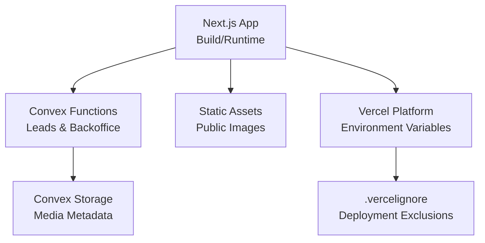
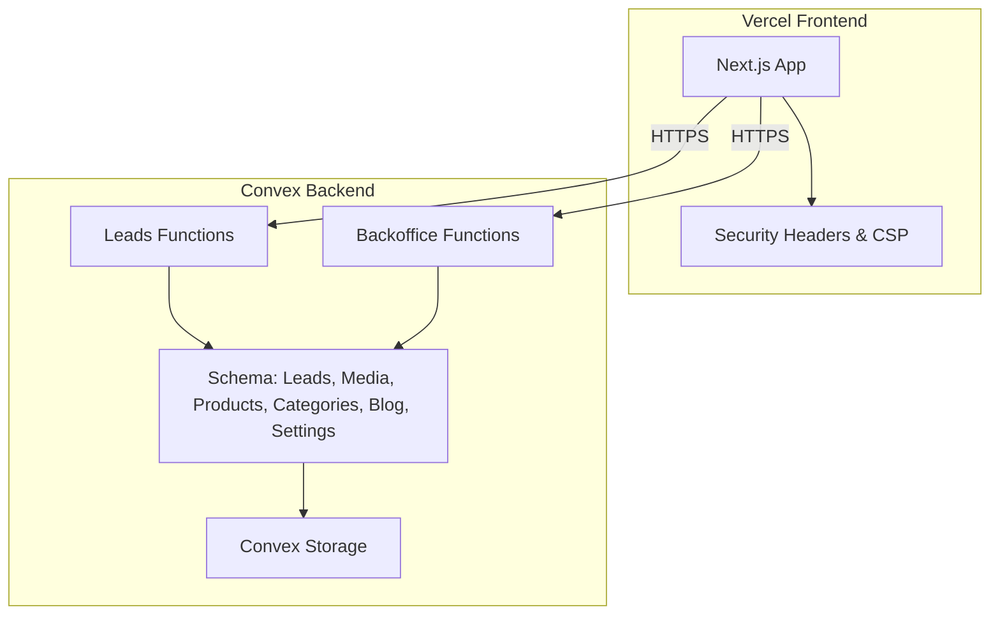
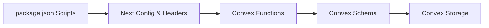
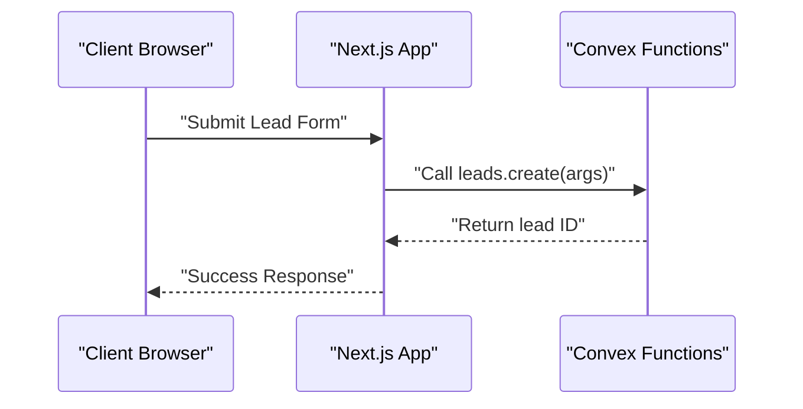
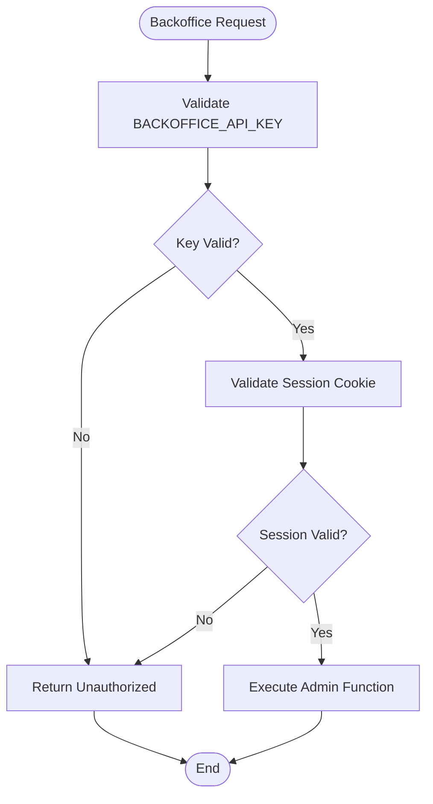

# Deployment & DevOps

<cite>
**Referenced Files in This Document**
- [package.json](file://package.json)
- [next.config.ts](file://next.config.ts)
- [.vercelignore](file://.vercelignore)
- [convex/schema.ts](file://convex/schema.ts)
- [convex/backoffice.ts](file://convex/backoffice.ts)
- [convex/leads.ts](file://convex/leads.ts)
- [docs/CONVEX.md](file://docs/CONVEX.md)
- [docs/SECURITY.md](file://docs/SECURITY.md)
</cite>

## Table of Contents
1. [Introduction](#introduction)
2. [Project Structure](#project-structure)
3. [Core Components](#core-components)
4. [Architecture Overview](#architecture-overview)
5. [Detailed Component Analysis](#detailed-component-analysis)
6. [Dependency Analysis](#dependency-analysis)
7. [Performance Considerations](#performance-considerations)
8. [Troubleshooting Guide](#troubleshooting-guide)
9. [Conclusion](#conclusion)
10. [Appendices](#appendices)

## Introduction
This document provides comprehensive deployment and DevOps guidance for the ADIKI ALVANIR Angola website. It covers Vercel frontend deployment, Convex backend and database configuration, CI/CD considerations, environment management across development, staging, and production, monitoring and alerting, backups and disaster recovery, scaling strategies, security hardening, rollback procedures, and troubleshooting.

## Project Structure
The project is a Next.js application with a Convex backend. Key deployment-relevant areas:
- Frontend build and runtime via Next.js
- Convex schema and server functions for data and media
- Security headers and CSP configured in Next.js
- Vercel-specific ignore rules for safe deployment

**Diagram sources**
- [next.config.ts:63-91](file://next.config.ts#L63-L91)
- [convex/schema.ts:1-87](file://convex/schema.ts#L1-L87)
- [.vercelignore:1-14](file://.vercelignore#L1-L14)

**Section sources**
- [package.json:1-51](file://package.json#L1-L51)
- [next.config.ts:1-91](file://next.config.ts#L1-L91)
- [.vercelignore:1-14](file://.vercelignore#L1-L14)

## Core Components
- Frontend build and runtime: managed by Next.js with a dedicated build script and production start command.
- Convex schema: defines data models for leads, media assets, products, categories, blog posts, and site settings.
- Convex functions: server-side mutations and queries for leads and backoffice operations.
- Security headers and CSP: enforced globally via Next.js headers configuration.
- Vercel deployment exclusions: controlled via .vercelignore to avoid uploading sensitive or unnecessary files.

**Section sources**
- [package.json:5-12](file://package.json#L5-L12)
- [convex/schema.ts:1-87](file://convex/schema.ts#L1-L87)
- [convex/leads.ts:1-32](file://convex/leads.ts#L1-L32)
- [convex/backoffice.ts:1-385](file://convex/backoffice.ts#L1-L385)
- [next.config.ts:27-61](file://next.config.ts#L27-L61)
- [.vercelignore:1-14](file://.vercelignore#L1-L14)

## Architecture Overview
The system comprises a static Next.js frontend hosted on Vercel and a Convex backend for data and media. The frontend enforces strict security policies and communicates with Convex functions for dynamic content and administrative tasks.

**Diagram sources**
- [next.config.ts:27-61](file://next.config.ts#L27-L61)
- [convex/schema.ts:1-87](file://convex/schema.ts#L1-L87)
- [convex/leads.ts:1-32](file://convex/leads.ts#L1-L32)
- [convex/backoffice.ts:1-385](file://convex/backoffice.ts#L1-L385)

## Detailed Component Analysis

### Vercel Frontend Deployment
- Build and start scripts are defined for local development and production runtime.
- Environment variables required for Convex integration and backoffice security are documented.
- Static assets and images are served locally; Convex-hosted images are permitted via CSP and remote patterns.

Recommended Vercel environment variables (set in project settings):
- NEXT_PUBLIC_CONVEX_URL: URL of the deployed Convex backend
- BACKOFFICE_API_KEY: secret key for backoffice function authorization
- BACKOFFICE_SESSION_SECRET: secure session secret for backoffice authentication
- BACKOFFICE_PASSWORD_HASH: hashed password for backoffice login

Deployment behavior:
- .vercelignore excludes node_modules, build artifacts, environment files, and media directories to reduce payload and protect secrets.

**Section sources**
- [package.json:5-12](file://package.json#L5-L12)
- [docs/CONVEX.md:16-32](file://docs/CONVEX.md#L16-L32)
- [next.config.ts:63-91](file://next.config.ts#L63-L91)
- [.vercelignore:1-14](file://.vercelignore#L1-L14)

### Convex Backend Deployment and Schema
- Schema defines tables and indexes for leads, media assets, products, categories, blog posts, and site settings.
- Functions include:
  - Leads: creation and retrieval of recent entries
  - Backoffice: admin-protected mutations and queries for content management and media handling
- Security: backoffice functions require BACKOFFICE_API_KEY and HttpOnly session cookies.

First-time setup and production deployment:
- Use Convex CLI to configure deployment and push functions to development and production.

**Section sources**
- [convex/schema.ts:1-87](file://convex/schema.ts#L1-L87)
- [convex/leads.ts:1-32](file://convex/leads.ts#L1-L32)
- [convex/backoffice.ts:1-385](file://convex/backoffice.ts#L1-L385)
- [docs/CONVEX.md:34-59](file://docs/CONVEX.md#L34-L59)

### Security Hardening and Compliance
- Strict Content Security Policy and security headers are applied globally.
- HSTS, X-Frame-Options, X-Content-Type-Options, Referrer-Policy, Permissions-Policy, COOP, and CORP are configured.
- Images are restricted to local and Convex domains; remote patterns permit Convex assets.

Operational guidance:
- Keep deployments HTTPS-only to enable HSTS.
- Avoid adding third-party scripts without updating CSP accordingly.
- Maintain dependencies and audit regularly.

**Section sources**
- [next.config.ts:27-61](file://next.config.ts#L27-L61)
- [docs/SECURITY.md:17-29](file://docs/SECURITY.md#L17-L29)

### CI/CD Pipeline Configuration
- Current repository does not include GitHub Actions or other CI/CD workflow files.
- Recommended approach:
  - Run type checking and linting on pull requests and main branch.
  - Build and preview on PRs; promote to production on main branch.
  - Automate Convex function deployment on production branch.
  - Gate deployments with tests and security scans.

[No sources needed since this section provides general guidance]

### Environment Management
- Development: local Next.js dev server with Convex dev mode; environment variables set locally.
- Staging: separate Vercel project and Convex deployment for pre-production validation.
- Production: Vercel production domain with HTTPS and Convex production deployment; environment variables set in Vercel project settings.

[No sources needed since this section provides general guidance]

### Monitoring and Alerting
- Frontend: monitor uptime, response times, and error rates via Vercel platform metrics.
- Backend: track Convex function latency, errors, and invocations.
- Security: watch for CSP violations and unexpected external resource loads.

[No sources needed since this section provides general guidance]

### Backup and Disaster Recovery
- Frontend: redeploy from Git; no persistent state.
- Backend: Convex automatically replicates data; maintain secure backups of environment variables and deployment keys.
- Recovery steps:
  - Re-deploy frontend from latest commit.
  - Recreate Convex functions and re-apply environment variables.
  - Restore media assets from Convex Storage if needed.

[No sources needed since this section provides general guidance]

### Scaling Strategies
- Frontend: rely on Vercel’s global CDN and autoscaling.
- Backend: scale Convex functions automatically; optimize queries with indexes and pagination.
- Recommendations:
  - Use indexes defined in schema for frequent filters.
  - Limit batch sizes in backoffice queries.
  - Cache frequently accessed public content where appropriate.

**Section sources**
- [convex/schema.ts:16-17](file://convex/schema.ts#L16-L17)
- [convex/schema.ts:35-36](file://convex/schema.ts#L35-L36)
- [convex/schema.ts:49-50](file://convex/schema.ts#L49-L50)
- [convex/schema.ts:63-64](file://convex/schema.ts#L63-L64)
- [convex/schema.ts:79-80](file://convex/schema.ts#L79-L80)
- [convex/backoffice.ts:7-7](file://convex/backoffice.ts#L7-L7)

### Security Considerations
- SSL/TLS: enforce HTTPS; HSTS enabled in production.
- Headers: comprehensive CSP, frame protection, MIME sniffing prevention, referrer policy, permissions policy, COOP/CORP.
- Secrets: BACKOFFICE_API_KEY, BACKOFFICE_SESSION_SECRET, BACKOFFICE_PASSWORD_HASH must be managed securely.
- Media: only approved public content returns URLs; storage is handled by Convex.

**Section sources**
- [next.config.ts:27-61](file://next.config.ts#L27-L61)
- [docs/CONVEX.md:50-59](file://docs/CONVEX.md#L50-L59)
- [docs/SECURITY.md:17-29](file://docs/SECURITY.md#L17-L29)

### Rollback Procedures and Emergency Response
- Frontend rollback: redeploy previous release tag or last known good commit.
- Backend rollback: redeploy previous Convex function versions; revert environment variable changes.
- Emergency response:
  - Disable problematic backoffice endpoints temporarily.
  - Revoke compromised secrets and rotate keys.
  - Monitor logs and alerts during incident.

[No sources needed since this section provides general guidance]

## Dependency Analysis
The frontend depends on Convex for dynamic content and administrative operations. Convex functions depend on the schema and storage.

**Diagram sources**
- [package.json:5-12](file://package.json#L5-L12)
- [next.config.ts:27-61](file://next.config.ts#L27-L61)
- [convex/schema.ts:1-87](file://convex/schema.ts#L1-L87)
- [convex/leads.ts:1-32](file://convex/leads.ts#L1-L32)
- [convex/backoffice.ts:1-385](file://convex/backoffice.ts#L1-L385)

**Section sources**
- [package.json:5-12](file://package.json#L5-L12)
- [next.config.ts:27-61](file://next.config.ts#L27-L61)
- [convex/schema.ts:1-87](file://convex/schema.ts#L1-L87)
- [convex/leads.ts:1-32](file://convex/leads.ts#L1-L32)
- [convex/backoffice.ts:1-385](file://convex/backoffice.ts#L1-L385)

## Performance Considerations
- Use indexes defined in schema to speed up queries on status, timestamps, slugs, and composite fields.
- Limit returned items per backoffice query to avoid heavy payloads.
- Serve images from local public folder where possible; leverage Convex storage for dynamic media.
- Minimize third-party integrations to reduce CSP complexity and potential latency.

**Section sources**
- [convex/schema.ts:16-17](file://convex/schema.ts#L16-L17)
- [convex/schema.ts:35-36](file://convex/schema.ts#L35-L36)
- [convex/schema.ts:49-50](file://convex/schema.ts#L49-L50)
- [convex/schema.ts:63-64](file://convex/schema.ts#L63-L64)
- [convex/schema.ts:79-80](file://convex/schema.ts#L79-L80)
- [convex/backoffice.ts:7-7](file://convex/backoffice.ts#L7-L7)

## Troubleshooting Guide
Common issues and resolutions:
- Convex function failures:
  - Verify NEXT_PUBLIC_CONVEX_URL and BACKOFFICE_API_KEY in Vercel environment.
  - Confirm Convex functions are deployed to production.
- CSP violations:
  - Review Content-Security-Policy header configuration and remote patterns.
  - Avoid introducing new third-party scripts without updating CSP.
- Backoffice access denied:
  - Ensure BACKOFFICE_API_KEY matches Convex environment and session secret is valid.
- Image URLs missing:
  - Confirm media status is active and storage URL generation succeeds.

**Section sources**
- [docs/CONVEX.md:16-32](file://docs/CONVEX.md#L16-L32)
- [next.config.ts:27-61](file://next.config.ts#L27-L61)
- [convex/backoffice.ts:25-31](file://convex/backoffice.ts#L25-L31)

## Conclusion
This guide outlines a robust deployment and DevOps strategy for the ADIKI ALVANIR Angola website. By leveraging Vercel for frontend hosting, Convex for backend data and media, and strong security headers, the system achieves reliability, scalability, and maintainability. Adopt the recommended CI/CD practices, environment management, monitoring, and security controls to ensure smooth operations across development, staging, and production.

## Appendices

### Appendix A: Convex Function Call Flow (Leads)

**Diagram sources**
- [convex/leads.ts:7-24](file://convex/leads.ts#L7-L24)

### Appendix B: Backoffice Authorization Flow

**Diagram sources**
- [convex/backoffice.ts:25-31](file://convex/backoffice.ts#L25-L31)