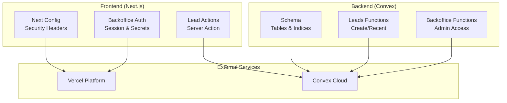
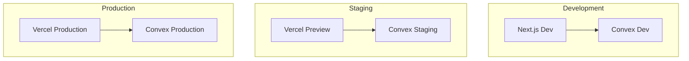
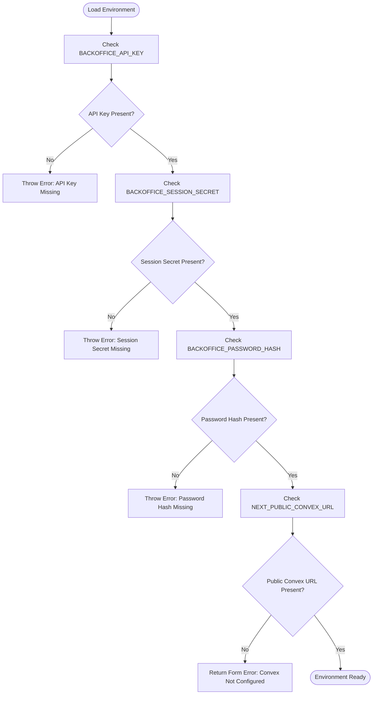
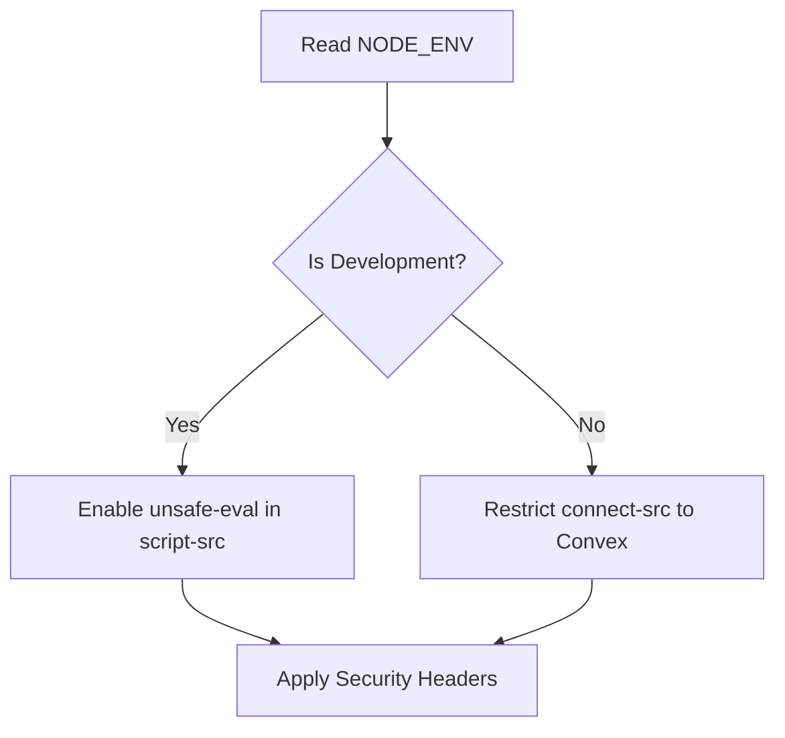
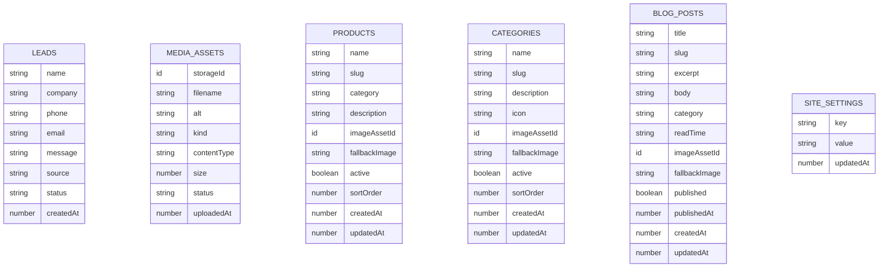
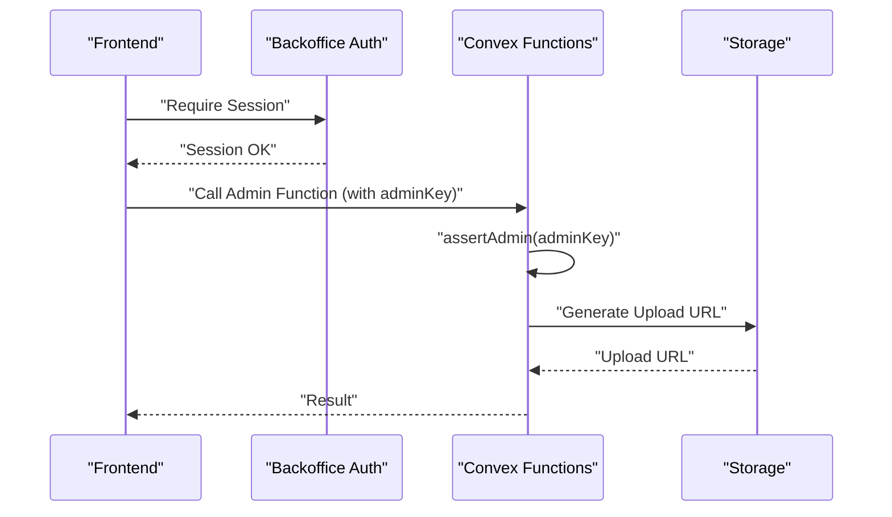
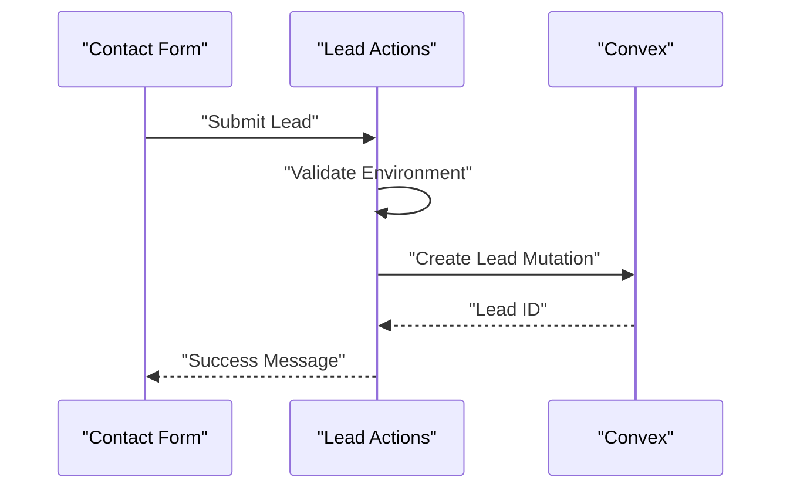
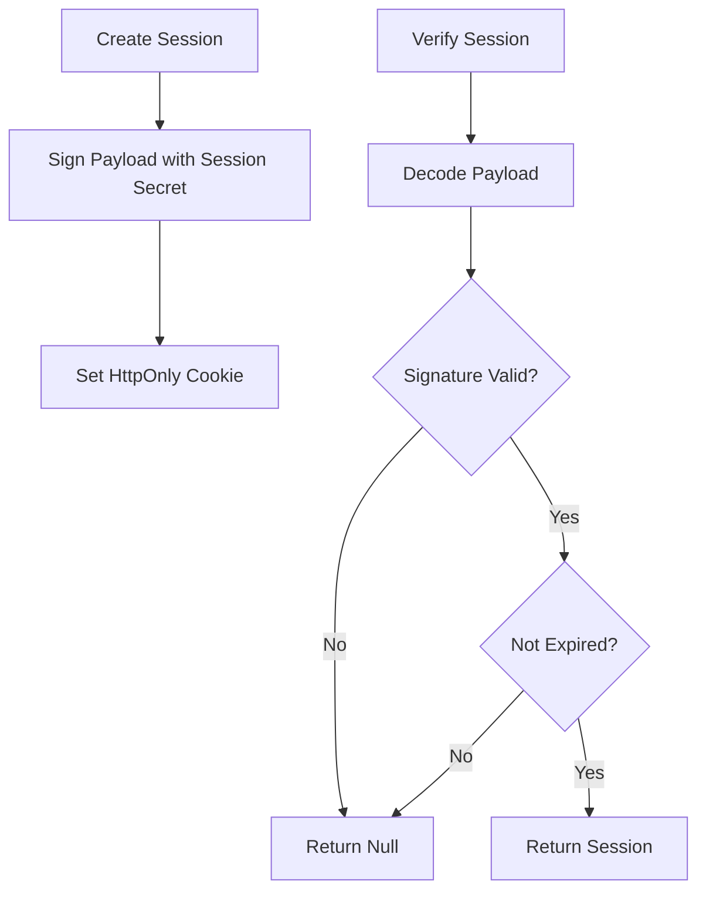
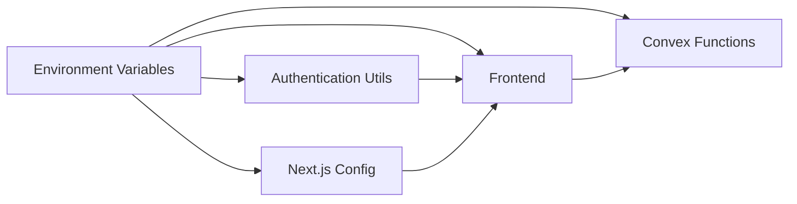

# Environment Management & Configuration

<cite>
**Referenced Files in This Document**
- [package.json](file://package.json)
- [next.config.ts](file://next.config.ts)
- [convex/schema.ts](file://convex/schema.ts)
- [convex/leads.ts](file://convex/leads.ts)
- [convex/backoffice.ts](file://convex/backoffice.ts)
- [lib/backoffice-auth.ts](file://lib/backoffice-auth.ts)
- [lib/backoffice-data.ts](file://lib/backoffice-data.ts)
- [app/actions/lead-actions.ts](file://app/actions/lead-actions.ts)
- [docs/BACKOFFICE.md](file://docs/BACKOFFICE.md)
- [docs/CONVEX.md](file://docs/CONVEX.md)
- [.vercelignore](file://.vercelignore)
</cite>

## Table of Contents
1. [Introduction](#introduction)
2. [Project Structure](#project-structure)
3. [Core Components](#core-components)
4. [Architecture Overview](#architecture-overview)
5. [Detailed Component Analysis](#detailed-component-analysis)
6. [Dependency Analysis](#dependency-analysis)
7. [Performance Considerations](#performance-considerations)
8. [Troubleshooting Guide](#troubleshooting-guide)
9. [Conclusion](#conclusion)
10. [Appendices](#appendices)

## Introduction
This document provides comprehensive environment management and configuration guidance for development, staging, and production environments. It covers environment variable configuration (including sensitive data), environment-specific configuration files, deployment setup with Convex and Vercel, configuration management (secrets, validation, environment switching), CI/CD considerations, monitoring and alerting, isolation and security, troubleshooting, and migration procedures.

## Project Structure
The project is a Next.js application integrated with Convex for backend logic and data. Environment-sensitive configuration is primarily managed via environment variables consumed by:
- Frontend runtime via Next.js configuration and client-side actions
- Backend runtime via Convex functions
- Authentication and session management via server-side utilities

**Diagram sources**
- [next.config.ts:1-91](file://next.config.ts#L1-L91)
- [app/actions/lead-actions.ts:1-49](file://app/actions/lead-actions.ts#L1-L49)
- [lib/backoffice-auth.ts:1-129](file://lib/backoffice-auth.ts#L1-L129)
- [convex/schema.ts:1-87](file://convex/schema.ts#L1-L87)
- [convex/leads.ts:1-32](file://convex/leads.ts#L1-L32)
- [convex/backoffice.ts:1-385](file://convex/backoffice.ts#L1-L385)

**Section sources**
- [package.json:1-51](file://package.json#L1-L51)
- [next.config.ts:1-91](file://next.config.ts#L1-L91)
- [docs/CONVEX.md:1-48](file://docs/CONVEX.md#L1-L48)
- [.vercelignore:1-13](file://.vercelignore#L1-L13)

## Core Components
- Environment variables and secrets
  - BACKOFFICE_API_KEY: used to protect admin endpoints in Convex and frontend backoffice access
  - BACKOFFICE_SESSION_SECRET: used to sign and validate session cookies
  - BACKOFFICE_PASSWORD_HASH: stores a server-side hashed password for admin login
  - NEXT_PUBLIC_CONVEX_URL: public URL pointing to the Convex deployment
  - NODE_ENV: determines runtime behavior (e.g., security headers, cookie secure flag)
- Next.js configuration
  - Security headers and CSP tailored to development vs production
  - Remote image hosts for Convex assets
- Convex schema and functions
  - Schema defines data tables and indices
  - Leads functions expose creation and retrieval
  - Backoffice functions enforce admin access via API key and provide admin operations
- Authentication utilities
  - Session creation, verification, and clearing with HMAC signatures
  - Password hashing and verification using scrypt
- Frontend actions
  - Server action validates environment readiness and forwards form submissions to Convex

**Section sources**
- [lib/backoffice-auth.ts:1-129](file://lib/backoffice-auth.ts#L1-L129)
- [convex/backoffice.ts:25-31](file://convex/backoffice.ts#L25-L31)
- [app/actions/lead-actions.ts:44-49](file://app/actions/lead-actions.ts#L44-L49)
- [next.config.ts:63-91](file://next.config.ts#L63-L91)
- [convex/schema.ts:1-87](file://convex/schema.ts#L1-L87)
- [convex/leads.ts:1-32](file://convex/leads.ts#L1-L32)

## Architecture Overview
The environment architecture separates concerns across:
- Development: local Convex dev server, local Next.js dev server, local secrets
- Staging: Convex staging deployment, Vercel preview deployment, staging secrets
- Production: Convex production deployment, Vercel production deployment, production secrets

**Diagram sources**
- [docs/CONVEX.md:34-48](file://docs/CONVEX.md#L34-L48)
- [docs/BACKOFFICE.md:31-36](file://docs/BACKOFFICE.md#L31-L36)

## Detailed Component Analysis

### Environment Variables and Secrets Management
- Secret locations and usage
  - Convex admin API key: enforced in Convex functions and used by frontend backoffice utilities
  - Session secret: used to sign and validate session cookies
  - Password hash: used to authenticate admin login
  - Public Convex URL: used by frontend to route server actions to the correct Convex deployment
- Validation and error handling
  - Missing secrets cause explicit errors during authentication and backoffice operations
  - Session verification includes signature validation and expiration checks
- Environment-specific differences
  - Development: local Convex URL and local secrets
  - Staging: staging Convex URL and staging secrets
  - Production: production Convex URL and production secrets

**Diagram sources**
- [lib/backoffice-auth.ts:18-26](file://lib/backoffice-auth.ts#L18-L26)
- [lib/backoffice-auth.ts:41-58](file://lib/backoffice-auth.ts#L41-L58)
- [app/actions/lead-actions.ts:44-49](file://app/actions/lead-actions.ts#L44-L49)

**Section sources**
- [lib/backoffice-auth.ts:18-26](file://lib/backoffice-auth.ts#L18-L26)
- [lib/backoffice-auth.ts:41-58](file://lib/backoffice-auth.ts#L41-L58)
- [lib/backoffice-auth.ts:120-128](file://lib/backoffice-auth.ts#L120-L128)
- [app/actions/lead-actions.ts:44-49](file://app/actions/lead-actions.ts#L44-L49)
- [docs/BACKOFFICE.md:13-21](file://docs/BACKOFFICE.md#L13-L21)
- [docs/CONVEX.md:16-25](file://docs/CONVEX.md#L16-L25)

### Next.js Security Headers and CSP
- Security headers are applied conditionally based on NODE_ENV
- CSP allows images from Convex domains and restricts connect-src to Convex in production
- Development mode relaxes CSP to enable local WebSocket connections

**Diagram sources**
- [next.config.ts:6-25](file://next.config.ts#L6-L25)
- [next.config.ts:80-87](file://next.config.ts#L80-L87)

**Section sources**
- [next.config.ts:6-25](file://next.config.ts#L6-L25)
- [next.config.ts:80-87](file://next.config.ts#L80-L87)

### Convex Schema and Data Model
- Defines tables for leads, mediaAssets, products, categories, blogPosts, and siteSettings
- Includes indices for efficient queries by status, sort order, slug, and timestamps
- Used by both public and admin Convex functions

**Diagram sources**
- [convex/schema.ts:4-86](file://convex/schema.ts#L4-L86)

**Section sources**
- [convex/schema.ts:4-86](file://convex/schema.ts#L4-L86)

### Convex Admin Functions and Access Control
- Admin functions enforce access via BACKOFFICE_API_KEY
- Functions include media upload URL generation, asset CRUD, dashboard stats, and content lists
- Public content query returns curated content for the site

**Diagram sources**
- [lib/backoffice-auth.ts:120-128](file://lib/backoffice-auth.ts#L120-L128)
- [convex/backoffice.ts:25-31](file://convex/backoffice.ts#L25-L31)
- [convex/backoffice.ts:68-74](file://convex/backoffice.ts#L68-L74)

**Section sources**
- [convex/backoffice.ts:25-31](file://convex/backoffice.ts#L25-L31)
- [convex/backoffice.ts:68-74](file://convex/backoffice.ts#L68-L74)
- [lib/backoffice-auth.ts:120-128](file://lib/backoffice-auth.ts#L120-L128)

### Frontend Server Actions and Convex Integration
- Server action validates environment readiness and forwards lead submissions to Convex
- Uses NEXT_PUBLIC_CONVEX_URL to determine the target Convex deployment

**Diagram sources**
- [app/actions/lead-actions.ts:32-49](file://app/actions/lead-actions.ts#L32-L49)
- [convex/leads.ts:7-24](file://convex/leads.ts#L7-L24)

**Section sources**
- [app/actions/lead-actions.ts:32-49](file://app/actions/lead-actions.ts#L32-L49)
- [convex/leads.ts:7-24](file://convex/leads.ts#L7-L24)

### Authentication Utilities and Session Management
- Session creation signs payload with BACKOFFICE_SESSION_SECRET and sets HttpOnly cookie
- Session verification decodes payload, validates signature, and checks expiration
- Password verification uses scrypt with stored salt and hash

**Diagram sources**
- [lib/backoffice-auth.ts:60-76](file://lib/backoffice-auth.ts#L60-L76)
- [lib/backoffice-auth.ts:83-108](file://lib/backoffice-auth.ts#L83-L108)

**Section sources**
- [lib/backoffice-auth.ts:60-76](file://lib/backoffice-auth.ts#L60-L76)
- [lib/backoffice-auth.ts:83-108](file://lib/backoffice-auth.ts#L83-L108)

## Dependency Analysis
- Frontend depends on environment variables for Convex URL and backoffice access
- Convex functions depend on environment variables for admin access control
- Authentication utilities depend on session secret and password hash
- Next.js configuration depends on NODE_ENV for security header behavior

**Diagram sources**
- [app/actions/lead-actions.ts:44-49](file://app/actions/lead-actions.ts#L44-L49)
- [lib/backoffice-auth.ts:18-26](file://lib/backoffice-auth.ts#L18-L26)
- [convex/backoffice.ts:25-31](file://convex/backoffice.ts#L25-L31)
- [next.config.ts:6-25](file://next.config.ts#L6-L25)

**Section sources**
- [app/actions/lead-actions.ts:44-49](file://app/actions/lead-actions.ts#L44-L49)
- [lib/backoffice-auth.ts:18-26](file://lib/backoffice-auth.ts#L18-L26)
- [convex/backoffice.ts:25-31](file://convex/backoffice.ts#L25-L31)
- [next.config.ts:6-25](file://next.config.ts#L6-L25)

## Performance Considerations
- Minimize unnecessary re-renders by leveraging Convex caching and indices
- Use appropriate limits in queries (e.g., MAX_ITEMS) to avoid heavy payloads
- Keep CSP restrictive to reduce potential overhead from inline scripts in development
- Ensure production builds disable development-only allowances (e.g., unsafe-eval)

## Troubleshooting Guide
- Missing NEXT_PUBLIC_CONVEX_URL
  - Symptom: Form submission returns an error indicating Convex is not configured
  - Resolution: Set NEXT_PUBLIC_CONVEX_URL in the environment and redeploy
- Missing BACKOFFICE_API_KEY
  - Symptom: Unauthorized error when accessing admin functions
  - Resolution: Set BACKOFFICE_API_KEY in Convex and environment variables
- Missing BACKOFFICE_SESSION_SECRET
  - Symptom: Session creation fails with an error
  - Resolution: Set BACKOFFICE_SESSION_SECRET and restart the server
- Missing BACKOFFICE_PASSWORD_HASH
  - Symptom: Login fails with an error
  - Resolution: Generate a scrypt hash and set BACKOFFICE_PASSWORD_HASH
- Development CSP blocking local WebSocket
  - Symptom: Local dev server WebSocket blocked by CSP
  - Resolution: Development mode intentionally enables unsafe-eval and local connect-src

**Section sources**
- [app/actions/lead-actions.ts:44-49](file://app/actions/lead-actions.ts#L44-L49)
- [lib/backoffice-auth.ts:18-26](file://lib/backoffice-auth.ts#L18-L26)
- [lib/backoffice-auth.ts:41-58](file://lib/backoffice-auth.ts#L41-L58)
- [lib/backoffice-auth.ts:120-128](file://lib/backoffice-auth.ts#L120-L128)
- [next.config.ts:6-25](file://next.config.ts#L6-L25)

## Conclusion
This project’s environment management relies on a small set of environment variables that control Convex connectivity, admin access, and session security. By enforcing strict environment validation, using secure headers, and maintaining separate secrets per environment, the system achieves robust isolation and security across development, staging, and production tiers.

## Appendices

### Environment Variable Reference
- BACKOFFICE_API_KEY: Admin access key for Convex functions and backoffice
- BACKOFFICE_SESSION_SECRET: Secret for signing session cookies
- BACKOFFICE_PASSWORD_HASH: Scrypt-stored admin password hash
- NEXT_PUBLIC_CONVEX_URL: Public URL of the Convex deployment
- NODE_ENV: Controls security headers and cookie secure flag

**Section sources**
- [docs/BACKOFFICE.md:13-21](file://docs/BACKOFFICE.md#L13-L21)
- [docs/CONVEX.md:16-25](file://docs/CONVEX.md#L16-L25)
- [next.config.ts:6-25](file://next.config.ts#L6-L25)

### Deployment Environment Setup
- Convex
  - Development: run local dev and configure NEXT_PUBLIC_CONVEX_URL accordingly
  - Staging/Production: deploy functions and set NEXT_PUBLIC_CONVEX_URL to the production Convex URL
- Vercel
  - Set environment variables per environment
  - Ignore sensitive files via .vercelignore

**Section sources**
- [docs/CONVEX.md:34-48](file://docs/CONVEX.md#L34-L48)
- [.vercelignore:9-12](file://.vercelignore#L9-L12)

### CI/CD Pipeline Guidance
- Environment switching
  - Use branch-specific environment variables for staging
  - Use production variables for production deployments
- Automated provisioning
  - Use Convex CLI to set environment variables per environment
  - Use Vercel CLI or platform UI to manage environment variables
- Configuration validation
  - Validate presence of NEXT_PUBLIC_CONVEX_URL and BACKOFFICE_* variables before deploying

**Section sources**
- [docs/CONVEX.md:27-32](file://docs/CONVEX.md#L27-L32)
- [docs/BACKOFFICE.md:31-36](file://docs/BACKOFFICE.md#L31-L36)

### Monitoring, Health Checks, Metrics, and Alerting
- Health checks
  - Monitor Convex function availability and response times
  - Monitor Next.js server health endpoints
- Metrics
  - Track lead submission latency and failure rates
  - Track admin access attempts and session creation success
- Alerting
  - Alert on missing environment variables at startup
  - Alert on repeated unauthorized access attempts

[No sources needed since this section provides general guidance]

### Environment Isolation and Security
- Isolation
  - Separate Convex deployments per environment
  - Separate Vercel projects per environment
- Security
  - Use strong, randomly generated secrets
  - Enforce HTTPS and secure cookies in production
  - Restrict CSP in production to known domains

**Section sources**
- [next.config.ts:63-91](file://next.config.ts#L63-L91)
- [lib/backoffice-auth.ts:69-75](file://lib/backoffice-auth.ts#L69-L75)

### Emergency Response Protocols
- Immediate actions
  - Rotate BACKOFFICE_API_KEY and BACKOFFICE_SESSION_SECRET
  - Rotate BACKOFFICE_PASSWORD_HASH
  - Reconfigure NEXT_PUBLIC_CONVEX_URL if deployment URL changed
- Communication
  - Notify stakeholders and update status pages
- Post-mortem
  - Review logs and environment variable drift

**Section sources**
- [docs/BACKOFFICE.md:31-36](file://docs/BACKOFFICE.md#L31-L36)

### Environment Migration and Configuration Drift Detection
- Migration steps
  - Export current environment variables from source environment
  - Import variables into destination environment
  - Validate Convex connectivity and admin access
- Drift detection
  - Periodically diff environment variables across environments
  - Monitor for unexpected changes in NEXT_PUBLIC_CONVEX_URL

**Section sources**
- [docs/CONVEX.md:27-32](file://docs/CONVEX.md#L27-L32)
- [docs/BACKOFFICE.md:31-36](file://docs/BACKOFFICE.md#L31-L36)