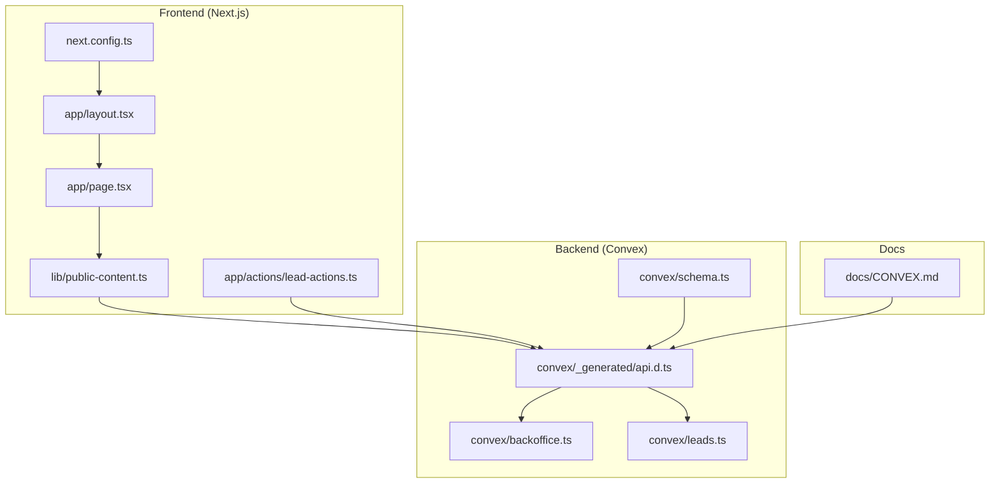
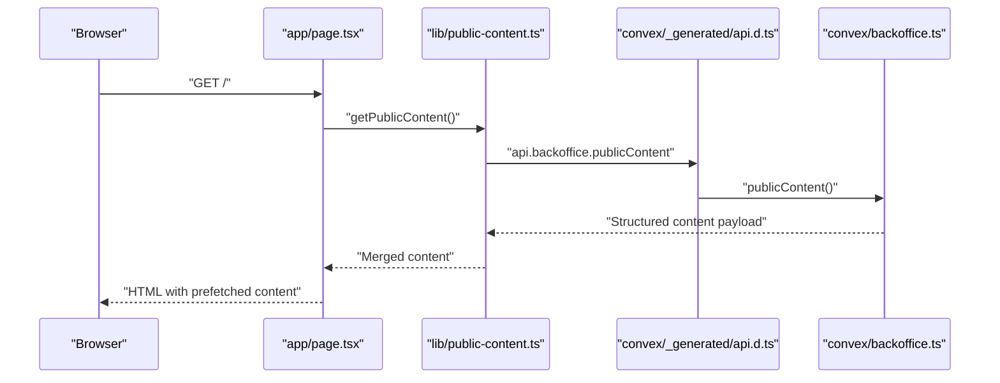
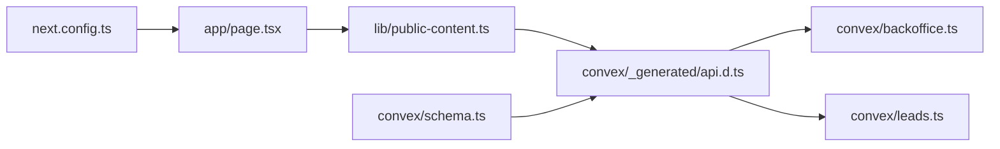

# Production Monitoring & Alerting

<cite>
**Referenced Files in This Document**
- [package.json](file://package.json)
- [next.config.ts](file://next.config.ts)
- [schema.ts](file://convex/schema.ts)
- [api.d.ts](file://convex/_generated/api.d.ts)
- [backoffice.ts](file://convex/backoffice.ts)
- [leads.ts](file://convex/leads.ts)
- [public-content.ts](file://lib/public-content.ts)
- [CONVEX.md](file://docs/CONVEX.md)
- [lead-actions.ts](file://app/actions/lead-actions.ts)
- [layout.tsx](file://app/layout.tsx)
- [page.tsx](file://app/page.tsx)
</cite>

## Table of Contents
1. [Introduction](#introduction)
2. [Project Structure](#project-structure)
3. [Core Components](#core-components)
4. [Architecture Overview](#architecture-overview)
5. [Detailed Component Analysis](#detailed-component-analysis)
6. [Dependency Analysis](#dependency-analysis)
7. [Performance Considerations](#performance-considerations)
8. [Troubleshooting Guide](#troubleshooting-guide)
9. [Conclusion](#conclusion)
10. [Appendices](#appendices)

## Introduction
This document provides production-grade monitoring and alerting guidance for the deployed application stack. It covers frontend monitoring (performance metrics, error tracking, user experience), backend monitoring (database performance, function execution times, resource utilization), real-time monitoring for Convex database operations and API response times, alerting configuration (threshold-based alerts, notification channels, escalation), log aggregation (structured logging, log analysis, debugging workflows), uptime monitoring (health checks, synthetic transactions, availability metrics), performance monitoring (Core Web Vitals, server response times, database query performance), incident response procedures (alert triage, investigation workflows, resolution tracking), and dashboard configuration for operational visibility.

The application is a Next.js frontend integrated with Convex for data and media assets. Monitoring should focus on:
- Frontend: client-side performance, error collection, and user journey observability.
- Backend: Convex function latency and throughput, database query performance, and storage operations.
- Real-time: live content queries and lead submissions.
- Observability: structured logs, dashboards, and alerting policies.

## Project Structure
The repository follows a conventional Next.js structure with a dedicated Convex backend module. Key areas for monitoring:
- Frontend runtime and build pipeline
- Convex schema, functions, and generated API bindings
- Data access utilities and server actions
- Security and CSP configuration affecting network and performance telemetry

**Diagram sources**
- [layout.tsx:1-104](file://app/layout.tsx#L1-L104)
- [page.tsx:1-312](file://app/page.tsx#L1-L312)
- [public-content.ts:1-107](file://lib/public-content.ts#L1-L107)
- [lead-actions.ts:1-49](file://app/actions/lead-actions.ts#L1-L49)
- [next.config.ts:1-91](file://next.config.ts#L1-L91)
- [schema.ts:1-87](file://convex/schema.ts#L1-L87)
- [api.d.ts:1-52](file://convex/_generated/api.d.ts#L1-L52)
- [backoffice.ts:1-385](file://convex/backoffice.ts#L1-L385)
- [leads.ts:1-32](file://convex/leads.ts#L1-L32)
- [CONVEX.md:1-59](file://docs/CONVEX.md#L1-L59)

**Section sources**
- [package.json:1-51](file://package.json#L1-L51)
- [next.config.ts:1-91](file://next.config.ts#L1-L91)
- [schema.ts:1-87](file://convex/schema.ts#L1-L87)
- [api.d.ts:1-52](file://convex/_generated/api.d.ts#L1-L52)
- [backoffice.ts:1-385](file://convex/backoffice.ts#L1-L385)
- [leads.ts:1-32](file://convex/leads.ts#L1-L32)
- [public-content.ts:1-107](file://lib/public-content.ts#L1-L107)
- [CONVEX.md:1-59](file://docs/CONVEX.md#L1-L59)
- [lead-actions.ts:1-49](file://app/actions/lead-actions.ts#L1-L49)
- [layout.tsx:1-104](file://app/layout.tsx#L1-L104)
- [page.tsx:1-312](file://app/page.tsx#L1-L312)

## Core Components
- Frontend runtime and navigation: Next.js pages and layout define the user-facing surface and metadata.
- Data access layer: Convex-generated API bindings expose typed functions for reads/writes.
- Content retrieval: Public content query aggregates products, categories, blog posts, and media assets.
- Lead submission: Server action validates form inputs and invokes Convex mutation.
- Security posture: CSP and headers influence network behavior and telemetry routing.

Key monitoring touchpoints:
- Frontend: page load metrics, hydration errors, and user interaction tracking.
- Backend: Convex function latency, database query counts, and storage URL generation.
- Real-time: public content refresh cadence and lead submission flow.

**Section sources**
- [layout.tsx:1-104](file://app/layout.tsx#L1-L104)
- [page.tsx:1-312](file://app/page.tsx#L1-L312)
- [public-content.ts:65-106](file://lib/public-content.ts#L65-L106)
- [lead-actions.ts:32-49](file://app/actions/lead-actions.ts#L32-L49)
- [api.d.ts:20-52](file://convex/_generated/api.d.ts#L20-L52)
- [schema.ts:1-87](file://convex/schema.ts#L1-L87)

## Architecture Overview
The application integrates a Next.js frontend with Convex for data and media. The frontend queries public content via a Convex query and submits leads via a mutation. Security headers and CSP restrict outbound connections to trusted domains.

**Diagram sources**
- [page.tsx:28-31](file://app/page.tsx#L28-L31)
- [public-content.ts:65-106](file://lib/public-content.ts#L65-L106)
- [api.d.ts:20-52](file://convex/_generated/api.d.ts#L20-L52)
- [backoffice.ts:319-384](file://convex/backoffice.ts#L319-L384)

**Section sources**
- [page.tsx:28-31](file://app/page.tsx#L28-L31)
- [public-content.ts:65-106](file://lib/public-content.ts#L65-L106)
- [api.d.ts:20-52](file://convex/_generated/api.d.ts#L20-L52)
- [backoffice.ts:319-384](file://convex/backoffice.ts#L319-L384)

## Detailed Component Analysis

### Frontend Monitoring Setup
- Performance metrics:
  - Track Largest Contentful Paint (LCP), First Input Delay (FID), and Cumulative Layout Shift (CLS) via web vitals collection.
  - Measure server response times for initial page data fetching and subsequent client-side navigation.
- Error tracking:
  - Capture unhandled promise rejections and JavaScript errors at the browser level.
  - Log client-side hydration errors and failed data fetches.
- User experience monitoring:
  - Instrument key user journeys (navigation, lead submission, content loading).
  - Track conversion funnels and drop-off points.

Implementation guidance:
- Add a lightweight web vitals beacon to capture and forward metrics to your analytics platform.
- Wrap data fetching with error boundaries and retry logic; surface user-friendly messages on failure.
- Integrate a privacy-compliant error reporting service and ensure CSP allows telemetry endpoints.

[No sources needed since this section provides general guidance]

### Backend Monitoring Configuration
- Convex function execution:
  - Monitor latency percentiles for public content queries and lead submissions.
  - Track invocation rates, error rates, and retry counts for mutations.
- Database performance:
  - Observe query counts per index and sort order for tables such as leads, mediaAssets, products, categories, and blogPosts.
  - Watch for slow scans and missing indexes impacting performance.
- Resource utilization:
  - Track CPU and memory usage of Convex functions and storage operations.
  - Monitor outbound network requests to Convex endpoints and image CDN.

[No sources needed since this section provides general guidance]

### Real-Time Monitoring for Convex Operations
- Live content updates:
  - Implement cache-busting or revalidation strategies for public content to balance freshness and cost.
  - Monitor revalidation intervals and cache hit ratios.
- API response times:
  - Measure end-to-end latency for public content queries and lead submissions.
  - Track retries and timeouts during data fetches.

[No sources needed since this section provides general guidance]

### Alerting Configuration
- Threshold-based alerts:
  - Set latency SLOs for critical routes and Convex functions.
  - Define error rate thresholds and saturation points for storage and compute.
- Notification channels:
  - Route critical alerts to on-call channels and low-priority notifications to team chat.
- Escalation procedures:
  - Define escalation tiers with defined response targets and communication templates.

[No sources needed since this section provides general guidance]

### Log Aggregation Setup
- Structured logging:
  - Emit structured logs for Convex function invocations, errors, and warnings.
  - Include trace identifiers and contextual fields (user agent, request ID).
- Log analysis:
  - Aggregate logs from frontend and backend; correlate events across layers.
  - Build dashboards for error trends, latency distributions, and throughput.
- Debugging workflows:
  - Provide quick links to recent logs and traces for incidents.
  - Automate log-based anomaly detection for rapid triage.

[No sources needed since this section provides general guidance]

### Uptime Monitoring
- Health checks:
  - Monitor homepage availability and core endpoints (public content query).
- Synthetic transactions:
  - Simulate lead submission and content load journeys regularly.
- Availability metrics:
  - Track uptime SLIs and SLOs aligned with business objectives.

[No sources needed since this section provides general guidance]

### Performance Monitoring
- Core Web Vitals:
  - Enforce targets for LCP, FID, and CLS; alert on regressions.
- Server response times:
  - Track median and p95 response times for Next.js pages and Convex queries.
- Database query performance:
  - Monitor slow queries and missing indexes; optimize based on query patterns.

[No sources needed since this section provides general guidance]

### Incident Response Procedures
- Alert triage:
  - Classify alerts by severity and impact; auto-assign tickets to on-call.
- Investigation workflows:
  - Collect logs, traces, and metrics; reproduce scenarios in staging.
- Resolution tracking:
  - Use runbooks for common issues; maintain an incident timeline and postmortems.

[No sources needed since this section provides general guidance]

### Dashboard Configuration
- Operational visibility:
  - Create dashboards for frontend performance, backend latency, error rates, and database health.
  - Include drill-down capabilities to function-level metrics and logs.
- Real-time views:
  - Provide live tiles for key KPIs and recent incidents.

[No sources needed since this section provides general guidance]

## Dependency Analysis
The frontend depends on Convex for data and media. The generated API types bind the frontend to backend functions. Security headers restrict outbound connections to Convex and image CDNs.

**Diagram sources**
- [page.tsx:28-31](file://app/page.tsx#L28-L31)
- [public-content.ts:65-106](file://lib/public-content.ts#L65-L106)
- [api.d.ts:20-52](file://convex/_generated/api.d.ts#L20-L52)
- [backoffice.ts:319-384](file://convex/backoffice.ts#L319-L384)
- [leads.ts:1-32](file://convex/leads.ts#L1-L32)
- [next.config.ts:1-91](file://next.config.ts#L1-L91)
- [schema.ts:1-87](file://convex/schema.ts#L1-L87)

**Section sources**
- [page.tsx:28-31](file://app/page.tsx#L28-L31)
- [public-content.ts:65-106](file://lib/public-content.ts#L65-L106)
- [api.d.ts:20-52](file://convex/_generated/api.d.ts#L20-L52)
- [backoffice.ts:319-384](file://convex/backoffice.ts#L319-L384)
- [leads.ts:1-32](file://convex/leads.ts#L1-L32)
- [next.config.ts:1-91](file://next.config.ts#L1-L91)
- [schema.ts:1-87](file://convex/schema.ts#L1-L87)

## Performance Considerations
- Frontend:
  - Optimize image delivery and leverage responsive sizing; monitor CLS caused by layout shifts.
  - Minimize client-side work during initial render; defer non-critical features.
- Backend:
  - Use indexed queries and appropriate sort orders to reduce scan costs.
  - Batch related reads/writes to minimize round-trips.
- Real-time:
  - Configure revalidation intervals to balance freshness and cost; monitor cache effectiveness.

[No sources needed since this section provides general guidance]

## Troubleshooting Guide
Common issues and remediation steps:
- Convex not configured:
  - Verify environment variables for the Convex URL and admin keys; ensure they are present in the hosting environment.
- Lead submission failures:
  - Inspect server action error handling and Convex mutation logs; confirm network connectivity to Convex endpoints.
- Public content retrieval errors:
  - Check for fallback behavior and verify that the public content query executes successfully; review index usage and query limits.

**Section sources**
- [public-content.ts:65-106](file://lib/public-content.ts#L65-L106)
- [CONVEX.md:16-32](file://docs/CONVEX.md#L16-L32)
- [lead-actions.ts:32-49](file://app/actions/lead-actions.ts#L32-L49)

## Conclusion
This monitoring and alerting framework emphasizes end-to-end observability across the Next.js frontend and Convex backend. By instrumenting performance, errors, and real-time operations, teams can maintain high availability and responsiveness while scaling efficiently. Adopt the recommended alerting policies, logging standards, and dashboards to achieve operational excellence.

[No sources needed since this section summarizes without analyzing specific files]

## Appendices

### Appendix A: Security Headers Impact on Monitoring
Security policies affect how telemetry and monitoring data can be transmitted. Ensure that monitoring endpoints are permitted by CSP and that headers do not block necessary traffic.

**Section sources**
- [next.config.ts:8-25](file://next.config.ts#L8-L25)
- [next.config.ts:76-87](file://next.config.ts#L76-L87)

### Appendix B: Convex Environment Variables
Ensure environment variables are correctly configured for both development and production deployments to enable reliable monitoring and alerting.

**Section sources**
- [CONVEX.md:16-32](file://docs/CONVEX.md#L16-L32)