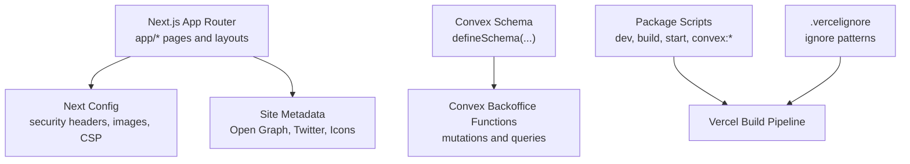
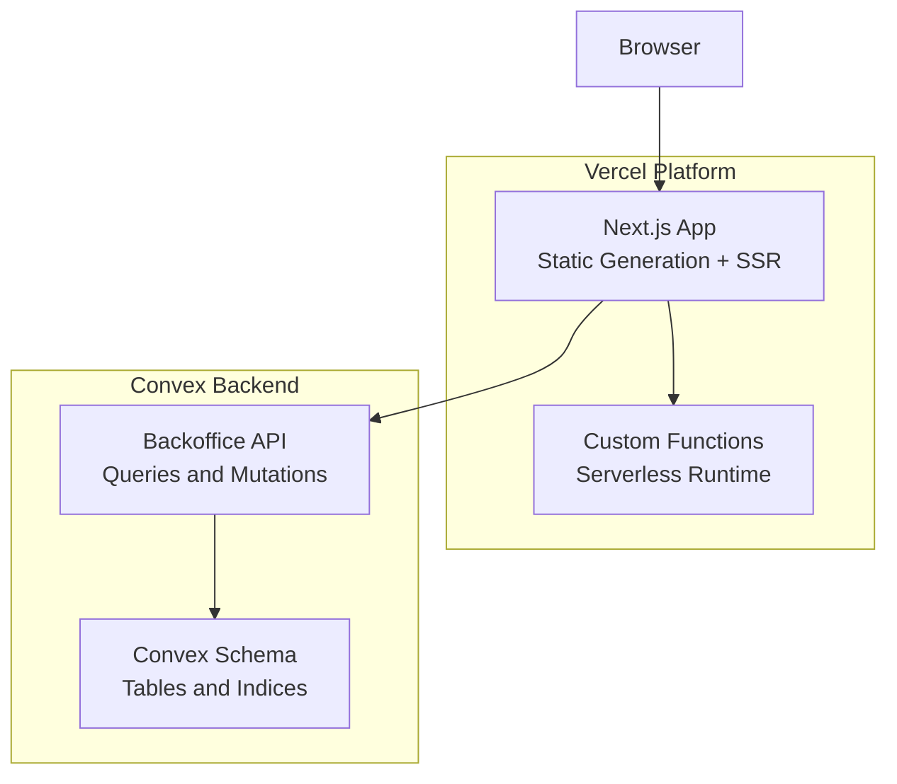
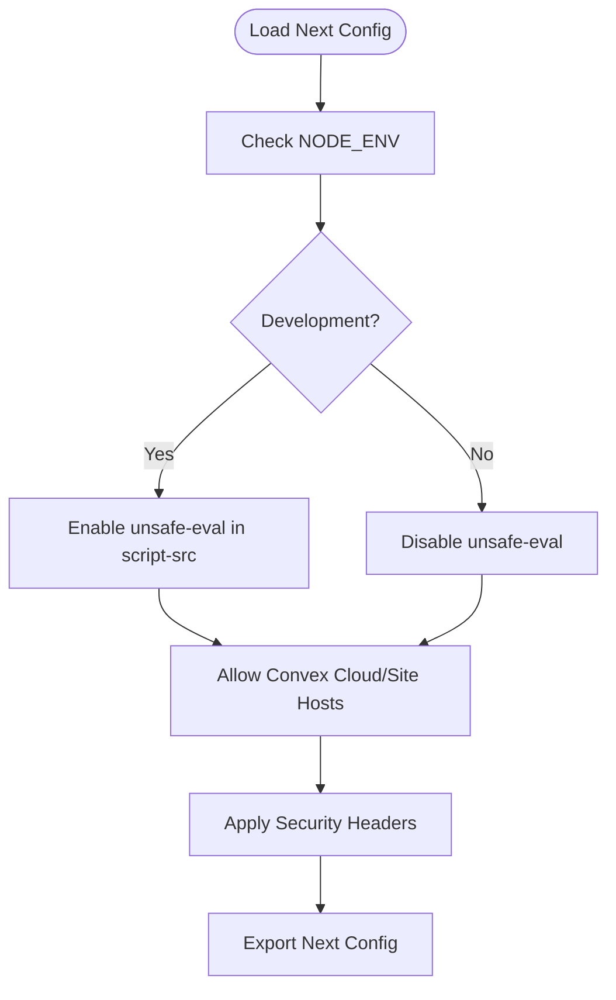
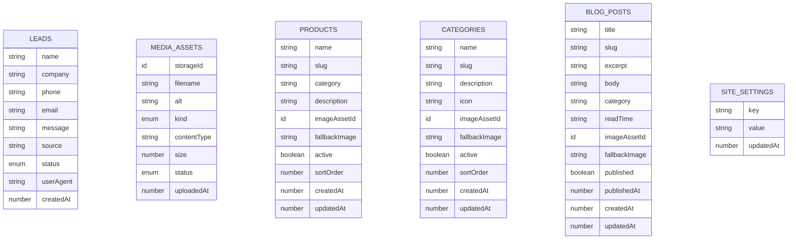
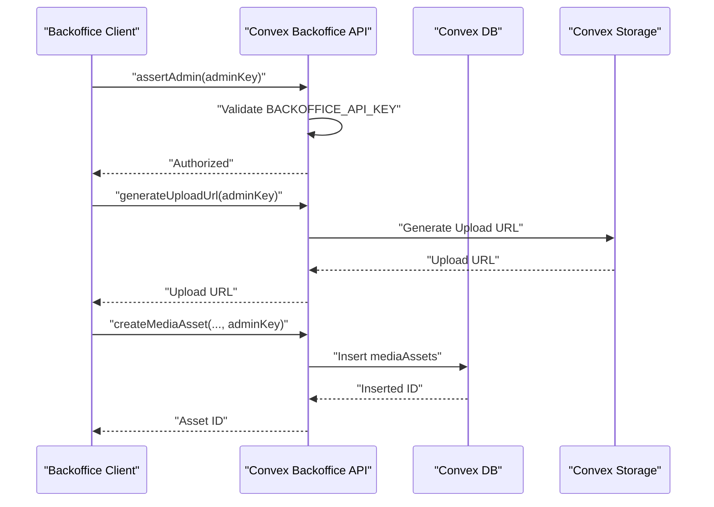
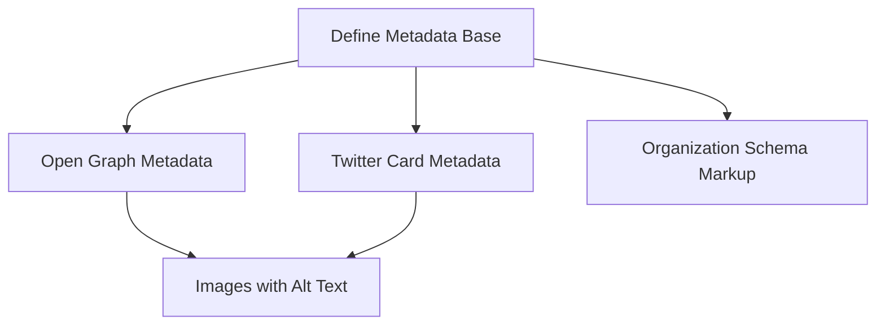
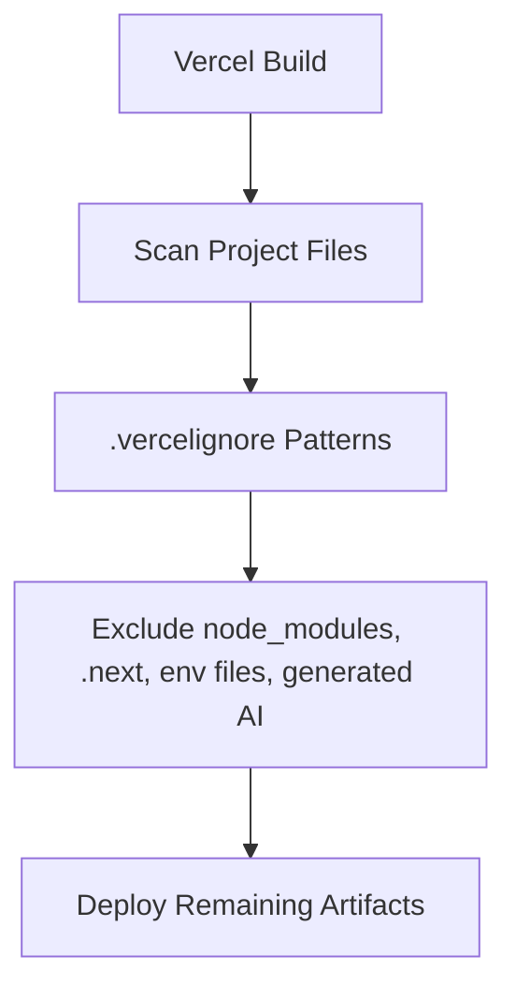
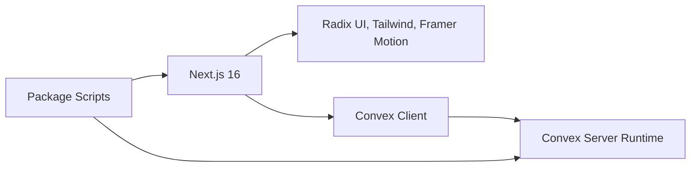

# Vercel Deployment Configuration

<cite>
**Referenced Files in This Document**
- [next.config.ts](file://next.config.ts)
- [package.json](file://package.json)
- [.vercelignore](file://.vercelignore)
- [convex/schema.ts](file://convex/schema.ts)
- [convex/backoffice.ts](file://convex/backoffice.ts)
- [convex/tsconfig.json](file://convex/tsconfig.json)
- [app/layout.tsx](file://app/layout.tsx)
- [lib/site-data.ts](file://lib/site-data.ts)
</cite>

## Table of Contents
1. [Introduction](#introduction)
2. [Project Structure](#project-structure)
3. [Core Components](#core-components)
4. [Architecture Overview](#architecture-overview)
5. [Detailed Component Analysis](#detailed-component-analysis)
6. [Dependency Analysis](#dependency-analysis)
7. [Performance Considerations](#performance-considerations)
8. [Troubleshooting Guide](#troubleshooting-guide)
9. [Conclusion](#conclusion)
10. [Appendices](#appendices)

## Introduction
This document provides comprehensive Vercel deployment guidance for the Next.js application. It covers project setup, environment variables, build configuration, deployment triggers, branch and preview deployments, static site generation and serverless function deployment, custom domain and SSL configuration, CDN behavior, build optimization, image optimization, performance monitoring, rollback procedures, and troubleshooting. The content is grounded in the repository’s configuration files and application structure.

## Project Structure
The repository follows a standard Next.js 16 App Router project layout with a focus on a client-side frontend and a Convex backend. Key deployment-relevant elements include:
- Next.js configuration for security headers, image optimization, and build behavior
- Package scripts for local development, building, and Convex integration
- Convex schema and server functions for database and media asset management
- Application metadata and branding used for SEO and social previews

**Diagram sources**
- [next.config.ts:1-91](file://next.config.ts#L1-L91)
- [app/layout.tsx:1-104](file://app/layout.tsx#L1-L104)
- [convex/schema.ts:1-87](file://convex/schema.ts#L1-L87)
- [convex/backoffice.ts:1-385](file://convex/backoffice.ts#L1-L385)
- [package.json:1-51](file://package.json#L1-L51)
- [.vercelignore:1-14](file://.vercelignore#L1-L14)

**Section sources**
- [next.config.ts:1-91](file://next.config.ts#L1-L91)
- [package.json:1-51](file://package.json#L1-L51)
- [.vercelignore:1-14](file://.vercelignore#L1-L14)
- [app/layout.tsx:1-104](file://app/layout.tsx#L1-L104)
- [convex/schema.ts:1-87](file://convex/schema.ts#L1-L87)
- [convex/backoffice.ts:1-385](file://convex/backoffice.ts#L1-L385)

## Core Components
- Next.js configuration defines Content Security Policy, strict transport security, and image remote patterns for Convex assets.
- Convex schema defines data models for leads, media assets, products, categories, blog posts, and site settings.
- Convex backoffice module exposes mutations and queries for managing content and media, protected by an admin API key.
- Application layout sets metadata base URL, Open Graph, Twitter, and icons for SEO and social sharing.
- Package scripts integrate local development, building, and Convex deployment commands.

**Section sources**
- [next.config.ts:8-61](file://next.config.ts#L8-L61)
- [next.config.ts:63-88](file://next.config.ts#L63-L88)
- [convex/schema.ts:4-86](file://convex/schema.ts#L4-L86)
- [convex/backoffice.ts:25-31](file://convex/backoffice.ts#L25-L31)
- [app/layout.tsx:28-70](file://app/layout.tsx#L28-L70)
- [package.json:5-12](file://package.json#L5-L12)

## Architecture Overview
The deployment architecture combines a Next.js frontend hosted on Vercel with a Convex backend. The frontend enforces security headers and image policies, while the backend manages structured content and media assets. Environment variables are used for admin authentication and runtime behavior.

**Diagram sources**
- [next.config.ts:8-61](file://next.config.ts#L8-L61)
- [convex/schema.ts:4-86](file://convex/schema.ts#L4-L86)
- [convex/backoffice.ts:120-144](file://convex/backoffice.ts#L120-L144)

## Detailed Component Analysis

### Next.js Configuration and Security Headers
- Content Security Policy and security headers are applied globally via Next.js headers configuration.
- Image optimization allows remote images from Convex domains.
- Development vs production behavior adjusts CSP and connect-src entries.

**Diagram sources**
- [next.config.ts:6-25](file://next.config.ts#L6-L25)
- [next.config.ts:27-61](file://next.config.ts#L27-L61)
- [next.config.ts:63-88](file://next.config.ts#L63-L88)

**Section sources**
- [next.config.ts:6-25](file://next.config.ts#L6-L25)
- [next.config.ts:27-61](file://next.config.ts#L27-L61)
- [next.config.ts:63-88](file://next.config.ts#L63-L88)

### Convex Schema and Data Model
- Defines tables for leads, media assets, products, categories, blog posts, and site settings.
- Includes indices for efficient querying by status, sort order, slug, and timestamps.
- Supports media asset URLs via Convex storage integration.

**Diagram sources**
- [convex/schema.ts:4-86](file://convex/schema.ts#L4-L86)

**Section sources**
- [convex/schema.ts:4-86](file://convex/schema.ts#L4-L86)

### Convex Backoffice API
- Admin authentication enforced via a secret API key environment variable.
- Exposes queries for dashboard statistics, lists, and public content.
- Provides mutations for media upload URL generation, asset creation, archiving, and content updates (products, categories, blog posts, site settings).

**Diagram sources**
- [convex/backoffice.ts:25-31](file://convex/backoffice.ts#L25-L31)
- [convex/backoffice.ts:68-74](file://convex/backoffice.ts#L68-L74)
- [convex/backoffice.ts:86-100](file://convex/backoffice.ts#L86-L100)

**Section sources**
- [convex/backoffice.ts:25-31](file://convex/backoffice.ts#L25-L31)
- [convex/backoffice.ts:68-74](file://convex/backoffice.ts#L68-L74)
- [convex/backoffice.ts:86-100](file://convex/backoffice.ts#L86-L100)

### Application Metadata and Social Previews
- Sets metadataBase to the production URL, ensuring canonical links and correct social previews.
- Defines Open Graph and Twitter card metadata with localized branding and images.
- Embeds schema.org Organization markup for SEO.

**Diagram sources**
- [app/layout.tsx:28-70](file://app/layout.tsx#L28-L70)
- [app/layout.tsx:73-99](file://app/layout.tsx#L73-L99)

**Section sources**
- [app/layout.tsx:28-70](file://app/layout.tsx#L28-L70)
- [app/layout.tsx:73-99](file://app/layout.tsx#L73-L99)

### Build and Ignore Configuration
- Next.js build configuration applies security headers and image policies.
- Vercel ignore file excludes development artifacts, generated Convex AI code, and sensitive environment files.

**Diagram sources**
- [next.config.ts:63-88](file://next.config.ts#L63-L88)
- [.vercelignore:1-14](file://.vercelignore#L1-L14)

**Section sources**
- [next.config.ts:63-88](file://next.config.ts#L63-L88)
- [.vercelignore:1-14](file://.vercelignore#L1-L14)

## Dependency Analysis
- Frontend depends on Next.js 16, Radix UI, Tailwind, Framer Motion, and Convex client libraries.
- Convex functions rely on Convex server runtime and schema definitions.
- Package scripts orchestrate local development, building, and Convex deployment.

**Diagram sources**
- [package.json:14-25](file://package.json#L14-L25)
- [convex/tsconfig.json:6-22](file://convex/tsconfig.json#L6-L22)

**Section sources**
- [package.json:14-25](file://package.json#L14-L25)
- [convex/tsconfig.json:6-22](file://convex/tsconfig.json#L6-L22)

## Performance Considerations
- Security headers and CSP reduce XSS risks and enforce safe resource loading.
- Image optimization restricts remote hosts to Convex domains, minimizing cross-origin requests.
- Convex indices improve query performance for dashboard, listings, and public content.
- Localized metadata reduces unnecessary redirects and ensures correct canonical URLs.

[No sources needed since this section provides general guidance]

## Troubleshooting Guide
Common deployment issues and resolutions:
- Build failures due to environment variables:
  - Ensure BACKOFFICE_API_KEY is set in Vercel environment variables for Convex admin endpoints.
  - Verify NODE_ENV is set appropriately for development or production behavior.
- Environment variable conflicts:
  - Keep .env and .env.* excluded via .vercelignore to prevent accidental inclusion.
  - Use Vercel’s project settings to manage environment variables per deployment branch.
- Performance bottlenecks:
  - Confirm Convex indices exist for frequent queries (e.g., by_status, by_created_at).
  - Monitor image loading from Convex domains; ensure remotePatterns remain aligned with deployed assets.
- Preview deployments:
  - Branch-based deployments trigger previews automatically; verify preview URL routing and environment variable overrides.
- Rollbacks:
  - Use Vercel’s “Rollback” action from the deployment history to revert to a previous successful build.
- SSL and custom domains:
  - Add and verify custom domain in Vercel; Vercel handles SSL provisioning automatically.
- Monitoring:
  - Enable Vercel Analytics and use Next.js telemetry to track performance metrics.

**Section sources**
- [convex/backoffice.ts:25-31](file://convex/backoffice.ts#L25-L31)
- [.vercelignore:7-13](file://.vercelignore#L7-L13)
- [convex/schema.ts:16-17](file://convex/schema.ts#L16-L17)
- [convex/schema.ts:34-36](file://convex/schema.ts#L34-L36)
- [convex/schema.ts:48-50](file://convex/schema.ts#L48-L50)
- [convex/schema.ts:63-64](file://convex/schema.ts#L63-L64)
- [convex/schema.ts:78-80](file://convex/schema.ts#L78-L80)
- [next.config.ts:14-16](file://next.config.ts#L14-L16)

## Conclusion
This guide outlines how to configure and deploy the Next.js application on Vercel, including security headers, image optimization, Convex backend integration, and environment management. Following the outlined steps ensures secure, performant, and reliable deployments with robust preview and rollback capabilities.

[No sources needed since this section summarizes without analyzing specific files]

## Appendices

### Vercel Project Setup Checklist
- Connect repository to Vercel and select the correct framework (Next.js).
- Configure build command to use the project’s build script.
- Set environment variables:
  - BACKOFFICE_API_KEY (for Convex admin endpoints)
  - Optional: NODE_ENV for development vs production behavior
- Review .vercelignore to ensure sensitive files are excluded.
- Enable automatic preview deployments for branches and production deployments for the main branch.

**Section sources**
- [package.json:5-12](file://package.json#L5-L12)
- [convex/backoffice.ts:25-31](file://convex/backoffice.ts#L25-L31)
- [.vercelignore:7-13](file://.vercelignore#L7-L13)

### Static Site Generation and Serverless Functions
- Static generation: Next.js generates static HTML for routes; ensure metadata and images are configured for optimal SEO.
- Serverless functions: Use Convex serverless functions for dynamic content and admin operations; protect with environment-based keys.

**Section sources**
- [app/layout.tsx:28-70](file://app/layout.tsx#L28-L70)
- [convex/backoffice.ts:120-144](file://convex/backoffice.ts#L120-L144)

### Custom Domain and SSL
- Add custom domain in Vercel project settings and verify DNS records.
- Vercel provisions and renews SSL certificates automatically; ensure domain propagation completes.

[No sources needed since this section provides general guidance]

### Build Optimization and Image Optimization
- Optimize builds by excluding unnecessary files via .vercelignore.
- Restrict remote images to trusted Convex domains to minimize cross-origin overhead.
- Use Convex storage URLs for media assets to leverage CDN distribution.

**Section sources**
- [.vercelignore:1-14](file://.vercelignore#L1-L14)
- [next.config.ts:64-75](file://next.config.ts#L64-L75)

### Performance Monitoring
- Use Vercel Analytics and Next.js telemetry to monitor build and runtime performance.
- Track image load times and adjust remotePatterns and asset hosting as needed.

[No sources needed since this section provides general guidance]