# Component Architecture

<cite>
**Referenced Files in This Document**
- [app/layout.tsx](file://app/layout.tsx)
- [components/site/site-chrome.tsx](file://components/site/site-chrome.tsx)
- [components/site/navbar.tsx](file://components/site/navbar.tsx)
- [components/site/footer.tsx](file://components/site/footer.tsx)
- [components/site/whatsapp-float.tsx](file://components/site/whatsapp-float.tsx)
- [components/site/contact-form.tsx](file://components/site/contact-form.tsx)
- [components/site/cards.tsx](file://components/site/cards.tsx)
- [components/motion/reveal.tsx](file://components/motion/reveal.tsx)
- [components/ui/button.tsx](file://components/ui/button.tsx)
- [components/ui/input.tsx](file://components/ui/input.tsx)
- [components/ui/textarea.tsx](file://components/ui/textarea.tsx)
- [components/backoffice/admin-ui.tsx](file://components/backoffice/admin-ui.tsx)
- [components/backoffice/backoffice-shell.tsx](file://components/backoffice/backoffice-shell.tsx)
- [lib/site-data.ts](file://lib/site-data.ts)
- [lib/utils.ts](file://lib/utils.ts)
</cite>

## Table of Contents
1. [Introduction](#introduction)
2. [Project Structure](#project-structure)
3. [Core Components](#core-components)
4. [Architecture Overview](#architecture-overview)
5. [Detailed Component Analysis](#detailed-component-analysis)
6. [Dependency Analysis](#dependency-analysis)
7. [Performance Considerations](#performance-considerations)
8. [Accessibility Implementation](#accessibility-implementation)
9. [Testing and Storybook Integration](#testing-and-storybook-integration)
10. [Troubleshooting Guide](#troubleshooting-guide)
11. [Conclusion](#conclusion)

## Introduction
This document explains the component architecture and composition patterns of the Next.js application. It covers the hierarchical organization from the global layout and chrome wrapper down to specialized site components (navbar, footer, floating CTA), the reusable UI component library (button, input, textarea), and the backoffice shell. It also documents composition patterns (container vs presentational, higher-order components), lifecycle and prop management, state handling strategies, performance optimizations, accessibility, and testing approaches.

## Project Structure
The application follows a feature-based component organization:
- Global layout orchestrates the site chrome and page content.
- Site-level components encapsulate shared UI (navigation, footer, floating CTA).
- Motion components provide declarative animations.
- A reusable UI library defines base primitives with variants.
- Backoffice-specific components provide admin shells and helpers.

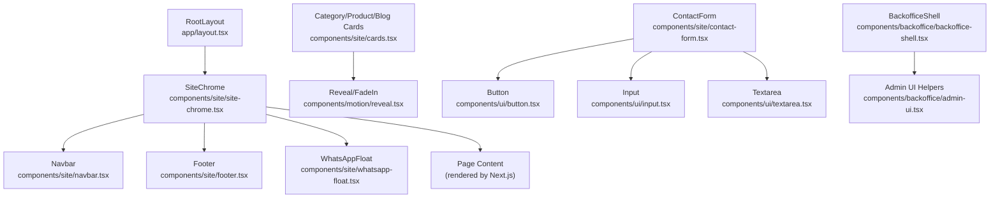

**Diagram sources**
- [app/layout.tsx:72-103](file://app/layout.tsx#L72-L103)
- [components/site/site-chrome.tsx:10-26](file://components/site/site-chrome.tsx#L10-L26)
- [components/site/navbar.tsx:14-115](file://components/site/navbar.tsx#L14-L115)
- [components/site/footer.tsx:7-102](file://components/site/footer.tsx#L7-L102)
- [components/site/whatsapp-float.tsx:5-17](file://components/site/whatsapp-float.tsx#L5-L17)
- [components/site/cards.tsx:17-150](file://components/site/cards.tsx#L17-L150)
- [components/motion/reveal.tsx:11-38](file://components/motion/reveal.tsx#L11-L38)
- [components/site/contact-form.tsx:17-91](file://components/site/contact-form.tsx#L17-L91)
- [components/ui/button.tsx:42-53](file://components/ui/button.tsx#L42-L53)
- [components/ui/input.tsx:7-23](file://components/ui/input.tsx#L7-L23)
- [components/ui/textarea.tsx:7-22](file://components/ui/textarea.tsx#L7-L22)
- [components/backoffice/backoffice-shell.tsx:17-77](file://components/backoffice/backoffice-shell.tsx#L17-L77)
- [components/backoffice/admin-ui.tsx:3-24](file://components/backoffice/admin-ui.tsx#L3-L24)

**Section sources**
- [app/layout.tsx:72-103](file://app/layout.tsx#L72-L103)
- [components/site/site-chrome.tsx:10-26](file://components/site/site-chrome.tsx#L10-L26)

## Core Components
- RootLayout: Provides global metadata, fonts, structured data, and wraps pages with SiteChrome.
- SiteChrome: Conditionally renders the site chrome (navbar, footer, floating CTA) except in backoffice routes.
- Navbar: Responsive navigation with mobile menu, active state highlighting, and animated transitions.
- Footer: Multi-column footer with branding, navigation, product categories, and contact info.
- WhatsAppFloat: Persistent floating action button linking to WhatsApp chat.
- Motion Reveal: Declarative animation component leveraging viewport intersection.
- UI Library: Button (variants and sizes), Input, Textarea with consistent styling and forwardRef support.
- Backoffice Shell: Admin layout with sidebar and responsive header; Admin UI helpers for headers, cards, and field labels.

**Section sources**
- [app/layout.tsx:28-103](file://app/layout.tsx#L28-L103)
- [components/site/site-chrome.tsx:10-26](file://components/site/site-chrome.tsx#L10-L26)
- [components/site/navbar.tsx:14-115](file://components/site/navbar.tsx#L14-L115)
- [components/site/footer.tsx:7-102](file://components/site/footer.tsx#L7-L102)
- [components/site/whatsapp-float.tsx:5-17](file://components/site/whatsapp-float.tsx#L5-L17)
- [components/motion/reveal.tsx:11-38](file://components/motion/reveal.tsx#L11-L38)
- [components/ui/button.tsx:7-53](file://components/ui/button.tsx#L7-L53)
- [components/ui/input.tsx:1-24](file://components/ui/input.tsx#L1-L24)
- [components/ui/textarea.tsx:1-23](file://components/ui/textarea.tsx#L1-L23)
- [components/backoffice/backoffice-shell.tsx:17-77](file://components/backoffice/backoffice-shell.tsx#L17-L77)
- [components/backoffice/admin-ui.tsx:3-24](file://components/backoffice/admin-ui.tsx#L3-L24)

## Architecture Overview
The architecture centers on a single-page-app-like shell for the marketing site and a separate backoffice SPA. The global layout injects the chrome wrapper, which conditionally renders site chrome around page content. Motion components encapsulate animations, and the UI library provides consistent primitives with variants. Data is centralized in a single source-of-truth module.

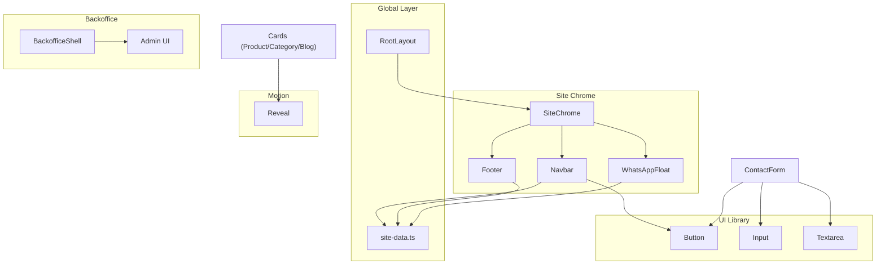

**Diagram sources**
- [app/layout.tsx:72-103](file://app/layout.tsx#L72-L103)
- [components/site/site-chrome.tsx:10-26](file://components/site/site-chrome.tsx#L10-L26)
- [components/site/navbar.tsx:14-115](file://components/site/navbar.tsx#L14-L115)
- [components/site/footer.tsx:7-102](file://components/site/footer.tsx#L7-L102)
- [components/site/whatsapp-float.tsx:5-17](file://components/site/whatsapp-float.tsx#L5-L17)
- [components/motion/reveal.tsx:11-38](file://components/motion/reveal.tsx#L11-L38)
- [components/ui/button.tsx:42-53](file://components/ui/button.tsx#L42-L53)
- [components/ui/input.tsx:7-23](file://components/ui/input.tsx#L7-L23)
- [components/ui/textarea.tsx:7-22](file://components/ui/textarea.tsx#L7-L22)
- [components/backoffice/backoffice-shell.tsx:17-77](file://components/backoffice/backoffice-shell.tsx#L17-L77)
- [components/backoffice/admin-ui.tsx:3-24](file://components/backoffice/admin-ui.tsx#L3-L24)
- [lib/site-data.ts:25-314](file://lib/site-data.ts#L25-L314)

## Detailed Component Analysis

### SiteChrome: Wrapper and Route Control
- Purpose: Central wrapper that decides whether to render the site chrome or pass-through children (used for backoffice).
- Composition: Uses Next.js router hook to detect route and conditionally renders chrome components.
- Props: Accepts ReactNode children; no additional props.
- Lifecycle: Stateless functional component; renders on every navigation.

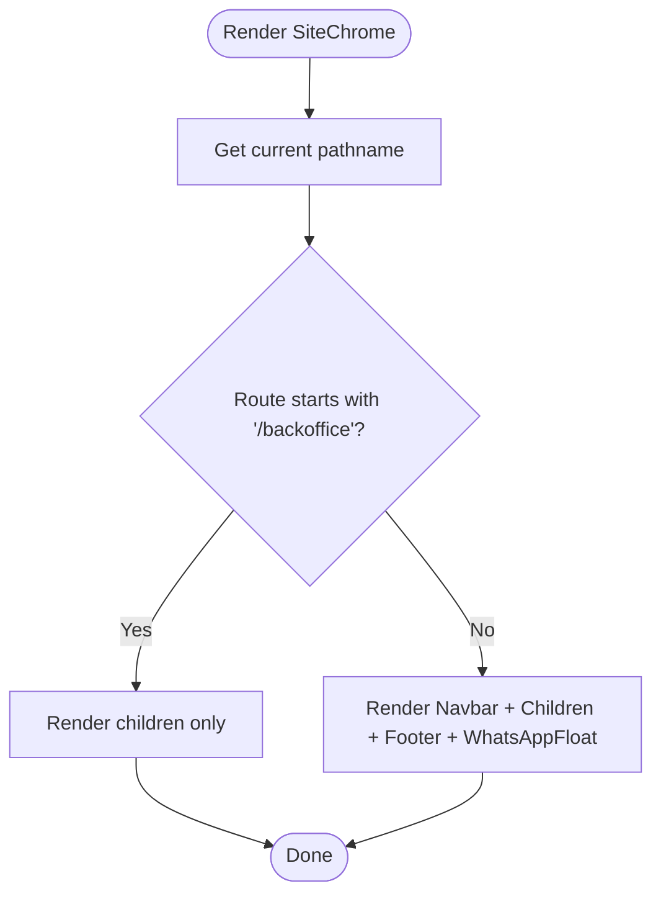

**Diagram sources**
- [components/site/site-chrome.tsx:10-26](file://components/site/site-chrome.tsx#L10-L26)

**Section sources**
- [components/site/site-chrome.tsx:10-26](file://components/site/site-chrome.tsx#L10-L26)

### Navbar: Responsive Navigation with State
- State: Local state toggles mobile menu visibility.
- Composition: Uses motion library for smooth enter/exit animations; integrates Button primitives; reads navigation items and site metadata from data module.
- Accessibility: ARIA labels and expanded state for the mobile menu trigger; keyboard navigable links.
- Props: None; consumes data via imports.

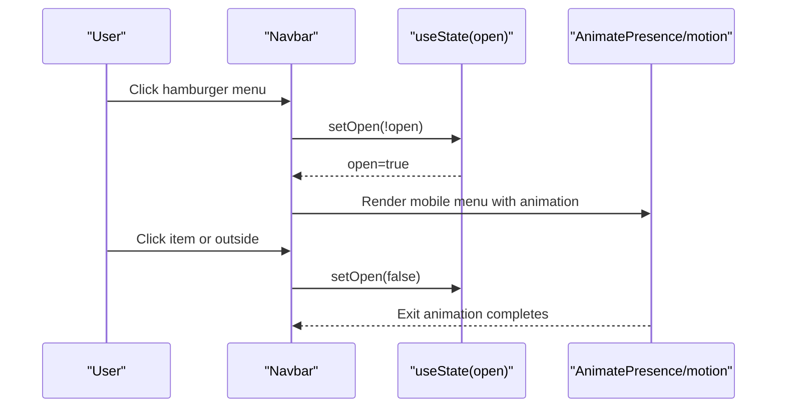

**Diagram sources**
- [components/site/navbar.tsx:14-115](file://components/site/navbar.tsx#L14-L115)

**Section sources**
- [components/site/navbar.tsx:14-115](file://components/site/navbar.tsx#L14-L115)
- [lib/site-data.ts:43-50](file://lib/site-data.ts#L43-L50)

### Footer: Multi-column Information Hub
- Composition: Renders branding, navigation links, product categories, and contact details; uses data module for dynamic content.
- Accessibility: Semantic lists and links; anchor targets are external with noreferrer.

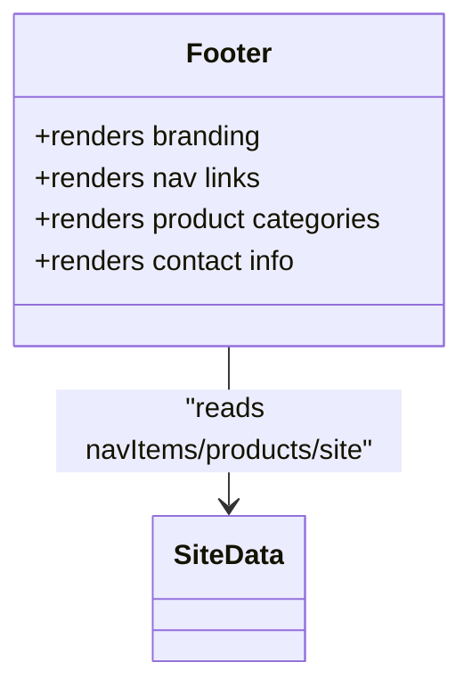

**Diagram sources**
- [components/site/footer.tsx:7-102](file://components/site/footer.tsx#L7-L102)
- [lib/site-data.ts:25-174](file://lib/site-data.ts#L25-L174)

**Section sources**
- [components/site/footer.tsx:7-102](file://components/site/footer.tsx#L7-L102)
- [lib/site-data.ts:25-174](file://lib/site-data.ts#L25-L174)

### WhatsAppFloat: Floating CTA
- Purpose: Persistent floating action to initiate WhatsApp chat.
- Props: None; constructs deep-link with prefilled text from data module.

**Section sources**
- [components/site/whatsapp-float.tsx:5-17](file://components/site/whatsapp-float.tsx#L5-L17)
- [lib/site-data.ts:33](file://lib/site-data.ts#L33)

### Motion Reveal: Animation Primitive
- Purpose: Declarative viewport-triggered reveal with fade-in option.
- Props: Supports delay, className passthrough, and motion-specific props.
- Composition: Uses viewport intersection with once-only behavior and configurable margins.

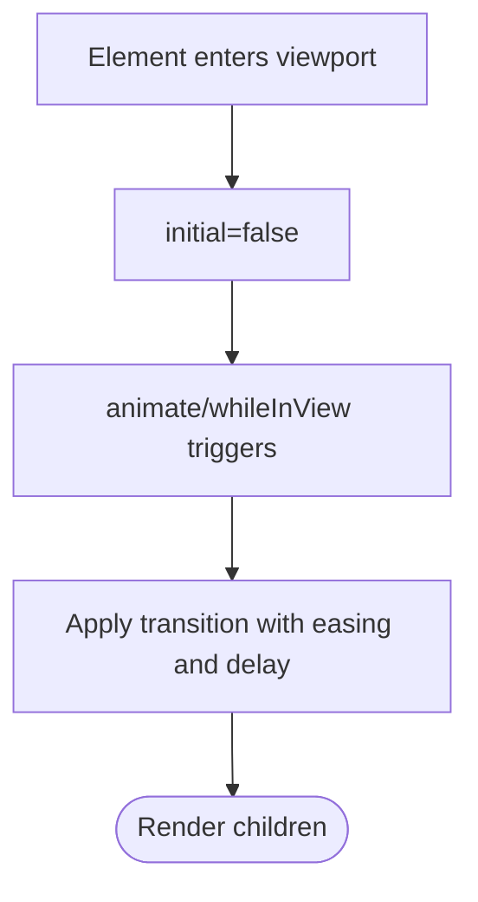

**Diagram sources**
- [components/motion/reveal.tsx:11-38](file://components/motion/reveal.tsx#L11-L38)

**Section sources**
- [components/motion/reveal.tsx:11-38](file://components/motion/reveal.tsx#L11-L38)

### UI Library: Button, Input, Textarea
- Button: Variants (default, green, outline, ghost, inverse) and sizes (default, sm, lg, icon) using class variance authority; supports asChild pattern via radix Slot; forwardRef-enabled.
- Input/Textarea: ForwardRef-enabled base inputs with consistent focus styles and placeholder theming; Input accepts native input attributes; Textarea accepts textarea attributes.

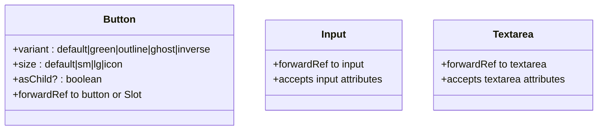

**Diagram sources**
- [components/ui/button.tsx:7-53](file://components/ui/button.tsx#L7-L53)
- [components/ui/input.tsx:1-24](file://components/ui/input.tsx#L1-L24)
- [components/ui/textarea.tsx:1-23](file://components/ui/textarea.tsx#L1-L23)

**Section sources**
- [components/ui/button.tsx:7-53](file://components/ui/button.tsx#L7-L53)
- [components/ui/input.tsx:1-24](file://components/ui/input.tsx#L1-L24)
- [components/ui/textarea.tsx:1-23](file://components/ui/textarea.tsx#L1-L23)

### Backoffice Shell and Admin UI
- BackofficeShell: Provides desktop sidebar and mobile header navigation; includes logout forms bound to server actions; wraps children in a responsive layout.
- Admin UI: Presentational helpers for admin pages: AdminHeader, AdminCard, and Field.

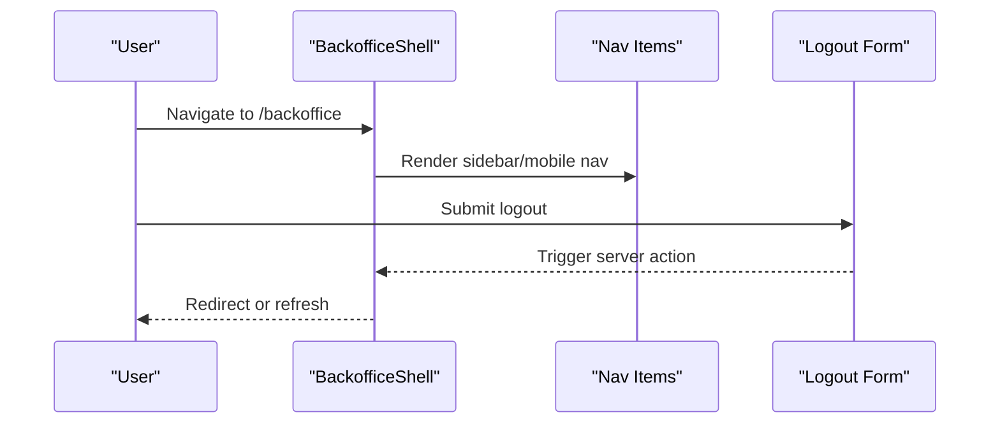

**Diagram sources**
- [components/backoffice/backoffice-shell.tsx:17-77](file://components/backoffice/backoffice-shell.tsx#L17-L77)
- [components/backoffice/admin-ui.tsx:3-24](file://components/backoffice/admin-ui.tsx#L3-L24)

**Section sources**
- [components/backoffice/backoffice-shell.tsx:17-77](file://components/backoffice/backoffice-shell.tsx#L17-L77)
- [components/backoffice/admin-ui.tsx:3-24](file://components/backoffice/admin-ui.tsx#L3-L24)

### ContactForm: Container Component with Server Actions
- State Management: Uses Next.js useActionState to manage submission state and pending status; resets form on success.
- Composition: Integrates Input, Textarea, and Button; includes hidden fields and anti-bot honeypot; announces status via aria-live region.
- Props: None; encapsulates form logic internally.

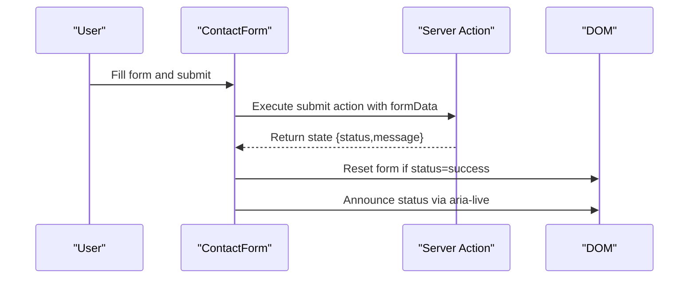

**Diagram sources**
- [components/site/contact-form.tsx:17-91](file://components/site/contact-form.tsx#L17-L91)

**Section sources**
- [components/site/contact-form.tsx:17-91](file://components/site/contact-form.tsx#L17-L91)

### Cards: Presentational Components with Motion
- CategoryCard, ProductCard, ServiceCard, BlogCard: Presentational components receiving typed props; integrate Reveal for animations; ProductCard composes WhatsApp deep-link per item.
- Props: Strongly typed per card variant; optional delay for staggered animations.

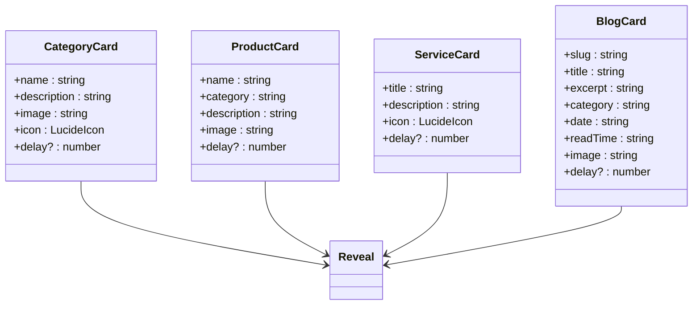

**Diagram sources**
- [components/site/cards.tsx:17-150](file://components/site/cards.tsx#L17-L150)
- [components/motion/reveal.tsx:11-38](file://components/motion/reveal.tsx#L11-L38)

**Section sources**
- [components/site/cards.tsx:17-150](file://components/site/cards.tsx#L17-L150)
- [components/motion/reveal.tsx:11-38](file://components/motion/reveal.tsx#L11-L38)

## Dependency Analysis
- Data Dependencies: Site components depend on a central data module for navigation, products, services, testimonials, and contact info.
- Utility Dependencies: Shared cn utility merges Tailwind classes safely.
- Motion Dependencies: Cards depend on Reveal for animations.
- UI Library Dependencies: Navbar and ContactForm depend on Button/Input/Textarea.
- Backoffice Dependencies: BackofficeShell depends on Admin UI helpers and server actions.

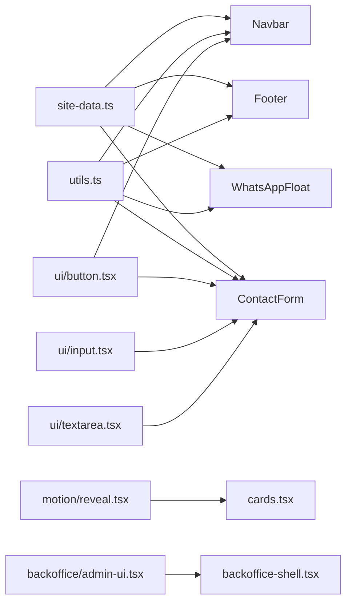

**Diagram sources**
- [lib/site-data.ts:25-314](file://lib/site-data.ts#L25-L314)
- [lib/utils.ts:4-6](file://lib/utils.ts#L4-L6)
- [components/site/cards.tsx:17-150](file://components/site/cards.tsx#L17-L150)
- [components/site/navbar.tsx:14-115](file://components/site/navbar.tsx#L14-L115)
- [components/site/footer.tsx:7-102](file://components/site/footer.tsx#L7-L102)
- [components/site/whatsapp-float.tsx:5-17](file://components/site/whatsapp-float.tsx#L5-L17)
- [components/site/contact-form.tsx:17-91](file://components/site/contact-form.tsx#L17-L91)
- [components/motion/reveal.tsx:11-38](file://components/motion/reveal.tsx#L11-L38)
- [components/ui/button.tsx:42-53](file://components/ui/button.tsx#L42-L53)
- [components/ui/input.tsx:7-23](file://components/ui/input.tsx#L7-L23)
- [components/ui/textarea.tsx:7-22](file://components/ui/textarea.tsx#L7-L22)
- [components/backoffice/admin-ui.tsx:3-24](file://components/backoffice/admin-ui.tsx#L3-L24)
- [components/backoffice/backoffice-shell.tsx:17-77](file://components/backoffice/backoffice-shell.tsx#L17-L77)

**Section sources**
- [lib/site-data.ts:25-314](file://lib/site-data.ts#L25-L314)
- [lib/utils.ts:4-6](file://lib/utils.ts#L4-L6)
- [components/site/cards.tsx:17-150](file://components/site/cards.tsx#L17-L150)
- [components/site/navbar.tsx:14-115](file://components/site/navbar.tsx#L14-L115)
- [components/site/footer.tsx:7-102](file://components/site/footer.tsx#L7-L102)
- [components/site/whatsapp-float.tsx:5-17](file://components/site/whatsapp-float.tsx#L5-L17)
- [components/site/contact-form.tsx:17-91](file://components/site/contact-form.tsx#L17-L91)
- [components/motion/reveal.tsx:11-38](file://components/motion/reveal.tsx#L11-L38)
- [components/ui/button.tsx:42-53](file://components/ui/button.tsx#L42-L53)
- [components/ui/input.tsx:7-23](file://components/ui/input.tsx#L7-L23)
- [components/ui/textarea.tsx:7-22](file://components/ui/textarea.tsx#L7-L22)
- [components/backoffice/admin-ui.tsx:3-24](file://components/backoffice/admin-ui.tsx#L3-L24)
- [components/backoffice/backoffice-shell.tsx:17-77](file://components/backoffice/backoffice-shell.tsx#L17-L77)

## Performance Considerations
- Lazy Loading: Next.js handles automatic code-splitting by route; consider dynamic imports for heavy components not needed on initial load (e.g., heavy modals or analytics).
- Rendering: Motion components use viewport intersection; ensure minimal re-renders by keeping props stable and memoizing derived values.
- CSS: Prefer Tailwind utilities and avoid runtime class concatenation; the shared cn utility merges classes efficiently.
- Images: Next/Image is used consistently; ensure appropriate sizes and quality to balance performance and UX.
- Animations: Use viewport-based animations sparingly; configure viewport options to reduce unnecessary work.

[No sources needed since this section provides general guidance]

## Accessibility Implementation
- Landmarks and Labels: Buttons and links include descriptive aria-labels where appropriate; mobile menu includes aria-expanded and aria-label for toggle.
- Focus Management: Buttons and inputs maintain focus styles; ensure keyboard navigation remains smooth.
- Live Regions: Status messages in ContactForm use aria-live to announce feedback to assistive technologies.
- Links: External links include target and rel attributes; internal links use Next.js Link for client-side navigation.

**Section sources**
- [components/site/navbar.tsx:67-75](file://components/site/navbar.tsx#L67-L75)
- [components/site/navbar.tsx:103-108](file://components/site/navbar.tsx#L103-L108)
- [components/site/whatsapp-float.tsx:11](file://components/site/whatsapp-float.tsx#L11)
- [components/site/contact-form.tsx:77-88](file://components/site/contact-form.tsx#L77-L88)

## Testing and Storybook Integration
- Component Testing Strategy:
  - Unit tests for pure functions and small logicless components using React Testing Library.
  - Snapshot tests for static components (e.g., Footer) to prevent regressions in markup.
  - Interaction tests for stateful components (e.g., Navbar mobile menu) simulating clicks and verifying state changes.
  - Form tests for ContactForm validating submission flow, pending state, and reset behavior.
- Storybook Integration:
  - Stories for Button with all variants and sizes; stories for Input/Textarea with common configurations.
  - Stories for Navbar with active states and mobile menu toggled.
  - Stories for Cards with different props to test layouts and animations.
  - Backoffice Admin UI stories for AdminHeader, AdminCard, and Field combinations.
- Mocking:
  - Replace data module imports with controlled fixtures for stories/tests.
  - Mock Next.js router hooks and server actions for isolated testing.

[No sources needed since this section provides general guidance]

## Troubleshooting Guide
- Chrome Not Rendering:
  - Verify SiteChrome route detection logic and pathname usage.
  - Ensure children are passed correctly from RootLayout.
- Mobile Menu Issues:
  - Confirm state updates and motion animations are enabled; check ARIA attributes on toggle.
- Form Submission:
  - Inspect useActionState usage and ensure server action returns expected state shape.
  - Validate hidden fields and anti-bot honeypot presence.
- Styles and Theming:
  - Confirm Tailwind and cn utility are applied; check for conflicting class overrides.
- Backoffice Navigation:
  - Verify server action endpoints and logout form bindings.

**Section sources**
- [components/site/site-chrome.tsx:10-26](file://components/site/site-chrome.tsx#L10-L26)
- [components/site/navbar.tsx:14-115](file://components/site/navbar.tsx#L14-L115)
- [components/site/contact-form.tsx:17-91](file://components/site/contact-form.tsx#L17-L91)
- [lib/utils.ts:4-6](file://lib/utils.ts#L4-L6)
- [components/backoffice/backoffice-shell.tsx:42-47](file://components/backoffice/backoffice-shell.tsx#L42-L47)

## Conclusion
The component architecture emphasizes a clean separation between global layout, site chrome, reusable UI primitives, and specialized presentational components. Composition patterns favor small, focused components with clear data dependencies and consistent styling. State management is kept local where appropriate, with server actions for form submissions. Motion primitives enable smooth, viewport-driven animations. Accessibility and performance are considered throughout, with clear pathways for testing and future enhancements.