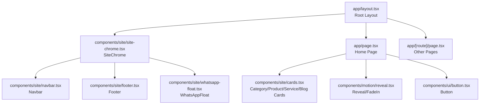
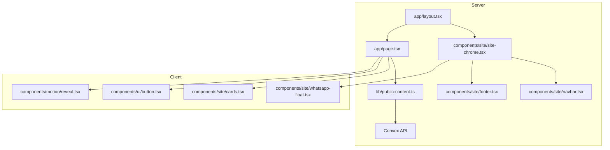
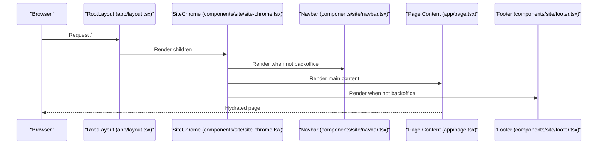
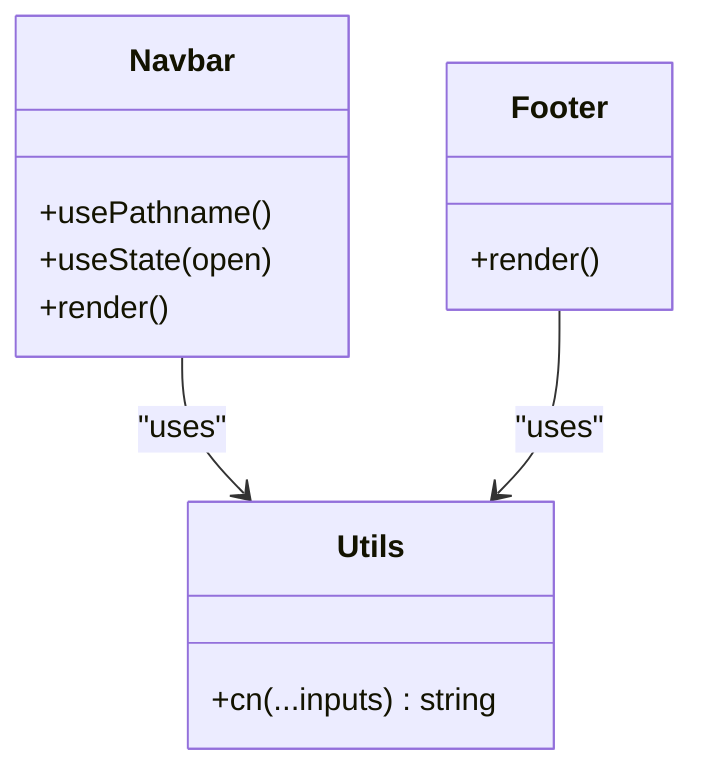
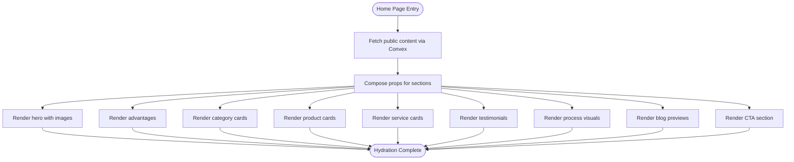
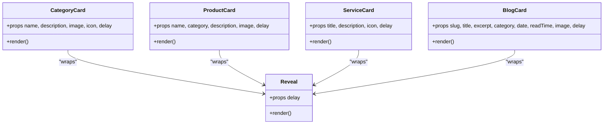
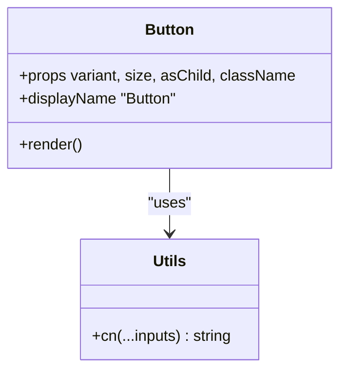
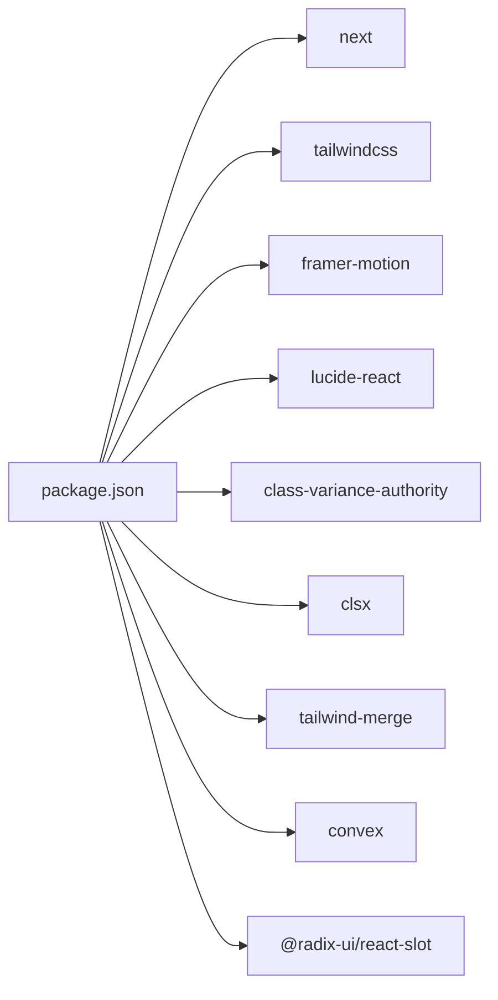

# Frontend Architecture

<cite>
**Referenced Files in This Document**
- [app/layout.tsx](file://app/layout.tsx)
- [components/site/site-chrome.tsx](file://components/site/site-chrome.tsx)
- [app/page.tsx](file://app/page.tsx)
- [next.config.ts](file://next.config.ts)
- [app/globals.css](file://app/globals.css)
- [components/site/navbar.tsx](file://components/site/navbar.tsx)
- [components/site/footer.tsx](file://components/site/footer.tsx)
- [components/ui/button.tsx](file://components/ui/button.tsx)
- [lib/site-data.ts](file://lib/site-data.ts)
- [lib/public-content.ts](file://lib/public-content.ts)
- [components/site/cards.tsx](file://components/site/cards.tsx)
- [components/motion/reveal.tsx](file://components/motion/reveal.tsx)
- [lib/utils.ts](file://lib/utils.ts)
- [package.json](file://package.json)
</cite>

## Table of Contents
1. [Introduction](#introduction)
2. [Project Structure](#project-structure)
3. [Core Components](#core-components)
4. [Architecture Overview](#architecture-overview)
5. [Detailed Component Analysis](#detailed-component-analysis)
6. [Dependency Analysis](#dependency-analysis)
7. [Performance Considerations](#performance-considerations)
8. [Troubleshooting Guide](#troubleshooting-guide)
9. [Conclusion](#conclusion)
10. [Appendices](#appendices)

## Introduction
This document describes the frontend architecture of the Next.js application. It focuses on the App Router configuration, file-based routing, component hierarchy from the root layout down to pages, reusable UI patterns, styling with Tailwind CSS and a custom design system, responsive/mobile-first design, state management and lifecycle patterns, SSR/SSG and client interactivity integration, asset management (images and media), and accessibility/cross-browser considerations.

## Project Structure
The application follows Next.js App Router conventions with a strict file-based routing model under the app directory. The global layout composes a site chrome that injects shared UI (navigation, footer, floating action) around page content. Pages are organized per route segment, and reusable components live under components/, grouped by domain (site), UI primitives (ui), and motion helpers (motion).

**Diagram sources**
- [app/layout.tsx:1-104](file://app/layout.tsx#L1-L104)
- [components/site/site-chrome.tsx:1-27](file://components/site/site-chrome.tsx#L1-L27)
- [components/site/navbar.tsx:1-116](file://components/site/navbar.tsx#L1-L116)
- [components/site/footer.tsx:1-103](file://components/site/footer.tsx#L1-L103)
- [app/page.tsx:1-312](file://app/page.tsx#L1-L312)
- [components/site/cards.tsx:1-151](file://components/site/cards.tsx#L1-L151)
- [components/motion/reveal.tsx:1-39](file://components/motion/reveal.tsx#L1-L39)
- [components/ui/button.tsx:1-53](file://components/ui/button.tsx#L1-L53)

**Section sources**
- [app/layout.tsx:1-104](file://app/layout.tsx#L1-L104)
- [components/site/site-chrome.tsx:1-27](file://components/site/site-chrome.tsx#L1-L27)
- [app/page.tsx:1-312](file://app/page.tsx#L1-L312)

## Core Components
- Root Layout: Defines metadata, fonts, JSON-LD schema, and wraps children in SiteChrome.
- SiteChrome: Conditionally renders shared site chrome (navbar, footer, floating action) except in backoffice routes.
- Home Page: Orchestrates hero, stats, sections for about, categories, featured products, services, testimonials, process, blog, and CTA.
- Shared UI: Button primitive with variants/sizes; cards for categories/products/services/blog; motion reveal effects; navigation and footer.

Key implementation patterns:
- Composition: Root layout composes SiteChrome; SiteChrome composes Navbar/Footer/WhatsAppFloat.
- Reusability: Button, cards, and motion components are reused across pages.
- Data sourcing: Home page fetches public content via Convex and passes props to child components.

**Section sources**
- [app/layout.tsx:1-104](file://app/layout.tsx#L1-L104)
- [components/site/site-chrome.tsx:1-27](file://components/site/site-chrome.tsx#L1-L27)
- [app/page.tsx:1-312](file://app/page.tsx#L1-L312)
- [components/ui/button.tsx:1-53](file://components/ui/button.tsx#L1-L53)
- [components/site/cards.tsx:1-151](file://components/site/cards.tsx#L1-L151)
- [components/motion/reveal.tsx:1-39](file://components/motion/reveal.tsx#L1-L39)

## Architecture Overview
The architecture centers on:
- App Router: File-system routing under app/.
- Layout composition: Root layout -> SiteChrome -> page content.
- Data fetching: Home page performs server-side data retrieval via Convex.
- Client interactivity: Motion reveals, navigation, and floating action buttons.
- Styling: Tailwind CSS with a custom design system built on CSS variables.

**Diagram sources**
- [app/layout.tsx:1-104](file://app/layout.tsx#L1-L104)
- [components/site/site-chrome.tsx:1-27](file://components/site/site-chrome.tsx#L1-L27)
- [components/site/navbar.tsx:1-116](file://components/site/navbar.tsx#L1-L116)
- [components/site/footer.tsx:1-103](file://components/site/footer.tsx#L1-L103)
- [app/page.tsx:1-312](file://app/page.tsx#L1-L312)
- [lib/public-content.ts:65-106](file://lib/public-content.ts#L65-L106)

## Detailed Component Analysis

### Root Layout and Site Chrome
- Root layout configures metadata, Open Graph/Twitter, and JSON-LD for SEO. It injects fonts and wraps children in SiteChrome.
- SiteChrome conditionally hides chrome inside backoffice routes and otherwise renders Navbar, page content, Footer, and a floating action.

**Diagram sources**
- [app/layout.tsx:72-103](file://app/layout.tsx#L72-L103)
- [components/site/site-chrome.tsx:10-26](file://components/site/site-chrome.tsx#L10-L26)
- [components/site/navbar.tsx:14-115](file://components/site/navbar.tsx#L14-L115)
- [components/site/footer.tsx:7-102](file://components/site/footer.tsx#L7-L102)

**Section sources**
- [app/layout.tsx:1-104](file://app/layout.tsx#L1-L104)
- [components/site/site-chrome.tsx:1-27](file://components/site/site-chrome.tsx#L1-L27)

### Navigation and Footer
- Navbar: Mobile-responsive with animated drawer, active-state styling, and external links. Uses site navigation data and a utility class merging function.
- Footer: Grid layout with branding, navigation, product categories, and contact info; includes a WhatsApp CTA.

**Diagram sources**
- [components/site/navbar.tsx:14-115](file://components/site/navbar.tsx#L14-L115)
- [components/site/footer.tsx:7-102](file://components/site/footer.tsx#L7-L102)
- [lib/utils.ts:4-6](file://lib/utils.ts#L4-L6)

**Section sources**
- [components/site/navbar.tsx:1-116](file://components/site/navbar.tsx#L1-L116)
- [components/site/footer.tsx:1-103](file://components/site/footer.tsx#L1-L103)
- [lib/utils.ts:1-7](file://lib/utils.ts#L1-L7)

### Home Page and Content Composition
- Home page orchestrates multiple sections: hero with background image, about, categories, featured products, services, testimonials, process, blog previews, and a CTA.
- Data is fetched server-side via Convex and passed as props to child components.
- Motion reveals and fade-ins provide progressive enhancement.

**Diagram sources**
- [app/page.tsx:30-311](file://app/page.tsx#L30-L311)
- [lib/public-content.ts:65-106](file://lib/public-content.ts#L65-L106)

**Section sources**
- [app/page.tsx:1-312](file://app/page.tsx#L1-L312)
- [lib/public-content.ts:1-107](file://lib/public-content.ts#L1-L107)

### Card Components and Motion
- Cards: Category, Product, Service, and Blog cards encapsulate layout, image handling, and CTAs.
- Motion: Reveal component integrates viewport-triggered animations with optional delays.

**Diagram sources**
- [components/site/cards.tsx:17-150](file://components/site/cards.tsx#L17-L150)
- [components/motion/reveal.tsx:11-24](file://components/motion/reveal.tsx#L11-L24)

**Section sources**
- [components/site/cards.tsx:1-151](file://components/site/cards.tsx#L1-L151)
- [components/motion/reveal.tsx:1-39](file://components/motion/reveal.tsx#L1-L39)

### Button Primitive
- Button uses class variance authority for variants and sizes, with radix slot support for semantic composition.

**Diagram sources**
- [components/ui/button.tsx:42-52](file://components/ui/button.tsx#L42-L52)
- [lib/utils.ts:4-6](file://lib/utils.ts#L4-L6)

**Section sources**
- [components/ui/button.tsx:1-53](file://components/ui/button.tsx#L1-L53)
- [lib/utils.ts:1-7](file://lib/utils.ts#L1-L7)

## Dependency Analysis
External dependencies include Next.js, Tailwind CSS v4, Framer Motion, Lucide icons, Radix UI, class variance authority, clsx/tailwind-merge, and Convex for data fetching.

**Diagram sources**
- [package.json:14-36](file://package.json#L14-L36)

**Section sources**
- [package.json:1-51](file://package.json#L1-L51)

## Performance Considerations
- Image optimization: Next/image is used extensively with fill/sizes/priority for proper sizing and lazy loading behavior. Remote images are permitted from Convex domains.
- Static generation and caching: The home page enables incremental regeneration via a revalidate directive, reducing cold-start costs and keeping content fresh.
- CSS variables and minimal styles: The design system relies on CSS variables and Tailwind utilities, minimizing runtime style computations.
- Motion and viewport triggers: Animations are viewport-triggered and configured to run once, reducing unnecessary reflows.

Recommendations:
- Prefer native lazy loading and appropriate sizes for all images.
- Keep motion viewport thresholds aligned with content density.
- Monitor hydration costs by consolidating heavy client components.

**Section sources**
- [app/page.tsx:36-93](file://app/page.tsx#L36-L93)
- [next.config.ts:64-75](file://next.config.ts#L64-L75)
- [app/page.tsx:28](file://app/page.tsx#L28)
- [components/motion/reveal.tsx:13-18](file://components/motion/reveal.tsx#L13-L18)

## Troubleshooting Guide
- Convex configuration: If environment variables are missing, the public content fetch falls back to defaults. Verify NEXT_PUBLIC_CONVEX_URL is set in production.
- Fonts and metadata: Ensure metadataBase and OG images resolve correctly; confirm image paths exist or fallbacks are acceptable.
- CSP and security headers: Review Content-Security-Policy directives for script, connect, and media sources; adjust remotePatterns and connect-src for development vs. production.
- Accessibility: Verify aria-labels on interactive elements and ensure keyboard focus visibility via focus-visible ring utilities.

**Section sources**
- [lib/public-content.ts:67-106](file://lib/public-content.ts#L67-L106)
- [app/layout.tsx:28-70](file://app/layout.tsx#L28-L70)
- [next.config.ts:8-61](file://next.config.ts#L8-L61)

## Conclusion
The application employs a clean, layered architecture: a root layout that centralizes metadata and fonts, a site chrome that composes shared UI, and page-specific compositions driven by server-side data. Tailwind CSS with a custom design system and CSS variables ensures consistent theming. Motion enhances UX without sacrificing performance. The integration of SSR/SSG and client interactivity is deliberate, with viewport-triggered animations and efficient image handling supporting a mobile-first responsive design.

## Appendices

### Styling Architecture and Design System
- CSS variables define brand tokens and typography families.
- Tailwind utilities compose layouts and states; custom utilities (.premium-card, .dark-card, .site-container, .section-pad) encapsulate repeated patterns.
- Utilities: cn merges classes safely using clsx and tailwind-merge.

**Section sources**
- [app/globals.css:3-20](file://app/globals.css#L3-L20)
- [app/globals.css:63-86](file://app/globals.css#L63-L86)
- [lib/utils.ts:4-6](file://lib/utils.ts#L4-L6)

### Responsive Design and Mobile-First Approach
- Breakpoints and spacing leverage Tailwind utilities with clamp-based paddings.
- Navigation adapts from desktop pill-buttons to a mobile slide-out drawer.
- Images use fill and sizes for adaptive rendering across breakpoints.

**Section sources**
- [app/globals.css:70-72](file://app/globals.css#L70-L72)
- [components/site/navbar.tsx:19-115](file://components/site/navbar.tsx#L19-L115)
- [app/page.tsx:86-93](file://app/page.tsx#L86-L93)

### Component Lifecycle and Prop Drilling
- Server-side rendering: Root layout and pages render on the server; data is fetched during SSR.
- Client interactivity: SiteChrome and Navbar use client directives for navigation and stateful UI.
- Prop drilling: Data flows from pages to child components; consider context or lightweight state containers for cross-cutting concerns.

**Section sources**
- [components/site/site-chrome.tsx:1-27](file://components/site/site-chrome.tsx#L1-L27)
- [components/site/navbar.tsx:1-116](file://components/site/navbar.tsx#L1-L116)
- [app/page.tsx:30-31](file://app/page.tsx#L30-L31)

### Asset Management and Media Handling
- Next/image is used for all images with fill, sizes, and priority attributes.
- Remote images allowed from Convex domains via next.config.ts.
- Brand assets are served from public/brand.

**Section sources**
- [app/page.tsx:36-93](file://app/page.tsx#L36-L93)
- [next.config.ts:64-75](file://next.config.ts#L64-L75)

### Accessibility and Cross-Browser Compatibility
- Semantic markup and ARIA labels are present on interactive elements.
- Focus-visible rings and reduced-motion support improve accessibility.
- CSS variables and Tailwind utilities provide consistent rendering across browsers.

**Section sources**
- [components/site/navbar.tsx:67-75](file://components/site/navbar.tsx#L67-L75)
- [app/globals.css:128-137](file://app/globals.css#L128-L137)