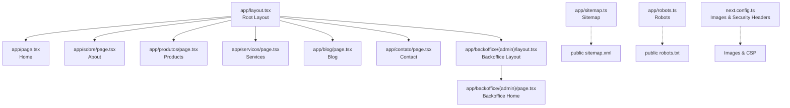
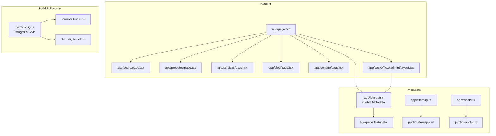
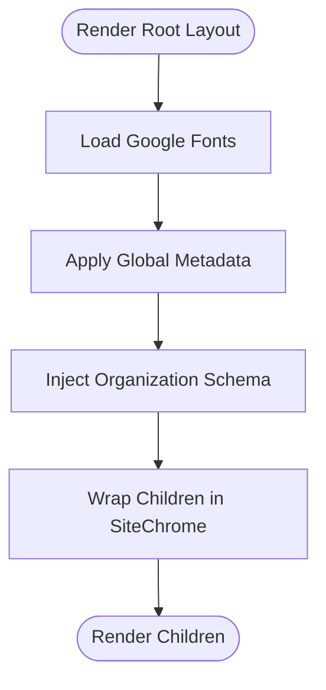
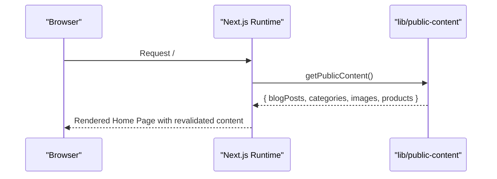
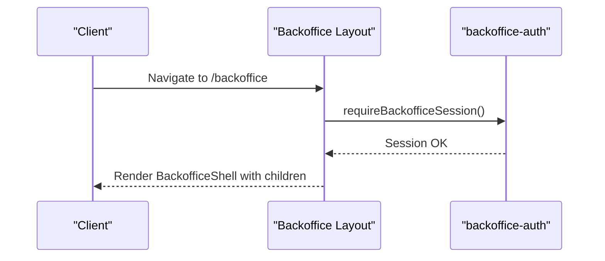
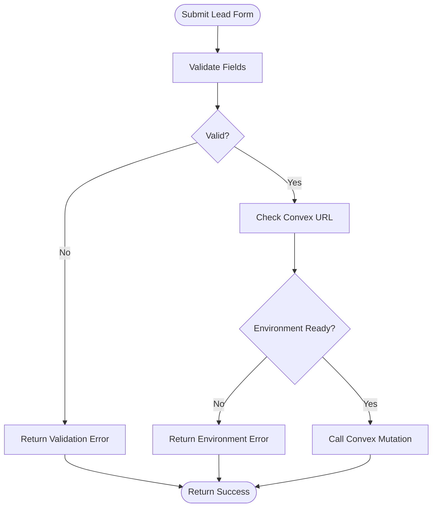
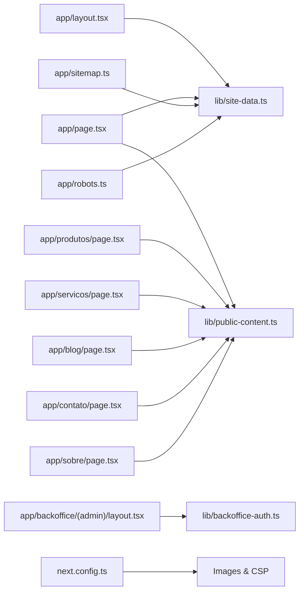

# Next.js Application Structure

<cite>
**Referenced Files in This Document**
- [app/layout.tsx](file://app/layout.tsx)
- [app/page.tsx](file://app/page.tsx)
- [app/blog/page.tsx](file://app/blog/page.tsx)
- [app/produtos/page.tsx](file://app/produtos/page.tsx)
- [app/servicos/page.tsx](file://app/servicos/page.tsx)
- [app/sobre/page.tsx](file://app/sobre/page.tsx)
- [app/contato/page.tsx](file://app/contato/page.tsx)
- [app/backoffice/(admin)/layout.tsx](file://app/backoffice/(admin)/layout.tsx)
- [app/sitemap.ts](file://app/sitemap.ts)
- [app/robots.ts](file://app/robots.ts)
- [next.config.ts](file://next.config.ts)
- [lib/site-data.ts](file://lib/site-data.ts)
- [app/actions/lead-actions.ts](file://app/actions/lead-actions.ts)
- [convex/schema.ts](file://convex/schema.ts)
- [package.json](file://package.json)
</cite>

## Table of Contents
1. [Introduction](#introduction)
2. [Project Structure](#project-structure)
3. [Core Components](#core-components)
4. [Architecture Overview](#architecture-overview)
5. [Detailed Component Analysis](#detailed-component-analysis)
6. [Dependency Analysis](#dependency-analysis)
7. [Performance Considerations](#performance-considerations)
8. [Troubleshooting Guide](#troubleshooting-guide)
9. [Conclusion](#conclusion)
10. [Appendices](#appendices)

## Introduction
This document explains the Next.js application’s file-based routing, layout hierarchy, metadata and SEO configuration, static and server-rendered content strategies, build and optimization settings, asset and image handling, and deployment considerations. It focuses on the App Router conventions used across the application, including nested layouts, dynamic and catch-all routes, API routes, and integrations with Convex for data.

## Project Structure
The application follows Next.js App Router conventions under the app directory. Key characteristics:
- Root layout defines global metadata, fonts, and the top-level shell component.
- Route segments map to pages under app/<route>/page.tsx.
- Nested layouts enable shared UI per folder hierarchy.
- Special files like sitemap.ts and robots.ts provide SEO metadata.
- Static generation and server-side rendering are applied selectively via revalidate and dynamic modes.
- Assets and images are configured in next.config.ts with remote patterns and CSP headers.

**Diagram sources**
- [app/layout.tsx](file://app/layout.tsx)
- [app/page.tsx](file://app/page.tsx)
- [app/sobre/page.tsx](file://app/sobre/page.tsx)
- [app/produtos/page.tsx](file://app/produtos/page.tsx)
- [app/servicos/page.tsx](file://app/servicos/page.tsx)
- [app/blog/page.tsx](file://app/blog/page.tsx)
- [app/contato/page.tsx](file://app/contato/page.tsx)
- [app/backoffice/(admin)/layout.tsx](file://app/backoffice/(admin)/layout.tsx)
- [app/sitemap.ts](file://app/sitemap.ts)
- [app/robots.ts](file://app/robots.ts)
- [next.config.ts](file://next.config.ts)

**Section sources**
- [app/layout.tsx](file://app/layout.tsx)
- [app/page.tsx](file://app/page.tsx)
- [app/blog/page.tsx](file://app/blog/page.tsx)
- [app/produtos/page.tsx](file://app/produtos/page.tsx)
- [app/servicos/page.tsx](file://app/servicos/page.tsx)
- [app/sobre/page.tsx](file://app/sobre/page.tsx)
- [app/contato/page.tsx](file://app/contato/page.tsx)
- [app/backoffice/(admin)/layout.tsx](file://app/backoffice/(admin)/layout.tsx)
- [app/sitemap.ts](file://app/sitemap.ts)
- [app/robots.ts](file://app/robots.ts)
- [next.config.ts](file://next.config.ts)

## Core Components
- Root layout and metadata: Defines global fonts, Open Graph, Twitter, icons, and structured data for the organization. Wraps children in a site chrome component.
- Home page: Demonstrates server-side rendering with revalidation and integrates public content.
- Other pages (About, Products, Services, Blog, Contact): Each page sets its own metadata and uses revalidate for incremental updates.
- Backoffice nested layout: Enforces session checks and disables caching for administrative views.
- Sitemap and robots: Generate sitemap entries and robots directives pointing to the sitemap.
- Build configuration: Content Security Policy headers, strict security headers, image remote patterns, and Turbopack root configuration.

**Section sources**
- [app/layout.tsx](file://app/layout.tsx)
- [app/page.tsx](file://app/page.tsx)
- [app/blog/page.tsx](file://app/blog/page.tsx)
- [app/produtos/page.tsx](file://app/produtos/page.tsx)
- [app/servicos/page.tsx](file://app/servicos/page.tsx)
- [app/sobre/page.tsx](file://app/sobre/page.tsx)
- [app/contato/page.tsx](file://app/contato/page.tsx)
- [app/backoffice/(admin)/layout.tsx](file://app/backoffice/(admin)/layout.tsx)
- [app/sitemap.ts](file://app/sitemap.ts)
- [app/robots.ts](file://app/robots.ts)
- [next.config.ts](file://next.config.ts)

## Architecture Overview
The application uses Next.js App Router with:
- File-system based routing: app/<segment>/page.tsx resolves to routes.
- Nested layouts: app/layout.tsx is the root; app/backoffice/(admin)/layout.tsx provides a nested layout for administrative routes.
- Metadata and SEO: Global metadata in root layout plus per-page metadata; sitemap and robots generated dynamically.
- Data fetching: Pages use asynchronous data retrieval with optional revalidation for static regeneration.
- Asset and image handling: Remote images allowed from Convex domains; CSP restricts connections and frames.
- Security: Strict Transport Security, X-Frame-Options, Referrer-Policy, Permissions-Policy, and Cross-Origin headers.

**Diagram sources**
- [app/layout.tsx](file://app/layout.tsx)
- [app/page.tsx](file://app/page.tsx)
- [app/backoffice/(admin)/layout.tsx](file://app/backoffice/(admin)/layout.tsx)
- [app/sitemap.ts](file://app/sitemap.ts)
- [app/robots.ts](file://app/robots.ts)
- [next.config.ts](file://next.config.ts)

## Detailed Component Analysis

### Root Layout and Metadata
- Loads Google Fonts and applies CSS variables to html.
- Sets global metadata including metadataBase, title template, Open Graph, Twitter, and icons.
- Injects structured data for the organization via JSON-LD.
- Wraps children in a site chrome component.

**Diagram sources**
- [app/layout.tsx](file://app/layout.tsx)

**Section sources**
- [app/layout.tsx](file://app/layout.tsx)

### Home Page (app/page.tsx)
- Uses asynchronous data fetching to load public content.
- Applies revalidate to enable incremental static regeneration.
- Renders hero, advantages, categories, featured products, services, testimonials, and a call-to-action section.

**Diagram sources**
- [app/page.tsx](file://app/page.tsx)

**Section sources**
- [app/page.tsx](file://app/page.tsx)

### About Page (app/sobre/page.tsx)
- Per-page metadata and revalidate.
- Renders a hero, history, mission/vision/values, and a call-to-action section.

**Section sources**
- [app/sobre/page.tsx](file://app/sobre/page.tsx)

### Products Page (app/produtos/page.tsx)
- Per-page metadata and revalidate.
- Renders a hero, section header, and a product catalog component.

**Section sources**
- [app/produtos/page.tsx](file://app/produtos/page.tsx)

### Services Page (app/servicos/page.tsx)
- Per-page metadata and revalidate.
- Renders a hero, service cards, process steps, and a call-to-action section.

**Section sources**
- [app/servicos/page.tsx](file://app/servicos/page.tsx)

### Blog Page (app/blog/page.tsx)
- Per-page metadata and revalidate.
- Renders a hero, featured post, blog cards, categories sidebar, and a call-to-action section.

**Section sources**
- [app/blog/page.tsx](file://app/blog/page.tsx)

### Contact Page (app/contato/page.tsx)
- Per-page metadata and revalidate.
- Renders a hero, contact cards, social links, a contact form, and a location map.

**Section sources**
- [app/contato/page.tsx](file://app/contato/page.tsx)

### Backoffice Nested Layout (app/backoffice/(admin)/layout.tsx)
- Disables dynamic rendering for administrative routes.
- Enforces a backoffice session check before rendering.
- Sets metadata to prevent indexing.

**Diagram sources**
- [app/backoffice/(admin)/layout.tsx](file://app/backoffice/(admin)/layout.tsx)

**Section sources**
- [app/backoffice/(admin)/layout.tsx](file://app/backoffice/(admin)/layout.tsx)

### Sitemap Generation (app/sitemap.ts)
- Generates a sitemap with predefined routes and metadata.
- Uses site.url to construct absolute URLs.

**Section sources**
- [app/sitemap.ts](file://app/sitemap.ts)
- [lib/site-data.ts](file://lib/site-data.ts)

### Robots Management (app/robots.ts)
- Defines robots rules allowing crawling of most pages while disallowing /backoffice.
- References the generated sitemap URL.

**Section sources**
- [app/robots.ts](file://app/robots.ts)
- [lib/site-data.ts](file://lib/site-data.ts)

### Data Fetching and Forms (app/actions/lead-actions.ts)
- Server action for lead submission with validation and Convex mutation.
- Uses NEXT_PUBLIC_CONVEX_URL for environment-specific configuration.
- Returns normalized form data and handles errors gracefully.

**Diagram sources**
- [app/actions/lead-actions.ts](file://app/actions/lead-actions.ts)

**Section sources**
- [app/actions/lead-actions.ts](file://app/actions/lead-actions.ts)

### Convex Schema (convex/schema.ts)
- Defines tables for leads, media assets, products, categories, blog posts, and site settings.
- Includes indexes for efficient queries by status, slug, and timestamps.

**Section sources**
- [convex/schema.ts](file://convex/schema.ts)

## Dependency Analysis
- Root layout depends on site-data for metadata and on site chrome components.
- Pages depend on lib/public-content for data and on site-data for constants.
- Backoffice layout depends on backoffice-auth for session enforcement.
- Sitemap and robots depend on site-data for URLs.
- Build configuration depends on environment variables for development vs production behavior.

**Diagram sources**
- [app/layout.tsx](file://app/layout.tsx)
- [app/page.tsx](file://app/page.tsx)
- [app/produtos/page.tsx](file://app/produtos/page.tsx)
- [app/servicos/page.tsx](file://app/servicos/page.tsx)
- [app/blog/page.tsx](file://app/blog/page.tsx)
- [app/contato/page.tsx](file://app/contato/page.tsx)
- [app/sobre/page.tsx](file://app/sobre/page.tsx)
- [app/backoffice/(admin)/layout.tsx](file://app/backoffice/(admin)/layout.tsx)
- [app/sitemap.ts](file://app/sitemap.ts)
- [app/robots.ts](file://app/robots.ts)
- [next.config.ts](file://next.config.ts)
- [lib/site-data.ts](file://lib/site-data.ts)

**Section sources**
- [app/layout.tsx](file://app/layout.tsx)
- [app/page.tsx](file://app/page.tsx)
- [app/produtos/page.tsx](file://app/produtos/page.tsx)
- [app/servicos/page.tsx](file://app/servicos/page.tsx)
- [app/blog/page.tsx](file://app/blog/page.tsx)
- [app/contato/page.tsx](file://app/contato/page.tsx)
- [app/sobre/page.tsx](file://app/sobre/page.tsx)
- [app/backoffice/(admin)/layout.tsx](file://app/backoffice/(admin)/layout.tsx)
- [app/sitemap.ts](file://app/sitemap.ts)
- [app/robots.ts](file://app/robots.ts)
- [next.config.ts](file://next.config.ts)
- [lib/site-data.ts](file://lib/site-data.ts)

## Performance Considerations
- Incremental static regeneration: Pages set revalidate to cache and refresh content periodically.
- Image optimization: next.config.ts configures remote patterns for Convex-hosted images and enforces CSP for secure image sources.
- Security headers: next.config.ts injects strict security policies globally.
- Development vs production: CSP and connect-src include development endpoints only in non-production builds.

**Section sources**
- [app/page.tsx](file://app/page.tsx)
- [app/blog/page.tsx](file://app/blog/page.tsx)
- [app/produtos/page.tsx](file://app/produtos/page.tsx)
- [app/servicos/page.tsx](file://app/servicos/page.tsx)
- [app/sobre/page.tsx](file://app/sobre/page.tsx)
- [app/contato/page.tsx](file://app/contato/page.tsx)
- [next.config.ts](file://next.config.ts)

## Troubleshooting Guide
- Convex environment: If NEXT_PUBLIC_CONVEX_URL is missing, the lead form action returns an environment error.
- Form validation: The lead action validates required fields and email format, returning appropriate messages.
- Backoffice session: The backoffice layout enforces session checks; failures will prevent rendering administrative content.
- Sitemap and robots: Ensure site.url is correct in site-data so sitemap and robots URLs resolve properly.

**Section sources**
- [app/actions/lead-actions.ts](file://app/actions/lead-actions.ts)
- [app/backoffice/(admin)/layout.tsx](file://app/backoffice/(admin)/layout.tsx)
- [app/sitemap.ts](file://app/sitemap.ts)
- [app/robots.ts](file://app/robots.ts)
- [lib/site-data.ts](file://lib/site-data.ts)

## Conclusion
The application leverages Next.js App Router conventions with a clear layout hierarchy, selective static and server-side rendering, robust metadata and SEO configuration, and strong build-time security and image policies. The nested backoffice layout and Convex integration demonstrate scalable patterns for authenticated admin areas and data-driven content.

## Appendices

### Routing Patterns and Conventions
- File-system based routing: app/<segment>/page.tsx maps to /<segment>.
- Nested layouts: app/backoffice/(admin)/layout.tsx wraps administrative pages.
- Dynamic and catch-all routes: Not present in the current structure; future enhancements could use [...slug]/page.tsx for catch-all and [[...slug]]/page.tsx for optional catch-all.
- API routes: Not present in the current structure; future API handlers would go under app/api/...

**Section sources**
- [app/backoffice/(admin)/layout.tsx](file://app/backoffice/(admin)/layout.tsx)

### Build Configuration and Optimizations
- next.config.ts defines:
  - Images: remotePatterns for Convex domains.
  - CSP and security headers injected globally.
  - Turbopack root configuration.
  - Powered-by header disabled.
- package.json scripts include dev, build, start, lint, typecheck, and Convex commands.

**Section sources**
- [next.config.ts](file://next.config.ts)
- [package.json](file://package.json)