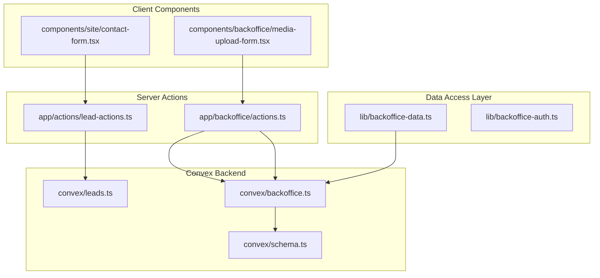
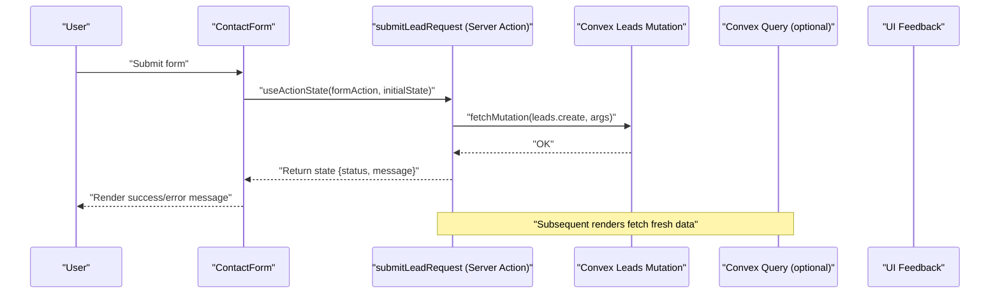
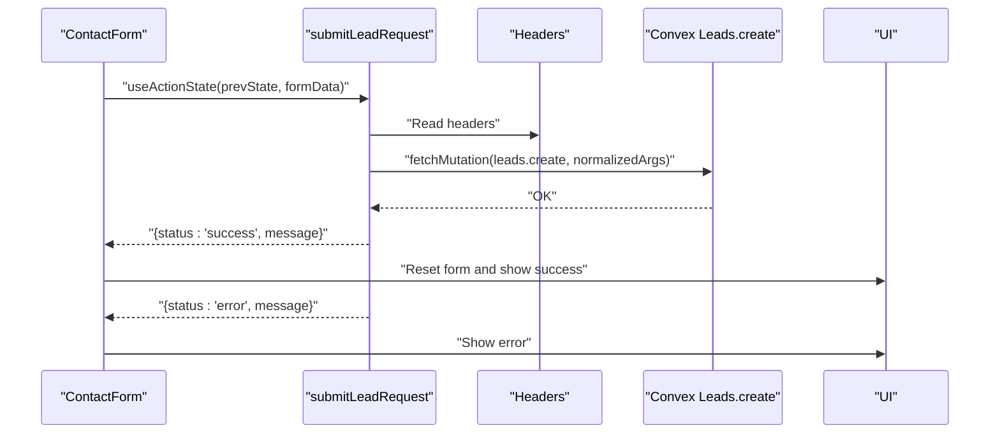
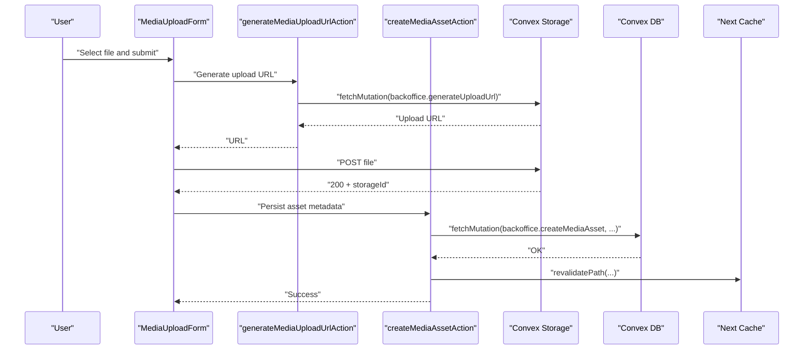
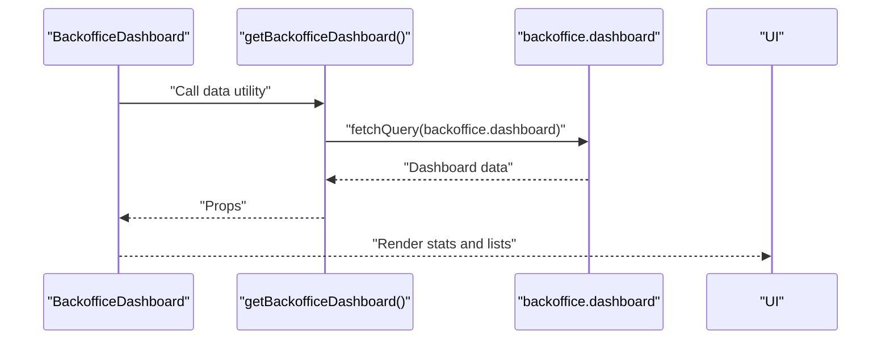
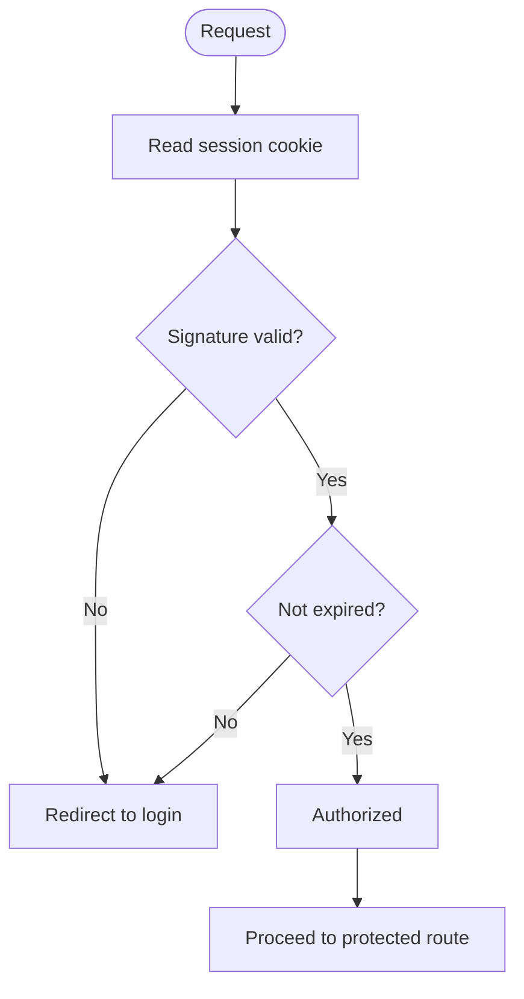
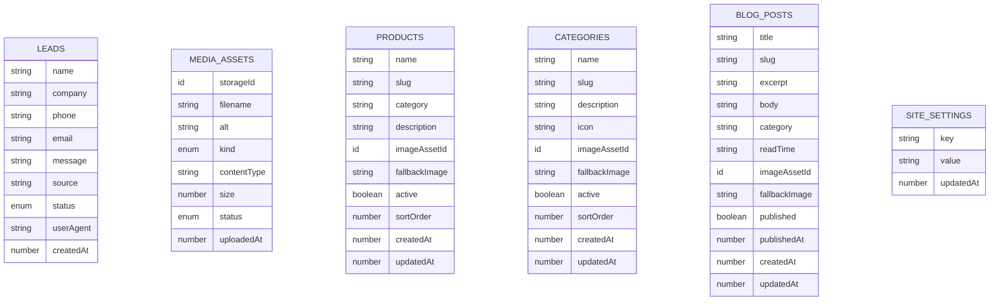
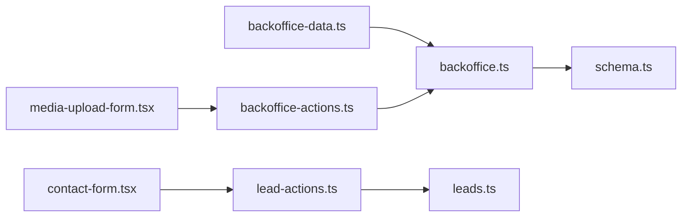

# State Management Patterns

<cite>
**Referenced Files in This Document**
- [lead-actions.ts](file://app/actions/lead-actions.ts)
- [contact-form.tsx](file://components/site/contact-form.tsx)
- [media-upload-form.tsx](file://components/backoffice/media-upload-form.tsx)
- [backoffice-actions.ts](file://app/backoffice/actions.ts)
- [backoffice-layout.tsx](file://app/backoffice/(admin)/layout.tsx)
- [backoffice-dashboard.tsx](file://app/backoffice/(admin)/page.tsx)
- [backoffice-leads.tsx](file://app/backoffice/(admin)/leads/page.tsx)
- [backoffice-media.tsx](file://app/backoffice/(admin)/media/page.tsx)
- [backoffice-auth.ts](file://lib/backoffice-auth.ts)
- [backoffice-data.ts](file://lib/backoffice-data.ts)
- [leads.ts](file://convex/leads.ts)
- [backoffice.ts](file://convex/backoffice.ts)
- [schema.ts](file://convex/schema.ts)
</cite>

## Table of Contents
1. [Introduction](#introduction)
2. [Project Structure](#project-structure)
3. [Core Components](#core-components)
4. [Architecture Overview](#architecture-overview)
5. [Detailed Component Analysis](#detailed-component-analysis)
6. [Dependency Analysis](#dependency-analysis)
7. [Performance Considerations](#performance-considerations)
8. [Troubleshooting Guide](#troubleshooting-guide)
9. [Conclusion](#conclusion)

## Introduction
This document explains the state management patterns and data flow across the application. It covers:
- Server Actions for form submissions and state mutations
- Client-side state with React hooks and Action State
- Data fetching strategies (server-side rendering, Next.js revalidation)
- Context-free global state via server-side sessions and server actions
- Component synchronization and persistence
- Error handling and loading states
- Performance optimizations for state updates and re-renders
- Testing strategies for stateful components and async operations
- Integration between Convex real-time data and client-side state

## Project Structure
The application follows a Next.js App Router structure with a clear separation between client components, server actions, Convex backend, and data-fetching utilities.

**Diagram sources**
- [contact-form.tsx:1-92](file://components/site/contact-form.tsx#L1-L92)
- [media-upload-form.tsx:1-114](file://components/backoffice/media-upload-form.tsx#L1-L114)
- [lead-actions.ts:1-96](file://app/actions/lead-actions.ts#L1-L96)
- [backoffice-actions.ts:1-215](file://app/backoffice/actions.ts#L1-L215)
- [backoffice-data.ts:1-21](file://lib/backoffice-data.ts#L1-L21)
- [backoffice-auth.ts:1-129](file://lib/backoffice-auth.ts#L1-L129)
- [leads.ts:1-32](file://convex/leads.ts#L1-L32)
- [backoffice.ts:1-385](file://convex/backoffice.ts#L1-L385)
- [schema.ts:1-87](file://convex/schema.ts#L1-L87)

**Section sources**
- [contact-form.tsx:1-92](file://components/site/contact-form.tsx#L1-L92)
- [media-upload-form.tsx:1-114](file://components/backoffice/media-upload-form.tsx#L1-L114)
- [lead-actions.ts:1-96](file://app/actions/lead-actions.ts#L1-L96)
- [backoffice-actions.ts:1-215](file://app/backoffice/actions.ts#L1-L215)
- [backoffice-data.ts:1-21](file://lib/backoffice-data.ts#L1-L21)
- [backoffice-auth.ts:1-129](file://lib/backoffice-auth.ts#L1-L129)
- [leads.ts:1-32](file://convex/leads.ts#L1-L32)
- [backoffice.ts:1-385](file://convex/backoffice.ts#L1-L385)
- [schema.ts:1-87](file://convex/schema.ts#L1-L87)

## Core Components
- Lead submission form with server action and Action State
- Media upload form with client-side state and server action
- Backoffice CRUD forms using server actions and Next.js revalidation
- Server-side data access utilities for Convex queries
- Authentication utilities for admin session management

Key patterns:
- Server Actions encapsulate mutations and revalidation
- Client components use Action State for optimistic UI and controlled feedback
- Convex queries are called from server components or data utilities
- Sessions and API keys enforce authorization server-side

**Section sources**
- [lead-actions.ts:32-96](file://app/actions/lead-actions.ts#L32-L96)
- [contact-form.tsx:17-91](file://components/site/contact-form.tsx#L17-L91)
- [media-upload-form.tsx:14-114](file://components/backoffice/media-upload-form.tsx#L14-L114)
- [backoffice-actions.ts:79-108](file://app/backoffice/actions.ts#L79-L108)
- [backoffice-data.ts:6-21](file://lib/backoffice-data.ts#L6-L21)
- [backoffice-auth.ts:60-108](file://lib/backoffice-auth.ts#L60-L108)

## Architecture Overview
The state lifecycle flows from client UI to server actions, to Convex mutations/queries, and back to the UI via revalidation and fresh data loads.

**Diagram sources**
- [contact-form.tsx:17-25](file://components/site/contact-form.tsx#L17-L25)
- [lead-actions.ts:32-96](file://app/actions/lead-actions.ts#L32-L96)
- [leads.ts:7-24](file://convex/leads.ts#L7-L24)

## Detailed Component Analysis

### Lead Submission Flow (Server Actions + Action State)
- Client-side form uses Action State to manage pending state and messages.
- Server Action validates inputs, enforces environment checks, and calls Convex mutation.
- On success, returns a success state; on failure, returns an error state.
- Client resets form after successful submission.

**Diagram sources**
- [contact-form.tsx:17-25](file://components/site/contact-form.tsx#L17-L25)
- [lead-actions.ts:32-96](file://app/actions/lead-actions.ts#L32-L96)
- [leads.ts:7-24](file://convex/leads.ts#L7-L24)

**Section sources**
- [contact-form.tsx:17-91](file://components/site/contact-form.tsx#L17-L91)
- [lead-actions.ts:32-96](file://app/actions/lead-actions.ts#L32-L96)
- [leads.ts:7-24](file://convex/leads.ts#L7-L24)

### Media Upload Flow (Client State + Server Actions)
- Client component manages upload state and user feedback.
- Generates an upload URL via a server action, uploads to Convex Storage, then persists metadata via another server action.
- Revalidates affected routes to refresh cached content.

**Diagram sources**
- [media-upload-form.tsx:19-77](file://components/backoffice/media-upload-form.tsx#L19-L77)
- [backoffice-actions.ts:79-108](file://app/backoffice/actions.ts#L79-L108)
- [backoffice.ts:68-100](file://convex/backoffice.ts#L68-L100)

**Section sources**
- [media-upload-form.tsx:14-114](file://components/backoffice/media-upload-form.tsx#L14-L114)
- [backoffice-actions.ts:79-108](file://app/backoffice/actions.ts#L79-L108)
- [backoffice.ts:68-100](file://convex/backoffice.ts#L68-L100)

### Backoffice CRUD Forms (Server Actions + Revalidation)
- Forms trigger server actions for updates and deletions.
- Server actions validate admin key, call Convex mutations, and revalidate paths to keep UI in sync.
- Dashboard and lists are rendered from server components that call data utilities.

**Diagram sources**
- [backoffice-dashboard.tsx](file://app/backoffice/(admin)/page.tsx#L25-L47)
- [backoffice-data.ts:6-8](file://lib/backoffice-data.ts#L6-L8)
- [backoffice.ts:120-145](file://convex/backoffice.ts#L120-L145)

**Section sources**
- [backoffice-dashboard.tsx](file://app/backoffice/(admin)/page.tsx#L25-L122)
- [backoffice-leads.tsx](file://app/backoffice/(admin)/leads/page.tsx#L8-L72)
- [backoffice-media.tsx](file://app/backoffice/(admin)/media/page.tsx#L17-L82)
- [backoffice-data.ts:6-21](file://lib/backoffice-data.ts#L6-L21)
- [backoffice-actions.ts:119-128](file://app/backoffice/actions.ts#L119-L128)
- [backoffice.ts:120-145](file://convex/backoffice.ts#L120-L145)

### Authentication and Global State (Context-Free)
- Admin session is stored server-side in an encrypted cookie with expiration.
- Authorization enforced via server actions and API key verification.
- No global React context is used; state is scoped to server components and actions.

**Diagram sources**
- [backoffice-auth.ts:83-118](file://lib/backoffice-auth.ts#L83-L118)
- [backoffice-layout.tsx](file://app/backoffice/(admin)/layout.tsx#L17-L21)

**Section sources**
- [backoffice-auth.ts:60-129](file://lib/backoffice-auth.ts#L60-L129)
- [backoffice-layout.tsx](file://app/backoffice/(admin)/layout.tsx#L17-L21)

### Data Model and Indexing
Convex schema defines tables with indexes supporting common queries. This enables efficient reads for dashboards and lists.

**Diagram sources**
- [schema.ts:4-86](file://convex/schema.ts#L4-L86)

**Section sources**
- [schema.ts:4-86](file://convex/schema.ts#L4-L86)
- [backoffice.ts:120-145](file://convex/backoffice.ts#L120-L145)

## Dependency Analysis
- Client components depend on server actions for mutations and on data utilities for queries.
- Server actions depend on Convex APIs and environment variables.
- Data utilities depend on Convex queries and authentication utilities.
- Convex modules define typed mutations and queries with indexes.

**Diagram sources**
- [contact-form.tsx:1-92](file://components/site/contact-form.tsx#L1-L92)
- [lead-actions.ts:1-96](file://app/actions/lead-actions.ts#L1-L96)
- [media-upload-form.tsx:1-114](file://components/backoffice/media-upload-form.tsx#L1-L114)
- [backoffice-actions.ts:1-215](file://app/backoffice/actions.ts#L1-L215)
- [backoffice-data.ts:1-21](file://lib/backoffice-data.ts#L1-L21)
- [leads.ts:1-32](file://convex/leads.ts#L1-L32)
- [backoffice.ts:1-385](file://convex/backoffice.ts#L1-L385)
- [schema.ts:1-87](file://convex/schema.ts#L1-L87)

**Section sources**
- [contact-form.tsx:1-92](file://components/site/contact-form.tsx#L1-L92)
- [lead-actions.ts:1-96](file://app/actions/lead-actions.ts#L1-L96)
- [media-upload-form.tsx:1-114](file://components/backoffice/media-upload-form.tsx#L1-L114)
- [backoffice-actions.ts:1-215](file://app/backoffice/actions.ts#L1-L215)
- [backoffice-data.ts:1-21](file://lib/backoffice-data.ts#L1-L21)
- [leads.ts:1-32](file://convex/leads.ts#L1-L32)
- [backoffice.ts:1-385](file://convex/backoffice.ts#L1-L385)
- [schema.ts:1-87](file://convex/schema.ts#L1-L87)

## Performance Considerations
- Prefer server actions for mutations to leverage server-side caching and revalidation.
- Use Next.js revalidatePath strategically to invalidate only affected routes.
- Keep client state minimal; delegate heavy work to server actions and Convex.
- Use Convex indexes to optimize queries for dashboards and lists.
- Avoid unnecessary re-renders by passing stable props and avoiding inline function objects in render.

[No sources needed since this section provides general guidance]

## Troubleshooting Guide
Common issues and resolutions:
- Environment configuration errors during lead submission
  - Ensure the Convex URL environment variable is set; otherwise, the server action returns an error state.
- Upload failures in media form
  - Validate file type and size constraints; handle network errors and show user-friendly messages.
- Unauthorized access to backoffice
  - Verify admin session and API key; redirect unauthenticated requests to login.
- Stale data after mutations
  - Confirm revalidatePath calls occur after mutations; ensure server components re-fetch data.

**Section sources**
- [lead-actions.ts:44-49](file://app/actions/lead-actions.ts#L44-L49)
- [media-upload-form.tsx:26-42](file://components/backoffice/media-upload-form.tsx#L26-L42)
- [backoffice-auth.ts:110-118](file://lib/backoffice-auth.ts#L110-L118)
- [backoffice-actions.ts:104-108](file://app/backoffice/actions.ts#L104-L108)

## Conclusion
The application employs a clean separation of concerns:
- Server Actions encapsulate mutations and revalidation
- Client components use Action State for responsive feedback
- Convex provides typed queries and mutations with indexes
- Authentication is handled server-side without global React context
- Data flows are predictable and testable

This design yields robust, maintainable state management with clear boundaries between client and server responsibilities.