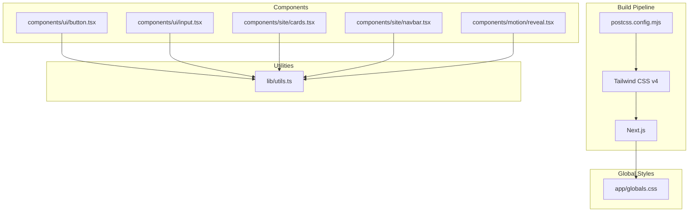
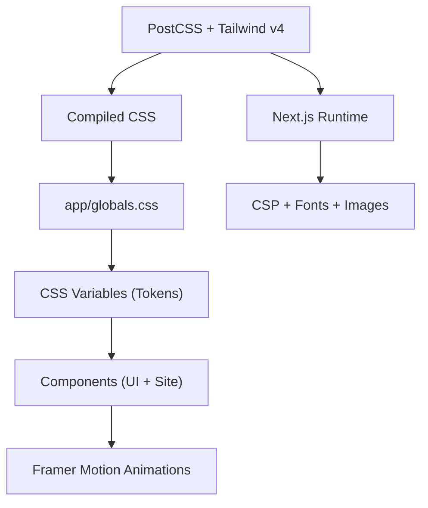
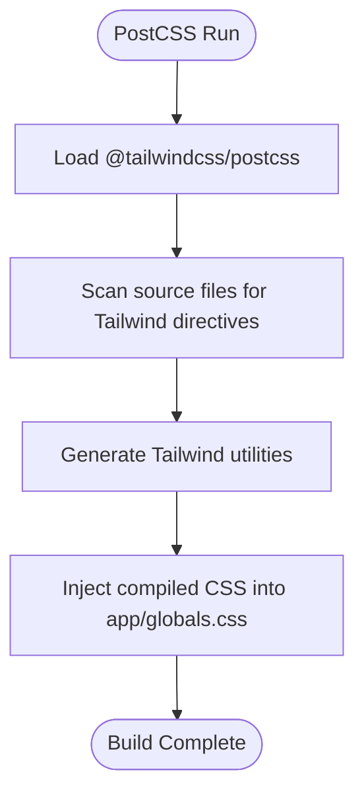
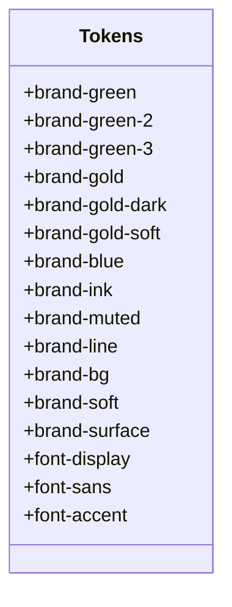
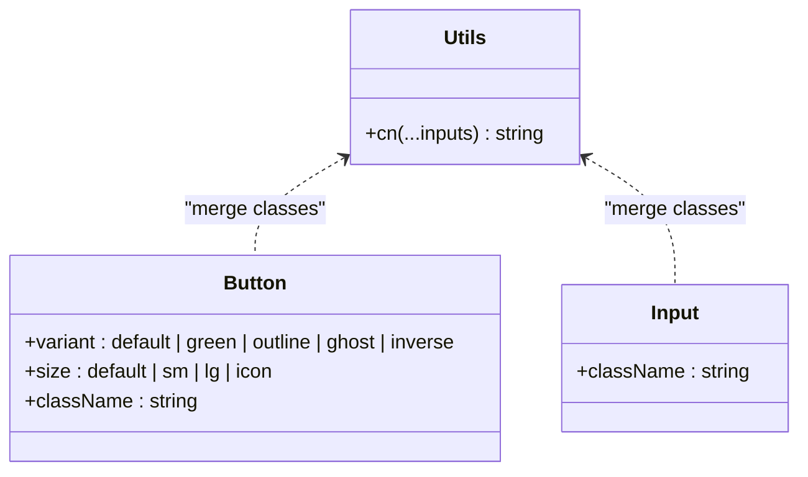
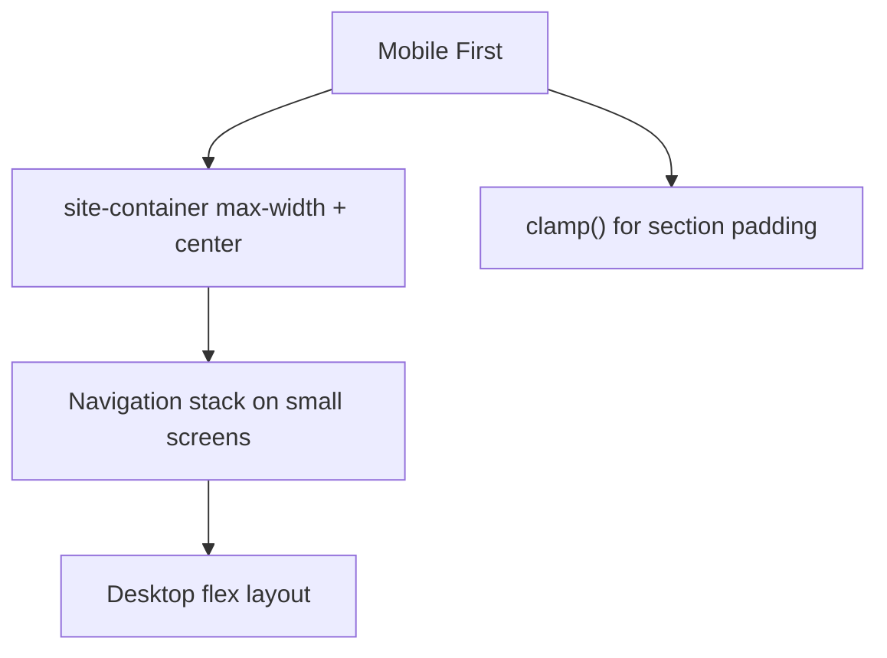
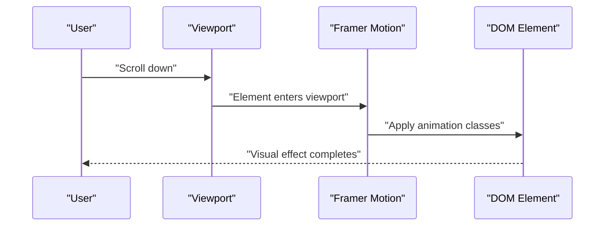
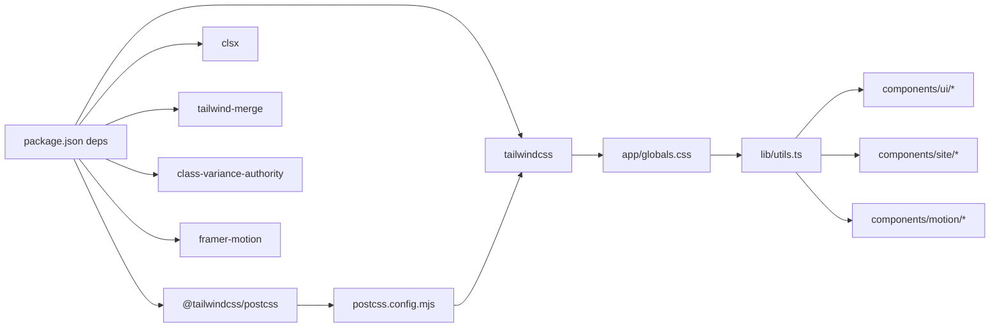

# Styling and Design System

<cite>
**Referenced Files in This Document**
- [app/globals.css](file://app/globals.css)
- [postcss.config.mjs](file://postcss.config.mjs)
- [package.json](file://package.json)
- [next.config.ts](file://next.config.ts)
- [lib/utils.ts](file://lib/utils.ts)
- [components/ui/button.tsx](file://components/ui/button.tsx)
- [components/ui/input.tsx](file://components/ui/input.tsx)
- [components/site/cards.tsx](file://components/site/cards.tsx)
- [components/site/navbar.tsx](file://components/site/navbar.tsx)
- [components/motion/reveal.tsx](file://components/motion/reveal.tsx)
</cite>

## Table of Contents
1. [Introduction](#introduction)
2. [Project Structure](#project-structure)
3. [Core Components](#core-components)
4. [Architecture Overview](#architecture-overview)
5. [Detailed Component Analysis](#detailed-component-analysis)
6. [Dependency Analysis](#dependency-analysis)
7. [Performance Considerations](#performance-considerations)
8. [Troubleshooting Guide](#troubleshooting-guide)
9. [Conclusion](#conclusion)
10. [Appendices](#appendices)

## Introduction
This document describes the styling architecture and design system implementation for the project. It covers Tailwind CSS configuration, custom design tokens, component styling patterns, responsive design, dark mode considerations, CSS custom properties usage, animations and transitions, cross-browser compatibility, asset management, performance optimizations, and governance guidelines for consistent component styling.

## Project Structure
The styling pipeline integrates PostCSS with Tailwind CSS v4, utility-first class composition via class-variance-authority and clsx/tailwind-merge, and Next.js runtime features. Global styles define CSS custom properties and foundational styles. Components apply design tokens through CSS variables and Tailwind utilities. Motion components integrate Framer Motion for scroll-triggered animations.

**Diagram sources**
- [postcss.config.mjs:1-8](file://postcss.config.mjs#L1-L8)
- [app/globals.css:1-138](file://app/globals.css#L1-L138)
- [lib/utils.ts:1-7](file://lib/utils.ts#L1-L7)
- [components/ui/button.tsx:1-53](file://components/ui/button.tsx#L1-L53)
- [components/ui/input.tsx:1-24](file://components/ui/input.tsx#L1-L24)
- [components/site/cards.tsx:1-151](file://components/site/cards.tsx#L1-L151)
- [components/site/navbar.tsx:1-116](file://components/site/navbar.tsx#L1-L116)
- [components/motion/reveal.tsx:1-39](file://components/motion/reveal.tsx#L1-L39)

**Section sources**
- [postcss.config.mjs:1-8](file://postcss.config.mjs#L1-L8)
- [app/globals.css:1-138](file://app/globals.css#L1-L138)
- [lib/utils.ts:1-7](file://lib/utils.ts#L1-L7)
- [components/ui/button.tsx:1-53](file://components/ui/button.tsx#L1-L53)
- [components/ui/input.tsx:1-24](file://components/ui/input.tsx#L1-L24)
- [components/site/cards.tsx:1-151](file://components/site/cards.tsx#L1-L151)
- [components/site/navbar.tsx:1-116](file://components/site/navbar.tsx#L1-L116)
- [components/motion/reveal.tsx:1-39](file://components/motion/reveal.tsx#L1-L39)

## Core Components
- Tailwind CSS v4 configured via PostCSS plugin.
- Global CSS defines CSS custom properties for brand colors, typography families, and base styles.
- Utility library merges Tailwind classes safely and resolves conflicts.
- UI primitives (Button, Input) use class-variance-authority for variant-driven styling and CSS variables for brand tokens.
- Site components compose global tokens and utilities for cards, navigation, and motion effects.
- Motion components provide scroll-triggered animations with reduced-motion support.

**Section sources**
- [postcss.config.mjs:1-8](file://postcss.config.mjs#L1-L8)
- [app/globals.css:1-138](file://app/globals.css#L1-L138)
- [lib/utils.ts:1-7](file://lib/utils.ts#L1-L7)
- [components/ui/button.tsx:1-53](file://components/ui/button.tsx#L1-L53)
- [components/ui/input.tsx:1-24](file://components/ui/input.tsx#L1-L24)
- [components/site/cards.tsx:1-151](file://components/site/cards.tsx#L1-L151)
- [components/site/navbar.tsx:1-116](file://components/site/navbar.tsx#L1-L116)
- [components/motion/reveal.tsx:1-39](file://components/motion/reveal.tsx#L1-L39)

## Architecture Overview
The styling architecture follows a layered approach:
- Build layer: PostCSS compiles Tailwind directives into optimized CSS.
- Token layer: CSS custom properties centralize brand colors and typography families.
- Composition layer: Utilities merge classes and resolve variants; components apply tokens and Tailwind utilities.
- Animation layer: Framer Motion integrates with viewport triggers and prefers-reduced-motion.
- Runtime layer: Next.js handles CSP, fonts, and image optimization.

**Diagram sources**
- [postcss.config.mjs:1-8](file://postcss.config.mjs#L1-L8)
- [app/globals.css:1-138](file://app/globals.css#L1-L138)
- [components/motion/reveal.tsx:1-39](file://components/motion/reveal.tsx#L1-L39)
- [next.config.ts:1-91](file://next.config.ts#L1-L91)

## Detailed Component Analysis

### Tailwind CSS and PostCSS Configuration
- Tailwind CSS v4 is enabled via the PostCSS plugin.
- The build pipeline compiles Tailwind utilities and generates CSS during Next.js builds.
- No explicit tailwind.config.js was found; defaults are used.

**Diagram sources**
- [postcss.config.mjs:1-8](file://postcss.config.mjs#L1-L8)
- [app/globals.css:1-138](file://app/globals.css#L1-L138)

**Section sources**
- [postcss.config.mjs:1-8](file://postcss.config.mjs#L1-L8)
- [package.json:14-36](file://package.json#L14-L36)

### Design Tokens and CSS Custom Properties
- CSS variables define brand colors, backgrounds, surfaces, and typography families.
- Tokens are consumed directly in components and utilities for consistent theming.
- Typography families are declared as fallback stacks using CSS variables.

**Diagram sources**
- [app/globals.css:3-20](file://app/globals.css#L3-L20)

**Section sources**
- [app/globals.css:3-20](file://app/globals.css#L3-L20)

### Utility-First Composition Pattern
- The cn utility merges Tailwind classes and resolves conflicts using clsx and tailwind-merge.
- UI components use class-variance-authority to define variant sets and default props.
- Variants include color schemes, borders, shadows, and sizing for buttons and inputs.

**Diagram sources**
- [lib/utils.ts:1-7](file://lib/utils.ts#L1-L7)
- [components/ui/button.tsx:7-34](file://components/ui/button.tsx#L7-L34)
- [components/ui/input.tsx:7-18](file://components/ui/input.tsx#L7-L18)

**Section sources**
- [lib/utils.ts:1-7](file://lib/utils.ts#L1-L7)
- [components/ui/button.tsx:1-53](file://components/ui/button.tsx#L1-L53)
- [components/ui/input.tsx:1-24](file://components/ui/input.tsx#L1-L24)

### Responsive Design and Breakpoints
- Mobile-first strategy is evident in component classes and global container widths.
- The site container enforces a max width and centered layout.
- Media queries and clamp are used for fluid spacing and typography.
- Navigation adapts from mobile hamburger to desktop flex layout.

**Diagram sources**
- [app/globals.css:63-72](file://app/globals.css#L63-L72)
- [components/site/navbar.tsx:14-116](file://components/site/navbar.tsx#L14-L116)

**Section sources**
- [app/globals.css:63-72](file://app/globals.css#L63-L72)
- [components/site/navbar.tsx:14-116](file://components/site/navbar.tsx#L14-L116)

### Dark Mode Implementation and Theme Switching
- The codebase does not include explicit dark mode CSS classes or theme switching logic.
- Global styles define light-mode backgrounds and surfaces via CSS variables.
- To implement dark mode, introduce a data attribute on the root element and define a dark variant for each CSS variable in :root and a corresponding dark: scope.

[No sources needed since this section provides general guidance]

### CSS Custom Properties Usage
- Brand tokens are consistently referenced using CSS variables across components.
- Typography families are centralized in variables for maintainable font stacks.
- Surface and background tokens enable easy theme swaps.

**Section sources**
- [app/globals.css:3-20](file://app/globals.css#L3-L20)
- [components/ui/button.tsx:8-21](file://components/ui/button.tsx#L8-L21)
- [components/ui/input.tsx:11-12](file://components/ui/input.tsx#L11-L12)

### Animation and Transition System
- Scroll-triggered animations use Framer Motion with viewport in-view triggers.
- Reduced-motion preference is respected globally by minimizing animation and transition durations.
- Hover states and transitions are applied to interactive elements for feedback.

**Diagram sources**
- [components/motion/reveal.tsx:11-24](file://components/motion/reveal.tsx#L11-L24)
- [app/globals.css:128-137](file://app/globals.css#L128-L137)

**Section sources**
- [components/motion/reveal.tsx:1-39](file://components/motion/reveal.tsx#L1-L39)
- [app/globals.css:119-126](file://app/globals.css#L119-L126)
- [app/globals.css:128-137](file://app/globals.css#L128-L137)

### Cross-Browser Compatibility and Polyfills
- Next.js Content Security Policy headers are configured to permit inline styles and scripts only in development.
- Fonts are served via Next.js font optimization; ensure fallbacks are declared in CSS variables.
- CSS variables are widely supported; older browsers may require polyfills. Consider adding a small polyfill shim if targeting legacy environments.

**Section sources**
- [next.config.ts:8-25](file://next.config.ts#L8-L25)
- [app/globals.css:17-19](file://app/globals.css#L17-L19)

### Asset Management for Fonts, Icons, and Images
- Font families are declared via CSS variables and Next.js font optimization.
- Icons are imported from lucide-react and rendered as inline SVG components.
- Images leverage Next.js Image with fill, sizes, and priority attributes for performance.

**Section sources**
- [app/globals.css:17-19](file://app/globals.css#L17-L19)
- [components/site/navbar.tsx:7,12](file://components/site/navbar.tsx#L7,L12)
- [components/site/cards.tsx:25-30](file://components/site/cards.tsx#L25-L30)

### Performance Optimization Techniques
- CSS optimization: Tailwind purges unused classes during production builds; ensure source paths are correct.
- Critical CSS: Next.js injects critical CSS for pages automatically; keep global styles minimal and scoped.
- Class merging: Using clsx and tailwind-merge reduces bundle size by avoiding redundant classes.
- Images: Next.js Image optimization improves loading performance; use appropriate sizes and aspect ratios.

**Section sources**
- [lib/utils.ts:1-7](file://lib/utils.ts#L1-L7)
- [components/site/cards.tsx:25-30](file://components/site/cards.tsx#L25-L30)

### Design System Governance and Consistency Guidelines
- Centralize tokens in CSS variables for consistent theming across components.
- Prefer class-variance-authority for variant-driven UI primitives to enforce design consistency.
- Use the cn utility to merge classes safely and avoid duplication.
- Apply mobile-first responsive patterns and clamp for scalable spacing.
- Respect reduced-motion preferences to improve accessibility.

**Section sources**
- [app/globals.css:3-20](file://app/globals.css#L3-L20)
- [components/ui/button.tsx:7-34](file://components/ui/button.tsx#L7-L34)
- [lib/utils.ts:1-7](file://lib/utils.ts#L1-L7)
- [app/globals.css:63-72](file://app/globals.css#L63-L72)
- [app/globals.css:128-137](file://app/globals.css#L128-L137)

## Dependency Analysis
The styling stack depends on Tailwind CSS v4, PostCSS, and Next.js. Utilities depend on class merging libraries. UI components depend on design tokens and motion libraries.

**Diagram sources**
- [package.json:14-36](file://package.json#L14-L36)
- [postcss.config.mjs:1-8](file://postcss.config.mjs#L1-L8)
- [app/globals.css:1-138](file://app/globals.css#L1-L138)
- [lib/utils.ts:1-7](file://lib/utils.ts#L1-L7)
- [components/ui/button.tsx:1-53](file://components/ui/button.tsx#L1-L53)
- [components/ui/input.tsx:1-24](file://components/ui/input.tsx#L1-L24)
- [components/site/cards.tsx:1-151](file://components/site/cards.tsx#L1-L151)
- [components/site/navbar.tsx:1-116](file://components/site/navbar.tsx#L1-L116)
- [components/motion/reveal.tsx:1-39](file://components/motion/reveal.tsx#L1-L39)

**Section sources**
- [package.json:14-36](file://package.json#L14-L36)
- [postcss.config.mjs:1-8](file://postcss.config.mjs#L1-L8)
- [lib/utils.ts:1-7](file://lib/utils.ts#L1-L7)

## Performance Considerations
- Keep global CSS minimal; Tailwind purging removes unused utilities in production.
- Use CSS variables for theme tokens to avoid duplicating color values.
- Prefer CSS transforms and opacity for animations to leverage GPU acceleration.
- Lazy-load non-critical assets and defer offscreen images.

[No sources needed since this section provides general guidance]

## Troubleshooting Guide
- Tailwind utilities not applying: Verify PostCSS plugin is present and Tailwind directives are included in global CSS.
- Conflicting classes: Ensure the cn utility is used to merge classes and avoid duplicates.
- Motion not triggering: Confirm viewport options and in-view thresholds; check for reduced-motion overrides.
- CSP blocking styles: Review Next.js CSP headers for style-src policy in development vs production.

**Section sources**
- [postcss.config.mjs:1-8](file://postcss.config.mjs#L1-L8)
- [lib/utils.ts:1-7](file://lib/utils.ts#L1-L7)
- [components/motion/reveal.tsx:11-24](file://components/motion/reveal.tsx#L11-L24)
- [next.config.ts:8-25](file://next.config.ts#L8-L25)

## Conclusion
The project employs a clean, utility-first styling architecture powered by Tailwind CSS v4 and PostCSS, with centralized design tokens via CSS variables. Components are composed using class-variance-authority and safe class merging utilities. Motion effects integrate with Framer Motion and respect reduced-motion preferences. The system is structured for scalability, maintainability, and performance, with clear pathways to implement dark mode and further optimize the design system.

[No sources needed since this section summarizes without analyzing specific files]

## Appendices
- Token reference: Brand colors, backgrounds, surfaces, and typography families are defined in the global CSS variables.
- Component variants: Buttons and inputs expose variant and size props for consistent styling across the UI.

**Section sources**
- [app/globals.css:3-20](file://app/globals.css#L3-L20)
- [components/ui/button.tsx:7-34](file://components/ui/button.tsx#L7-L34)
- [components/ui/input.tsx:7-18](file://components/ui/input.tsx#L7-L18)