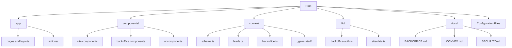

# Getting Started

<cite>
**Referenced Files in This Document**
- [package.json](file://package.json)
- [next.config.ts](file://next.config.ts)
- [tsconfig.json](file://tsconfig.json)
- [convex/tsconfig.json](file://convex/tsconfig.json)
- [convex/schema.ts](file://convex/schema.ts)
- [convex/leads.ts](file://convex/leads.ts)
- [convex/backoffice.ts](file://convex/backoffice.ts)
- [app/actions/lead-actions.ts](file://app/actions/lead-actions.ts)
- [lib/backoffice-auth.ts](file://lib/backoffice-auth.ts)
- [docs/BACKOFFICE.md](file://docs/BACKOFFICE.md)
- [docs/CONVEX.md](file://docs/CONVEX.md)
- [docs/SECURITY.md](file://docs/SECURITY.md)
</cite>

## Table of Contents
1. [Introduction](#introduction)
2. [Prerequisites](#prerequisites)
3. [Installation](#installation)
4. [Local Development](#local-development)
5. [Project Structure](#project-structure)
6. [Environment Variables](#environment-variables)
7. [Initial Convex Setup](#initial-convex-setup)
8. [Running the Application](#running-the-application)
9. [Verification Steps](#verification-steps)
10. [Troubleshooting Guide](#troubleshooting-guide)
11. [Security Considerations](#security-considerations)
12. [Conclusion](#conclusion)

## Introduction
This guide helps you set up and run the ADIKI ALVANIR Angola website locally. It covers prerequisites, installation, environment configuration, running the Next.js frontend and Convex backend, understanding the project structure, and verifying your setup.

## Prerequisites
Before installing, ensure your environment meets the following requirements:

- Node.js: Use a current LTS version compatible with the project dependencies. The project specifies Next.js 16.x and related tooling; align your Node.js version accordingly.
- Git: Required to clone the repository.
- Terminal or Command Prompt: For running commands.
- Optional: Convex CLI installed globally for development tasks.

These requirements are inferred from the project's dependencies and scripts.

**Section sources**
- [package.json:14-36](file://package.json#L14-L36)
- [next.config.ts:1-91](file://next.config.ts#L1-L91)

## Installation
Follow these steps to install the project locally:

1. Clone the repository to your machine.
2. Navigate to the project directory.
3. Install dependencies using your package manager.

```bash
npm install
```

This installs both frontend and Convex-related dependencies defined in the project.

**Section sources**
- [package.json:5-13](file://package.json#L5-L13)

## Local Development
After installation, you can run the development servers:

- Frontend (Next.js): Start the development server.
- Backend (Convex): Start the local Convex backend services.

```bash
# Start Next.js development server
npm run dev

# Start Convex backend services
npm run convex:dev
```

These scripts are defined in the project configuration.

**Section sources**
- [package.json:5-13](file://package.json#L5-L13)

## Project Structure
The repository is organized into frontend and backend components:

- app/: Next.js application pages, layouts, and client/server actions.
- components/: Reusable React components grouped by site and backoffice.
- convex/: Convex schema, server functions, and generated files.
- lib/: Shared utilities for authentication and data access.
- docs/: Project documentation for backoffice, Convex integration, and security.
- Root configuration files for Next.js, TypeScript, ESLint, and PostCSS.



**Diagram sources**
- [package.json:1-51](file://package.json#L1-L51)
- [convex/schema.ts:1-87](file://convex/schema.ts#L1-L87)
- [lib/backoffice-auth.ts:1-129](file://lib/backoffice-auth.ts#L1-L129)

**Section sources**
- [package.json:1-51](file://package.json#L1-L51)

## Environment Variables
Configure the following environment variables for local development:

- NEXT_PUBLIC_CONVEX_URL: Set to your local Convex deployment URL during development.
- BACKOFFICE_API_KEY: Secret key required for protected backoffice operations.
- BACKOFFICE_PASSWORD_HASH: Server-side hashed password for backoffice login.
- BACKOFFICE_SESSION_SECRET: Secret used to sign backoffice session cookies.

These variables are used by the frontend, Convex functions, and authentication utilities.

**Section sources**
- [docs/CONVEX.md:18-25](file://docs/CONVEX.md#L18-L25)
- [docs/BACKOFFICE.md:15-21](file://docs/BACKOFFICE.md#L15-L21)
- [app/actions/lead-actions.ts:44-49](file://app/actions/lead-actions.ts#L44-L49)
- [lib/backoffice-auth.ts:18-26](file://lib/backoffice-auth.ts#L18-L26)
- [lib/backoffice-auth.ts:120-129](file://lib/backoffice-auth.ts#L120-L129)

## Initial Convex Setup
Perform the following steps to initialize Convex locally:

1. Log in to Convex via the CLI.
2. Run the development command to configure your local deployment, set environment variables, and push functions.

```bash
npx convex dev
```

This command:
- Configures the local deployment.
- Sets the NEXT_PUBLIC_CONVEX_URL automatically.
- Regenerates Convex-generated files.
- Pushes Convex functions to the development deployment.

Optionally, deploy to production after testing:

```bash
npx convex deploy
```

Set the BACKOFFICE_API_KEY in Convex for production as documented.

**Section sources**
- [docs/CONVEX.md:34-48](file://docs/CONVEX.md#L34-L48)
- [docs/CONVEX.md:27-32](file://docs/CONVEX.md#L27-L32)

## Running the Application
Start both the frontend and backend:

1. Open a terminal and run:
   ```bash
   npm run convex:dev
   ```
   This starts the Convex backend and prepares the local database.

2. Open another terminal and run:
   ```bash
   npm run dev
   ```
   This starts the Next.js development server.

3. Access the application in your browser at the port indicated by the Next.js server.

4. Access the backoffice login at `/backoffice/login`.

**Section sources**
- [package.json:5-13](file://package.json#L5-L13)
- [docs/BACKOFFICE.md:3](file://docs/BACKOFFICE.md#L3)

## Verification Steps
After starting both servers, verify your setup:

- Confirm the frontend loads without errors.
- Submit the contact form to ensure it reaches Convex and returns a success message.
- Verify that the backoffice login page is accessible and requires a valid session.
- Ensure images uploaded via the backoffice appear correctly in lists and content queries.

These checks confirm that the frontend, Convex backend, and authentication are working together.

**Section sources**
- [app/actions/lead-actions.ts:32-95](file://app/actions/lead-actions.ts#L32-L95)
- [lib/backoffice-auth.ts:83-118](file://lib/backoffice-auth.ts#L83-L118)
- [convex/backoffice.ts:120-145](file://convex/backoffice.ts#L120-L145)

## Troubleshooting Guide
Common setup issues and resolutions:

- Convex URL not configured:
  - Symptom: Contact form submission fails with a configuration message.
  - Resolution: Set NEXT_PUBLIC_CONVEX_URL to your local Convex deployment URL and restart the frontend.

- Backoffice login failures:
  - Symptom: Redirect to login or session errors.
  - Resolution: Ensure BACKOFFICE_API_KEY, BACKOFFICE_PASSWORD_HASH, and BACKOFFICE_SESSION_SECRET are set. Clear browser cookies for the site and retry.

- Convex functions not found:
  - Symptom: Errors indicating missing functions.
  - Resolution: Run the Convex development command to regenerate generated files and push functions.

- CSP or image loading issues:
  - Symptom: Blocked resources or images not appearing.
  - Resolution: Review Content-Security-Policy settings and ensure images are served from allowed origins.

- Type checking or linting errors:
  - Symptom: TypeScript or ESLint warnings.
  - Resolution: Fix reported issues or run typecheck and lint scripts to identify problems.

**Section sources**
- [app/actions/lead-actions.ts:44-49](file://app/actions/lead-actions.ts#L44-L49)
- [lib/backoffice-auth.ts:18-26](file://lib/backoffice-auth.ts#L18-L26)
- [lib/backoffice-auth.ts:120-129](file://lib/backoffice-auth.ts#L120-L129)
- [docs/CONVEX.md:34-48](file://docs/CONVEX.md#L34-L48)
- [next.config.ts:8-25](file://next.config.ts#L8-L25)

## Security Considerations
The project implements several security measures:

- Strict Content-Security-Policy restricts script, image, frame, and connection sources.
- Next.js security headers are configured to reduce common attack vectors.
- Backoffice authentication uses signed HttpOnly cookies and requires a server-side session secret.
- Protected Convex functions require an API key.
- Form submissions are validated server-side and sanitized before being sent to Convex.
- Media uploads go through Convex Storage, and only approved content is exposed publicly.

Review the security documentation for production hardening guidance and ongoing maintenance practices.

**Section sources**
- [next.config.ts:27-61](file://next.config.ts#L27-L61)
- [lib/backoffice-auth.ts:60-76](file://lib/backoffice-auth.ts#L60-L76)
- [lib/backoffice-auth.ts:120-129](file://lib/backoffice-auth.ts#L120-L129)
- [docs/SECURITY.md:1-29](file://docs/SECURITY.md#L1-L29)

## Conclusion
You now have the basics to develop and run the ADIKI ALVANIR Angola website locally. Ensure environment variables are configured, run both the Next.js and Convex development servers, and use the verification steps to confirm everything works. Refer to the documentation files for advanced topics and production deployment guidance.