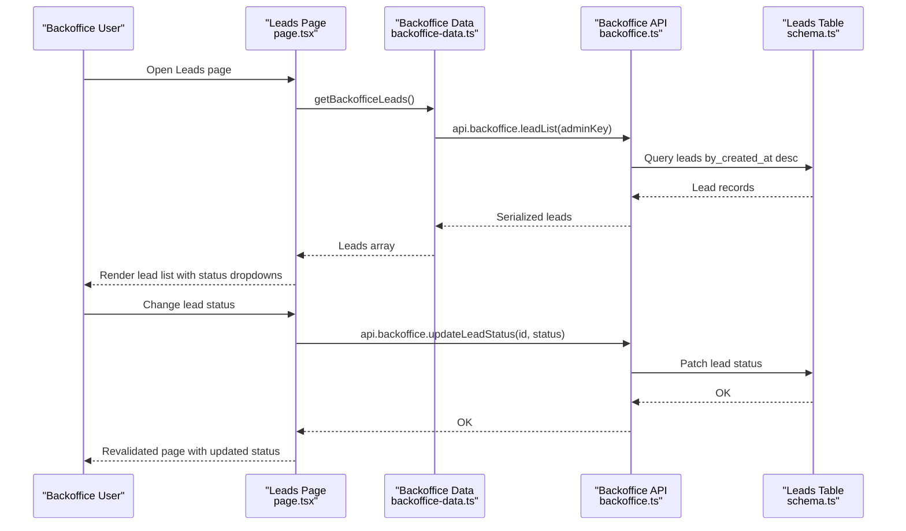
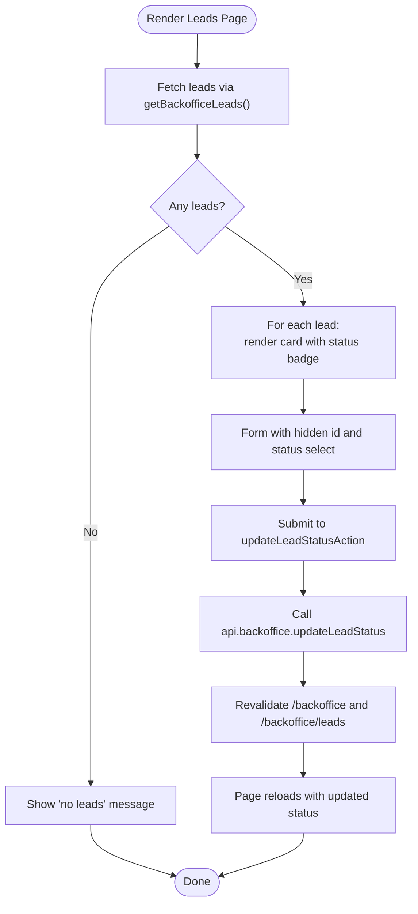
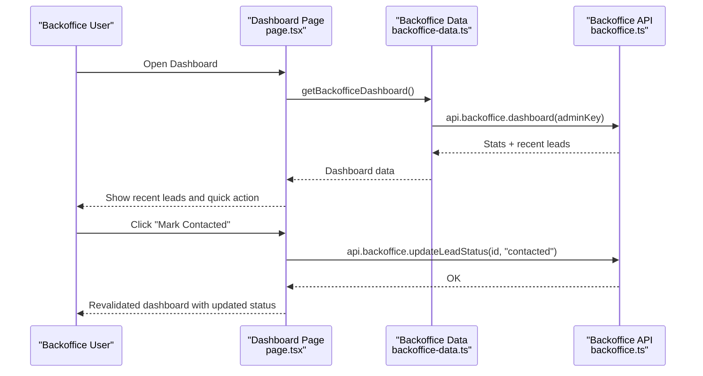
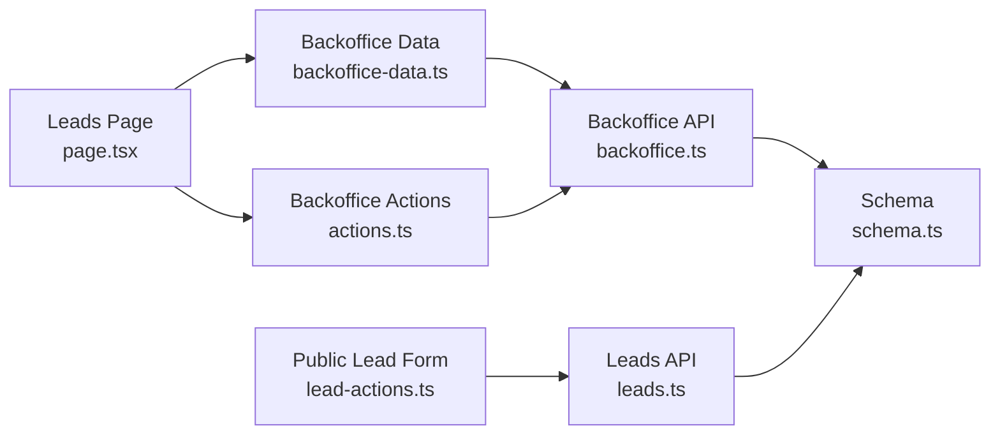
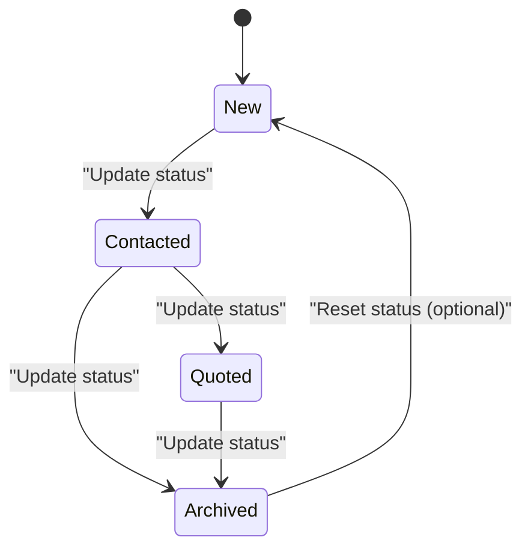

# Administrative Lead Management Interface

<cite>
**Referenced Files in This Document**
- [leads.ts](file://convex/leads.ts)
- [backoffice.ts](file://convex/backoffice.ts)
- [schema.ts](file://convex/schema.ts)
- [page.tsx](file://app/backoffice/(admin)/leads/page.tsx)
- [page.tsx](file://app/backoffice/(admin)/page.tsx)
- [actions.ts](file://app/backoffice/actions.ts)
- [admin-ui.tsx](file://components/backoffice/admin-ui.tsx)
- [button.tsx](file://components/ui/button.tsx)
- [backoffice-data.ts](file://lib/backoffice-data.ts)
- [backoffice-auth.ts](file://lib/backoffice-auth.ts)
- [lead-actions.ts](file://app/actions/lead-actions.ts)
</cite>

## Table of Contents
1. [Introduction](#introduction)
2. [Project Structure](#project-structure)
3. [Core Components](#core-components)
4. [Architecture Overview](#architecture-overview)
5. [Detailed Component Analysis](#detailed-component-analysis)
6. [Dependency Analysis](#dependency-analysis)
7. [Performance Considerations](#performance-considerations)
8. [Troubleshooting Guide](#troubleshooting-guide)
9. [Conclusion](#conclusion)
10. [Appendices](#appendices)

## Introduction
This document describes the administrative lead management interface for backoffice users. It covers the backoffice leads dashboard, lead listing, filtering and sorting capabilities, status management with visual indicators and transitions, lead detail view, bulk operations, search and filtering mechanisms, analytics and reporting features, integration with external communication tools, user interface patterns and accessibility, administrative workflow optimization, and training guidance for backoffice users.

## Project Structure
The lead management interface spans UI pages, Convex backend queries/mutations, and shared utilities for authentication and data fetching. The key areas are:
- Frontend pages under the backoffice admin route
- Convex schema and backoffice APIs for data access and mutations
- Shared UI components and utilities for authentication and data retrieval

```mermaid
graph TB
subgraph "Frontend"
LeadsPage["Leads Page<br/>app/backoffice/(admin)/leads/page.tsx"]
DashboardPage["Dashboard Page<br/>app/backoffice/(admin)/page.tsx"]
AdminUI["Admin UI Components<br/>components/backoffice/admin-ui.tsx"]
Button["Button Component<br/>components/ui/button.tsx"]
end
subgraph "Actions"
Actions["Backoffice Actions<br/>app/backoffice/actions.ts"]
LeadActions["Public Lead Actions<br/>app/actions/lead-actions.ts"]
end
subgraph "Data Access"
BackofficeData["Backoffice Data Utilities<br/>lib/backoffice-data.ts"]
Auth["Backoffice Auth Utilities<br/>lib/backoffice-auth.ts"]
end
subgraph "Backend (Convex)"
Schema["Schema<br/>convex/schema.ts"]
LeadsAPI["Leads API<br/>convex/leads.ts"]
BackofficeAPI["Backoffice API<br/>convex/backoffice.ts"]
end
LeadsPage --> BackofficeData
DashboardPage --> BackofficeData
BackofficeData --> Auth
LeadsPage --> Actions
DashboardPage --> Actions
Actions --> BackofficeAPI
BackofficeData --> BackofficeAPI
LeadsAPI --> Schema
BackofficeAPI --> Schema
LeadActions --> LeadsAPI
```

**Diagram sources**
- [page.tsx](file://app/backoffice/(admin)/leads/page.tsx#L1-L72)
- [page.tsx](file://app/backoffice/(admin)/page.tsx#L25-L86)
- [admin-ui.tsx:1-25](file://components/backoffice/admin-ui.tsx#L1-L25)
- [button.tsx:1-53](file://components/ui/button.tsx#L1-L53)
- [actions.ts:1-215](file://app/backoffice/actions.ts#L1-L215)
- [lead-actions.ts:1-96](file://app/actions/lead-actions.ts#L1-L96)
- [backoffice-data.ts:1-21](file://lib/backoffice-data.ts#L1-L21)
- [backoffice-auth.ts:1-129](file://lib/backoffice-auth.ts#L1-L129)
- [schema.ts:1-87](file://convex/schema.ts#L1-L87)
- [leads.ts:1-32](file://convex/leads.ts#L1-L32)
- [backoffice.ts:1-385](file://convex/backoffice.ts#L1-L385)

**Section sources**
- [page.tsx](file://app/backoffice/(admin)/leads/page.tsx#L1-L72)
- [page.tsx](file://app/backoffice/(admin)/page.tsx#L25-L86)
- [admin-ui.tsx:1-25](file://components/backoffice/admin-ui.tsx#L1-L25)
- [button.tsx:1-53](file://components/ui/button.tsx#L1-L53)
- [actions.ts:1-215](file://app/backoffice/actions.ts#L1-L215)
- [lead-actions.ts:1-96](file://app/actions/lead-actions.ts#L1-L96)
- [backoffice-data.ts:1-21](file://lib/backoffice-data.ts#L1-L21)
- [backoffice-auth.ts:1-129](file://lib/backoffice-auth.ts#L1-L129)
- [schema.ts:1-87](file://convex/schema.ts#L1-L87)
- [leads.ts:1-32](file://convex/leads.ts#L1-L32)
- [backoffice.ts:1-385](file://convex/backoffice.ts#L1-L385)

## Core Components
- Leads listing and status management UI: renders lead entries with status badges and inline status update controls.
- Dashboard overview: shows recent leads and quick actions.
- Backoffice data utilities: encapsulate Convex query/mutation calls with admin key validation.
- Authentication utilities: manage admin sessions and API key validation.
- Convex schema and APIs: define lead data model, indexes, and backoffice queries/mutations for lead listing and status updates.

Key implementation references:
- Leads page rendering and inline status updates: [page.tsx](file://app/backoffice/(admin)/leads/page.tsx#L8-L72)
- Dashboard recent leads and quick "mark contacted": [page.tsx](file://app/backoffice/(admin)/page.tsx#L25-L86)
- Backoffice lead listing query: [backoffice.ts:147-153](file://convex/backoffice.ts#L147-L153)
- Lead status update mutation: [backoffice.ts:155-161](file://convex/backoffice.ts#L155-L161)
- Lead creation and recent query: [leads.ts:7-31](file://convex/leads.ts#L7-L31)
- Lead status enum definition: [schema.ts](file://convex/schema.ts#L12)
- Data access utilities: [backoffice-data.ts:6-16](file://lib/backoffice-data.ts#L6-L16)
- Admin key and session utilities: [backoffice-auth.ts:120-129](file://lib/backoffice-auth.ts#L120-L129), [backoffice-auth.ts:60-118](file://lib/backoffice-auth.ts#L60-L118)

**Section sources**
- [page.tsx](file://app/backoffice/(admin)/leads/page.tsx#L8-L72)
- [page.tsx](file://app/backoffice/(admin)/page.tsx#L25-L86)
- [backoffice.ts:147-161](file://convex/backoffice.ts#L147-L161)
- [leads.ts:7-31](file://convex/leads.ts#L7-L31)
- [schema.ts](file://convex/schema.ts#L12)
- [backoffice-data.ts:6-16](file://lib/backoffice-data.ts#L6-L16)
- [backoffice-auth.ts:60-129](file://lib/backoffice-auth.ts#L60-L129)

## Architecture Overview
The backoffice lead management follows a clear separation of concerns:
- UI pages fetch data via backoffice data utilities.
- Data utilities call Convex queries/mutations secured by admin API keys.
- Convex enforces admin authentication and exposes typed queries/mutations.
- Public lead submissions flow through a separate public action to the leads collection.



**Diagram sources**
- [page.tsx](file://app/backoffice/(admin)/leads/page.tsx#L1-L72)
- [backoffice-data.ts:14-16](file://lib/backoffice-data.ts#L14-L16)
- [backoffice.ts:147-161](file://convex/backoffice.ts#L147-L161)
- [schema.ts:5-17](file://convex/schema.ts#L5-L17)

**Section sources**
- [page.tsx](file://app/backoffice/(admin)/leads/page.tsx#L1-L72)
- [backoffice-data.ts:14-16](file://lib/backoffice-data.ts#L14-L16)
- [backoffice.ts:147-161](file://convex/backoffice.ts#L147-L161)
- [schema.ts:5-17](file://convex/schema.ts#L5-L17)

## Detailed Component Analysis

### Leads Listing and Status Management
The leads page displays a scrollable list of leads with:
- Name, company, phone, email
- Message preview
- Created timestamp and source
- Inline status dropdown with four states: new, contacted, quoted, archived
- Update button to persist status changes



**Diagram sources**
- [page.tsx](file://app/backoffice/(admin)/leads/page.tsx#L8-L72)
- [actions.ts:119-128](file://app/backoffice/actions.ts#L119-L128)
- [backoffice.ts:155-161](file://convex/backoffice.ts#L155-L161)

**Section sources**
- [page.tsx](file://app/backoffice/(admin)/leads/page.tsx#L8-L72)
- [actions.ts:119-128](file://app/backoffice/actions.ts#L119-L128)
- [backoffice.ts:155-161](file://convex/backoffice.ts#L155-L161)

### Dashboard Overview and Quick Actions
The dashboard shows recent leads and a quick "mark contacted" action per lead, enabling rapid status updates without navigating to the full leads list.



**Diagram sources**
- [page.tsx](file://app/backoffice/(admin)/page.tsx#L25-L86)
- [backoffice-data.ts:6-8](file://lib/backoffice-data.ts#L6-L8)
- [backoffice.ts:120-144](file://convex/backoffice.ts#L120-L144)
- [backoffice.ts:155-161](file://convex/backoffice.ts#L155-L161)

**Section sources**
- [page.tsx](file://app/backoffice/(admin)/page.tsx#L25-L86)
- [backoffice-data.ts:6-8](file://lib/backoffice-data.ts#L6-L8)
- [backoffice.ts:120-144](file://convex/backoffice.ts#L120-L144)
- [backoffice.ts:155-161](file://convex/backoffice.ts#L155-L161)

### Lead Detail View
The current implementation shows a compact lead card with essential information and inline status controls. To enhance the detail view:
- Add a dedicated lead detail route that fetches a single lead by ID.
- Display full details including source, user agent, and timestamps.
- Provide action buttons for status transitions and external communication links.

Current rendering references:
- Lead card layout and status badge: [page.tsx](file://app/backoffice/(admin)/leads/page.tsx#L21-L38)
- Status dropdown and update button: [page.tsx](file://app/backoffice/(admin)/leads/page.tsx#L40-L59)

**Section sources**
- [page.tsx](file://app/backoffice/(admin)/leads/page.tsx#L21-L59)

### Bulk Operations
Bulk operations are not currently implemented. Recommended additions:
- Multi-select checkboxes on the leads list.
- Batch actions for status updates (e.g., "Set status to contacted").
- Export functionality to CSV/Excel with filters applied.

Current single-lead update mechanism:
- Inline form per lead with hidden ID and status select: [page.tsx](file://app/backoffice/(admin)/leads/page.tsx#L40-L59)
- Action handler and mutation: [actions.ts:119-128](file://app/backoffice/actions.ts#L119-L128), [backoffice.ts:155-161](file://convex/backoffice.ts#L155-L161)

**Section sources**
- [page.tsx](file://app/backoffice/(admin)/leads/page.tsx#L40-L59)
- [actions.ts:119-128](file://app/backoffice/actions.ts#L119-L128)
- [backoffice.ts:155-161](file://convex/backoffice.ts#L155-L161)

### Search and Filtering Mechanisms
Search and filtering are not yet implemented. Suggested enhancements:
- Add a filter bar with fields for status, source, date range, and free-text search.
- Implement server-side filtering using Convex queries with appropriate indexes.
- Persist filters in URL query parameters for sharing views.

Current data access:
- Lead listing query: [backoffice.ts:147-153](file://convex/backoffice.ts#L147-L153)
- Indexes defined in schema: [schema.ts:16-17](file://convex/schema.ts#L16-L17)

**Section sources**
- [backoffice.ts:147-153](file://convex/backoffice.ts#L147-L153)
- [schema.ts:16-17](file://convex/schema.ts#L16-L17)

### Lead Analytics and Reporting
Analytics and reporting are not currently present. Recommended features:
- Conversion tracking: calculate conversion rates from new to quoted/archived.
- Performance metrics: leads per source, average response time, top-performing sales periods.
- Export reports to CSV with selected metrics and filters.

Current data model supports basic analytics:
- Status enum and timestamps: [schema.ts:12-14](file://convex/schema.ts#L12-L14)
- Recent leads query: [leads.ts:26-31](file://convex/leads.ts#L26-L31)

**Section sources**
- [schema.ts:12-14](file://convex/schema.ts#L12-L14)
- [leads.ts:26-31](file://convex/leads.ts#L26-L31)

### Integration with External Communication Tools
External communication integrations are not implemented. Recommended additions:
- One-click links to call/WhatsApp/email using lead phone/email.
- Copy-to-clipboard actions for quick sharing.
- Integration with CRMs or helpdesks via webhooks or API calls.

Current UI patterns:
- Lead contact info display: [page.tsx](file://app/backoffice/(admin)/leads/page.tsx#L30-L38)

**Section sources**
- [page.tsx](file://app/backoffice/(admin)/leads/page.tsx#L30-L38)

### User Interface Patterns and Accessibility
UI patterns and accessibility considerations:
- Consistent typography and spacing using AdminHeader and AdminCard components.
- Clear visual hierarchy with status badges and concise previews.
- Accessible form controls with proper labeling and keyboard navigation.
- Responsive grid layouts for optimal viewing across devices.

References:
- Admin header and card components: [admin-ui.tsx:3-24](file://components/backoffice/admin-ui.tsx#L3-L24)
- Button variants and sizes: [button.tsx:7-34](file://components/ui/button.tsx#L7-L34)
- Grid layout and responsive design: [page.tsx](file://app/backoffice/(admin)/leads/page.tsx#L22)

**Section sources**
- [admin-ui.tsx:3-24](file://components/backoffice/admin-ui.tsx#L3-L24)
- [button.tsx:7-34](file://components/ui/button.tsx#L7-L34)
- [page.tsx](file://app/backoffice/(admin)/leads/page.tsx#L22)

### Administrative Workflow Optimization
Optimization opportunities:
- Quick actions on the dashboard reduce navigation overhead.
- Inline status updates minimize context switching.
- Batch operations would further streamline repetitive tasks.
- Export capabilities would support ad-hoc reporting and audits.

Current optimizations:
- Dashboard quick "mark contacted": [page.tsx](file://app/backoffice/(admin)/page.tsx#L71-L77)
- Inline status dropdowns: [page.tsx](file://app/backoffice/(admin)/leads/page.tsx#L44-L54)

**Section sources**
- [page.tsx](file://app/backoffice/(admin)/page.tsx#L71-L77)
- [page.tsx](file://app/backoffice/(admin)/leads/page.tsx#L44-L54)

### Training Guidance for Backoffice Users
Common administrative tasks and recommended training steps:
- Viewing leads: Navigate to the Leads page to see all recent entries.
- Updating lead status: Use the status dropdown and click Update to change the lead's stage.
- Marking leads as contacted: From the dashboard, click the quick "Mark Contacted" button.
- Bulk operations: Enable multi-select and batch actions after implementation.
- Exporting data: Use export functionality once available.
- Searching and filtering: Apply filters to narrow down leads by status, source, or date.

References for training:
- Leads page UI and controls: [page.tsx](file://app/backoffice/(admin)/leads/page.tsx#L13-L72)
- Dashboard quick actions: [page.tsx](file://app/backoffice/(admin)/page.tsx#L52-L77)

**Section sources**
- [page.tsx](file://app/backoffice/(admin)/leads/page.tsx#L13-L72)
- [page.tsx](file://app/backoffice/(admin)/page.tsx#L52-L77)

## Dependency Analysis
The system exhibits clear separation of concerns with minimal coupling between UI and backend logic.



**Diagram sources**
- [page.tsx](file://app/backoffice/(admin)/leads/page.tsx#L1-L72)
- [backoffice-data.ts:1-21](file://lib/backoffice-data.ts#L1-L21)
- [actions.ts:1-215](file://app/backoffice/actions.ts#L1-L215)
- [backoffice.ts:1-385](file://convex/backoffice.ts#L1-L385)
- [schema.ts:1-87](file://convex/schema.ts#L1-L87)
- [lead-actions.ts:1-96](file://app/actions/lead-actions.ts#L1-L96)
- [leads.ts:1-32](file://convex/leads.ts#L1-L32)

**Section sources**
- [page.tsx](file://app/backoffice/(admin)/leads/page.tsx#L1-L72)
- [backoffice-data.ts:1-21](file://lib/backoffice-data.ts#L1-L21)
- [actions.ts:1-215](file://app/backoffice/actions.ts#L1-L215)
- [backoffice.ts:1-385](file://convex/backoffice.ts#L1-L385)
- [schema.ts:1-87](file://convex/schema.ts#L1-L87)
- [lead-actions.ts:1-96](file://app/actions/lead-actions.ts#L1-L96)
- [leads.ts:1-32](file://convex/leads.ts#L1-L32)

## Performance Considerations
- Pagination and limits: Queries limit results to prevent excessive loads (e.g., MAX_ITEMS and MAX_LEADS_RETURNED).
- Index usage: Queries leverage indexes on status and created-at fields for efficient sorting and filtering.
- Revalidation: After mutations, targeted revalidation refreshes affected routes without full page reloads.

References:
- Query limits: [backoffice.ts](file://convex/backoffice.ts#L7), [leads.ts](file://convex/leads.ts#L5)
- Indexes: [schema.ts:16-17](file://convex/schema.ts#L16-L17)
- Revalidation: [actions.ts:126-127](file://app/backoffice/actions.ts#L126-L127)

**Section sources**
- [backoffice.ts](file://convex/backoffice.ts#L7)
- [leads.ts](file://convex/leads.ts#L5)
- [schema.ts:16-17](file://convex/schema.ts#L16-L17)
- [actions.ts:126-127](file://app/backoffice/actions.ts#L126-L127)

## Troubleshooting Guide
Common issues and resolutions:
- Unauthorized requests: Ensure BACKOFFICE_API_KEY is set and matches the server-side expectation.
- Missing Convex configuration: Verify NEXT_PUBLIC_CONVEX_URL is configured for public lead submissions.
- Session errors: Confirm BACKOFFICE_SESSION_SECRET is configured and sessions are valid.
- No leads displayed: Check database connectivity and that leads exist; confirm indexes are present.

References:
- Admin key enforcement: [backoffice.ts:25-31](file://convex/backoffice.ts#L25-L31)
- Session utilities: [backoffice-auth.ts:60-118](file://lib/backoffice-auth.ts#L60-L118)
- Convex URL check: [lead-actions.ts:44-49](file://app/actions/lead-actions.ts#L44-L49)

**Section sources**
- [backoffice.ts:25-31](file://convex/backoffice.ts#L25-L31)
- [backoffice-auth.ts:60-118](file://lib/backoffice-auth.ts#L60-L118)
- [lead-actions.ts:44-49](file://app/actions/lead-actions.ts#L44-L49)

## Conclusion
The administrative lead management interface provides a focused, efficient solution for backoffice teams to monitor and update lead statuses. The current implementation emphasizes simplicity and speed with inline updates and dashboard quick actions. Future enhancements should prioritize search and filtering, bulk operations, analytics, and external communication integrations to maximize productivity and insights.

## Appendices

### Lead Status Lifecycle


[No sources needed since this diagram shows conceptual workflow, not actual code structure]