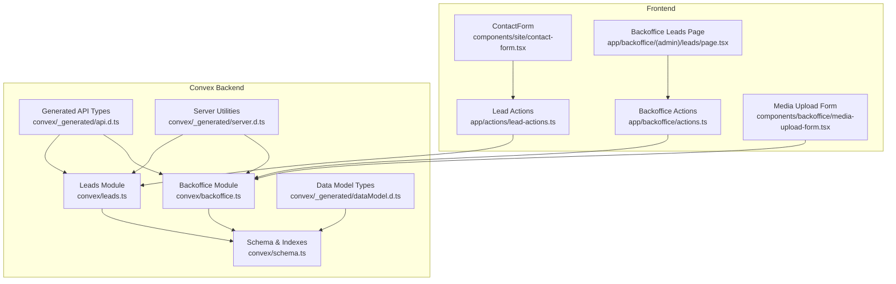
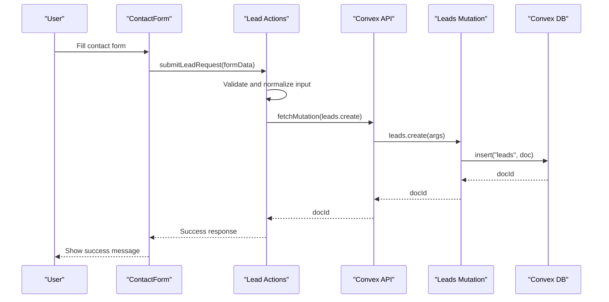
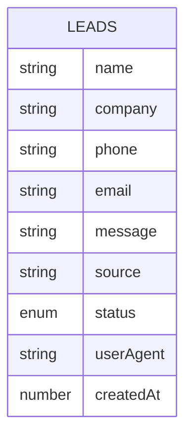
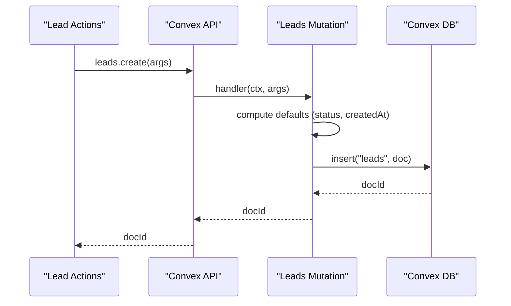
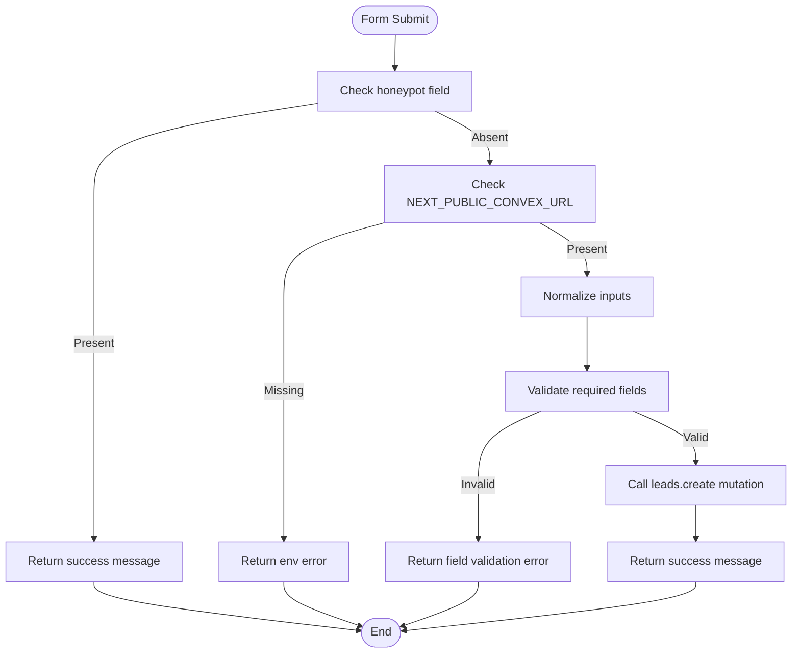
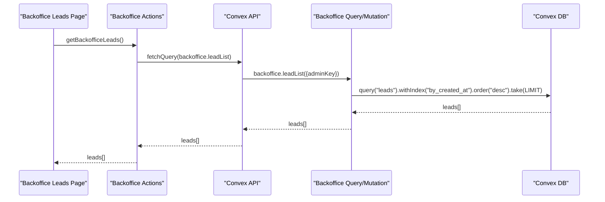
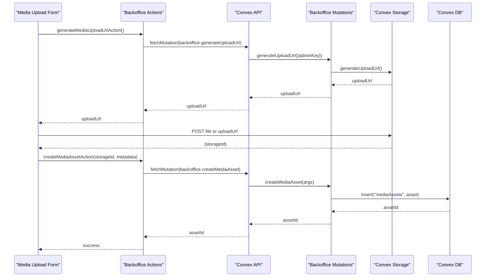
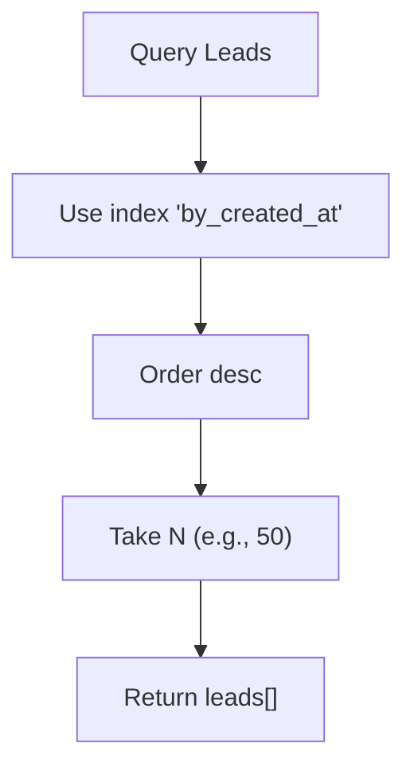
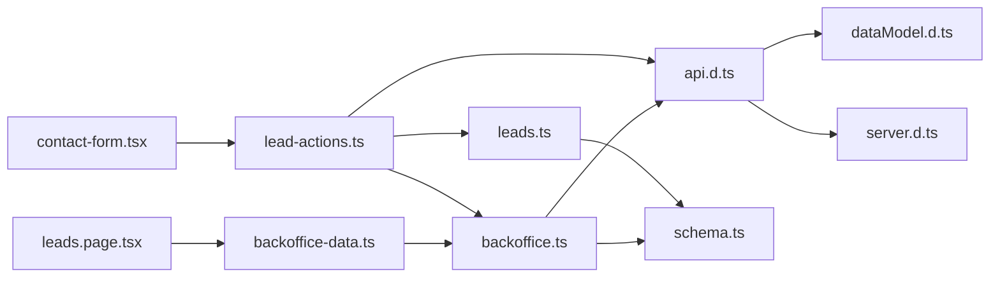

# Backend Lead Processing & Storage

<cite>
**Referenced Files in This Document**
- [schema.ts](file://convex/schema.ts)
- [leads.ts](file://convex/leads.ts)
- [backoffice.ts](file://convex/backoffice.ts)
- [lead-actions.ts](file://app/actions/lead-actions.ts)
- [contact-form.tsx](file://components/site/contact-form.tsx)
- [leads.page.tsx](file://app/backoffice/(admin)/leads/page.tsx)
- [backoffice-data.ts](file://lib/backoffice-data.ts)
- [actions.ts](file://app/backoffice/actions.ts)
- [media-upload-form.tsx](file://components/backoffice/media-upload-form.tsx)
- [api.d.ts](file://convex/_generated/api.d.ts)
- [dataModel.d.ts](file://convex/_generated/dataModel.d.ts)
- [server.d.ts](file://convex/_generated/server.d.ts)
</cite>

## Table of Contents
1. [Introduction](#introduction)
2. [Project Structure](#project-structure)
3. [Core Components](#core-components)
4. [Architecture Overview](#architecture-overview)
5. [Detailed Component Analysis](#detailed-component-analysis)
6. [Dependency Analysis](#dependency-analysis)
7. [Performance Considerations](#performance-considerations)
8. [Troubleshooting Guide](#troubleshooting-guide)
9. [Conclusion](#conclusion)

## Introduction
This document provides comprehensive backend documentation for lead processing and database storage in a Next.js application using Convex. It covers lead creation, validation, data persistence, schema design, indexing strategy, mutations and queries, data normalization, Convex Storage integration, retrieval patterns, performance optimization, consistency guarantees, and troubleshooting guidance.

## Project Structure
The lead processing pipeline spans frontend forms, server actions, Convex mutations and queries, and Convex Storage for media. The backend is organized around:
- Convex schema defining tables and indexes
- Lead-specific mutations and queries
- Backoffice mutations and queries for lead management
- Frontend actions that validate and submit lead data
- Media asset management integrated with Convex Storage

**Diagram sources**
- [contact-form.tsx:17-91](file://components/site/contact-form.tsx#L17-L91)
- [lead-actions.ts:32-95](file://app/actions/lead-actions.ts#L32-L95)
- [leads.page.tsx:8-72](file://app/backoffice/(admin)/leads/page.tsx#L8-L72)
- [actions.ts:119-128](file://app/backoffice/actions.ts#L119-L128)
- [media-upload-form.tsx:14-77](file://components/backoffice/media-upload-form.tsx#L14-L77)
- [schema.ts:4-86](file://convex/schema.ts#L4-L86)
- [leads.ts:7-31](file://convex/leads.ts#L7-L31)
- [backoffice.ts:68-161](file://convex/backoffice.ts#L68-L161)
- [api.d.ts:20-36](file://convex/_generated/api.d.ts#L20-L36)
- [dataModel.d.ts:11-60](file://convex/_generated/dataModel.d.ts#L11-L60)
- [server.d.ts:24-62](file://convex/_generated/server.d.ts#L24-L62)

**Section sources**
- [schema.ts:4-86](file://convex/schema.ts#L4-L86)
- [leads.ts:7-31](file://convex/leads.ts#L7-L31)
- [backoffice.ts:68-161](file://convex/backoffice.ts#L68-L161)
- [lead-actions.ts:32-95](file://app/actions/lead-actions.ts#L32-L95)
- [contact-form.tsx:17-91](file://components/site/contact-form.tsx#L17-L91)
- [leads.page.tsx:8-72](file://app/backoffice/(admin)/leads/page.tsx#L8-L72)
- [actions.ts:119-128](file://app/backoffice/actions.ts#L119-L128)
- [media-upload-form.tsx:14-77](file://components/backoffice/media-upload-form.tsx#L14-L77)
- [api.d.ts:20-36](file://convex/_generated/api.d.ts#L20-L36)
- [dataModel.d.ts:11-60](file://convex/_generated/dataModel.d.ts#L11-L60)
- [server.d.ts:24-62](file://convex/_generated/server.d.ts#L24-L62)

## Core Components
- Lead schema and indexes: Defines the lead table structure, required fields, optional fields, and index coverage for efficient queries.
- Lead creation mutation: Inserts a new lead with computed defaults and timestamps.
- Lead retrieval query: Returns recent leads ordered by creation time.
- Frontend lead submission: Validates form data, applies normalization, and submits to Convex.
- Backoffice lead management: Lists leads, updates status, and integrates with media assets.
- Convex Storage integration: Generates upload URLs, stores media metadata, and resolves asset URLs.

**Section sources**
- [schema.ts:4-17](file://convex/schema.ts#L4-L17)
- [leads.ts:7-31](file://convex/leads.ts#L7-L31)
- [lead-actions.ts:32-95](file://app/actions/lead-actions.ts#L32-L95)
- [backoffice.ts:147-161](file://convex/backoffice.ts#L147-L161)

## Architecture Overview
The lead processing architecture follows a clean separation of concerns:
- Frontend collects user input via a contact form.
- Server actions validate and normalize input, then call Convex mutations.
- Convex mutations insert leads into the database with default status and timestamps.
- Queries retrieve leads efficiently using pre-defined indexes.
- Backoffice UI manages leads and integrates with media assets stored in Convex Storage.

**Diagram sources**
- [contact-form.tsx:17-91](file://components/site/contact-form.tsx#L17-L91)
- [lead-actions.ts:32-95](file://app/actions/lead-actions.ts#L32-L95)
- [leads.ts:7-24](file://convex/leads.ts#L7-L24)

## Detailed Component Analysis

### Lead Schema and Indexing Strategy
The lead table defines the core structure and constraints:
- Fields: name (required), company (optional), phone (required), email (optional), message (required), source (required), status (enumerated), userAgent (optional), createdAt (timestamp).
- Indexes: by_status, by_created_at.
- Indexing rationale:
  - by_created_at supports chronological retrieval and pagination.
  - by_status enables filtering by lead lifecycle stage.

**Diagram sources**
- [schema.ts:5-17](file://convex/schema.ts#L5-L17)

**Section sources**
- [schema.ts:5-17](file://convex/schema.ts#L5-L17)

### Lead Creation Mutation
The create mutation performs:
- Parameter validation via Convex values (v.string, v.optional).
- Data insertion with default status set to "new" and createdAt set to current timestamp.
- Return of the inserted document ID.

**Diagram sources**
- [leads.ts:7-24](file://convex/leads.ts#L7-L24)
- [lead-actions.ts:74-83](file://app/actions/lead-actions.ts#L74-L83)

**Section sources**
- [leads.ts:7-24](file://convex/leads.ts#L7-L24)

### Frontend Lead Submission and Validation
The frontend submission flow:
- Uses a hidden honeypot field to detect bots.
- Validates presence of required fields and minimum lengths.
- Normalizes input (single-line trimming, message formatting, email lowercasing).
- Sends user agent and source metadata to the backend.
- Handles environment configuration for Convex URL.
- Provides user feedback for success/error states.

**Diagram sources**
- [lead-actions.ts:32-95](file://app/actions/lead-actions.ts#L32-L95)
- [contact-form.tsx:17-91](file://components/site/contact-form.tsx#L17-L91)

**Section sources**
- [lead-actions.ts:32-95](file://app/actions/lead-actions.ts#L32-L95)
- [contact-form.tsx:17-91](file://components/site/contact-form.tsx#L17-L91)

### Lead Retrieval and Backoffice Management
- Recent leads query: Orders by createdAt descending with a limit for performance.
- Backoffice lead list: Same ordering and limit for admin UI.
- Status update mutation: Changes lead status atomically.

**Diagram sources**
- [leads.page.tsx:8-72](file://app/backoffice/(admin)/leads/page.tsx#L8-L72)
- [backoffice-data.ts:14-16](file://lib/backoffice-data.ts#L14-L16)
- [backoffice.ts:147-153](file://convex/backoffice.ts#L147-L153)

**Section sources**
- [leads.ts:26-31](file://convex/leads.ts#L26-L31)
- [backoffice.ts:147-153](file://convex/backoffice.ts#L147-L153)
- [backoffice-data.ts:14-16](file://lib/backoffice-data.ts#L14-L16)

### Data Normalization During Lead Storage
Normalization applied in server actions:
- Single-line trimming and whitespace collapsing for name, company, phone, email, source.
- Message normalization to replace Windows line endings, collapse excessive newlines, and truncate length.
- Email lowercasing for consistency.
- Honeypot detection to prevent spam submissions.

These transformations ensure consistent data quality and reduce storage overhead while preserving meaningful content.

**Section sources**
- [lead-actions.ts:20-26](file://app/actions/lead-actions.ts#L20-L26)
- [lead-actions.ts:51-56](file://app/actions/lead-actions.ts#L51-L56)
- [lead-actions.ts:54](file://app/actions/lead-actions.ts#L54)

### Convex Storage Integration for Media Assets
While lead documents themselves do not directly reference media assets, the backoffice module demonstrates:
- Generating upload URLs for Convex Storage.
- Creating media asset records with metadata (storageId, filename, alt, kind, contentType, size, status, uploadedAt).
- Resolving asset URLs for public consumption.
- Archiving media assets by updating status.

**Diagram sources**
- [media-upload-form.tsx:47-77](file://components/backoffice/media-upload-form.tsx#L47-L77)
- [actions.ts:79-108](file://app/backoffice/actions.ts#L79-L108)
- [backoffice.ts:68-100](file://convex/backoffice.ts#L68-L100)

**Section sources**
- [backoffice.ts:68-100](file://convex/backoffice.ts#L68-L100)
- [media-upload-form.tsx:14-77](file://components/backoffice/media-upload-form.tsx#L14-L77)
- [actions.ts:79-108](file://app/backoffice/actions.ts#L79-L108)

### Database Query Patterns for Lead Retrieval
- Recent leads: Query with by_created_at index, order desc, take N.
- Lead list (admin): Same pattern for paginated admin view.
- Filtering and aggregation:
  - Status filtering can be added using by_status index.
  - Aggregation counts can be derived from query results.

**Diagram sources**
- [leads.ts:26-31](file://convex/leads.ts#L26-L31)
- [backoffice.ts:147-153](file://convex/backoffice.ts#L147-L153)

**Section sources**
- [leads.ts:26-31](file://convex/leads.ts#L26-L31)
- [backoffice.ts:147-153](file://convex/backoffice.ts#L147-L153)

## Dependency Analysis
- Frontend depends on server actions for validation and submission.
- Server actions depend on Convex API references generated from modules.
- Convex modules depend on schema definitions and generated server utilities.
- Backoffice UI depends on backoffice data utilities and actions.

**Diagram sources**
- [contact-form.tsx:6](file://components/site/contact-form.tsx#L6)
- [lead-actions.ts:6](file://app/actions/lead-actions.ts#L6)
- [leads.ts:3](file://convex/leads.ts#L3)
- [backoffice.ts:3](file://convex/backoffice.ts#L3)
- [leads.page.tsx:4](file://app/backoffice/(admin)/leads/page.tsx#L4)
- [backoffice-data.ts:3](file://lib/backoffice-data.ts#L3)
- [schema.ts:1](file://convex/schema.ts#L1)
- [api.d.ts:20-36](file://convex/_generated/api.d.ts#L20-L36)
- [dataModel.d.ts:11-60](file://convex/_generated/dataModel.d.ts#L11-L60)
- [server.d.ts:24-62](file://convex/_generated/server.d.ts#L24-L62)

**Section sources**
- [api.d.ts:20-36](file://convex/_generated/api.d.ts#L20-L36)
- [dataModel.d.ts:11-60](file://convex/_generated/dataModel.d.ts#L11-L60)
- [server.d.ts:24-62](file://convex/_generated/server.d.ts#L24-L62)

## Performance Considerations
- Index usage:
  - by_created_at ensures fast chronological retrieval and pagination.
  - by_status enables efficient filtering by lead lifecycle.
- Query limits:
  - MAX_LEADS_RETURNED and MAX_ITEMS caps prevent unbounded reads.
- Data normalization:
  - Truncation and whitespace normalization reduce storage size and improve consistency.
- Atomicity:
  - Convex mutations guarantee atomic writes, preventing partial states.
- Asynchronous operations:
  - Parallel queries in backoffice dashboard reduce total latency.

[No sources needed since this section provides general guidance]

## Troubleshooting Guide
Common backend processing issues and resolutions:
- Convex URL not configured:
  - Symptom: Error message indicating missing NEXT_PUBLIC_CONVEX_URL.
  - Resolution: Set environment variable and redeploy.
- Validation failures:
  - Symptom: Error messages for missing required fields or invalid email.
  - Resolution: Ensure form meets minimum length requirements and valid email format.
- Mutation errors:
  - Symptom: Generic failure message when submitting lead.
  - Resolution: Verify network connectivity, Convex deployment health, and server logs.
- Index-related query slowness:
  - Symptom: Slow lead retrieval.
  - Resolution: Confirm by_created_at and by_status indexes exist and are used in queries.
- Media upload failures:
  - Symptom: Upload URL generation or asset creation fails.
  - Resolution: Check Convex Storage availability, file type and size limits, and admin key validity.

**Section sources**
- [lead-actions.ts:44-49](file://app/actions/lead-actions.ts#L44-L49)
- [lead-actions.ts:58-70](file://app/actions/lead-actions.ts#L58-L70)
- [lead-actions.ts:89-94](file://app/actions/lead-actions.ts#L89-L94)
- [backoffice.ts:25-31](file://convex/backoffice.ts#L25-L31)

## Conclusion
The lead processing system combines robust frontend validation, normalized data handling, and efficient Convex-backed storage with strategic indexing. The architecture supports scalable lead ingestion, reliable retrieval, and admin-managed workflows. Integrating Convex Storage enables flexible media management for related content, while atomic mutations and parallelized queries ensure performance and consistency.