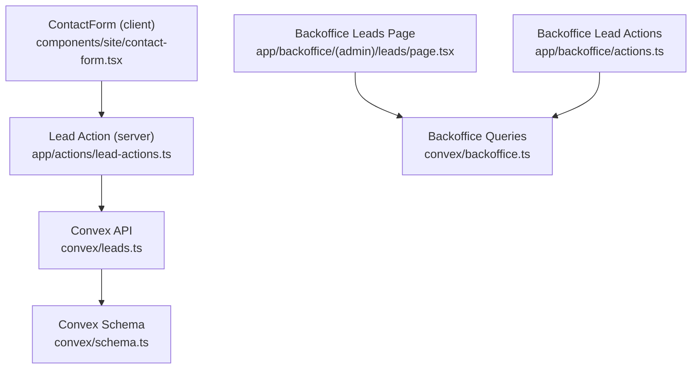
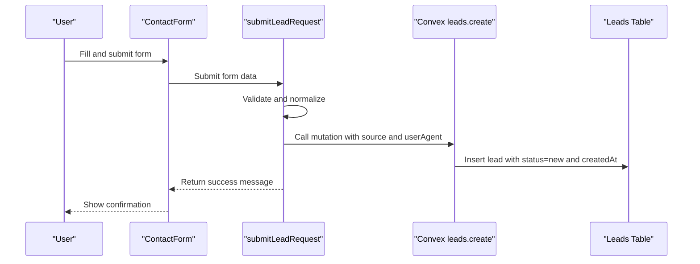
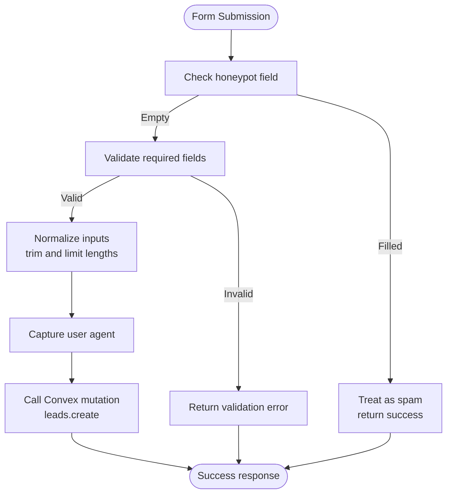
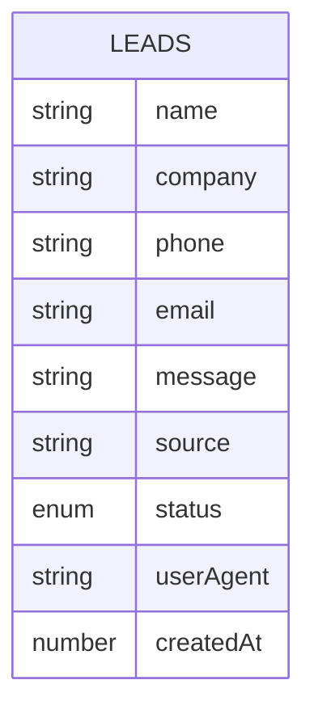
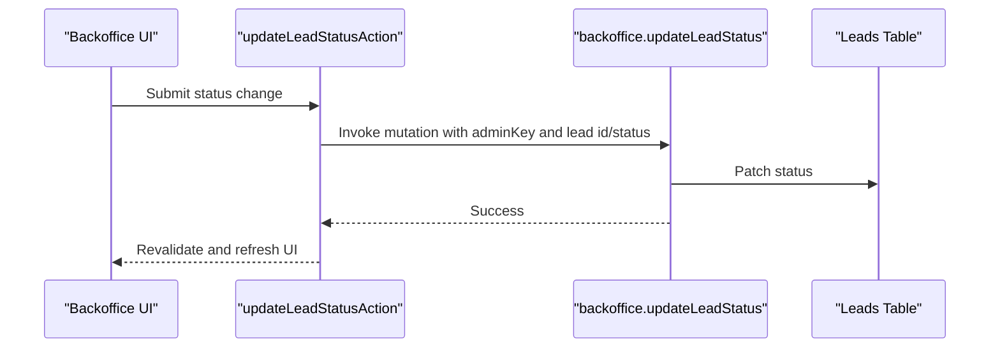
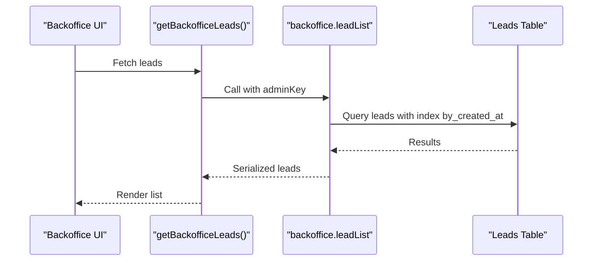
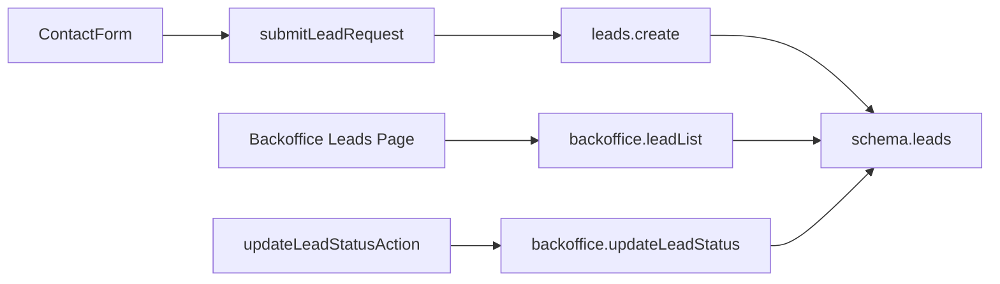

# Lead Analytics & Reporting

<cite>
**Referenced Files in This Document**
- [leads.ts](file://convex/leads.ts)
- [schema.ts](file://convex/schema.ts)
- [backoffice.ts](file://convex/backoffice.ts)
- [lead-actions.ts](file://app/actions/lead-actions.ts)
- [contact-form.tsx](file://components/site/contact-form.tsx)
- [leads-page.tsx](file://app/backoffice/(admin)/leads/page.tsx)
- [backoffice-data.ts](file://lib/backoffice-data.ts)
- [backoffice-actions.ts](file://app/backoffice/actions.ts)
- [BACKOFFICE.md](file://docs/BACKOFFICE.md)
- [CONVEX.md](file://docs/CONVEX.md)
- [SECURITY.md](file://docs/SECURITY.md)
</cite>

## Table of Contents
1. [Introduction](#introduction)
2. [Project Structure](#project-structure)
3. [Core Components](#core-components)
4. [Architecture Overview](#architecture-overview)
5. [Detailed Component Analysis](#detailed-component-analysis)
6. [Dependency Analysis](#dependency-analysis)
7. [Performance Considerations](#performance-considerations)
8. [Troubleshooting Guide](#troubleshooting-guide)
9. [Conclusion](#conclusion)
10. [Appendices](#appendices)

## Introduction
This document describes the lead analytics and reporting capabilities implemented in the project. It focuses on how leads are captured, tracked, and surfaced for internal operations, and outlines the current state of analytics features such as conversion metrics, response times, source attribution, funnel analysis, time-based analytics, geographic and demographic insights, automated reporting, BI integrations, and data privacy considerations. Where functionality is not present, this document clearly indicates gaps and provides guidance for extending the system to support advanced analytics and reporting.

## Project Structure
The lead lifecycle spans the frontend contact form, backend Convex schema and mutations, and the backoffice UI for lead management. The following diagram maps the primary files involved in lead capture and reporting.

**Diagram sources**
- [contact-form.tsx:17-91](file://components/site/contact-form.tsx#L17-L91)
- [lead-actions.ts:32-95](file://app/actions/lead-actions.ts#L32-L95)
- [leads.ts:7-31](file://convex/leads.ts#L7-L31)
- [leads-page.tsx](file://app/backoffice/(admin)/leads/page.tsx#L8-L72)
- [backoffice-actions.ts:119-128](file://app/backoffice/actions.ts#L119-L128)
- [backoffice.ts:120-161](file://convex/backoffice.ts#L120-L161)
- [schema.ts:4-17](file://convex/schema.ts#L4-L17)

**Section sources**
- [contact-form.tsx:17-91](file://components/site/contact-form.tsx#L17-L91)
- [lead-actions.ts:32-95](file://app/actions/lead-actions.ts#L32-L95)
- [leads.ts:7-31](file://convex/leads.ts#L7-L31)
- [leads-page.tsx](file://app/backoffice/(admin)/leads/page.tsx#L8-L72)
- [backoffice-actions.ts:119-128](file://app/backoffice/actions.ts#L119-L128)
- [backoffice.ts:120-161](file://convex/backoffice.ts#L120-L161)
- [schema.ts:4-17](file://convex/schema.ts#L4-L17)

## Core Components
- Lead capture and normalization: The contact form and server action collect, sanitize, and submit lead requests to Convex. The action also captures the request source and optional user agent metadata.
- Convex schema and queries: The leads table stores essential attributes including source and timestamps, with indexes supporting sorting and retrieval.
- Backoffice management: The backoffice exposes a dashboard and lead list, and allows updating lead status to move through stages such as new, contacted, quoted, and archived.
- Status updates: Backoffice actions enable changing lead status and trigger cache revalidation for immediate UI updates.

Current analytics capabilities:
- Lead source attribution: The source field enables basic channel tracking.
- Lead lifecycle stages: Status progression supports simple funnel analysis.
- Timestamps: Creation time is recorded for time-based analysis.

Planned enhancements (not implemented):
- Conversion rate calculation requires closed-won conversions and time windows.
- Response time tracking requires first-contact timestamps.
- Geographic and demographic analysis requires location and persona data.
- Automated reporting and BI export require scheduled jobs and export endpoints.

**Section sources**
- [lead-actions.ts:32-95](file://app/actions/lead-actions.ts#L32-L95)
- [leads.ts:7-31](file://convex/leads.ts#L7-L31)
- [schema.ts:4-17](file://convex/schema.ts#L4-L17)
- [leads-page.tsx](file://app/backoffice/(admin)/leads/page.tsx#L6-L72)
- [backoffice-actions.ts:119-128](file://app/backoffice/actions.ts#L119-L128)
- [backoffice.ts:120-161](file://convex/backoffice.ts#L120-L161)

## Architecture Overview
The lead analytics architecture centers on a clean separation of concerns:
- Frontend: Contact form collects user input and submits via a server action.
- Backend: Convex mutations persist leads and backoffice queries expose aggregated data.
- Internal reporting: Backoffice UI surfaces leads and allows status updates.

**Diagram sources**
- [contact-form.tsx:27-91](file://components/site/contact-form.tsx#L27-L91)
- [lead-actions.ts:32-95](file://app/actions/lead-actions.ts#L32-L95)
- [leads.ts:7-24](file://convex/leads.ts#L7-L24)
- [schema.ts:4-17](file://convex/schema.ts#L4-L17)

## Detailed Component Analysis

### Lead Capture and Normalization
- Input sanitization: Names, phones, emails, and messages are trimmed and normalized to enforce minimum lengths and safe formats.
- Spam protection: A hidden honeypot field prevents bot submissions.
- Source tagging: The form sets a fixed source identifier; the action also accepts a configurable source parameter.
- Metadata capture: The user agent is captured for potential device/channel insights.

**Diagram sources**
- [contact-form.tsx:33-65](file://components/site/contact-form.tsx#L33-L65)
- [lead-actions.ts:32-95](file://app/actions/lead-actions.ts#L32-L95)

**Section sources**
- [contact-form.tsx:33-65](file://components/site/contact-form.tsx#L33-L65)
- [lead-actions.ts:32-95](file://app/actions/lead-actions.ts#L32-L95)

### Convex Schema and Indexes
- Lead entity: Stores name, company, phone, optional email, message, source, status, optional userAgent, and createdAt.
- Indexes: by_status and by_created_at enable efficient filtering and sorting.
- Status enum: Supports new, contacted, quoted, archived.

**Diagram sources**
- [schema.ts:4-17](file://convex/schema.ts#L4-L17)

**Section sources**
- [schema.ts:4-17](file://convex/schema.ts#L4-L17)

### Lead Lifecycle Management
- Recent leads query: Returns the most recent leads ordered by creation time.
- Status update mutation: Changes lead status and triggers cache revalidation in the backoffice.

**Diagram sources**
- [leads-page.tsx](file://app/backoffice/(admin)/leads/page.tsx#L40-L59)
- [backoffice-actions.ts:119-128](file://app/backoffice/actions.ts#L119-L128)
- [backoffice.ts:155-161](file://convex/backoffice.ts#L155-L161)

**Section sources**
- [leads-page.tsx](file://app/backoffice/(admin)/leads/page.tsx#L40-L59)
- [backoffice-actions.ts:119-128](file://app/backoffice/actions.ts#L119-L128)
- [backoffice.ts:155-161](file://convex/backoffice.ts#L155-L161)

### Backoffice Dashboard and Lead Listing
- Dashboard query: Aggregates counts and recent items across leads, media, products, categories, and blog posts.
- Lead list query: Returns recent leads for the backoffice UI.
- Data fetching helpers: Encapsulate Convex query calls with admin API key.

**Diagram sources**
- [leads-page.tsx](file://app/backoffice/(admin)/leads/page.tsx#L8-L9)
- [backoffice-data.ts:14-16](file://lib/backoffice-data.ts#L14-L16)
- [backoffice.ts:147-153](file://convex/backoffice.ts#L147-L153)

**Section sources**
- [leads-page.tsx](file://app/backoffice/(admin)/leads/page.tsx#L8-L9)
- [backoffice-data.ts:14-16](file://lib/backoffice-data.ts#L14-L16)
- [backoffice.ts:147-153](file://convex/backoffice.ts#L147-L153)

## Dependency Analysis
- Frontend-to-backend coupling: The contact form depends on the server action, which depends on Convex APIs.
- Backoffice-to-internal data: The backoffice UI relies on Convex queries and mutations, and on admin session verification.
- Data model: The leads schema defines the canonical structure for analytics.

**Diagram sources**
- [contact-form.tsx:27-91](file://components/site/contact-form.tsx#L27-L91)
- [lead-actions.ts:74-83](file://app/actions/lead-actions.ts#L74-L83)
- [leads.ts:7-24](file://convex/leads.ts#L7-L24)
- [schema.ts:4-17](file://convex/schema.ts#L4-L17)
- [leads-page.tsx](file://app/backoffice/(admin)/leads/page.tsx#L8-L9)
- [backoffice.ts:147-161](file://convex/backoffice.ts#L147-L161)
- [backoffice-actions.ts:119-128](file://app/backoffice/actions.ts#L119-L128)

**Section sources**
- [contact-form.tsx:27-91](file://components/site/contact-form.tsx#L27-L91)
- [lead-actions.ts:74-83](file://app/actions/lead-actions.ts#L74-L83)
- [leads.ts:7-24](file://convex/leads.ts#L7-L24)
- [schema.ts:4-17](file://convex/schema.ts#L4-L17)
- [leads-page.tsx](file://app/backoffice/(admin)/leads/page.tsx#L8-L9)
- [backoffice.ts:147-161](file://convex/backoffice.ts#L147-L161)
- [backoffice-actions.ts:119-128](file://app/backoffice/actions.ts#L119-L128)

## Performance Considerations
- Query limits: The system caps returned items for recent queries to avoid heavy loads.
- Index usage: Sorting by createdAt and filtering by status rely on declared indexes for efficient retrieval.
- Cache revalidation: Status updates trigger targeted revalidation to keep the UI fresh without full reloads.

Recommendations:
- Add pagination for lead lists to scale beyond small datasets.
- Introduce batch operations for bulk status updates.
- Consider materialized summaries for frequently accessed aggregates (e.g., daily counts by source).

**Section sources**
- [leads.ts:5-6](file://convex/leads.ts#L5-L6)
- [schema.ts:16-17](file://convex/schema.ts#L16-L17)
- [backoffice-actions.ts:126-127](file://app/backoffice/actions.ts#L126-L127)

## Troubleshooting Guide
Common issues and resolutions:
- Missing Convex URL: The server action checks for the public Convex URL and returns a helpful error if missing.
- Validation failures: The action enforces minimum lengths and valid email format, returning actionable messages.
- Unauthorized backoffice access: Backoffice queries and mutations check an admin API key and throw errors for invalid keys.
- Status update not reflected: Ensure cache revalidation is triggered after status changes.

Operational tips:
- Verify environment variables for admin key and Convex URL.
- Confirm indexes exist and are aligned with query patterns.
- Test status transitions from new to contacted to quoted to archived.

**Section sources**
- [lead-actions.ts:44-70](file://app/actions/lead-actions.ts#L44-L70)
- [backoffice.ts:25-31](file://convex/backoffice.ts#L25-L31)
- [backoffice-actions.ts:119-128](file://app/backoffice/actions.ts#L119-L128)

## Conclusion
The project provides a solid foundation for lead capture, lifecycle management, and basic reporting within the backoffice. It includes source attribution, status progression, and timestamps—key building blocks for analytics. Advanced capabilities such as conversion rate computation, response time tracking, funnel analysis, time-based trends, geographic/demographic insights, automated reporting, and BI integrations are not currently implemented and would require extending the schema, adding new queries/mutations, and integrating external systems.

## Appendices

### Lead Performance Metrics (Implemented vs. Planned)
- Conversion rates: Not implemented. Requires closed-won conversions and time windows.
- Response times: Not implemented. Requires first-contact timestamps.
- Source attribution: Implemented via the source field; can be extended with UTM parameters and channel grouping.
- Funnel analysis: Implemented via status progression (new → contacted → quoted → archived).
- Time-based analytics: Implemented via createdAt; requires additional aggregation and segmentation.
- Geographic and demographic analysis: Not implemented. Requires location and persona fields.
- Automated reporting: Not implemented. Requires scheduled jobs and export endpoints.
- BI integrations: Not implemented. Requires export endpoints or webhooks.

### Reporting Dashboard Capabilities
- Current: Backoffice dashboard shows recent leads and counts for various content types.
- Enhancements: Add interactive charts, filters by source/status/date range, and export options.

### Data Privacy Considerations
- Minimize stored PII: Only collect necessary fields; avoid storing sensitive data unless required.
- Access control: Admin API key enforcement protects backoffice endpoints.
- Retention policies: Define and enforce data retention for leads and logs.
- Compliance: Align with applicable regulations (e.g., GDPR) for data handling and user consent.

**Section sources**
- [backoffice.ts:120-144](file://convex/backoffice.ts#L120-L144)
- [SECURITY.md](file://docs/SECURITY.md)
- [CONVEX.md](file://docs/CONVEX.md)
- [BACKOFFICE.md](file://docs/BACKOFFICE.md)