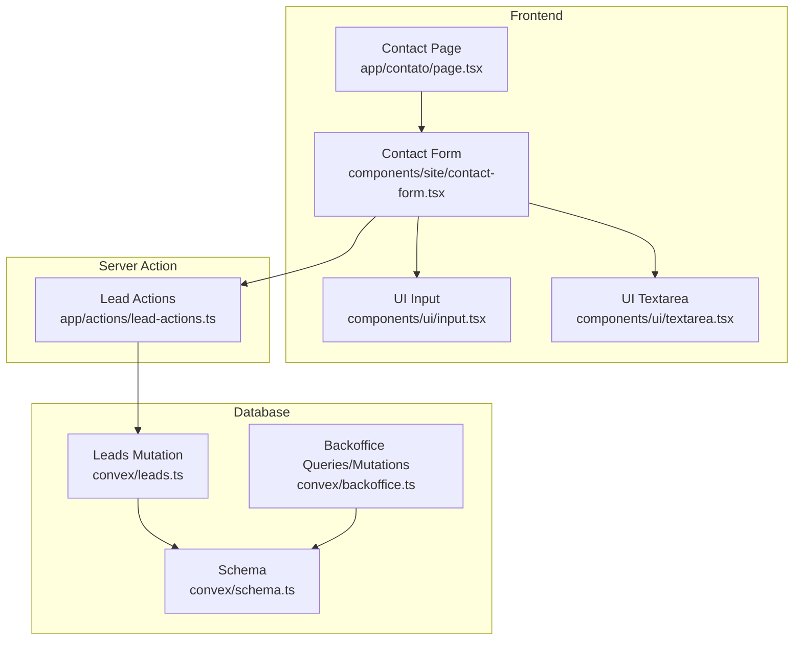
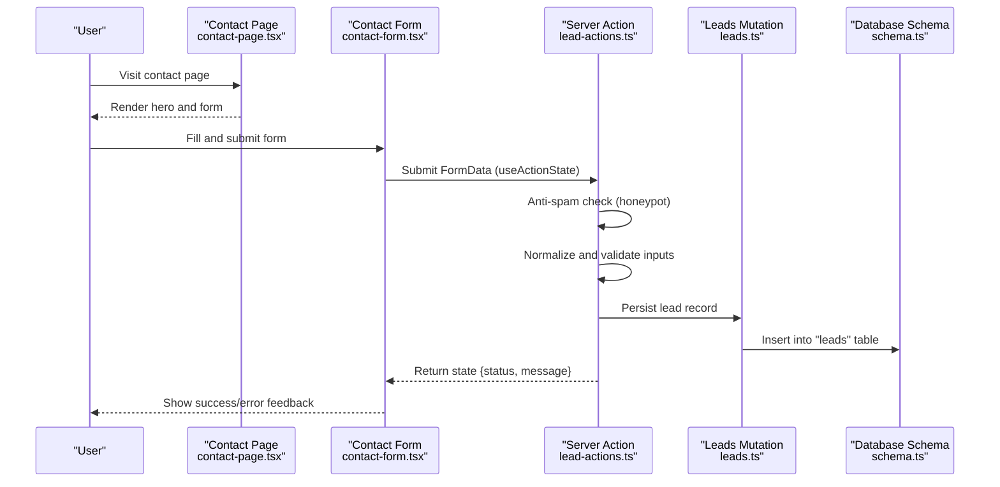
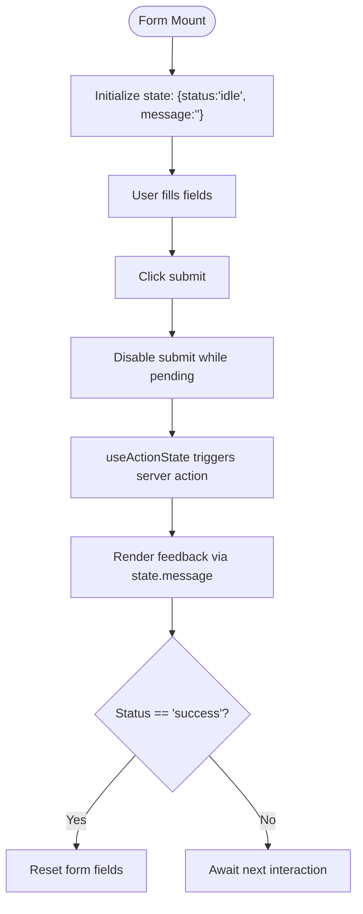
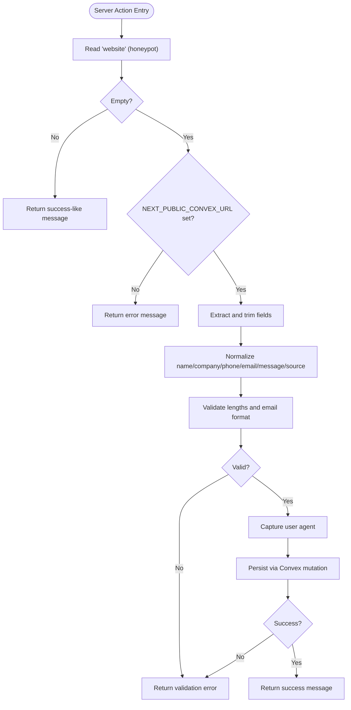
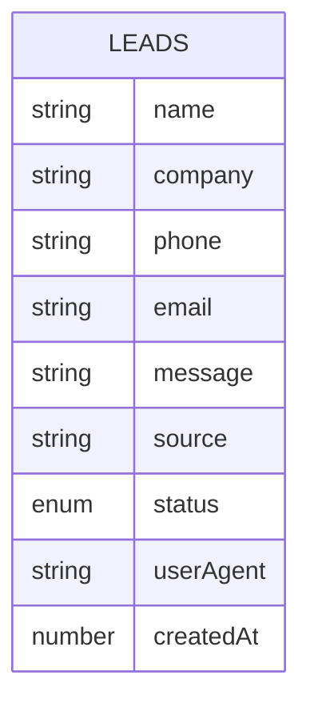
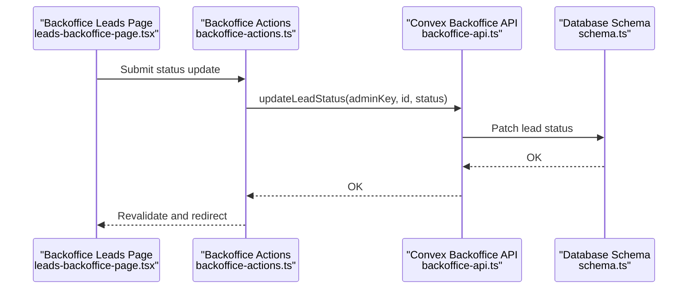
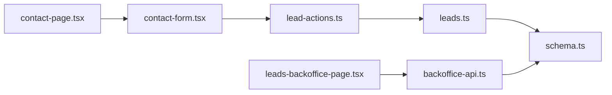

# Lead Capture & Submission Workflow

<cite>
**Referenced Files in This Document**
- [contact-page.tsx](file://app/contato/page.tsx)
- [contact-form.tsx](file://components/site/contact-form.tsx)
- [lead-actions.ts](file://app/actions/lead-actions.ts)
- [leads.ts](file://convex/leads.ts)
- [schema.ts](file://convex/schema.ts)
- [leads-backoffice-page.tsx](file://app/backoffice/(admin)/leads/page.tsx)
- [backoffice-actions.ts](file://app/backoffice/actions.ts)
- [backoffice-api.ts](file://convex/backoffice.ts)
- [input.tsx](file://components/ui/input.tsx)
- [textarea.tsx](file://components/ui/textarea.tsx)
- [site-data.ts](file://lib/site-data.ts)
- [backoffice-data.ts](file://lib/backoffice-data.ts)
</cite>

## Table of Contents
1. [Introduction](#introduction)
2. [Project Structure](#project-structure)
3. [Core Components](#core-components)
4. [Architecture Overview](#architecture-overview)
5. [Detailed Component Analysis](#detailed-component-analysis)
6. [Dependency Analysis](#dependency-analysis)
7. [Performance Considerations](#performance-considerations)
8. [Troubleshooting Guide](#troubleshooting-guide)
9. [Conclusion](#conclusion)

## Introduction
This document describes the end-to-end lead capture and submission workflow for the contact form. It covers the customer journey from initial interaction through form validation, anti-spam protection, data normalization, server-side processing, persistence, and feedback to the user. It also documents the backoffice integration for lead management and status updates.

## Project Structure
The lead capture workflow spans three layers:
- Frontend page and form component
- Server action for form submission
- Convex database schema and mutations for persistence

**Diagram sources**
- [contact-page.tsx:19-104](file://app/contato/page.tsx#L19-L104)
- [contact-form.tsx:17-91](file://components/site/contact-form.tsx#L17-L91)
- [input.tsx:7-19](file://components/ui/input.tsx#L7-L19)
- [textarea.tsx:7-17](file://components/ui/textarea.tsx#L7-L17)
- [lead-actions.ts:32-95](file://app/actions/lead-actions.ts#L32-L95)
- [leads.ts:7-24](file://convex/leads.ts#L7-L24)
- [schema.ts:4-17](file://convex/schema.ts#L4-L17)
- [backoffice-api.ts:147-161](file://convex/backoffice.ts#L147-L161)

**Section sources**
- [contact-page.tsx:19-104](file://app/contato/page.tsx#L19-L104)
- [contact-form.tsx:17-91](file://components/site/contact-form.tsx#L17-L91)
- [lead-actions.ts:32-95](file://app/actions/lead-actions.ts#L32-L95)
- [leads.ts:7-24](file://convex/leads.ts#L7-L24)
- [schema.ts:4-17](file://convex/schema.ts#L4-L17)

## Core Components
- Contact page renders the hero, contact channels, and the contact form.
- Contact form handles user input, client-side UX signals, and submission via a server action.
- Lead actions performs anti-spam checks, sanitizes and normalizes inputs, validates required fields, and persists the lead.
- Convex schema defines the lead entity and indexes; the leads mutation inserts records.
- Backoffice pages and actions enable viewing and updating lead status.

**Section sources**
- [contact-page.tsx:19-104](file://app/contato/page.tsx#L19-L104)
- [contact-form.tsx:17-91](file://components/site/contact-form.tsx#L17-L91)
- [lead-actions.ts:32-95](file://app/actions/lead-actions.ts#L32-L95)
- [leads.ts:7-24](file://convex/leads.ts#L7-L24)
- [schema.ts:4-17](file://convex/schema.ts#L4-L17)
- [leads-backoffice-page.tsx](file://app/backoffice/(admin)/leads/page.tsx#L8-L72)
- [backoffice-actions.ts:119-128](file://app/backoffice/actions.ts#L119-L128)

## Architecture Overview
The workflow integrates Next.js App Router with Convex for data persistence. The form posts to a server action that runs on the server, performs validation and normalization, and writes to the database.

**Diagram sources**
- [contact-page.tsx:19-104](file://app/contato/page.tsx#L19-L104)
- [contact-form.tsx:17-91](file://components/site/contact-form.tsx#L17-L91)
- [lead-actions.ts:32-95](file://app/actions/lead-actions.ts#L32-L95)
- [leads.ts:7-24](file://convex/leads.ts#L7-L24)
- [schema.ts:4-17](file://convex/schema.ts#L4-L17)

## Detailed Component Analysis

### Frontend Contact Form Implementation
- Uses Next.js useActionState to manage submission state and pending status.
- Hidden honeypot field named "website" to detect bots.
- Required fields with client-side constraints: name, phone, message.
- Accessible labels and ARIA live region for feedback.
- Mobile-responsive grid layout for inputs.
- Resets form on successful submission.

**Diagram sources**
- [contact-form.tsx:17-91](file://components/site/contact-form.tsx#L17-L91)

**Section sources**
- [contact-form.tsx:17-91](file://components/site/contact-form.tsx#L17-L91)
- [input.tsx:7-19](file://components/ui/input.tsx#L7-L19)
- [textarea.tsx:7-17](file://components/ui/textarea.tsx#L7-L17)

### Server-Side Lead Processing
- Anti-spam: Checks the hidden "website" field; if present, treats as human-validated and returns a success-like message.
- Environment guard: Requires NEXT_PUBLIC_CONVEX_URL to be set.
- Normalization:
  - Single-line fields: collapses extra whitespace, trims, enforces max length.
  - Email: lowercased, optional.
  - Message: standardizes line breaks, limits repeats, enforces max length.
- Validation:
  - Name minimum length and phone minimum length enforced.
  - Email optional but must be valid if provided.
- Persistence: Inserts lead with computed fields including source and user agent.
- Error handling: Returns structured error messages on misconfiguration or persistence failures.

**Diagram sources**
- [lead-actions.ts:32-95](file://app/actions/lead-actions.ts#L32-L95)
- [leads.ts:7-24](file://convex/leads.ts#L7-L24)
- [schema.ts:4-17](file://convex/schema.ts#L4-L17)

**Section sources**
- [lead-actions.ts:32-95](file://app/actions/lead-actions.ts#L32-L95)

### Data Model and Persistence
- Lead entity includes name, company, phone, email, message, source, status, userAgent, and createdAt.
- Indexes support status and creation-time queries.
- Mutation inserts a new lead with status initialized to "new".

**Diagram sources**
- [schema.ts:4-17](file://convex/schema.ts#L4-L17)
- [leads.ts:7-24](file://convex/leads.ts#L7-L24)

**Section sources**
- [schema.ts:4-17](file://convex/schema.ts#L4-L17)
- [leads.ts:7-24](file://convex/leads.ts#L7-L24)

### Backoffice Integration
- Backoffice page lists recent leads with status and metadata.
- Status update mutation allows changing lead status.
- Data fetching uses Convex queries guarded by admin key.

**Diagram sources**
- [leads-backoffice-page.tsx](file://app/backoffice/(admin)/leads/page.tsx#L8-L72)
- [backoffice-actions.ts:119-128](file://app/backoffice/actions.ts#L119-L128)
- [backoffice-api.ts:155-161](file://convex/backoffice.ts#L155-L161)
- [schema.ts:4-17](file://convex/schema.ts#L4-L17)

**Section sources**
- [leads-backoffice-page.tsx](file://app/backoffice/(admin)/leads/page.tsx#L8-L72)
- [backoffice-actions.ts:119-128](file://app/backoffice/actions.ts#L119-L128)
- [backoffice-api.ts:147-161](file://convex/backoffice.ts#L147-L161)
- [backoffice-data.ts:14-16](file://lib/backoffice-data.ts#L14-L16)

### Accessibility and Mobile Responsiveness
- Accessible labels and semantic markup for inputs.
- Hidden honeypot field with aria-hidden and off-screen tabindex to avoid screen reader confusion.
- ARIA live region for dynamic feedback.
- Responsive grid layout for form fields on small screens.
- Clear visual feedback colors for success and error states.

**Section sources**
- [contact-form.tsx:34-37](file://components/site/contact-form.tsx#L34-L37)
- [contact-form.tsx:77-88](file://components/site/contact-form.tsx#L77-L88)
- [contact-form.tsx:38-65](file://components/site/contact-form.tsx#L38-L65)

## Dependency Analysis
- The contact page depends on the contact form component.
- The contact form depends on UI primitives and the server action.
- The server action depends on Convex APIs and the leads mutation.
- The leads mutation depends on the schema definition.
- The backoffice pages depend on Convex queries and backoffice mutations.

**Diagram sources**
- [contact-page.tsx:19-104](file://app/contato/page.tsx#L19-L104)
- [contact-form.tsx:17-91](file://components/site/contact-form.tsx#L17-L91)
- [lead-actions.ts:32-95](file://app/actions/lead-actions.ts#L32-L95)
- [leads.ts:7-24](file://convex/leads.ts#L7-L24)
- [schema.ts:4-17](file://convex/schema.ts#L4-L17)
- [leads-backoffice-page.tsx](file://app/backoffice/(admin)/leads/page.tsx#L8-L72)
- [backoffice-api.ts:147-161](file://convex/backoffice.ts#L147-L161)

**Section sources**
- [contact-page.tsx:19-104](file://app/contato/page.tsx#L19-L104)
- [contact-form.tsx:17-91](file://components/site/contact-form.tsx#L17-L91)
- [lead-actions.ts:32-95](file://app/actions/lead-actions.ts#L32-L95)
- [leads.ts:7-24](file://convex/leads.ts#L7-L24)
- [schema.ts:4-17](file://convex/schema.ts#L4-L17)
- [leads-backoffice-page.tsx](file://app/backoffice/(admin)/leads/page.tsx#L8-L72)
- [backoffice-api.ts:147-161](file://convex/backoffice.ts#L147-L161)

## Performance Considerations
- Client-side reset after success reduces redundant DOM updates.
- Minimal normalization avoids heavy CPU work on the server.
- Indexes on status and createdAt optimize backoffice queries.
- Using Convex mutations ensures efficient serverless persistence.

## Troubleshooting Guide
- Environment configuration: If the environment variable for Convex is missing, the action returns an error state. Verify the environment variable is configured.
- Anti-spam: If the hidden field is filled, the action treats it as a bot and returns a success-like message. Ensure the honeypot remains hidden and unselected.
- Validation errors: If required fields are too short or email is invalid, the action returns an error state with a descriptive message.
- Persistence failures: If the database write fails, the action returns an error state advising retry or alternative contact method.
- Backoffice access: Unauthorized requests to backoffice endpoints are rejected; ensure the admin key is configured.

**Section sources**
- [lead-actions.ts:44-49](file://app/actions/lead-actions.ts#L44-L49)
- [lead-actions.ts:37-42](file://app/actions/lead-actions.ts#L37-L42)
- [lead-actions.ts:58-70](file://app/actions/lead-actions.ts#L58-L70)
- [lead-actions.ts:89-94](file://app/actions/lead-actions.ts#L89-L94)
- [backoffice-api.ts:25-31](file://convex/backoffice.ts#L25-L31)

## Conclusion
The lead capture workflow combines a clean, accessible frontend form with robust server-side validation and normalization, a honeypot anti-spam technique, and reliable persistence via Convex. The backoffice integration enables efficient lead management and status tracking, completing the full customer journey from inquiry to internal follow-up.