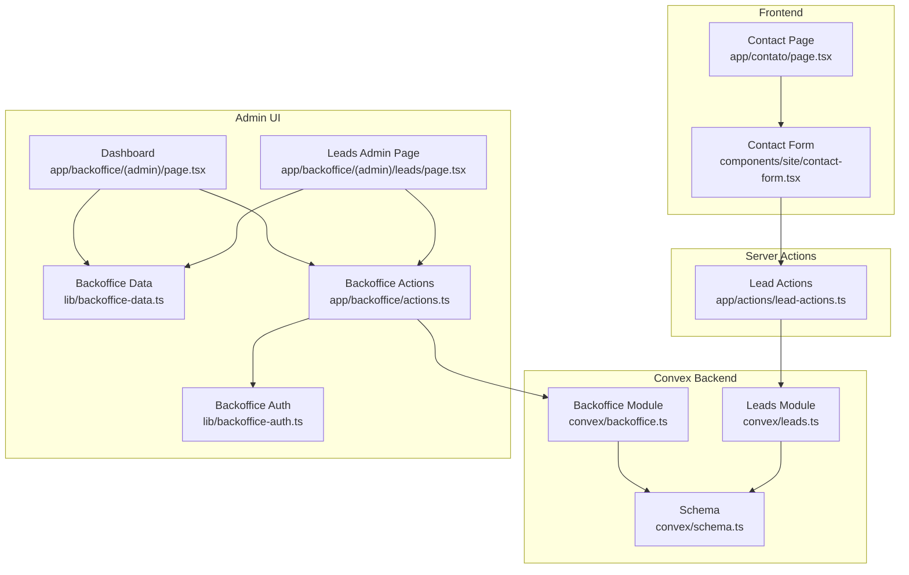
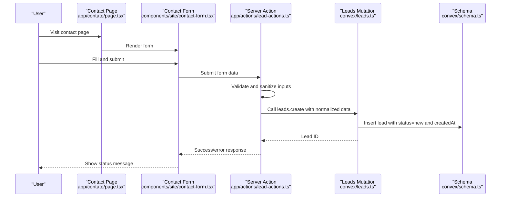
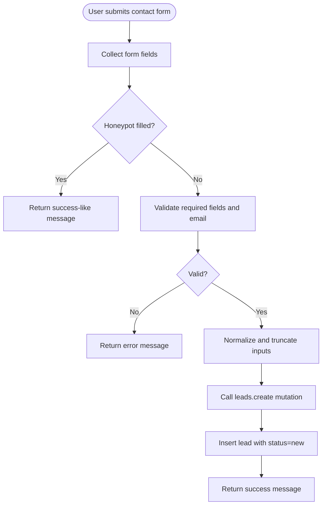
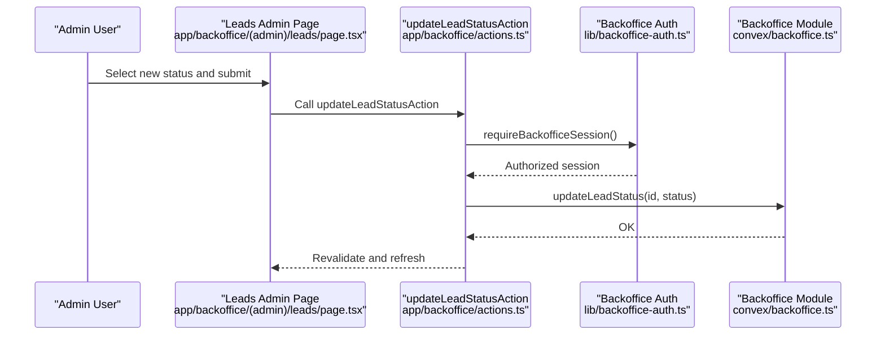
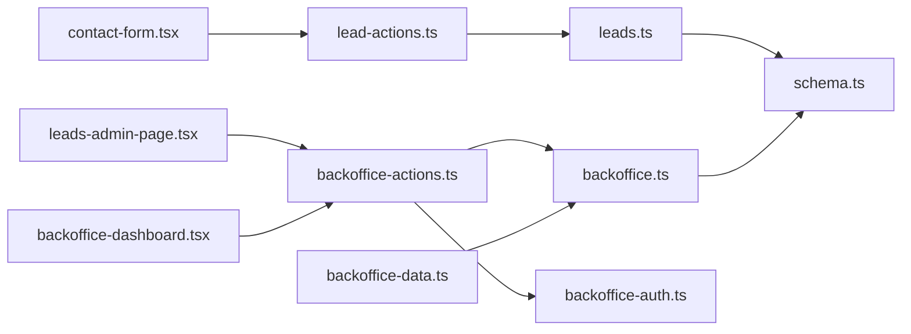
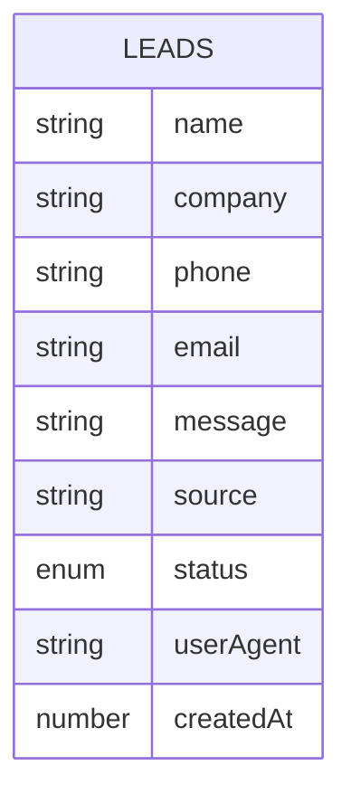

# Lead Management System

<cite>
**Referenced Files in This Document**
- [lead-actions.ts](file://app/actions/lead-actions.ts)
- [contact-form.tsx](file://components/site/contact-form.tsx)
- [leads.ts](file://convex/leads.ts)
- [schema.ts](file://convex/schema.ts)
- [page.tsx](file://app/contato/page.tsx)
- [leads-admin-page.tsx](file://app/backoffice/(admin)/leads/page.tsx)
- [backoffice-dashboard.tsx](file://app/backoffice/(admin)/page.tsx)
- [backoffice-data.ts](file://lib/backoffice-data.ts)
- [backoffice-actions.ts](file://app/backoffice/actions.ts)
- [backoffice-auth.ts](file://lib/backoffice-auth.ts)
- [backoffice.ts](file://convex/backoffice.ts)
- [BACKOFFICE.md](file://docs/BACKOFFICE.md)
- [CONVEX.md](file://docs/CONVEX.md)
- [SECURITY.md](file://docs/SECURITY.md)
</cite>

## Table of Contents
1. [Introduction](#introduction)
2. [Project Structure](#project-structure)
3. [Core Components](#core-components)
4. [Architecture Overview](#architecture-overview)
5. [Detailed Component Analysis](#detailed-component-analysis)
6. [Dependency Analysis](#dependency-analysis)
7. [Performance Considerations](#performance-considerations)
8. [Troubleshooting Guide](#troubleshooting-guide)
9. [Conclusion](#conclusion)
10. [Appendices](#appendices)

## Introduction
This document describes the lead management system that captures customer inquiries from the contact form, validates and sanitizes submissions, stores them securely, and exposes administrative tools for status management and reporting. It covers the end-to-end workflow from frontend submission to backend processing and database storage, along with security, privacy, and operational guidance.

## Project Structure
The lead management system spans three primary areas:
- Frontend contact form and page
- Server actions for form submission and validation
- Convex backend for schema, queries, mutations, and admin integrations

**Diagram sources**
- [contact-form.tsx:17-91](file://components/site/contact-form.tsx#L17-L91)
- [page.tsx:19-104](file://app/contato/page.tsx#L19-L104)
- [lead-actions.ts:32-95](file://app/actions/lead-actions.ts#L32-L95)
- [leads.ts:7-31](file://convex/leads.ts#L7-L31)
- [schema.ts:4-17](file://convex/schema.ts#L4-L17)
- [backoffice.ts:147-161](file://convex/backoffice.ts#L147-L161)
- [leads-admin-page.tsx](file://app/backoffice/(admin)/leads/page.tsx#L8-L72)
- [backoffice-dashboard.tsx](file://app/backoffice/(admin)/page.tsx#L25-L86)
- [backoffice-data.ts:14-16](file://lib/backoffice-data.ts#L14-L16)
- [backoffice-auth.ts:110-118](file://lib/backoffice-auth.ts#L110-L118)
- [backoffice-actions.ts:119-128](file://app/backoffice/actions.ts#L119-L128)

**Section sources**
- [contact-form.tsx:17-91](file://components/site/contact-form.tsx#L17-L91)
- [page.tsx:19-104](file://app/contato/page.tsx#L19-L104)
- [lead-actions.ts:32-95](file://app/actions/lead-actions.ts#L32-L95)
- [leads.ts:7-31](file://convex/leads.ts#L7-L31)
- [schema.ts:4-17](file://convex/schema.ts#L4-L17)
- [backoffice.ts:147-161](file://convex/backoffice.ts#L147-L161)
- [leads-admin-page.tsx](file://app/backoffice/(admin)/leads/page.tsx#L8-L72)
- [backoffice-dashboard.tsx](file://app/backoffice/(admin)/page.tsx#L25-L86)
- [backoffice-data.ts:14-16](file://lib/backoffice-data.ts#L14-L16)
- [backoffice-auth.ts:110-118](file://lib/backoffice-auth.ts#L110-L118)
- [backoffice-actions.ts:119-128](file://app/backoffice/actions.ts#L119-L128)

## Core Components
- Contact form and page: Collects customer information and triggers server-side submission.
- Server action: Validates, sanitizes, and submits lead data to Convex.
- Convex schema and leads module: Defines lead data model and persistence logic.
- Backoffice admin pages: Display leads, update status, and manage content.
- Backoffice authentication and actions: Secure admin operations and session management.
- Documentation: Operational and security guidance for deployment and maintenance.

**Section sources**
- [contact-form.tsx:17-91](file://components/site/contact-form.tsx#L17-L91)
- [lead-actions.ts:32-95](file://app/actions/lead-actions.ts#L32-L95)
- [schema.ts:4-17](file://convex/schema.ts#L4-L17)
- [leads.ts:7-31](file://convex/leads.ts#L7-L31)
- [leads-admin-page.tsx](file://app/backoffice/(admin)/leads/page.tsx#L8-L72)
- [backoffice-actions.ts:119-128](file://app/backoffice/actions.ts#L119-L128)
- [backoffice-auth.ts:110-118](file://lib/backoffice-auth.ts#L110-L118)
- [CONVEX.md:1-59](file://docs/CONVEX.md#L1-L59)

## Architecture Overview
The system follows a clean separation of concerns:
- Frontend renders the contact form and handles user feedback.
- Server actions enforce validation and sanitize inputs before persisting.
- Convex stores leads with typed schema and indexes for efficient retrieval.
- Admin UI surfaces leads and allows status updates with session-protected actions.

**Diagram sources**
- [page.tsx:19-104](file://app/contato/page.tsx#L19-L104)
- [contact-form.tsx:17-91](file://components/site/contact-form.tsx#L17-L91)
- [lead-actions.ts:32-95](file://app/actions/lead-actions.ts#L32-L95)
- [leads.ts:7-24](file://convex/leads.ts#L7-L24)
- [schema.ts:4-17](file://convex/schema.ts#L4-L17)

## Detailed Component Analysis

### Contact Form Submission Workflow
- The contact page embeds the contact form and passes public content for presentation.
- The form uses a server action to handle submission, preventing client-side JavaScript from bypassing validation.
- Hidden honeypot field helps detect and block simple spam bots.
- On success, the form resets and displays a confirmation message.

**Diagram sources**
- [contact-form.tsx:17-91](file://components/site/contact-form.tsx#L17-L91)
- [lead-actions.ts:32-95](file://app/actions/lead-actions.ts#L32-L95)
- [leads.ts:7-24](file://convex/leads.ts#L7-L24)

**Section sources**
- [page.tsx:19-104](file://app/contato/page.tsx#L19-L104)
- [contact-form.tsx:17-91](file://components/site/contact-form.tsx#L17-L91)
- [lead-actions.ts:32-95](file://app/actions/lead-actions.ts#L32-L95)

### Lead Validation and Sanitization
- Input normalization:
  - Single-line fields are collapsed whitespace and truncated to safe lengths.
  - Message is normalized for line breaks and capped at a maximum length.
  - Email is lowercased for consistency.
- Required fields:
  - Name, phone, and message must meet minimum length thresholds.
- Email validation:
  - A basic regex ensures a syntactically valid email when present.
- Spam protection:
  - Honeypot field silently blocks automated submissions.
- Environment guard:
  - Submission aborts early if Convex URL is not configured.

**Section sources**
- [lead-actions.ts:15-30](file://app/actions/lead-actions.ts#L15-L30)
- [lead-actions.ts:58-70](file://app/actions/lead-actions.ts#L58-L70)
- [lead-actions.ts:35-42](file://app/actions/lead-actions.ts#L35-L42)

### Lead Persistence and Schema
- Schema enforces:
  - Required fields: name, phone, message, source, createdAt.
  - Optional fields: company, email, userAgent.
  - Status enum restricted to predefined values.
  - Indexes on status and creation time for fast queries.
- Leads module:
  - Mutation inserts new leads with status initialized to "new".
  - Query retrieves recent leads ordered by creation time.

**Section sources**
- [schema.ts:4-17](file://convex/schema.ts#L4-L17)
- [leads.ts:7-24](file://convex/leads.ts#L7-L24)
- [leads.ts:26-31](file://convex/leads.ts#L26-L31)

### Administrative Lead Management
- Admin dashboard and leads page:
  - Display recent leads with name, company/phone/email, message preview, timestamp, and source.
  - Allow updating status via a dropdown with options: new, contacted, quoted, archived.
- Backoffice data and actions:
  - Queries use an admin key for authorization.
  - Status updates are performed through a protected mutation requiring a valid session.
- Authentication:
  - Admin sessions are HttpOnly cookies with HMAC signatures and expiration checks.
  - Admin key is required for all protected Convex functions.

**Diagram sources**
- [leads-admin-page.tsx](file://app/backoffice/(admin)/leads/page.tsx#L40-L59)
- [backoffice-actions.ts:119-128](file://app/backoffice/actions.ts#L119-L128)
- [backoffice-auth.ts:110-118](file://lib/backoffice-auth.ts#L110-L118)
- [backoffice.ts:155-161](file://convex/backoffice.ts#L155-L161)

**Section sources**
- [leads-admin-page.tsx](file://app/backoffice/(admin)/leads/page.tsx#L8-L72)
- [backoffice-dashboard.tsx](file://app/backoffice/(admin)/page.tsx#L25-L86)
- [backoffice-data.ts:14-16](file://lib/backoffice-data.ts#L14-L16)
- [backoffice-actions.ts:119-128](file://app/backoffice/actions.ts#L119-L128)
- [backoffice-auth.ts:110-118](file://lib/backoffice-auth.ts#L110-L118)
- [backoffice.ts:155-161](file://convex/backoffice.ts#L155-L161)

### Notification Systems and Workflows
- The current implementation does not include built-in notification systems for lead alerts or follow-ups.
- Administrators can manually update lead status through the admin UI, enabling internal workflows.
- Integration with external systems (e.g., email, CRM) would require extending the status update mutation and adding outbound hooks.

[No sources needed since this section provides general guidance]

### Lead Analytics and Reporting
- The system exposes recent leads and a dashboard query returning counts for leads and other content types.
- There is no built-in analytics dashboard for conversion rates or acquisition metrics.
- Future enhancements could include:
  - Aggregation queries for status distributions and time-based conversions.
  - Export endpoints for lead lists filtered by date range and status.

**Section sources**
- [backoffice.ts:120-144](file://convex/backoffice.ts#L120-L144)
- [leads.ts:26-31](file://convex/leads.ts#L26-L31)

### Lead Scoring and Qualification
- The schema supports a status field with four states: new, contacted, quoted, archived.
- Scoring and qualification logic are not implemented in the current codebase.
- To integrate with sales teams:
  - Extend the status transitions with additional qualifiers (e.g., intent level, deal size).
  - Add computed fields or derived metrics via Convex queries.

**Section sources**
- [schema.ts:12-12](file://convex/schema.ts#L12-L12)
- [leads-admin-page.tsx](file://app/backoffice/(admin)/leads/page.tsx#L6-L6)

### Data Privacy and Compliance
- The system avoids collecting sensitive data and does not implement user accounts or payment flows.
- Security hardening is documented for the broader site, including CSP, HSTS, and safe defaults.
- For GDPR alignment:
  - Minimize data retention by archiving old leads.
  - Provide mechanisms for data deletion upon request.
  - Ensure secure transport and storage of personal data.

**Section sources**
- [SECURITY.md:1-29](file://docs/SECURITY.md#L1-L29)
- [schema.ts:4-17](file://convex/schema.ts#L4-L17)

## Dependency Analysis
The following diagram shows key dependencies among components involved in lead processing and administration.

**Diagram sources**
- [contact-form.tsx:17-91](file://components/site/contact-form.tsx#L17-L91)
- [lead-actions.ts:32-95](file://app/actions/lead-actions.ts#L32-L95)
- [leads.ts:7-31](file://convex/leads.ts#L7-L31)
- [schema.ts:4-17](file://convex/schema.ts#L4-L17)
- [leads-admin-page.tsx](file://app/backoffice/(admin)/leads/page.tsx#L8-L72)
- [backoffice-dashboard.tsx](file://app/backoffice/(admin)/page.tsx#L25-L86)
- [backoffice-actions.ts:119-128](file://app/backoffice/actions.ts#L119-L128)
- [backoffice-auth.ts:110-118](file://lib/backoffice-auth.ts#L110-L118)
- [backoffice.ts:147-161](file://convex/backoffice.ts#L147-L161)
- [backoffice-data.ts:14-16](file://lib/backoffice-data.ts#L14-L16)

**Section sources**
- [CONVEX.md:1-59](file://docs/CONVEX.md#L1-L59)
- [BACKOFFICE.md:1-37](file://docs/BACKOFFICE.md#L1-L37)

## Performance Considerations
- Input normalization and truncation reduce storage overhead and improve query performance.
- Convex indexes on status and creation time enable efficient filtering and sorting.
- Batch operations in admin UI can be extended to minimize repeated network calls.
- Consider pagination for large lead lists and limit the number of returned items per query.

[No sources needed since this section provides general guidance]

## Troubleshooting Guide
Common issues and resolutions:
- Convex URL not configured:
  - Symptom: Submission returns an environment error.
  - Resolution: Set the required environment variable and redeploy.
- Invalid email format:
  - Symptom: Submission fails validation for email.
  - Resolution: Ensure the email matches a valid pattern or leave the field blank.
- Missing required fields:
  - Symptom: Submission fails if name, phone, or message are too short.
  - Resolution: Ensure all required fields meet minimum length requirements.
- Spam form submissions:
  - Symptom: Automatic success response without storing data.
  - Resolution: Honeypot indicates bot activity; no data was persisted.
- Admin session errors:
  - Symptom: Redirect to login or unauthorized responses.
  - Resolution: Verify session cookie validity and admin key configuration.

**Section sources**
- [lead-actions.ts:44-49](file://app/actions/lead-actions.ts#L44-L49)
- [lead-actions.ts:58-70](file://app/actions/lead-actions.ts#L58-L70)
- [lead-actions.ts:35-42](file://app/actions/lead-actions.ts#L35-L42)
- [backoffice-auth.ts:110-118](file://lib/backoffice-auth.ts#L110-L118)
- [backoffice-actions.ts:119-128](file://app/backoffice/actions.ts#L119-L128)

## Conclusion
The lead management system provides a secure, minimal, and extensible foundation for capturing customer inquiries, validating submissions, and managing leads through an admin interface. Its design leverages server actions for safety, Convex for schema enforcement and indexing, and a protected admin workflow for status management. Future enhancements can include notifications, analytics, scoring, and integration with external systems.

## Appendices

### Lead Data Model

**Diagram sources**
- [schema.ts:4-17](file://convex/schema.ts#L4-L17)

### Admin Credentials and Environment
- Admin login requires a session cookie and an admin key for protected operations.
- Environment variables include Convex URL and admin secrets.

**Section sources**
- [BACKOFFICE.md:13-37](file://docs/BACKOFFICE.md#L13-L37)
- [CONVEX.md:16-32](file://docs/CONVEX.md#L16-L32)
- [backoffice-auth.ts:110-118](file://lib/backoffice-auth.ts#L110-L118)
- [backoffice-actions.ts:119-128](file://app/backoffice/actions.ts#L119-L128)