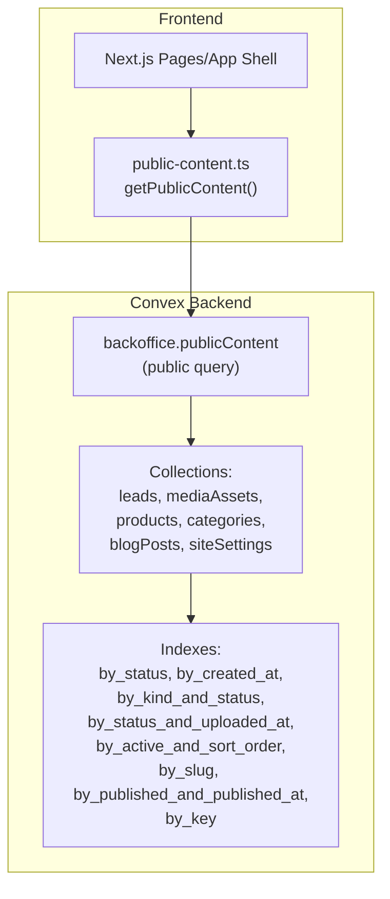
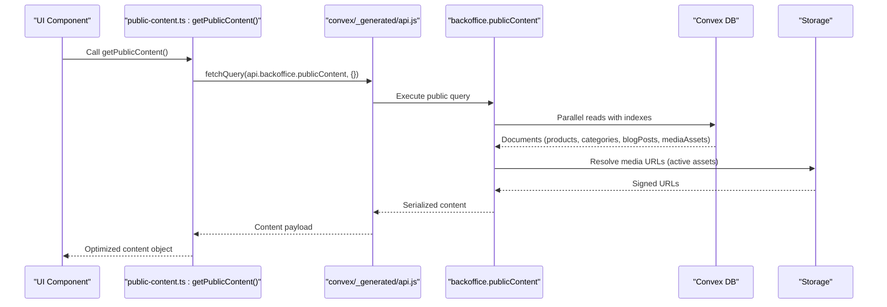
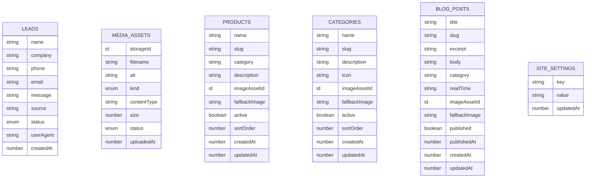
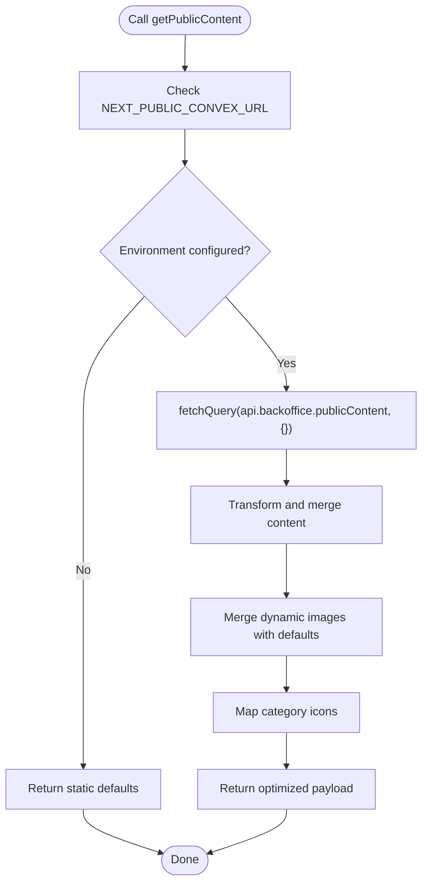
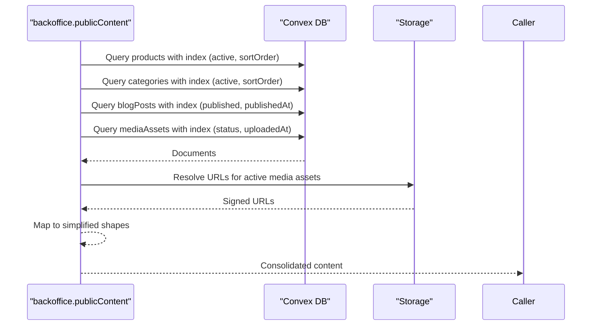
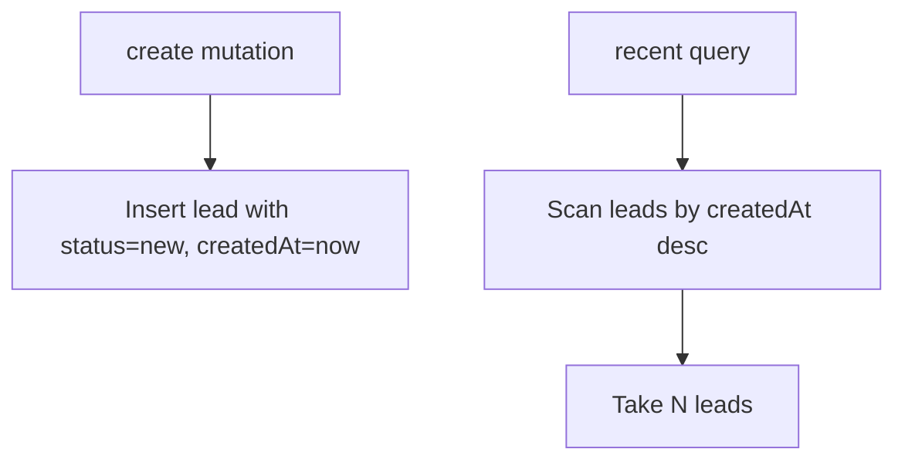
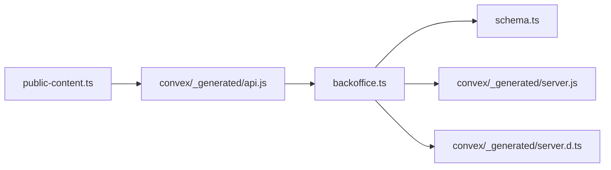

# Database Query & Schema Optimization

<cite>
**Referenced Files in This Document**
- [schema.ts](file://convex/schema.ts)
- [backoffice.ts](file://convex/backoffice.ts)
- [leads.ts](file://convex/leads.ts)
- [public-content.ts](file://lib/public-content.ts)
- [site-data.ts](file://lib/site-data.ts)
- [CONVEX.md](file://docs/CONVEX.md)
- [api.js](file://convex/_generated/api.js)
- [server.js](file://convex/_generated/server.js)
- [server.d.ts](file://convex/_generated/server.d.ts)
</cite>

## Table of Contents
1. [Introduction](#introduction)
2. [Project Structure](#project-structure)
3. [Core Components](#core-components)
4. [Architecture Overview](#architecture-overview)
5. [Detailed Component Analysis](#detailed-component-analysis)
6. [Dependency Analysis](#dependency-analysis)
7. [Performance Considerations](#performance-considerations)
8. [Troubleshooting Guide](#troubleshooting-guide)
9. [Conclusion](#conclusion)

## Introduction
This document provides comprehensive guidance on database query and schema optimization for the Convex backend services powering the ADIKI ALVANIR Angola website. It focuses on schema design patterns, indexing strategies, query optimization techniques, and the efficient implementation of public content retrieval. It also covers batching strategies, denormalization trade-offs, server action usage, and performance monitoring approaches tailored to the current codebase.

## Project Structure
The project integrates Convex for managing leads, media assets, products, categories, blog posts, and site settings. Frontend components consume a public read-only content query that aggregates data from multiple collections. The backend exposes protected admin mutations and queries, plus a public read-only function for site content.

**Diagram sources**
- [public-content.ts:65-106](file://lib/public-content.ts#L65-L106)
- [backoffice.ts:319-384](file://convex/backoffice.ts#L319-L384)
- [schema.ts:4-86](file://convex/schema.ts#L4-L86)

**Section sources**
- [CONVEX.md:1-59](file://docs/CONVEX.md#L1-L59)
- [schema.ts:1-87](file://convex/schema.ts#L1-L87)
- [backoffice.ts:1-385](file://convex/backoffice.ts#L1-L385)
- [public-content.ts:1-107](file://lib/public-content.ts#L1-L107)

## Core Components
- Schema definition: Defines six collections with explicit indexes enabling efficient filtering and sorting.
- Public content query: Aggregates products, categories, blog posts, and media assets for public consumption.
- Lead management: Exposes creation and recent retrieval functions with appropriate indexes.
- Media handling: Serializes storage URLs and manages active/inactive assets.

Key implementation highlights:
- Index usage: Queries leverage specific indexes to avoid full scans.
- Batching: Uses Promise.all to parallelize multiple reads.
- Denormalization: Public content returns slugs as IDs for product entries to simplify frontend routing.
- Fallbacks: Provides fallback images when media assets are missing.

**Section sources**
- [schema.ts:4-86](file://convex/schema.ts#L4-L86)
- [backoffice.ts:319-384](file://convex/backoffice.ts#L319-L384)
- [leads.ts:1-32](file://convex/leads.ts#L1-L32)
- [public-content.ts:65-106](file://lib/public-content.ts#L65-L106)

## Architecture Overview
The public content pipeline follows a clean separation of concerns:
- Frontend calls a public Convex query via a typed API reference.
- The query performs parallel reads across multiple collections using targeted indexes.
- Media assets are serialized to include public URLs.
- The result is transformed into a simplified shape suitable for the UI.

**Diagram sources**
- [public-content.ts:71](file://lib/public-content.ts#L71)
- [api.js:21](file://convex/_generated/api.js#L21)
- [backoffice.ts:319-384](file://convex/backoffice.ts#L319-L384)

## Detailed Component Analysis

### Schema Design Patterns
The schema defines six collections with carefully chosen indexes to support common queries:
- Leads: Status and creation-time indexing enable filtering and chronological ordering.
- Media Assets: Composite indexes on kind/status and status/uploadedAt enable efficient filtering and pagination.
- Products/Categories: Active flag combined with sort order enables fast retrieval of published items ordered by priority.
- Blog Posts: Published flag and publication timestamp enable chronological listing of published content.
- Site Settings: Key-based indexing supports quick lookups by setting key.

**Diagram sources**
- [schema.ts:4-86](file://convex/schema.ts#L4-L86)

**Section sources**
- [schema.ts:4-86](file://convex/schema.ts#L4-L86)

### Indexing Strategies
- Leads: Index by status and createdAt to support filtering and chronological ordering.
- Media Assets: Composite indexes by (kind, status) and (status, uploadedAt) for efficient filtering and pagination.
- Products/Categories: Composite indexes by (active, sortOrder) and slug for active item retrieval and slug lookups.
- Blog Posts: Composite indexes by (published, publishedAt) and slug for published listing and slug lookups.
- Site Settings: Index by key for fast key-based lookups.

Trade-offs:
- Write overhead: Additional indexes increase write latency and storage.
- Read performance: Significant improvement for targeted queries and sorted lists.
- Maintenance cost: Index updates occur with writes; ensure minimal unnecessary writes.

**Section sources**
- [schema.ts:15-17](file://convex/schema.ts#L15-L17)
- [schema.ts:34-36](file://convex/schema.ts#L34-L36)
- [schema.ts:48-50](file://convex/schema.ts#L48-L50)
- [schema.ts:62-64](file://convex/schema.ts#L62-L64)
- [schema.ts:78-80](file://convex/schema.ts#L78-L80)
- [schema.ts:84-85](file://convex/schema.ts#L84-L85)

### getPublicContent Function Implementation
The getPublicContent function orchestrates a single round-trip to the public content query, returning a consolidated payload for the UI.

Key patterns:
- Single query invocation via typed API reference.
- Fallback image resolution: Uses fallback images when media assets are missing.
- Icon mapping: Maps category icons to UI components.
- Defensive fallbacks: Returns static defaults if the backend is unavailable.

**Diagram sources**
- [public-content.ts:65-106](file://lib/public-content.ts#L65-L106)

**Section sources**
- [public-content.ts:65-106](file://lib/public-content.ts#L65-L106)
- [api.js:21](file://convex/_generated/api.js#L21)

### Public Content Query (backoffice.publicContent)
The public content query performs parallel reads across four collections using targeted indexes and returns a simplified structure for the UI.

Optimization techniques:
- Parallel reads: Promise.all batches multiple reads to minimize total latency.
- Index usage: Queries specify indexes to avoid full scans and leverage composite indexes.
- Media URL resolution: Serializes media assets to include signed URLs for active assets.
- Sorting and limits: Applies order and take to ensure predictable, bounded results.

**Diagram sources**
- [backoffice.ts:319-384](file://convex/backoffice.ts#L319-L384)

**Section sources**
- [backoffice.ts:319-384](file://convex/backoffice.ts#L319-L384)

### Lead Management Functions
- Creation mutation inserts a new lead with a default status and timestamp.
- Recent query retrieves the latest leads using the createdAt index with a reasonable limit.

**Diagram sources**
- [leads.ts:7-24](file://convex/leads.ts#L7-L24)
- [leads.ts:26-31](file://convex/leads.ts#L26-L31)

**Section sources**
- [leads.ts:1-32](file://convex/leads.ts#L1-L32)

### Media Asset Serialization
The backend serializes media assets by attaching signed URLs from Convex Storage. This ensures secure, time-limited access to media while keeping the public content query read-only.

Patterns:
- Conditional attachment: Only attaches URLs for active assets.
- URL resolution: Uses storage URL generation for each asset.

**Section sources**
- [backoffice.ts:33-52](file://convex/backoffice.ts#L33-L52)

## Dependency Analysis
The public content retrieval depends on:
- Typed API reference for the public query.
- Generated server utilities for query/mutation builders.
- Collection schemas and indexes for efficient reads.

**Diagram sources**
- [public-content.ts:13-14](file://lib/public-content.ts#L13-L14)
- [api.js:21](file://convex/_generated/api.js#L21)
- [backoffice.ts:1-6](file://convex/backoffice.ts#L1-L6)
- [schema.ts:1-3](file://convex/schema.ts#L1-L3)
- [server.js:11-19](file://convex/_generated/server.js#L11-L19)
- [server.d.ts:11-22](file://convex/_generated/server.d.ts#L11-L22)

**Section sources**
- [public-content.ts:13-14](file://lib/public-content.ts#L13-L14)
- [api.js:21](file://convex/_generated/api.js#L21)
- [backoffice.ts:1-6](file://convex/backoffice.ts#L1-L6)
- [schema.ts:1-3](file://convex/schema.ts#L1-L3)
- [server.js:11-19](file://convex/_generated/server.js#L11-L19)
- [server.d.ts:11-22](file://convex/_generated/server.d.ts#L11-L22)

## Performance Considerations

### Query Optimization Techniques
- Use targeted indexes: Queries explicitly specify indexes to avoid full scans.
- Batch reads: Promise.all parallelizes reads across multiple collections.
- Limits and ordering: Take limits and apply ordering to bound result sizes and ensure deterministic ordering.
- Avoid N+1: Aggregate data in a single query rather than fetching related documents individually.

### Read vs Write Trade-offs
- Index overhead: Each index adds write cost and storage overhead.
- Read speed: Properly indexed queries deliver low-latency reads for common filters and sorts.
- Maintenance: Keep indexes aligned with query patterns; remove unused indexes.

### Data Access Patterns
- Batching: Use Promise.all for parallel reads across multiple collections.
- Avoid N+1: Fetch related documents in bulk rather than per-item queries.
- Caching: Consider caching frequently accessed static content (e.g., categories, fallback images) to reduce backend load.

### Denormalization Strategies
- Product IDs as slugs: Simplifies frontend routing and reduces join complexity.
- Fallback images: Reduces UI complexity by providing defaults when media is missing.
- Icon mapping: Centralizes icon selection to avoid storing redundant icon identifiers.

### Convex Function Optimization
- Server actions: Use server actions for form submissions to validate and sanitize inputs before writing.
- Efficient serialization: Serialize only required fields and resolve URLs in the backend.
- Minimize network round trips: Consolidate reads into a single public query.

### Performance Monitoring Approaches
- Monitor query latency: Track average and percentile latencies for public content and admin queries.
- Observe index usage: Confirm that queries are leveraging intended indexes.
- Capacity planning: Monitor read/write throughput and adjust limits accordingly.
- Error tracking: Log failures in media URL resolution and fallback handling.

Common bottlenecks:
- Unindexed filters: Queries without proper indexes cause full scans.
- Excessive fan-out: Too many parallel reads can overload the database.
- Large payloads: Returning unnecessary fields increases bandwidth and processing time.

**Section sources**
- [backoffice.ts:125-131](file://convex/backoffice.ts#L125-L131)
- [backoffice.ts:322-327](file://convex/backoffice.ts#L322-L327)
- [public-content.ts:65-106](file://lib/public-content.ts#L65-L106)

## Troubleshooting Guide

### Common Issues and Resolutions
- Missing environment configuration: If the Convex URL is not configured, the public content function falls back to static defaults.
- Media asset not found: The serializer returns null for inactive assets; ensure assets are marked active and uploaded.
- Slug conflicts: Ensure unique slugs for products and categories to avoid routing ambiguity.
- Index not used: Verify that queries specify the correct index keys and order.

### Error Handling Patterns
- Environment checks: Validate environment variables before invoking backend functions.
- Fallbacks: Provide sensible defaults for images and content when backend calls fail.
- Defensive mapping: Map unknown icons to a default icon to prevent rendering errors.

**Section sources**
- [public-content.ts:67-69](file://lib/public-content.ts#L67-L69)
- [backoffice.ts:33-45](file://convex/backoffice.ts#L33-L45)
- [backoffice.ts:319-384](file://convex/backoffice.ts#L319-L384)

## Conclusion
The Convex backend employs well-designed indexes and batching strategies to optimize public content retrieval. The schema supports efficient filtering and sorting across core collections, while the public content query consolidates data in a single, optimized call. By maintaining index alignment with query patterns, leveraging batching, and applying denormalization judiciously, the system achieves strong read performance with manageable write overhead. Adopting the recommended monitoring and troubleshooting practices will help sustain performance as the application scales.