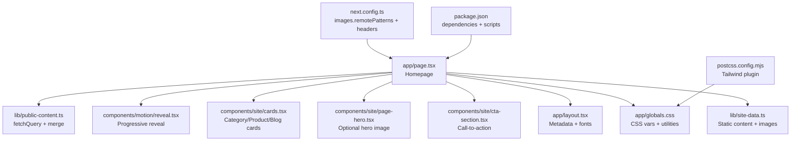
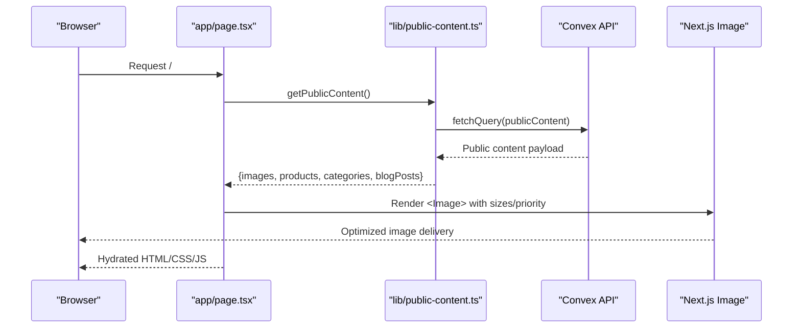
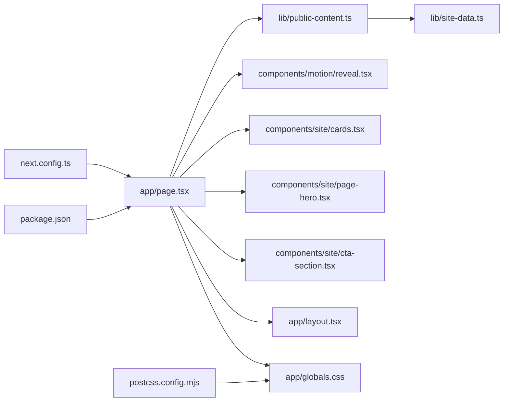

# Frontend Performance Optimization

<cite>
**Referenced Files in This Document**
- [app/page.tsx](file://app/page.tsx)
- [next.config.ts](file://next.config.ts)
- [components/motion/reveal.tsx](file://components/motion/reveal.tsx)
- [lib/public-content.ts](file://lib/public-content.ts)
- [lib/site-data.ts](file://lib/site-data.ts)
- [components/site/cards.tsx](file://components/site/cards.tsx)
- [components/site/page-hero.tsx](file://components/site/page-hero.tsx)
- [app/layout.tsx](file://app/layout.tsx)
- [app/globals.css](file://app/globals.css)
- [components/site/cta-section.tsx](file://components/site/cta-section.tsx)
- [lib/utils.ts](file://lib/utils.ts)
- [package.json](file://package.json)
- [postcss.config.mjs](file://postcss.config.mjs)
</cite>

## Table of Contents
1. [Introduction](#introduction)
2. [Project Structure](#project-structure)
3. [Core Components](#core-components)
4. [Architecture Overview](#architecture-overview)
5. [Detailed Component Analysis](#detailed-component-analysis)
6. [Dependency Analysis](#dependency-analysis)
7. [Performance Considerations](#performance-considerations)
8. [Troubleshooting Guide](#troubleshooting-guide)
9. [Conclusion](#conclusion)
10. [Appendices](#appendices)

## Introduction
This document provides a comprehensive guide to frontend performance optimization for the Next.js application. It focuses on Next.js Image Optimization, caching and revalidation strategies, above-the-fold prioritization, progressive enhancement via animations, Tailwind CSS optimization, code splitting, and performance monitoring. Specific examples are drawn from the homepage implementation to illustrate best practices for optimized image loading, component lazy loading, and efficient data fetching patterns.

## Project Structure
The application follows a conventional Next.js App Router structure with feature-based organization. The homepage orchestrates reusable components and shared data utilities, while global styles leverage CSS custom properties for reduced bundle size and maintainable theming.

**Diagram sources**
- [app/page.tsx:30-312](file://app/page.tsx#L30-L312)
- [lib/public-content.ts:65-107](file://lib/public-content.ts#L65-L107)
- [components/motion/reveal.tsx:11-39](file://components/motion/reveal.tsx#L11-L39)
- [components/site/cards.tsx:17-151](file://components/site/cards.tsx#L17-L151)
- [components/site/page-hero.tsx:15-59](file://components/site/page-hero.tsx#L15-L59)
- [components/site/cta-section.tsx:7-46](file://components/site/cta-section.tsx#L7-L46)
- [app/layout.tsx:72-104](file://app/layout.tsx#L72-L104)
- [app/globals.css:1-138](file://app/globals.css#L1-L138)
- [lib/site-data.ts:52-70](file://lib/site-data.ts#L52-L70)
- [next.config.ts:63-91](file://next.config.ts#L63-L91)
- [postcss.config.mjs:1-8](file://postcss.config.mjs#L1-L8)
- [package.json:14-51](file://package.json#L14-L51)

**Section sources**
- [app/page.tsx:30-312](file://app/page.tsx#L30-L312)
- [next.config.ts:63-91](file://next.config.ts#L63-L91)
- [app/layout.tsx:72-104](file://app/layout.tsx#L72-L104)
- [app/globals.css:1-138](file://app/globals.css#L1-L138)
- [lib/site-data.ts:52-70](file://lib/site-data.ts#L52-L70)
- [postcss.config.mjs:1-8](file://postcss.config.mjs#L1-L8)
- [package.json:14-51](file://package.json#L14-L51)

## Core Components
- Next.js Image Optimization: Implemented across hero, category, product, and blog cards with responsive sizes, fill positioning, and priority hints for above-the-fold imagery.
- Revalidation: Configured at the route level to refresh content every 60 seconds, balancing freshness and performance.
- Progressive Enhancement: Reveal animation system triggers on viewport entry, deferring heavy animations until needed.
- Tailwind CSS: Uses CSS custom properties for theme tokens and utility classes to minimize CSS bloat.
- Efficient Data Fetching: Centralized public content retrieval with fallbacks to static defaults.

**Section sources**
- [app/page.tsx:28-312](file://app/page.tsx#L28-L312)
- [components/motion/reveal.tsx:11-39](file://components/motion/reveal.tsx#L11-L39)
- [app/globals.css:3-20](file://app/globals.css#L3-L20)
- [lib/public-content.ts:65-107](file://lib/public-content.ts#L65-L107)

## Architecture Overview
The homepage composes multiple sections, each leveraging Next.js Image Optimization and the Reveal animation system. Data is fetched asynchronously and merged with static defaults. Global fonts and metadata are configured at the root layout, while CSS variables enable a compact, maintainable styling approach.

**Diagram sources**
- [app/page.tsx:30-32](file://app/page.tsx#L30-L32)
- [lib/public-content.ts:65-107](file://lib/public-content.ts#L65-L107)
- [next.config.ts:64-75](file://next.config.ts#L64-L75)

## Detailed Component Analysis

### Next.js Image Optimization
- Automatic resizing and format conversion: The application relies on Next.js Image Optimization via the Image component. Remote images are permitted from configured domains.
- Responsive sizing: The sizes attribute communicates viewport breakpoints to the image pipeline, enabling appropriate image selection.
- Priority hints: Above-the-fold hero images use priority to signal early loading.
- Aspect-ratio stability: Fill-based layouts with object-cover preserve aspect ratios without layout shifts.

Examples from the homepage:
- Hero background image with priority and responsive sizes.
- Product hero image with priority and aspect-ratio container.
- Category and blog cards with fill-based responsive images and hover scaling.

**Section sources**
- [app/page.tsx:36-43](file://app/page.tsx#L36-L43)
- [app/page.tsx:86-93](file://app/page.tsx#L86-L93)
- [app/page.tsx:259-266](file://app/page.tsx#L259-L266)
- [components/site/cards.tsx:24-31](file://components/site/cards.tsx#L24-L31)
- [components/site/cards.tsx:124-131](file://components/site/cards.tsx#L124-L131)
- [next.config.ts:64-75](file://next.config.ts#L64-L75)

### Revalidation Configuration (60-second cache)
- Route-level revalidation is set to 60 seconds, ensuring content freshness while minimizing redundant fetches.
- This setting applies to the homepage route and influences server-side rendering and incremental regeneration behavior.

**Section sources**
- [app/page.tsx:28](file://app/page.tsx#L28)

### Strategic Placement of Critical Rendering Paths
- Above-the-fold hero images use priority to expedite render.
- Below-the-fold content leverages the Reveal animation system to defer animations until elements are in view.
- Static fallbacks are provided in case of backend failures, preventing critical rendering stalls.

**Section sources**
- [app/page.tsx:36-43](file://app/page.tsx#L36-L43)
- [components/motion/reveal.tsx:11-24](file://components/motion/reveal.tsx#L11-L24)
- [lib/public-content.ts:98-106](file://lib/public-content.ts#L98-L106)

### Component-Level Optimizations (Reveal Animation System)
- Viewport-triggered animations: Elements animate in when they enter the viewport, once, with a configurable delay.
- Reduced initial paint cost: Animations are deferred until needed, improving perceived performance.
- Consistent UX: Smooth transitions with easing and duration improve user experience without blocking critical rendering.

**Section sources**
- [components/motion/reveal.tsx:11-39](file://components/motion/reveal.tsx#L11-L39)
- [components/site/cards.tsx:17-47](file://components/site/cards.tsx#L17-L47)
- [components/site/page-hero.tsx:15-59](file://components/site/page-hero.tsx#L15-L59)
- [components/site/cta-section.tsx:7-46](file://components/site/cta-section.tsx#L7-L46)

### Tailwind CSS Optimization Strategies
- CSS custom properties: Theme tokens are centralized in :root, reducing duplication and enabling easy updates.
- Utility-first classes: Combined with CSS custom properties, utilities keep styles concise and maintainable.
- Unused CSS purging: Tailwind’s PostCSS plugin is configured; ensure production builds purge unused styles to minimize CSS size.
- Class merging: Utility helper consolidates classes efficiently.

**Section sources**
- [app/globals.css:3-20](file://app/globals.css#L3-L20)
- [app/globals.css:74-87](file://app/globals.css#L74-L87)
- [postcss.config.mjs:1-8](file://postcss.config.mjs#L1-L8)
- [lib/utils.ts:4-6](file://lib/utils.ts#L4-L6)

### Code Splitting Implementation (Dynamic Imports and Route-Based Splitting)
- Route-based code splitting: Next.js automatically splits routes under the app directory, isolating bundles per page.
- Dynamic imports: While not explicitly shown in the homepage, dynamic imports can be used for heavy components or modals to further optimize initial load.
- Font optimization: Fonts are loaded with display swap and CSS variable injection to avoid layout shifts.

**Section sources**
- [app/layout.tsx:9-26](file://app/layout.tsx#L9-L26)
- [package.json:14-51](file://package.json#L14-L51)

### Performance Monitoring Techniques
- Built-in metrics: Next.js provides built-in performance metrics in development and production environments.
- Lighthouse analysis: Regular audits help identify opportunities for Largest Contentful Paint (LCP), First Input Delay (FID), and Cumulative Layout Shift (CLS).
- Observability: Combine Next.js metrics with external monitoring tools to track real-user performance.

[No sources needed since this section provides general guidance]

### Core Web Vitals Optimization
- LCP: Use priority for above-the-fold images, ensure adequate server response times, and optimize image formats and sizes.
- FID: Minimize JavaScript execution time during initial load, defer non-critical scripts, and leverage code splitting.
- CLS: Reserve space for images with aspect-ratio containers, avoid late-inserted elements, and stabilize layout during hydration.

[No sources needed since this section provides general guidance]

### Example: Homepage Optimized Patterns
- Optimized image loading: Hero images use priority and sizes; cards use fill-based responsive images with hover scaling.
- Component lazy loading: Reveal animations trigger on viewport entry, deferring heavy effects.
- Efficient data fetching: getPublicContent merges backend content with static defaults and handles errors gracefully.

**Section sources**
- [app/page.tsx:36-43](file://app/page.tsx#L36-L43)
- [app/page.tsx:86-93](file://app/page.tsx#L86-L93)
- [app/page.tsx:259-266](file://app/page.tsx#L259-L266)
- [components/site/cards.tsx:24-31](file://components/site/cards.tsx#L24-L31)
- [components/site/cards.tsx:124-131](file://components/site/cards.tsx#L124-L131)
- [components/motion/reveal.tsx:11-24](file://components/motion/reveal.tsx#L11-L24)
- [lib/public-content.ts:65-107](file://lib/public-content.ts#L65-L107)

## Dependency Analysis
The homepage depends on shared utilities and components for data fetching, image optimization, and animations. The configuration file centralizes image domains and security headers.

**Diagram sources**
- [app/page.tsx:30-312](file://app/page.tsx#L30-L312)
- [lib/public-content.ts:65-107](file://lib/public-content.ts#L65-L107)
- [components/motion/reveal.tsx:11-39](file://components/motion/reveal.tsx#L11-L39)
- [components/site/cards.tsx:17-151](file://components/site/cards.tsx#L17-L151)
- [components/site/page-hero.tsx:15-59](file://components/site/page-hero.tsx#L15-L59)
- [components/site/cta-section.tsx:7-46](file://components/site/cta-section.tsx#L7-L46)
- [app/layout.tsx:72-104](file://app/layout.tsx#L72-L104)
- [app/globals.css:1-138](file://app/globals.css#L1-L138)
- [lib/site-data.ts:52-70](file://lib/site-data.ts#L52-L70)
- [next.config.ts:63-91](file://next.config.ts#L63-L91)
- [postcss.config.mjs:1-8](file://postcss.config.mjs#L1-L8)
- [package.json:14-51](file://package.json#L14-L51)

**Section sources**
- [app/page.tsx:30-312](file://app/page.tsx#L30-L312)
- [lib/public-content.ts:65-107](file://lib/public-content.ts#L65-L107)
- [next.config.ts:63-91](file://next.config.ts#L63-L91)
- [postcss.config.mjs:1-8](file://postcss.config.mjs#L1-L8)
- [package.json:14-51](file://package.json#L14-L51)

## Performance Considerations
- Prefer priority for above-the-fold images to improve LCP.
- Use responsive sizes and aspect-ratio containers to prevent CLS.
- Defer non-critical animations with viewport-triggered systems to improve FID.
- Keep images appropriately sized and leverage modern formats supported by Next.js Image Optimization.
- Monitor and iterate on Core Web Vitals using Next.js metrics and Lighthouse.

[No sources needed since this section provides general guidance]

## Troubleshooting Guide
- Image loading issues: Verify remotePatterns configuration for image hosts and ensure alt attributes are present for accessibility and SEO.
- Animation delays: Confirm viewport options and margins for the Reveal component to ensure animations trigger at the intended time.
- Data fetching failures: Confirm environment variables for backend URLs and review fallback behavior in getPublicContent.

**Section sources**
- [next.config.ts:64-75](file://next.config.ts#L64-L75)
- [components/motion/reveal.tsx:14-16](file://components/motion/reveal.tsx#L14-L16)
- [lib/public-content.ts:67-69](file://lib/public-content.ts#L67-L69)
- [lib/public-content.ts:98-106](file://lib/public-content.ts#L98-L106)

## Conclusion
The application employs Next.js Image Optimization, route-level revalidation, strategic priority hints, and a viewport-triggered animation system to deliver a fast, accessible, and visually engaging experience. Tailwind CSS with CSS custom properties keeps styles maintainable and compact. By continuing to monitor Core Web Vitals and iterating on image formats, code splitting, and runtime optimizations, the application can sustain strong performance across diverse networks and devices.

[No sources needed since this section summarizes without analyzing specific files]

## Appendices
- Example references for implementation paths:
  - [Homepage route with revalidation and images:28-312](file://app/page.tsx#L28-L312)
  - [Image optimization configuration:64-75](file://next.config.ts#L64-L75)
  - [Reveal animation system:11-39](file://components/motion/reveal.tsx#L11-L39)
  - [Public content retrieval:65-107](file://lib/public-content.ts#L65-L107)
  - [Tailwind CSS custom properties:3-20](file://app/globals.css#L3-L20)
  - [PostCSS configuration:1-8](file://postcss.config.mjs#L1-L8)
  - [Package dependencies:14-51](file://package.json#L14-L51)

[No sources needed since this section lists references without analyzing specific files]