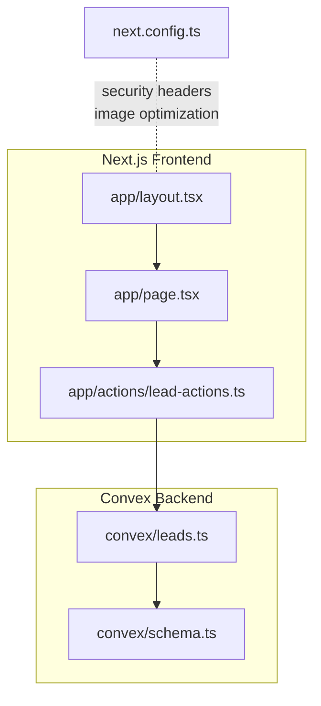
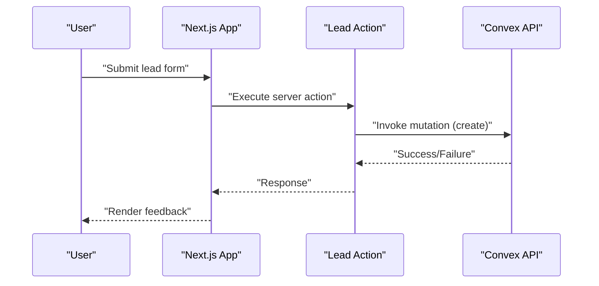
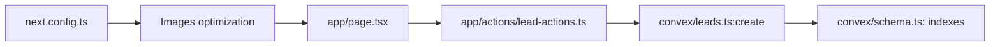

# Performance Monitoring & Analytics

<cite>
**Referenced Files in This Document**
- [next.config.ts](file://next.config.ts)
- [package.json](file://package.json)
- [app/layout.tsx](file://app/layout.tsx)
- [app/page.tsx](file://app/page.tsx)
- [app/actions/lead-actions.ts](file://app/actions/lead-actions.ts)
- [convex/schema.ts](file://convex/schema.ts)
- [convex/leads.ts](file://convex/leads.ts)
- [lib/site-data.ts](file://lib/site-data.ts)
</cite>

## Table of Contents
1. [Introduction](#introduction)
2. [Project Structure](#project-structure)
3. [Core Components](#core-components)
4. [Architecture Overview](#architecture-overview)
5. [Detailed Component Analysis](#detailed-component-analysis)
6. [Dependency Analysis](#dependency-analysis)
7. [Performance Considerations](#performance-considerations)
8. [Troubleshooting Guide](#troubleshooting-guide)
9. [Conclusion](#conclusion)
10. [Appendices](#appendices)

## Introduction
This document provides a comprehensive guide to performance monitoring and analytics for the application. It explains how Next.js built-in capabilities are leveraged, how to implement custom performance tracking, and how to integrate real-user monitoring (RUM) strategies. It also covers performance budgets, continuous performance testing, analytics integrations for key metrics, performance testing methodologies, logging and error tracking, browser performance APIs and Web Vitals monitoring, alerting and baselines, and dashboard/reporting approaches tailored to this codebase.

## Project Structure
The application is a Next.js 16 project with a Convex backend for data operations. Key areas relevant to performance monitoring include:
- Next.js configuration for security and image optimization
- Frontend pages and layouts that render content and trigger network requests
- Convex schema and queries/mutations that influence server-side performance
- Actions that bridge client-side forms to serverless Convex mutations

**Diagram sources**
- [next.config.ts:63-88](file://next.config.ts#L63-L88)
- [app/layout.tsx:72-103](file://app/layout.tsx#L72-L103)
- [app/page.tsx:30-311](file://app/page.tsx#L30-L311)
- [app/actions/lead-actions.ts:32-95](file://app/actions/lead-actions.ts#L32-L95)
- [convex/schema.ts:4-86](file://convex/schema.ts#L4-L86)
- [convex/leads.ts:7-31](file://convex/leads.ts#L7-L31)

**Section sources**
- [next.config.ts:63-88](file://next.config.ts#L63-L88)
- [app/layout.tsx:72-103](file://app/layout.tsx#L72-L103)
- [app/page.tsx:30-311](file://app/page.tsx#L30-L311)
- [app/actions/lead-actions.ts:32-95](file://app/actions/lead-actions.ts#L32-L95)
- [convex/schema.ts:4-86](file://convex/schema.ts#L4-L86)
- [convex/leads.ts:7-31](file://convex/leads.ts#L7-L31)

## Core Components
- Next.js configuration: Security headers, image optimization, and runtime behavior
- Root layout and metadata: Structured metadata and schema injection
- Home page: Content rendering, image optimization, and revalidation strategy
- Lead submission action: Client-to-server mutation via Convex
- Convex schema and leads module: Data model and query/mutation definitions

**Section sources**
- [next.config.ts:63-88](file://next.config.ts#L63-L88)
- [app/layout.tsx:72-103](file://app/layout.tsx#L72-L103)
- [app/page.tsx:28-311](file://app/page.tsx#L28-L311)
- [app/actions/lead-actions.ts:32-95](file://app/actions/lead-actions.ts#L32-L95)
- [convex/schema.ts:4-86](file://convex/schema.ts#L4-L86)
- [convex/leads.ts:7-31](file://convex/leads.ts#L7-L31)

## Architecture Overview
The performance monitoring architecture centers on:
- Built-in Next.js metrics and observability hooks
- Custom RUM via browser performance APIs and Web Vitals
- Convex server-side metrics and latency visibility
- Performance budgets and automated checks during CI
- Logging and error tracking for production performance issues
- Dashboards and reporting for trend analysis across environments

**Diagram sources**
- [app/actions/lead-actions.ts:32-95](file://app/actions/lead-actions.ts#L32-L95)
- [convex/leads.ts:7-24](file://convex/leads.ts#L7-L24)

## Detailed Component Analysis

### Next.js Configuration and Security Headers
- Security headers are injected globally to harden transport and reduce risk
- Image optimization is configured with remote patterns aligned with Convex hosting
- Turbopack root is set for development speed
- Powered-by header is disabled to minimize fingerprinting

These settings indirectly support performance by:
- Enforcing secure connections and reducing mixed-content risks
- Optimizing image delivery for faster render times
- Improving developer iteration speed

**Section sources**
- [next.config.ts:27-61](file://next.config.ts#L27-L61)
- [next.config.ts:63-88](file://next.config.ts#L63-L88)

### Root Layout and Metadata
- Metadata and Open Graph/Twitter properties are defined centrally
- Organization schema is embedded for SEO and structured data consumption
- Fonts are configured with display swapping for perceived performance

Implications for performance:
- Centralized metadata reduces duplication and improves caching
- Font swapping prevents layout shifts and improves CLS metrics

**Section sources**
- [app/layout.tsx:28-70](file://app/layout.tsx#L28-L70)
- [app/layout.tsx:72-103](file://app/layout.tsx#L72-L103)

### Home Page Rendering and Revalidation
- The home page uses asynchronous data fetching and revalidation to balance freshness and performance
- Images leverage Next.js Image with sizing and priority hints to optimize loading
- Content composition uses reusable components to streamline rendering

Performance considerations:
- Revalidation interval balances cache freshness vs. server load
- Image optimization and responsive sizing improve LCP and TTFB

**Section sources**
- [app/page.tsx:28-31](file://app/page.tsx#L28-L31)
- [app/page.tsx:34-109](file://app/page.tsx#L34-L109)
- [app/page.tsx:112-138](file://app/page.tsx#L112-L138)

### Lead Submission Action and Convex Integration
- The action validates form inputs, normalizes data, and captures user agent
- It invokes a Convex mutation to persist lead data
- Error handling ensures graceful user feedback

Performance and reliability:
- Early validation reduces unnecessary server calls
- Capturing user agent aids in diagnosing device/browser-specific issues
- Convex indexing supports efficient queries for dashboards

**Section sources**
- [app/actions/lead-actions.ts:32-95](file://app/actions/lead-actions.ts#L32-L95)
- [convex/leads.ts:7-24](file://convex/leads.ts#L7-L24)

### Convex Schema and Indexing
- Tables are indexed to support common queries (e.g., creation time ordering)
- Indexes enable fast retrieval for dashboards and analytics

Performance impact:
- Proper indexing reduces server-side query latency
- Efficient queries improve overall responsiveness

**Section sources**
- [convex/schema.ts:4-17](file://convex/schema.ts#L4-L17)
- [convex/schema.ts:35-36](file://convex/schema.ts#L35-L36)
- [convex/schema.ts:48-50](file://convex/schema.ts#L48-L50)
- [convex/schema.ts:62-64](file://convex/schema.ts#L62-L64)
- [convex/schema.ts:78-80](file://convex/schema.ts#L78-L80)

## Dependency Analysis
The performance-critical dependency chain is:
- Frontend pages and actions depend on Convex for data persistence
- Convex relies on schema indexes for query performance
- Next.js configuration influences image delivery and security posture

**Diagram sources**
- [app/page.tsx:30-311](file://app/page.tsx#L30-L311)
- [app/actions/lead-actions.ts:32-95](file://app/actions/lead-actions.ts#L32-L95)
- [convex/leads.ts:7-24](file://convex/leads.ts#L7-L24)
- [convex/schema.ts:4-17](file://convex/schema.ts#L4-L17)
- [next.config.ts:63-88](file://next.config.ts#L63-L88)

**Section sources**
- [app/page.tsx:30-311](file://app/page.tsx#L30-L311)
- [app/actions/lead-actions.ts:32-95](file://app/actions/lead-actions.ts#L32-L95)
- [convex/leads.ts:7-24](file://convex/leads.ts#L7-L24)
- [convex/schema.ts:4-17](file://convex/schema.ts#L4-L17)
- [next.config.ts:63-88](file://next.config.ts#L63-L88)

## Performance Considerations
- Built-in Next.js metrics: Use Next.js telemetry and profiling tools to monitor build and runtime performance. Enable experimental performance features cautiously and measure impact.
- Custom performance tracking: Instrument client-side navigation and server actions to capture durations and errors. Aggregate metrics via a lightweight analytics endpoint or RUM platform.
- Real-user monitoring (RUM): Integrate Web Vitals collection in the root layout to report Largest Contentful Paint, First Input Delay, and Cumulative Layout Shift. Use browser performance APIs to capture server timing and resource timing.
- Performance budgets: Define budgets for bundle sizes, LCP thresholds, and error rates. Enforce budgets in CI using linting or build-time checks.
- Continuous performance testing: Add automated performance tests (e.g., Lighthouse CI, Pa11y, or custom scripts) to detect regressions on pull requests.
- Analytics integrations: Connect to analytics platforms to track page load times, time to interactive, and server response times. Ensure privacy-compliant data collection and sampling.
- Logging and error tracking: Log performance anomalies and errors with correlation IDs. Use structured logs for dashboards and alerting.
- Browser performance APIs: Utilize PerformanceNavigationTiming, PerformanceResourceTiming, and PerformanceObserver to collect granular metrics.
- Alerts and baselines: Establish environment-specific baselines (development, staging, production) and configure alerts for sustained degradation or budget breaches.
- Dashboards and reporting: Build dashboards to visualize trends over time, compare environments, and drill into slowest routes and resources.

[No sources needed since this section provides general guidance]

## Troubleshooting Guide
Common performance issues and remedies:
- Slow image loads: Verify image optimization settings and ensure appropriate sizes and formats. Confirm remote patterns allow Convex-hosted images.
- Excessive server requests: Review Convex queries and indexes; ensure proper pagination and limit returned records.
- Layout shifts: Confirm fonts and images use sizing attributes to prevent CLS regressions.
- Form submission delays: Validate client-side normalization and error handling paths; ensure user agent capture does not block submission.
- Security header conflicts: If CSP blocks external resources, adjust policies to permit necessary domains.

**Section sources**
- [next.config.ts:63-88](file://next.config.ts#L63-L88)
- [app/actions/lead-actions.ts:32-95](file://app/actions/lead-actions.ts#L32-L95)
- [convex/schema.ts:4-17](file://convex/schema.ts#L4-L17)

## Conclusion
This project’s Next.js and Convex stack provides a solid foundation for performance monitoring. By combining built-in metrics, custom RUM, performance budgets, and continuous testing, teams can maintain high-quality user experiences across environments. Integrating analytics, robust logging, and alerting enables proactive identification and resolution of performance issues.

[No sources needed since this section summarizes without analyzing specific files]

## Appendices

### Appendix A: Example Metrics to Track
- Page load time (Next.js built-in)
- Time to interactive (Next.js built-in)
- Largest Contentful Paint (Web Vitals)
- First Input Delay (Web Vitals)
- Cumulative Layout Shift (Web Vitals)
- Server response time (Convex)
- Bundle size budgets
- Error rate and failure latency

[No sources needed since this section provides general guidance]

### Appendix B: Recommended Tools and Integrations
- RUM and Web Vitals: Use a RUM provider or self-hosted ingestion with browser performance APIs
- Analytics: Connect to analytics platforms for page and conversion metrics
- Logging: Use structured logs with correlation IDs for performance events
- Alerting: Configure alerts for threshold breaches and sustained degradation
- CI: Add performance checks to PR workflows

[No sources needed since this section provides general guidance]