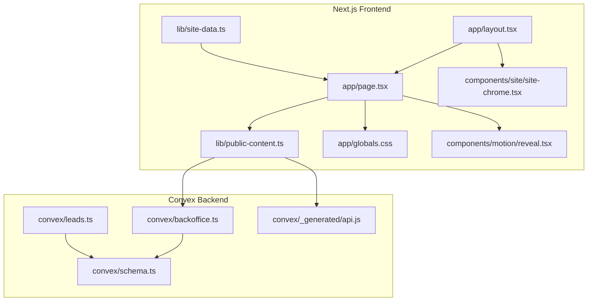
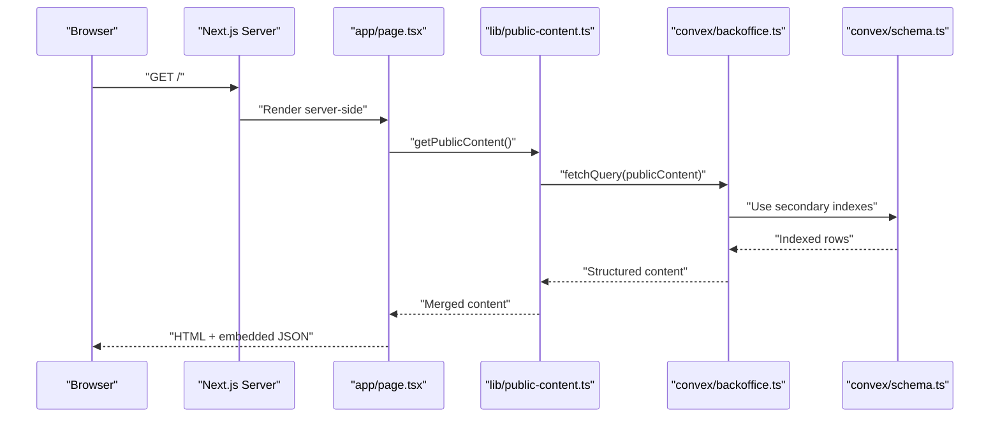
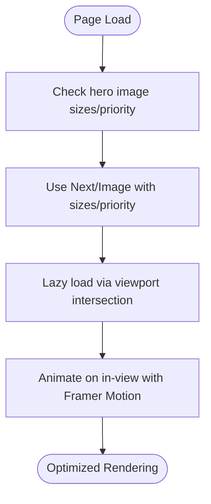
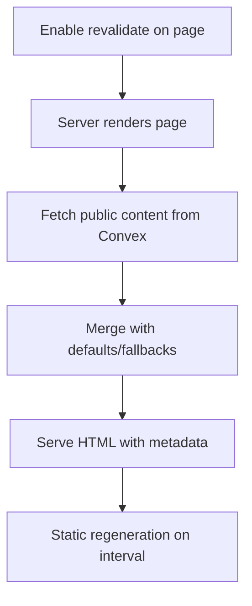
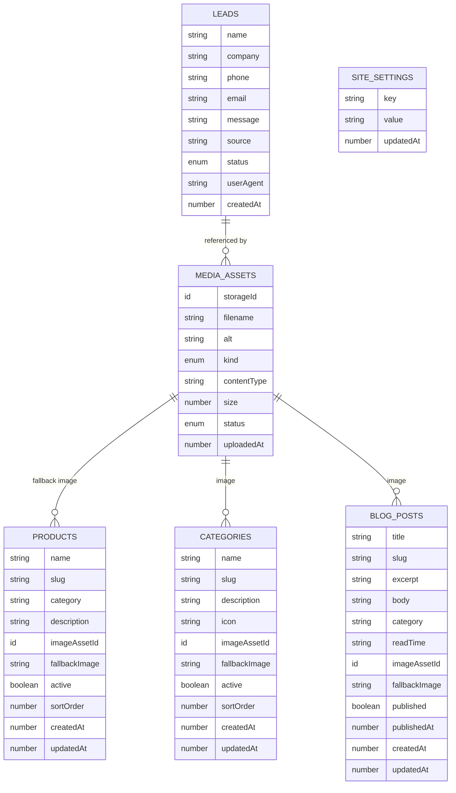
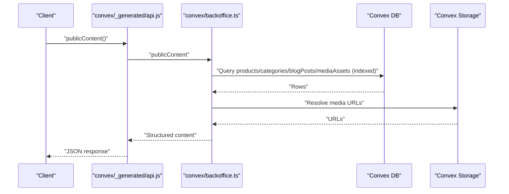
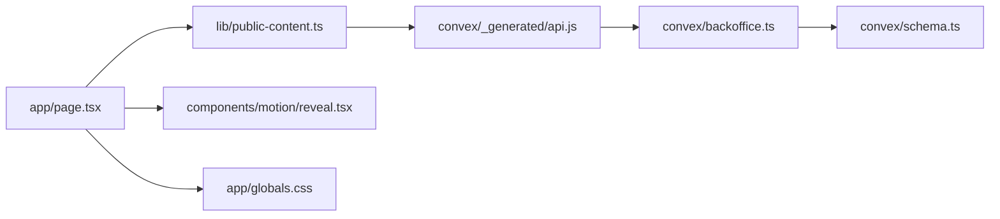

# Performance Optimization

<cite>
**Referenced Files in This Document**
- [next.config.ts](file://next.config.ts)
- [package.json](file://package.json)
- [app/layout.tsx](file://app/layout.tsx)
- [app/page.tsx](file://app/page.tsx)
- [lib/public-content.ts](file://lib/public-content.ts)
- [lib/site-data.ts](file://lib/site-data.ts)
- [components/motion/reveal.tsx](file://components/motion/reveal.tsx)
- [components/site/site-chrome.tsx](file://components/site/site-chrome.tsx)
- [app/globals.css](file://app/globals.css)
- [convex/schema.ts](file://convex/schema.ts)
- [convex/backoffice.ts](file://convex/backoffice.ts)
- [convex/leads.ts](file://convex/leads.ts)
- [convex/_generated/api.js](file://convex/_generated/api.js)
- [lib/backoffice-data.ts](file://lib/backoffice-data.ts)
</cite>

## Table of Contents
1. [Introduction](#introduction)
2. [Project Structure](#project-structure)
3. [Core Components](#core-components)
4. [Architecture Overview](#architecture-overview)
5. [Detailed Component Analysis](#detailed-component-analysis)
6. [Dependency Analysis](#dependency-analysis)
7. [Performance Considerations](#performance-considerations)
8. [Troubleshooting Guide](#troubleshooting-guide)
9. [Conclusion](#conclusion)
10. [Appendices](#appendices)

## Introduction
This document provides a comprehensive performance optimization guide for a Next.js application integrated with Convex backend services. It focuses on frontend optimization (image optimization, lazy loading, bundle size reduction, SSR/SSG strategies), backend optimization (database indexing, query patterns, caching), monitoring and analytics, CDN and content delivery, code splitting and dynamic imports, memory/resource management, performance testing/benchmarking, and troubleshooting best practices tailored to different deployment scenarios.

## Project Structure
The project follows a conventional Next.js 13+ app directory structure with an integrated Convex backend. Key performance-relevant areas include:
- Next.js configuration for image optimization and security headers
- App router pages using server-side rendering and incremental regeneration
- Convex schema with strategic secondary indexes
- Convex queries leveraging index scans and parallelization
- Shared UI components with motion-based lazy animations

**Diagram sources**
- [app/layout.tsx:1-104](file://app/layout.tsx#L1-L104)
- [app/page.tsx:1-312](file://app/page.tsx#L1-L312)
- [lib/public-content.ts:1-107](file://lib/public-content.ts#L1-L107)
- [lib/site-data.ts:1-314](file://lib/site-data.ts#L1-L314)
- [app/globals.css:1-138](file://app/globals.css#L1-L138)
- [components/motion/reveal.tsx:1-39](file://components/motion/reveal.tsx#L1-L39)
- [components/site/site-chrome.tsx:1-27](file://components/site/site-chrome.tsx#L1-L27)
- [convex/schema.ts:1-87](file://convex/schema.ts#L1-L87)
- [convex/backoffice.ts:1-385](file://convex/backoffice.ts#L1-L385)
- [convex/leads.ts:1-32](file://convex/leads.ts#L1-L32)
- [convex/_generated/api.js:1-24](file://convex/_generated/api.js#L1-L24)

**Section sources**
- [next.config.ts:1-91](file://next.config.ts#L1-L91)
- [package.json:1-51](file://package.json#L1-L51)

## Core Components
- Next.js configuration: image optimization, CSP, security headers, and custom headers pipeline
- Home page: server-side rendering with incremental regeneration, image lazy-loading via Next/Image, and viewport-triggered animations
- Public content loader: fetches and merges public content from Convex with graceful fallbacks
- Convex schema: secondary indexes on frequently queried fields
- Convex queries: index-driven scans, parallelized multi-query execution, and media URL resolution
- Shared styles and animations: CSS-in-JS-like variables, reduced motion support, and motion components for lazy loading

**Section sources**
- [next.config.ts:63-88](file://next.config.ts#L63-L88)
- [app/page.tsx:28-31](file://app/page.tsx#L28-L31)
- [lib/public-content.ts:65-106](file://lib/public-content.ts#L65-L106)
- [convex/schema.ts:4-86](file://convex/schema.ts#L4-L86)
- [convex/backoffice.ts:319-384](file://convex/backoffice.ts#L319-L384)

## Architecture Overview
The frontend performs server-side rendering on the home page and fetches public content via Convex queries. Convex enforces index usage and parallelizes reads to minimize latency. Security headers and CSP are applied globally to improve trust and mitigate risks.

**Diagram sources**
- [app/page.tsx:30-31](file://app/page.tsx#L30-L31)
- [lib/public-content.ts:65-71](file://lib/public-content.ts#L65-L71)
- [convex/backoffice.ts:319-384](file://convex/backoffice.ts#L319-L384)
- [convex/schema.ts:4-86](file://convex/schema.ts#L4-L86)

## Detailed Component Analysis

### Frontend Performance: Image Optimization and Lazy Loading
- Next/Image usage with responsive sizes and priority hints ensures efficient loading and Core Web Vitals alignment.
- Remote image patterns allow serving images from Convex domains.
- Motion components trigger animations when elements enter the viewport, deferring heavy animations until needed.

**Diagram sources**
- [app/page.tsx:36-43](file://app/page.tsx#L36-L43)
- [app/page.tsx:86-94](file://app/page.tsx#L86-L94)
- [components/motion/reveal.tsx:11-24](file://components/motion/reveal.tsx#L11-L24)
- [next.config.ts:64-75](file://next.config.ts#L64-L75)

**Section sources**
- [app/page.tsx:36-43](file://app/page.tsx#L36-L43)
- [app/page.tsx:86-94](file://app/page.tsx#L86-L94)
- [components/motion/reveal.tsx:11-24](file://components/motion/reveal.tsx#L11-L24)
- [next.config.ts:64-75](file://next.config.ts#L64-L75)

### Frontend Performance: SSR and Incremental Static Regeneration
- The home page enables incremental regeneration to keep content fresh with minimal rebuild overhead.
- Global metadata and structured data are rendered server-side to improve SEO and Core Web Vitals.

**Diagram sources**
- [app/page.tsx:28-31](file://app/page.tsx#L28-L31)
- [app/layout.tsx:28-70](file://app/layout.tsx#L28-L70)

**Section sources**
- [app/page.tsx:28-31](file://app/page.tsx#L28-L31)
- [app/layout.tsx:28-70](file://app/layout.tsx#L28-L70)

### Frontend Performance: Bundle Size Reduction and Code Splitting
- Next.js automatic code splitting applies to route segments and dynamic imports.
- Minimizing third-party dependencies and leveraging tree-shaking reduces payload size.
- Tailwind CSS is imported via PostCSS; ensure purging is configured in production builds.

Recommendations:
- Prefer dynamic imports for non-critical routes and heavy components.
- Audit dependencies regularly and remove unused packages.
- Enable production builds and analyze bundles using Next.js bundle analyzer.

**Section sources**
- [package.json:14-25](file://package.json#L14-L25)
- [app/globals.css:1-2](file://app/globals.css#L1-L2)

### Frontend Performance: Memory Management and Resource Optimization
- CSS variables and reduced-motion support reduce layout thrash and unnecessary animations.
- Motion components use viewport-based triggers to avoid animating offscreen content.
- Global styles prevent excessive DOM nodes and heavy shadows/backdrops.

**Section sources**
- [app/globals.css:137-138](file://app/globals.css#L137-L138)
- [components/motion/reveal.tsx:14-17](file://components/motion/reveal.tsx#L14-L17)

### Backend Performance: Database Query Optimization
- Secondary indexes on frequently filtered/sorted fields enable fast scans:
  - Leads: by status, by created timestamp
  - Media assets: by kind/status, by status/uploaded timestamp
  - Products/Categories: by active/sort order, by slug
  - Blog posts: by published/published timestamp, by slug
  - Site settings: by key
- Queries leverage index scans and ordering to limit result sets efficiently.

**Diagram sources**
- [convex/schema.ts:4-86](file://convex/schema.ts#L4-L86)

**Section sources**
- [convex/schema.ts:14-17](file://convex/schema.ts#L14-L17)
- [convex/schema.ts:34-36](file://convex/schema.ts#L34-L36)
- [convex/schema.ts:48-50](file://convex/schema.ts#L48-L50)
- [convex/schema.ts:62-64](file://convex/schema.ts#L62-L64)
- [convex/schema.ts:78-80](file://convex/schema.ts#L78-L80)
- [convex/schema.ts:84-85](file://convex/schema.ts#L84-L85)

### Backend Performance: Convex Function Optimization
- Parallelized multi-query execution reduces total latency by fetching related collections concurrently.
- Index-driven filters and ordering ensure efficient scans and bounded result sets.
- Media URL resolution is deferred and cached via Convex storage URLs.

**Diagram sources**
- [convex/_generated/api.js:11-24](file://convex/_generated/api.js#L11-L24)
- [convex/backoffice.ts:319-384](file://convex/backoffice.ts#L319-L384)

**Section sources**
- [convex/backoffice.ts:125-131](file://convex/backoffice.ts#L125-L131)
- [convex/backoffice.ts:322-327](file://convex/backoffice.ts#L322-L327)
- [convex/backoffice.ts:350-358](file://convex/backoffice.ts#L350-L358)

### Backend Performance: Caching Strategies
- Use Convex’s built-in caching for media URLs and small datasets.
- Implement server-side caching for repeated queries (e.g., homepage content) with appropriate TTL.
- Consider CDN caching for static assets served via Convex storage URLs.

[No sources needed since this section provides general guidance]

### Security Headers and CSP Impact on Performance
- Content-Security-Policy and strict security headers are applied globally, which can slightly increase header processing but improve trust and reduce risk.
- Ensure CSP allows only necessary origins to avoid mixed-content penalties.

**Section sources**
- [next.config.ts:8-25](file://next.config.ts#L8-L25)
- [next.config.ts:27-61](file://next.config.ts#L27-L61)

### Monitoring and Analytics
- Integrate performance monitoring (e.g., web vitals collection) and analytics at the application level.
- Track server-side render durations, Convex query latencies, and image load times.
- Use observability platforms to correlate frontend metrics with backend performance.

[No sources needed since this section provides general guidance]

### CDN and Content Delivery Optimization
- Serve images from Convex domains via configured remote patterns to benefit from CDN distribution.
- Ensure cache-control headers are set appropriately for static assets.
- Consider using a CDN in front of the Next.js server for global edge caching.

**Section sources**
- [next.config.ts:64-75](file://next.config.ts#L64-L75)

### Code Splitting and Dynamic Imports
- Use dynamic imports for non-critical UI and heavy libraries to reduce initial bundle size.
- Split large components into smaller route segments to leverage Next.js automatic code splitting.

[No sources needed since this section provides general guidance]

## Dependency Analysis
The frontend depends on Convex for content retrieval. Convex functions rely on secondary indexes defined in the schema for efficient queries. The API module exposes typed references to Convex functions.

**Diagram sources**
- [app/page.tsx:26-31](file://app/page.tsx#L26-L31)
- [lib/public-content.ts:13-14](file://lib/public-content.ts#L13-L14)
- [convex/_generated/api.js:11-24](file://convex/_generated/api.js#L11-L24)
- [convex/backoffice.ts:319-384](file://convex/backoffice.ts#L319-L384)
- [convex/schema.ts:4-86](file://convex/schema.ts#L4-L86)

**Section sources**
- [lib/public-content.ts:13-14](file://lib/public-content.ts#L13-L14)
- [convex/_generated/api.js:11-24](file://convex/_generated/api.js#L11-L24)

## Performance Considerations
- Image optimization: Use Next/Image with appropriate sizes and priority hints; ensure remote patterns include Convex domains.
- Lazy loading: Combine viewport-based animations with skeleton loaders for perceived performance.
- Bundle size: Audit dependencies, enable tree-shaking, and split large components.
- SSR/SSG: Use incremental regeneration for frequently changing content; pre-render static pages where possible.
- Database: Leverage secondary indexes and limit result sets; batch related queries when feasible.
- CDN: Serve static assets via CDN-backed storage; configure cache headers.
- Monitoring: Track Core Web Vitals, server render times, and backend query latencies.

[No sources needed since this section provides general guidance]

## Troubleshooting Guide
Common issues and remedies:
- Slow initial page load: Verify image sizes and priority attributes; check for heavy animations on first paint; confirm CDN is serving images.
- High server render times: Review Convex query patterns; ensure secondary indexes are used; consider caching repeated queries.
- Large bundle size: Audit dependencies and enable production optimizations; split non-critical code.
- CSP errors: Confirm allowed origins for images and connections; adjust CSP directives if necessary.
- Motion performance: Reduce backdrop blur and shadows for low-end devices; respect reduced-motion preferences.

**Section sources**
- [app/page.tsx:36-43](file://app/page.tsx#L36-L43)
- [components/motion/reveal.tsx:13-17](file://components/motion/reveal.tsx#L13-L17)
- [app/globals.css:137-138](file://app/globals.css#L137-L138)
- [next.config.ts:8-25](file://next.config.ts#L8-L25)

## Conclusion
This guide outlined a practical, code-backed approach to optimizing performance across the Next.js frontend and Convex backend. By combining efficient image handling, SSR/SSG, index-driven queries, parallelized reads, and CDN-backed assets, the application can achieve strong Core Web Vitals and scalable performance. Regular monitoring and iterative tuning will ensure sustained performance across environments.

## Appendices
- Best practices checklist:
  - Use Next/Image with sizes and priority for hero images
  - Enable incremental regeneration for dynamic content
  - Add secondary indexes for frequent filters/sorts
  - Parallelize multi-collection reads in Convex
  - Configure CSP and security headers
  - Monitor web vitals and backend latencies
  - Split bundles and remove unused dependencies
  - Respect reduced-motion preferences

[No sources needed since this section provides general guidance]