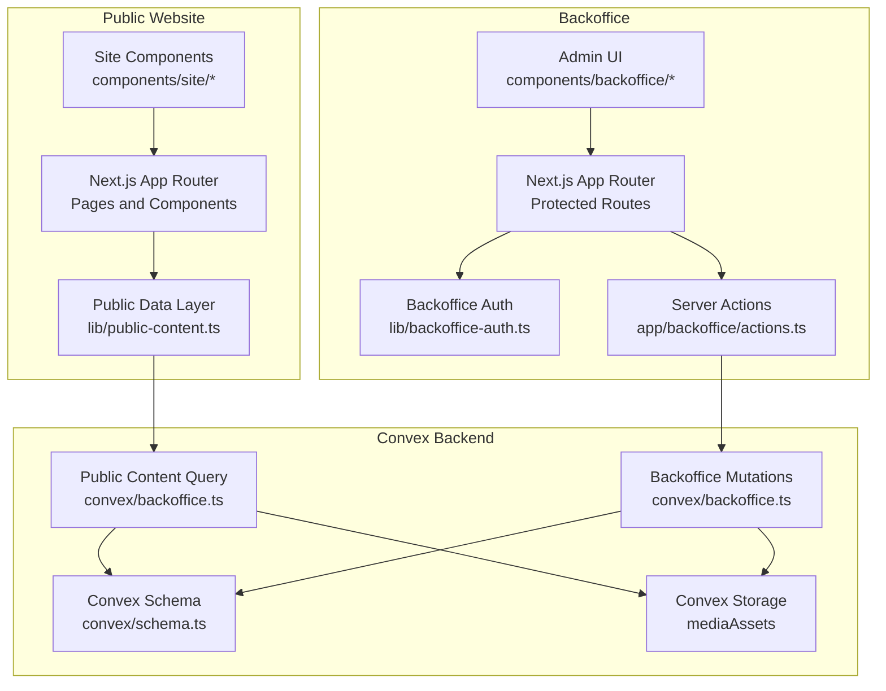
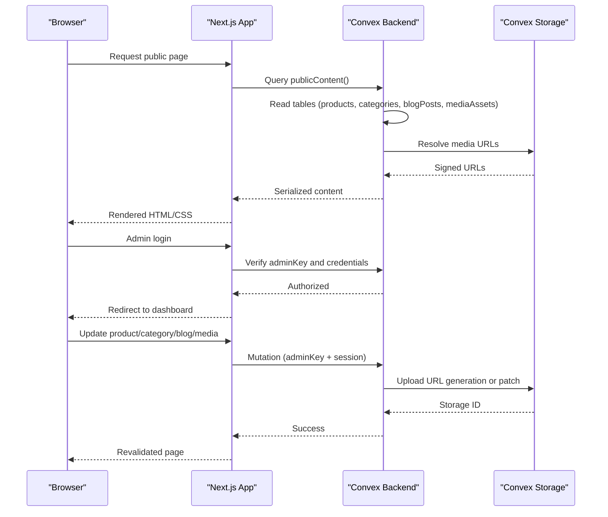
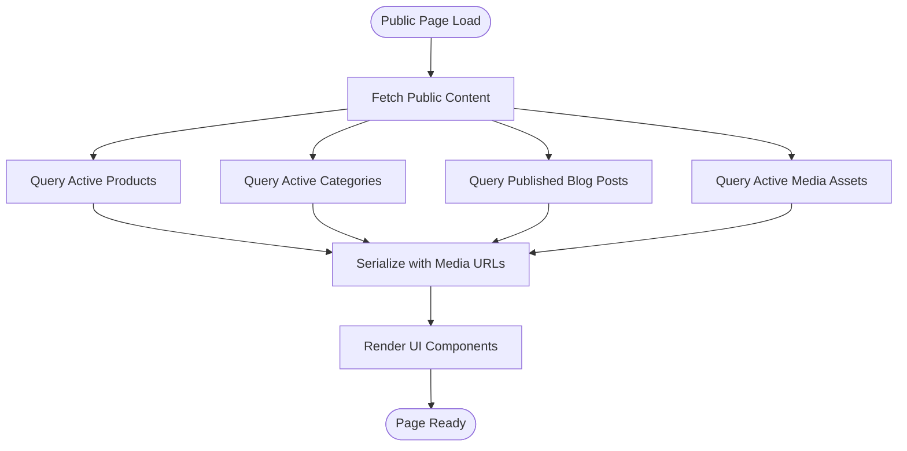
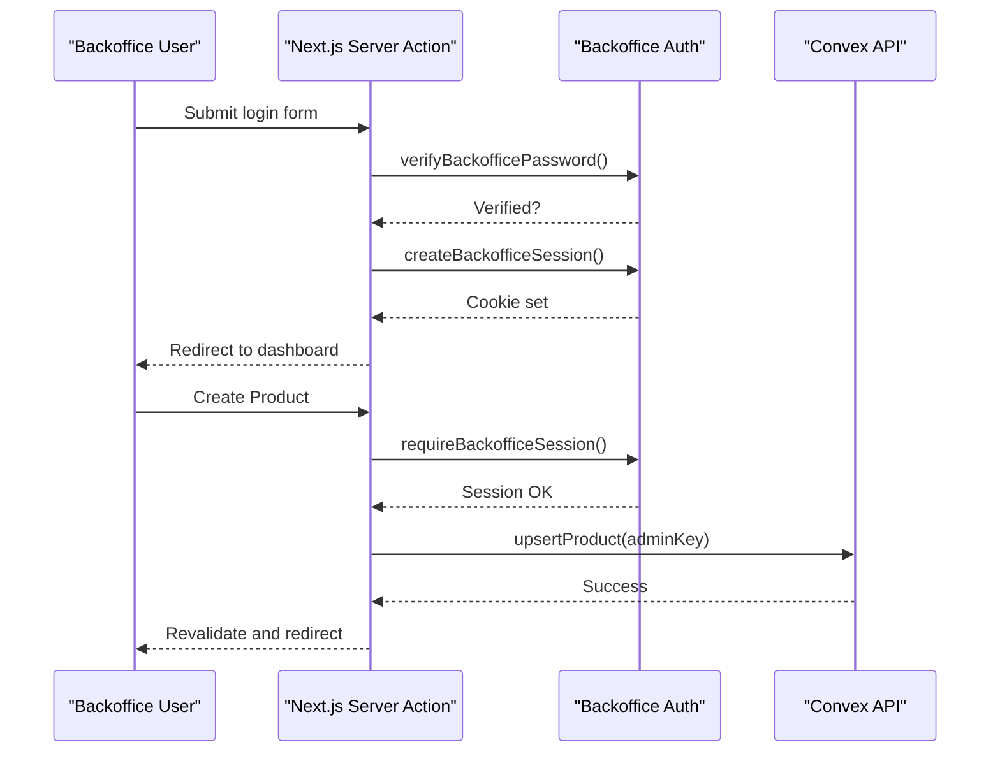
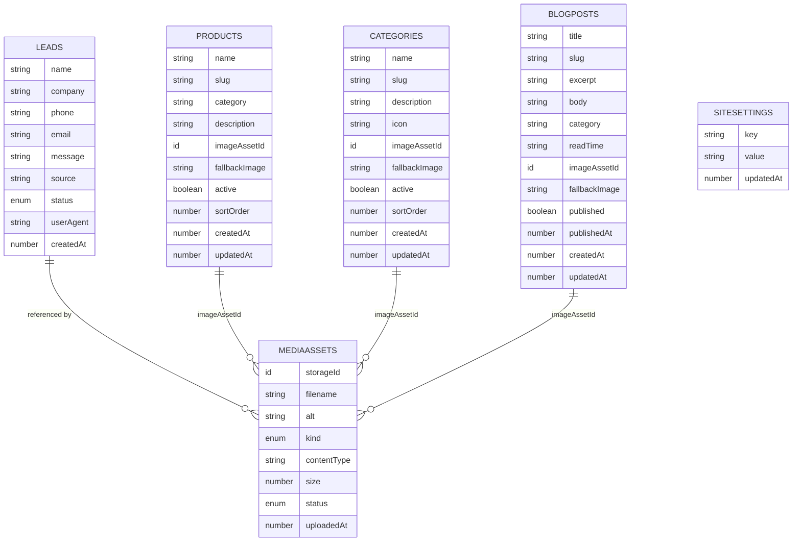
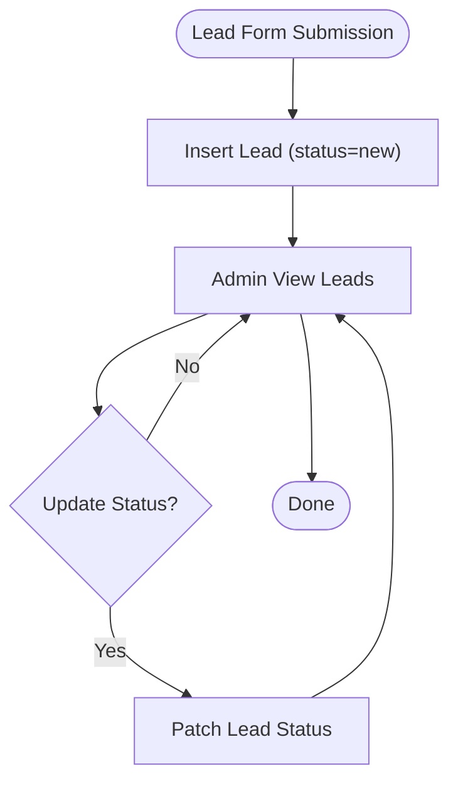
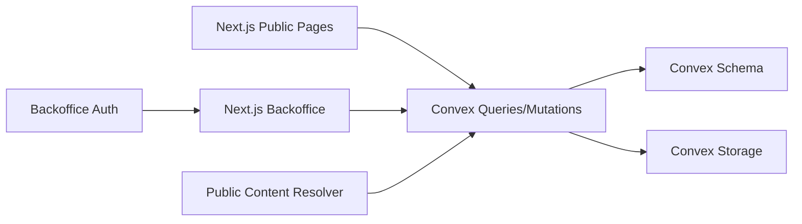

# Project Overview

<cite>
**Referenced Files in This Document**
- [package.json](file://package.json)
- [layout.tsx](file://app/layout.tsx)
- [schema.ts](file://convex/schema.ts)
- [leads.ts](file://convex/leads.ts)
- [backoffice.ts](file://convex/backoffice.ts)
- [site-data.ts](file://lib/site-data.ts)
- [backoffice-data.ts](file://lib/backoffice-data.ts)
- [backoffice-auth.ts](file://lib/backoffice-auth.ts)
- [actions.ts](file://app/backoffice/actions.ts)
- [admin-ui.tsx](file://components/backoffice/admin-ui.tsx)
- [backoffice-shell.tsx](file://components/backoffice/backoffice-shell.tsx)
- [site-chrome.tsx](file://components/site/site-chrome.tsx)
- [navbar.tsx](file://components/site/navbar.tsx)
- [footer.tsx](file://components/site/footer.tsx)
- [page.tsx](file://app/page.tsx)
- [produtos page.tsx](file://app/produtos/page.tsx)
</cite>

## Table of Contents
1. [Introduction](#introduction)
2. [Project Structure](#project-structure)
3. [Core Components](#core-components)
4. [Architecture Overview](#architecture-overview)
5. [Detailed Component Analysis](#detailed-component-analysis)
6. [Dependency Analysis](#dependency-analysis)
7. [Performance Considerations](#performance-considerations)
8. [Troubleshooting Guide](#troubleshooting-guide)
9. [Conclusion](#conclusion)

## Introduction
ADIKI ALVANIR Angola is a professional B2B e-commerce website for office consumables and stationery materials in Angola. It positions itself as a provider of premium office supplies and services for businesses, institutions, and teams, emphasizing organized supply, fast response, and professional presentation. The platform is intentionally oriented toward budget requests and relationship-driven sales rather than traditional online checkout, enabling a streamlined B2B experience focused on customer service and delivery logistics.

Business objectives:
- Establish a strong digital presence for B2B clients in Angola
- Drive qualified leads through a content-rich, SEO-friendly website
- Support efficient internal operations with a protected backoffice for content and lead management
- Showcase product categories and services to encourage budget requests and long-term partnerships

Target audience:
- Corporate buyers and procurement teams
- Institutional purchasers (schools, clinics, government offices)
- Office managers and administrative departments seeking reliable, recurring supplies

Key value propositions:
- Rapid response and delivery
- Dedicated corporate support
- Personalized recommendations aligned to operation type and consumption needs
- Quality assurance and consistent supply

## Project Structure
The project follows a dual-facing architecture:
- Public website: Next.js 16 app with static and server-rendered routes, consuming content from Convex
- Protected backoffice: Next.js app router protected by session-based authentication, enabling content creators and administrators to manage products, categories, media, blog posts, and leads

Technology stack highlights:
- Frontend: Next.js 16, React 19, Tailwind CSS, Framer Motion
- Backend: Convex (real-time database and serverless functions)
- Authentication: Secure session cookies with HMAC signatures and scrypt-based password hashing
- Media: Convex storage integration for images and assets

**Diagram sources**
- [layout.tsx:1-104](file://app/layout.tsx#L1-L104)
- [site-chrome.tsx:1-27](file://components/site/site-chrome.tsx#L1-L27)
- [backoffice-shell.tsx:1-78](file://components/backoffice/backoffice-shell.tsx#L1-L78)
- [backoffice-auth.ts:1-129](file://lib/backoffice-auth.ts#L1-L129)
- [actions.ts:1-215](file://app/backoffice/actions.ts#L1-L215)
- [schema.ts:1-87](file://convex/schema.ts#L1-L87)
- [backoffice.ts:1-385](file://convex/backoffice.ts#L1-L385)

**Section sources**
- [package.json:1-51](file://package.json#L1-L51)
- [layout.tsx:1-104](file://app/layout.tsx#L1-L104)
- [site-chrome.tsx:1-27](file://components/site/site-chrome.tsx#L1-L27)

## Core Components
- Public website pages and components:
  - Home page aggregates hero content, categories, featured products, services, testimonials, and blog previews
  - Products page presents a catalog view powered by public content
  - Navigation and footer provide consistent branding and contact links
- Backoffice administration:
  - Login/logout with session management and API key verification
  - Dashboard with lead and content summaries
  - CRUD for products, categories, blog posts, and media assets
  - Lead status management
- Convex backend:
  - Schema defines tables for leads, mediaAssets, products, categories, blogPosts, and siteSettings
  - Queries expose public content and statistics
  - Mutations enable admin-managed updates and uploads

**Section sources**
- [page.tsx:1-312](file://app/page.tsx#L1-L312)
- [produtos page.tsx:1-43](file://app/produtos/page.tsx#L1-L43)
- [navbar.tsx:1-116](file://components/site/navbar.tsx#L1-L116)
- [footer.tsx:1-103](file://components/site/footer.tsx#L1-L103)
- [backoffice-shell.tsx:1-78](file://components/backoffice/backoffice-shell.tsx#L1-L78)
- [admin-ui.tsx:1-25](file://components/backoffice/admin-ui.tsx#L1-L25)
- [backoffice-auth.ts:1-129](file://lib/backoffice-auth.ts#L1-L129)
- [actions.ts:1-215](file://app/backoffice/actions.ts#L1-L215)
- [schema.ts:1-87](file://convex/schema.ts#L1-L87)
- [backoffice.ts:1-385](file://convex/backoffice.ts#L1-L385)

## Architecture Overview
The architecture separates public-facing content from administrative operations while sharing a single Convex backend. The public website fetches curated content via Convex queries, and the backoffice uses server actions to invoke mutations guarded by admin keys and sessions.

**Diagram sources**
- [page.tsx:1-312](file://app/page.tsx#L1-L312)
- [backoffice.ts:319-384](file://convex/backoffice.ts#L319-L384)
- [backoffice-auth.ts:60-118](file://lib/backoffice-auth.ts#L60-L118)
- [actions.ts:79-215](file://app/backoffice/actions.ts#L79-L215)

## Detailed Component Analysis

### Public Website Integration with Convex
- Public content aggregation:
  - The home and product pages call a public content resolver that queries products, categories, blog posts, and media assets
  - Media URLs are resolved via Convex storage to ensure active assets are served
- SEO and structured data:
  - Open Graph and Twitter metadata are set at the root layout level
  - Organization schema is embedded for improved search visibility

**Diagram sources**
- [page.tsx:30-32](file://app/page.tsx#L30-L32)
- [backoffice.ts:319-384](file://convex/backoffice.ts#L319-L384)

**Section sources**
- [layout.tsx:28-70](file://app/layout.tsx#L28-L70)
- [page.tsx:30-32](file://app/page.tsx#L30-L32)
- [produtos page.tsx:17-19](file://app/produtos/page.tsx#L17-L19)
- [backoffice.ts:319-384](file://convex/backoffice.ts#L319-L384)

### Backoffice Administration and Security
- Authentication:
  - Admin password verification uses scrypt with constant-time comparison
  - Sessions are stored as signed cookies with expiration and secure flags
  - API key validation ensures mutations are only executable by authorized callers
- Server actions orchestrate:
  - Media upload URL generation and asset creation
  - Upsert operations for products, categories, and blog posts
  - Lead status updates
  - Site setting updates
- UI scaffolding:
  - Admin header, cards, and field components provide consistent editing experiences
  - Sidebar navigation routes to dashboard, media, products, categories, blog, and settings

**Diagram sources**
- [backoffice-auth.ts:41-118](file://lib/backoffice-auth.ts#L41-L118)
- [actions.ts:63-77](file://app/backoffice/actions.ts#L63-L77)
- [actions.ts:130-151](file://app/backoffice/actions.ts#L130-L151)
- [backoffice.ts:186-221](file://convex/backoffice.ts#L186-L221)

**Section sources**
- [backoffice-auth.ts:1-129](file://lib/backoffice-auth.ts#L1-L129)
- [actions.ts:1-215](file://app/backoffice/actions.ts#L1-L215)
- [admin-ui.tsx:1-25](file://components/backoffice/admin-ui.tsx#L1-L25)
- [backoffice-shell.tsx:1-78](file://components/backoffice/backoffice-shell.tsx#L1-L78)

### Data Model and Indexing
The Convex schema defines core entities and indexes optimized for public queries and admin operations.

**Diagram sources**
- [schema.ts:1-87](file://convex/schema.ts#L1-L87)

**Section sources**
- [schema.ts:1-87](file://convex/schema.ts#L1-L87)

### Lead Management Workflow
- Creation:
  - Public forms submit lead data to Convex, initializing status to “new”
- Administration:
  - Backoffice operators can update lead status to “contacted,” “quoted,” or “archived”
- Reporting:
  - Recent leads are fetched for dashboard and list views

**Diagram sources**
- [leads.ts:7-31](file://convex/leads.ts#L7-L31)
- [backoffice.ts:147-161](file://convex/backoffice.ts#L147-L161)
- [actions.ts:119-128](file://app/backoffice/actions.ts#L119-L128)

**Section sources**
- [leads.ts:1-32](file://convex/leads.ts#L1-L32)
- [backoffice.ts:147-161](file://convex/backoffice.ts#L147-L161)
- [actions.ts:119-128](file://app/backoffice/actions.ts#L119-L128)

### Content Management Scope
- Products and categories:
  - Upsert operations with slug generation, sorting, and activation controls
- Blog posts:
  - Draft/publish lifecycle with publication timestamps and categorization
- Media assets:
  - Upload URL generation, asset registration, and archival
- Site settings:
  - Centralized configuration for contact info and social links

**Section sources**
- [actions.ts:130-174](file://app/backoffice/actions.ts#L130-L174)
- [actions.ts:176-199](file://app/backoffice/actions.ts#L176-L199)
- [actions.ts:84-108](file://app/backoffice/actions.ts#L84-L108)
- [backoffice.ts:186-299](file://convex/backoffice.ts#L186-L299)
- [backoffice.ts:301-317](file://convex/backoffice.ts#L301-L317)

## Dependency Analysis
- Next.js app depends on Convex SDK for data fetching and mutations
- Public pages rely on a centralized content resolver to minimize duplication
- Backoffice relies on session and API key checks to protect mutations
- Convex schema and indexes drive query performance for both public and admin views

**Diagram sources**
- [page.tsx:26-31](file://app/page.tsx#L26-L31)
- [backoffice-auth.ts:60-118](file://lib/backoffice-auth.ts#L60-L118)
- [backoffice.ts:1-385](file://convex/backoffice.ts#L1-L385)
- [schema.ts:1-87](file://convex/schema.ts#L1-L87)

**Section sources**
- [package.json:14-25](file://package.json#L14-L25)
- [page.tsx:26-31](file://app/page.tsx#L26-L31)
- [backoffice-auth.ts:1-129](file://lib/backoffice-auth.ts#L1-L129)

## Performance Considerations
- Revalidation strategy:
  - Public pages are configured for periodic revalidation to balance freshness and performance
- Query optimization:
  - Indexes on status and timestamps enable fast retrieval of recent items
- Asset delivery:
  - Signed storage URLs reduce latency and improve reliability for media-heavy pages
- Client-side rendering:
  - Minimal client-side hydration preserves responsiveness while maintaining SEO

[No sources needed since this section provides general guidance]

## Troubleshooting Guide
Common issues and resolutions:
- Authentication failures:
  - Verify BACKOFFICE_SESSION_SECRET and BACKOFFICE_API_KEY environment variables
  - Confirm scrypt password hash format and session expiration
- Unauthorized mutations:
  - Ensure adminKey matches the server environment and server actions are invoked from protected routes
- Missing media URLs:
  - Confirm media assets are active and storage IDs resolve to valid signed URLs
- Revalidation not taking effect:
  - Check revalidate directives and cache tags on pages and server actions

**Section sources**
- [backoffice-auth.ts:18-26](file://lib/backoffice-auth.ts#L18-L26)
- [backoffice-auth.ts:120-129](file://lib/backoffice-auth.ts#L120-L129)
- [backoffice.ts:25-31](file://convex/backoffice.ts#L25-L31)
- [actions.ts:79-82](file://app/backoffice/actions.ts#L79-L82)

## Conclusion
ADIKI ALVANIR Angola’s website is a purpose-built B2B platform that emphasizes relationship-driven sales and operational excellence. Its dual-facing architecture—public website and protected backoffice—combined with Convex’s real-time capabilities, delivers a scalable, maintainable solution tailored to Angola’s corporate and institutional markets. The platform’s focus on lead management, content curation, and media-driven storytelling supports a strong digital presence that aligns with the company’s strategic goals of trust, efficiency, and quality.