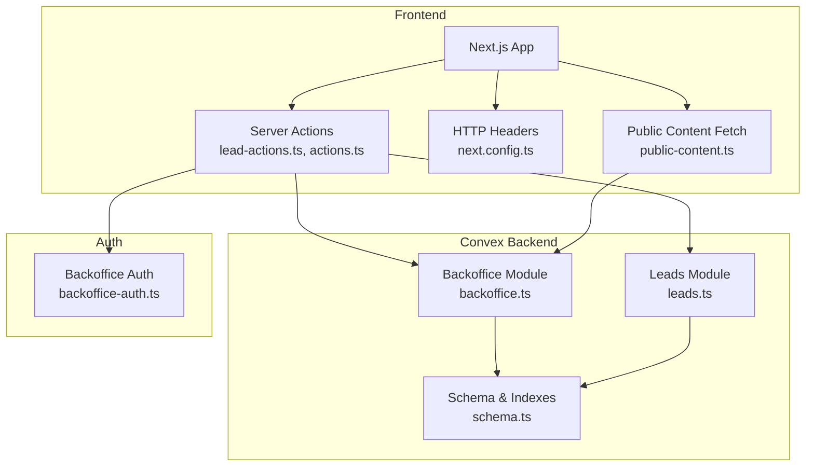
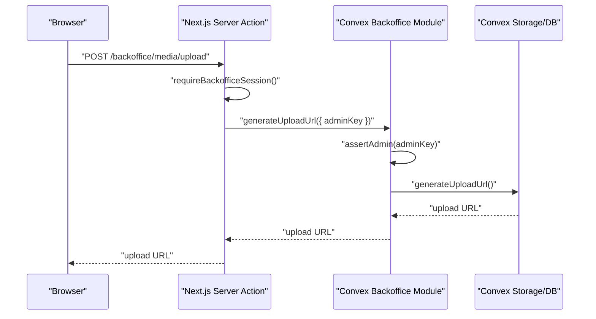
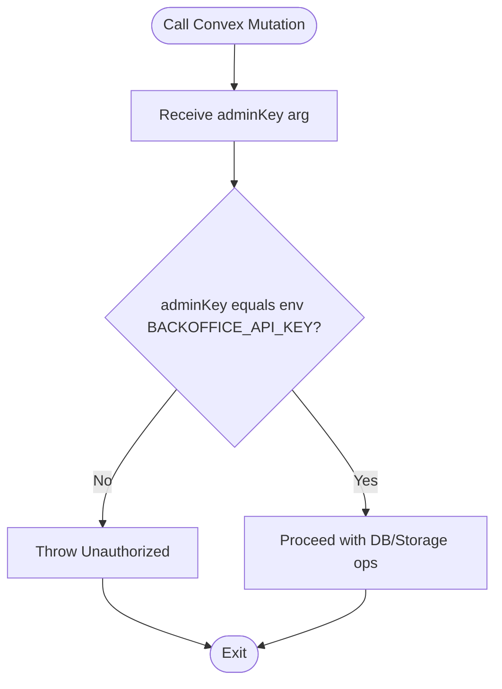
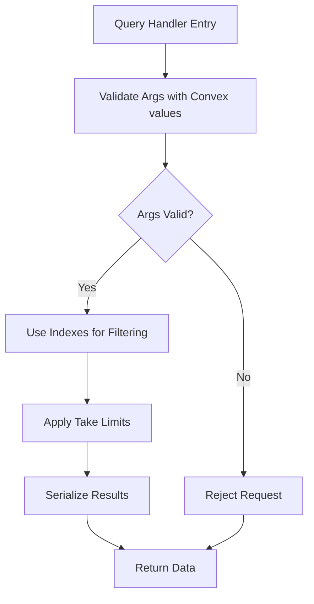
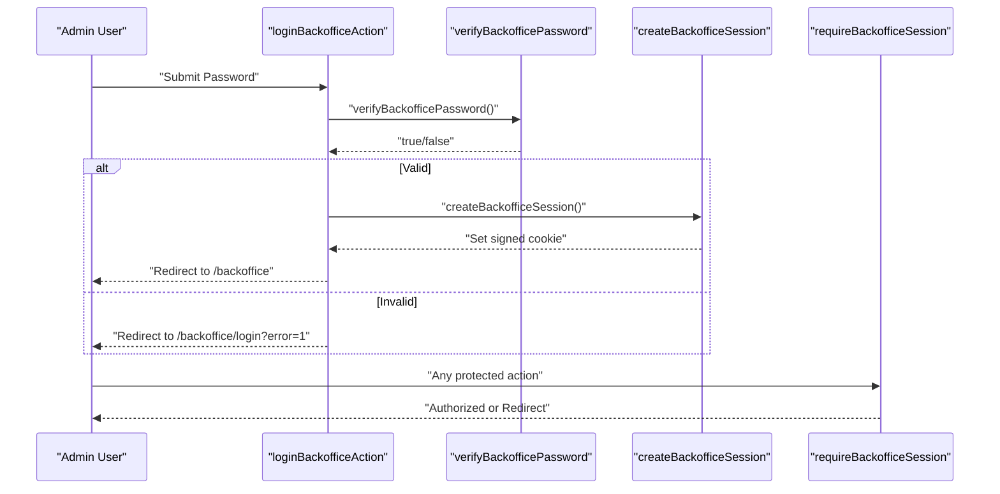
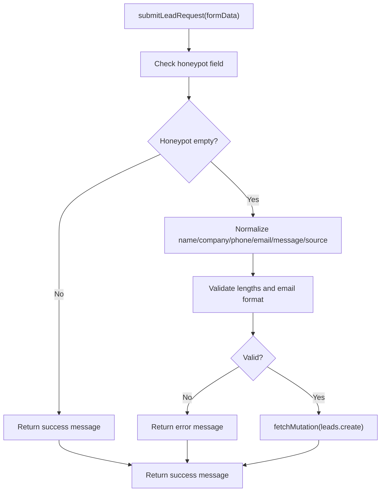
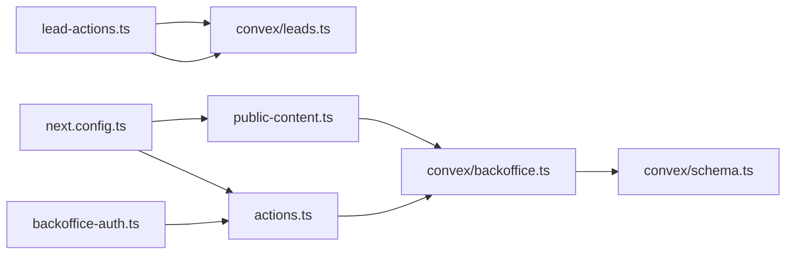

# API Security

<cite>
**Referenced Files in This Document**
- [SECURITY.md](file://docs/SECURITY.md)
- [next.config.ts](file://next.config.ts)
- [backoffice-auth.ts](file://lib/backoffice-auth.ts)
- [actions.ts](file://app/backoffice/actions.ts)
- [lead-actions.ts](file://app/actions/lead-actions.ts)
- [public-content.ts](file://lib/public-content.ts)
- [backoffice.ts](file://convex/backoffice.ts)
- [leads.ts](file://convex/leads.ts)
- [schema.ts](file://convex/schema.ts)
</cite>

## Table of Contents
1. [Introduction](#introduction)
2. [Project Structure](#project-structure)
3. [Core Components](#core-components)
4. [Architecture Overview](#architecture-overview)
5. [Detailed Component Analysis](#detailed-component-analysis)
6. [Dependency Analysis](#dependency-analysis)
7. [Performance Considerations](#performance-considerations)
8. [Troubleshooting Guide](#troubleshooting-guide)
9. [Conclusion](#conclusion)
10. [Appendices](#appendices)

## Introduction
This document provides API security documentation for the Convex backend and related client-side integrations. It focuses on protected endpoints, function-level authorization, query validation, data access patterns, API key management, administrative access controls, server action security patterns, form submission validation, rate limiting and abuse detection mechanisms, security headers, and CORS configuration. It also includes examples of secure API usage patterns, authentication token validation, protected resource access, and security considerations for real-time data synchronization and database query security.

## Project Structure
The security model spans three layers:
- Frontend Next.js application with security headers and server actions
- Convex backend with typed queries/mutations and function-level authorization
- Authentication and session management for administrative access

**Diagram sources**
- [next.config.ts:1-91](file://next.config.ts#L1-L91)
- [backoffice-auth.ts:1-129](file://lib/backoffice-auth.ts#L1-L129)
- [actions.ts:1-215](file://app/backoffice/actions.ts#L1-L215)
- [lead-actions.ts:1-96](file://app/actions/lead-actions.ts#L1-L96)
- [public-content.ts:1-107](file://lib/public-content.ts#L1-L107)
- [backoffice.ts:1-385](file://convex/backoffice.ts#L1-L385)
- [leads.ts:1-32](file://convex/leads.ts#L1-L32)
- [schema.ts:1-87](file://convex/schema.ts#L1-L87)

**Section sources**
- [next.config.ts:1-91](file://next.config.ts#L1-L91)
- [backoffice-auth.ts:1-129](file://lib/backoffice-auth.ts#L1-L129)
- [actions.ts:1-215](file://app/backoffice/actions.ts#L1-L215)
- [lead-actions.ts:1-96](file://app/actions/lead-actions.ts#L1-L96)
- [public-content.ts:1-107](file://lib/public-content.ts#L1-L107)
- [backoffice.ts:1-385](file://convex/backoffice.ts#L1-L385)
- [leads.ts:1-32](file://convex/leads.ts#L1-L32)
- [schema.ts:1-87](file://convex/schema.ts#L1-L87)

## Core Components
- Function-level authorization via API key enforcement in Convex mutations/queries
- Typed argument validation using Convex values
- Administrative session management with signed cookies and expiration checks
- Server action wrappers around Convex calls with input normalization and validation
- Public content retrieval via a dedicated query with controlled exposure
- Security headers and CSP configuration at the Next.js level

**Section sources**
- [backoffice.ts:25-31](file://convex/backoffice.ts#L25-L31)
- [backoffice.ts:68-100](file://convex/backoffice.ts#L68-L100)
- [backoffice.ts:110-184](file://convex/backoffice.ts#L110-L184)
- [backoffice-auth.ts:60-108](file://lib/backoffice-auth.ts#L60-L108)
- [actions.ts:79-108](file://app/backoffice/actions.ts#L79-L108)
- [lead-actions.ts:32-95](file://app/actions/lead-actions.ts#L32-L95)
- [public-content.ts:65-106](file://lib/public-content.ts#L65-L106)
- [next.config.ts:27-61](file://next.config.ts#L27-L61)

## Architecture Overview
The system enforces security at multiple layers:
- Transport and headers: HTTPS enforced with HSTS and restrictive CSP
- Application-level: server actions validate inputs and enforce admin sessions
- Backend-level: Convex functions require an API key and use typed validation
- Data-level: indexes and query patterns restrict access to published/active records

**Diagram sources**
- [actions.ts:79-82](file://app/backoffice/actions.ts#L79-L82)
- [backoffice.ts:68-74](file://convex/backoffice.ts#L68-L74)
- [backoffice-auth.ts:110-118](file://lib/backoffice-auth.ts#L110-L118)

## Detailed Component Analysis

### Function-Level Authorization and API Key Management
- Convex mutations/queries accept an adminKey argument and validate it against an environment variable.
- The API key is retrieved from the server action wrapper and passed to the Convex function.
- The assertion function throws on mismatch, preventing unauthorized access.

**Diagram sources**
- [backoffice.ts:25-31](file://convex/backoffice.ts#L25-L31)
- [backoffice-auth.ts:120-128](file://lib/backoffice-auth.ts#L120-L128)
- [actions.ts:79-82](file://app/backoffice/actions.ts#L79-L82)

**Section sources**
- [backoffice.ts:25-31](file://convex/backoffice.ts#L25-L31)
- [backoffice-auth.ts:120-128](file://lib/backoffice-auth.ts#L120-L128)
- [actions.ts:79-82](file://app/backoffice/actions.ts#L79-L82)

### Query Validation and Data Access Patterns
- Convex values are used to validate arguments for all mutations and queries.
- Queries restrict returned data by indexes and limits to reduce exposure and improve performance.
- Public content query filters by published/active status and aggregates images by category.

**Diagram sources**
- [leads.ts:7-24](file://convex/leads.ts#L7-L24)
- [backoffice.ts:110-118](file://convex/backoffice.ts#L110-L118)
- [backoffice.ts:319-384](file://convex/backoffice.ts#L319-L384)

**Section sources**
- [leads.ts:7-24](file://convex/leads.ts#L7-L24)
- [backoffice.ts:110-118](file://convex/backoffice.ts#L110-L118)
- [backoffice.ts:319-384](file://convex/backoffice.ts#L319-L384)
- [schema.ts:16-85](file://convex/schema.ts#L16-L85)

### Administrative Access Controls
- Admin password is hashed with scrypt and stored in an environment variable.
- Sessions are stored as signed, httpOnly cookies with expiration and SameSite/lax.
- Server actions require a valid session before invoking Convex functions.

**Diagram sources**
- [actions.ts:63-72](file://app/backoffice/actions.ts#L63-L72)
- [backoffice-auth.ts:41-58](file://lib/backoffice-auth.ts#L41-L58)
- [backoffice-auth.ts:60-76](file://lib/backoffice-auth.ts#L60-L76)
- [backoffice-auth.ts:110-118](file://lib/backoffice-auth.ts#L110-L118)

**Section sources**
- [backoffice-auth.ts:41-58](file://lib/backoffice-auth.ts#L41-L58)
- [backoffice-auth.ts:60-76](file://lib/backoffice-auth.ts#L60-L76)
- [backoffice-auth.ts:110-118](file://lib/backoffice-auth.ts#L110-L118)
- [actions.ts:63-72](file://app/backoffice/actions.ts#L63-L72)

### Server Action Security Patterns and Form Submission Validation
- Server actions wrap Convex calls, enforce admin sessions, and sanitize/normalize inputs.
- Lead form action includes a honeypot field, trims and normalizes inputs, validates length/email, and forwards to Convex.

**Diagram sources**
- [lead-actions.ts:32-95](file://app/actions/lead-actions.ts#L32-L95)

**Section sources**
- [lead-actions.ts:32-95](file://app/actions/lead-actions.ts#L32-L95)
- [actions.ts:79-108](file://app/backoffice/actions.ts#L79-L108)

### Rate Limiting and Abuse Detection Mechanisms
- The repository does not implement explicit rate limiting or abuse detection for API endpoints.
- Recommendations include adding rate limiting at the ingress (e.g., CDN or reverse proxy), per-endpoint quotas, and behavioral monitoring.

[No sources needed since this section provides general guidance]

### Security Headers and CORS Configuration
- Strict transport security, CSP, X-Frame-Options, X-Content-Type-Options, Referrer-Policy, Permissions-Policy, COOP, and CORP are set globally.
- Connect-src allows Convex domains and WebSocket origins in development.
- Images are restricted to HTTPS Convex hosts.

**Section sources**
- [next.config.ts:27-61](file://next.config.ts#L27-L61)
- [next.config.ts:63-91](file://next.config.ts#L63-L91)
- [SECURITY.md:5-29](file://docs/SECURITY.md#L5-L29)

### Protected Resource Access and Real-Time Considerations
- Protected resources are accessed via server actions that enforce admin sessions and pass an API key to Convex.
- Convex functions validate arguments and operate within the database’s index-backed query patterns.
- Real-time synchronization is handled by Convex subscriptions; ensure clients only subscribe to permitted data and enforce server-side authorization.

**Section sources**
- [actions.ts:79-108](file://app/backoffice/actions.ts#L79-L108)
- [backoffice.ts:25-31](file://convex/backoffice.ts#L25-L31)
- [schema.ts:16-85](file://convex/schema.ts#L16-L85)

## Dependency Analysis

**Diagram sources**
- [backoffice-auth.ts:1-129](file://lib/backoffice-auth.ts#L1-L129)
- [actions.ts:1-215](file://app/backoffice/actions.ts#L1-L215)
- [lead-actions.ts:1-96](file://app/actions/lead-actions.ts#L1-L96)
- [public-content.ts:1-107](file://lib/public-content.ts#L1-L107)
- [backoffice.ts:1-385](file://convex/backoffice.ts#L1-L385)
- [leads.ts:1-32](file://convex/leads.ts#L1-L32)
- [schema.ts:1-87](file://convex/schema.ts#L1-L87)
- [next.config.ts:1-91](file://next.config.ts#L1-L91)

**Section sources**
- [backoffice-auth.ts:1-129](file://lib/backoffice-auth.ts#L1-L129)
- [actions.ts:1-215](file://app/backoffice/actions.ts#L1-L215)
- [lead-actions.ts:1-96](file://app/actions/lead-actions.ts#L1-L96)
- [public-content.ts:1-107](file://lib/public-content.ts#L1-L107)
- [backoffice.ts:1-385](file://convex/backoffice.ts#L1-L385)
- [leads.ts:1-32](file://convex/leads.ts#L1-L32)
- [schema.ts:1-87](file://convex/schema.ts#L1-L87)
- [next.config.ts:1-91](file://next.config.ts#L1-L91)

## Performance Considerations
- Use indexes and take limits to constrain query results and reduce load.
- Batch operations where possible (e.g., Promise.all for dashboard stats).
- Avoid returning unnecessary fields; keep serialized payloads minimal.

[No sources needed since this section provides general guidance]

## Troubleshooting Guide
- If Convex is not configured, server actions return an error indicating missing environment variables.
- If the admin API key is missing or incorrect, Convex functions reject requests.
- If the admin session is missing or expired, server actions redirect to the login page.
- If the public content endpoint fails, the client falls back to static defaults.

**Section sources**
- [lead-actions.ts:44-49](file://app/actions/lead-actions.ts#L44-L49)
- [backoffice.ts:25-31](file://convex/backoffice.ts#L25-L31)
- [backoffice-auth.ts:110-118](file://lib/backoffice-auth.ts#L110-L118)
- [public-content.ts:67-69](file://lib/public-content.ts#L67-L69)
- [public-content.ts:98-105](file://lib/public-content.ts#L98-L105)

## Conclusion
The system implements layered security: transport and headers hardening, server action validation and session enforcement, function-level authorization via API keys, typed argument validation, and controlled data access patterns. While robust, production deployments should consider adding explicit rate limiting and abuse detection mechanisms and ensuring environment variables are properly managed and rotated.

## Appendices

### Secure API Usage Examples
- Admin upload flow:
  - Authenticate via admin login to establish a signed session
  - Call the server action to generate an upload URL
  - Pass the generated URL to the client for direct uploads
  - On completion, create a media asset record by calling the server action that invokes the Convex mutation with the API key

- Lead submission flow:
  - Submit the form on the client
  - The server action normalizes inputs and validates them
  - Forward validated data to the Convex mutation for persistence

- Public content retrieval:
  - Fetch public content via the public query
  - Merge with fallback defaults if the backend is unavailable

**Section sources**
- [actions.ts:79-82](file://app/backoffice/actions.ts#L79-L82)
- [lead-actions.ts:32-95](file://app/actions/lead-actions.ts#L32-L95)
- [public-content.ts:65-106](file://lib/public-content.ts#L65-L106)