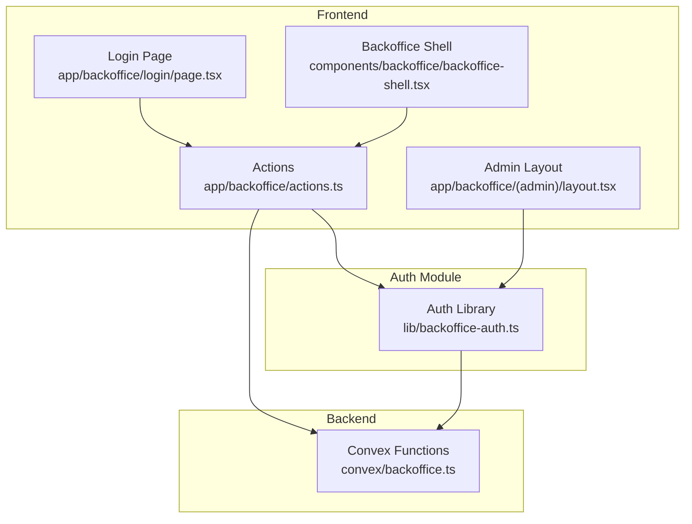
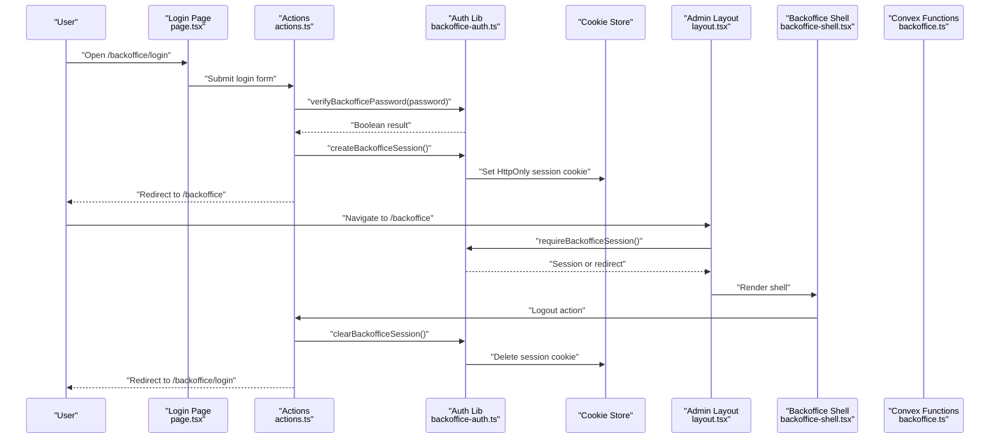
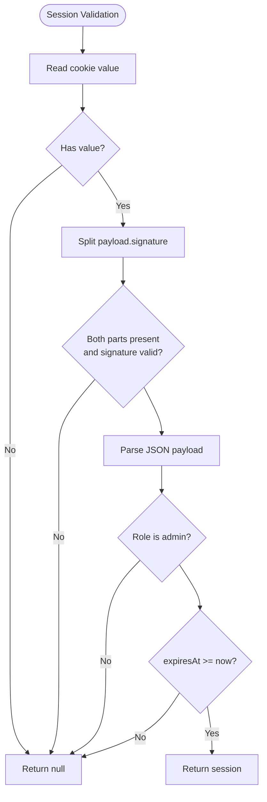
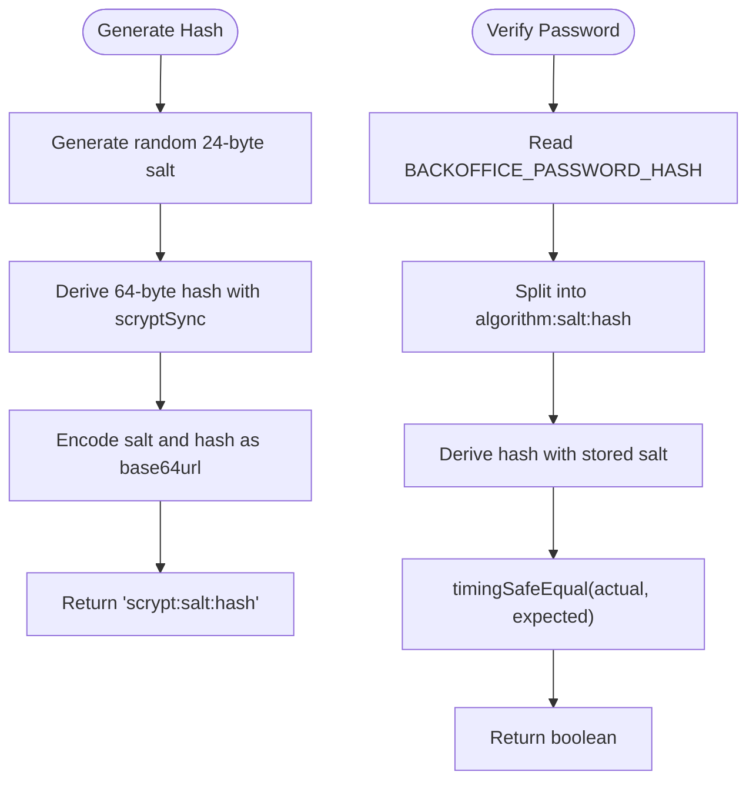
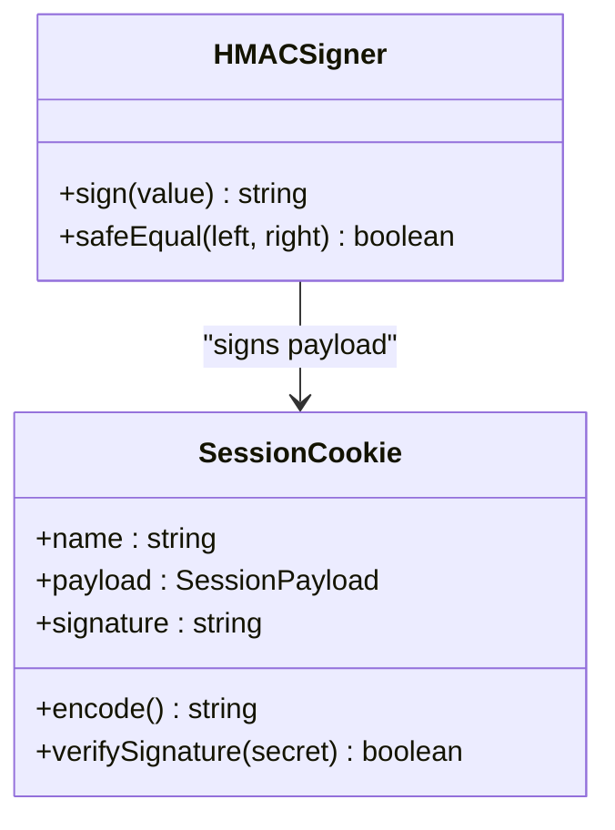
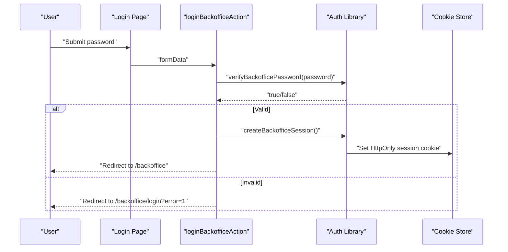
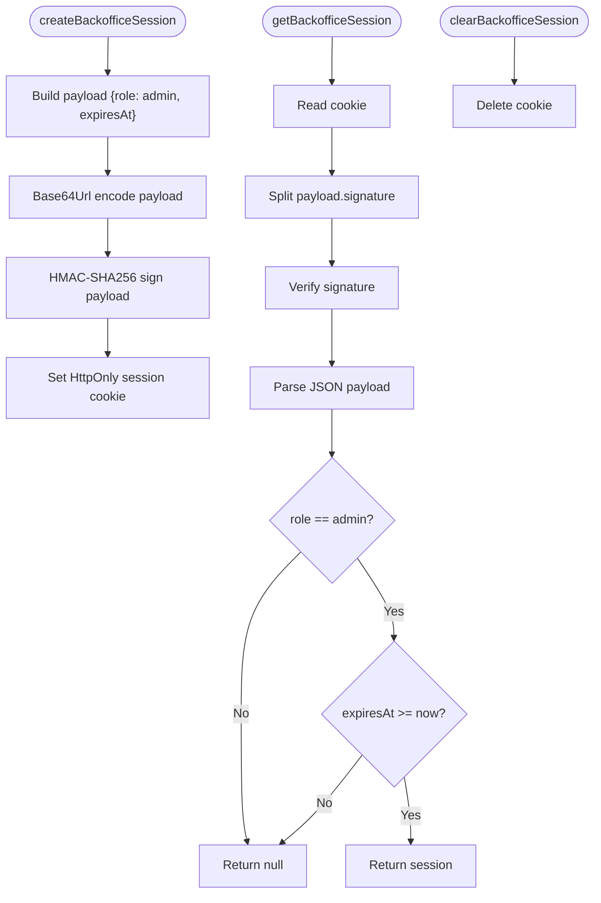
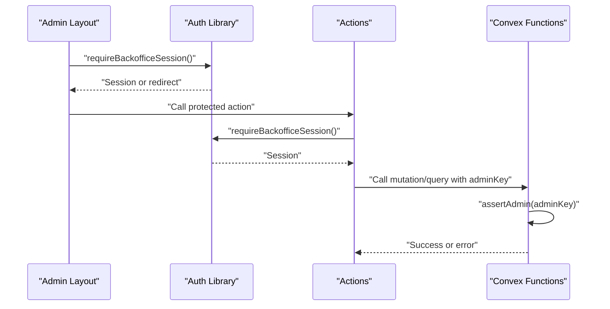
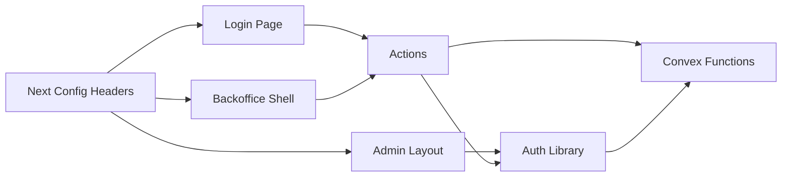

# Authentication & Authorization

<cite>
**Referenced Files in This Document**
- [lib/backoffice-auth.ts](file://lib/backoffice-auth.ts)
- [app/backoffice/actions.ts](file://app/backoffice/actions.ts)
- [app/backoffice/login/page.tsx](file://app/backoffice/login/page.tsx)
- [app/backoffice/(admin)/layout.tsx](file://app/backoffice/(admin)/layout.tsx)
- [components/backoffice/backoffice-shell.tsx](file://components/backoffice/backoffice-shell.tsx)
- [convex/backoffice.ts](file://convex/backoffice.ts)
- [docs/BACKOFFICE.md](file://docs/BACKOFFICE.md)
- [docs/CONVEX.md](file://docs/CONVEX.md)
- [docs/SECURITY.md](file://docs/SECURITY.md)
- [next.config.ts](file://next.config.ts)
- [package.json](file://package.json)
</cite>

## Table of Contents
1. [Introduction](#introduction)
2. [Project Structure](#project-structure)
3. [Core Components](#core-components)
4. [Architecture Overview](#architecture-overview)
5. [Detailed Component Analysis](#detailed-component-analysis)
6. [Dependency Analysis](#dependency-analysis)
7. [Performance Considerations](#performance-considerations)
8. [Troubleshooting Guide](#troubleshooting-guide)
9. [Conclusion](#conclusion)
10. [Appendices](#appendices)

## Introduction
This document explains the authentication and authorization model for the backoffice system. It covers session-based authentication, password hashing with scrypt, secure cookie management, login flow, session lifecycle, automatic expiration, role-based access control (RBAC), and cryptographic implementation details including HMAC signing and timing-safe comparisons. It also documents environment variable requirements, implementation examples for login handlers, session validation middleware, protected route guards, and security considerations for cookies, HTTPS enforcement, and session security best practices.

## Project Structure
The backoffice authentication spans several layers:
- Frontend pages and actions handle login/logout and protect routes.
- A dedicated authentication module manages password hashing, session creation/validation, and cookie signing.
- Convex functions enforce RBAC using an API key alongside session validation.
- Security headers and configuration enforce HTTPS and harden the application.

**Diagram sources**
- [app/backoffice/login/page.tsx:17-68](file://app/backoffice/login/page.tsx#L17-L68)
- [app/backoffice/(admin)/layout.tsx:17-21](file://app/backoffice/(admin)/layout.tsx#L17-L21)
- [components/backoffice/backoffice-shell.tsx:17-77](file://components/backoffice/backoffice-shell.tsx#L17-L77)
- [app/backoffice/actions.ts:63-77](file://app/backoffice/actions.ts#L63-L77)
- [lib/backoffice-auth.ts:60-128](file://lib/backoffice-auth.ts#L60-L128)
- [convex/backoffice.ts:25-31](file://convex/backoffice.ts#L25-L31)

**Section sources**
- [app/backoffice/login/page.tsx:17-68](file://app/backoffice/login/page.tsx#L17-L68)
- [app/backoffice/(admin)/layout.tsx:17-21](file://app/backoffice/(admin)/layout.tsx#L17-L21)
- [components/backoffice/backoffice-shell.tsx:17-77](file://components/backoffice/backoffice-shell.tsx#L17-L77)
- [app/backoffice/actions.ts:63-77](file://app/backoffice/actions.ts#L63-L77)
- [lib/backoffice-auth.ts:60-128](file://lib/backoffice-auth.ts#L60-L128)
- [convex/backoffice.ts:25-31](file://convex/backoffice.ts#L25-L31)

## Core Components
- Password hashing and verification: Uses scrypt with a random salt and timing-safe comparison.
- Session creation and validation: Encodes a JSON payload, signs it with HMAC-SHA256, stores as an HttpOnly cookie, and enforces expiration.
- Login/logout handlers: Server actions validate credentials and manage sessions.
- Protected route guard: Middleware that requires a valid session before rendering admin pages.
- RBAC: Convex functions assert admin access using a shared API key.

Key implementation references:
- Password hashing and verification: [lib/backoffice-auth.ts:35-58](file://lib/backoffice-auth.ts#L35-L58)
- Session creation and cookie attributes: [lib/backoffice-auth.ts:60-76](file://lib/backoffice-auth.ts#L60-L76)
- Session validation and expiration: [lib/backoffice-auth.ts:83-108](file://lib/backoffice-auth.ts#L83-L108)
- Login handler: [app/backoffice/actions.ts:63-72](file://app/backoffice/actions.ts#L63-L72)
- Logout handler: [app/backoffice/actions.ts:74-77](file://app/backoffice/actions.ts#L74-L77)
- Protected route guard: [app/backoffice/(admin)/layout.tsx:17-21](file://app/backoffice/(admin)/layout.tsx#L17-L21)
- RBAC enforcement: [convex/backoffice.ts:25-31](file://convex/backoffice.ts#L25-L31)

**Section sources**
- [lib/backoffice-auth.ts:35-108](file://lib/backoffice-auth.ts#L35-L108)
- [app/backoffice/actions.ts:63-77](file://app/backoffice/actions.ts#L63-L77)
- [app/backoffice/(admin)/layout.tsx:17-21](file://app/backoffice/(admin)/layout.tsx#L17-L21)
- [convex/backoffice.ts:25-31](file://convex/backoffice.ts#L25-L31)

## Architecture Overview
The backoffice authentication architecture combines client-side session cookies with server-side validation and Convex RBAC.

**Diagram sources**
- [app/backoffice/login/page.tsx:17-68](file://app/backoffice/login/page.tsx#L17-L68)
- [app/backoffice/actions.ts:63-77](file://app/backoffice/actions.ts#L63-L77)
- [lib/backoffice-auth.ts:60-118](file://lib/backoffice-auth.ts#L60-L118)
- [app/backoffice/(admin)/layout.tsx:17-21](file://app/backoffice/(admin)/layout.tsx#L17-L21)
- [components/backoffice/backoffice-shell.tsx:17-77](file://components/backoffice/backoffice-shell.tsx#L17-L77)
- [convex/backoffice.ts:25-31](file://convex/backoffice.ts#L25-L31)

## Detailed Component Analysis

### Session-Based Authentication
- Cookie name: adiki_backoffice_session
- Payload: role and expiresAt
- Signing: HMAC-SHA256 over base64url-encoded payload using BACKOFFICE_SESSION_SECRET
- Attributes: HttpOnly, SameSite=Lax, Secure in production, path=/, maxAge=8 hours
- Expiration: expiresAt checked during validation

**Diagram sources**
- [lib/backoffice-auth.ts:83-108](file://lib/backoffice-auth.ts#L83-L108)

**Section sources**
- [lib/backoffice-auth.ts:6-12](file://lib/backoffice-auth.ts#L6-L12)
- [lib/backoffice-auth.ts:60-76](file://lib/backoffice-auth.ts#L60-L76)
- [lib/backoffice-auth.ts:83-108](file://lib/backoffice-auth.ts#L83-L108)

### Password Hashing with Scrypt
- Generation: Random 24-byte salt, derive 64-byte hash using scryptSync
- Storage format: scrypt:salt:hash (base64url)
- Verification: Split stored format, derive hash with stored salt, compare with timing-safe equality

**Diagram sources**
- [lib/backoffice-auth.ts:35-58](file://lib/backoffice-auth.ts#L35-L58)

**Section sources**
- [lib/backoffice-auth.ts:35-58](file://lib/backoffice-auth.ts#L35-L58)

### HMAC Signing and Timing-Safe Comparisons
- Signing: HMAC-SHA256 over base64url-encoded payload using BACKOFFICE_SESSION_SECRET
- Verification: Constant-time comparison using timingSafeEqual
- Cookie integrity: Signature ensures tamper detection

**Diagram sources**
- [lib/backoffice-auth.ts:18-33](file://lib/backoffice-auth.ts#L18-L33)
- [lib/backoffice-auth.ts:60-76](file://lib/backoffice-auth.ts#L60-L76)

**Section sources**
- [lib/backoffice-auth.ts:18-33](file://lib/backoffice-auth.ts#L18-L33)
- [lib/backoffice-auth.ts:60-76](file://lib/backoffice-auth.ts#L60-L76)

### Login Flow
- The login page checks for an existing session and redirects authenticated users away from the login route.
- On submission, the server action verifies the password and creates a session cookie.
- On failure, the user is redirected back to the login page with an error indicator.

**Diagram sources**
- [app/backoffice/login/page.tsx:22-26](file://app/backoffice/login/page.tsx#L22-L26)
- [app/backoffice/actions.ts:63-72](file://app/backoffice/actions.ts#L63-L72)
- [lib/backoffice-auth.ts:41-58](file://lib/backoffice-auth.ts#L41-L58)
- [lib/backoffice-auth.ts:60-76](file://lib/backoffice-auth.ts#L60-L76)

**Section sources**
- [app/backoffice/login/page.tsx:17-68](file://app/backoffice/login/page.tsx#L17-L68)
- [app/backoffice/actions.ts:63-72](file://app/backoffice/actions.ts#L63-L72)
- [lib/backoffice-auth.ts:41-58](file://lib/backoffice-auth.ts#L41-L58)
- [lib/backoffice-auth.ts:60-76](file://lib/backoffice-auth.ts#L60-L76)

### Session Lifecycle Management
- Creation: Build payload, encode, sign, set cookie with HttpOnly, SameSite, Secure, path, and maxAge.
- Validation: Read cookie, split payload/signature, verify signature, parse JSON, check role and expiration.
- Clearing: Delete the session cookie.

**Diagram sources**
- [lib/backoffice-auth.ts:60-108](file://lib/backoffice-auth.ts#L60-L108)

**Section sources**
- [lib/backoffice-auth.ts:60-108](file://lib/backoffice-auth.ts#L60-L108)

### Role-Based Access Control (RBAC)
- Session-based RBAC: Only "admin" role is permitted.
- Convex RBAC: All protected mutations/queries assert admin access using BACKOFFICE_API_KEY.
- Combined protection: Session validation plus API key verification.

**Diagram sources**
- [app/backoffice/(admin)/layout.tsx:17-21](file://app/backoffice/(admin)/layout.tsx#L17-L21)
- [lib/backoffice-auth.ts:110-118](file://lib/backoffice-auth.ts#L110-L118)
- [app/backoffice/actions.ts:79-82](file://app/backoffice/actions.ts#L79-L82)
- [convex/backoffice.ts:25-31](file://convex/backoffice.ts#L25-L31)

**Section sources**
- [app/backoffice/(admin)/layout.tsx:17-21](file://app/backoffice/(admin)/layout.tsx#L17-L21)
- [lib/backoffice-auth.ts:110-118](file://lib/backoffice-auth.ts#L110-L118)
- [app/backoffice/actions.ts:79-82](file://app/backoffice/actions.ts#L79-L82)
- [convex/backoffice.ts:25-31](file://convex/backoffice.ts#L25-L31)

### Implementation Examples

#### Login Handler
- Action: [app/backoffice/actions.ts:63-72](file://app/backoffice/actions.ts#L63-L72)
- Verifies password using: [lib/backoffice-auth.ts:41-58](file://lib/backoffice-auth.ts#L41-L58)
- Creates session using: [lib/backoffice-auth.ts:60-76](file://lib/backoffice-auth.ts#L60-L76)

#### Session Validation Middleware
- Protected route guard: [app/backoffice/(admin)/layout.tsx:17-21](file://app/backoffice/(admin)/layout.tsx#L17-L21)
- Requires session using: [lib/backoffice-auth.ts:110-118](file://lib/backoffice-auth.ts#L110-L118)

#### Protected Route Guards
- Protected actions: [app/backoffice/actions.ts:79-214](file://app/backoffice/actions.ts#L79-L214)
- Require session at the start of each action using: [lib/backoffice-auth.ts:110-118](file://lib/backoffice-auth.ts#L110-L118)

#### Logout Handler
- Clears session using: [lib/backoffice-auth.ts:78-81](file://lib/backoffice-auth.ts#L78-L81)
- Redirects to login: [app/backoffice/actions.ts:74-77](file://app/backoffice/actions.ts#L74-L77)

**Section sources**
- [app/backoffice/actions.ts:63-77](file://app/backoffice/actions.ts#L63-L77)
- [app/backoffice/actions.ts:79-214](file://app/backoffice/actions.ts#L79-L214)
- [lib/backoffice-auth.ts:41-58](file://lib/backoffice-auth.ts#L41-L58)
- [lib/backoffice-auth.ts:60-81](file://lib/backoffice-auth.ts#L60-L81)
- [lib/backoffice-auth.ts:110-118](file://lib/backoffice-auth.ts#L110-L118)

## Dependency Analysis
- Frontend pages/actions depend on the auth library for password verification and session management.
- Convex functions depend on the API key for RBAC enforcement.
- The auth library depends on Node.js crypto primitives and Next.js cookies API.
- Security headers enforce HTTPS and hardening at the framework level.

**Diagram sources**
- [app/backoffice/login/page.tsx:17-68](file://app/backoffice/login/page.tsx#L17-L68)
- [app/backoffice/(admin)/layout.tsx:17-21](file://app/backoffice/(admin)/layout.tsx#L17-L21)
- [components/backoffice/backoffice-shell.tsx:17-77](file://components/backoffice/backoffice-shell.tsx#L17-L77)
- [app/backoffice/actions.ts:63-77](file://app/backoffice/actions.ts#L63-L77)
- [lib/backoffice-auth.ts:60-118](file://lib/backoffice-auth.ts#L60-L118)
- [convex/backoffice.ts:25-31](file://convex/backoffice.ts#L25-L31)
- [next.config.ts:27-90](file://next.config.ts#L27-L90)

**Section sources**
- [app/backoffice/login/page.tsx:17-68](file://app/backoffice/login/page.tsx#L17-L68)
- [app/backoffice/(admin)/layout.tsx:17-21](file://app/backoffice/(admin)/layout.tsx#L17-L21)
- [components/backoffice/backoffice-shell.tsx:17-77](file://components/backoffice/backoffice-shell.tsx#L17-L77)
- [app/backoffice/actions.ts:63-77](file://app/backoffice/actions.ts#L63-L77)
- [lib/backoffice-auth.ts:60-118](file://lib/backoffice-auth.ts#L60-L118)
- [convex/backoffice.ts:25-31](file://convex/backoffice.ts#L25-L31)
- [next.config.ts:27-90](file://next.config.ts#L27-L90)

## Performance Considerations
- Scrypt cost parameters: The implementation uses a fixed memory and CPU cost suitable for server environments. Adjusting parameters affects verification latency and resource usage.
- HMAC signing: Minimal overhead; constant-time comparison prevents timing attacks without significant performance impact.
- Cookie size: Base64Url-encoded payload is small; signature adds negligible overhead.
- Session expiration: Client-side maxAge reduces server-side cleanup; expired sessions are rejected server-side regardless.

[No sources needed since this section provides general guidance]

## Troubleshooting Guide
Common issues and resolutions:
- Missing environment variables:
  - BACKOFFICE_SESSION_SECRET: Required for signing; throws if missing.
  - BACKOFFICE_PASSWORD_HASH: Required for verification; throws if missing or malformed.
  - BACKOFFICE_API_KEY: Required for Convex RBAC; throws if missing.
  - References: [lib/backoffice-auth.ts:18-25](file://lib/backoffice-auth.ts#L18-L25), [lib/backoffice-auth.ts:41-52](file://lib/backoffice-auth.ts#L41-L52), [lib/backoffice-auth.ts:120-127](file://lib/backoffice-auth.ts#L120-L127), [convex/backoffice.ts:25-31](file://convex/backoffice.ts#L25-L31)
- Invalid password hash format:
  - Must be "scrypt:salt:hash"; throws on mismatch.
  - Reference: [lib/backoffice-auth.ts:48-52](file://lib/backoffice-auth.ts#L48-L52)
- Session not recognized:
  - Missing cookie, tampered signature, expired session, or wrong role.
  - Reference: [lib/backoffice-auth.ts:83-108](file://lib/backoffice-auth.ts#L83-L108)
- Redirect loops:
  - Ensure login page redirects authenticated users away from login.
  - Reference: [app/backoffice/login/page.tsx:22-26](file://app/backoffice/login/page.tsx#L22-L26)
- HTTPS enforcement:
  - Cookies marked secure only in production; ensure HTTPS in production.
  - Reference: [lib/backoffice-auth.ts:72](file://lib/backoffice-auth.ts#L72), [next.config.ts:33-35](file://next.config.ts#L33-L35)

**Section sources**
- [lib/backoffice-auth.ts:18-25](file://lib/backoffice-auth.ts#L18-L25)
- [lib/backoffice-auth.ts:41-52](file://lib/backoffice-auth.ts#L41-L52)
- [lib/backoffice-auth.ts:83-108](file://lib/backoffice-auth.ts#L83-L108)
- [app/backoffice/login/page.tsx:22-26](file://app/backoffice/login/page.tsx#L22-L26)
- [lib/backoffice-auth.ts:72](file://lib/backoffice-auth.ts#L72)
- [next.config.ts:33-35](file://next.config.ts#L33-L35)

## Conclusion
The backoffice authentication system uses a robust session-based model with scrypt password hashing, HMAC-signed cookies, and constant-time comparisons. Session validation occurs at the route guard and action boundaries, while Convex enforces RBAC via an API key. HTTPS enforcement and security headers further strengthen the system. Proper environment configuration and adherence to session security best practices ensure a secure and reliable administrative interface.

[No sources needed since this section summarizes without analyzing specific files]

## Appendices

### Environment Variables
Required variables:
- BACKOFFICE_API_KEY: Secret key used by Convex functions to authorize admin actions.
- BACKOFFICE_PASSWORD_HASH: Stored password hash in "scrypt:salt:hash" format.
- BACKOFFICE_SESSION_SECRET: Secret used to sign session cookies.

References:
- [docs/BACKOFFICE.md:15-21](file://docs/BACKOFFICE.md#L15-L21)
- [docs/CONVEX.md:18-25](file://docs/CONVEX.md#L18-L25)
- [lib/backoffice-auth.ts:18-25](file://lib/backoffice-auth.ts#L18-L25)
- [lib/backoffice-auth.ts:41-52](file://lib/backoffice-auth.ts#L41-L52)
- [lib/backoffice-auth.ts:120-127](file://lib/backoffice-auth.ts#L120-L127)

**Section sources**
- [docs/BACKOFFICE.md:15-21](file://docs/BACKOFFICE.md#L15-L21)
- [docs/CONVEX.md:18-25](file://docs/CONVEX.md#L18-L25)
- [lib/backoffice-auth.ts:18-25](file://lib/backoffice-auth.ts#L18-L25)
- [lib/backoffice-auth.ts:41-52](file://lib/backoffice-auth.ts#L41-L52)
- [lib/backoffice-auth.ts:120-127](file://lib/backoffice-auth.ts#L120-L127)

### Security Best Practices
- Use HTTPS in production to enable Secure cookies and HSTS.
- Enforce Strict-Transport-Security and other security headers.
- Keep secrets rotated and restrict access to environment variables.
- Validate and sanitize all inputs on the server side.
- Limit session duration and ensure clients clear cookies on logout.

References:
- [next.config.ts:27-90](file://next.config.ts#L27-L90)
- [docs/SECURITY.md:17-23](file://docs/SECURITY.md#L17-L23)
- [lib/backoffice-auth.ts:72](file://lib/backoffice-auth.ts#L72)

**Section sources**
- [next.config.ts:27-90](file://next.config.ts#L27-L90)
- [docs/SECURITY.md:17-23](file://docs/SECURITY.md#L17-L23)
- [lib/backoffice-auth.ts:72](file://lib/backoffice-auth.ts#L72)