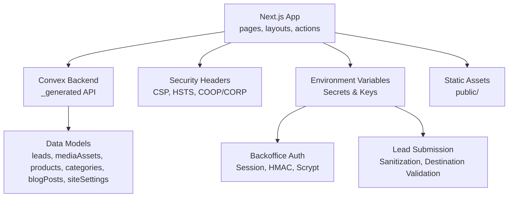
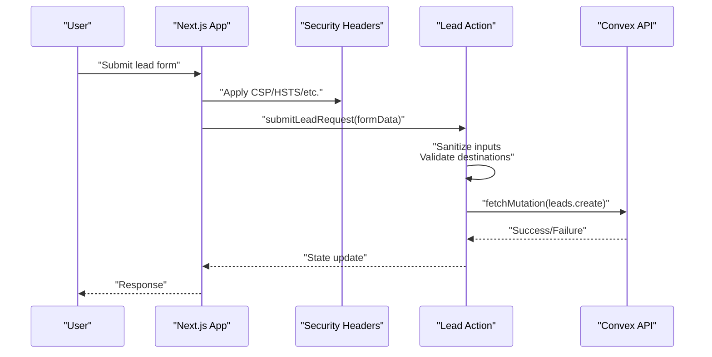
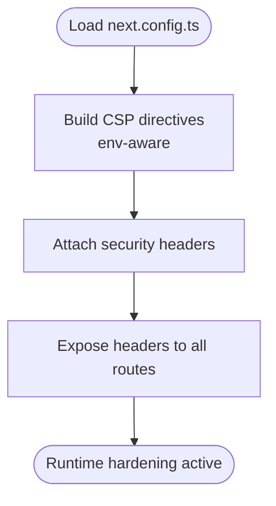
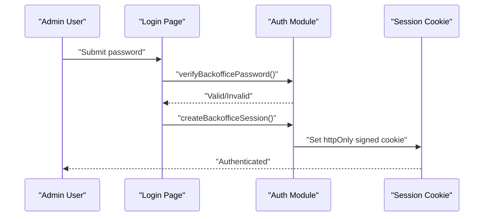
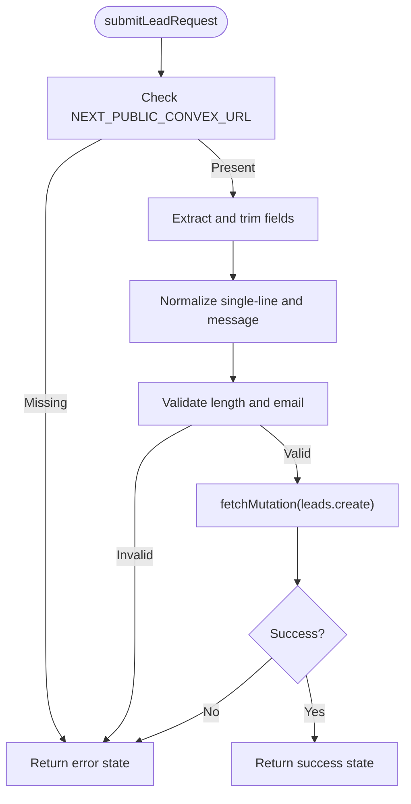
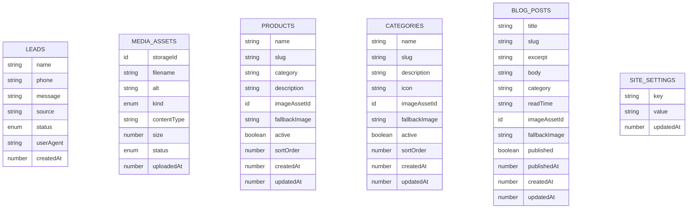
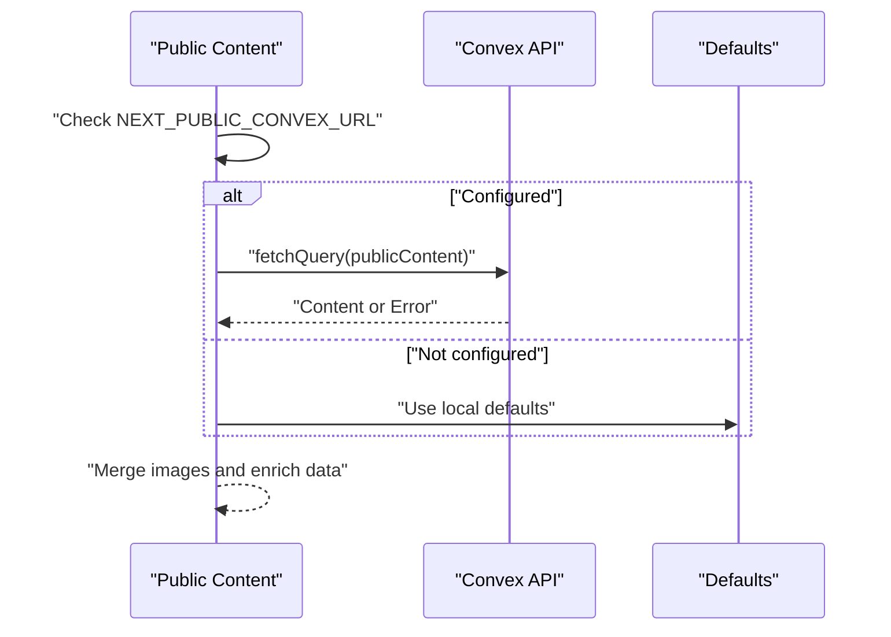
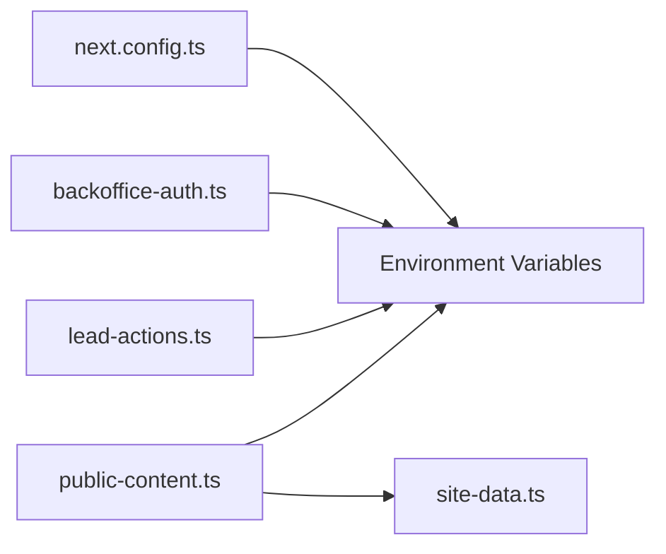

# Deployment Security

<cite>
**Referenced Files in This Document**
- [SECURITY.md](file://docs/SECURITY.md)
- [next.config.ts](file://next.config.ts)
- [package.json](file://package.json)
- [backoffice-auth.ts](file://lib/backoffice-auth.ts)
- [lead-actions.ts](file://app/actions/lead-actions.ts)
- [layout.tsx](file://app/backoffice/(admin)/layout.tsx)
- [page.tsx](file://app/backoffice/login/page.tsx)
- [public-content.ts](file://lib/public-content.ts)
- [schema.ts](file://convex/schema.ts)
- [site-data.ts](file://lib/site-data.ts)
</cite>

## Table of Contents
1. [Introduction](#introduction)
2. [Project Structure](#project-structure)
3. [Core Components](#core-components)
4. [Architecture Overview](#architecture-overview)
5. [Detailed Component Analysis](#detailed-component-analysis)
6. [Dependency Analysis](#dependency-analysis)
7. [Performance Considerations](#performance-considerations)
8. [Troubleshooting Guide](#troubleshooting-guide)
9. [Conclusion](#conclusion)
10. [Appendices](#appendices)

## Introduction
This document consolidates deployment security practices for the project, focusing on production-grade configurations, environment variable management, Vercel deployment considerations, certificate and TLS enforcement, static asset and CDN security, backup and disaster recovery, monitoring and incident response, and environment-specific protections. It synthesizes the existing security posture documented in the repository and maps it to concrete deployment controls.

## Project Structure
The repository follows a Next.js application structure with a dedicated Convex backend module and a small set of security-focused utilities and configuration files. Key security-relevant areas include:
- Next.js runtime hardening via headers and image remote patterns
- Environment variable-backed authentication and session signing
- Lead capture pipeline with sanitization and destination checks
- Convex schema defining data models and indexes
- Static content retrieval and fallback mechanisms

**Diagram sources**
- [next.config.ts:1-91](file://next.config.ts#L1-L91)
- [backoffice-auth.ts:1-129](file://lib/backoffice-auth.ts#L1-L129)
- [lead-actions.ts:1-96](file://app/actions/lead-actions.ts#L1-L96)
- [schema.ts:1-87](file://convex/schema.ts#L1-L87)

**Section sources**
- [next.config.ts:1-91](file://next.config.ts#L1-L91)
- [package.json:1-51](file://package.json#L1-L51)

## Core Components
- Runtime hardening and headers: CSP, HSTS, X-Content-Type-Options, X-Frame-Options, Referrer-Policy, Permissions-Policy, Cross-Origin policies.
- Image remote patterns and local-first asset strategy.
- Backoffice authentication with HMAC-signed sessions, scrypt password hashing, and environment-secret-driven signing.
- Lead submission pipeline with sanitization, destination validation, and Convex mutation invocation.
- Convex schema defining data models and indexes for content and media.
- Static content retrieval with fallbacks and environment checks.

**Section sources**
- [SECURITY.md:1-29](file://docs/SECURITY.md#L1-L29)
- [next.config.ts:8-61](file://next.config.ts#L8-L61)
- [backoffice-auth.ts:18-26](file://lib/backoffice-auth.ts#L18-L26)
- [lead-actions.ts:32-95](file://app/actions/lead-actions.ts#L32-L95)
- [schema.ts:4-86](file://convex/schema.ts#L4-L86)
- [public-content.ts:65-106](file://lib/public-content.ts#L65-L106)

## Architecture Overview
The deployment architecture integrates client-side Next.js rendering with a serverless Convex backend. Security is enforced at the edge via Next.js headers and at the application level through environment variables and cryptographic primitives.

**Diagram sources**
- [next.config.ts:27-61](file://next.config.ts#L27-L61)
- [lead-actions.ts:32-95](file://app/actions/lead-actions.ts#L32-L95)

## Detailed Component Analysis

### Next.js Security Headers and CSP
- Content-Security-Policy is dynamically constructed to restrict script, style, connect, frame, and object sources, with environment-aware allowances for development.
- Strict-Transport-Security enforces HTTPS in production.
- X-Content-Type-Options, X-Frame-Options, Referrer-Policy, and Permissions-Policy reduce common attack vectors.
- Cross-Origin-Opener-Policy and Cross-Origin-Resource-Policy enforce basic isolation.

**Diagram sources**
- [next.config.ts:8-61](file://next.config.ts#L8-L61)

**Section sources**
- [next.config.ts:8-61](file://next.config.ts#L8-L61)
- [SECURITY.md:5-15](file://docs/SECURITY.md#L5-L15)

### Backoffice Authentication and Session Management
- Sessions are stored in an httpOnly cookie with a base64url-encoded payload signed by a secret from the environment.
- Password verification uses scrypt with a stored salt and constant-time comparison.
- Session expiry and role checks gate protected routes.
- API key retrieval is guarded by environment configuration.

**Diagram sources**
- [page.tsx:17-69](file://app/backoffice/login/page.tsx#L17-L69)
- [backoffice-auth.ts:41-58](file://lib/backoffice-auth.ts#L41-L58)
- [backoffice-auth.ts:60-81](file://lib/backoffice-auth.ts#L60-L81)

**Section sources**
- [backoffice-auth.ts:6-129](file://lib/backoffice-auth.ts#L6-L129)
- [layout.tsx:17-21](file://app/backoffice/(admin)/layout.tsx#L17-L21)

### Lead Submission Pipeline and Sanitization
- Form data is sanitized and validated before invoking Convex mutations.
- Destination URLs for forms are constrained to approved origins.
- Environment checks ensure Convex is configured before submission.

**Diagram sources**
- [lead-actions.ts:32-95](file://app/actions/lead-actions.ts#L32-L95)

**Section sources**
- [lead-actions.ts:32-95](file://app/actions/lead-actions.ts#L32-L95)

### Convex Schema and Data Protection
- Defines tables for leads, media assets, products, categories, blog posts, and site settings.
- Includes indexes for efficient queries and status-based filtering.
- Storage references are modeled using Convex’s storage ID types.

**Diagram sources**
- [schema.ts:4-86](file://convex/schema.ts#L4-L86)

**Section sources**
- [schema.ts:4-86](file://convex/schema.ts#L4-L86)

### Static Content Retrieval and Fallbacks
- Public content retrieval checks for Convex configuration and falls back to local defaults when unavailable.
- Local image library ensures assets remain served from trusted origins.

**Diagram sources**
- [public-content.ts:65-106](file://lib/public-content.ts#L65-L106)
- [site-data.ts:52-70](file://lib/site-data.ts#L52-L70)

**Section sources**
- [public-content.ts:65-106](file://lib/public-content.ts#L65-L106)
- [site-data.ts:52-70](file://lib/site-data.ts#L52-L70)

## Dependency Analysis
- Next.js configuration depends on environment variables for development allowances and production enforcement.
- Backoffice authentication depends on environment variables for secrets and keys.
- Lead submission depends on Convex configuration and mutation availability.
- Public content retrieval depends on Convex configuration and local defaults.

**Diagram sources**
- [next.config.ts:6,14,15:6-16](file://next.config.ts#L6-L16)
- [backoffice-auth.ts:19,42,121](file://lib/backoffice-auth.ts#L19,L42,L121)
- [lead-actions.ts:44,75](file://app/actions/lead-actions.ts#L44,L75)
- [public-content.ts:67,71](file://lib/public-content.ts#L67,L71)

**Section sources**
- [next.config.ts:6,14,15:6-16](file://next.config.ts#L6-L16)
- [backoffice-auth.ts:19,42,121](file://lib/backoffice-auth.ts#L19,L42,L121)
- [lead-actions.ts:44,75](file://app/actions/lead-actions.ts#L44,L75)
- [public-content.ts:67,71](file://lib/public-content.ts#L67,L71)

## Performance Considerations
- Keep CSP restrictive to minimize render-time script evaluation and external resource loading.
- Prefer local assets for critical images to reduce latency and dependency on third-party CDNs.
- Limit connect-src origins to only those required by the application to reduce network overhead and exposure.

[No sources needed since this section provides general guidance]

## Troubleshooting Guide
- If backoffice login fails, verify the presence of required environment variables for session secret, password hash, and API key.
- If lead submissions fail, confirm Convex URL is configured and reachable; inspect returned error messages for actionable diagnostics.
- If static content is missing, check Convex configuration and ensure fallback defaults are acceptable.

**Section sources**
- [backoffice-auth.ts:21,44,123](file://lib/backoffice-auth.ts#L21,L44,L123)
- [lead-actions.ts:44,89](file://app/actions/lead-actions.ts#L44,L89)
- [public-content.ts:67,98](file://lib/public-content.ts#L67,L98)

## Conclusion
The project implements a pragmatic, layered security model: runtime hardening via CSP and HSTS, environment-variable-driven secrets and keys, cryptographic session signing, input sanitization, and controlled asset sourcing. These controls collectively reduce the attack surface and strengthen production deployments.

[No sources needed since this section summarizes without analyzing specific files]

## Appendices

### Environment Variable Management and Secret Rotation
- Session secret: used to sign backoffice session payloads; rotate by generating a new secret and updating the environment, then redeploying.
- Password hash: stored scrypt hash of the admin password; rotate by regenerating the hash with a new salt and updating the environment.
- API key: used for administrative access; rotate by generating a new key and updating the environment.
- Convex URL: required for lead submissions; ensure it is configured per environment and validated during runtime.

Best practices:
- Store secrets in your deployment platform’s encrypted secret store.
- Rotate regularly and maintain a change management process.
- Use separate secrets per environment (development, staging, production).
- Restrict access to secrets to authorized operators only.

**Section sources**
- [backoffice-auth.ts:19,42,121](file://lib/backoffice-auth.ts#L19,L42,L121)
- [lead-actions.ts:44](file://app/actions/lead-actions.ts#L44)

### Vercel Deployment Security and Environment Isolation
- Enforce HTTPS in production to activate HSTS and secure cookies.
- Configure environment variables per Vercel project environment (preview/staging/production).
- Use Vercel’s preview deployments for isolated testing before merging to production.
- Restrict domain access and configure custom domains with appropriate DNS records.

[No sources needed since this section provides general guidance]

### Certificate Management, HTTPS Enforcement, and SSL/TLS
- HSTS is enabled in production to enforce long-lived HTTPS.
- Use a managed certificate provider or CDN termination for TLS termination.
- Ensure certificate renewals are automated and monitored.

**Section sources**
- [next.config.ts:33-35](file://next.config.ts#L33-L35)
- [SECURITY.md:19](file://docs/SECURITY.md#L19)

### Static Asset Delivery, CDN Security, and Content Protection
- Serve critical images locally to avoid reliance on external CDNs.
- Restrict image remote patterns to approved hosts.
- Apply CSP to limit frame ancestors and object sources.
- Use secure cookie flags (secure, httpOnly) for session management.

**Section sources**
- [next.config.ts:64-75](file://next.config.ts#L64-L75)
- [SECURITY.md:15](file://docs/SECURITY.md#L15)

### Backup and Disaster Recovery Security Measures
- Maintain encrypted backups of Convex data and configuration.
- Store backups in secure, offsite locations with access controls.
- Test restoration procedures periodically and document recovery steps.
- Monitor for unauthorized changes to configuration and secrets.

[No sources needed since this section provides general guidance]

### Security Monitoring, Log Management, and Incident Response
- Enable structured logging for lead submissions and authentication events.
- Integrate with a log aggregation platform and set up alerts for anomalies.
- Define incident response playbooks for credential compromise, data exposure, and service degradation.
- Conduct periodic security reviews and penetration testing.

[No sources needed since this section provides general guidance]

### Environment-Specific Security Implications
- Development: Allow localhost connections in CSP/connect-src; disable HSTS; keep secrets minimal and ephemeral.
- Staging: Mirror production security controls; restrict access; enable monitoring.
- Production: Enforce HSTS, secure cookies, and strict CSP; audit dependencies; rotate secrets regularly.

**Section sources**
- [next.config.ts:14,15:14-16](file://next.config.ts#L14-L16)
- [SECURITY.md:17-23](file://docs/SECURITY.md#L17-L23)