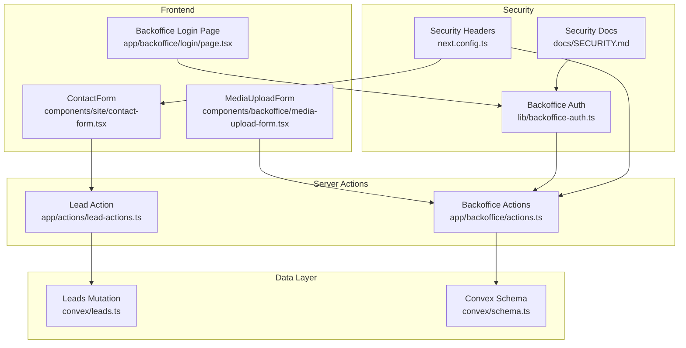
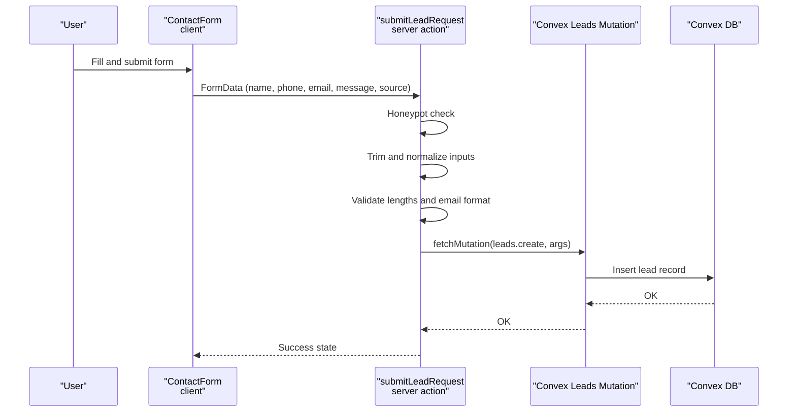
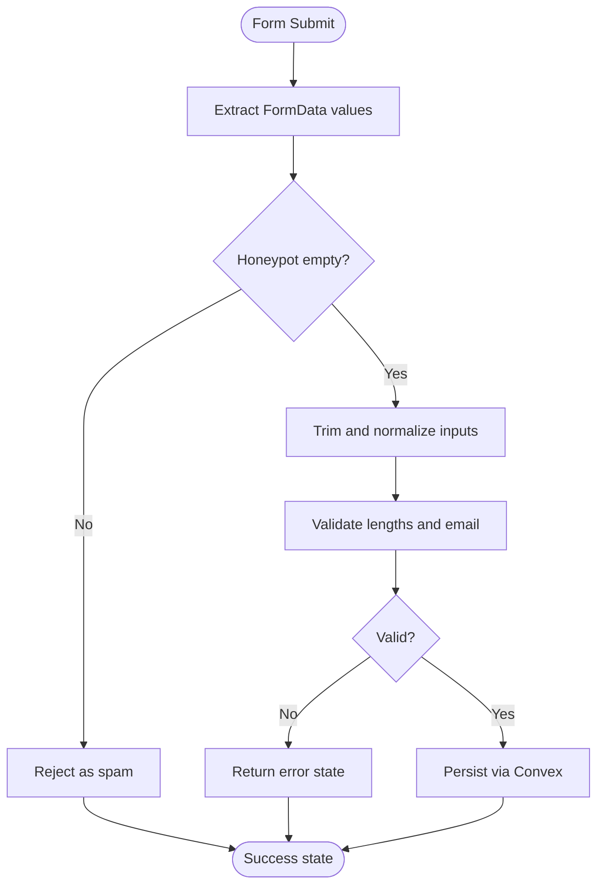
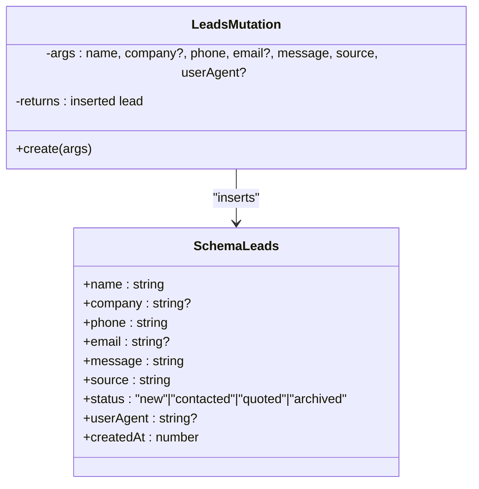
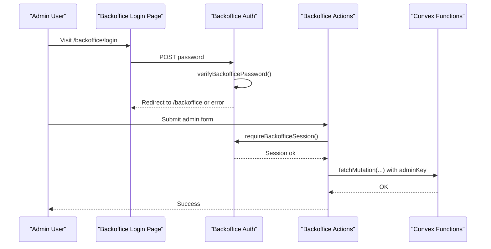
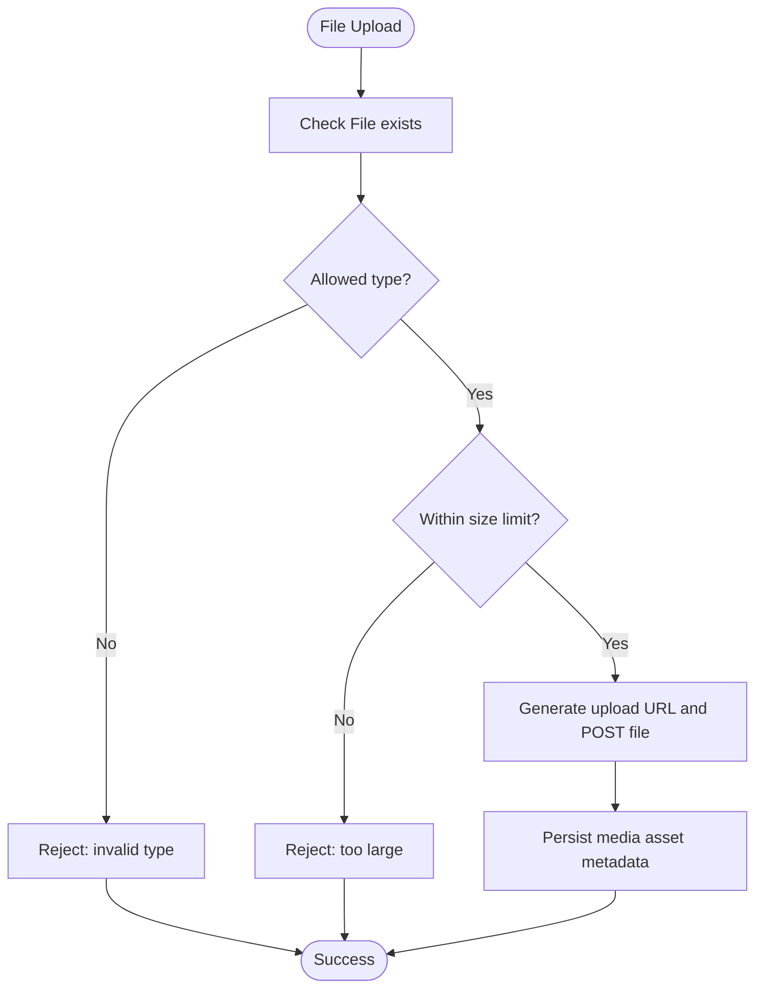
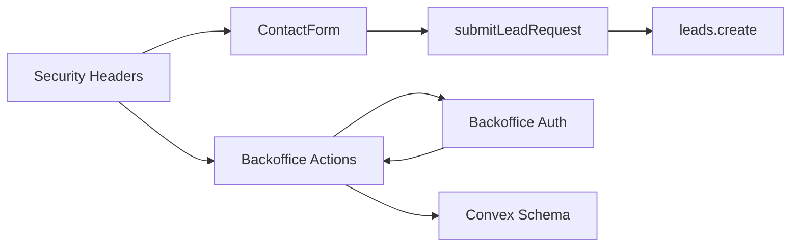

# Input Validation & Sanitization

<cite>
**Referenced Files in This Document**
- [lead-actions.ts](file://app/actions/lead-actions.ts)
- [contact-form.tsx](file://components/site/contact-form.tsx)
- [leads.ts](file://convex/leads.ts)
- [schema.ts](file://convex/schema.ts)
- [actions.ts](file://app/backoffice/actions.ts)
- [backoffice-auth.ts](file://lib/backoffice-auth.ts)
- [media-upload-form.tsx](file://components/backoffice/media-upload-form.tsx)
- [SECURITY.md](file://docs/SECURITY.md)
- [CONVEX.md](file://docs/CONVEX.md)
- [next.config.ts](file://next.config.ts)
- [login.page.tsx](file://app/backoffice/login/page.tsx)
</cite>

## Table of Contents
1. [Introduction](#introduction)
2. [Project Structure](#project-structure)
3. [Core Components](#core-components)
4. [Architecture Overview](#architecture-overview)
5. [Detailed Component Analysis](#detailed-component-analysis)
6. [Dependency Analysis](#dependency-analysis)
7. [Performance Considerations](#performance-considerations)
8. [Troubleshooting Guide](#troubleshooting-guide)
9. [Conclusion](#conclusion)

## Introduction
This document provides a comprehensive guide to input validation and sanitization across the application. It covers:
- Validation patterns for contact form submissions, lead data processing, and administrative inputs
- Sanitization techniques preventing XSS, SQL injection, and data corruption
- Filtering mechanisms for text fields, email validation, and file upload restrictions
- Rate limiting and abuse prevention measures
- Server-side validation workflows and error handling patterns
- Secure input processing, data sanitization functions, and validation middleware
- Security implications of different input types and measures ensuring data integrity

## Project Structure
The application follows a Next.js app-dir architecture with server actions and Convex for data persistence. Input validation occurs primarily in server actions and React components, while administrative inputs are protected by session-based authentication and API key checks.

**Diagram sources**
- [contact-form.tsx:17-91](file://components/site/contact-form.tsx#L17-L91)
- [lead-actions.ts:32-95](file://app/actions/lead-actions.ts#L32-L95)
- [media-upload-form.tsx:14-113](file://components/backoffice/media-upload-form.tsx#L14-L113)
- [actions.ts:63-214](file://app/backoffice/actions.ts#L63-L214)
- [backoffice-auth.ts:60-128](file://lib/backoffice-auth.ts#L60-L128)
- [leads.ts:7-31](file://convex/leads.ts#L7-L31)
- [schema.ts:4-86](file://convex/schema.ts#L4-L86)
- [next.config.ts:27-90](file://next.config.ts#L27-L90)
- [SECURITY.md:1-29](file://docs/SECURITY.md#L1-L29)
- [login.page.tsx:17-68](file://app/backoffice/login/page.tsx#L17-L68)

**Section sources**
- [contact-form.tsx:17-91](file://components/site/contact-form.tsx#L17-L91)
- [lead-actions.ts:32-95](file://app/actions/lead-actions.ts#L32-L95)
- [media-upload-form.tsx:14-113](file://components/backoffice/media-upload-form.tsx#L14-L113)
- [actions.ts:63-214](file://app/backoffice/actions.ts#L63-L214)
- [backoffice-auth.ts:60-128](file://lib/backoffice-auth.ts#L60-L128)
- [leads.ts:7-31](file://convex/leads.ts#L7-L31)
- [schema.ts:4-86](file://convex/schema.ts#L4-L86)
- [next.config.ts:27-90](file://next.config.ts#L27-L90)
- [SECURITY.md:1-29](file://docs/SECURITY.md#L1-L29)
- [login.page.tsx:17-68](file://app/backoffice/login/page.tsx#L17-L68)

## Core Components
- Contact form submission pipeline with server-side validation and sanitization
- Administrative input handlers with session and API key protection
- File upload restrictions and media asset creation
- Convex schema enforcing data types and indexes
- Security hardening via CSP, HSTS, and other headers

**Section sources**
- [lead-actions.ts:8-31](file://app/actions/lead-actions.ts#L8-L31)
- [actions.ts:16-51](file://app/backoffice/actions.ts#L16-L51)
- [media-upload-form.tsx:11-12](file://components/backoffice/media-upload-form.tsx#L11-L12)
- [schema.ts:4-17](file://convex/schema.ts#L4-L17)
- [next.config.ts:27-61](file://next.config.ts#L27-L61)

## Architecture Overview
The input validation and sanitization architecture ensures that all user-provided data is validated and normalized before being persisted or processed further. The flow is consistent across contact forms and administrative inputs.

**Diagram sources**
- [contact-form.tsx:17-91](file://components/site/contact-form.tsx#L17-L91)
- [lead-actions.ts:32-95](file://app/actions/lead-actions.ts#L32-L95)
- [leads.ts:7-24](file://convex/leads.ts#L7-L24)

**Section sources**
- [contact-form.tsx:17-91](file://components/site/contact-form.tsx#L17-L91)
- [lead-actions.ts:32-95](file://app/actions/lead-actions.ts#L32-L95)
- [leads.ts:7-24](file://convex/leads.ts#L7-L24)

## Detailed Component Analysis

### Contact Form Submissions
- Input collection: Hidden honeypot field "website" and visible fields "name", "company", "phone", "email", "message", "source".
- Client-side constraints: HTML5 attributes enforce minimum/maximum lengths and required fields.
- Server-side validation and sanitization:
  - Extract and trim values using a helper that safely handles FormData entries.
  - Normalize single-line inputs to collapse whitespace and truncate to safe lengths.
  - Normalize message content to standardize line breaks and limit length.
  - Email validation uses a basic regex pattern.
  - Honeypot trap silently rejects submissions with non-empty "website".
  - Persist only after successful validation and mutation execution.

**Diagram sources**
- [lead-actions.ts:15-30](file://app/actions/lead-actions.ts#L15-L30)
- [lead-actions.ts:51-70](file://app/actions/lead-actions.ts#L51-L70)
- [contact-form.tsx:33-65](file://components/site/contact-form.tsx#L33-L65)

**Section sources**
- [contact-form.tsx:17-91](file://components/site/contact-form.tsx#L17-L91)
- [lead-actions.ts:15-30](file://app/actions/lead-actions.ts#L15-L30)
- [lead-actions.ts:51-70](file://app/actions/lead-actions.ts#L51-L70)

### Lead Data Processing (Convex)
- Mutation arguments are strongly typed with enforced lengths and optional fields.
- Status defaults to "new" and timestamps are recorded automatically.
- Queries leverage indexes for efficient retrieval.

**Diagram sources**
- [leads.ts:7-24](file://convex/leads.ts#L7-L24)
- [schema.ts:5-17](file://convex/schema.ts#L5-L17)

**Section sources**
- [leads.ts:7-24](file://convex/leads.ts#L7-L24)
- [schema.ts:5-17](file://convex/schema.ts#L5-L17)

### Administrative Inputs
- Authentication: Password verification uses scrypt with constant-time comparison; session cookie is HttpOnly, signed, and scoped.
- Authorization: All backoffice actions require a valid session and a shared API key.
- Input normalization helpers:
  - getString trims values.
  - getOptionalString returns undefined for empty strings.
  - getOptionalId returns undefined for empty IDs.
  - getNumber parses numeric values with fallbacks.
  - getTimestamp supports numeric or ISO date strings with fallbacks.
  - slugify normalizes titles to slugs with length limits.
- Protected mutations:
  - Media upload URL generation requires session and API key.
  - Media asset creation enforces length limits on filenames, alt texts, and content types.
  - Content updates (products, categories, blog posts, settings) enforce lengths and booleans.

**Diagram sources**
- [login.page.tsx:41-54](file://app/backoffice/login/page.tsx#L41-L54)
- [backoffice-auth.ts:41-58](file://lib/backoffice-auth.ts#L41-L58)
- [backoffice-auth.ts:110-118](file://lib/backoffice-auth.ts#L110-L118)
- [actions.ts:79-108](file://app/backoffice/actions.ts#L79-L108)
- [actions.ts:130-151](file://app/backoffice/actions.ts#L130-L151)
- [actions.ts:153-174](file://app/backoffice/actions.ts#L153-L174)
- [actions.ts:176-199](file://app/backoffice/actions.ts#L176-L199)
- [actions.ts:201-214](file://app/backoffice/actions.ts#L201-L214)

**Section sources**
- [login.page.tsx:17-68](file://app/backoffice/login/page.tsx#L17-L68)
- [backoffice-auth.ts:41-58](file://lib/backoffice-auth.ts#L41-L58)
- [backoffice-auth.ts:110-118](file://lib/backoffice-auth.ts#L110-L118)
- [actions.ts:16-51](file://app/backoffice/actions.ts#L16-L51)
- [actions.ts:79-108](file://app/backoffice/actions.ts#L79-L108)
- [actions.ts:130-151](file://app/backoffice/actions.ts#L130-L151)
- [actions.ts:153-174](file://app/backoffice/actions.ts#L153-L174)
- [actions.ts:176-199](file://app/backoffice/actions.ts#L176-L199)
- [actions.ts:201-214](file://app/backoffice/actions.ts#L201-L214)

### File Upload Restrictions
- Allowed types: JPEG, PNG, WebP.
- Max size: 5 MB.
- Frontend validation prevents empty files and invalid types.
- Backend enforces size and type checks before generating upload URLs and persisting metadata.

**Diagram sources**
- [media-upload-form.tsx:19-77](file://components/backoffice/media-upload-form.tsx#L19-L77)
- [actions.ts:79-108](file://app/backoffice/actions.ts#L79-L108)

**Section sources**
- [media-upload-form.tsx:11-42](file://components/backoffice/media-upload-form.tsx#L11-L42)
- [actions.ts:79-108](file://app/backoffice/actions.ts#L79-L108)

### Email Validation
- Regex-based validation ensures basic format compliance.
- Optional email fields are accepted when blank; otherwise must match the pattern.

**Section sources**
- [lead-actions.ts:28-30](file://app/actions/lead-actions.ts#L28-L30)
- [lead-actions.ts:65-70](file://app/actions/lead-actions.ts#L65-L70)

### Text Field Normalization
- Single-line normalization collapses whitespace and truncates to safe lengths.
- Message normalization standardizes line breaks and limits length to prevent oversized payloads.

**Section sources**
- [lead-actions.ts:20-26](file://app/actions/lead-actions.ts#L20-L26)
- [lead-actions.ts:51-56](file://app/actions/lead-actions.ts#L51-L56)

### Rate Limiting and Abuse Prevention
- Honeypot field: Hidden input "website" catches automated submissions.
- Session-based authentication: HttpOnly, signed cookies with expiration.
- API key protection: All protected Convex functions require a shared secret.
- Content Security Policy and transport security headers reduce XSS and downgrade risks.

**Section sources**
- [lead-actions.ts:35-42](file://app/actions/lead-actions.ts#L35-L42)
- [backoffice-auth.ts:60-76](file://lib/backoffice-auth.ts#L60-L76)
- [backoffice-auth.ts:120-128](file://lib/backoffice-auth.ts#L120-L128)
- [SECURITY.md:5-15](file://docs/SECURITY.md#L5-L15)
- [next.config.ts:27-61](file://next.config.ts#L27-L61)

### Server-Side Validation Workflows
- Lead submissions:
  - Honeypot check
  - Environment readiness check
  - Trimming and normalization
  - Length and email validation
  - Mutation execution with sanitized inputs
- Administrative actions:
  - Session verification
  - Input parsing with safe defaults
  - Length enforcement for strings
  - Mutation execution with admin key

**Section sources**
- [lead-actions.ts:32-95](file://app/actions/lead-actions.ts#L32-L95)
- [actions.ts:63-77](file://app/backoffice/actions.ts#L63-L77)
- [actions.ts:84-108](file://app/backoffice/actions.ts#L84-L108)

### Error Handling Patterns
- Structured response states with status and messages for client feedback.
- Try/catch around mutations to handle transient failures gracefully.
- Redirects on authentication failures for backoffice login.

**Section sources**
- [lead-actions.ts:8-11](file://app/actions/lead-actions.ts#L8-L11)
- [lead-actions.ts:89-94](file://app/actions/lead-actions.ts#L89-L94)
- [login.page.tsx:50-54](file://app/backoffice/login/page.tsx#L50-L54)

## Dependency Analysis
The validation and sanitization logic depends on:
- Server actions for centralized validation and mutation execution
- Convex schema and mutations for data persistence
- Authentication utilities for session and API key enforcement
- Security headers for transport and content protection

**Diagram sources**
- [contact-form.tsx:17-91](file://components/site/contact-form.tsx#L17-L91)
- [lead-actions.ts:32-95](file://app/actions/lead-actions.ts#L32-L95)
- [actions.ts:63-214](file://app/backoffice/actions.ts#L63-L214)
- [backoffice-auth.ts:60-128](file://lib/backoffice-auth.ts#L60-L128)
- [schema.ts:4-86](file://convex/schema.ts#L4-L86)
- [next.config.ts:27-61](file://next.config.ts#L27-L61)

**Section sources**
- [contact-form.tsx:17-91](file://components/site/contact-form.tsx#L17-L91)
- [lead-actions.ts:32-95](file://app/actions/lead-actions.ts#L32-L95)
- [actions.ts:63-214](file://app/backoffice/actions.ts#L63-L214)
- [backoffice-auth.ts:60-128](file://lib/backoffice-auth.ts#L60-L128)
- [schema.ts:4-86](file://convex/schema.ts#L4-L86)
- [next.config.ts:27-61](file://next.config.ts#L27-L61)

## Performance Considerations
- Keep normalization and validation lightweight to avoid blocking the server action execution.
- Use minimal regex patterns for email validation to reduce CPU overhead.
- Limit maximum lengths early to prevent large allocations during mutation processing.
- Offload heavy tasks to Convex queries and avoid synchronous blocking operations in server actions.

## Troubleshooting Guide
- Contact form errors:
  - Ensure NEXT_PUBLIC_CONVEX_URL is set; otherwise validation short-circuits with an environment error.
  - Verify honeypot field remains empty; any value triggers spam rejection.
  - Confirm required fields meet minimum length thresholds.
- Authentication failures:
  - BACKOFFICE_SESSION_SECRET and BACKOFFICE_API_KEY must be configured.
  - Session cookie must be present, signed, and unexpired.
- File uploads:
  - Confirm file type is one of allowed types and size is under 5 MB.
  - Ensure upload URL generation succeeds before posting the file.

**Section sources**
- [lead-actions.ts:44-49](file://app/actions/lead-actions.ts#L44-L49)
- [lead-actions.ts:35-42](file://app/actions/lead-actions.ts#L35-L42)
- [lead-actions.ts:58-63](file://app/actions/lead-actions.ts#L58-L63)
- [backoffice-auth.ts:19-25](file://lib/backoffice-auth.ts#L19-L25)
- [backoffice-auth.ts:120-128](file://lib/backoffice-auth.ts#L120-L128)
- [media-upload-form.tsx:32-42](file://components/backoffice/media-upload-form.tsx#L32-L42)

## Conclusion
The application implements robust input validation and sanitization across contact forms and administrative inputs. Server-side validation ensures data integrity, while session-based authentication and API keys protect sensitive operations. File uploads are restricted to safe types and sizes. Security headers and policies mitigate common web vulnerabilities. Together, these measures provide a strong foundation for secure data handling.